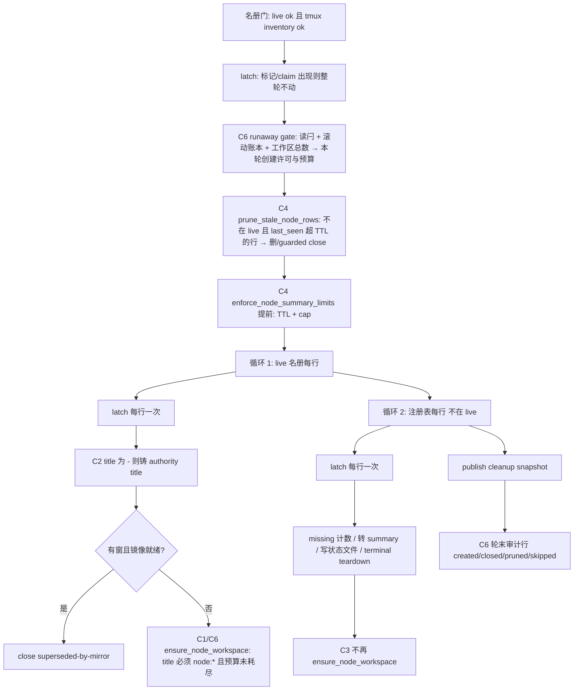
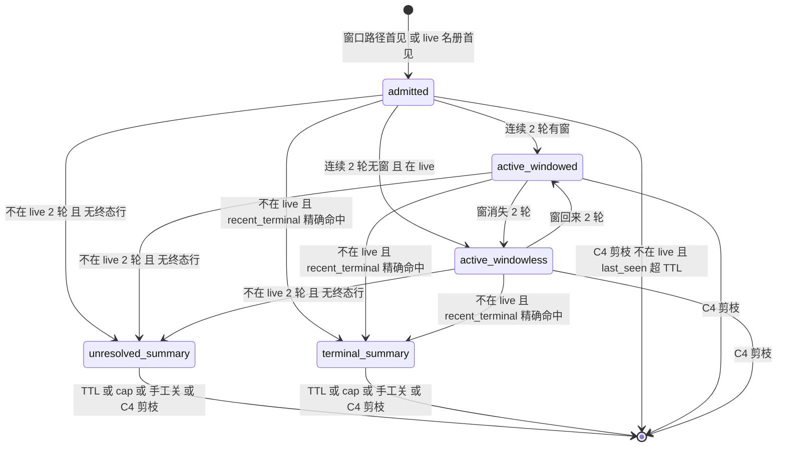

# FLY-2829 陈旧注册表批量补镜像 — 实施计划
Issue: FLY-2829 (https://linear.app/geoforge3d/issue/FLY-2829/病根cmux-撤维护标记后同步器照-1800-行陈旧-cmux-node-registry-给已结束会话批量补镜像-33-分钟刷出-154)
日期: 2026-09-23
基于: research.md

**版本**: v5（Codex R1 8 + R2 6 + R3 4 + R4 3 条全部采纳） · **状态**: codex-reviewed，leadAcceptance 放行（见 §9）

## 0. 一句话

在 `scripts/flywheel-cmux-sync.sh` 的节点存在面里做四件事——**先剪枝再创建、不为非 live 会话创建、title 不合法零创建、轮内每行看一次维护标记**——外加一个跨重启持久的创建限速闩；用不碰生产 cmux 的 soak harness 证明 1800 行陈旧注册表 30 分钟不增长，且修复前的脚本在同一 harness 下复现刷屏。

## 1. 目标 / 非目标

目标（一一对应 issue 修复要求 1–5）：

| # | 要求 | 本计划 |
|---|---|---|
| 1 | 注册表能收缩 | C4：轮首剪枝 + 回收提前 |
| 2 | 不给已结束会话建镜像 | C3：循环 2 零创建；C1：title 负向护栏 |
| 3 | 运行中响应维护标记 | C5：循环内 latch |
| 4 | 失控护栏 | C6：三层限速 + 自停闩 + 告警 |
| 5 | 验收 | C8：soak harness（含阴性对照）+ §7 生产观察 |

非目标：watcher 重启风暴的根因（FLY-2207/2770 范畴）；title migration/prepared stall 机器；view ledger 与 mirror 清扫；Bridge API；历史无回执空壳的自动清扫；维护标记的永久撤除（§7 是操作顺序，不是代码）。

## 2. 设计总览

### 2.1 修复后的一轮 `reconcile_node_presence`



### 2.2 注册表行的生命周期（修复后）



只有 `active_windowless`（在 live 名册里且无窗）这一种状态会**创建** node 工作区；两类 summary 只会**改写**已存在工作区的状态文件，直到被回收。

## 3. 变更清单

所有代码改动在 `scripts/flywheel-cmux-sync.sh`，除 C7（truth.ts / ci.yml / ci-structure）与 C8（新脚本）。函数名/常量名在此定死，实现不得改名。

### C1 `ensure_node_workspace` 负向护栏 + 审计行

- 入口第一行（在 `build_node_status_command` 之前）：`[[ "$title" == node:* ]] || { log "WARN: node workspace refused: title is not a node authority title exec=$exec_id title=$title"; return 1; }`。这条把 exploration §2.3 的空壳诞生点从「账本 upsert 拒绝」前移到「任何 cmux 调用之前」——**结构性保证无回执 node 工作区不可能被本函数创建**。
- 在 `cmux_call_guarded _node_workspace_guard new-workspace` 成功返回并 diff 出唯一新 ref 之后，写一行 `log "[audit] node create exec=$exec_id title=$title ref=$ref round=${CMUX_ADDITIVE_ROUND_ID:-0-0}"`；`close_node_workspace` 成功后写 `[audit] node close exec=… title=… ref=… reason=…`。审计行不进 episode allowlist（普通 log）。
- 负测试：title=`-`、空、`Terminal 3`、`FLY-1-qa`（managed runner title）各一，断言 mock cmux 的 `new-workspace` 调用数为 0、账本为空、返回 1。

### C2 循环 1 给 admitted 行补铸 authority title

- `reconcile_node_presence` 循环 1 的 `if [[ -n "$old" ]]` 分支：读出 `title` 后，`if [[ "$title" == "-" ]]; then title=$(node_allocate_authority_title "$exec_id" "$identifier" "$role") || continue; fi`（`alias` 同步用 `node_display_alias` 重算）。`node_allocate_authority_title` 已保证与现存 title 不撞（`:1378`）。
- `admit_node_identity_for_window` 不改：它的合同（FLY-1884 §5.4）就是最小行。
- 测试：预置 `exec-x|-|-|admitted|…` + live 名册含 exec-x 且无窗 → 两轮后注册行 title 为 `node:*`、`ensure_node_workspace` 记录器收到 `exec-x|node:*`；同名 alias 的第二个 exec 得到不同后缀。

### C3 循环 2 零创建

- 删除循环 2 末尾的 `ensure_node_workspace "$exec_id" "$title" "$status_path" || true` 及其 `status_path=` 赋值；保留 `node_write_status_file`（已存在的 node tab 会显示『已结束』/『失联』）与 `terminal_teardown_observe`。
- **删减依据（Lead 2026-09-24 裁定，question 0b2630d8）**：founder 9-20 亲口定的 cmux 契约是「①所有在跑的 Lead 和体都能在 cmux 看到；②跑完的自动拿掉」。FLY-1884 的「事后为已结束会话补建『已结束』摘要 tab」恰好违反第②条，所以本单把它删掉：不在 live 名册的会话一律不新建 node tab；只有**已存在**的 node tab 才转『已结束/失联』摘要并按 TTL/cap 回收。这不是为省事砍功能，是把实现拉回契约。
- 保留一个显式常量 `NODE_SUMMARY_CREATE_POLICY=never`，`case` 只接受 `never`；若将来契约变更需要「recent_terminal 精确命中时补建」，唯一切换点是加 `terminal-only` arm，本单不实现第二个 arm。
- 测试（改造 `fly1884-node-presence.test.sh` 的 reconcile 段）：注册表 1 行 unresolved/title=`-` + 1 行 terminal/title=`node:x`，live 为空，跑两轮 → `ENSURED` 为空、两行状态文件存在且标签正确；再验「有 committed 回执的 summary 行在 TTL 到期后被 `gc_node_summary` 关闭」路径不变。

### C4 轮首剪枝 + 回收提前

新函数 `prune_stale_node_rows now`，在 `reconcile_node_presence` 的名册门与 latch 之后、循环 1 之前调用。**在它之前先无条件跑一次 `reconcile_node_ledger`（Codex R3-1）**：这是 C4-b 收敛器进入每轮必经路径的唯一入口（现有唯一调用点在 `ensure_node_workspace` 内，live 名册为空时永远不会被调到）；它返回非零（JSON 不可读等）→ 本轮 `log "node ledger reconcile inconclusive; node presence round preserved"` 并 `return 0`（零剪枝、零创建、零状态写入）。`enforce_node_summary_limits "$now"` **轮首、轮末各调一次**（轮首防历史积压挡住回收，轮末约束本轮循环 2 新转出的 summary——Codex R1-6；C3 已保证循环 2 零创建，轮末回收不会重引入事故）。

剪枝候选（对注册表**快照**逐行，先 `cat` 到变量再循环）：

1. exec ∈ `RUNNER_EXPECTED_EXEC_IDS` → 跳过（快照里 live 的行永不剪）；
2. `now - last_seen < ttl_seconds`（`ttl` 复用 `FLYWHEEL_CMUX_NODE_SUMMARY_TTL_HOURS`，默认 24，同样的 1..168 夹取）→ 跳过；
3. **回执身份判定（Codex R1-1）**：账本里**任何 generation** 存在 `$4 == exec` 或 `$5 == title` 的行（prepared / committed / 旧 generation 皆算）→ **不直删**：
   - 当前 generation committed 且恰一 → `close_node_workspace exec title stale-registry`（见守卫），成功后按 §4 顺序收尾；
   - 其余（prepared、旧 generation、多行）→ 本轮跳过并 `log "node prune deferred: receipt pending exec=… title=… state=…"`，交给现有 `reconcile_node_ledger` / FLY-1884 prepared stall GC（`node-absent`/`node-drift`）先把回执收敛；回执归零后下一轮再进入直删分支。**永远不会出现「回执还在、注册行没了」**——`_node_workspace_guard` 依赖注册行重读（`:1980-1985`），直删会让 prepared 工作区永久无法 commit/close；
4. 账本零行 → 还要证明 cmux 里**没有**可识别的同名工作区：`get_cmux_workspaces_json` 可读且 title 不是 `-` 时数 title ∈ {title, status command} 的工作区，`== 0` 才直删；JSON 不可读 → 本轮跳过（preserve）；title 为 `-` 的行无可识别工作区，只要账本零行即可直删；
5. **mutation-time 活性复核（Codex R1-2）**：直删或 guarded close **之前**，调用新函数 `node_exec_live_now exec`：重新 `_fetch_runner_roster_json 'mode=live'` + `_parse_runner_roster_json live`，exec 在其中 → 跳过本行且写回 `last_seen=now`（它又活了）；拉取/解析失败 → 跳过（preserve）。这与 `terminal_teardown_roster_still_exact`（`:1784-1795`）在破坏性事务边界重拉名册的纪律一致；
6. 每轮最多剪 `PRUNE_BATCH_MAX=200` 行（常量，不做旋钮）：既给每行一次 loopback HTTP 复核封顶（≈ 200 × 20 ms），也把单轮爆炸半径封顶；1800 行约 9 轮剪完。

§4 收尾顺序与崩溃窗口（每步幂等，恢复者写死）：

| 步 | 动作 | 崩在此步之后 | 恢复者 |
|---|---|---|---|
| a | `close_node_workspace`（内部：guarded close → `_node_ledger_remove`） | 工作区已关、账本行已删、注册行/状态文件仍在 | 下一轮同一行：账本零行 → 步 4/5 → 直删分支 |
| a' | close 成功但 `_node_ledger_remove` 前崩（seam `node_prune_crash_point after-close-before-ledger-remove` 就放在 `close_node_workspace` 内这两步之间） | 工作区已关、账本行仍 committed（当前 generation） | **本单新增的 node 账本 absent 收敛（C4-b，Codex R2-1）**：当前 generation 的 committed/prepared 行 ref 在完备快照里 conclusively absent → 经 sidecar 计数后纯账本行移除；再下一轮走直删分支 |

**C4-b node 账本 absent/drift 收敛（Codex R2-1：现有代码没有这个恢复者）**。`reconcile_node_ledger`（`:2040`）目前只处理旧 generation 且 ref 缺失的行，当前 generation 的 committed 行在 `[[ "$state" == prepared ]] || continue` 处跳过；`node-absent`/`node-drift` 两个 sidecar kind 只在校验 allowlist 里有名字，没有 producer。本单补齐：

- 在 `reconcile_node_ledger` 的当前 generation 分支加：ref ∉ 快照 refs（快照来自同一次 `get_cmux_workspaces_json`，不可读则整个函数已 `return 1`）→ `_prepared_stall_observe node-absent "$generation" "$ref" "$title"`（复用现有 sidecar：`FLYWHEEL_CMUX_PREPARED_MIN_AGE_SECONDS` 最小年龄、`FLYWHEEL_CMUX_PREPARED_ABSENT_PASSES` 阈值，对 prepared 与 committed 一视同仁）；计数达阈 → `_node_ledger_remove` + `_prepared_stall_clear` + `[audit] node ledger absent-gc …`；ref 重新出现 → `_prepared_stall_clear`；
- drift（ref 在场、**prepared 或 committed**）→ `_prepared_stall_observe node-drift …`，达阈 **只告警一次**（`cmux_cleanup|node-receipt-drift|…`）并保持 deferred，不 GC、不改名——founder 手工改名过的页面不由机器抢回。**drift 的判定与 `_node_workspace_guard` 的允许集同源（Codex R4-2）**：prepared 行先由 `complete_node_title_migration` 尝试 migration；被 guard 拒绝后，从同一份完备快照同时分类 **workspace title** 与 **single-surface title**——workspace title ∉ {node title, status command, `~`, `Terminal N`} **或** surface title ∉ {node title, status command}，任一成立即计 drift（覆盖「workspace title 已正确、founder 只改了 tab 标题」这种 migration 永远被拒的形态）；committed 行沿用现有 readiness 合同（workspace title ≠ node title 即 drift，surface 动态标题不比较）。ref 缺失走 absent，不计 drift；
- **`ensure_node_workspace` 的即时 committed-absent 删除分支（`:2076-2087`：committed 且工作区不就绪、ref 不在一次 JSON 快照里 → 直接 `_node_ledger_remove`）改为 `return 1`**（Codex R3-1）：它不再自己删账本，只消费轮首 reconciler 的多轮结论；这样 committed-absent 只有一条路径、一个阈值；
- `_prepared_stall_sweep_orphans` 目前只对 view kind 按 `VIEW_LEDGER` 清孤儿、对 `node-*` 行逐字节保留：加一段同款 awk 以 `NODE_LEDGER` 为 live 源清 `node-absent|node-drift` 孤儿行（账本不可读 → 保留）；
- 因此 v2 的「任何账本行都阻止直删」不再造成永久 deferred：committed-absent / prepared-absent 在 `ABSENT_PASSES` 轮后自然归零，旧 generation 行由现有分支移除。

测试（C4-b，**全部通过真实 `reconcile_node_presence` 驱动，不直接调用 reconciler**）：live 名册为空 + 孤儿 committed-absent 回执 → N 轮后账本行消失且工作区零 mutation；live 为空 + prepared-absent 同；committed-drift（workspace title 被改）与 prepared-drift 两种（① workspace title 被改；② **workspace title 正确、只有 surface/tab title 被改成自定义值**）→ 各自达阈后告警一次、账本保留、不改名；ref 在第 2 轮重现 → sidecar 清零；旧 generation ref absent → 立即移除（现有行为回归）；真正的 close → `_node_ledger_remove` 之间 kill -KILL（seam）→ 重启后由 `reconcile_node_presence` 在 N 轮内收敛到直删；`ensure_node_workspace` 对 committed-absent 返回 1 且账本行仍在（旧分支已改）。
| b | `rm -f status` | 状态文件没了，注册行在 | 下一轮直删分支，`rm -f` 幂等 |
| c | `node_registry_remove_exec` | 完成 | — |
| d | `[audit] node prune exec=… state=… age=…s receipt=none\|closed` | — | 审计缺行不影响状态 |

守卫：
- 只在 `RUNNER_EXPECTED_STATE == ok` 时运行（函数内再断言一次）；
- `_node_close_guard` 新增 arm：`stale-registry:admitted|stale-registry:active-windowed|stale-registry:active-windowless|stale-registry:unresolved-summary|stale-registry:terminal-summary`；guard 内调用 `node_exec_live_now`（不是重读内存快照）——live 或拉取失败都阻断；
- 每行剪枝前 `watcher_mutation_latch_clear || return 0`；
- 一次性备份：本轮候选行数 > 100 且 `${NODE_REGISTRY}.pre-FLY-2829` 不存在 → 先 `cp` 一份再剪；已存在则不覆盖。

时间复杂度：首轮候选 ≈1700 行，实际剪 200 行/轮，每行 1 次 loopback HTTP + awk/python 校验 ≈ 60 ms → 每轮 ≈ 12 s；无回执行零 cmux 调用（title=`-`）或一次 list-workspaces（node: 行，且同轮复用一次 JSON 读）。

测试：
- 三行注册表（live 且老 / 非 live 且新 / 非 live 且老无回执）→ 只剪第三行；
- 非 live 且老且有 committed 回执 → mock close 成功 → 账本/注册/状态全清；mock close 失败 → 三处全留；
- **prepared 回执行**（当前 generation）→ 零改动 + `deferred` 日志；旧 generation 回执行 → 零改动；
- **竞态**：初始快照后把目标 exec 翻成 live（fixture 名册第二次返回含它）→ cmux/账本/注册/状态零改动且 `last_seen` 被刷新；复核拉取失败（fixture 返回 500）→ 零改动；
- JSON 不可读 + node: title 行 → 跳过；title=`-` 行 → 直删；
- rebuild 路径账本：`--rebuild-views --execute`（无 additive round）创建一次 → reservation 行 round=`-` → 取消/提交后下一 pass 的 `workspace_create_gate_begin` 仍判账本合法（Codex R4-1）；
- 崩溃注入：用 `FLYWHEEL_CMUX_PRUNE_CRASH_AT=after-close-before-ledger-remove|after-close|after-status`（与 `terminal_teardown_crash_point` 同款 seam；第一个点位于 `close_node_workspace` 内 guarded close 与 `_node_ledger_remove` 之间；生产不设置）在子 shell 里 kill -KILL，然后再跑若干轮 → 收敛到三处全清；
- 名册 indeterminate → 零改动；
- 备份：预置 150 行老行 → 备份文件出现且逐字节等于剪前注册表；第二轮再剪不覆盖备份；
- 批次上限：预置 500 行老行 → 第一轮剪 200 行，第三轮剪完；
- 回收提前 + 轮末：预置 31 行 summary（有 committed 回执）→ 循环 1 开始前工作区数已是 30；另一组：31 行在同一轮由循环 2 刚转 summary → 轮末 cap 后注册表 summary 行 ≤ 30。

### C5 循环内维护检查点

- 循环 1、循环 2 各自的 `while … read` 体第一行加 `watcher_mutation_latch_clear || return 0`（`prune_stale_node_rows` 内同样）。
- `--once`/`--refresh` 路径 `MUTATOR_LEASE_MODE≠watch`，latch 恒返回 0，行为不变。
- 测试：live 名册 5 行，`ensure_node_workspace` 记录器在第 2 次调用时 `touch "$FLYWHEEL_CMUX_MAINTENANCE_MARKER"`（模拟 Lead 放回标记），`MUTATOR_LEASE_MODE=watch WATCHER_PASS_ACTIVE=1` 下跑一轮 → 记录器恰好 2 条，`WATCHER_MAINTENANCE_STOP==1`，日志含 `aborting remaining mutation at safe boundary`。

### C6 失控护栏（三层 + 自停闩）

新文件与常量：

| 名 | 默认 | 说明 |
|---|---|---|
| `NODE_CREATE_LEDGER` | `~/.flywheel/state/cmux-node-create-ledger` | 行 `epoch\|kind\|subject\|ref\|round\|status`（6 列，schema 见 §4）；kind ∈ `node\|view`，status ∈ `reserved\|created`。owner-only 普通文件 |
| `NODE_RUNAWAY_LATCH` | `~/.flywheel/state/cmux-node-runaway` | 单行 `runawayv1\|epoch\|count\|window_seconds\|pid`。**存在即闩上**（含畸形/符号链接） |
| `FLYWHEEL_CMUX_CREATE_BURST_MAX` | 20（1..200） | 短窗口内允许的 `new-workspace` 次数（node + view 共用；第一层，Codex R3-2：用账本滚动窗口而非 additive round，天然跨重启） |
| `FLYWHEEL_CMUX_CREATE_BURST_SECONDS` | 60（15..600） | 短滚动窗口长度 |
| `FLYWHEEL_CMUX_CREATE_WINDOW_SECONDS` | 600（60..3600） | 长滚动窗口（第二层，超限即闩） |
| `FLYWHEEL_CMUX_CREATE_WINDOW_MAX` | 60（1..1000） | 窗口内累计创建上限，超过即闩 |
| `FLYWHEEL_CMUX_WORKSPACE_CEILING` | 150（10..2000） | cmux 工作区总数 ≥ 此值时零创建 |

机制：

1. **pass 序号与惰性初始化（Codex R1-4）**：全局 `CREATE_GATE_PASS=""`、`CREATE_GATE_STATE=uninitialized`（进程初态 = fail-closed）。`watcher_begin_pass`、`run_mutator_once`（once/refresh/reaper）、`run_rebuild_views` 的 execute 入口各自把 `WATCHER_PASS_SEQ` 加一。`workspace_create_admitted` 发现 `CREATE_GATE_PASS != WATCHER_PASS_SEQ` 时先调 `workspace_create_gate_begin`——所以 event drain（15 s tick，可能早于 additive tick）、`--once`、`--rebuild-views --execute`、V2 Lead create 全部在同一门后；`WATCHER_PASS_SEQ` 为空（没有任何 pass 入口）→ 永远拒绝。
2. `workspace_create_gate_begin`（每 pass 一次）：
   - 账本校验（§4）：非 owner（`stat -f %u` ≠ `id -u`）/ 符号链接 / 畸形 → `CREATE_GATE_STATE=fail-closed` + 一次告警；合法则丢弃 `epoch < now - 86400` 的行（mktemp+mv）；
   - 闩存在（任何形态）→ `latched`；
   - `window_count` = 窗口内行数（**含 reservation 行**）；`window_count ≥ WINDOW_MAX` → 写闩 + 告警 `cmux_cleanup|workspace-create-runaway|epoch=$now` + `latched`；
   - `get_cmux_workspaces_json` 不可读 → `fail-closed`；`workspace_count ≥ CEILING` → `ceiling` + 告警（signature 含 generation）；
   - **第一层也是滚动窗口（Codex R3-2：additive round id 每次 bootstrap 都会被 `begin_cmux_additive_round` 重新铸造，不能当预算纪元）**：`burst_count` = 账本里 `epoch ≥ now − BURST_SECONDS` 的行数（reserved + created）。没有任何「纪元」概念：bootstrap pass、event drain、additive pass、进程重启，全都对同一个 60 s 窗口计数。reservation 第 5 列固定写当时的 `CMUX_ADDITIVE_ROUND_ID`（为空写 `-`），**只作审计，不参与任何计算**；
   - 否则 `open`，**`CREATE_BUDGET_LEFT = max(0, min(BURST_MAX − burst_count, WINDOW_MAX − window_count, CEILING − workspace_count))`**（59/149 边界下预算分别是 1/1；60 s 内已 19 → 1）。每个 pass 重算一次（账本是真相，pass 内用 `CREATE_BUDGET_LEFT--` 只是省一次读文件）；
   - **公平合同（Codex R1-5 / R2-3）**：`NODE_RESERVE = min(CREATE_BUDGET_LEFT, max(2, CREATE_BUDGET_LEFT / 4))`（整除），`VIEW_CAP = max(0, CREATE_BUDGET_LEFT − NODE_RESERVE)`；view 类累计不超过 `VIEW_CAP`，node 类可用全部剩余（含 view 没用完的）。预算 1 时 reserve=1、view 0。`sync_additive` 先遍历 missing view 再 `reconcile_node_presence`，这保证连续多轮 > budget 个 missing view 时每轮仍有 ≥ min(2, 预算) 个 active-windowless node 得到页面；滚动总上限不变；
   - **上限在 mutation 边界重验，且只在创建路径（Codex R2-2 / R3-3）**：三个共享 guard（`_node_workspace_guard` 还保护 rename 并被 `_node_close_guard` 复用；`_v2_lead_workspace_guard` 还保护 V2 Lead 的 rename-workspace/rename-tab）**一律不改**。唯一包装器 `reserved_new_workspace` 内部组合一个 create-only guard `_reserved_create_guard`：先调用传入的原 guard，再调用 `_workspace_ceiling_guard`（重新 `get_cmux_workspaces_json`，不可读或 `count ≥ CEILING` → 返回 1）；只有这个组合 guard 被交给 `cmux_call_guarded … new-workspace`。guard 阻断 → `GUARD_WAS_BLOCKED=1` → reservation 取消。测试：count=150 时三个 create 全部阻断，同时 node close、node title migration、V2 Lead title migration 照常执行。
3. **reservation 先于 cmux（Codex R1-3）**：`workspace_create_reserve kind subject` 在 `cmux_call_guarded … new-workspace` **之前**以 mktemp+mv 追加一行 `epoch|kind|subject|-|round|reserved` 并 `CREATE_BUDGET_LEFT--`（kind 配额同步扣）；写失败 → 视为拒绝（不调 cmux）。调用后：
   - `GUARD_WAS_BLOCKED==1`（guard 是 spawn 前的最后一步，证明 cmux 未被调用）→ `workspace_create_cancel` 删除该 reservation 行并归还预算；
   - 其余任何结果（rc≠0、post-read 不可读、diff 不唯一、账本写失败、成功）→ reservation **保留并占用窗口与预算**；成功时把 `-` 改成 ref、`reserved` 改成 `created`；失败保持 `reserved`（对窗口计数等价）。
   - 崩在 cmux 调用后：reservation 已落盘，重启后窗口计数包含它——「跨重启」由此成立。
4. **唯一 chokepoint 包装器（Codex R1-4 / R2-3）**：新函数 `reserved_new_workspace guard_fn kind subject -- <cmux args>`：`workspace_create_admitted kind` → `workspace_create_reserve` → `cmux_call_guarded "$guard_fn" new-workspace <args>` → 按 §3 规则 cancel/keep。现有三处直接调用（`ensure_node_workspace` `:2109` kind=node、`create_workspace_for_window` `:10407` kind=view、`ensure_v2_lead_workspace` `:5387` kind=view）全部改为经包装器。静态守卫测试：`grep -cE 'cmux_call_guarded +"?\$?[A-Za-z_]+"? +new-workspace' scripts/flywheel-cmux-sync.sh` **恰为 1**，且该行位于 `reserved_new_workspace` 函数体内（awk 按函数边界定位）；注释与日志文本里的 `new-workspace` 不计入（现有 `:3478` 注释、`:10409` 日志不受影响）。
5. 闩的清除只有操作员 `rm`；**操作员合同（Codex R1-3 / R2-4）**：`rm` 闩后若窗口内计数仍 ≥ `WINDOW_MAX`，下一 pass 会立即再闩——闩是症状记录，账本才是事实。**禁止在 watcher 活跃时动账本**（它会与 watcher 的 mktemp+mv 事务竞争，可能抹掉刚落盘的 reservation）。告警文案只引用这条有序流程：① 写维护标记 → ② `flywheel-cmux-sync --probe-lease` 返回 0（watcher 已让出租约）→ ③ 用 owner-only 临时文件 + `mv` 把账本替换为空文件（或保留 24 h 外的行）→ ④ `rm` 闩 → ⑤ 撤标记。任何模式都不自动清。测试：闩在 + 账本 60 行 + `rm` 闩 → 下一 pass 再闩；按流程①–⑤后 → 恢复。
6. 轮末一行：`log "node presence round=$round live=$n created=$c closed=$k pruned=$p deferred=$d budget_left=$b gate=$CREATE_GATE_STATE"`。

fail-closed 语义：账本畸形、闩畸形、JSON 不可读、pass 未初始化 → 本 pass 零创建，但 close/状态文件/剪枝照常。自停 = 停创建，**不退出进程**（退出会触发 KeepAlive 重启风暴，每次重启从头 bootstrap 正是事故放大器）。

测试：
- 预算：live 25 行无窗 + mock 创建成功 → 本 pass 20 条 `[audit] node create`，5 条 refused，账本 20 行 `created`；60 s 内的下一个 pass 预算为 0；把账本里的 epoch 人为前移 60 s 后再跑 → 再 5 条；
- 边界：账本 59 行在窗口内 → 预算 1；mock JSON 149 个工作区 → 预算 1；150 → 0 + 告警；
- 窗口：预置账本 60 行 → 轮首写闩 + 告警一次 + 零创建；闩存在时第二轮告警不重复；`rm` 闩且账本仍 60 行 → 立即再闩；`rm` 闩且账本截断 → 恢复；
- reservation：mock cmux 在 new-workspace 时 kill -KILL 子 shell → 账本留 `reserved` 行；重启（新进程）后窗口计数含它；mock post-read 失败 → `reserved` 保留、预算已扣；mock guard 阻断 → 账本 0 行、预算不变；
- 24 h 裁剪：61 行其中 2 行老于 24 h → 59 行，不闩；
- 畸形：账本含 3 列行 / 闩是符号链接 → 零创建 + 一次告警；owner 校验用可注入的 `_create_ledger_owner_uid` 函数 mock 返回 `$(id -u)+1` → fail-closed（不用 chmod 伪装）；
- 三个 chokepoint：`ensure_v2_lead_workspace` 在 `latched` 下零创建；`--once` 路径（`run_mutator_once`）与 `--rebuild-views --execute` 各自有 pass 序号且受同一账本约束；watch bootstrap 失败后 event drain 的 create 仍经门（`WATCHER_PASS_SEQ` 已由 `watcher_begin_pass` 置位）；`WATCHER_PASS_SEQ` 为空 → 拒绝；
- 公平：连续 3 轮各 30 个 missing view + 5 个 active-windowless node → 每轮 node 创建 ≥ 2，view ≤ 18，总数 ≤ 20；
- 源码守卫：`cmux_call_guarded … new-workspace` 的调用恰为 1 处且位于 `reserved_new_workspace` 函数体内（见 C6 第 4 条）；三个创建路径各自的测试断言它们经由包装器（mock 包装器计数 == 3）。

### C7 旋钮登记与 CI 清册

- `packages/config/src/feature-flags/truth.ts` 加 7 条：5 个 tuning knob（`…CREATE_BURST_MAX` / `…CREATE_BURST_SECONDS` / `…CREATE_WINDOW_SECONDS` / `…CREATE_WINDOW_MAX` / `…WORKSPACE_CEILING`）+ 2 个 plumbing 路径覆盖（`FLYWHEEL_CMUX_NODE_CREATE_LEDGER` / `FLYWHEEL_CMUX_NODE_RUNAWAY_LATCH`），说明字符串带 `(FLY-2829)`；脚本里两个路径按 `${NODE_CREATE_LEDGER:-${FLYWHEEL_CMUX_NODE_CREATE_LEDGER:-默认}}` 模式（与 `NODE_STATUS_DIR` 同款）。
- `.github/workflows/ci.yml` FLY-1364 步骤加 `bash scripts/__tests__/fly2829-node-registry.test.sh` 与 `bash scripts/__tests__/fly2829-node-soak-smoke.test.sh`；`scripts/__tests__/ci-structure.test.sh` 的 `expected_fly1364_commands` 同步。
- `packages/claude-runner/test/fixtures/kill-path-inventory.json`：登记 soak harness 里对自起 watcher 的 `kill`（只有 harness 用 kill；单元测试文件不 kill）。
- 脚本注释头补一段 FLY-2829，改掉「the lease, not the marker, is the exclusion」旁边的措辞：标记在 pass 内每行都会被检查。

### C8 soak harness（验收要求 5）

新脚本 `scripts/qa/fly2829-node-soak.sh`：

```
用法: fly2829-node-soak.sh --registry <file> --minutes <N> [--script-dir <checkout>] [--baseline <commit>] [--expect-growth] [--smoke] [--restart-every <sec>] [--live-fixture <json>] [--out <dir>]
```

- 隔离：临时目录承接全部 `NODE_*`/`VIEW_*`/`CLEANUP_*`/锁/标记/心跳/`FLYWHEEL_ENV_FILE`（与 `test-cmux-sync.sh` 同一套 export）；私有 tmux socket（`test-cmux-sync-hooks-integration.sh` 同款，0 个 runner 窗）；`CMUX_SOCKET_PATH` 指向 harness 用 python 绑定的 unix socket 文件（满足 `-S` 与 `stat`）；PATH 前置 `cmux` shim；
- cmux shim（bash + python）：维护 `workspaces.json`；`ping` → `OK`；`--json --id-format both list-workspaces` → 模型；`new-workspace --command X` → 追加 `Terminal N` + 打印 `OK <uuid>`；`rename-workspace`/`rename-tab`/`close-workspace`/`read-screen` 按 `fly1884-node-presence.test.sh` 的最小模型实现；每次调用追加 `calls.log`，**行格式固定 `epoch|watcher_instance|verb|args`**（Codex R4-3）：`watcher_instance` 来自 harness 启动 wrapper 显式导出的 `FLY2829_WATCHER_INSTANCE=<序号>-<pid>` 环境变量（shim 原样读取，不猜进程树；未设置写 `-`）；
- Bridge fixture：python `http.server` 线程，`/api/sessions?mode=live` 返回 `--live-fixture`（默认 3 个 running 无窗 exec）、`mode=recent_terminal` 返回空；`Authorization` 头存在即可；
- 起 `/bin/bash <script-dir>/scripts/flywheel-cmux-sync.sh --watch`，`FLYWHEEL_CMUX_SUPERVISED=0`。**阴性对照的旧脚本必须从完整的旧 `scripts/` 树运行**（Codex R1-7：脚本按自身 `BASH_SOURCE` 解析 `_CMUX_SYNC_SCRIPT_DIR` 并 `source lib/cmux-mutator-process-census.sh` 等，单文件 `git show > /tmp/pre.sh` 起不来）：`--baseline <commit>` 时 harness 用 `git archive <commit> scripts | tar -x -C <tmp>/baseline` 物化整棵树并从那里执行；默认 `--script-dir` 为当前 checkout；
- `--out <dir>` 默认 `<tmp>/out`（打印到 stdout 首行）；每 30 s 采样 `workspaces.json` 行数、注册表行数、账本行数、闩是否存在、watcher pid 是否存活，写 `<out>/samples.tsv`；到时 `kill -TERM` 自起 pid，等待退出并记录退出码；
- **有效性前提（所有模式共用）**：每个采样时刻**当前应存活的** watcher 实例 pid 存活（restart 模式下 = 最近一次拉起的实例）、每次计划内 `kill -TERM` 的退出码 = 143、替换实例在 10 s 内出现且存活、样本数 ≥ 期望数 − 1；任一不满足 → `INVALID`（非零退出），不给 PASS/FAIL；
- 判据（脚本自己给结论并 exit code）：
  - 正式模式（`--minutes ≥ 30`）：`PASS` = 最后 25 分钟工作区数不增长（允许前 5 分钟内 ≤ live fixture 数 + 预算的爬升）且注册表末态行数 ≤ live + 30；`FAIL` 否则；
  - **`--smoke`**（`--minutes 2..5`，CI 用）：`PASS` = 第 60 s 之后的样本工作区数不增长、样本 ≥ 3、且 `calls.log` 里 `new-workspace` 次数 ≤ 预算；不允许零样本 vacuous pass；
  - 阴性对照（`--expect-growth`，配 `--baseline`；Codex R2-5）：按起始 ref 集合做 **delta 分类**——5 分钟内新增的工作区里，标题匹配 `^Terminal [0-9]+$` **且** 在 `cmux-node-ledger` 里无回执的 ≥ 20 个（真的复现无回执空壳），同时允许最多 `live fixture 数` 个合法的 `node:*` 新增（旧脚本会给 live 无窗 exec 正常建节点页），**且 `other == 0`**（Codex R3-4：任何其它形态的新增都说明 harness 抓到的是混合故障，不是目标病因）。末行固定 `FLY2829-SOAK negative <PASS|FAIL> start=<n> end=<n> terminal=<n> node=<n> other=<n> samples=<k>`。满足 → `PASS`；否则 `FAIL`（= harness 无效，禁止用修复后结果作证据）。
  - **restart-budget 模式**（`--smoke --restart-every <sec>`，独立 verdict，Codex R4-3——它与普通 smoke 的「60 s 后零增长 / 总数 ≤ 预算」天然冲突，所以不套用那两条）：harness 每隔该秒数 `kill -TERM` 并重新拉起 watcher（每个实例带递增的 `FLY2829_WATCHER_INSTANCE`，记录 pid 与退出码）。`PASS` = ① `calls.log` 里 `new-workspace` 行按 epoch 做滑动窗口，任意 `BURST_SECONDS` 内的条数 ≤ `BURST_MAX`；② 至少两个不同 `watcher_instance` 各有 ≥ 1 条 `new-workspace`；③ 有效性前提全部满足（每次 TERM 143、替换实例 10 s 内存活）；④ 总创建数 ≤ live fixture 数（本模式没有陈旧注册表，只有 live 无窗 fixture，创建总数由 fixture 数封顶）。
- **末行按模式定义**（Codex R4-3）：
  - 正式 / smoke：`FLY2829-SOAK <formal|smoke> <PASS|FAIL|INVALID> start=<n> end=<n> samples=<k> creates=<n>`；
  - negative：`FLY2829-SOAK negative <PASS|FAIL|INVALID> start=<n> end=<n> terminal=<n> node=<n> other=<n> samples=<k>`；
  - restart-budget：`FLY2829-SOAK restart <PASS|FAIL|INVALID> instances=<n> creates=<n> max_burst=<n>/<BURST_SECONDS>s terms_ok=<n>/<n>`。

**阴性对照是 harness 的有效性前提（Lead 裁定）**：修复后的 soak 结论只有在同一 harness 对修复前脚本 `--expect-growth` 判 PASS（真的复现出 `Terminal N` 空壳增长）之后才算证据；harness 若抓不到病，修复后的「不刷」不构成证据。QA 报告把 formal 与 negative 两行末行并列贴。

CI 两条（都登记进 ci.yml 与 ci-structure）：
- `scripts/__tests__/fly2829-node-soak-smoke.test.sh`：`fly2829-node-soak.sh --registry <300 行合成陈旧注册表> --smoke --minutes 2 --live-fixture <3 个 running 无窗>`，断言末行 `FLY2829-SOAK smoke PASS` 且 `samples≥3`、`creates≤3`；
- `scripts/__tests__/fly2829-node-soak-restart.test.sh`：`fly2829-node-soak.sh --registry /dev/null --smoke --minutes 3 --restart-every 30 --live-fixture <25 个 running 无窗>`（`FLYWHEEL_CMUX_CREATE_BURST_MAX=20 FLYWHEEL_CMUX_CREATE_BURST_SECONDS=60`），断言末行 `FLY2829-SOAK restart PASS`、`instances≥2`、`max_burst≤20/60s`、`creates≤25`、`terms_ok` 分子分母相等；
- 两个测试文件里对自起 watcher 的 `kill` 都登记进 kill-path inventory；CI 里不跑旧脚本（阴性对照由 QA 本机跑）。

### C9 生产观察看门狗（Lead 裁定：护栏必须覆盖整个观察窗口）

新脚本 `scripts/qa/fly2829-prod-watchdog.sh --minutes <N≥35> [--interval 60] [--slope-max 3] [--ceiling 120] [--marker <path>] [--out <dir>]`（`--out` 默认 `~/.flywheel/state/fly2829-prodgate/<UTC 时间戳>/`，首行打印）：

- 前台/`nohup` 起一个 bash 循环，每 `interval` 秒采一次 `cmux list-workspaces | wc -l`（20 s 超时），每个样本带 epoch 时间戳写 `<out>/prod-samples.tsv`，同时刷新心跳文件 `<out>/watchdog.heartbeat` 的 mtime；
- **观测可用性本身是 fail-closed 守卫（Codex R1-8）**：采样失败记 `NA`；**连续 > 2 个 interval 为 NA**、或相邻有效样本间隔 > `3 × interval`，都视为「失明」→ 立即执行触发动作，末行 `FLY2829-PRODGATE INVALID reason=blind …`，非零退出；
- 触发判定只看**至少三次间隔采样的斜率**：最近 3 个有效样本按时间戳算线性斜率（个/分钟）> `slope-max`，或任一有效样本 ≥ `ceiling` → 触发；单点跳变不触发；
- 触发动作：① 写回维护标记（内容 `watchdog-hold: FLY-2829 prod gate tripped slope=<v>/min samples=<a,b,c> <ISO>`；路径默认 `~/.flywheel/state/cmux-maintenance`，已存在则追加一行不覆盖；写失败重试 3 次、间隔 2 s，仍失败 → 末行带 `marker=unwritten` 并把告警级别升到 critical 文案「自动保护未建立，需人工挂标记」）；② `flywheel_alert cmux_cleanup critical "cmux workspace runaway during FLY-2829 prod gate" …`（复用 `scripts/lib/flywheel-alert-lib.sh`）；③ 继续采样到窗口结束（不退场），末行 `FLY2829-PRODGATE TRIPPED slope=… marker=written|unwritten`，非零退出；
- **PASS 的必要条件（Codex R2-6）**：`expected = minutes * 60 / interval + 1`（整除；含 t=0 的第一个样本），`valid ≥ max(3, expected − 2)`、无失明、无触发、心跳持续到窗口末——末行 `FLY2829-PRODGATE PASS minutes=<N> samples=<valid>/<expected> max_slope=<v>`；样本不足 → `INVALID reason=coverage` 非零退出；其它一律非 PASS。测试：40 分钟/60 秒只有 3 个有效样本 → `INVALID reason=coverage`；41 个有效样本、无失明无触发 → PASS；
- 自身存活证明：QA 在窗口结束前 `stat` 心跳文件 mtime ≤ 2×interval，并在报告里贴 `prod-samples.tsv` 全量；看门狗 pid 在窗口结束前退出 = 本次观察无效，重来；
- 与 C5/C6 的关系：C6 的闩是进程内第一道护栏（跨重启持久），C9 是进程外第二道；C5 保证标记写回后 ≤ 一行处理时间（实测 ≤ 6 s）内 watcher 停止创建，不再有 9-23 夜「放回标记后照刷」的窗口；
- 不用 launchctl（FLY-913 护栏拦），只写文件与发告警。

## 4. 新状态文件 schema 与校验

| 文件 | 行格式 | 校验（python，与 `node_registry_valid` 同风格） | 畸形处置 |
|---|---|---|---|
| `cmux-node-create-ledger` | `epoch\|kind\|subject\|ref\|round\|status` | 6 列；epoch 1..18 位数字；kind ∈ {node,view}；subject 非空无 `\|`/TAB/CR/LF；ref `-` 或 `workspace:[0-9]+`；round 为 `-` **或** `_additive_round_id_valid`（Codex R4-1：`--rebuild-views --execute` 与 event drain 没有 additive round，写 `-` 必须合法）；status ∈ {reserved,created}；文件必须是 owner 为当前 uid 的普通文件（非符号链接） | `CREATE_GATE_STATE=fail-closed` + 一次告警；不重写 |
| `cmux-node-runaway` | `runawayv1\|epoch\|count\|window\|pid` | 存在即闩；内容只用于告警文案 | 同样闩上 |
| `cmux-node-registry.pre-FLY-2829` | 注册表逐字节副本 | 无 | 只读备份，不参与运行 |

## 5. 回滚边界

- 代码回滚 = 回到 72706eb97；注册表已被剪枝的行不会回来（它们本来就是过期行；备份文件在）；
- 闩/账本文件对旧脚本是未知文件，旧脚本忽略；
- 如需在新脚本上临时关掉限速：把 `FLYWHEEL_CMUX_CREATE_WINDOW_MAX=1000`、`…CREATE_BURST_MAX=200` 写进 launchd 环境不在本单范围（需要改 plist），plan 不提供运行时开关——限速是安全属性，不做 kill switch（与 FLY-254 `REOPEN_ATTEMPT_LIMIT` 同理由）；
- C3 若 Lead 要求保留终态摘要补建：只加 `NODE_SUMMARY_CREATE_POLICY=terminal-only` arm，其余不变。

## 6. 测试计划

1. 单元（新文件 `scripts/__tests__/fly2829-node-registry.test.sh`，bash 3.2，mutation-faithful mock 同 `fly1884-node-presence.test.sh`）：C1 4 例、C2 2 例、C3 2 例、C4 12 例（含竞态与崩溃注入）、C5 1 例、C6 14 例（含 59/149 边界、reservation 崩溃、三 chokepoint、公平、源码守卫）；另加「修复前病根重现」一例（正对照）：测试里用 `declare -f ensure_node_workspace | sed` 去掉首行护栏后 `eval` 成 `ensure_node_workspace_unguarded`（**不加任何生产 env seam，生产路径不可绕过**），对一行 title=`-` 的 unresolved 行调用 3 次 → 断言 mock 出现 3 个 `Terminal N` 且账本为空；再用真函数调用 3 次 → 0 个新工作区、返回 1。
2. 现有回归：`bash scripts/test-cmux-sync.sh`、`bash scripts/__tests__/fly1884-node-presence.test.sh`（reconcile 段按 C3 改断言）、`bash scripts/__tests__/fly2770-*`（若存在）全绿；`pnpm --filter @flywheel/config test`（truth.ts 快照）。
3. soak smoke（C8）进 CI；30 分钟 soak + 阴性对照由 QA 节点在本机跑，产出 `samples.tsv` 两份贴 QA 报告。
4. 生产 QA 要点（QA 节点，在 529 房外、真机）：
   - 上线（restart-services 窗口）后**不撤标记**先看：`--once` 被标记拒绝（现有语义）；
   - 先起 C9 看门狗（`--minutes 40`），确认心跳在刷新，**再**由 Lead 撤标记；看门狗每 60 s 采样持续 ≥ 30 分钟，判定用 ≥3 次间隔采样的斜率；日志里应出现 `[audit] node prune` ≈ 1700 行、`node presence round=… created=0..3`；
   - 注册表末态行数 ≤ live + 30；`cmux-cleanup-snapshot` mtime 更新（自 8-25 起首次）；
   - 放回标记 → 60 s 内日志出现 `aborting remaining mutation at safe boundary` 或 `watcher yielding mutator lease`。

## 7. 上线与撤标记顺序

1. PR 合入 → 独立更新器窗口部署（本单不部署）；
2. QA 节点跑 §6.3 的 30 分钟 soak + 阴性对照，贴报告；
3. Lead 临时撤标记，QA 按 §6.4 观察 ≥ 30 分钟；
4. 通过后 Lead 永久撤标记；`test-teardown.sh:449` 的拒绝随之解除，无需改代码。

## 8. 风险

| 风险 | 处置 |
|---|---|
| 快照发布恢复后，自 8-25 冻结的 dead-mirror cleanup fence 解除，可能一次性清掉一批死镜像 | 属 FLY-1884 设计行为；QA 要点里记录清掉的 title 列表；`cleanup_workspace_for` 仍逐 ref 重验 |
| 首轮剪 ≈1700 行耗时 ~70 s，期间无 create | 可接受；轮内 latch 保证可被标记打断 |
| 短窗口预算默认 20 / 60 s（view 最多 15、node 保底 5）会让 cmux 重启后的整机重建（≈13 runner 视图 + 12 镜像）拉长到约 2 分钟；若 missing view 持续 > 15，view 侧按每 60 s 15 个有界推进，node 侧仍保底 ≥ 2 | 记入 QA 要点；旋钮可调；公平合同见 C6 |
| remote/headless 体结束后若从未有过 tab 则无『已结束』tab | Lead 裁定（question 0b2630d8）；备选 `terminal-only` arm |
| 多个 `--watch` 进程交错（Lead 标记里的「3 concurrent」） | 租约仍是互斥体；账本按文件持久、闩跨进程；不在本单修根因 |

## 9. 修订轨迹与 Lead 裁定记录

### 9.1 修订轨迹（Codex design review）

| 版本 | 轮次 | 结论 | 处置 |
|---|---|---|---|
| v1.1 | R1 | CHANGES REQUESTED，8 条（4 BLOCKER） | 全部采纳 → v2 |
| v2 | R2 | CHANGES REQUESTED，6 条（4 BLOCKER） | 全部采纳 → v3 |
| v3 | R3 | CHANGES REQUESTED，4 条（3 BLOCKER） | 全部采纳 → v4；触发 3 轮安全阀，Lead 批 R4（question db962bbf） |
| v4 | R4 | CHANGES REQUESTED，3 条（schema `-` 合法性 / prepared surface-only drift / restart smoke 判据分离） | 全部采纳 → v5；按 Lead 裁定「R4 剩余若都是安全属性闭包小修，采纳后直接 leadAcceptance 放行，不开 R5」收口 |

R4 三条的处置：① §4 schema 接受 `round == -`，补 rebuild create → reservation → 下一 pass 可读的测试；② C4-b drift 判定与 `_node_workspace_guard` 允许集同源，同时分类 workspace title 与 surface title，补 surface-only drift 测试；③ C8 拆出 restart-budget 独立 verdict、shim 日志 `epoch|watcher_instance|verb|args`、watcher identity 由 wrapper 显式导出、CI 两条完整 invocation、末行按模式定义。没有方向性变更。

### 9.2 Lead 裁定记录（question 0b2630d8 / db962bbf，2026-09-24）

1. 接受去掉「事后补建摘要 tab」，依据 founder 9-20 cmux 契约第②条「跑完的自动拿掉」——已写入 C3。
2. 接受 hermetic soak + 生产最后一道门；追加两条硬要求——阴性对照必须真复现（C8），生产观察全程自动护栏且判定看 ≥3 次采样斜率（C9）。

## 10. Founder A 返工执行附录（2026-09-24）

本节只落实 founder 选择的 A，不改动已经验实的注册表剪枝、维护标记安全边界和创建限速。

1. **退役 node 状态卡**：`reconcile_node_presence` 继续保留 execution↔真实 runner 镜像的身份账本，但不再分配 `node:*` 标题、不写状态文件、不创建 node workspace。当前 generation 中有精确 node receipt 的旧卡由 watcher 关闭并消费 receipt；workspace 标题为 founder `~` 时即使有历史 receipt 也保留。旧 `cmux-node-status/*.status` 在 node 卡收敛后删除，目录为空时移除；移除已失效的状态目录配置入口。清理只复原旧命令字面值，不依赖已退役 helper 仍可执行。
2. **终态 runner 镜像收敛**：recent-terminal 中有精确 execution 终态、live roster 中已不存在、tmux source 已死亡或不存在、且 VIEW_LEDGER/UUID 唯一匹配的受管标题，在三个完整 additive round 内经现有 guarded dismantle 关闭。证明链任一点不确定即保留；没有 receipt 的同名窗口不动。
3. **受管原始名与重复收敛**：沿用当前严格 command parser 把 `view-attach`/`lead-attach` 原始命令改成正式标题。重复项先跨两个不同 additive round 记录相同的 keeper-live/sibling-dead 证明，再由既有 exact-ref guard 关闭 sibling；若旧 keeper dead、sibling live，则跨轮证明后先精确关闭死 keeper 并消费 receipt，下一轮再由现有 birth/stock adoption 把活 sibling 收敛成唯一正式窗口。任一轮不一致即清空该候选证明。
4. **旧 `Terminal N` 空壳**：只处理有 current-generation view/node receipt，或有不可变 processTitle birth 证明指向受管 view/lead、且 exact surface 在关闭前后都重验为裸 shell 的 exact ref。仍在运行的 attach、无 ledger/birth 证明的 `Terminal N`、所有 `~`、所有不匹配受管标题或命令的窗口永不触碰。
5. **C9 看门狗**：采样改为 `total|husks`。斜率只看 `Terminal N` 与严格匹配的受管原始命令数量；总数只保留 hard ceiling（默认与 create gate 一致为 150）。真实样本 128→135、137→144 且 husks=0 必须 PASS；58→220 且 husks=154 必须 TRIP。
6. **验证**：RED→GREEN 覆盖上述五项与 founder `~` 阴性对照；本机只运行 `fly2829-*`、`fly1884-*`、`test-cmux-sync.sh` 及这些改动的直接静态消费者。
