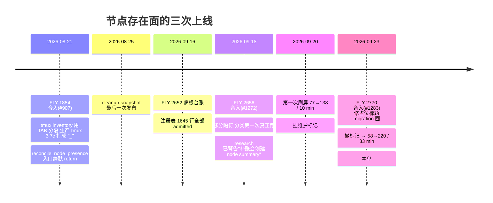

# FLY-2829 陈旧注册表批量补镜像 — 调研
Issue: FLY-2829 (https://linear.app/geoforge3d/issue/FLY-2829/病根cmux-撤维护标记后同步器照-1800-行陈旧-cmux-node-registry-给已结束会话批量补镜像-33-分钟刷出-154)
日期: 2026-09-23
基于: exploration.md

## 0. 一句话

修复点全部落在 `scripts/flywheel-cmux-sync.sh` 的节点存在面（`:1345`–`:2360`）里，不需要改 Bridge；本调研核实了每个修复点要碰的函数、它们现有的守卫合同、要登记的四本清册，以及一个不碰生产 cmux 的 30 分钟 soak harness 的可行性。

## 1. 代码事实（行号以 `origin/main` 72706eb97 为准）

### 1.1 注册表写路径与代价

| 函数 | 行 | 事实 |
|---|---|---|
| `node_registry_valid` | 1287 | python 全文件校验：13 列、state 枚举、exec 唯一、非 `-` title 唯一。1800 行实测 22 ms |
| `node_registry_upsert_row` | 1315 | 校验 → awk 剔除同 exec → 追加 → 再校验 → `mv`。每行调用一次 = 两次全文件 python + 一次 awk |
| `node_registry_remove_exec` | 1336 | 校验 → awk 剔除 → `mv` |
| `admit_node_identity_for_window` | 1345 | 窗口路径首见 `@flywheel_exec_id` 时 upsert `exec|-|-|admitted|now|round|…|mirror_title|round|0`。**title/alias 恒为 `-`** |
| `node_allocate_authority_title` | 1378 | 已有行且 title≠`-` → 原样返回；否则铸 `node:<alias>·<hash>`。**只在 `reconcile_node_presence` 的「注册表无此行」分支（`:2237`）被调用** |

一轮 `reconcile_node_presence` 对 N 行注册表至少 N 次 upsert，每次 O(N) → O(N²)；N=1800 时仅注册表 IO 就 ≈ 1800 × 60 ms ≈ 2 分钟，真正的大头是每行的 cmux 调用（见 1.3）。

### 1.2 `reconcile_node_presence`（`:2199`）的两个循环与调用的 cmux 操作

循环 1（live 名册每行）：`terminal_teardown_clear` → 读旧行 → upsert → `node_write_status_file` → `active-windowed` 且镜像就绪 ? `close_node_workspace` : `ensure_node_workspace`。

循环 2（注册表每行，不在 live 的）：`missing<2` 且无终态行 → 只 upsert；否则转两类 summary → upsert → 写状态文件 → 有精确终态行且有镜像时 `terminal_teardown_observe` → **`ensure_node_workspace`**。

轮末：`enforce_node_summary_limits`（TTL 24h、cap 30，只作用于两类 summary，按 `terminal_epoch` 淘汰）→ `node_publish_cleanup_snapshot`。

**两个循环内部没有 `watcher_mutation_latch_clear`**（`sync_additive` 各相位之间有，`:11743`–`:11836`）。

### 1.3 `ensure_node_workspace`（`:2071`）逐步代价与失败点

1. `build_node_status_command`（无 cmux）
2. `reconcile_node_ledger`（`:2040`）：`get_cmux_workspaces_json` 1 次 + **对账本每个 prepared 行调用 `complete_node_title_migration`**（每行 1–2 次 cmux rename 尝试，各 20 s 超时上限）。当前账本 8 个 prepared 行 → 每次 ensure 都重试 8 次 rename
3. `get_cmux_workspaces_json` 1 次
4. 账本查 ref；无 ref → 数 title ∈ {title, command} 的工作区
5. `cmux_call_guarded _node_workspace_guard new-workspace --command …`（guard 内再 `get_cmux_workspaces_json` 1 次）
6. `get_cmux_workspaces_json` 1 次（diff 出新 ref）
7. **`_node_ledger_upsert prepared … "$title"` → `_node_ledger_transaction` `:1933` 的 `[[ "$title" == node:* ]]` 对 `-` 返回 1** ← 空壳诞生点
8. `complete_node_title_migration`

也就是每个 title=`-` 的行每轮 ≥ 4 次 list-workspaces + 8 次 rename 重试 + 1 次 new-workspace；实测 5.6 s/行。

### 1.4 关闭/回收路径的守卫合同

- `close_node_workspace`（`:2140`）只认账本 **committed** 且同 generation 的 ref；无 ref 直接 `return 0`。`_node_close_guard`（`:2123`）按 `reason:state` 白名单放行：`superseded-by-mirror:active-windowed`、`summary-ttl|summary-cap : unresolved-summary|terminal-summary`。新增 reason 必须加进这个 case。
- `gc_node_summary`（`:2165`）= close → `node_registry_remove_exec` → `rm status`。对无回执行等价于「只删注册行+状态文件」。
- `node_terminal_workspace_was_closed`（`:2157`）：founder 手工关掉 summary tab 后，下一轮 `manual_rc==0` 走「全删不重建」。

### 1.5 维护标记的读取点（全部已存在）

| 位置 | 行 | 语义 |
|---|---|---|
| `maintenance_entry_allowed watch` | 14150 | 入口；supervised 下 1 s 轮询等标记消失 |
| `watcher_maintenance_checkpoint` | 14203 | 每 tick 顶部 + `watcher_finish_pass`；让出租约、等标记消失、重新拿租约、置 `WATCHER_RESYNC_REQUIRED=1` |
| `sync_additive` 首行 | 11748 | `maintenance_requested && return 0` |
| `watcher_mutation_latch_clear` | 14051 | pass 内相位边界；标记出现 → `WATCHER_AUTHORITY_LOST=1` + `WATCHER_MAINTENANCE_STOP=1`，日志 `maintenance requested during watcher pass; aborting remaining mutation at safe boundary` |

`maintenance_requested`（`:13476`）= 标记 ∨ ops-rebuild claim ∨ QA teardown claim。**在两个循环里插 `watcher_mutation_latch_clear` 即可**，三种暂停请求一并响应，无需新语义。

### 1.6 告警与审计

- `_alert_cmux_cleanup title body signature`（`:254`）：按 signature 哈希在进程内去重（≤64 条/generation），落到 `flywheel_alert cmux_cleanup warning`。新告警需要稳定 signature（`cmux_cleanup|<kind>|…`）。
- `[audit]` 日志行只在 close/WAL 路径有（`:2576` 等）；node create 路径没有。
- `log_cmux_episode kind target …`（`:9702`）：episode kind 有 allowlist（FLY-2770 加了三种，`test_fly2770_new_log_episode_kinds_pass_state_validator`）。本单若加 episode kind 要同步登记；用普通 `log "[audit] …"` 则不用。

### 1.7 环境旋钮登记

`packages/config/src/feature-flags/truth.ts:536` 附近登记了 `FLYWHEEL_CMUX_NODE_*` 全部旋钮（"tuning knob"/"plumbing" 说明字符串）。`FLYWHEEL_CMUX_NODE_PRESENCE` 已由 FLY-2102 退役（`:927`），节点存在面**永远开**——所以「关掉节点存在面」不是本单可选的止血手段。本单新增旋钮（预算、滚动窗口、自停闩路径、剪枝 TTL）都要加到 truth.ts，且 `fly2102-flag-freeze.test.sh` 的 allowed_hits 不需要动（只有布尔开关才管）。

### 1.8 测试清册（新增测试文件必登）

- `.github/workflows/ci.yml:945` 附近的 FLY-1364 步骤显式列出每个 shell 测试；
- `scripts/__tests__/ci-structure.test.sh:1482` `expected_fly1364_commands` 必须与 ci.yml 逐字一致；
- `packages/claude-runner/test/fixtures/kill-path-inventory.json`：任何新测试文件里出现 `kill` 都要登记（soak harness 会 `kill` 自己起的 watcher，必须登记）；
- 脚本测试在 CI 用 Linux 现代 bash 跑（`FLYWHEEL_CMUX_TEST_ALLOW_MODERN_BASH=1`），本机必须用 `/bin/bash` 3.2——新代码不能用 `declare -A`、`${var,,}` 等。
- 现有节点存在面回归：`scripts/__tests__/fly1884-node-presence.test.sh`（mutation-faithful cmux 模型，`ensure_node_workspace` 在 reconcile 测试里被 stub 成记录器）。

### 1.9 Bridge 侧

`GET /api/sessions?mode=live` → `StateStore.getLiveSessions()`（`CMUX_LIVE_SESSION_STATUSES` = pending/running/ship_parked/awaiting_review/design_done/approved_to_ship）；`mode=recent_terminal&hours≤168`。`/sessions/:id` 也在，但逐行查会把一轮变成 N 次 HTTP，没必要——**live 名册就是「真实存活」的定义**，issue 要求 2 的「核对会话真实存活」= 「在 live 名册里」。

## 2. 跨单链路（为什么 9-20 和 9-23 各刷一次）

FLY-2652 是「只记不派」的病根台账，其修复分别落在 FLY-2656 与 FLY-2770；本单是第三条路径。

## 3. 各修复点的方案比较

### 3.1 注册表收缩

| 方案 | 做法 | 代价/风险 |
|---|---|---|
| A 轮首回收 | 把 `enforce_node_summary_limits` 挪到两个循环之前 | 只覆盖两类 summary；1000 行 admitted 不受影响 |
| B 轮首按年龄剪枝 | 不在 live 名册 ∧ `now - last_seen ≥ TTL`（复用 `FLYWHEEL_CMUX_NODE_SUMMARY_TTL_HOURS`=24h）的行：无回执 → 直接删注册行+状态文件；有 committed 回执 → `gc_node_summary` | 需要 live 名册 ok；一次性剪掉 ≈1700 行，要备份 |
| C 只加 cap | `admitted` 也纳入 cap | 治标；cap 淘汰仍在轮末 |

推荐 **A + B**，并把剪枝放在 `reconcile_roster_read_phase` 之后、任何 create 之前。`_node_close_guard` 需要新 arm：`stale-registry:admitted|active-windowed|active-windowless`（只对有 committed 回执且已过 TTL 的行放行）。

### 3.2 不给已结束会话建镜像

| 方案 | 做法 | 代价/风险 |
|---|---|---|
| A 循环 2 零创建 | 循环 2 删除 `ensure_node_workspace` 调用；已存在的 node tab 就地改状态文件 | 去掉 FLY-1884「事后补建『已结束』tab」；remote/headless 体结束后若从未有过 tab 就不会有 tab |
| B 只对 recent_terminal 精确命中建 | 保留终态摘要 tab，但要求 `terminal_seen==1` | 仍会为 48 h 内结束但早已无人关心的会话建 tab；unresolved 一律不建 |
| C 每行查 `/sessions/:id` | N 次 HTTP | 无意义：live 名册已是真相 |

推荐 **A**（已问 Lead）；B 作为备选写进 plan 的可切换点（一个常量）。

### 3.3 title=`-` 负向护栏

- `ensure_node_workspace` 入口：`[[ "$title" == node:* ]] || return 1`，在任何 cmux 调用之前；
- 循环 1：`old` 存在但 title=`-` → `node_allocate_authority_title` 补铸并写回；`admit_node_identity_for_window` 不改（它的合同就是最小行）。

### 3.4 轮内标记检查点

两个循环体首行 `watcher_mutation_latch_clear || return 0`；`--once` 模式下 `MUTATOR_LEASE_MODE≠watch`，latch 恒 0，不影响手动路径。

### 3.5 失控护栏

| 层 | 机制 | 默认 | 持久化 |
|---|---|---|---|
| 每轮预算 | `NODE_CREATE_BUDGET_LEFT` 进程变量，`ensure_node_workspace` 真实调用 new-workspace 前扣减；耗尽 → 本轮 `return 1` + 一次告警 `cmux_cleanup\|node-create-budget-exhausted` | 10 | 否（轮级） |
| 滚动窗口 | `~/.flywheel/state/cmux-node-create-ledger`：每次成功 create 追加 `epoch\|exec\|ref`；轮首统计最近 10 min 行数；≥ 40 → 写自停闩 `~/.flywheel/state/cmux-node-runaway`（内容：epoch、count、pid）+ 告警 `cmux_cleanup\|node-create-runaway`；闩在 → 本轮零创建 | 40 / 10 min | 是，跨重启 |
| 绝对上限 | `get_cmux_workspaces_json` 工作区总数 ≥ 上限 → 零创建 + 告警 | 150 | 否 |

自停闩由操作员 `rm` 清除（告警文案写明路径）；`--once` 不自动清。滚动账本自身按 24 h 裁剪，避免无限增长（讽刺的是本单就是治无限增长的）。

### 3.6 观测性

- `log "[audit] node create exec=… title=… ref=… round=…"` / `[audit] node close …` / `[audit] node prune …`；
- 轮末一行 `node presence round=… live=… created=… closed=… pruned=… budget_left=… skipped=…`；
- 与 `OK <UUID>` 透传行相邻，事后可对账。

## 4. 验收 harness 可行性（issue 要求 5）

| 依赖 | 隔离手段 | 依据 |
|---|---|---|
| cmux CLI | PATH 前置一个 `cmux` shim（bash），维护 `workspaces.json` 模型：`list-workspaces --json` 输出、`new-workspace` 追加 `Terminal N`、`rename-*`、`close-workspace`；记录每次调用到 `calls.log` | `_cmux_bounded_spawn` 直接调 PATH 上的 `cmux`（`:18`）；`FLYWHEEL_CMUX_TEST_SYNC_FUNCTIONS` 只影响 shell 函数模式 |
| cmux 健康检查 | shim 对 `cmux_health_check` 用到的子命令返回成功 | `cmux_health_check_or_die` 只看 rc |
| tmux | 私有 socket（`TMUX_INT_SOCKET` 模式，见 `test-cmux-sync-hooks-integration.sh`）；启动 0 个 runner 窗 | inventory 走 `tmux list-windows -a` |
| Bridge 名册 | `FLYWHEEL_ENV_FILE` 指向临时 env，`FLYWHEEL_BRIDGE_URL=http://127.0.0.1:<port>`，python `http.server` 固定返回 live=空/或 3 个 fixture、recent_terminal=空 | `_fetch_runner_roster_json` 读 env 文件 |
| 状态文件 | 全部 `NODE_*`/`VIEW_*`/`CLEANUP_*`/锁/标记路径指向临时目录（与 `test-cmux-sync.sh` 同一套 export） | 已有 |
| 注册表 | `cp ~/.flywheel/state/cmux-node-registry <tmp>`（1800 行真数据） | 只读生产文件 |
| 进程 | `/bin/bash scripts/flywheel-cmux-sync.sh --watch &`，30 分钟后 `kill` 自己起的 pid；判据 = shim 模型里工作区数的单调性（允许 ≤ 预算的 live 节点 tab） | `restart-cmux-watcher.test.sh` 已有真 `--watch` 起停先例 |

阴性对照：同一 harness，脚本换成 `git show 72706eb97:scripts/flywheel-cmux-sync.sh`（修复前），期望在 ≤ 5 分钟内工作区数持续增长（不必等 30 分钟，增长曲线即证据）。

限制：shim 的 cmux 调用零延迟，所以修复前的对照会比生产快得多（生产 5.6 s/行是 cmux 超时贡献的）；这不影响「是否增长」的判定。生产 cmux 上的 30 分钟观察保留为上线后、永久撤标记前的门。

## 5. 与 Codex 评审预期相关的边界（先写清，少挨几轮）

- 剪枝只信 `RUNNER_EXPECTED_STATE==ok` 的 live 名册；名册 indeterminate 整轮冻结（现有语义），零删除；
- 剪枝对有 committed 回执的行走 guarded close（`_node_close_guard` 新 arm），close 失败则保留注册行，下一轮重试；不会出现「注册行没了、账本行还在」的孤儿；
- 自停闩与滚动账本都是 owner-only 文件，符号链接/外部属主/畸形内容 → 视为「闩在」（fail-closed）；
- 预算扣减发生在 `cmux_call_guarded new-workspace` 成功返回之后（真实创建才算），guard 阻断不计数；
- 一次性剪枝前备份 `cmux-node-registry.pre-FLY-2829-<epoch>`（只在剪掉 > 100 行时做，避免每轮备份）；
- 快照发布（`node_publish_cleanup_snapshot`）随轮次能走完而恢复——这会解除自 8-25 起冻结的 dead-mirror cleanup fence，属 FLY-1884 设计内行为，但要在 plan 的风险表和 QA 要点里写明。
