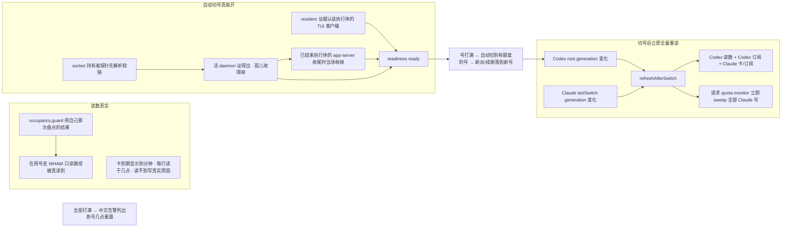

# FLY-2830 Codex 切号器够不到实现节点 — 探索
Issue: FLY-2830 (https://linear.app/geoforge3d/issue/FLY-2830/codex-切号器-号打满了活却没切到有额度的号上读数-25-小时没刷新认错当前号切号到不了-implement)
日期: 2026-09-25
基于: 无

## 1. 要回答的问题

founder 9-23 问「我们不是做了 Codex 切号器吗？怎么感觉没有作用」，9-25 追加四问：显示「读不到」的是不是真读不到；school 周重置已过为什么还显示不能用；能不能每次切号都把全部账号额度重拉一遍；兑换卡为什么显示「未绑定」/全部同一个值。

本文逐条给出**今天生产上的事实**，区分「已被 FLY-2864/2869/2877/2523 修掉」与「仍然存在」，并给出仍存在问题的根因。

所有事实都来自只读取证：生产 dist `59123848a`（含 2864/2869/2877）原样回放、生产 `teamlead.db`/`comm.db` 只读句柄、`ps`/`lsof`/`ls` 只读、对 school 账号一次只读 WHAM GET（不消耗额度）。凭据文件只读了 email、过期时间等元数据。零写入。

## 2. 现场事实（2026-09-25 19:13–19:25Z）

| # | 事实 | 证据 |
|---|------|------|
| F1 | `~/.codex/auth.json` = school（id_token email）；`codex-accounts.json` 的 `activeAccount` = school，两者一致 | auth 元数据、store 文件 |
| F2 | `codex-homes/agents/flywheel/{eng_design,implement,qa}/auth.json` 三个都是软链 → `~/.codex/auth.json`；三处都没有 `.credential-copy-pending` | `ls -la`、`readlink` |
| F3 | FLY-2869 的读数调度器在跑：`codex-accounts.json` `generatedAt=19:13:44Z`，上一轮 19:02:45Z | store 文件 |
| F4 | 19:13 那一轮：personal/personal1/personal2 读到新值；business、shopping 标 `note=inventory_unavailable`、沿用 19:02 读数；**school 标 `inventory_unavailable`，读数停在 9-24 22:48Z（20 小时前）**，仍是 100% + 重置 9-25 03:06Z | store 文件 |
| F5 | 对 school 做一次只读 WHAM GET（生产 `readCodexReadonlyUsage`，读 canonical auth）：**成功**，weekly 已用 28%，下次重置 10-02 03:35Z。没被 Cloudflare 拦 | 本机实跑，见 research §2 |
| F6 | `inventory_unavailable` 只在「占用盘点」答 `unknown` 时出现；盘点结果是 `CodexAccountOccupancy` 里的**共享快照**，每次任何人开始盘点都先把它清成 unknown，只有最后开始的那次能写回 | `occupancy.ts:38-94` |
| F7 | 6 个 Codex 号各有 1 张兑换卡，id 各不相同，到期 10-22 20:22–20:58Z（PT 13:22–13:59）；4 个 Claude 号各 1 张，到期 10-22 16:00Z（PT 09:00）。页面只显示日期，所以 10 个号看起来是同一个值 | `codex-accounts.json`、`claude-quota/account-details.json`；`account-quota-view.ts:181` `formatCardExpiry` |
| F8 | 9-23 基线里 Claude business「10/28、10/31」是旧的美元预付卡；FLY-2864（ba72c3bcb）把 Claude 这一列换成了重置卡，口径不同不可比。Codex business 10/30 那张、personal 的第 2 张，现在接口里已经没有（已用或已过期）| git log、store 文件 |
| F9 | 自动切号在生产仍恒为 manual：最后一条 `automation_disabled` outbox 行 `reasons=["authority_unavailable"]`（9-25 04:30Z），累计 129 条；`codex_quota_signal_event` 从未进过自动路径 | `teamlead.db` 只读 |
| F10 | 用生产 dist 回放 host collector 两轮（隔 65 秒）：`complete=false`。第二轮剩下的阻塞只有 implement home：`daemon_not_alive`（exec b6c738ca / FLY-2874）、`resident_evidence_incomplete`、`comm_orphan`(b6c738ca)。其余 4 条卡了一周的 running 行已按 2869 规则降为 info | `evidence/readiness-production-replay-2026-09-25.txt` |
| F11 | implement home 上有两组活 Codex 进程：FLY-2874（exec b6c738ca，app-server 60140、其子进程 code-mode-host 65356、TUI 客户端 `codex resume --remote` 18081）；FLY-2873（exec 37624e3d，app-server 86434 + 子进程 27128）。**FLY-2873 在 StateStore 已 `completed`（07:57Z），CommDB 里已无行，但 app-server 还活着** | `ps`、`teamlead.db`、`comm.db` |
| F12 | Codex 0.157 起 `--listen unix://<path>` 的 `<path>` 是**软链**，真 socket 在 `/private/tmp/codex-daemon-501/<hash>`。`cdx-sock/` 下 206 个普通 socket 都早于 9-22，3 个软链全在 9-22 17:07 PDT 之后 | `ls -lT` |
| F13 | `lsof -t -- <软链路径>` 无输出、exit 1；`lsof -t -- <真路径>` 返回 60140。我们两处 socket 持有者探针（`codex-daemon-runtime.ts:1401` 与 `codex-runner-orphan-reaper.ts:342`）都对软链路径跑 lsof | `evidence/socket-holder-symlink-2026-09-25.txt` |
| F14 | Bridge 日志：孤儿收割器已找到 FLY-2873 的 app-server 86434，却因 `codex_app_server_orphan_socket_holder_mismatch` 不敢收 | `/tmp/flywheel-bridge.log` |
| F15 | 把 lsof 改成先解析软链再查（回放脚本里注入），app-server 60140 的证据变 `verified`；但同一执行体的 TUI 客户端 18081（`codex resume --remote`，`ucomm=codex`，自己一个进程组，父进程是 tmux）仍判 `socket_holder_mismatch` —— 现行 resident 规则要求盘点到的**每个** Codex 进程都持有 socket 且在 daemon 进程组里。（子进程 `codex-code-mode-host` 的 `ucomm` 不是 `codex`，本来就不进盘点，不受影响）| 本机实跑，research §3 |
| F16 | Claude 5h/周读数只由 quota-monitor 写：在用号 20 分钟一读（>70% 时 10 分钟），其余号 60 分钟 sweep 一次；Bridge 的全量刷新只读 Claude 卡/订阅，不读 5h/周 | quota-monitor 代码，research §4 |
| F17 | 任何一次切号（Claude/Codex、手动/自动）之后，都没有东西会在 2 分钟内重读全部账号；手动 Claude 切号甚至不会让 quota-monitor 提前读新在用号（最多 20 分钟） | research §4 |
| F18 | 全部 Codex 号打满时的 founder 告警正文是英文一句「Codex fleet remains paused…」，只带来源号一个 reset，不列各号几点重置 | `outbox.ts:494` |

## 3. Issue 里三个缺陷的现状

| 缺陷 | 现状 | 谁修的 / 证据 |
|------|------|------|
| 1 读数 25 小时不刷新 | **部分修了**：FLY-2869 定时读（15 分钟）在跑（F3）。**但没修干净**：每轮有号因为占用盘点竞态被跳过（F4、F6），在用号 school 已 20 小时没读到 | 本单修竞态（§4 R2）|
| 2 认错当前号 | **已修**：`activeAccount` 每轮按 canonical auth 身份算，与 auth.json 一致（F1）。残余：两轮之间（最长 15 分钟）切号，页面在下一轮前仍显示旧在用号 | 本单的「切号后立即重读」一并消掉这个窗口 |
| 3 切号到不了 implement | **凭据层已修**：三个 agent home 都软链到 canonical（F2）；新 agent home 由 FLY-2404 `placeCredentialLink` 直接建软链，遗留拷贝由 FLY-2523 home-migration 转软链。**但「自动切」这一层从未生效**（F9）——号打满后没人去切，只能 Lead 手动 | 本单修 readiness（§4 R1、R3）|

## 4. 根因

### R1 Codex 0.157 的 socket 软链让「这个 daemon 是谁的」永远证不出来

我们判断一个 Codex app-server 属于哪个执行体、能不能安全地收掉它，靠的是 `lsof` 查「谁持有这个执行体的 socket」。Codex 0.157 把我们给的 socket 路径变成了一个软链（大概是为了躲开 macOS unix socket 路径 104 字节上限），真 socket 放在 `/private/tmp/codex-daemon-501/` 下。`lsof` 不跟软链，于是对**每一个 9-22 之后启动的 Codex 执行体**都答「没人持有」（F12、F13）。连锁后果：

1. readiness 自检里，活执行体的 daemon 被判 `daemon_not_alive` → 该 home `unknown` → 全舰队自动切号关着（F10）。
2. 收尾 reap 与孤儿收割都判「证不出身份，不敢杀」→ 已完成执行体的 app-server 常驻（F11、F14）。孤儿又让 readiness 继续卡（它的 CommDB 行已没了，盘点解释不了这个活进程）。

### R2 占用盘点的共享快照有竞态，被跳过的恰恰包括在用号

读数调度器每读一个号前都调一次 `occupancy.guard()`：它先 `collect()`，然后**不看自己这次盘点的结果**，而是去读共享快照（F6）。同一时间 readiness（每个维护 tick 都可能刷新）和切号 runtime 也在 `collect()`，任何一次新开始的盘点都会先把快照清成 unknown。于是 `guard` 常常读到 unknown → 该号记 `inventory_unavailable`、沿用旧读数。这就是 founder 看到的「school 周重置已过还显示打满」「占用状态未知，本次未读」。school 本身完全可读（F5）。

### R3 readiness 对「一个执行体 = 多个进程」的认定只对新式 lease 路径成立

FLY-2877 之后新启动的执行体走 lease 路径（按 `FLYWHEEL_EXEC_ID` 认进程，daemon + 客户端 + 子进程都算），没问题。但 lease 上线前启动、仍在跑的执行体（今天的 FLY-2874）走「resident 证据」路径，这条路径要求盘点到的**每个** Codex 进程都是 socket 持有者且在 daemon 进程组里（F15）。Codex 的 TUI 客户端（`codex resume --remote <socket>`）只是连上 socket、不持有它，天然不满足，所以即使修了 R1，这类执行体仍会让全舰队自动切号关着，直到它结束。

### R4 没有「切号后重读」这个动作

四条切号路径（Codex 自动 `commitGeneration`、Codex 手动 `reconcileExternalRoot`、Claude 自动 quota-monitor `switchAccount`、Claude 手动 `account-switch-cli`）都没有触发全量重读（F17）。Claude 5h/周的数只有 quota-monitor 能读（F16）。

### R5 呈现层把「真实原因」和「真实差别」都抹掉了

- 卡到期只显示日期，10 个号的不同到期时分被抹平（F7）。
- 「本轮读数不可用」「占用状态未知」不说是哪一步、为什么。
- 全部 Codex 号打满的告警不列各号重置时间（F18）。
- Claude 行没有「读于几点」，看不出新旧。

## 5. Claude 下次扣费日

另做了一轮调研（research §5）：查过 `/api/oauth/profile`、`/api/oauth/usage`（含 cedar_ember `billing_period`）、OAuth 组织接口（prepaid/payment_method 等）、本机 `.credentials.json`/`oauthAccount` 全部字段名、Claude Code 2.1.282 程序内的接口串、社区工具与官方帮助中心。**唯一给出下次扣费日的是 claude.ai 网页的 `subscription_details`，它只认浏览器登录 cookie，OAuth token 调用返回 403 `oauth_token_not_accepted`**（FLY-2864 实测）；取 cookie 违反 Anthropic 条款，founder 9-24 已否决。按开通日推算有反例（Codex business 开通 08-19、实际续费 10-23），也被 founder 禁止。结论：继续读不到，页面把原因写具体，不推算、不写死。

## 6. 修复方向

## 7. 不在本单范围

- desktop Codex / FLY-2729 的凭据权威裁定（今天回放里 desktop 已被 info 排除，不阻塞）。
- 用 cookie 读 Claude 扣费日（founder 已否决）。
- 清理宿主残留（test-slot 符号链接、归档目录）——今天已不阻塞。
- 改 Claude quota-monitor 的常规节奏（20/60 分钟）与它的切号决策逻辑。
