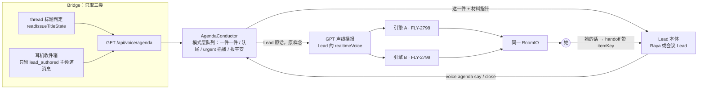
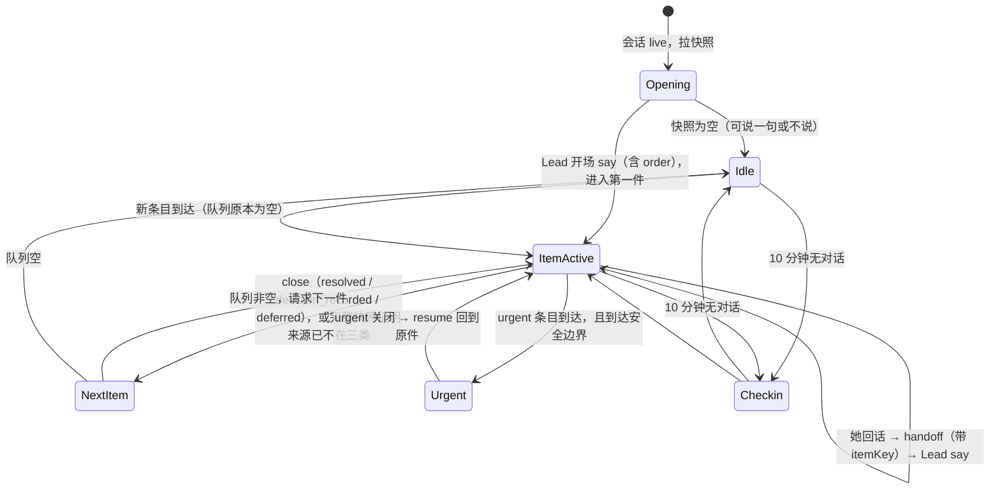

# FLY-2863 语音播报只播三类、Lead 消化后对话 — 实施计划
Issue: FLY-2863 (https://linear.app/geoforge3d/issue/FLY-2863/语音v7-播报内容只播三类lead-主动说的-待批-受阻lead-消化后用对话口吻一件一件跟她过内部排队10)
日期: 2026-09-24
基于: research.md

> **本轮只做设计。** 这份文件是交给后续 code run 的施工合同，不是已完成声明。
> 入场条件：FLY-2796（模式层底座：RoomIO、收件箱、handoff carrier、等待音与丢句修复）和 FLY-2798（引擎 A）**都已合入 main**。
> 实现开工前，先把 research.md 里引用的行号对照合入后的 SHA 重新核对一遍。

## 1. 给她的结果

进房以后，只有「要你动手」的事才会被说出来，由 Lead 用自己的话一件一件跟她过。她拍板了，这件就结束，接着说下一件。中途来的新事排到队尾，只有真正紧急的才会插进来。10 分钟没有对话时，Lead 会报个平安。全程用 GPT 声线：耳机模式是 Raya 的声线，会议模式是对应 Lead 的声线。



三条不变的边界：

- **话由 Lead 想**：模式层不拼句子，前台模型也不转述。
- **节奏由代码管**：排队、插播、开闭一件都是确定性规则，可以测，重启后能恢复。
- **不新增权限**：她在语音里说「批」，Lead 仍然按现有权限规则执行（§5.3）。

## 2. 来源：只取三类（与标题、固定页同一套判定）

### 2.1 新增只读路由 `GET /api/voice/agenda`

- 挂在 FLY-2796 的 voice session router 下：master daemon 鉴权，并校验 session lease 和 generation（沿用 2796 plan §4.3 的错误码：403、409、400、503）。
- 查询参数是 `sessionId`。scope 由**服务端**根据会话 projection 决定，⛔ 不接受客户端传入 leadId：
  - `mode=headphone`：她已授权的全部项目，以及这些项目的全部 Lead；
  - `mode=meeting`：只取该会议 Lead 负责的单，以及该 Lead 主频道里的消息。
- 返回 `{snapshotId, asOf, items: AgendaItem[], sourceStatus}`：

```ts
type AgendaClass = "lead_said" | "awaiting_approval" | "blocked";
interface AgendaItem {
  itemKey: string;          // 稳定键，见下表
  class: AgendaClass;
  leadId: string;           // 权威映射
  issueIdentifier: string | null;
  threadUrl: string | null;
  since: string;            // 进入该类的时间
  urgent: { reason: UrgentReason; source: "lead_flag" | "priority_urgent_blocked" } | null;
  pointers: { messageIds: string[]; qaReportRef?: string; designCardUrl?: string };
}
```

| class | 判定（⛔ 不另造） | itemKey |
|---|---|---|
| `awaiting_approval` | 对活跃单调用 `readIssueTitleState()`，经 `deriveEffectiveFounderTitleState()` 得到 `level==="ship"`，也就是标题上的「🔔 ⏳待批」 | `approve:<issueId>:<gate 进入时间>`：打回重做后再次进入待批，会产生一件新的 |
| `blocked` | 同一个 `readIssueTitleState()` 得到的标题徽标是受阻（`deriveIssueTitleBadge`，research §1.2） | `blocked:<issueId>:<受阻起始时间>` |
| `lead_said` | 收件箱里 **Lead 主频道**（`chatChannel`，不含 thread）中 `origin=lead_authored` 的消息，且满足 §2.2 的「当前」窗口。<br>⚠️ **R1-1 修正**：标题的「要你答」（`level==="answer"`）**默认不纳入**。它由配置项 `agenda.includeThreadAnswer`（默认 `false`）控制，要等她确认（§9 第 3 问）并反写本合同后才打开。关闭状态下，要有负测证明它不会入队 | `said:<channelId>:<messageId>:<revision>`。如果以后打开扩展，用真实的 `questionId` 或 askId，并经问题 binding 与主频道消息合并 |

**R1-6 修正：`sourceStatus` 的约束。**

- `sourceStatus` 逐来源给出 `complete | partial | unavailable | recovering | source_gap`，并带上 `asOf`。
- **只有**同一个授权 scope 下全部来源都是 `complete`，而且 `asOf` 在新鲜度窗口内（工程默认 60s），这份快照才能证明「某件已经不在了」。
- 其他情况都视为**不完整快照**：只能**新增**条目，⛔ 不能关闭、不能 ack、不能推进当前件，队列保持上一次的已知状态。
- 实现可以先走最简单的做法：只要有任一来源不是 `complete`，就整体不做移除。
- `readFounderAttentionFacts` 返回的 `unavailable`/`truncated`（`founder-attention-facts.ts:303-320`），以及收件箱的 `source_gap`、`recovering`，都映射到上面这组状态。
- 必测：待批在场 → 来源失败 → 恢复。这个过程中这件不被关闭，也不被当成新件重复入队。

排除规则，逐条写进测试：

- 带 `🤖[自动] ` 前缀的消息，以及 `📻`、`🗣️` 语音回显；
- 她自己发的消息；
- thread 里的一切消息（thread 只通过标题状态进入议程）；
- 标题是规划、设计审、实现中、QA、代码审、PR 已开、完成的单；
- `lead_said` 在她之后已经在同一个主频道发过言，这一件视为已处理。⚠️ 这里用的是**主频道 founder 回复水位**，需要新实现：`hasFounderAttentionReplyAfter` 是按 project+issue 查询的，不能直接拿来用（R1-9）。

### 2.2 只取当前待办，⛔ 不回放历史收件箱（Lead 2026-09-24 补充，来自 2798 QA 真房）

2798 QA 真房实测：引擎 A 进房时 `HeadphoneMode.start()` 调用 `InboxReader.poll()`，把积压的整批收件箱一口气念完（slot 3 积压了 335 条）。这就是 founder 说的「广播」。

- **进房永远不调用 `InboxReader.poll()`**，两种模式、A 和 B 都一样。积压的历史收件箱条目**不进**播报队列。
- `awaiting_approval` 和 `blocked` 按**当前**标题状态判定，天然是当前待办，没有历史可回放。
- `lead_said` 只取满足以下**全部**条件的主频道消息：
  1. 晚于她在**同一个主频道**最后一次发言（回复水位）；
  2. 晚于上线基线 `agenda.leadSaidBaselineAt`（上线那一刻写入，此前的历史一律不算）；
  3. 在回看窗口 `agenda.leadSaidLookbackMs` 之内（工程默认 86400000，即 24 小时，待她用过再定）。
- 窗口外没处理的消息**不念**。开场时只把「较早的消息还有 N 条」这个数字交给 Lead（`purpose=open` 的 payload 里有 `olderUnspokenCount`），由 Lead 决定要不要提一句，⛔ 不念内容。
- 收件箱本身照旧全收，照旧做持久化和 source_gap（2796 合同不变）。这里只限制「哪些会被说出来」。
- 必测：积压 335 条（其中只有 2 条在窗口内）时，进房只进入 2 件 lead_said；InboxReader 的 speak 调用次数为 0。

### 2.3 收件箱侧的最小改动

- FLY-2796 的 collector 继续全收（2796 已批准的「收件箱全收」不推翻），只给条目加一个字段：`originClass: "lead_authored" | "automation" | "voice_echo" | "founder" | "other"`。
- 这个字段在采集时根据前缀和作者计算，走 additive migration。**判定前缀只能调用 `automated-message.ts` 导出的常量**，不能在别处再写一份字符串。
- `InboxReader` 的逐条念不再作为耳机或会议的播报入口（§4.7）。收件箱仍然负责持久化、去重和 source_gap。

## 3. Lead 消化：Lead 本体写出要说的话

### 3.1 请求：模式层 → Lead

- 复用 FLY-2796 持久 carrier 的**投递底座**：`voice_handoffs` 表、预分配 deliveryId、mailbox、reconciliation。
- ⚠️ **R1-2 修正：agenda 请求是一条独立的服务端请求分支，不是用户 handoff。** 开场和报平安发生时，往往还没有任何 founder utterance，而 2796 的 `VoiceHandoffRequest`（`handoff.ts:23-40`）必须带 transcript、originalText、authorityBinding 和持久回执，Bridge（`voice-handoff-routes.ts:101-164`）还会回读转写。所以做法是：
  - 新增路由 `POST /api/voice/agenda/requests`，与现有 handoff 路由分开；query、judgment、action 的校验器**一字不改**；
  - 请求只带 `{sessionId, generation, leaseToken, purpose, itemKey|null, clientRequestId}`；
  - 服务端校验有效的 lease 和 generation，由**服务端**根据 projection 解析 scope、snapshot 和目标 Lead，⛔ 不接受客户端指定；
  - 服务端写一行 `voice_handoffs`，`requestKind="agenda_brief"`，transcript 相关字段为空，并有 CHECK 约束保证：只有 `agenda_brief` 这一种可以没有 transcript；
  - 幂等键是 `agenda:<sessionId>:<generation>:<clientRequestId>`；
  - 投递、reconciliation、结果流全部复用。
- 它的**权限只有一条**：请 Lead 写要说的话。⛔ 不授权任何动作，⛔ 不伪造 founder 转写。
- 她说的话仍然走原来的用户 handoff（§4.4），与这里的请求分开。
- 目标 Lead：耳机模式是 Raya（耳机 speaker），会议模式是会议 Lead。
- payload 结构：

```ts
{ purpose: "open" | "item" | "urgent" | "resume" | "checkin",
  agendaSnapshotId, sessionId, generation,
  items: AgendaItem[],          // open 时是整批；item/urgent 时是这一件
  currentItemKey: string | null,
  queueAfter: { count: number, classes: Record<AgendaClass, number> },  // 只给数，不给内容
  olderUnspokenCount?: number,   // 仅 open：窗口外未播的 lead_said 条数（§2.2），不含内容
  lastFounderUtterance?: { transcriptId, text } }
```

### 3.2 回复：Lead → 模式层（结构化命令，⛔ 不从自然语言里猜）

```sh
flywheel-comm voice agenda say   --request <handoffId> --item <itemKey|none> [--order k1,k2,k3] --text "<要说的话>"
flywheel-comm voice agenda close --request <handoffId> --item <itemKey> --disposition resolved|decision_recorded|deferred [--evidence <ref>] --reason "<一句话>"
```

- `say` 写入 2796 的 `voice_handoff_results`，`resultKind="agenda_say"`。`--order` 只在 `purpose=open` 时有效，而且必须是开场快照里 itemKey 的一个排列，否则拒收。
- `close` 写入 `resultKind="agenda_close"`。模式层收到后，按下面的处置类型关闭这一件的**对话**。

**R1-7 修正：三种处置类型，每种的结束条件唯一。**

| disposition | 什么时候用 | 必须带什么 | 对话 | 业务状态 |
|---|---|---|---|---|
| `resolved` | Lead 已经用**现有权限**把她说的事办完了，比如授权放行受阻的单、按她说的改需求 | `--evidence`：办完的依据，比如消息 id、命令回执、状态变更。缺了就拒收 | 结束，进下一件 | 已按现有权限执行 |
| `decision_recorded` | 她拍了板，但这个动作 Lead **无权执行**，典型是 ship 的批准（用嘴批 ship 不在范围内）。Lead 如实说「我记下你批了，你在 thread 里点一下就行」 | `--reason` | 结束，进下一件（**本场**不再提） | **没有变化**。标题仍是待批；下一场如果还是待批，重新入队，Lead 会说「上次你说批了，还差点一下」 |
| `deferred` | 她说「回头再看」 | `--reason` | 结束，进下一件（本场不再提） | 没有变化；下一场如果还在三类里，重新入队 |

⛔ 任何处置都不能说成「已批准」。只有标题状态真的变了（Q4 ②），才算业务完成。
- 两条命令都要求：请求属于本 Lead，session 和 generation 仍然有效（2796 §7.1 ⑦ 的鉴权）。

**R1-5 修正：结果只对「当前有效请求」生效。** 单看 snapshot 成员资格，拦不住同一个 generation 里迟到的 say 或 close。所以：

- 模式层在任意时刻**最多只有一个未完成的 agenda 请求**，记为 `outstandingRequestId`，持久化在 `voice_agenda_state` 里。
- 结果能否应用，按下表判断。
- 应用结果、推进队列都用**条件更新**：必须满足 `requestId == outstandingRequestId`、lease 和 generation 仍然有效、item 当前状态符合下表、`stateVersion` 通过 CAS。任一条件不满足，这个结果就是**过期结果**，只写审计事件 `agenda_result_stale`，不出声、不推进。
- 当前件被关闭、被 urgent 暂停、或者请求超时，都会把 `outstandingRequestId` 换成新请求或清空，旧请求的结果由此自然失效。
- 恢复时读取持久的 `outstandingRequestId` 和已应用结果游标（沿用上游的 `resultEventId`/`seq`），接着处理还没应用的结果，不重复应用。

| purpose | 允许的 say | 允许的 close |
|---|---|---|
| `open` | `item=none` 或开场第一件，可带 `--order` | 不允许 |
| `item`、`resume` | `item=当前 active 件` | `item=当前 active 件` |
| `reply`（她回话以后，请求 id = 那次用户 handoff 的 handoffId，见 §4.4 R-T5） | `item=该回合绑定的件`。绑定的件如果已经关闭，只允许**说明性** say | 仅当绑定的件**仍是当前 active 件**时允许；绑定的件已关闭时 ⛔ 不允许，也不能推进当前件 |
| `urgent` | `item=当前 urgent 件` | `item=当前 urgent 件` |
| `checkin` | `item=none` | 不允许 |

⛔ 不能 close 一件还没 active 的条目。
- ⚠️ CLI 新增子命令属于外部 CLI 合同变更（CLAUDE.md FLY-1914）。本单只**新增**、不删除，所以不需要做消费者 sweep；PR 里要写明这一点。

### 3.3 Lead 怎么说：按需读取的 runbook，不写进常驻规则

新增 `packages/teamlead/lead-rules-base/runbooks/voice-agenda.md`，经会话的动态上下文注入指针，做法同 2796 的 `voice-speech-brief.md`，常驻 bundle 的字节不变。内容写成可以照着做的规则：

1. **开场（open）**：
   - 一两句话先说「有几件要你拍」，每件用一句话点出它是什么，然后说「先从 X 说起」，接着直接进入第一件。
   - ⛔ 不要逐件展开，不要念清单。
   - 没有事的时候只说一句自然的话（例如「我在，现在没什么要你拍的」），或者什么都不说，由 Lead 判断。
2. **一件（item）**，只说这一件：
   - 发生了什么；
   - **要她做什么**：授权、批准、改，还是看一眼；
   - 待批：用三五句话讲 QA 报告、设计、测试，或者问她「要不要你自己看设计卡，我把链接发到 thread 里」。链接同时用文字发到 thread，⛔ 不念 URL；
   - 受阻：卡在哪里，需要她给什么。
3. **口语**：
   - 单号念数字（「二七九六」），不念 URL、markdown、代码、路径，不念状态流水（「进入实现段」「QA fail」之类）；
   - 不编造，不说还没做的动作「已经做了」。
4. **收尾**：她拍板后，按 §3.2 的三种处置选一种：办得了的先办完再 `close --disposition resolved --evidence …`；办不了的（ship 批准）如实说要她在 thread 里点，然后 `close --disposition decision_recorded`；她说「回头再看」就 `close --disposition deferred`。⛔ 不说「已批准」。
   然后在同一轮 `say` 里接下一件（模式层会把下一件的 `item` 请求一起发给它）。
5. **报平安（checkin）**：一两句闲聊或平安话。队列里有她还没回应的事时，可以轻轻提一句「X 还在等你，不急」。⛔ 不罗列状态。

### 3.4 模式层对 Lead 话的机械校验（不做语义判断）

校验不通过就请 Lead 重写一次；第二次仍然不通过，改念兜底句。

| 校验项 | 规则 |
|---|---|
| 长度 | 单次 `say` 不超过 `agenda.maxSayCodePoints`（工程默认 400，待她用过再定）；超长**不截断**，退回重写 |
| 内容形态 | 不含 URL、markdown 列表或标题标记、代码块、`🤖[自动]` 前缀 |
| 归属 | itemKey 和快照一致；开场的 `--order` 必须是合法排列 |
| 兜底（R1-8 修正） | 用同一声线念一句**只含已知事实**的模板句，并记录 `agenda_fallback_spoken` 事件和原因。有单号时说「<单号> 在等你<批/授权/回答>，我还没整理好，你也可以直接去 thread 看」；没有单号或 thread 时说「<Lead 名>有一条消息在等你回」。⛔ 兜底句不能说「我已经发了」「细节在 thread 里」这类没有持久发送证据的话。兜底是**可见的降级**，不冒充 Lead 原话 |

### 3.5 延迟

- 开场请求在会话 `live` 时立即发出，这段时间播 2796 的有界等待音。
- Lead 在 `agenda.leadReplyTimeoutMs`（工程默认 20000）内没有回复时，用同一声线说一句「我在整理，有 N 件要你拍，马上说」，然后继续等。
- 过渡句中的 N 来自快照计数，是已知事实。再过一个超时仍然没有回复，就按 §3.4 念兜底句，逐件处理。⛔ 不许长时间静默，也不许回退成念原文。

## 4. 模式层：`AgendaConductor`（引擎无关）

落在 `voice-core/src/agenda/AgendaConductor.ts`。它只依赖注入接口：`VoiceV1Session.speak` 和 `onUtterance`、RoomIO 的 `onBargeIn` 和 `audibleTail`、agenda client、carrier client、clock。A 和 B 用同一个实例类。



### 4.1 队列规则（逐条要有测试）

| # | 规则 |
|---|---|
| Q1 | 开场快照内的顺序由 Lead 的 `--order` 决定；Lead 没给就用默认顺序：受阻 → 待批 → Lead 主动说的，同类按 `since` 升序 |
| Q2 | **同一时间只有一件是 active。** 在它关闭之前，不开下一件，也不念新条目的内容 |
| Q3 | 开场之后新到的条目按到达时间**追加到队尾**，不插话。轮到它时，由 Lead 在开场白里自己决定要不要说一句「刚又来了一件」 |
| Q4 | 一件关闭的条件：① Lead 按 §3.2 的规则发出有效的 `close`；或 ② 一份**完整快照**（§2.1 R1-6）证明它已经不在三类里（比如她点了批准，标题变了）。不完整快照永远不能触发 ②。如果是当前这一件被 ② 关闭，就发 `item` 请求让 Lead 用一句话确认并接下一件 |
| Q5 | `deferred` 和 `decision_recorded` 只抑制**本场**，不再提起；下一场如果它仍在三类里，重新入队。`resolved` 的 `lead_said` 条目永久记为已处理（§4.8） |
| Q6 | 她正在说话（`onBargeIn` 为 start 或 sustained）、引擎正在出声、`audibleTail`（估算）未排空时，都不开口。只在**安全边界**上开口：她说完、我方这句念完 |
| Q7 | 议程进行中，她插一个与当前件无关的问题：按 §4.4 R-T2 交给 Lead，由 Lead 回答，并在同一轮带回当前件。只有当 Lead 那一轮**没有**带回（它的 say 里没提当前件是 Lead 的自由，模式层不做语义判断），而且之后 `agenda.resumeGapMs`（工程默认 8000）内没有新的话时，才补发一次 `resume` 请求。空闲时的无关问题走前台快答，不涉及 resume |
| Q8 | 队列状态持久化到 Bridge 表 `voice_agenda_state(sessionId, generation, snapshotId, order[], cursor, itemStates, urgentStack, outstandingRequestId, appliedResultCursor, stateVersion, lastActivityAt)`，所有推进都是 CAS 条件更新（§3.2 R1-5）。重启或换 generation 后从持久状态接着走。它只管**议程条目**，会话状态的权威仍然是 `VoiceSessionState`（K5） |
| Q9 | 刷新节奏：沿用 2796 收件箱的唤醒方式，每次变更都触发一次 `GET /api/voice/agenda` 做差集；兜底是每 30s 轮询一次（工程默认） |

### 4.2 urgent：什么才算紧急（写死，可审计）

**只有**以下两种来源可以插播，其余一律排队：

| 来源 | 判定 |
|---|---|
| U1 Lead 显式标记 | Lead 在主频道发消息时带上 `urgent`，并选一个**枚举原因**：`production_down`（生产挂了）、`data_loss_risk`（有丢数据风险）、`security`、`deadline_within_1h`（一小时内有硬截止）、`founder_requested`（她之前说过「这件一有结果就打断我」）。实现方式是在 `lead_authored` 发送路径（`/api/chat-threads/send` 等，research §1.3）加一个可选的 `urgent` 元数据，由 collector 持久化。没有原因的标记，或者原因不在枚举里，一律拒收 |
| U2 Urgent 单受阻 | Linear 优先级为 Urgent（priority=1）的单进入受阻状态 |

插播行为：

- 等到安全边界（Q6）。
- 发 `urgent` 请求，Lead 说「插一句急的：……」。
- urgent 关闭后发 `resume`，Lead 带回原来那一件。
- 多条 urgent 之间按 FIFO 排队，同一时间只处理一件 urgent。
- 每次插播记录 `agenda_preempted {itemKey, reason, source}`，QA 和她事后都能查。

### 4.3 报平安

- 配置项 `agenda.checkinIntervalMs`，默认 **600000**。这个值是**她 2026-09-24 定的**，不是工程默认，替换 2796 的 `heartbeatIntervalMs=300000`。同样校验为正安全整数，且不超过 2147483647。
- 「没有对话」的定义：她没有 final utterance，我方也没有出声，持续满一个间隔。空轮询、失败的请求都不算活动。
- 到期以后，在安全边界上发 `checkin` 请求，Lead 说一两句。
- 超时或失败时，用同一声线念固定句「我还在，没卡住。」；来源断线时改为「我还在，不过消息暂时连不上」。
- 报平安只保留一个待处理的，不累积、不补播。退出后清掉 timer。

### 4.4 回合归属：议程进行中，每一轮由谁回答（R1-3 修正：单一路由）

只加一句 prompt，拦不住前台抢答。依据是 A 的 `live-lead-adapter.ts:392,432-445` 会直接送音频、直接播放前台音频，`:585-622` 会独立提交不带 item 的 handoff；B 的 `CodexVoiceBackend.ts:444-449,461-488` 也有独立的播报和 execution-intent handoff。所以要把这件事写成路由合同：

**R-T1 唯一 owner。** 每个输入回合由 `AgendaConductor` 决定归属。决定时机是**回合建立的那一刻**：RoomIO `onBargeIn` 发出 `phase=start`，或者引擎为这一轮分配 utteranceId，以先到者为准。绑定写入 `{turnId, owner:"agenda"|"front", itemKey|null, requestId|null}`，之后不再改。迟到的 final 转写按这个绑定走，不按「现在是哪件」走。

**R-T2 议程回合（有 active 件或 urgent 件时开始的回合）。**
- 前台对这一轮的输出一律压住。A 走 FLY-2798 已有的 announcer takeover 和 generation fence（`turnCancelOrSuppress`）；B 走 FLY-2799 对应的 suppress 能力。这一轮前台说出的任何内容都不播放，只写审计。
- 引擎原有的独立 handoff 路径，对这一轮一律**不发**：A 的 delegation 提交、B 的 execution-intent handoff 都由 conductor 按 turnId 去重关闭。
- 由 conductor 发出**唯一一次**用户 handoff：沿用 2796 的 query、judgment、action 分类和全部 transcript 校验。⚠️ **R2-1 修正：用户 handoff 的 wire 格式和 parser 一字不改**（2796 `voice-handoff-routes.ts:49-146` 用 exactObject 拒收未知字段，`handoff.ts:76-96` 的 digest 输入也是封闭的），item 绑定改走**服务端关联表**：
  1. 回合建立时（R-T1），conductor 调用 `POST /api/voice/agenda/turns {sessionId, generation, leaseToken, turnId, utteranceId, itemKey}`。Bridge 校验 lease、generation、itemKey 属于该会话的议程状态，然后写 `voice_agenda_turns`，约束是 `UNIQUE(sessionId, generation, utteranceId)`。重试时同一 utteranceId 返回同一个绑定；同一 utteranceId 带不同 itemKey 返回 409。
  2. 用户 handoff 照原样提交，本身已经带 `sessionId/generation/utteranceId/transcriptId`。Bridge 在 authorized 时按 `(sessionId, generation, utteranceId)` 查到绑定，把 `{itemKey, turnId, itemState}` 写进这条 handoff 的**服务端派生**字段。这个值由服务端查表得出，⛔ 客户端无法提交。
  3. 投递给 Lead 时，这组绑定走 2796 已有的 typed `voiceHandoff` metadata 的 **additive 可选字段** `agenda`。只在服务端派生时出现，校验、渲染、读取整链一起更新；旧 envelope 仍然有效。Lead 由此拿到同样的 item 和 turn。恢复或重投时按同一个 handoffId 重读，结果不变。
  4. 回合没有绑定（空闲回合）的 handoff，完全按原路径处理，没有任何变化。
- 她问的如果是和当前件**无关**的事，也交给 Lead，由 Lead 直接回答，然后在同一轮带回当前件。代价是议程期间的闲聊不走快答，会慢一些；换来的是不会出现两个声音抢话。

**R-T3 空闲回合（没有 active 件）。** 走 FLY-2798 或 FLY-2799 原有的前台快答和 handoff 路径，不变。

**R-T4 切件竞态。** 回合绑定的是 X；等她那句话的 final 到达时，X 已经被 Q4 关闭，B 成了 active。这句话仍然按绑定交给 Lead，`itemKey=X`，并标 `itemState=closed`，由 Lead 决定怎么接。⛔ 不改绑到 B。

**R-T5 回话的出口（R2-2 修正）。** conductor 提交一次议程回合的用户 handoff 时，把这个 **handoffId 登记为新的 `outstandingRequestId`**（purpose=`reply`，绑定该回合的 item）。登记同样走 CAS，此前的 outstanding 请求随之失效，只写审计。
- Lead 用 `voice agenda say --request <该 handoffId>` 回答。这条 handoff 上的普通 `lead_reply` 结果，也按 `say(item=绑定件)` 处理，但**不含 close**。
- 绑定件 X 仍是 active 时：按 §3.2 矩阵，say 和 close 都可以。
- 绑定件 X 已关闭时（R-T4）：只允许**说明性 say**，照常播放；⛔ 不能 close，⛔ 不能推进 B。播完以后，conductor 为当前件 B 重新发一个 `item` 请求，登记为新的 outstanding。
- X 原来的主动 agenda 请求**不恢复有效**，它迟到的稿子照旧丢弃，只写审计。
- 所有应用照旧检查 lease、generation、请求身份和 CAS。

**必测（A 和 B 各一套）：**
- 前台被强制「自己回答」时，输出被压住、零播放；
- 同一轮触发了重复的 delegation，只投递一次 handoff；
- 切件以后才到的 late final，绑定的仍是原来那一件，而且完整走通「X 开始输入 → X 关闭、B 成为 active → X 的 final 到达 → Lead 回答并被播出」：没有改绑，没有推进 B，旧 X 的迟到主动稿被丢弃；
- 空闲回合的快答照常工作。

### 4.5 两种模式

| | 耳机 | 会议 |
|---|---|---|
| 议程 scope | 她授权的全部 Lead | 只含这个 Lead 的单和主频道消息 |
| 谁来消化 | Raya | 会议 Lead |
| 声线 | Raya 的 `realtimeVoice` | 会议 Lead 的 `realtimeVoice` |
| 接线 | `AgendaConductor(mode=headphone)` | `AgendaConductor(mode=meeting)` |

⚠️ 这里要修 FLY-2798 `cli.ts:349-470` 不分模式接线的问题（research §2.2）：会议会话**不再**跑耳机收件箱的逐条朗读。

### 4.6 A 和 B 的接点（引擎无关的验收）

- **A（FLY-2798）**：`AgendaConductor` 通过 V1 `speak` 出声。`speak` 使用 GPT 声线播报器（§5），⛔ 不经 Live 改写。其余复用 2798 的 announcer takeover 逻辑（`live-lead-adapter.ts:591-593`）。
- **B（FLY-2799）**：
  - B 要接同一个 `AgendaConductor`。B 当前没有模式层，需要先接上 2796 的 headphone session 组合。
  - 同时从 `realtimePrompt` 里**去掉**逐项状态罗列：`generateBootstrap` 的 activeSessions、pendingReports、recentFailures 不再整段进 prompt，只留身份、记忆和「议程由 Lead 通过播报告诉她」这条说明。否则 B 在开场时会自己把状态念出来。
  - 议程发言可以走 B 自己的 `appendSpeech`，前提是每次都能拿到 `transcript_equivalent` proof；拿不到就用同一个 GPT 声线播报器。**选哪条由 FLY-2799 的 B-2 实测决定**。
- **验收写死**：A 和 B 拿到的议程文本逐字一致（同一个 `voice_handoff_results` 的 `agenda_say`），差别只在嘴。B 修好之后，同一组 QA 场景要在 B 上重跑一遍（§7）。

### 4.7 从 2796 替换或保留的部分

| 2796 组件 | 处置 |
|---|---|
| 开场固定句（`HeadphoneMode.ts:54,62`） | 删除，改为 Lead 开场或空快照处理 |
| `InboxReader` 逐条念 | 不再作为播报入口；类文件和它的测试保留，用在 dry-run 或旧桌面工具上（⛔ 不删，列入死代码清单，交给 Lead 决定） |
| SpeechBrief 三段稿和 `voice-speech-brief.md` | 不再用于朗读；collector 的解析保留。runbook 是否下线交给 Lead 决定 |
| heartbeat timer 机制 | 保留机制，间隔改为 600000，内容改为 Lead checkin，失败时用固定句兜底 |
| 收件箱、claim、ack | 保留，合同一字不改。⚠️ **R1-4 修正**：议程**不调用**旧的收件箱 ack，理由见 §4.8 |

### 4.8 三样东西分开记（R1-4 修正）

「议程处置」「摘要的播放回执」「旧收件箱的原文 ack」是三回事。混在一起记，会让 ack 失败，或者让 deferred 的条目永久消失。依据有三处：2796 `headphone-inbox.ts:809-831` 的 ack 按原文或 SpeechBrief 分段重算 digest；`:667-674` 的 claim 最长 60 秒；`:502-505` 的 snapshot 会全局排除已 ack 的条目。

| 记录 | 存在哪 | 绑定什么 | 含义 |
|---|---|---|---|
| 议程处置 | 新表 `voice_agenda_dispositions(itemKey, sourceKind, sourceId, revision, sessionId, disposition, evidence, reason, requestId, createdAt)` | 来源条目加 revision | `resolved`：`lead_said` 永久视为已处理，`awaiting_approval`/`blocked` 仍以标题为准。`decision_recorded` 和 `deferred`：**只对本 session 生效** |
| 摘要播放回执 | 沿用 V1 `SpeakReceipt`，pendingKey 用 `agenda:<requestId>:<resultEventId>` | 已存的 `agenda_say` 文本 digest | 证明**那段摘要**以 `deterministic_tts` 提交过。⛔ 不能拿来冒充原文已播的证据 |
| 旧收件箱 ack | 2796 原表，合同不变 | 原文或 SpeechBrief 分段 | 议程**不写**。旧工具（dry-run 等）照旧使用 |

`lead_said` 的「已处理」由议程处置表判断，⛔ 不借用收件箱的 ack 状态。

## 5. 声线：只用 GPT 声线，禁用 edge-tts

### 5.1 声线解析（唯一来源）

- 说话人的声线等于说话人 Lead 的 `LeadConfig.realtimeVoice`，由 Bridge 投影到 projection。
- 耳机模式的说话人是 Raya；会议模式是会议 Lead。
- A 的 Live 前台也读这个值。`FLYWHEEL_VOICE_OPENAI_LIVE_VOICE` 不再作为来源；它如果存在并且与 projection 不一致，启动时报错，不静默覆盖。

### 5.2 A 的播报器换成 GPT 声线 TTS

- 在 `voice-core/src/backends/openai-tts/OpenAiTts.ts` 实现 `StreamingTtsEngine`：
  - 模型可配置，默认 `gpt-4o-mini-tts`；
  - `response_format=pcm`（24kHz mono），这样免掉 ffmpeg 解码；
  - `voice` 等于 §5.1 解析出的声线；
  - 密钥只放在服务端的请求头里。
- 接进 `CompositeSpeech`，`contentProof` 仍然是 `deterministic_tts`，K4 不变。
- 替换 `voice-core/src/config.ts:276-277` 的约束「OpenAI Live announcer must use edge-tts」，改为：**耳机和会议两种模式下 announcer 必须是 GPT 声线 TTS，配置成 edge-tts 就启动失败。**
- 失败时（额度、权限、网络），按 K6 明确报「语音不可用」，⛔ 不回退到 edge-tts。

### 5.3 配置写入（需要她确认后再写，属于运维动作）

- 需要确认的三条（C8）：flywheel-product-lead（Honey Lemon）写 `alloy`，flywheel-eng-lead（Tadashi）写 `verse`，raya 保持 `marin`。其中「主管 Lead = Raya」需要她确认。
- 其余 Lead 在 PRD 里是「未选」，等她按性格表挑。挑之前会议模式用缺省的 `marin`，这个缺省要在页面上说明。

## 6. 风险

| 风险 | 缓解 |
|---|---|
| Lead 想话要时间，进房后等太久 | §3.5 有界等待加一句过渡话；实现轮要实测开场首字延迟并公布分布 |
| Lead 写得太长或还是像列表 | §3.4 机械校验加 runbook。**这一条最终要靠她的体感判断**，所以真房 QA 要留她的原话 |
| 语音说「批」不能直接生效 | 用嘴批 ship 不在 V2 范围内（2796 plan §1）。在那之前，Lead 如实说「我记下你批了，你在 thread 点一下」，然后 `decision_recorded`：对话接着往下走，但标题仍是待批，直到她真正点了（Q4 ②）；下一场如果还没点，会再提。**「说好就算结束」在对话层成立，在业务层不成立**，要在页面上讲清楚 |
| 插件绕开路径发的消息没有标记，被当成 Lead 主动说的 | 方向是多播而不是漏播；QA 要专门测，出现就补标记 |
| OpenAI TTS 的 marin 和 Live 的 marin 听起来不像同一个人 | 实现轮 S0 先做 A/B 试听，请她判断；不一致时再议是否让 Live 自己念（需要重新取证 K4） |

## 7. 实施顺序（后续 code run）与 QA 判据

| 次序 | 交付 | 必测 |
|---|---|---|
| S0 | 探针：GPT TTS 用十个声线各出一句；Live 的 `voice` 能否读 projection | 有真实音频留痕；marin 的 TTS 与 Live 试听对比 |
| S1 | Bridge `GET /api/voice/agenda`、`originClass` 迁移、主频道 founder 回复水位、上线基线和回看窗口 | 三类判定与 `readIssueTitleState` 对拍；排除清单逐项负测；`includeThreadAnswer=false` 时「要你答」零入队；积压 335 条只取窗口内的，InboxReader speak 零次；逐来源 `sourceStatus`，不完整快照不能证明移除；scope（耳机/会议）；鉴权 403、409 |
| S2 | `POST /api/voice/agenda/requests` 服务端分支、`POST /api/voice/agenda/turns` 与 `voice_agenda_turns`、handoff 的服务端派生 agenda 绑定与 `voiceHandoff.agenda` additive 字段、comm 的 `voice agenda say/close` | 用户 handoff 的 wire 和 parser 不变（回归测试）；有效的议程回合 handoff 能拿到绑定，Lead 读到的 item 和 turn 一致；同一 utteranceId 绑不同 item 返回 409；客户端伪造 agenda 字段被拒；原有的 transcript、身份、权限负测全部仍然通过；缺 transcript 只有 agenda_brief 能通过；越权、错 item、错 order、过期 generation、非当前请求的迟到结果一律不应用（只写审计）；`resolved` 缺 evidence 拒收；幂等 |
| S3 | `AgendaConductor`：Q1–Q9、U1–U2、报平安、§4.4 回合归属、§4.8 三样记录 | FakeV1Session 加注入时钟：开场先报数再逐件；新件排到队尾；urgent 在安全边界插播并 resume；三种处置各自的对话和业务结果；deferred 和 decision_recorded 本场不重提、下一场重入；迟到或非当前请求的结果零应用；来源失败期间零关件；10 分钟报平安且不累积；重启后恢复 cursor 和 outstandingRequestId；兜底句不含「已发」 |
| S4 | A：OpenAiTts 播报器、声线解析、会议和耳机分开接线、议程回合压住前台和 delegation | 配置成 edge-tts 启动失败；voice 不一致报错；会议会话不读耳机收件箱；§4.4 的四项必测 |
| S5 | B：接 `AgendaConductor`，prompt 去掉状态罗列（同步 manifest/digest），议程回合压住前台和 execution-intent | 与 A 用同一组 fixture 逐字对比议程文本；§4.4 的四项必测 |
| S6 | 真房 QA | 见下 |

本机只跑相关测试文件，全量交给 PR CI。

**真房 QA 判据（529 真房，先在 A 上跑；B 修好后同一套再跑一次，写进验收）：**

1. 造 2 张待批、1 张受阻，外加若干中间状态变化（实现中、QA、PR 已开）。进房后只提这 3 件，先报数再逐件过，中间状态 **0 条**被播到（对照播报事件和转写）。
2. 两条路径分开验证，⛔ 不把「好，批」这句话本身当作 ship 已关件的证明：
   - 受阻件说「授权」：Lead 用现有权限执行，`close resolved` 带 evidence，进入下一件；
   - 待批件说「批」：Lead 如实请她在 thread 里点，`close decision_recorded`，进入下一件；标题**仍为待批**，直到她点了按钮，完整快照才证明它已移除。
3. 过程中新来 1 张待批：排到队尾，不插话。造 1 条 U1 urgent：在安全边界插播，之后 resume 回原件。
4. 10 分钟无对话，听到一次报平安。
5. 全程没有 edge-tts（进程里没有 edge-tts 调用，播报器事件里的 `ttsEngine=openai`），声线等于 Raya 的 `realtimeVoice`。
6. 请 founder 进真人房之前，QA 必须先自跑并留下证据。邀请里写清四件事：她会先听到什么、她要说什么、怎样算通过、大约要几分钟。

## 8. 不做什么

- 不写产品代码，不开实现 PR，不改线上配置（§5.3 要等她确认，由运维执行）。
- 不修改固定页「待你看」的范围（它不列受阻，这不在本单范围内）。
- 不新增审批权限，不实现用嘴批 ship。
- 不删除 `InboxReader`、SpeechBrief 或 edge-tts 代码，只让它们不在这两种模式里被使用。死代码交给 Lead 决定。
- 不改 2796 用户 handoff 的校验器，也不改收件箱 claim/ack 合同（§3.1、§4.8）。

## 9. 需要 founder 拍板的三件事

1. 「主管 Lead = Raya」，所以耳机模式用 marin，对吗？
2. Tadashi 用 verse、Honey Lemon 用 alloy，现在写进配置吗？其余 Lead 等你挑，挑之前先用 marin，可以吗？
3. 标题上的「要你答」（Lead 在 thread 里问你的问题）要不要也播？默认**不播**（`agenda.includeThreadAnswer=false`）；你说要，再打开并反写本合同。
