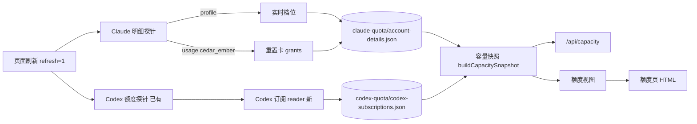

# FLY-2864 额度页第二轮四条 — 实施计划
Issue: FLY-2864 (https://linear.app/geoforge3d/issue/FLY-2864/额度页第二轮-founder-看了上线页后的四条删-token-状态列claude-充值卡读出真数据business-档位读成)
日期: 2026-09-24
基于: research.md, exploration.md

## 1. 结果（founder 看到的）

1. 两张表都没有「token 状态」列。
2. Claude「充值卡」格子显示真实的额度重置卡：张数 + 每张到期日；读不到时写「读不到（原因）」，不再出现「明细未提供」。
3. business 档位显示「Max 20x」，没有「待你确认」；`/api/capacity` 里 business 的 `rateLimitTier` 也是 `default_claude_max_20x`。
4. 最后一列「订阅到期」换成「下次扣费日」：Codex 每个号是 `10/22 周四` 这样的真日期（或「已取消 · 10/22 周四 到期」/「读不到（原因）」）；Claude 写「读不到（Anthropic 接口不给）」，已取消的号写「已取消」。

其余一切（分组、排序、在用号绿底、进度条、5h 列、周重置列、Codex 兑换卡、错误原因）不变。档位与扣费日都不进入分组、排序、切号或任何自动决策。



## 2. 范围与不变量

- 只改：`claude-quota/account-detail-observer.ts`、`claude-quota/account-detail-store.ts`、`bridge/capacity-snapshot.ts`、`bridge/account-quota-view.ts`、`bridge/account-quota-page.ts`、`bridge/plugin.ts`（刷新接线 + GET 传上下文）、`codex-quota/readonly-usage-reader.ts`（窄重构：抽出身份读取 helper，WHAM 请求/解析/刷新行为与 account id 校验不变）、新增 `account-heal/claude-cli-version.ts`、新增 `bridge/account-quota-refresh.ts`（刷新组合逻辑，见 3.3）、新增 `codex-quota/codex-subscription-reader.ts` 与 `codex-quota/codex-subscription-store.ts`，及对应测试。
- 不改：`account-heal/opus-model-sync.ts`（只 import 其已导出的 `runBounded`/`resolveBinary`）、凭据文件（只读）、`codex-accounts.json` 的 schema/校验、Codex 额度探针、切号/候选/告警模块、`tokenState`/`tokenStatus` 数据字段（只删页面列）、手填订阅 CLI 与文件格式。
- 永不发出：任何非 GET 请求；`/api/organizations/{org}/reset_rate_limits`；token refresh。reader 测试里对注入的请求函数断言 method=GET 且 URL 不含 `reset_rate_limits`。
- 所有外部响应在边界严格校验（整数、ISO 时间、枚举 token 正则、数组上限 128）。**外部时间归一化规则**：外部字段只接受带时区的 ISO 8601（`Z` 或 `±HH:MM`，可无毫秒，例如 `2026-10-22T16:00:00+00:00`、`2026-10-23T03:59:39Z`），`Date.parse` 有效且日历 round-trip 合法后统一存为 UTC `.toISOString()`；无时区、非字符串、无效日期一律拒绝（按 malformed 处理）。内部 store 继续只收 canonical `.toISOString()`。页面所有动态文字继续走 `escapeHtml`。store 不落 token、email、uuid、账号 id、grant id、label、支付信息。
- 分支已基于含 FLY-2803/2807 的 main（`637752fcc`）。

## 3. 数据合同

### 3.1 Claude 明细 store 加可选字段（向后兼容）

```ts
// claude-quota/account-detail-store.ts
export interface ClaudeTier { subscriptionType: string; rateLimitTier: string | null } // 与 PoolSubscriptionTier 同形
export interface ClaudeResetGrant { resetsLeft: number; resetsTotal: number; endsAt: string | null }
export interface ClaudeResetGrants {
  known: boolean;              // true: grants 是权威列表（可为 []）
  reason: string | null;       // known=false 时的安全枚举；known=true 时 null 或服务端「无卡」原因
  grants: ClaudeResetGrant[] | null; // known=false ⇒ null
}
interface ClaudeAccountDetailReading { /* 现有字段不变 */ tier?: ClaudeTier | null; resetGrants?: ClaudeResetGrants }
```

- 校验：字段缺失合法（旧文件）；存在时严格校验：`subscriptionType`/`rateLimitTier` 过 `^[A-Za-z0-9][A-Za-z0-9._-]{0,63}$`；`resetsLeft`、`resetsTotal` 为 0–1000 安全整数且 `resetsLeft<=resetsTotal`；`endsAt` 为 null 或 canonical ISO；`grants` ≤128；`known=false ⇒ grants=null`；`reason` 过 SAFE_STATUS。
- 旧版本回滚：旧 `validReading` 只检查已知字段，额外字段被忽略 → 回滚后仍可读。加一条测试：新 writer 输出能被「只含旧字段的校验」接受（把旧校验函数的副本放进测试夹具）。

### 3.2 Claude 明细探针（`account-detail-observer.ts`）

1. usage 请求 URL 从 `/api/oauth/usage` 改为 `/api/oauth/usage?cedar_ember=1&skip_spend=1`（固定常量，不拼接外部输入）。用量状态 `usageStatus` 的判定逻辑不变。
2. 新选项 `cliVersion?: () => Promise<string | null>`；生产默认 = 导出的 `readClaudeCliVersion()`（`runBounded(FLYWHEEL_CLAUDE_BIN ?? "claude", ["--version"], {timeoutMs: 5000, maxBytes: 4096})`，取 `^(\d+\.\d+\.\d+)`，失败返回 null）。整轮只调用一次。版本非 null 时 usage 请求加 `User-Agent: claude-cli/<ver> (external, cli)`；profile/prepaid 请求头不变。
3. `parseProfile` 增加 tier：`organization.organization_type` 过 token 正则后去掉 `claude_` 前缀得 `subscriptionType`（`claude_max→max`、`claude_pro→pro`、`claude_free→free`）；`organization.rate_limit_tier` 过 token 正则得 `rateLimitTier`，否则 null；`organization_type` 缺失/非法 ⇒ `tier:null`（不影响 uuid/订阅状态解析）。
4. 新纯函数 `parseClaudeResetGrants(usageBody, cliVersionKnown)`：
   - `cedar_ember` 缺失/null/非对象 ⇒ `{known:false, reason:"absent", grants:null}`。
   - `eligible===true` ⇒ 逐个校验 grants（`ends_at` 按外部时间归一化规则转 canonical；null 保留 null；任一非法 ⇒ `{known:false, reason:"malformed"}`），`{known:true, reason:null, grants}`。
   - `eligible===false` 且 `ineligible_reason === "no_grant"` ⇒ `{known:true, reason:"no_grant", grants:[]}`（服务端明确「没有发卡」，唯一被当作 0 张的门槛）。
   - `eligible===false` 且其它任何原因（`tier`、`seat`、`tenure`、`other_experiment`、`config_off`、`surface`、`cli_version`、`mobile`、`unavailable`、`unknown`、非法值）⇒ `{known:false, reason: cliVersionKnown ? <该值或 "unknown"> : "cli_version_unknown"}`。**`grants:[]` 在这里绝不当 0 张。**
5. 组装：usage 成功 ⇒ `resetGrants = parse(...)`；usage 失败（profile 成功）⇒ `resetGrants = {known:false, reason:<usage 错误枚举，如 "unauthorized"/"forbidden"/"network"/"deadline">, grants:null}`；本来就整条沿用上一轮的分支（凭据读不到、profile 失败、deadline、凭据变化）照旧整条沿用（含上一轮的 tier/resetGrants 与 observedAt），只更新现有的 `usageStatus`/`note`，与 2807 语义一致。
   - 显示层据此的规则（3.5）：当前 `usageStatus` 为 `unauthorized` 或 `forbidden:*` 时，卡格一律按 `usageStatus` 显示「读不到（原因）」，**不显示**沿用的历史卡（token 已死，无法担保）；其它沿用情况（deadline/network/凭据变化）显示沿用的历史卡（过期卡照规则滤掉）；没有任何 resetGrants（旧文件或首次无历史）时，原因从 `usageStatus` 兜底，而不是「接口未返回」。personal 当前正是 usage/profile 同为 401 → 「读不到（token 已失效，需重登）」。
6. 探针仍只 GET、`redirect:"error"`、固定 origin、每请求 5s、整轮 45s。

### 3.3 Codex 订阅（新）

`codex-quota/codex-subscription-reader.ts`：

```ts
export interface CodexSubscriptionReading {
  name: string;                 // slot 名
  identityKey?: string;         // codexInstallAccountKey(identity)，64 hex；只有无身份的 problem slot 可缺失
  observedAt: string | null;
  status: "active" | "canceled" | "none" | "unknown";
  renewsAt: string | null;      // 仅 active 且会续费
  endsAt: string | null;        // canceled 时的到期（cancels_at ?? active_until ?? expires_at）
  note: string | null;          // unauthorized | forbidden | blocked | network | malformed | identity_mismatch | deadline | problem:<code>
}
export interface CodexSubscriptionStore { version: 1; generatedAt: string; accounts: CodexSubscriptionReading[] }
```

- 读凭据：复用 `readonly-usage-reader.ts` 的身份绑定逻辑 —— 把其中「读 auth → `identifyCodexAuth` → key 比对 → 取 access_token/accountId」抽成导出的 `readVerifiedCodexAuth(authPath, registry, expectedAccountKey)`（WHAM reader 改为调用它，行为不变，原测试全绿证明）。当前在用号（canonical 身份相同）读 `canonicalAuthPath`，其余读 slot 的 `auth.json`，与 WHAM 规则一致。
- 请求：`node:https` GET `https://chatgpt.com/backend-api/subscriptions?account_id=<encodeURIComponent(accountId)>`，`accountId` 先过 UUID 正则；头：`Authorization`、`ChatGPT-Account-Id`、`Accept: application/json`、`User-Agent: flywheel-accounts-page/1`；10s 超时、响应体上限 256KiB、不跟随重定向（3xx ⇒ network）。测试通过注入 `request` 函数替换传输。**不用 `fetch`**（research §3：会被 Cloudflare 挑战）。
- 解析：`403` 且 `cf-mitigated: challenge` 或 HTML 体 ⇒ `blocked`；`401` ⇒ `unauthorized`；其它 403 ⇒ `forbidden`；非 2xx ⇒ `network`；JSON 不合法 ⇒ `malformed`。成功时：
  - `entitlement.has_active_subscription===false` ⇒ `status:"none"`。
  - 先校验：`cancels_at`、`active_until`、`expires_at`、`renews_at` 中任一字段**存在且非 null 但不合法**（违反第 2 节外部时间规则）⇒ 整条 `status:"unknown", note:"malformed"`（再按同身份历史回退规则处理），绝不据此判取消。
  - 校验通过后：有效订阅且（合法的非空 `cancels_at` 或顶层 `will_renew===false`）⇒ `status:"canceled"`，`endsAt = cancels_at ?? active_until ?? expires_at`（均已归一化；全部缺失/null ⇒ null，此时显示无日期的「已取消」）。
  - 有效订阅且会续费 ⇒ `status:"active"`，`renewsAt = entitlement.renews_at`（缺失/非法 ⇒ `status:"unknown"`, note `malformed`）。
- 无身份行合同：`identityKey` 缺失 ⇒ 必须 `status:"unknown"`、`observedAt/renewsAt/endsAt` 全为 null、`note` 为 `problem:<code>`；store validator 按此放行，其它行 identityKey 必填且 64 hex。无身份行永不沿用旧读数。
- 观察器 `observeCodexSubscriptions({profilesRoot, canonicalAuthPath, pool, previous, now, signal, request?})`：遍历 `pool.slots`（跳过 `invalid_name`；有 problem 的 slot 记 `note:"problem:<code>"` 不发请求，有 identity 时带 identityKey，没有则按无身份行合同），全部 slot 并发，整轮 20s deadline。失败时若上一轮同 name 且同 identityKey 有读数 ⇒ 沿用其 `status/renewsAt/endsAt/observedAt`，仅更新 note；身份变了 ⇒ 不沿用。
- store：`<stateDir>/codex-quota/codex-subscriptions.json`，0600，写临时文件 + fsync + rename（照 `writeClaudeAccountDetailStore`），读取 ≤256KiB、严格校验、name 唯一；读失败返回 null（页面显示「读不到」，不 503）。
- 接线：把 `plugin.ts` 里 `refreshCodexAccountQuota` 的组合逻辑抽到新 `bridge/account-quota-refresh.ts` 的 `createAccountQuotaRefresh(deps)`（deps = 各 observer 与 store 读写函数、ceiling 毫秒；plugin 只注入生产实现），行为：single-flight；Claude 明细与 Codex 分支并行；Codex 分支内 `observeCodexAccounts → writeCodexAccountQuotaStore → observeCodexSubscriptions → writeCodexSubscriptionStore` 严格顺序（用上刚刷新的 slot token）；订阅观察或写入的异常只 `console.warn`，**不**让刷新失败；原有的 Codex/Claude 失败语义不变。
- 失败时页面预期（明确三种情形）：①首次读就失败、无历史 ⇒「读不到（原因）」；②失败但有同身份历史、且历史日期不早于今天（PT）⇒ 显示历史日期（与卡片沿用策略一致）；③历史日期已早于今天 ⇒「读不到（读数已过期）」。订阅观察器整体抛错时旧 store 保留，同样按这三条显示。

### 3.4 容量快照（页面与 `/api/capacity` 共用）

- Claude：`subscriptionTier = detail?.tier ?? readPoolSubscriptionTier(...)` —— 实时档位优先，缺失才退回凭据文件缓存；`tier:null` 视同缺失。输出形状仍是 `PoolSubscriptionTier`，`/api/capacity` 消费者不用改。同时把 `detail.resetGrants` 以可选 `resetGrants` 投影到 account（与现有 `prepaid` 并列；缺失不输出键，老测试的 toEqual 不受影响）。
- Codex：`buildCapacitySnapshot` 读新 store（deps 可注入路径，默认从 `accountStorePath` 目录推导，与现有 codex store 同一规则），按 `name` 匹配：①订阅行与额度行 `identityKey` 都存在且相等 ⇒ 投影完整事实；②订阅行是无身份行（只有 `problem:*`）⇒ 只投影 `{status:"unknown", renewsAt:null, endsAt:null, observedAt:null, note}`（不含任何日期）；③其它（一边缺失或不等）⇒ 不投影。投影字段为 `CodexAccountProjection.subscription?: {status, renewsAt, endsAt, observedAt, note}`。

### 3.5 视图与页面

`account-quota-view.ts`：
- `AccountQuotaRow` 新增 `nextCharge: QuotaCell`（`expiry` 字段保留给巡检 tick，不动）。
- Claude `credits` 单元格（非取消行）新规则，替代 `claudePrepaidCell` 的显示：
  1. `resetGrants.known`（含沿用的历史值）⇒ 可用卡 = `resetsLeft>0` 且 (`endsAt` 为 null 或晚于生成时刻)；0 张 ⇒「0 张」；否则「N 张」+ 每张一行「#i 到期 2026/10/22」（沿用 `formatCardExpiry`，与 Codex 兑换卡同格式），`resetsLeft>1` 时追加「 · 剩 k 次」，`endsAt` null ⇒「#i 到期未知」。
  2. 否则若有 2807 的手填 `manualPrepaid` ⇒ 沿用原手填显示（未改）。
  0. （优先）当前 `usageStatus` 为 `unauthorized` ⇒「读不到（token 已失效，需重登）」；`forbidden:*` 且非取消行 ⇒「读不到（接口拒绝）」。
  3. 否则 ⇒「读不到（原因）」，原因取 `resetGrants.reason`，没有 resetGrants 时取当前 `usageStatus`：`unauthorized` →「token 已失效，需重登」；`surface`/`cli_version`/`cli_version_unknown` →「Claude Code 版本未识别」；`deadline` →「本轮超时」；`forbidden` →「接口拒绝」；无明细记录/其它 →「接口未返回」。
  - 取消行（`canceled`）仍显示「已取消」，不变。`prepaid tranches` 不再显示（数据仍存）。
- 删 `pageTier` 的 business 特例：档位格一律显示 `subscriptionTier.display`（Max 20x 等）。
- `nextCharge`：
  - Codex：`subscription` 缺失 ⇒「读不到（接口未返回）」；`active` 且 `renewsAt` ⇒ 日期（有错误 note 但沿用历史时同样显示历史日期）；若该日期（PT）早于生成时刻的 PT 日期 ⇒「读不到（读数已过期）」；`canceled` ⇒「已取消 · MM/DD 周X 到期」（无 endsAt ⇒「已取消」）；`none` ⇒「读不到（无有效订阅）」（没有有效订阅不等于取消续费）；`unknown`/仅有错误 ⇒「读不到（原因）」：`unauthorized`→「token 已失效」、`blocked`→「接口被拦」、`identity_mismatch`→「身份不符」、`problem:*`→「账号目录异常」、其它→「接口未返回」。
  - Claude：机器 `subscriptionStatus==="canceled"` 或手填最新确认为 `canceled` ⇒「已取消」；手填有 `expiresOn` ⇒「已取消 · MM/DD 周X 到期」；否则一律「读不到（Anthropic 接口不给）」。
  - 手填（2803 `manual.json`）对 Codex 只在机器没有 `subscription` 读数时作兜底，且只认 `canceled`。手填 `active`/`unknown` 不再产生显示（新列要的是扣费日，手填给不出）。2803 的「未知 · 状态待核对」冲突规则随旧列一起退役。
  - 日期格式：新增 `formatAccountQuotaPageDate(iso)` →「10/22 周四」（PT，`Intl` 取 month/day/weekday，与现有 `formatAccountQuotaPageInstant` 同一套 zh-CN 周几）；手填 `YYYY-MM-DD` 日历日不经时区换算，用 UTC 正午构造后取周几。

`account-quota-page.ts`：
- 删 Codex 的 token 列（表头与单元格）；列数按 provider 计算（Claude 7、Codex 6），`colspan` 用算出的列数（修掉现在写死的 7）。
- 最后一列表头「订阅到期」→「下次扣费日」，单元格渲染 `row.nextCharge.display`（escape）；原 `subscriptionText/renderSubscription` 由 view 层新规则取代，`AccountQuotaPageContext` 的 manual/identity 输入改为在 view 构建时使用（见 3.6）。

### 3.6 GET 接线

`plugin.ts` 的 GET `/api/accounts-page.html`：现有读 manual + identityKeys 的逻辑保留，改为作为 `buildAccountQuotaView(snapshot, {claudeEmails, subscriptionManual: {confirmations, identityKeys, onResolutionError}})` 的输入（view 需要它算 `nextCharge`）；`machineSubscriptions` 上下文删除（改由 snapshot 的 `subscriptionStatus` 在 view 内直接读）。Codex identityKeys 的读取条件从「manual 里有 Codex 记录」保持不变。

## 4. 实施步骤（每步先 RED 再 GREEN，再提交）

**T1 版本读取 + Claude store + 探针**（`claude-quota/__tests__/account-detail.test.ts`、新 `__tests__/claude-cli-version.test.ts`）
先做版本 helper：新 `account-heal/claude-cli-version.ts` 导出 `readClaudeCliVersion(bin?)`，复用已导出的 `runBounded`/`resolveBinary`（`opus-model-sync` 不改）；测试 `2.1.282 (Claude Code)`→`2.1.282`，空输出/非 0 退出/超时/缺失 → null。
RED：①profile 解析出 business 的 `{max, default_claude_max_20x}`、`claude_free` → `free`、非法 organization_type → `tier:null`；②usage 请求 URL 含 `cedar_ember=1&skip_spend=1` 且带 `claude-cli/2.1.282 (external, cli)` UA；版本 null 时不带 UA 且 `reason:"cli_version_unknown"`；③grants 矩阵：eligible true 1/2/0 张、resets_left 0、ends_at null、非法整数/时间 → malformed；eligible false × {no_grant→known [], surface→unknown, cli_version→unknown, 非法 reason→unknown}；cedar_ember 缺失 → absent；④usage 401 + profile 200 → `resetGrants.reason="unauthorized"`；profile 失败 → 整条沿用上一轮 tier/resetGrants；**usage+profile 同为 401 矩阵**：旧文件无新字段 / 首次无历史 / 已有历史 grants 三种都断言 store 形状（后两者的显示在 T5 断言为「读不到（token 已失效，需重登）」）；⑦外部时间原样 fixture（research 的 `+00:00`、无毫秒 `Z`）→ 存为 canonical；无时区/非法日期 → malformed；eligible false × 每个非 `no_grant` 门槛 → known:false（负测：永不产出 0 张）；⑤注入的 fetch 只收到 GET，URL 永不含 `reset_rate_limits`；⑥store 往返 + 旧 store（无新字段）可读 + 新输出过旧校验副本。GREEN 后提交。

**T2 WHAM 窄重构**：`readonly-usage-reader.ts` 抽出 `readVerifiedCodexAuth`，WHAM 请求、解析、account id 校验（不加 UUID 限制）完全不变；`readonly-usage-reader.test.ts` 原样全绿即证据。UUID 校验只放在 subscriptions 请求边界。

**T3 Codex 订阅 reader/store**（新 `codex-quota/__tests__/codex-subscription-reader.test.ts`、`codex-subscription-store.test.ts`；`readonly-usage-reader.test.ts` 回归）
RED：active→renewsAt；cancels_at→canceled+endsAt；will_renew false→canceled；has_active false→none（页面「读不到（无有效订阅）」，负测：不显示「已取消」）；无历史 + `will_renew:true` + 非法非空 `cancels_at` → unknown/malformed（负测：不显示「已取消」）；`will_renew:false` + 到期字段全 null → canceled 无日期；renews_at 缺失→unknown/malformed；401/403 challenge(cf-mitigated 头 或 text/html)/403 json/500/超时/超大体/3xx；accountId 非 UUID 不发请求；身份不符不发请求；在用号读 canonical auth；problem slot 不发请求；**正常号 + 未登录号（无 identity）+ 损坏号** 的 observer → write/read 全文件合法、无身份行无日期无沿用；research 原样时间 fixture 归一化；失败沿用同身份上一轮、身份变不沿用；deadline；请求函数只收到 GET、host 固定 `chatgpt.com`、UA 为 `flywheel-accounts-page/1`；store 往返、超大/重复 name/非法字段拒绝、0600。GREEN 后提交。

**T4 快照投影**（`capacity-snapshot.test.ts`、`capacity-route.test.ts`）
RED：detail 有 tier 20x + 凭据文件 5x ⇒ `/api/capacity` 的 business `subscriptionTier.rateLimitTier === "default_claude_max_20x"`；detail 无 tier ⇒ 退回凭据文件；resetGrants 透传；Codex subscription 在 identityKey 一致时投影、不一致/缺失时不投影、无身份 problem 行只投影 note；research 原样响应 → parse → write/read → snapshot → HTML，断言 Claude 卡「2026/10/22」、Codex business「10/22 周四」；新 store 缺失或损坏 ⇒ 快照正常、无 subscription 键。GREEN 后提交。

**T5 视图 + 页面**（`account-quota-view.test.ts`、`account-quota-page.test.ts`）
RED：①两表 DOM 无「token 状态」表头与 `.token-status`；Codex 行 6 个 td、Claude 行 7 个 td，unavailable 行 colspan 对应；②business 档位格文本「Max 20x」，全页不含「待你确认」「你说 20x」；③Claude 卡格矩阵（1 张+日期、0 张、剩余 0 不计、过期不计、unknown 各原因文案、取消行「已取消」、手填兜底仍在），全页不含「明细未提供」于 Claude 表；④下次扣费日矩阵（Codex active/过期/canceled 有无日期/none/各错误；Claude active→「读不到（Anthropic 接口不给）」、机器取消→「已取消」、手填取消带日期→「已取消 · 10/05 周一 到期」）；⑤日期格式 `10/22 周四`（含 DST 边界与跨年）；⑥**阴性**：同一组行把 tier 5x/20x/null、nextCharge 任意值互换，`buildAccountQuotaPageSections` 的分组与顺序完全一致；巡检 `formatAccountQuotaTickLines` 输出与改动前快照一致；⑦旧页面已有元素逐项仍在（账号名、在用标、周重置、5h、周用量条、Fable 条、兑换卡、错误原因）。GREEN 后提交。

**T6 接线**（新 `bridge/__tests__/account-quota-refresh.test.ts`；`capacity-route.test.ts` 覆盖 GET）
对 `createAccountQuotaRefresh` 真组合逻辑测试（只替换 observer/store 函数）：额度 store 写入先于订阅读取（调用顺序断言）；订阅观察抛错/写入抛错时刷新仍 resolve 且 Codex 结果正确；并发两次调用只跑一轮（single-flight），结束后第二次调用会再跑一轮；Codex/Claude 原失败语义不变。plugin 改为注入生产实现。GET 把 manual/identity 输入传给 view；GET 不写任何文件、不触发网络（非 refresh）。失败后三种显示情形（首读失败/可用历史/过期历史）在 T5 view 测试断言。

**T7 消费者清扫**：`rg` 证明新模块没有被切号/候选/告警模块 import；`subscriptionTier` 与 `nextCharge` 只在快照/视图/页面出现；没有新增对凭据文件的写。

## 5. 定向验证（不跑全量）

```sh
pnpm --filter flywheel-teamlead exec vitest run \
  src/claude-quota/__tests__/account-detail.test.ts \
  src/__tests__/claude-cli-version.test.ts \
  src/bridge/__tests__/account-quota-refresh.test.ts \
  src/codex-quota/__tests__/codex-subscription-reader.test.ts \
  src/codex-quota/__tests__/codex-subscription-store.test.ts \
  src/codex-quota/__tests__/readonly-usage-reader.test.ts \
  src/bridge/__tests__/capacity-snapshot.test.ts \
  src/bridge/__tests__/account-quota-view.test.ts \
  src/bridge/__tests__/account-quota-page.test.ts \
  src/__tests__/capacity-route.test.ts \
  src/__tests__/quota-monitor-credentials.test.ts
pnpm --filter flywheel-teamlead exec vitest related --run <changed ts files>
pnpm --filter "flywheel-teamlead..." build && pnpm --filter flywheel-teamlead typecheck
pnpm lint
```

worktree 需要先 `pnpm install --offline` + 拓扑 build（runner memory 已知坑）。

## 6. QA（必须真跑）

合并前 Bridge 生产实例跑的是 main，不会有新代码，所以分两段：

1. **分支真数据 harness（QA 节点做）**：用分支 `dist` 写一个一次性 node 脚本（放 QA 证据目录，不进产品代码），把两个新/改动的只读探针（Claude 明细、Codex 订阅）的 store 写到**临时目录**，其它输入读生产只读文件（`claude-accounts.json`、`codex-accounts.json`、凭据），调用 `buildCapacitySnapshot`（deps 指向临时 store）→ `buildAccountQuotaView` → `renderAccountsPageHtml` 得到 HTML；不运行 Codex 额度探针（它会刷新 token，生产 Bridge 负责）。逐行核验收 1–4 条；与现网页面（`flywheel-comm accounts-page --publish-only` 拿到的 main 版本）并排截图，逐项确认除四条外无消失。
2. **抽查一致性**：至少 1 个 Claude 号的卡到期日、1 个 Codex 号的下次扣费日，和 QA 自己用只读 GET 拿到的原始响应（脱敏）一致；写进 QA 报告。
3. **部署后**（Lead 负责触发，不在本单代码里）：`flywheel-comm accounts-page` 真跑一次（refresh=1），确认同样四条；`/api/capacity` 的 business `rateLimitTier` 为 20x。
4. 页面和报告里不出现 token、email、uuid、账号 id、grant id、支付卡信息。
5. personal 号 founder 正在重新登录；QA 时若已登好，该行卡格应有真数据（不再是「读不到（token 已失效，需重登）」），届时复核。

## 7. 风险与回滚

| 风险 | 处理 |
|---|---|
| Anthropic 改 cedar_ember 门槛/字段 | 解析失败 ⇒「读不到（原因）」，不写 0 张；版本号取自本机实际 CLI，随升级自动跟上 |
| 以 Claude Code CLI 身份读卡 | 我们自己的 Claude Code 账号、只读 GET、不领卡；设计里写明，测试断言无 POST |
| Cloudflare 规则变化拦 Codex subscriptions | 无可用历史时显示「读不到（接口被拦）」，有未过期的同身份历史时显示历史日期；不影响其它列与额度刷新 |
| 实时档位读失败 | 整条沿用上一轮（含 tier）；从未读到时退回凭据文件缓存（旧行为） |
| 扣费日数据陈旧 | 日期早于今天 ⇒「读不到（读数已过期）」，不显示过去的日期冒充下次扣费 |
| 回滚 | 回滚提交即可：新 store 文件被旧代码忽略；明细 store 新字段对旧校验无害；凭据与 Codex 额度 store 未改 |

## 8. 交付

设计节点：提交 exploration/research/plan/progress/founder HTML，走 design review，发布 HTML，complete。实现节点按 T1–T7 顺序，最后一个 commit 只新增 `engineering/doc/milestones/FLY-2864.md`。PR 正文附 research 里的接口、字段、脱敏样例，以及 Claude 扣费日「读不到」的原因（查过的 7 个来源）。

## 9. 修订轨迹

- v1（2026-09-24）：初稿。
- v2（Codex R1 CHANGES REQUESTED，7 条全部接受）：①Codex 无身份 problem 行合同（identityKey 可缺失、无日期、不沿用、只投影 note）；②只有 `no_grant` 算 0 张，其它门槛一律读不到；③personal 类 usage+profile 同为 401 时卡格按当前 usageStatus 显示「token 已失效，需重登」、不显示历史卡，缺 resetGrants 时从 usageStatus 兜底；④`has_active_subscription:false` 显示「读不到（无有效订阅）」而非「已取消」；⑤外部时间统一归一化为 canonical UTC 后入库，用 research 原样 fixture 测；⑥失败显示三情形写清，刷新组合逻辑抽成 `createAccountQuotaRefresh` 以真实测试顺序/隔离/single-flight；⑦范围补 `readonly-usage-reader.ts` 窄重构与 `claude-cli-version.ts`，版本 helper 并入 T1，UUID 限制只在 subscriptions 边界。
- v3（Codex R2 CHANGES REQUESTED，1 条接受）：Codex 订阅解析先校验所有时间字段，存在但非法 ⇒ unknown/malformed，不再据非法 `cancels_at` 判取消；T3 补对应负测。
