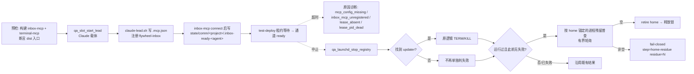

# FLY-2867 额外 Claude Lead 收件箱不起 — 实施计划

Issue: FLY-2867 (https://linear.app/geoforge3d/issue/FLY-2867/病根529-房-n-to-n-部署里-claude-载体的额外-lead-收件箱永远起不来inbox-ready-租约不出现-每次-120)
日期: 2026-09-24
基于: research.md

**Status**: approved v2（Bridge 同族设计评审 R1、R2 均 APPROVED；R2 的非阻断处置在实现阶段落地，见 §6）

## 0. 目标与非目标

目标（对应 issue「交付」1–4）：

1. 修掉 Claude 载体 Lead 在 529 房里收件箱永远不起的根因（缺陷 A：被测工作树没有 `packages/inbox-mcp/dist`，`claude-lead.sh` 静默不注册 flywheel-inbox）。
2. 中止路径与正常 teardown 的清理在新版 Codex（managed daemon，无 `pid-update-loop`）下能收敛，slot 锁自动释放，不再需要手删文件（缺陷 B）。
3. 本机可跑的用例：证明「按 529 房坐标起来的 Claude Lead 注册了 flywheel-inbox，且真 inbox-mcp 把租约写在 test-deploy 等待的那条路径上」；另有两处缺陷的红绿用例。
4. 修复头上真起一次 `test-deploy.sh 2 --generalized --stub-runner --lead-label Product-Test --extra-lead 4:Finance-Test`（rc=0），room-info 写进 PR（开/拆房前先 ask Lead）。

非目标：

- 不改 `claude-lead.sh` 缺 inbox-mcp 时「WARNING + 继续」的生产语义（生产从已全量构建的 main 启动，不受本缺陷影响；是否改为 fail-closed 另开单）。
- 不改 Codex 真正存在 updater 时的精确匹配 / TERM→KILL 逻辑，不新增任何杀进程路径。
- 不做租约等待期间的「提前中止」（同一 slot 目录可能残留上一轮的 `.mcp.json`，提前中止会误判）。



## 1. 缺陷 A：预检补建 Claude Lead 运行时加载的 MCP 包

### 1.1 `scripts/lib/qa-room.sh` 新增

```bash
# FLY-2867: claude-lead.sh loads these MCP servers from the checkout under test
# (packages/teamlead/scripts/../../<pkg>/dist). A missing inbox-mcp dist makes
# the Lead silently skip flywheel-inbox, so no .inbox-ready lease can appear.
QA_ROOM_CLAUDE_LEAD_MCP_ENTRIES=(
  packages/inbox-mcp/dist/index.js
  packages/terminal-mcp/dist/index.js
)
# stdout: each missing entry (repo-relative), one per line. rc 0 = none missing.
qa_room_claude_lead_mcp_missing() { … }
```

### 1.2 `scripts/test-deploy.sh` 预检（`flywheel-comm build` 之后、teamlead 之前或之后均可，放在 comm 之后因为两包都依赖 flywheel-comm 的类型）

```bash
  # 6. FLY-2867: claude-lead.sh registers flywheel-inbox only when the checkout
  #    under test has packages/inbox-mcp/dist; without it no .inbox-ready lease
  #    can ever appear. Neither package is in teamlead's dependency closure.
  pnpm --filter flywheel-inbox-mcp build || exit 20
  pnpm --filter flywheel-terminal-mcp build || exit 20
  _missing=$(qa_room_claude_lead_mcp_missing "$REPO_ROOT") || {
    printf 'ERROR: Claude Lead MCP artifacts missing after build: %s\n' \
      "$(tr '\n' ' ' <<<"$_missing")" >&2
    exit 20
  }
```

并把 `fail_preflight` 的汇总提示补上 inbox-mcp / terminal-mcp。无条件构建（主 Lead 默认也是 Claude 载体；两包 tsc 本机约 6 秒）。

### 1.3 租约超时给出原因

`scripts/lib/qa-room.sh` 新增 `qa_room_claude_lease_diagnosis <lead_workspace> <lease_file> [launch_ref]`，只读 `.mcp.json` 的**键**（不输出任何值；该文件含 token），stdout 输出一个稳定 token：

| token | 条件 |
|---|---|
| `lease_live` | 租约文件在且 pid 活着（到点瞬间才出现的竞态，如实报告） |
| `lease_pid_dead` | 租约文件在但 pid 不活 |
| `mcp_config_missing` | `<workspace>/.mcp.json` 不存在（claude-lead.sh 没走到写配置那步） |
| `mcp_config_stale` | 给了 `launch_ref` 且 `.mcp.json` 不比它新 —— 上一轮留下的，不能拿来判断本轮 |
| `mcp_config_unreadable` | 存在但 jq 解析失败 / 形状不是对象 |
| `inbox_mcp_unregistered` | 解析成功但没有 `flywheel-inbox`（本单的缺陷 A 形状） |
| `lease_absent` | 已注册、租约文件不在 |

`.mcp.json` 同时接受 `{mcpServers:{…}}` 与扁平两种形状（与 `claude-lead.sh::_emit_launch_plan` 一致）。
`launch_ref` 取该 Lead 的 `${SLOT_DIR}/launchd/<agent>/lead.plist`：它在每次启动前由 `qa_launchd_render_plist` 重新渲染、此后不再改写，
而 `.mcp.json` 由本次启动的 `claude-lead.sh` 在其后写出，所以「不比 plist 新」= 陈旧（`lead-coordinates.json` 会在拓扑校验后被重写，不适合做参照）。

接入点：

- 主 Lead（claude 分支）超时日志：`phase=lease` 时追加 ` reason=<token>`（`launch_ref` = 该 Lead 的 lead.plist，额外 Lead 同理）；
- 额外 Lead：循环里记 `XLEAD_NOT_READY_PHASE=lease|channel`（与主 Lead 对称），`campaign_abort` 文案追加 `phase=<…> reason=<token|channel_not_live>`。

只加诊断，不改等待时长、不提前中止。

## 2. 缺陷 B：Codex 停机「无 updater」改为有残留普查的收敛判据

### 2.1 `scripts/lib/qa-launchd-lead.sh` 新增

```bash
# FLY-2867: managed-daemon Codex (>=0.156) runs no pid-update-loop for a slot
# home, so "no updater" is a legitimate end state. Prove convergence instead by
# the absence of ANY process whose argv references this exact home.
qa_launchd_codex_home_residue_pids() {   # <codex_home> → pids on stdout; rc!=0 = probe failure
  processes=$(LC_ALL=C ps -ww -axo pid=,command=) || return 1   # 与 updater 普查同一条调用
  python3 …  # 路径集合 = {home, realpath(home), /tmp↔/private/tmp 别名}
             # 匹配 = 任一路径出现在 command 中，且其后不紧跟路径名字符 [A-Za-z0-9._-]
}
qa_launchd_codex_home_residue_wait() {   # <codex_home> → rc 0 = 普查为空；stdout 最后一次残留数
  有界轮询（150 × 0.2s，与 qa_launchd_wait_process_gone 同预算）；普查失败直接返回非 0
}
```

### 2.2 `qa_launchd_stop_codex_entry`：残留普查成为 retire 前的统一收敛契约

```bash
case "$updater_rc" in
  0) updater_state=stopped ;;
  "$QA_LAUNCHD_CODEX_UPDATER_NOT_FOUND") updater_state=not-found ;;   # 不再单独判失败
  *) qa_launchd_err "carrier=codex-tui step=updater-converge result=failed"; failed=1 ;;
esac
if [[ "$failed" == 0 && "$runtime_started" == 1 ]] \
    && ! residue=$(qa_launchd_codex_home_residue_wait "$codex_home"); then
  qa_launchd_err "carrier=codex-tui step=home-residue updater=${updater_state} residue=${residue:-unknown}"
  failed=1
fi
if [[ "$failed" == 0 ]]; then … qa_launchd_retire_codex_home …
```

- 「运行过」的证据补上 managed 布局的 `app-server-daemon/daemon.pid`（managed daemon 不写 `app-server.pid`，只写 `daemon.pid` / `daemon.pid.lock` / `daemon-updater.pid.lock`；
  现有 `daemon_pid_file` 只认 `app-server.pid`，于是 managed 下 daemon-converge 实际只等 socket 消失）。managed daemon 本身、它的子进程 `codex-code-mode-host`、
  残留 TUI 客户端都由统一普查兜住，不再依赖某个 pid 文件的文件名。
- updater 找到并停掉（rc 0）时同样要过普查 —— 否则 managed daemon / code-mode-host 若还活着，也会被直接 retire（评审 finding 2）。
- 普查只在「此前没有失败」时跑：已失败的 entry 本来就不会 retire，不必再等 30 秒。
- 错误文案换成 `step=home-residue updater=<stopped|not-found> residue=<N|unknown>`；旧的 `updater-converge result=not-found` 不再出现（下一次报错会带新名字）。
- 普查成功为空时不输出任何东西（与其它步骤的静默成功一致）。

### 2.3 为什么安全

- 任何仍引用该 home 的进程（argv 漂移的 updater、残留 TUI `codex resume --remote unix://…/cdxh/<agent>/…`、daemon 子进程 code-mode-host）⇒ 普查非空 ⇒ 仍然失败，锁仍保留（与今天相同的最坏结果）。
- 右边界约束防止 `cdxh/flywheel-test-2` 误匹配 `cdxh/flywheel-test-20`；左侧不设边界（多匹配只会更保守）。
- 普查只读进程表，不发信号；retire 仍走既有 `qa_launchd_retire_codex_home` 的 slot 命名空间校验。
- 已核对（只读）：slot 的 Codex TUI tmux server argv 是 `tmux new-session -Ad -s flywheel`，不含 home，不会被当成残留；TUI 客户端 `codex resume --remote unix://…/cdxh/<agent>/…` 含 home，它随 runtime 的 SIGTERM（`tui-window: killed`）退出。
- **边界（评审 finding 3，写明不做）**：只凭 `CODEX_HOME=<home>` 环境变量、argv 里不含 home 路径的进程（例如经 PATH 以裸 `codex` 起的进程）普查看不见。
  不补环境探针的理由：slot runtime 起的 Codex 进程全部用 home 下的绝对路径（`FLYWHEEL_CODEX_BIN` / daemon 的 current_exe，进程表可证）；宿主上的裸 `codex` 进程都是生产 / runner 进程、频繁起停，
  逐个 `ps eww` 探针在进程消失的间隙返回「探针失败」，按 fail-closed 会重新制造假不收敛；slot home 的 `auth.json` 是指向规范凭据的软链，retire 只删链接，不动规范凭据。

## 3. 测试计划（TDD：先红后绿）

### 3.1 `scripts/__tests__/fly1663-qa-launchd.test.sh`（缺陷 B）

- **B-green-managed**：home 按 **managed 真实布局**造（`app-server-daemon/daemon.pid` + `daemon-updater.pid.lock` + 控制 socket，**没有** `app-server.pid`）+ launch marker + 陈旧 runtime pid 文件；桩 `codex remote-control stop` 删掉 `daemon.pid` 与 socket；`ps` 里没有 updater、也没有引用该 home 的进程（但有一个名字只多一位的兄弟 home）⇒ `qa_launchd_stop_registry` rc=0、home 被 retire、行被剪掉、stderr 无错误。**修复前：红**（`updater-converge result=not-found`）。
- **B-residue**：同上但 `ps` 仍列出一个 argv 引用该 home 的进程（`<home>/packages/app-server-daemon/releases/r/bin/codex app-server daemon pid-update-loop --restore-release`，不匹配精确后缀）⇒ rc≠0、home 与 `auth.json` 保留、行保留、stderr 含 `step=home-residue updater=not-found residue=1`。**修复前：红**（文案不同）。
- **B-found-residue**：updater 被找到并 TERM 掉，但 managed daemon 进程仍在进程表里引用该 home ⇒ rc≠0、home 保留、stderr 含 `step=home-residue updater=stopped residue=1`。**修复前：红**（直接 retire）。
- **B-managed-evidence**：没有 launch marker、runtime pid、socket，只有 `app-server-daemon/daemon.pid`，且 `ps` 里仍有引用该 home 的进程 ⇒ 普查照样执行并失败（证明 `daemon.pid` 被当作「运行过」的证据）。**修复前：红**（`runtime_started=0` 直接 retire）。
- **B-boundary**：直接对 `qa_launchd_codex_home_residue_pids` 做单元断言：认 `/private/tmp` 别名、`unix://` 前缀、`CODEX_HOME=<home>` 的 argv；不认 `<home>0`、`<home>-b`、`<home>.bak`。
- 既有「argv 漂移不算收敛」「未启动 home 可 retire」「daemon 活着要失败」等用例保持绿。

### 3.2 `scripts/__tests__/test-deploy-fly1389.test.sh`（缺陷 A 的预检）

- 假仓库补 `packages/inbox-mcp/dist/index.js`、`packages/terminal-mcp/dist/index.js` 夹具（否则现有 E 用例全在预检死）。
- **P1 阴性 E2E**：临时移走假仓库的 `packages/inbox-mcp/dist` 跑 `run_deploy` ⇒ rc≠0、stderr 含 `Claude Lead MCP artifacts missing after build: packages/inbox-mcp/dist/index.js`、没有认领 slot 锁；恢复夹具。**修复前：红**（预检不检查，部署继续）。

### 3.3 新文件 `scripts/__tests__/fly2867-claude-lead-inbox-lease.test.sh`（交付 3 的本机自检；进 ci.yml Script Tests 6/6 的 FLY-1663 步骤）

- **L1** `qa_room_claude_lead_mcp_missing` 矩阵：两个都缺 / 缺一个 / 都在。
- **L2** `qa_room_claude_lease_diagnosis` 矩阵：七个 token 各一例（含 `mcp_config_stale`：`.mcp.json` 不比 `launch_ref` 新；以及扁平形状的 `.mcp.json`）；并断言输出里不含 `.mcp.json` 中的 token 值（金丝雀）。
- **L3** 真 `claude-lead.sh` dry-run（隔离 HOME、`env -i`、标准部门 Lead，`LEAD_WORKSPACE`/`FLYWHEEL_COMM_DB`/`FLYWHEEL_COMM_ROOT` 按 `qa_slot_start_lead` 的 529 房形状给出）⇒ launch plan 含 `MCP_SERVER\tflywheel-inbox`，`.mcp.json` 的 flywheel-inbox 条目指向本仓库 `packages/inbox-mcp/dist/index.js`。
- **L4** 用 L3 生成的 `.mcp.json` 的 flywheel-inbox 条目（command/args/env）像 Claude Code 那样拉起**真** inbox-mcp（stdin 保持打开），两种环境各一次：只给条目 env；条目 env + 继承的 `FLYWHEEL_COMM_ROOT` ⇒ 都在 `<slot>/state/comm/<project>/.inbox-ready-<agent>` 出现租约且 pid 存活（即 test-deploy 的 `LEASE_DIR`）；SIGTERM 后租约被删。
- dist 缺失时**失败**而不是 SKIP（CI 分片在 shell 用例前已 `pnpm build`）。
- 「通道 ready」不能本机证明（需要真 Discord gateway），交给交付 4 与 QA。

fly1389 的 C 用例（FLY-1608 夹具：额外 Lead `flywheel-test-30` 故意不给租约）让桩载体写一份**不含 flywheel-inbox** 的 `.mcp.json`，断言中止文案为 `phase=lease reason=inbox_mcp_unregistered` —— 这就是本单现场形状的 E2E。

fly1389 已有 E2E 证明「test-deploy 注入的 `FLYWHEEL_COMM_ROOT/<project>` 就是它等待的 `LEASE_DIR`」（桩 Lead 按该坐标写租约、部署成功）；L3+L4 补上「同一坐标 ⇒ 真 claude-lead.sh ⇒ 真 inbox-mcp ⇒ 同一租约路径」这一段，链路闭合。

### 3.4 本地验证（按 implement 规则，不跑全仓）

- `pnpm lint`
- `bash scripts/__tests__/fly1663-qa-launchd.test.sh`、`bash scripts/__tests__/fly1663-qa-launchd-mutants.test.sh`
- `bash scripts/__tests__/test-deploy-fly1389.test.sh`
- `bash scripts/__tests__/fly2867-claude-lead-inbox-lease.test.sh`
- `bash scripts/__tests__/ci-shell-suite-enumeration.test.sh`、`bash scripts/__tests__/ci-structure.test.sh`
- `git grep -lF` 找 `qa-room.sh` / `qa-launchd-lead.sh` / `test-deploy.sh` 的直接消费者，逐个跑或写明排除理由（进 PR）。

## 4. 真机（交付 4）与 QA 交接

- 开房前 `flywheel-comm ask` Lead（slot 2 / 4 当前是否空闲；⛔ slot 1、⛔ cmux-maintenance 标记）。
- 修复头上跑 `scripts/test-deploy.sh 2 --generalized --stub-runner --lead-label Product-Test --extra-lead 4:Finance-Test --expect-head <sha>`，rc=0，room-info 写进 PR；拆房同样先 ask。
- 给 QA 的复现要点（写进 PR）：
  - 阴性对照 A：还原预检改动**并** `rm -rf packages/inbox-mcp/dist packages/terminal-mcp/dist`（dist 一旦建好会一直在，只还原代码复现不了）⇒ 额外 Lead 租约超时，诊断为 `reason=inbox_mcp_unregistered`；
  - 中止路径 B：`--lead-ready-timeout 10` 让额外 Claude Lead 必然来不及 ⇒ 部署中止后 slot 2 / 4 锁自动释放、无 `updater-converge` 错误、`cdxh/` 下无 `auth.json`；随后 teardown 一次 rc=0。

## 5. 风险

| 风险 | 缓解 |
|---|---|
| 预检多 ~6 秒 | 在既有预检锁内，可接受 |
| 残留普查误把无关进程当残留 | 路径含 slot 号与 agent 名且有右边界；误报只导致 fail-closed（与今天相同） |
| managed 模型下存在未知形态、argv 不含 home 的 updater | 普查查不到它 ⇒ 判收敛 ⇒ home 被删。该进程若存在会在下一次同名 slot 部署时被 `qa_launchd_codex_updater_pids` / 既有 FLY-2174 reaper 看见；本次只读观察（slot 1 三小时）未见任何此类进程 |
| fly1389 夹具漏补 dist 导致全 E 用例红 | 计划内显式补夹具，并以 P1 阴性用例钉住 |
| 统一普查让「updater 找到」路径多一次进程表扫描 | 普查为空时一次 `ps` + 一次 python，毫秒级；只有真有残留才轮询 |

## 6. 设计评审记录

R1（Bridge 同族设计评审，request `f5f25465`，blob `17ce456d`）：APPROVED，6 条 findings 全部 MEDIUM/LOW（`medium_low_findings_are_non_blocking_v1`）。处置：

| finding | 处置 |
|---|---|
| managed-daemon-pid-record-layout | 采纳：`daemon.pid` 进「运行过」证据；managed 布局夹具；exploration 补记 |
| residue-census-only-on-not-found | 采纳：普查改为 retire 前统一契约（§2.2） |
| census-argv-blind-spot-bare-codex | 不实现，写明边界与理由（§2.3） |
| lease-diagnosis-stale-mcp-json | 采纳：`launch_ref` + `mcp_config_stale`；扁平形状 |
| research-claim-0157-no-updater | 采纳：exploration / research 措辞改为「slot 供给形态下无 updater」 |
| tests_incomplete | 知悉（评审轮只读、未跑 fly1389）；实现阶段本地跑全部相关套件 |

R2（request `38a0d1b1`，blob `ecc2ed43`，本计划 v2）：APPROVED，1 MEDIUM + 4 LOW，非阻断；Bridge 落下 coordinator 通道
`design_review_approval_proof state=approved`（同族 sanction `review_same_family_allowed`，Codex 额度至 2026-09-30 耗尽）。
以下处置在实现阶段落地（对已批准设计的细化，不改变方案）：

| finding | 处置 |
|---|---|
| census-vs-tmux-converge-ordering（MEDIUM） | 采纳评审给的第二个选项：**明确接受 fail-closed**。runtime 崩溃、TUI 客户端遗留时，停机不发任何信号（本单不新增杀进程路径），`home-residue` 报错行附 `pids=` 供人工核对后处置；补用例「runtime 崩溃遗留 TUI 客户端 ⇒ home 与锁保留」。runbook：teardown 报 `step=home-residue … pids=<list>` 时，逐个 `ps -o command= -p <pid>` 核对 argv 确属该 slot home，结束它们后重跑 teardown。 |
| stale-check-mtime-granularity（LOW） | 陈旧判定用 `find <mcp> -newer <launch_ref>`（BSD / GNU 都比较亚秒 mtime；bash 3.2 的 `-nt` 只到秒）；`launch_ref` 给了但不存在时**跳过**陈旧判定；L2 用 `touch -t` 固定时间戳，含「同一时刻 ⇒ 陈旧」与「ref 不存在 ⇒ 照常判定」。 |
| residue-boundary-rule-consistency（LOW） | §2.1 的边界统一为「其后不紧跟 `[A-Za-z0-9._-]`」（实现即如此）；B-boundary 补 `writable_roots=[<home>]` 与 `<home>,<other>` 两种应命中的形状。 |
| census-argv-blind-spot-bare-codex（LOW） | 评审确认边界成立，无动作。 |
| tests_incomplete（LOW） | 实现阶段本地全跑，结果见 PR。 |

实现备注：`qa_launchd_stop_codex_entry` 新增的局部变量命名为 `updater_disposition` / `home_residue`，避免经 bash 动态作用域遮住调用方（fly1663 的 ps 桩就依赖全局 `updater_state`，第一次命名撞上了它）。

## 7. 追加范围：teardown 留下语音房租约（Lead 2026-09-24 指令）

**现象**：`test-teardown.sh 3` 于 21:04 PDT rc=0 拆掉 slot 3，但
`/tmp/flywheel-voice-room-<guild>-<voice-channel>.lock`（`owner.json` 的 `slotDir=/private/tmp/flywheel-test-slot-3`，16:09 建）
没被释放，之后别的 slot 在同一语音频道起会话一律 `voice_room_lease_already_owned` / `voice_room_lease_conflict`。

**根因**：租约只在 `scripts/qa/fly2655-voice-room.mjs stop` 里释放；teardown 不经 `stop` 就拆房时租约永远留在 `/tmp`，
而 `acquireVoiceRoomLease` 遇到别的 slot 的租约只会报冲突，没有任何过期回收。语音守护进程是 `detached` 拉起的，租约里也没记录它。

**修复**（不新增杀进程路径）：

1. `start` 在守护进程拉起并确认存活后，把 `{pid, processIdentity}`（`ps -o lstart=,command=`）写进租约 `owner.json.daemon`。
2. `releaseVoiceRoomLeasesForSlot(slotDir)` + CLI `release-slot-leases --slot-dir <dir> [--lease-root <dir>]`（不需要 expected-head）：
   释放 `slotDir` 任一写法（原样 / realpath / `/tmp`↔`/private/tmp`）拥有的全部租约；若记录的守护进程仍以同一身份存活，则**保留并报告**，不删。
3. `acquireVoiceRoomLease` 遇到别的主人时，只有在「主人是 529 slot 路径、该目录（各写法）都已不存在、且记录的守护进程不在」时才回收：
   先 `rename` 成墓碑（两个回收者只能有一个成功）、复核墓碑里的主人仍陈旧（否则放回并报冲突），再删、再 `mkdir`。其余情形照旧冲突。
   畸形的 daemon 记录按「活着」处理（保守）。
4. `test-teardown.sh` 在删 slot 目录前（Step 6b）调用 `release-slot-leases`；用 `pwd -P` 解析脚本真实路径（该 CLI 只在 argv[1] 为真实路径时执行 main），
   node 可由 `FLYWHEEL_QA_NODE` 指定（与 test-deploy 同一旋钮）；输出必须是 `{"released":[…` 形状，否则告警——**失败只告警、不阻断拆房**。

**用例（先红后绿）**：`fly2655-voice-room.test.mjs` 四例新增 + 一例改造（活主人需真实存在的 slot 目录才保持冲突语义），全部用临时 lease root；
fly1389 E3：拆房前放两把合成 id 的租约（本 slot / 不存在的 slot 99），断言 teardown 后本 slot 的被释放、另一把原样保留（旧 teardown 下红）。
所有新用例都不触碰真实 `/tmp/flywheel-voice-room-*` 锁；跑用例前后对真实锁做了快照比对。

**不做**：teardown 不去停仍存活的语音守护进程（那是 `stop` 的职责，且会引入新的杀进程路径）；现存的 slot 3 陈旧锁按 Lead 指示不手动删，
修复合入后由下一次 slot 3 teardown 或任一 slot 的 `start` 按上述规则收掉。
