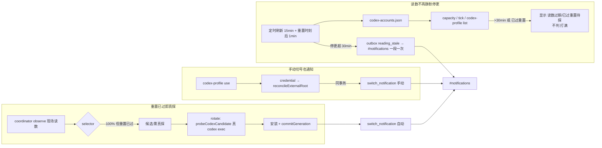

# FLY-2869 Codex 额度读数停更与切号通知 — 探索
Issue: FLY-2869 (https://linear.app/geoforge3d/issue/FLY-2869/codex-额度切号-额度读数停更-6-小时-号已重置却不自动切手动切号不发-notifications-通知founder-2026-09)
日期: 2026-09-24
基于: 无

## 1. 要回答的四个问题

1. `/api/capacity` 与巡检 tick 的「Codex 机器读数 · account/rateLimits/read」为什么从 15:4x PDT 起不再刷新？
2. school 20:06 PDT 已重置，为什么 21:05 PDT business 打满后系统没有自动切过去？
3. 21:07 PDT Lead 手动 `codex-profile use school`，为什么 #notifications 没收到切号通知？
4. 修完后怎样用一个回归证明「A 打满、B 读数过期但重置已过 → 真探 B → 切到 B → 通知」？

以下全部事实来自只读取证（生产 `teamlead.db` / `comm.db` 只读句柄、生产 dist 637752fc 原样回放、`ps` 只读、文件 mtime），零写入。

## 2. 现场事实

| # | 事实 | 证据 |
|---|------|------|
| F1 | `~/.flywheel/codex-quota/codex-accounts.json` 的 `generatedAt=2026-09-24T22:48:42Z`（15:48 PDT），文件 mtime 15:49 PDT，之后再无写入 | `ls -la`、文件内容 |
| F2 | 该文件只由账号页按需刷新（`POST /api/codex-accounts/refresh`、`?refresh=1`、`codex-profile list --refresh`）写入；代码注释与 FLY-2688 计划明写「never scheduled / 不加定时器」 | `codex-accounts-observer.ts` 头注释、`account-quota-refresh.ts`、FLY-2688 plan §E |
| F3 | 当时读数：school weekly 100%，resetAt `2026-09-25T03:06:04Z`（20:06 PDT）；business 80%；其余 100% | 文件内容 |
| F4 | `/api/capacity` 与 tick 的 Codex 块完全来自 F1 文件；Codex 的 stale 阈值借用 Claude `candidateSweepMinutes*2 = 120` 分钟；stale 只加标记，照样显示旧百分比、照样判「打满」 | `capacity-snapshot.ts` `projectCodexAccount`、`account-quota-view.ts` `tickQuotaBlock` |
| F5 | `codex-profile list` 的 token 状态同样读 F1 文件，不看观测时间，旧 100% 照样显示「打满」 | `flywheel-codex-profile.mjs` `tokenStatus()` |
| F6 | 自动切号 coordinator **不读** F1 文件：每轮 `CodexQuotaRuntime.observe()` 现场对每个号跑 `account/rateLimits/read`，selector 只接受 60 秒内的观测 | `runtime.ts` `observe()`、`candidate-selector.ts` `fresh()` |
| F7 | 21:05–21:30 PDT 的 9 条 usage-limit 信号事件全部 `disposition=manual`、`reason=[authority_unavailable]`，没有开任何 incident；同时向 #notifications 投递了 9 条「⚙️ 自动切号关着：readiness 权威不可用」 | `codex_quota_signal_event`、`codex_quota_outbox` 行 235–243 |
| F8 | `codex_quota_auto_switch` 旗标为 true；reason 历史：9-19 前 `flag_disabled`，9-21～9-24 `readiness_receipt_missing`，receipt 恢复后恒为 `authority_unavailable` | `flag_values`、outbox 行 184–243 |
| F9 | 21:07 PDT 的手动切号 Bridge 已检测到：`codex_quota_external_generation` gen12 → school @ `04:07:39Z`；这条路径（`reconcileExternalRoot`）只改 root，不发任何通知 | `codex_quota_external_generation`、`codex-quota-store.ts` |
| F10 | FLY-2673 的切号通知只在 `commitGeneration`（自动切号安装成功）里 enqueue `switch_notification`；投递依赖 `codex_quota_install_material`，手动切号没有这份材料 | `codex-quota-store.ts` `commitGeneration`、`outbox.ts` |
| F11 | readiness-receipt 在 22:31 PDT「被重铸」是例行：home-migration 的 `health` 周期每小时一轮并重铸 receipt（attempts 目录 12:49Z 起每小时一组） | `home-migration/attempts/*.json`、`schedule.json` |

## 3. 根因

### 3.1 读数停更（问题 1）

不是读数进程死、也不是号被打满：**读数从设计上就只在有人点账号页刷新时才更新**。15:48 PDT 之后没人刷新，于是 capacity/tick/`codex-profile list` 一直展示 5 小时前的值；而这三处都没有「过期就不作数」的语义（F4、F5）。Lead 看到 school 仍是 100%，于是判断无号可切。

### 3.2 没有自动切（问题 2）

旧读数**不是**自动切号没发生的原因（F6）。真正原因是 readiness 权威在生产上恒为 `authority_unavailable`（F7、F8）。用生产 dist 原样回放 host collector，当前宿主至少有 6 个独立的 fail-closed 卡点：

1. comm 根目录下 529 QA 房留下的符号链接 `test-slot-1/3/4` → `comm_shard_unsafe`（今天回放就停在这一步）；
2. comm 根目录里的归档目录没有 `comm.db` → ENOENT → `collector_failed`；
3. `sessions.vendor` 为空的 running/keep_alive 行 → `comm_identity_unknown`；
4. 85 条 Codex 会话被当成活执行（多数已终态但 `phase_keep_alive=1` 残留，另有 3 条自 9-15/16 卡 `running`）→ 全部 `comm_orphan`；
5. 9 个无 `CODEX_HOME` 的 codex 进程，含 founder 常驻的 ChatGPT.app 内置 `codex app-server` → `process_home_unknown`（global 级）；
6. 529 slot Lead 的 codex 进程 `CODEX_HOME` 在 `/tmp/flywheel-test-slot-*/cdxh`，不在批准清单 → `unapproved_live_home`。

第 5 条是 FLY-2523 已知并明确门控的：「生产 activation 另行门控（`activation.authorized=false`，`ownedBy: separate_gated_task`），直到 FLY-2729 证据与 `desktopCredentialAuthority` 满足」。也就是说**自动切号在生产上从未真正生效过**，不是 9-24 当晚坏的。

已按 Lead 指示把根因与估算上报（ask `3c53f3f3`）：属大改（collector 范围规则 + keep_alive 源头 + founder 对桌面版凭据的裁定），建议另开单；本单不修 readiness 本身。

即便 readiness 正常，还有一个次要缺口：若某号的现场读数仍是 100% 但 `resetsAt` 已过（服务端快照未翻页），selector 把它当成「窗口无效」直接排除，既不选它也不判号池耗尽，只会 60 秒后重试（`observation_unavailable`）。

### 3.3 手动切号没有通知（问题 3）

Bridge 在 `CodexQuotaRuntime.credential()` → `reconcileExternalRoot()` 里已经把手动切号记成新 generation（F9），但这条路径从未接通知；FLY-2673 的通知只挂在自动切号的 `commitGeneration`（F10）。

## 4. 修复方向（已获 Lead 同意 A–D）

- **A** 给 Codex 读数加定时刷新（只刷 Codex，不刷 Claude）：默认 15 分钟一轮，另在已知的重置时刻之后 1 分钟补一轮；推翻 FLY-2688「不加定时器」由 Lead 负责。
- **B** 读数超过 30 分钟，或 100% 窗口的重置时刻已过：capacity/tick/`codex-profile list` 显示「读数过期」/「已过重置待探」，不再判「打满」、不给恢复时刻；整条读数管线停更超过 30 分钟，经 codex quota outbox 发一条告警，每段停更只发一次。
- **C** selector 把「100% 但重置已过」的现场观测当作需真探候选（排在已知有额度的号之后）；`rotate()` 本来就先 `probeCodexCandidate`（真 `codex exec` 最小请求）再安装，真探失败则走既有 `probe_failed`。
- **D** `reconcileExternalRoot` 同事务 enqueue 同形 `switch_notification`，抬头原因写「手动」，走同一个 outbox 与 #notifications。

## 5. 不在本单范围

- readiness `authority_unavailable` 本身（§3.2 的 6 个卡点）——另开单，挂 FLY-2729 依赖。
- Claude 账号细节的刷新节奏。
- 账号页 HTML 的版式。
