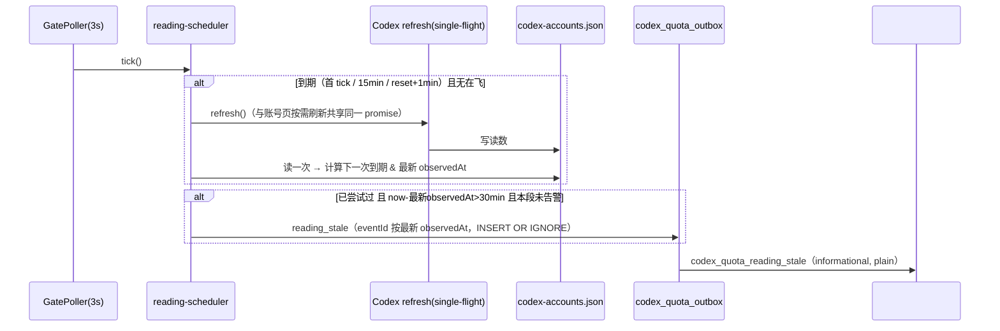

# FLY-2869 Codex 额度读数停更与切号通知 — 实施计划
Issue: FLY-2869 (https://linear.app/geoforge3d/issue/FLY-2869/codex-额度切号-额度读数停更-6-小时-号已重置却不自动切手动切号不发-notifications-通知founder-2026-09)
日期: 2026-09-24
基于: research.md

## 0. 锁定范围

做四件事（Lead 2026-09-25 批准 A–D）：

- **A 定时刷新 Codex 读数**：15 分钟一轮 + 已知 100% 窗口的重置时刻后 1 分钟补一轮；只刷 Codex。
- **B 过期即未知 + 停更告警**：读数 >30 分钟或 100% 窗口已过重置 → capacity / tick / `codex-profile list` 显示「读数过期」/「已过重置待探」，不判「打满」、不给恢复时刻；读数管线停更 >30 分钟 → 一段停更一条告警到 #notifications。
- **C 重置已过即真探**：selector 把「100% 且所有 100% 窗口都已过重置」的现场观测作为需真探候选；`rotate()` 既有真 `codex exec` 探活通过才安装。
- **D 手动切号同形通知**：`reconcileExternalRoot` 同事务 enqueue `switch_notification`，抬头「（手动）」，同一个 outbox → #notifications。

- **E readiness collector 卡点（founder 2026-09-24 23:20 PDT 直令并入原 FLY-2872，Lead 指令 35fc4a10）**：修掉 exploration §3.2 的 6 类卡点 + 设计期新核出的第 7 类（进程误判），见 §1.6。**上线即生效**：founder Q1=A——不加 activation 闸、不动 `codex_quota_auto_switch`，readiness 修通后自动切号随部署生效（§1.6.8）；报告附切号是否传导到在跑 Codex 的实测结论（§1.7，决定 FLY-2729 要不要做）与 running 无进程行清单。

不做：不清理宿主残留（符号链接/归档目录/keep_alive 残留都不动）；不改生产 comm.db / teamlead.db 里任何会话状态；不改 Claude 刷新节奏；不改账号页版式；不在生产真切号；不碰 business 号；不加 activation 旗标、不动 `codex_quota_auto_switch`（founder Q1=A）。

## 1. 设计



### 1.1 新鲜度（B，共享纯函数）

`packages/claude-runner/bin/codex-account-core.mjs`（+ `.d.mts`）新增：

```js
export const CODEX_READING_STALE_AFTER_MS = 30 * 60_000;
/** "fresh" | "stale" | "reset_elapsed" | "unobserved" */
export function codexReadingFreshness(reading, nowMs, staleAfterMs = CODEX_READING_STALE_AFTER_MS)
```

- `nowMs` 非有限数或 `staleAfterMs` 不是正有限数 → `unobserved`（fail closed，不抛）。
- `observedAt` 缺失/非法，或 `observedAt > nowMs + 60_000`（未来时间，沿用 capacity 其它观测的 60 秒时钟偏差上界；不 clamp 成 age 0）→ `unobserved`；
  `nowMs - observedAt > staleAfterMs` → `stale`（优先于 reset 判定）；
  任一 `usedPercent===100` 的窗口 `resetAt<=nowMs` → `reset_elapsed`；否则 `fresh`。
- 共享向量 `scripts/__tests__/fixtures/codex-reading-freshness-vectors.json`，teamlead 与 claude-runner 两边各跑一遍；向量含：恰好 30 分钟（fresh）/30 分钟+1ms（stale）、reset 恰好等于 now（reset_elapsed）、未来 60 秒（fresh）/60 秒+1ms（unobserved）、2099 年、非法 ISO、非法 `nowMs`（NaN/Infinity）、`staleAfterMs` 为 0 / 负数 / NaN / Infinity。
- 选址理由：`install-codex-guard.sh` 本来就把 `codex-account-core.mjs` 装进 codex-guard，`codex-profile` 不需要新文件。

投影规则（capacity、`codex-profile list` 同一套）：

| freshness | 百分比 | reset 时刻 | exhausted / recovery | tokenState |
|---|---|---|---|---|
| fresh | 原值 | 原值 | 原规则 | 原规则 |
| stale | null | 仅保留仍在未来的 | false / null | 凭据类状态优先，否则「读数过期」 |
| reset_elapsed | null | 仅保留仍在未来的 | false / null | 凭据类状态优先，否则「已过重置待探」 |
| unobserved | null | 仅保留仍在未来的 | false / null | 凭据类状态优先，否则「未探」 |

- capacity：`CodexAccountProjection` 加 `freshness`；Codex 块 `staleAfterMinutes=30`，`stale` 改为 `freshness==="stale"`；`codexTokenState` 保持纯函数不变（既有 token-state 共享向量不动），覆盖在投影层做。
- view/tick：`buildAccountQuotaView` 对 Codex 行改用并校验 `quota.codex.staleAfterMinutes`（不再传 Claude 的阈值；Codex 块缺该字段时按 30 处理，非有限/非正数视为非法快照）；数值经既有 `missingCell` 变 `n/a`；Codex 头部在「读数过期」「已过重置待探」时追加 `· <label>`；view `warnings` 追加一行 `Codex <name>：读数过期（N 分钟前），不作打满/可用判断`。测试用 Claude 120 / Codex 30、35 分钟前的读数证明两边阈值不串线。
- `codex-profile list`：`tokenStatus` 同表；JSON 追加 `freshness`；reset 字段同表。

### 1.2 定时刷新（A）

- `bridge/account-quota-refresh.ts` 拆出 `createCodexAccountQuotaRefresh(deps)`：Codex 支（observe → 写 store → 订阅，订阅失败仍只 warning）独立 single-flight + 自己的 90 秒上限；`createAccountQuotaRefresh` 改为接收 `refreshCodex`，Claude 支不变。按需与定时并发时只跑一轮 Codex 读。
- 新 `codex-quota/reading-scheduler.ts`：

```ts
export const CODEX_READING_REFRESH_INTERVAL_MS = 15 * 60_000;
export const CODEX_READING_RESET_GRACE_MS = 60_000;
export function nextCodexReadingRefreshAt(store, nowMs): number
  // min(now+15min, 最早的 [100% 窗口 resetAt+1min] 且 >now)
export function latestCodexObservationAt(store): number | null
export function createCodexReadingScheduler(opts: {
  now?; refresh(): Promise<unknown>; readStore(): CodexAccountQuotaStore | null;
  enqueueStaleAlert(input: { lastFreshAt: string | null; staleMinutes: number; lastError: string }): void;
}): { tick(): void }
```

  - 首次 `tick()` 立即刷；在飞时不重复发起。
  - **一轮的结果契约**：调度器在发起前后各读一次 store，取「有效（freshness 判定非 `unobserved`）的最大 `observedAt`」。结果只有三种 failure code：Promise reject → 错误消息若匹配 `/^[a-z0-9_:.-]{1,80}$/i` 原样保留，否则 `refresh_failed`；resolve 但最大 `observedAt` 没有推进 → `no_observation_advanced`（覆盖「每个 slot 都 carry 旧读数、整轮照常 resolve」的形状）；推进了 → 无 failure。
  - `tick()` 自身、`refresh()` 的 rejection、store 读取与 enqueue/close 的异常全部在调度器内捕获并 `console.warn` 一行（code 级），绝不形成 unhandled rejection，也不向 GatePoller 抛出。
  - **管线健康**只看观测时间，不看额度语义：`healthy` ⇔ 最大有效 `observedAt` 存在且 `now - observedAt <= 30min`（有效 = 可解析且不超过 now+60s）。`reset_elapsed` 的新读数同样算健康（读数管线恢复了，只是额度待真探）。
  - 调度器在每轮结束后以及之后每个 tick（仅在已尝试过至少一轮后）把 `{ nowIso, latestObservedAt, failureCode }` 交给 store 的单一事务方法（下述），不在内存里做去重。
- **停更段（episode）持久化**（Codex R1 #3、R2 #3）：新表 `codex_quota_reading_episode(episode_id TEXT PRIMARY KEY, stale_since TEXT NOT NULL, baseline_observed_at TEXT, opened_at TEXT NOT NULL, alerted_at TEXT, closed_at TEXT)`，部分唯一索引保证最多一行 `closed_at IS NULL`。
  - `CodexQuotaStore.observeCodexReadingPipeline({ nowIso, latestObservedAt, failureCode })`，一个事务；**`healthy` 由 store 在事务内自行推导**（Codex R3 #2）：先校验 `nowIso` 可解析、`latestObservedAt` 为 null 或可解析且不超过 now+60s（否则抛 `invalid_reading_pipeline_input`，不改任何行），再按 30 分钟阈值算 healthy：
    - `healthy` → 关闭未关闭段（若有），返回。
    - 不健康且无未关闭段 → 开新段：`episode_id = randomUUID()`，`stale_since = latestObservedAt ?? nowIso`（从未观测到时以**第一次判定不健康的时刻**为起点，落库后重启复用，不随 Bridge 启动时间重置）。
    - 不健康且 `alerted_at IS NULL` 且 `now - stale_since > 30min` → 写 `alerted_at` 并 enqueue `reading_stale`（eventId `codex-quota-reading-stale:<episode_id>`），同一事务。
  - 覆盖的形状（均为测试）：①无 store，Bridge 每 20 分钟「重启」（新调度器实例 + 同一 store）→ 起点不重置，累计超 30 分钟恰好一条；②告警后同一段连续重启 → 仍一条；③停更告警 → 恢复为 `reset_elapsed` 的新读数 → 关段 → 再次停更 → **第二条**；④无 store → 告警 → 恢复 → store 被删 → 重启 → 超时 → 第二条。
- `plugin.ts`：构造调度器；`onLandOperationTick` 改为 `try { await codexQuotaMaintenance.tick(); } finally { codexReadingScheduler.tick(); }`（VITEST 下同样早退），保证 D/维护链路的任何异常都不短路 A。
- outbox 行：`kind: "reading_stale"`、`incident_id: NULL`、`destination: "lead"`、payload `{ episodeId, staleSince, baselineObservedAt, failureCode, staleMinutesAtAlert }`（分钟数在 enqueue 事务里固化，Codex R3 #3：同一 eventId 的 ambiguous replay 渲染完全相同的正文）；正文里「最后一次成功读数」在 `baselineObservedAt` 为 null 时固定写「从未观测到」，非 null 才格式化成 PT。测试：首次 send 不落 receipt → 跨 30 分钟 replay → 两次正文逐字相等。
- outbox：`reading_stale` 分支 → `eventType: "codex_quota_reading_stale"`、`severity: "warning"`、`deliveryStyle: "plain"`，正文：
  `⚠️ Codex 额度读数已 N 分钟没有刷新成功（最后一次成功读数 <PT>）。capacity / tick / codex-profile list 已把各号显示为「读数过期」，不据此判断无号可切；需要时请真探。最近一次失败：<code>`
- 新告警类型按 research §4 的登记点逐一加（informational + plain）。

### 1.3 重置已过即真探（C）

- `candidate-selector.ts` 导出 `codexObservationResetElapsed(o, now)`：存在 100% 窗口，且所有 100% 窗口 `resetsAt!==null && resetsAt<=now`。判定**不看** `reached`（它与窗口来自同一快照，窗口已过重置则 `reached` 同样陈旧）；`limited()` 对 `resetElapsed` 观测一并忽略 `reached`。
- `windowsValid`：非 100% 窗口仍要求 `resetsAt===null || resetsAt>now`（过去的 reset 仍 fail closed）；**100% 窗口的过去 `resetsAt` 一律视为语法有效**（Codex R2 #4）。
- `limited(o) = (reached===true || 存在 100% 窗口) && !resetElapsed(o)`：
  - 所有 100% 窗口都有 reset 且都已过 → `resetElapsed`，不算 limited，成为需真探候选；
  - 混合形状（一个 100% 已过、另一个 100% 仍在未来或 reset 未知）→ 仍 limited ⇒ 全池如此时照常 `pool_exhausted`、容量守卫保持；其 `nextAttemptAt` 仍取 100% 窗口里最大的 reset（未来那个）。
- 候选顺序：已知有额度（原排序）→ `resetElapsed`（按 profile 名）→ scope 未知。
- `pool_exhausted` 判定只因上面的 `limited` 定义而变化，其余不变。
- `runtime.rotate()`：候选 `resetElapsed` 时通知快照 `to.windows=[]`。
- 容量守卫回放显式回归（Codex R1 #6，`StateStore.codex-quota.test.ts` 表驱动）：每行同时断言 selector `kind` 与 `hasCurrentCapacityGuard` 布尔值：①所有 100% 窗口已过 reset → `selected` / 守卫 false；②同一观测还有一个未来 reset 的 100% 窗口（全池皆如此）→ `pool_exhausted` / 守卫 true；③非 100% 窗口的过去 reset → `observation_unavailable` / 守卫 false（既有语义）；④新增 / 换身份的 pool member → 守卫 false（既有语义）。

### 1.4 手动切号通知（D）

- `switch-notification.ts`：`formatCodexSwitchNotification(snapshot, tz, trigger = "quota")`，`manual` 抬头 `Codex 已切号：**from → to**（手动）`，其余版式一字不改；`parseCodexSwitchNotificationSnapshot(value, { manual })` 手动时 `to` 按 identity label 校验。
- `codex-quota-store.ts`：`reconcileExternalRoot` 增加可选 `notification`；落新 generation 的同一事务 enqueue `switch_notification`（`incident_id=NULL`、eventId `codex:<rootKey>:<gen>:manual_switch`）；新增只读 `getExternalGeneration(rootKey, generation)`。
- **durable payload 规范（唯一形态）**：`{ reason: "manual_switch", rootKey: string, generation: number, notification: string | null }`，其中 `notification` 与自动切号一样是 `JSON.stringify(snapshot)` 字符串（有长度上限，超限存 `null`）；parser 只接受这一种形态。
- `runtime.ts`：`credential()` 的对账逻辑抽成导出函数 `reconcileCodexCanonicalRoot(...)`（见 §1.5），快照在调用 `reconcileExternalRoot` 前组好（邮箱取 pool，窗口取注入的 `readingWindows(profile, accountKey)`）。
- `plugin.ts`：`readingWindows` 读 `codex-accounts.json`，仅当 `name===profile && identityKey===accountKey && freshness==="fresh"` 时返回周窗口 `[{usedPercent, resetsAt}]`，否则 `[]`（渲染 n/a，不编造）。
- `outbox.ts`：手动行分支放在「按 incident 解析」的通用分支**之前**（以 `kind==="switch_notification" && payload.reason==="manual_switch"` 判别，不看 `incident_id`）：解析快照 → 对 `getExternalGeneration(rootKey, generation)` 核验 `to.profile/accountKey`；快照缺失/畸形/与 generation 行不符 → 退化为「from 取快照里通过校验的 profile（否则 `unknown`）、to 取 generation 行的 profile、其余 n/a」；generation 行也不存在 → 行保持 pending（等待运维修复，不编造）。`eventType: "quota_switch_confirmation"`、`info`、`plain`，与自动切号同路由。
- 测试覆盖：NULL incident 行被投递且标记 delivered；generation 身份不符 → 只留已核验 profile + n/a；畸形快照降级；投递完成后新建 delivery 实例（模拟进程重启）再跑不重复发送。

### 1.5 A、D 与自动切号旗标解耦（Codex R1 #1）

生产现在 `codex_quota_auto_switch=true`，但 A（读数）与 D（手动切号通知）都是只读/通知路径，不能因为有人关掉「自动改凭据」的旗标而跟着失效。现状两处依赖 runtime：observer 的在用判定用 `runtime.accountInUseGuard()`；手动切号检测只在 `runtime.credential()`。runtime 只在旗标开时构造（既有测试「flag OFF bypasses construction and binding with zero runtime calls」锁定这一点，本单不改）。

- **共享占用快照（Codex R2 #1）**：新类 `CodexAccountOccupancy`（`codex-quota/occupancy.ts`），唯一职责是持有「最近一次 host inventory 给出的在用事实」：
  - `wrap(collectHomes)`：返回一个 collector，每次被调用都先跑原 collector，再把结果里的 `canonicalChainActive`（及现有的「managed 且 active」推断）与 `activeUnsharedAccountKeys` 记进本实例；collector 抛错时记成「未知」（`isInUse` 对所有号返回 `"unknown"`，mutation 路径把 `"unknown"` 当作在用 → 拒绝；collector 抛错时 readiness 本就不通过、mutation 已被挡，故与现状等价，只是更显式）。
  - `isInUse(accountKey, pool, canonicalAuthPath): boolean | "unknown"`（同步，mutation 路径现有的 `candidateInUse()` 调用点改用它）。
  - `guard(canonicalAuthPath, pool)`：先 `refresh`（调用被 wrap 的 collector）再返回 `(accountKey) => isInUse(...)`，供账号页/定时读使用。
  - **发布 fencing（Codex R3 #1）**：每次采集开始时分配单调递增的 `generation`，并**立刻**把共享快照置为 unknown（`isInUse` 对所有号返回 `"unknown"`）；采集完成时只有 `generation === latestStarted` 才允许发布结果，较旧的调用晚到时把自己的 inventory 原样返回给自己的 caller（readiness 判定照旧），但不覆盖共享快照；失败保持 unknown。这样 probe 后的 `availability.refresh()` 一旦开始，任何更早启动的「空闲」结果都无法再撤销它。
  - 测试（deferred promise 控制完成顺序）：旧轮「空闲」/新轮「active-unshared」按相反顺序完成 → 快照为 active；新轮在飞期间 `isInUse` 为 `"unknown"`；在该乱序落点上 `rotate()` 拒绝、`recordInstalling` 为零。
- **同一个实例**贯穿三方：plugin 构造一个 occupancy，把 `occupancy.wrap(codexQuotaCollectHomes)` 同时交给 `CodexQuotaAvailability.check`（经 `checkCodexQuotaReadiness`）与 `CodexQuotaRuntime`（新可选 option `occupancy`，缺省时 runtime 自建一个，兼容现有测试）；账号 observer 的 `refreshInUse` 用 `occupancy.guard(...)`，无论 runtime 在不在。这顺带修掉一个既有缺口：生产 runtime 注入了 `availability`，其 `readiness()` 走 `availability.refresh()` 而非 `readinessResult()`，现行代码里 mutation 路径的在用快照只有账号页刷新时才更新；共享 wrap 后每次 availability 刷新都会更新它。`CodexQuotaRuntime.readinessResult()` 与 `accountInUseGuard()` 改为委托 occupancy，行为保持。
- 抽出 canonical 对账：导出 `reconcileCodexCanonicalRoot({ store, canonicalHome, pool, readingWindows })` = 现 `credential()` 主体（加锁读 canonical、`initializeRoot` / `reconcileExternalRoot` + 手动通知快照）；`CodexQuotaRuntime.credential()` 委托它。
- `plugin.ts`：observer 的 `refreshInUse` 改用 `occupancy.guard(...)`（不再依赖 runtime，不再抛 `codex_quota_runtime_unavailable`）；`createCodexQuotaMaintenance` 新增可选 `reconcileCanonical()`，**仅在 `runtime()` 缺席时**每 tick 调用（runtime 在时 `runtime.tick()` 本来就先调 `credential()`）。两者都不需要 apiToken、readiness 或 recovery。
- **错误隔离（Codex R2 #2）**：maintenance 里 `reconcileCanonical()` 包在自己的 try/catch 里，只 `console.warn` 一行 code（`quota_installation_pending` 等），不影响同一 tick 的 availability/legacy 迁移、outbox flush、audit；plugin 的 `onLandOperationTick` 用 `try/finally` 保证调度器无论维护链路成败都 tick。
- 安全性：旗标关时推进 root generation 与旗标开时下次启动 `credential()` 做的是同一次写；旗标关时 incident 已由 maintenance 交手工，`reconcileExternalRoot` 把未终结 incident 标 `identity_uncertain` 的既有语义不变。零 probe、零 install、零 recovery。
- 测试：
  - maintenance（runtime 缺席）：每 tick 调 `reconcileCanonical` 恰一次、runtime 在时不调；`reconcileCanonical` 抛错时 flush/audit 仍执行、`tick()` 不抛、下一 tick 仍重试。
  - 对账：真 `flywheel-codex-profile.mjs use` 后 `reconcileCodexCanonicalRoot` 产出恰一条手动通知；重复对账不重复；零 probe（fake 二进制 journal 为空）、零 `recordInstalling`。
  - occupancy：collector 抛错 → 所有号 `"unknown"`；**带 `availability` 的 runtime**：collector 报某号 active-unshared → 经 `availability.refresh()` 后 `observe()` 把该号记为 `in_use_unshared` 且不读它、`rotate()` 在 probe 前拒绝、`recordInstalling` 为零；同一 collector 在 probe 期间翻成 active-unshared → probe 后拒绝安装。
  - plugin 层接线（try/finally、同一 occupancy 实例、`readingWindows`）由代码评审核对 + QA 在旗标关的隔离房验证。

### 1.6 readiness collector 卡点（E，原 FLY-2872）

现状（`codex-quota/host-readiness.ts` `createCodexQuotaHostCollector`）：任何一个无法归属的事实都让 `complete=false` → `authority_unavailable`。修法原则：**只放行有可核验依据的那一类，其余一律保持 fail-closed**；每条放行写成独立的具名谓词（便于 QA 逐条变异做阴性对照），放行时记一条非阻断诊断（`scope: "info"`，不影响 `complete`），让它在回放里可见而不是静默消失。

1. **⑦ 进程分类（设计期新核出，Lead Q4 已裁定纳入；readiness R1 #1 收紧联结契约）**：现用正则扫 `ps eww` 整行（参数+环境变量），环境变量值以 `/codex` 结尾（如 `XDG_CACHE_HOME=…/codex`）或参数里带 `codex` 词的 Claude runner / zsh / node 都被当成「无 CODEX_HOME 的 codex」。改为**按内核可执行文件名判定**：`ucomm` 是内核在 exec 时从可执行文件名写入的 `p_comm`（≤16 字符，不受 argv0 影响；实测 Claude runner 为 `2.1.282`、`exec -a` 伪装的进程仍显示真实文件名，全机一次 26ms）。
   - **三次 ps、夹住权威快照**（readiness R2 #1）：args 快照① `/bin/ps -axww -o pid=,lstart=,command=` → 权威快照 `/bin/ps -axeww -o pid=,lstart=,ucomm=,command=`（同一行给出 ucomm 与「参数+环境」）→ args 快照②（同①）。只在权威快照里判 codex：`lstart` 之后的列以 `codex` 加至少一个空格开头（ucomm 列左对齐补空格）。
   - 对权威快照里每个 codex 行，按 `(pid, lstart)` 要求 args ① 与 ② 里**各恰好一行且两者逐字相等**（稳定 argv），权威行的命令必须**逐字**以这个稳定 args 命令开头、紧接一个空格或行尾；环境只从剥掉这个前缀后的后缀解析（`KEY=value`，值不含空白）。任一不满足——任一 args 快照缺行或重复、前后 args 不等（包括「新 argv 是旧 argv 的严格扩展」这种同 pid/lstart 的 exec）、权威行前缀不符、后缀里 `CODEX_HOME` / `HOME` / `FLYWHEEL_EXEC_ID` 任一出现多于一次——都记全局 `process_home_unknown`（fail closed，下一 tick 重采）。参数里伪造的 `CODEX_HOME=…` 因在稳定前缀里而被剥掉。
   - 真 codex 但后缀里无 `CODEX_HOME`（各会话 `codex:rescue` 起的 companion app-server）：仅当后缀里 `HOME` 恰好一次、且 `realpath($HOME/.codex) === realpath(canonical)` 时归入 canonical，否则 `process_home_unknown`。
   - `processSnapshot` 测试注入口改为三个具名快照 `{ argsBefore: string, authoritative: string, argsAfter: string }`（readiness R3 #2），各自做非空 / 大小上限 / 重复行校验；「args ① 是 ② 的严格前缀」等硬红经这个公开注入口提供两份不同的 args，不 mock 解析器内部函数。已知局限：被改名成非 `codex` 文件名的 codex 二进制不会被识别（与现状的正则同样识别不了）。
2. **⑤ 桌面版 ChatGPT 内置 codex（founder 裁定排除，按可核验身份；Lead Q5 同意；readiness R1 #3 固定解析契约）**：谓词 `isVerifiedDesktopCodex(pid, argsCommand)` 同时满足才放行：
   - args 口径 argv0（第一个 token）恰为 `/Applications/ChatGPT.app/Contents/Resources/codex`；
   - 内核可执行路径：`lsof -a -p <pid> -d txt -Fn`（timeout 5s、maxBuffer 64KiB）输出里第一条 `n` 行逐字等于上面路径（实测 44ms）；
   - `codesign --verify <path>`（timeout 20s）exit 0；
   - `codesign -dv --verbose=2 <path>`（timeout 20s、maxBuffer 64KiB）从 **stderr** 解析：第一条 `Authority=` 行（leaf）逐字等于 `Developer ID Application: OpenAI OpCo, LLC (2DC432GLL2)`；`TeamIdentifier=` 行恰好一条且逐字等于 `2DC432GLL2`（本机实测输出形状：三条 Authority —— leaf、`Developer ID Certification Authority`、`Apple Root CA` —— 与单独一行 TeamIdentifier，fixture 按此形状）。缺失、重复冲突、非零退出、超时一律不放行 → `process_home_unknown`。
   - 签名结果按 `(路径, inode, mtime)` 在 Bridge 进程内缓存；inode 或 mtime 变化即重新验签。放行时记非阻断诊断 `desktop_codex_excluded`（含 pid）。
3. **⑥ 529 测试房 home**：谓词 `isTestSlotHome(home)`：`CODEX_HOME` 的 realpath 匹配 `^/private/tmp/flywheel-test-slot-\d+/`（`/tmp` 在 macOS 是 `/private/tmp` 的链接，统一按 realpath 判）→ 不计入生产 readiness；realpath 取不到 → 仍 `unapproved_live_home`。（实测 slot-1 的 `auth.json` 本就是指向生产 canonical 的符号链接，会跟随切号。）
4. **① comm 根目录的符号链接分片**：只有 realpath 落在上面的测试房前缀下的链接才跳过；其它符号链接仍抛 `comm_shard_unsafe`。
5. **② 归档目录**：**未注册**（不在 `projects.json`）且不含 `comm.db` 的目录跳过；已注册项目缺 `comm.db` 仍 `collector_failed`。
6. **③ vendor 为空的行**：生产 6 行全是 `tmux_window` 以 `:pending` 结尾的预登记占位（runner 从未自登记，vendor 由自登记写入）。只放行「vendor 空 **且** `:pending`」；vendor 空但非 pending 仍 `comm_identity_unknown`。安全性：若这类执行真有 codex 进程在跑，进程侧（lease/归属）照样要求它被匹配，否则 `activity=unknown`。
7. **④ CommDB 活执行判定（Lead Q2/Q3 已裁定）**：
   - 终态行（`completed/timeout/blocked/failed`）即使 `phase_keep_alive=1`，也只在「有带该 `FLYWHEEL_EXEC_ID` 的活 codex 进程，或某批准 home 的 `.flywheel-leases` 里有它」时算活执行（parked 持有者），否则视为残留、不产生 `comm_orphan`。**不在「进入终态」时清零 keep_alive**：它是 parked 持有者被 `activateSessionForWake` 原地复活时依赖的标记（Lead Q2：源头不改）。
   - `status=running` 但无活进程的行（2519/2608/2619/2766）：三个条件（全机无带该 exec id 的 codex 进程；任何批准 home 的 lease 里都没有；`started_at` 早于 15 分钟）必须在**连续的完整采集中持续成立至少 60 秒**（readiness R1 #2 / R2 #2 + Lead 两次采样加严）。`StaleRunningTracker`（collector 实例内、可注入单调时钟，默认 `performance.now()`）的发布规则：
     - 每次采集开始时分配递增 `generation` 并记录开始时的单调时刻；采集结束时只有 `generation > lastCommitted` 才能提交 tracker（晚到的旧轮不得修改，且只按 blocking 判断返回给自己的 caller）。
     - 只有「所有 comm.db 读取、权威进程快照（含 §1.6.1 三次 ps 联结）、全部批准 home 的 lease 读取」都成功的**完整轮**才能推进；任何失败/不完整轮提交为「重置」（清空全部候选）。
     - 键 = `(comm.db 的 realpath, execution_id, started_at)`；某轮不再满足（出现进程 / 出现 lease / 行消失 / status 或 started_at 变化）→ 清除该键。
     - 首次满足时把 `firstConfirmedAt` 记为**该完整轮成功提交时**的单调时刻（不是该轮开始时刻，readiness R3 #1）；之后只有「开始时刻 ≥ `firstConfirmedAt` + 60 秒」且自身完整成功的轮才可成熟为非阻断诊断 `comm_stale_running`；在此之前开始（哪怕之后才完成）的轮一律仍按 `comm_orphan`（blocking）。Bridge 重启 = 从头计时；墙钟跳变不影响（只用单调时钟）。硬红：首轮耗时 >60 秒、紧接着的第二轮仍 `comm_orphan`；从首轮提交后再满 60 秒才开始的第三轮才允许 `comm_stale_running`。
     - `started_at` 是 SQLite `CURRENT_TIMESTAMP`：严格匹配 `^\d{4}-\d{2}-\d{2} \d{2}:\d{2}:\d{2}$`，按 UTC 解析（改写为 `…T…Z`）后再做日历回写校验（精确表达式 ``${new Date(rewritten).toISOString().slice(0, 19)}Z === rewritten``，防 `2026-02-30` 被归一化；向量含合法闰日 `2028-02-29 00:00:00` 与非法 `2026-02-30 00:00:00`，readiness R3 #3）；null / 格式不符 / 日历非法 / 未来超过 60 秒一律 fail-closed（仍 `comm_orphan`）。
     - 不改库。交卷报告逐条列出生产上这类行（execution_id + 证据），供 Lead 交 founder 走 R2。
8. **activation（founder 2026-09-25 裁定 Q1=A，Lead 指令 28d4734a）**：**不加** activation 旗标、**不动** `codex_quota_auto_switch`；readiness 修通后随部署生效。Bridge 现有的闸仍是 `codex_quota_auto_switch`（kill_switch、default_on、生产 true）+ global readiness。交卷报告写清：**上线即生效**（合并部署即启用生产自动切号）；切号是否传导到在跑 Codex 的实测结论（§1.7：已测的非 refresh 路径与 15 秒窗口内不跟随；refresh 等路径未测；据此保守判断 FLY-2729 需要做）；以及 running 无进程行的清单（execution_id + 证据）。
9. **测试（readiness R1 #4：逐谓词证明，组合 fixture 只作组合回归）**：
   - **单一放行矩阵**（切片 12–16 各一张表，**逐行显式期望**，readiness R2 #3）：同一个最小 baseline 先断言原 blocker 与原因码 → 只加入一个获准事实 → 按该行的期望断言 → 再逐个破坏该事实 → 断言回到原原因码与 scope。每行期望固定为下列之一：
     - **排除/忽略类**（⑦ 误判回归、⑤ 桌面版、⑥ 测试房 home、① 测试房分片链接、② 归档目录、③ pending 预登记、④ 终态残留、running 持续缺席满 60 秒）：`complete=true`、`registeredComplete=true`，且出现固定的 info 诊断——`desktop_codex_excluded`（含 pid）、`test_slot_home_excluded`（含 realpath）、`test_slot_comm_shard_skipped`、`unregistered_comm_dir_skipped`、`pending_preregistration_skipped`（含 execution_id）、`terminal_session_residue`（含 execution_id）、`comm_stale_running`（含 execution_id、started_at）；⑦ 的 Claude/zsh/node 本来就不是 reader，只断言不出现 `process_home_unknown`。被排除的 reader 不出现在生产 `homes`/active 里，由对应 info 诊断追踪。
     - **仍进入原归属类**（④ 终态行「只有进程」「只有 lease」）：断言该行没有被当残留丢弃、进入原 reconciliation；「只有 lease」照旧得到 `lease_without_process`、`complete=false`（lease 从来不等于活着），「只有进程」按原规则匹配。
     - **HOME→canonical 正例**：该 codex 进程出现在 canonical 的 active 集合里（`canonicalChainActive=true`），`complete=true`。
   - 必含的阴性/边界：
     - ⑦：Claude runner（`XDG_CACHE_HOME=…/codex`）、zsh、node 各一条误判回归；codex 只在权威快照出现（args 缺行）；同 pid/lstart 发生 exec（前缀不符）；args ① 是 ② 的严格前缀、新增 argv 恰为 `CODEX_HOME=` / `HOME=` / `FLYWHEEL_EXEC_ID=`（不得解析为环境）；args 里伪造 `CODEX_HOME=` token；后缀重复 `CODEX_HOME`/`HOME`/`FLYWHEEL_EXEC_ID`；无 CODEX_HOME 且 `HOME/.codex` 等于 canonical 的正例、不等的反例。
     - ⑤：真实三条 Authority 形状的正例；分别变异 leaf Authority、TeamIdentifier（缺失/重复/不同值）、`--verify` 非零、lsof 路径不符、argv0 伪装；inode 或 mtime 变化触发重新验签。
     - ⑥①：slot 前缀下的 home 正例；`/tmp` 下非 slot 前缀反例；slot 路径里的符号链接 realpath 逃逸到前缀外反例；指向测试房以外的 comm 分片链接 → `comm_shard_unsafe`。
     - ②③：未注册无库目录正例；已注册项目缺库 → `collector_failed`；vendor 空且 `:pending` 正例；vendor 空非 pending → `comm_identity_unknown`。
     - ④：终态 keep_alive 残留（无进程无 lease）正例；终态行「只有进程」「只有 lease」两个 OR 分支各一条（期望见上）；running 无进程：首轮 blocking → 满 60 秒 info；两轮之间出现进程 / 出现 lease / 行 identity 变化 → 清除候选；deferred promise 控制的并发乱序（旧轮晚到不得推进或清除）；夹在两次缺席之间的不完整轮 → 重置；注入单调时钟模拟墙钟跳变不影响；新 tracker 实例（Bridge 重启）从头计时；`started_at` 恰好 15 分钟与 15 分钟+1 秒；格式不符、`2026-02-30 00:00:00`、未来时间。
   - **组合回归**：fixture 宿主一次放齐 7 类残留（④ 用「终态行 keep_alive 残留」）→ `complete=true`、`checkCodexQuotaReadiness.ready=true`，同一 fixture 下 `CodexQuotaAvailability`（旗标开）为 automatic；另设硬红：「running 但无进程」不满 60 秒持续缺席时仍 `comm_orphan`。
   - 安全不退化：未知 home 的真 codex（非 ChatGPT.app）仍 fail-closed；活 codex 执行的 home 不在清单上仍拒绝。
   - 生产只读回放：沿用 exploration 的零写入回放脚本（生产 dist 换成本分支 dist），逐条列出剩余原因码。

### 1.7 实测：切号后在跑的 Codex 会不会跟着换号（Lead 指令 28d4734a，决定 FLY-2729 要不要做）

隔离 `CODEX_HOME`（scratchpad）里 `auth.json` 只做**软链**到 `~/.codex/profiles/<A>/auth.json`（不复制任何凭据）；A/B 选不在用、非 business 的号（当前 canonical 是 school，故用 personal1/personal2）；实验期间按生产协议持有两个号的 account lease，避免与 Bridge 按需读数并发。起一个长驻 `codex app-server`（与生产同版本 0.157.0）：`initialize` → `account/read {refreshToken:false}` + `account/rateLimits/read` 记下账号（email 比对 + 各号不同的 reset 时刻作第二指纹）→ 不重启，原子换软链到 B → 再读两次（立即 + 延时）→ 结论「会跟 / 不会跟 / 只在 refresh 时跟」。实验前后记录两个 slot 文件的 sha256 与软链状态，证明没有写穿/被替换。token refresh 路径（`account/read {refreshToken:true}` 会真轮换 refresh token）有损坏号的风险，先报告再按 Lead 意见决定是否做。原始输出（email 打码）附进交卷报告。

**结果（2026-09-25 06:37Z，证据 `evidence/token-follow-run1.jsonl`、`evidence/token-follow-run2-reversed.jsonl`）：在已测的非 refresh 路径（`account/read {refreshToken:false}` + `account/rateLimits/read`）与 15 秒窗口内不跟随；refresh / 认证或配额错误后的重载 / 实际模型请求路径未测。「FLY-2729 需要做」是基于该证据的保守工程结论。** run1 personal1→personal2、run2 反向对照：新起的 app-server 读的是软链当时指向的号；原子换链后立即与 15 秒后，`account/read` 的 email 与 `rateLimits/read` 的 reset 指纹都仍是启动时的号（1790395467 / 1790544346 各自不变）。两轮 slot 文件 sha256 前后一致、home 的 `auth.json` 仍是软链，没有写穿或被替换。refresh 路径未测（在真 slot 上强制 refresh 可能把旧号 token 写穿进新号 slot），低风险变体待 Lead 决定。

## 2. 实施切片（每片先红后绿，小提交）

| # | 切片 | 红 | 绿 |
|---|---|---|---|
| 1 | freshness 纯函数 + 向量 | 新测试 import 不存在的导出；未来时间向量 | `codex-account-core.mjs/.d.mts` |
| 2 | capacity 投影 + view/tick | 35 分钟前 100% 仍判打满；Claude 120/Codex 30 串线 | `projectCodexAccount`、`buildAccountQuotaView`、`tickQuotaBlock`、warnings |
| 3 | `codex-profile list` | 旧读数仍显示「打满」 | `tokenStatus`；既有用例改相对时间 |
| 4 | selector + 容量守卫回放 | reset 已过的唯一号不被选；回放表 | `candidate-selector.ts` |
| 5 | rotate 快照 | reset 已过候选的「新账号」写出 100% | `runtime.rotate` |
| 6 | 格式器 + store 手动行 | 手动切号 outbox 零行 | `switch-notification.ts`、`reconcileExternalRoot`、`getExternalGeneration` |
| 7 | 共享占用 + 对账抽取 + 手动投递 | 真 `codex-profile use` 后无通知；runtime 缺席时无对账；availability 刷新后 observe 仍读在用号 | `occupancy.ts`、`reconcileCodexCanonicalRoot`、maintenance `reconcileCanonical`（带错误隔离）、outbox 手动分支 |
| 8 | 刷新拆分 + 调度器 | 调度器模块不存在 / 并发跑两轮 / 零推进无 code | `account-quota-refresh.ts`、`reading-scheduler.ts` |
| 9 | 停更段 + 告警类型 + 投递 | 重启后重复告警 / 恢复后第二段被吞 | `codex_quota_reading_episode` + store 方法 + 登记点 + outbox 分支 |
| 10 | plugin 接线 | — | `plugin.ts`（调度器、`readingWindows`、runtime 缺席时的 guard 与 `reconcileCanonical`） |
| 11 | 整链回归 | bench `reset_elapsed` 场景：旧代码不切、无通知 | `protocol-cli.cjs` 场景 + bench 用例 |
| 12 | ⑦ 进程分类 | Claude runner 的 env 文本被判成 codex | args① + 权威快照（ucomm+env）+ args② 三次 `ps`，稳定 argv 逐字前缀联结 |
| 13 | ⑤ 桌面版 | ChatGPT.app 内置 codex → `process_home_unknown` | `isVerifiedDesktopCodex`（lsof + codesign，缓存） |
| 14 | ⑥① 测试房 | slot home / slot 分片链接 → fail-closed | `isTestSlotHome`、分片链接 realpath 判定 |
| 15 | ②③ 归档与预登记 | 归档目录 ENOENT；pending 预登记 → identity_unknown | 未注册无库目录跳过；`vendor 空 且 :pending` 放行 |
| 16 | ④ 活执行判定 | 终态 keep_alive 残留 → comm_orphan | 按 Lead Q2/Q3 裁定实现 |
| 17 | （取消）activation 闸 | — | founder Q1=A：不加闸 |
| 18 | fixture 宿主整合 + 只读回放 | 7 类残留齐全 → 仍 fail-closed | 全部谓词就位后 `complete=true`；回放清单 |

### 整链回归（切片 11）

`codex-quota-bench.test.ts` 新用例，复用既有合成协议台架（无网络、无真凭据、隔离 `CODEX_HOME`、readiness fixture=complete 即「readiness 正常」）：

- 场景 `reset_elapsed`：business（canonical）现场 100% 未来 reset；school 现场 100% 但 `resetsAt=now-1h`；personal 100% 未来 reset。
- 期望：6 个 casualty intake → 一个 incident → `runtime.tick()` → journal 恰好一次 school `probe` 且 `probe_ok` → canonical 变 school → 6 个 run 全部 recovered → outbox 投递中恰好一条 `quota_switch_confirmation`，正文首行 `Codex 已切号：**business → school**（quota:weekly）`，「新账号」表格为 n/a。
- 阴性对照（红）：先只落用例、不落切片 4 的 selector 改动 → incident 停在 `retry_wait`/`observation_unavailable`，零 probe、canonical 不变、零切号通知。PR 里贴这次红的输出。

## 3. 本地验证（targeted，不跑全量）

- `pnpm lint`
- `pnpm --filter "flywheel-claude-runner..." build`、`pnpm --filter "flywheel-teamlead..." build`
- 导出变更：`pnpm --filter "...flywheel-claude-runner" typecheck`
- Vitest（排除 `**/tmux-viewer.macos.test.ts`）：上表所有测试文件 + `vitest related` 仅对叶子模块；`git grep -lF` 对每个改动文件的全路径 / 文件名 / 父目录找消费者，逐条列入 PR（纳入或排除理由）。
- 新增 `scripts/__tests__/*.test.sh`：无（如 `lead-alert.sh` 镜像有结构测试则跑它）。

## 4. QA 判据映射

| 判据 | 证据 |
|---|---|
| 停更 >阈值 → capacity/tick 显示未知/过期并告警，不判无号可切 | 切片 2/3/8/9 测试；QA 可在隔离 state dir 放 35 分钟前的 `codex-accounts.json` 读 `/api/capacity` 与 tick 文本 |
| 重置已过 → 真探 → 自动切 → #notifications | 切片 11 bench（真 runtime/coordinator/store/outbox，合成 codex）；outbox 行 + 投递 payload |
| 手动 `codex-profile use` → 同形通知 | 切片 7：真 `flywheel-codex-profile.mjs use` 于隔离 home + `credential()` + outbox 投递 payload |
| 阴性对照 | 切片 11 的红；切片 7 在 `use` 之前无 outbox 行 |
| readiness 7 类残留全在 → automatic；逐条阴性 | 切片 12–18 的 fixture 宿主测试与逐条阴性 |
| 生产只读回放 ①②③⑤⑥ 原因码消失、④ 剩余逐条列出 | 零写入回放脚本输出（PR 附） |
| 安全不退化 | 切片 12–16 的安全用例 |
| 诚实边界 | 生产 readiness 在本 PR 之前恒为 `authority_unavailable`，自动切号在生产从未生效；本 PR 的自动切证据全部来自 fixture；上线即生效（founder Q1=A）；§1.7 实测：已测的非 refresh 路径与 15 秒窗口内在跑的 app-server 不跟随切号（refresh/错误后重载/模型请求路径未测），据此保守判断 FLY-2729 需要做 |

## 5. 交付

- 小提交；每批后 `flywheel-comm progress`。
- 代码评审：`codex:rescue`（不直接 `codex exec`）+ 注入的门；阻断项修完重审。
- PR 最后一个提交为 `engineering/doc/milestones/FLY-2869.md`；不改 `CLAUDE.md`；不 merge、不部署、不派 QA。
