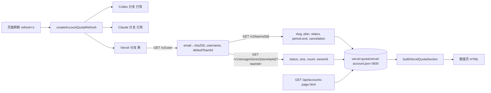

# FLY-2875 额度页加 Vercel 一块 — 实施计划
Issue: FLY-2875 (https://linear.app/geoforge3d/issue/FLY-2875/额度页-加-vercel-一块personalxrlianniegmailcom已升-pro-用作报告托管-显示-plan-在用号)
日期: 2026-09-25
基于: research.md, exploration.md

## 1. 结果（founder 看到的）

额度页在 Codex 表下面多一张 **Vercel** 表，行式样与 Claude/Codex 相同（首列账号名 + 档位小字，在用号整行绿底 + `在用` 小标）：

| 账号 | 下次扣费日 | 报告托管 Blob |
|---|---|---|
| ● **personal** `在用`<br>Pro<br>team xrliannies-projects | 10/24 周六 | 正常<br>已存 1.1 MB · 23 个对象<br>本期占比：读不到（接口不给额度上限） |
| **personal2**<br>Hobby<br>已停用，不再使用 | 已停用 | 不再使用 |

- 表头下一行小字「读于 09/25 周五 01:20」（最近一次刷新读到的时间）。
- Vercel 接口失败 / 没读过 / token 缺失：live 行各格写「读不到（原因）」，不染绿；旧号行照常；**整页照常渲染**。
- Lead 裁定（qid `cf983569`）：只显示别名，不显示完整邮箱（FLY-2688 不变量优先）；旧号写死一行，不去用任何旧 token。



## 2. 范围与不变量

- 新增：`vercel-quota/vercel-account-store.ts`、`vercel-quota/vercel-account-reader.ts`、`bridge/account-quota-vercel.ts` 及对应测试。
- 修改：`bridge/account-quota-refresh.ts`（加可选 Vercel 分支）、`bridge/account-quota-page.ts`（渲染 Vercel 表）、`bridge/account-quota-view.ts`（`renderAccountsPageHtml` 透传第二参数）、`bridge/plugin.ts`（刷新接线 + GET 读「最新尝试」+ `BridgeAppOptions.accountPageVercel` 缝）。
- 不改：Claude/Codex 行、分组、排序、`/api/capacity` 合同、巡检 tick、报告托管代码（`report-hosting-*`、`vercel-hosting-api.ts` 只 import 不改）、`.env` 与凭据文件（只读）。
- **只读**：reader 只发 `GET`，固定 origin `https://api.vercel.com`，`redirect:"error"`；测试对注入的 fetch 断言每次 method=GET、host 固定、路径只在三条白名单里。
- **token 不外泄**：token 只进 `Authorization` 头；reader 从不把响应体或异常 message 放进返回值；store 不存 token；Vercel 分支的所有 warn **只打印固定文案**（不打印 `error.message`，也不打印可写的 `error.name`）；页面不含 token。测试用带标记的假 token（同时塞进抛出异常的 message 与 name，以及非 Error 抛值），断言 store 文件、HTML、捕获的 console 输出里连前 8 个字符都没有。
- **不存明文邮箱**：store 只存 `emailSha256 = sha256(trim(lower(email)))`；页面不出现 fixture 邮箱的原文与 HTML 转义形式（沿用 capacity-route 断言具体邮箱的风格；页面 CSS 本来就有 `@media`，不能断言全文无 `@`）。
- 付款信息（`billing.email/address/tax/invoiceItems`）不读入任何结构。

## 3. 数据合同

### 3.1 store（`<stateDir>/vercel-quota/vercel-account.json`，0600，临时文件 + fsync + rename）

```ts
export type VercelReadNote =
  | "no_token" | "no_store_binding" | "registry_unreadable"
  | "unauthorized" | "forbidden" | "not_found" | "owner_mismatch"
  | "rate_limited" | "http_error" | "network" | "malformed" | "deadline"
  | "refresh_failed";

export interface VercelAccountFacts {
  emailSha256: string;          // /^[a-f0-9]{64}$/
  username: string;             // /^[A-Za-z0-9][A-Za-z0-9._-]{0,63}$/
  teamSlug: string;             // /^[a-z0-9][a-z0-9-]{0,99}$/
  plan: string;                 // /^[a-z][a-z0-9_-]{0,31}$/（pro / hobby / enterprise …）
  billingStatus: string | null; // 同上 token 正则
  periodEnd: string | null;     // canonical ISO
  canceled: boolean;            // billing.cancelation 非 null
}
export interface VercelBlobFacts {
  status: string;               // /^[a-z][a-z0-9-]{0,63}$/
  sizeBytes: number;            // 安全整数 ≥ 0
  count: number;                // 安全整数 ≥ 0
  usageQuotaExceeded: boolean;
}
export interface VercelAccountStore {
  version: 1;
  observedAt: string;           // canonical ISO
  account: VercelAccountFacts | null; accountNote: VercelReadNote | null; // 恰好一个非 null
  blob: VercelBlobFacts | null;       blobNote: VercelReadNote | null;    // 恰好一个非 null
}
```

- `blob !== null` **当且仅当** store 读成功且 `store.ownerId === defaultTeamId`（owner 不等 ⇒ `blob:null, blobNote:"owner_mismatch"`）。所以「在用」= `account !== null && blob !== null`，无需再存 team id。
- 读取：≤64 KiB、JSON、上面的正则/类型/互斥约束全过，否则返回 null（页面按「尚未读取」处理，不 503）。
- 不做跨轮沿用：单子要求 API 失败时这一块显示「读不到」。
- **最新尝试优先于旧文件（Round 1 BLOCKER 1）**：Bridge 进程内有一个 `VercelAccountLatest` 持有者（`get(): VercelAccountStore | null`、`set(store)`，纯内存、不抛）。每轮刷新无论成败都先 `set` 本轮结果（observer 意外抛错时 `set` 一个两边都是 `refresh_failed` 的失败记录），再写文件；写文件失败时 best-effort `unlink` 旧文件，只打固定 warn。GET 优先用 `latest.get()`，为 null（进程刚启动、本进程还没刷新过）才读文件。所以「API 失败 + 写盘失败」时本进程里的页面仍显示「读不到」且不染绿；重启后若旧文件因 unlink 也失败而残留，caption「读于 …」会显示旧时间，下一次刷新即纠正（已知残余，概率极低）。
- `VercelReadNote` 增加 `refresh_failed`（原因文案「本轮读取出错」）。

### 3.2 reader（`observeVercelAccount`）

```ts
observeVercelAccount({
  token: string | undefined,
  resolveStoreApiId: () => string | undefined, // 抛错 ⇒ blobNote "registry_unreadable"
  signal?: AbortSignal, now?: () => Date, fetchImpl?: typeof fetch,
  requestTimeoutMs?: number, // 默认 10_000
}): Promise<VercelAccountStore> // 永不 reject（参数错误除外）
```

1. token 缺失/空 ⇒ `account:null, accountNote:"no_token", blob:null, blobNote:"no_token"`，不发请求。
2. `GET /v2/user`：`user.email` 为 ≤320 字符、含 `@`、无控制字符的字符串；`username` 过正则；`defaultTeamId` 过 `/^team_[A-Za-z0-9]{1,64}$/`。不合格 ⇒ `malformed`。
3. 之后并行两个请求：
   - `GET /v2/teams/{defaultTeamId}`：`slug` 过正则；`billing` 为对象；`billing.plan` 过正则（转小写前先校验原值是字符串）；`billing.status` 为 null/缺失 ⇒ null，否则过正则；`billing.period` 为 null/缺失 ⇒ `periodEnd:null`，否则 `period.end` 必须是安全整数且在 [2020-01-01, 2100-01-01) 内 ⇒ `new Date(end).toISOString()`；`cancelation` 缺失/null ⇒ false，其它任何值 ⇒ true。任一不合格 ⇒ `accountNote:"malformed"`。
   - `resolveStoreApiId()`：抛错 ⇒ `registry_unreadable`；undefined ⇒ `no_store_binding`；不过 `/^store_[A-Za-z0-9]{1,64}$/` ⇒ `no_store_binding`。否则 `GET /v1/storage/stores/{id}?teamId={defaultTeamId}`：`ownerId` 字符串、`status` 过正则、`size/count` 安全非负整数、`usageQuotaExceeded` 布尔；owner 不等 ⇒ `owner_mismatch`。
   - user 失败 ⇒ 不发后两个请求，`blobNote = accountNote`。
   - team 失败但 store 成功 ⇒ `account:null`，blob 也置 null 并沿用 team 的 note（没有 team 就无法显示「在用」与档位；保持「在用 ⇔ account 与 blob 同时存在」）。
4. HTTP 归类：`401`、或 `403` 且 JSON `error.invalidToken===true` ⇒ `unauthorized`；其它 `403` ⇒ `forbidden`；`404` ⇒ `not_found`；`429` ⇒ `rate_limited`；其它非 2xx ⇒ `http_error`；响应体 >1 MiB（先看 `content-length`，再看实际长度）或 JSON 不合法 ⇒ `malformed`；外部 signal 或单请求超时 ⇒ `deadline`；其它抛错 ⇒ `network`。
5. 每请求：`method:"GET"`，头只有 `Authorization: Bearer <token>`、`Accept: application/json`，`redirect:"error"`，`signal: AbortSignal.any([外部, AbortSignal.timeout(requestTimeoutMs)])`。路径参数 `encodeURIComponent`。

### 3.3 视图（`bridge/account-quota-vercel.ts`）

```ts
export interface VercelQuotaRow {
  name: string; planDisplay: string; team: string | null;
  active: boolean; retired: boolean; note: string | null;
  nextCharge: string; blobLines: string[];
}
export interface VercelQuotaSection { observedAt: string | null; rows: VercelQuotaRow[] }
export const RETIRED_VERCEL_ACCOUNTS = [{ alias: "personal2", plan: "Hobby" }] as const;
export function buildVercelQuotaSection(
  store: VercelAccountStore | null,
  options: { generatedAt: string; claudeEmails?: Readonly<Record<string, string>> },
): VercelQuotaSection;
```

live 行（永远第一行）：
- `name`：`claudeEmails` 里有邮箱 `sha256(trim(lower))` 等于 `emailSha256` 的账号名（多个则按名字排序取第一个）⇒ 该别名；否则 `username`；`account===null` ⇒「报告托管账号」。
- `planDisplay`：`pro→Pro`、`hobby→Hobby`、`enterprise→Enterprise`，其它原样；`account===null` ⇒「读不到（原因）」。
- `team`：`team <slug>`；无 account ⇒ null。
- `active`：`account!==null && blob!==null`。
- `nextCharge`（顺序判定；**只有 Pro 才把账期结束日当作扣费日**，Round 1 BLOCKER 2）：store 为 null ⇒「读不到（尚未读取）」；无 account ⇒「读不到（原因）」；`plan==="hobby"` ⇒「不扣费（Hobby 免费）」；`plan!=="pro"`（enterprise 或任何未知 token）⇒「读不到（接口未给扣费日）」；`canceled` ⇒ 有 `periodEnd`「已取消 · 10/24 周六 到期」否则「已取消」；`billingStatus!=="active"` ⇒「读不到（账单状态 <status|未知>）」；`periodEnd===null` ⇒「读不到（接口未给账期）」；`periodEnd <= generatedAt` ⇒「读不到（读数已过期）」；否则 `formatAccountQuotaPageDate(periodEnd)`（PT，「10/24 周六」）。依据：Vercel Pro 是按月订阅、在账期开始时收费，本期结束 = 下一期开始 = 下次扣费。
- `blobLines`：store 为 null ⇒ `["读不到（尚未读取）"]`；`blob===null` ⇒ `["读不到（原因）"]`；否则 `[状态, "已存 <大小> · <count> 个对象", "本期占比：读不到（接口不给额度上限）"]`。状态：`status` 以 `limits-exceeded` 开头 ⇒「超额被停」；否则 `usageQuotaExceeded` ⇒「已超额」；`available` ⇒「正常」；其它 ⇒「状态 <status>」。大小按十进制：<1 MB 显示 KB（整数），<1 GB 显示 MB（一位小数），否则 GB（两位小数）。

原因文案：`refresh_failed`「本轮读取出错」、`no_token`「本机没有 Vercel token」、`no_store_binding`「报告托管未绑定 store」、`registry_unreadable`「托管注册表读不到」、`unauthorized`「token 已失效」、`forbidden`「接口拒绝」、`not_found`/`owner_mismatch`「store 不在这个号」、`rate_limited`「接口限流」、`deadline`「本轮超时」、`malformed`「接口返回格式不对」、`http_error`/`network`「接口未返回」。

旧号行：`RETIRED_VERCEL_ACCOUNTS` 每项一行，`name=alias`、`planDisplay=plan`、`team=null`、`active=false`、`retired=true`、`note="已停用，不再使用"`、`nextCharge="已停用"`、`blobLines=["不再使用"]`。若 live 行 `name` 等于该 alias，丢掉这条旧号行（防止同一个号两行）。

`buildVercelQuotaSection` 自身不抛：任何意外（如日期格式化失败）⇒ 返回只含「读不到（接口返回格式不对）」live 行 + 旧号行的 section。

### 3.4 页面（`account-quota-page.ts`）

- `renderAccountQuotaPageHtml(view, vercel?: VercelQuotaSection)`；`vercel` 缺省时不渲染 Vercel 表（CSS 会多几条新类，不承诺逐字节相同；现有页面测试原样通过即证据）。
- Vercel 表：`<section class="provider-table provider-vercel"><h2>Vercel</h2>`＋可选 `<div class="section-caption">读于 …</div>`＋三列表 `账号 · 下次扣费日 · 报告托管 Blob`，`table.vercel-table{min-width:640px}`。
- 行：`quota-row` + `active-account`（在用，复用现有绿底样式）或 `retired-account`（灰字）；首列复用 Claude/Codex 的 `account-cell` 结构：`account-name`（在用点 + `在用` 小标 + 名字）、`account-tier`（档位）、`account-note`（team / 已停用说明）。Blob 格复用 `card-lines`。所有文字 `escapeHtml`。
- `account-quota-view.ts` 的 `renderAccountsPageHtml(view, vercel?)` 透传。

### 3.5 接线（`plugin.ts`）

- 刷新：`createAccountQuotaRefresh` 的 deps 加一个可选对象 `vercel?: { observe(signal), publish(store), write(store), discardStale(), now() }`；作为第三个并行分支，顺序：observe（抛错 ⇒ 失败记录）→ `publish`（内存）→ `write`（抛错 ⇒ `discardStale` best-effort）。所有 warn 只用固定文案（`"[Bridge] Vercel account refresh failed"` / `"[Bridge] Vercel account store write failed"`），**不**让刷新失败，不改变 Codex/Claude 分支语义与返回值。生产注入：`token = reportHostingCredentials.snapshot("REPORT_HOSTING_VERCEL_TOKEN").value`（每次刷新现取，`.env` 改了不用重启），`resolveStoreApiId = () => hostedReportRegistry.hostingBinding().storeApiId`，`publish/get` 共用 startBridge 里新建的一个 `VercelAccountLatest`。
- `BridgeAppOptions.accountPageVercel?: { storePath: string; latest?: () => VercelAccountStore | null }`。**不传就不渲染 Vercel 表**（旧测试与非生产调用方不会去读本机默认路径）；startBridge 生产注入 `{ storePath: defaultVercelAccountStorePath(), latest }`。
- GET：`buildAccountQuotaView` 之后，在独立 try 中 `buildVercelQuotaSection(latest?.() ?? readVercelAccountStore(storePath), {generatedAt, claudeEmails})`。这一步任何异常都退回「读不到（本轮读取出错）」section，绝不让整页 503。GET 不发网络请求、不写文件。

## 4. 实施步骤（每步先 RED 再 GREEN，再提交）

**T1 store**（新 `vercel-quota/__tests__/vercel-account-store.test.ts`）：往返；0600；default path 跟随 `FLYWHEEL_STATE_DIR`；拒绝：超大、坏 JSON、版本≠1、account/accountNote 都非 null 或都 null、非法 note、非法正则字段、非 canonical 时间、负数/非整数 size；无文件 ⇒ null。

**T2 reader**（新 `vercel-quota/__tests__/vercel-account-reader.test.ts`，注入 fetch）：
①research 原样响应（脱敏）⇒ Pro、`periodEnd=2026-10-24T07:00:00.000Z`、blob available 1051925/23、emailSha256 = sha256(lower)；②无 token 不发请求；③`403 invalidToken` ⇒ unauthorized，401 ⇒ unauthorized，普通 403 ⇒ forbidden，429、500、坏 JSON、超大体（content-length 与实际两条路）、fetch 抛 TypeError ⇒ network、外部 abort / 单请求超时 ⇒ deadline；④user 失败不发后续请求；⑤team 失败而 store 成功 ⇒ account 与 blob 都 null；⑥store 404 ⇒ not_found；owner 不等 ⇒ owner_mismatch；registry 抛错 ⇒ registry_unreadable；无 binding / 非法 id ⇒ no_store_binding；⑦cancelation 非 null ⇒ canceled；period null ⇒ periodEnd null；period.end 非整数/越界 ⇒ malformed；plan 非字符串 ⇒ malformed；⑧每个请求 method=GET、origin 固定、路径白名单、`redirect:"error"`、Accept 头；⑨返回值 JSON 与所有 note 不含 token 任何片段（前 8 字符）。

**T3 视图**（新 `bridge/__tests__/account-quota-vercel.test.ts`）：别名映射（大小写/空格、对不上用 username、多个取名字序第一）；nextCharge 全矩阵（尚未读取 / 各原因 / hobby / **enterprise 与未知 plan 即使 active + 未来 periodEnd 也「读不到（接口未给扣费日）」** / 取消带日期与不带 / 非 active / 无账期 / 过期（含恰好等于 generatedAt） / 正常 Pro「10/24 周六」）；blob 行矩阵（正常 / 已超额 / 超额被停 / 其它状态 / 各原因；KB/MB/GB 边界）；在用判定（blob null ⇒ 不在用）；旧号行存在且 live 名同 alias 时去重；builder 不抛（坏日期注入）。

**T4 页面**（`bridge/__tests__/account-quota-page.test.ts` 追加）：不传 vercel 时无 `provider-vercel` 区块、现有用例原样通过；传入时有 `<h2>Vercel</h2>`、三列表头、**在 `.provider-vercel` 区块内**的在用行 `tr.active-account` + `在用` 小标 + `Pro`、旧号行 `retired-account` + 「已停用，不再使用」；失败 section 渲染「读不到（…）」且 Vercel 区块内没有 `active-account` 行（其它 provider 的在用行保持）；escape（alias/team 带 `<`）。

**T5 刷新组合**（`bridge/__tests__/account-quota-refresh.test.ts` 追加）：Vercel 结果先 publish 再 write；observer 抛错（Error 的 message/name 含假 token、以及非 Error 抛值）⇒ publish 的是 `refresh_failed` 失败记录；write 抛错 ⇒ 调用 discardStale、publish 的仍是本轮结果；两种情况刷新都 resolve、返回值与 Codex 一致、warn 只含固定文案（不含假 token 任何片段）；不注入 Vercel deps 时行为与现在相同（现有用例原样通过）；Codex 失败时 Vercel 仍 publish/write。

**T6 GET 路由**（`src/__tests__/capacity-route.test.ts` 追加，harness 的 `start()` 增加可选 `accountPageVercel` 参数，临时目录）：①正常 store（periodEnd = 测试时刻 + 20 天，期望文本用 `formatAccountQuotaPageDate` 算，避免 fixture 随日期过期）⇒ 页面有 Vercel 表、personal（由 claude 账号邮箱哈希映射）在 Vercel 区块内在用、Pro、扣费日；页面不含 fixture 邮箱原文与转义形式；②store 缺失 ⇒ 200、「读不到（尚未读取）」、Claude/Codex 表照常；③store 损坏 ⇒ 同②；④**旧文件是成功读数、`latest()` 返回失败记录**（模拟「API 失败 + 写盘失败」）⇒ 200、Vercel 区块「读不到（token 已失效）」、无在用行；⑤不传 `accountPageVercel` ⇒ 无 Vercel 表；⑥GET 不发外部请求：`vi.spyOn(globalThis,"fetch")` 只统计非 `127.0.0.1` 的调用，为 0。

**T7 消费者清扫**：`git grep` 证明新模块只被 plugin/page/refresh 引用；`/api/capacity`、巡检 tick 输出不变（相关现有测试原样绿）；无对 `.env`、registry 的写。

## 5. 定向验证（不跑全量）

```sh
pnpm --filter flywheel-teamlead exec vitest run \
  src/vercel-quota/__tests__/vercel-account-store.test.ts \
  src/vercel-quota/__tests__/vercel-account-reader.test.ts \
  src/bridge/__tests__/account-quota-vercel.test.ts \
  src/bridge/__tests__/account-quota-page.test.ts \
  src/bridge/__tests__/account-quota-view.test.ts \
  src/bridge/__tests__/account-quota-refresh.test.ts \
  src/__tests__/capacity-route.test.ts
pnpm --filter "flywheel-teamlead..." build && pnpm --filter flywheel-teamlead typecheck
pnpm lint
```

- `vitest related` 只对非 hub 的改动文件（新 vercel-quota 两个模块、`account-quota-vercel.ts`、`account-quota-refresh.ts`、`account-quota-page.ts`）先 `--list` 看选择范围，范围合理才执行；`plugin.ts` 与 `account-quota-view.ts` 是 hub（被 74+ 个测试直接 import / 被 hook-payload 引用），不交给 related，改由 capacity-route（账号页路由）与现有 view/page 测试覆盖，排除理由写进 PR。宽范围回归交给 CI。

## 6. QA（QA 节点做）

1. **分支真数据 harness**：用分支 `dist` 一次性脚本（放 QA 证据目录）：`observeVercelAccount`（真 token、真 registry，只读 GET）写到**临时目录** store → `buildVercelQuotaSection` + 现有 view → HTML。核：personal、Pro、在用绿、「10/24 周六」（或真值变化后的新值）、Blob 正常；旧号行 personal2 已停用。
2. **失败演练**：同脚本把 token 换成无效串 ⇒ Vercel 块全「读不到（token 已失效）」、不染绿、整页照常。
3. **token 零泄漏**：对 HTML、临时 store、脚本 stdout/stderr、部署后 Bridge 日志 grep token 前 8 字符 ⇒ 0 命中。
4. **只读**：harness 包一层 fetch 记录，断言全部是 GET、只打三条白名单路径。
5. 部署后（Lead 触发）：`flywheel-comm accounts-page` 真跑一次（refresh=1），页面有 Vercel 表；`/api/capacity` 不变。

## 7. 风险与回滚

| 风险 | 处理 |
|---|---|
| Vercel 改字段 / 返回格式 | 严格校验 ⇒「读不到（接口返回格式不对）」，不猜 |
| token 失效或被换 | 「读不到（token 已失效）」；`.env` 每次刷新现读，改完不用重启 |
| 再次 retarget 到别的号 | live 行自动跟随新 token 的号；旧 personal 号不会自动变成「已停用」行（需要时加一行常量），计划里已知 |
| period.end 语义 | 只在 `pro/active/未取消/未过期` 时显示；其它全部「读不到（…）」或「已取消 · 到期」 |
| 回滚 | 回滚提交即可：新 store 文件被旧代码忽略；其它 store 与凭据未改 |

## 8. 交付

T1–T7 按序提交；PR 正文附 research 脱敏样例、Lead 别名裁定、定向验证输出；最后一个 commit 只新增 `engineering/doc/milestones/FLY-2875.md`。
