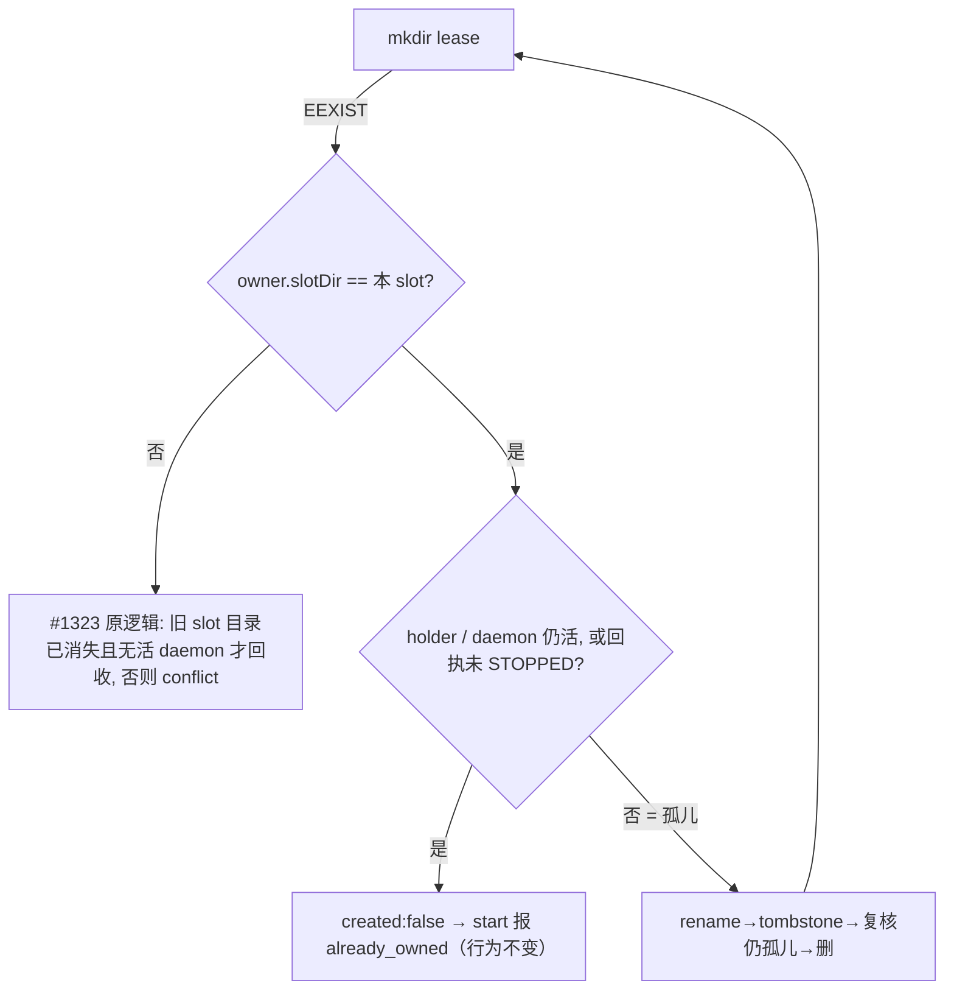

# FLY-2876 同 slot 孤儿语音房锁 start 自愈 — 实施计划
Issue: FLY-2876 (https://linear.app/geoforge3d/issue/FLY-2876/病根529-语音房-语音会话自然结束-测试房被拆后语音房锁-tmpflywheel-voice-room-guild-channellock)
日期: 2026-09-26（首版 2026-09-25）
基于: research.md（上游事实以 #1323 已合入代码为准；范围由 Lead 2026-09-25 裁定选项 B）

## 设计节点重派现状（2026-09-26）

本计划在 eng_design 节点重派时重新审计：exploration.md 比较了 4 个方案并推荐方案 A（即本计划），research.md 逐函数核对了分支上的候选实现与本计划的对应关系，
并复跑 `node --test scripts/__tests__/fly2655-voice-room.test.mjs` 24/24、kill-path 守卫 5/5。本节点不改代码、不动 PR；
下文各节是经 Codex 代码评审 R1–R3 修订后的设计本体，作为 design_review gate 的评审对象。

## 背景与范围

FLY-2867 PR #1323（头 `709b576`）已覆盖本单 QA 判据 2（别的 slot 的锁仍拒绝）与判据 3（teardown Step 6b 释放本 slot 的锁）。
**未覆盖的是事故本体**：同一 slot 被重新部署后，`/tmp/flywheel-voice-room-<guild>-<channel>.lock/owner.json`
里的 `slotDir` 仍等于本 slot，回执已随旧 slot 目录删除、也没有存活进程 ——
`acquireVoiceRoomLease` 对同 slotDir 直接返回 `{created:false}`，`start` 用 `check(lease.created, "voice_room_lease_already_owned")` 拒绝，
正规路径只剩「再拆一次 slot」能清。会话自然结束（daemon 退出、回执仍是 `STARTED`）后也同样被挡。

本单只补这一个缺口；不改 teardown、不改异 slot 回收规则、不改 voice-codex daemon。

## 设计

改动只在 `scripts/qa/fly2655-voice-room.mjs` 的租约函数：

1. **`holder` 记录**：新建租约时在 owner.json 写 `holder: {pid: process.pid, processIdentity}`（执行 start 的 CLI 进程）。
   它覆盖「租约已建、daemon 尚未记录、回执尚未写」那段窗口，保证并发的第二个 `start` 仍被 `already_owned` 挡住，不因本改动退化。
2. **同 slot 孤儿判定** `orphanedSameSlotLease(owner)`：以下三者**都不活**才算孤儿：
   - `owner.holder`（pid + `ps` 身份一致才算活）；
   - `owner.daemon`（#1323 已有的 `recordedDaemonAlive`）；
   - `<slotDir>/voice-run-receipt.json`：经 `trusted()` 读取；`ENOENT` → 不活；`status === "STOPPED"` → 不活；
     **其余任何状态（含 daemon 已死的 `STARTED`）一律算活**（R2 裁定 A，见下）。读取失败 / 不可信（软链接、越界）/ 字段畸形同样按「活」处理，宁可不回收。
   记录类字段（holder/daemon）缺省 = 不活、畸形 = 活，与 #1323 `recordedDaemonAlive` 语义一致；
   为此把它的函数体抽成 `recordedProcessAlive(record)` 复用，`recordedDaemonAlive` 行为不变。
3. **回收**：复用 #1323 的 tombstone 流程，把 `reclaimStaleVoiceRoomLease` 参数化为 `(path, stillStale, reason)`：
   rename 后用同一判定复核，复核不过就 rename 回去并以 `reason` 失败（同 slot 用 `voice_room_lease_already_owned`，异 slot 保持 `voice_room_lease_conflict`）。
4. **「会话自然结束」**：daemon 退出后回执仍是 `STARTED` ⇒ 锁保留，由正常的 `stop` 收尾（`stop` 对已结束会话幂等，见 R2 节），
   之后下一次 `start` 可用。不在 voice-codex 里加退出钩子（跨包耦合且 daemon 被 SIGKILL 时钩子也不跑）。
   （初版曾让 `start` 直接回收这种锁，R2 后按 Lead 裁定改掉。）
5. `start()` 本身不改：它仍要求 `lease.created`，只是孤儿锁现在会在 acquire 里被回收成 `created:true`。

## 代码评审 R1 后补充：锁代次（leaseId）

Codex R1（HIGH）指出回收引入的 ABA：旧 run 的 `stop` 读完自己的回执后，新 `start` 把锁判为孤儿并重建；
旧 `stop` 再调 `releaseVoiceRoomLease` 时只比 slotDir，会删掉新锁，还会用自己的 `STOPPED` 回执覆盖新 run 的回执。
修复前同 slot 的锁从不被回收，所以这是本单打开的新窗口。

6. 每次新建租约生成 `leaseId`（`randomUUID`），写进 owner.json，`acquire` 返回它，`start` 写进运行回执。
7. `releaseVoiceRoomLease` 要求 `owner.leaseId === options.leaseId`，不等就返回 `false`、不删。
   合入前的旧锁与旧回执都没有 `leaseId`（两边都是 `undefined`），照旧配对释放。
8. `stop` 的收尾抽成导出函数 `settleStoppedVoiceRun`：按代次释放；写 `STOPPED` 回执前重读磁盘上的回执，
   只有 `sessionId` 与 `leaseId` 都仍是本 run 时才写，否则保持新 run 的回执不动。
9. 确定性交错测试：A 的 stop 已读回执 → B 回收并写回执 → A 收尾不删 B 的锁、不覆盖 B 的回执；B 自己的收尾正常释放；
   旧格式锁+回执仍能释放。变异（去掉代次比较 / 总是覆盖回执 / 代次固定为常量）全部被杀。

## 代码评审 R2 后调整：STARTED 回执一律算活（Lead 裁定选项 A，减法）

Codex R2（HIGH）指出 R1 的修复只缩小了窗口：代次比较→删除、回执重读→写回、`recordVoiceRoomDaemon` 的读改写、start 失败清理都不是原子操作，
并发的同 slot `start` 若恰好在这些微秒窗口里回收，仍会命中新代次。文件系统没有「内容匹配才删」的原子操作，严格修只能加互斥锁（又带出持锁崩溃的陈旧锁问题）。

根因是初版把「回执 `STARTED` + daemon 已死」（会话自然结束）当孤儿，而**进行中的 `stop` 恰好就处在这个状态**。Lead 裁定做减法：

10. `STARTED` 回执不论 daemon 死活都算活；同 slot 只在回执缺失或 `STOPPED`、且 holder/daemon 都不活时回收。
    进行中的 `stop` 必然对应 `STARTED` 回执 ⇒ `start` 永远不会在它底下回收，R1/R2 的竞态在结构上不再成立，而不只是窗口变窄。
    事故本体（回执随被拆的 slot 目录消失、slot 重新部署）照样自愈。
11. 自然结束改由正常 `stop` 收尾：已核 Bridge `POST /api/voice/sessions/:id/stop` 对 `ended/cancelled/failed` 会话直接返回 200 与当前状态
    （`StateStore.stopVoiceSessionTx` 末尾 `return current.state`），`waitForTerminal` 立即返回，daemon 已死不再 kill，然后按代次释放并写 `STOPPED`。
    Lead 批准的 TDD 用例相应从「自然结束→下次 start 可用」改为「自然结束→stop→下次 start 可用」。
12. `leaseId` 代次与 `settleStoppedVoiceRun` 的回执归属检查保留为纵深防御（覆盖重放的旧 `stop`）。

## 代码评审 R3 后补充：建锁前也看回执（Lead 批准）

Codex R3（MEDIUM）：`settleStoppedVoiceRun` 先释放锁、后写 `STOPPED`；这段空档里锁路径为空，同 slot 的 `start` 走普通 mkdir 分支，
从不看仍为 `STARTED` 的回执，被挂起的旧 `stop` 之后可能覆盖新 run 的回执。

13. `acquireVoiceRoomLease` 在每次 mkdir 前先查本 slot 回执：未 `STOPPED`（含读不了）⇒ `created:false`，不建锁。
    于是在旧 run 被记为 `STOPPED` 之前，谁也建不了新锁。
14. **不**改成「先写 `STOPPED` 再释放」：写完 `STOPPED` 后仍被持有的锁就变得可回收，而 `stop` 还要按路径删它，会重开 R2 的窗口（Lead 认可）。
15. 行为变化：回执为 `STARTED` 但已无锁（例如 `stop` 在释放后、写回执前崩溃）时，需再跑一次（幂等的）`stop` 才能 `start`；事故路径（回执随 slot 目录消失）不受影响。
16. 确定性测试：锁已不存在 + 回执 `STARTED` ⇒ `created:false` 且不留锁目录；回执改为 `STOPPED` ⇒ `created:true`。变异 M9（去掉这道检查）被杀。

## 已知限制

- 合入前遗留的租约没有 `holder`/`daemon` 字段；若其回执也已删除，但一个未登记的旧 daemon 仍在跑，本判定无法识别，会按孤儿回收。
  这与 #1323 teardown Step 6b 对「无 daemon 记录」租约的既有规则一致（同样释放），不另开新口子。
- 两个并发回收者同时抢一把**真正的孤儿**锁时，沿用 #1323 的墓碑 rename→复核→放回流程；「放回」那一步与第三个创建者之间的理论窗口
  是 #1323 已有行为，本单不另加互斥锁（Lead 裁定）。
- 回执停在 `STARTED` 而 `stop` 又因 Bridge 不可用 / 会话不存在（404）失败时，该锁要等该 slot 下一次 teardown（Step 6b）才释放。

## 测试（先红后绿，`scripts/__tests__/fly2655-voice-room.test.mjs`，用临时 `root` + 临时 slot 目录，不碰真实 `/tmp` 租约）

| # | 场景 | 期望 |
|---|------|------|
| T1 | 同 slot 租约，无 holder/daemon，无回执（事故本体） | `created:true`，owner.json 是新记录，无 `.stale-` 残留 |
| T2 | 同 slot，回执 `STARTED` 且 pid+身份存活 | `created:false`，租约原样不动 |
| T3 | 同 slot，owner.daemon 存活（回执缺失） | `created:false` |
| T4 | 同 slot，回执 `STARTED` 但 pid 已死、daemon 记录已死（自然结束） | `created:false`；`settleStoppedVoiceRun`（stop）后下一次 acquire `created:true`（R2 裁定 A） |
| T4b | 同 slot，回执 `STOPPED`、holder/daemon 已死（start 在写回执前死掉） | `created:true` |
| T8 | 重放的旧 stop（代次 A）在 B 建锁并写回执之后收尾 | B 的锁与回执不动；B 自己的 stop 正常释放；旧格式锁+回执仍配对释放 |
| T9 | 锁已被 stop 释放、回执仍 `STARTED`（R3） | `created:false` 且不建锁；回执 `STOPPED` 后 `created:true` |
| T5 | 同 slot，回执是软链接 / 不可解析 | `created:false`（宁可不回收） |
| T6 | 同进程连续两次 acquire（holder 活） | 第二次 `created:false`（既有幂等用例继续绿） |
| T7 | 异 slot 规则 | #1323 既有用例全部保持绿 |

新增测试里的 `process.kill` 需同步登记到 `packages/claude-runner/test/fixtures/kill-path-inventory.json`（qa-only）。

## 验证（仅与改动直接相关）

- `node --test scripts/__tests__/fly2655-voice-room.test.mjs`
- `packages/claude-runner` 的 `kill-path-inventory.test.ts`（登记表消费者）
- `pnpm lint`；`git grep -lF` 查 `fly2655-voice-room` 的其余消费者并逐个记录取舍。

## 交付顺序（Lead 裁定）

在 `709b576` 之上本地开发；**#1323 合入前不开 PR**，做完即 `ask` Lead 并停住等待；
#1323 合入后 rebase 到 `origin/main`（只重放本单提交），对 main 开 PR，里程碑文件作为最后一个提交。
