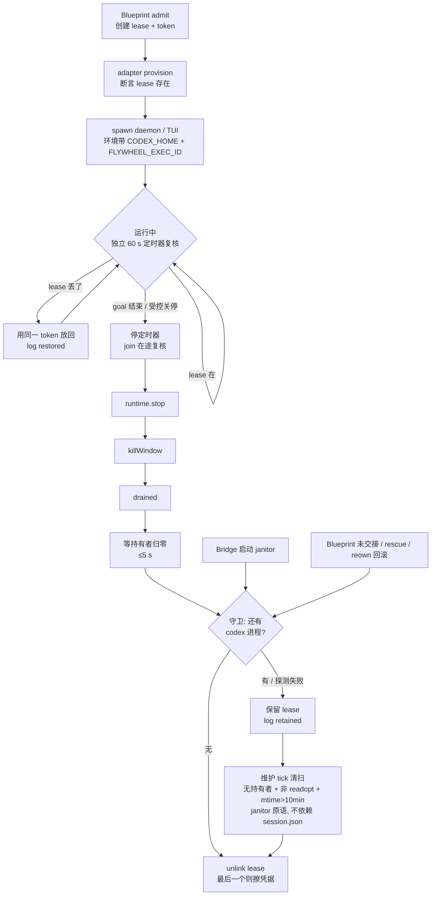
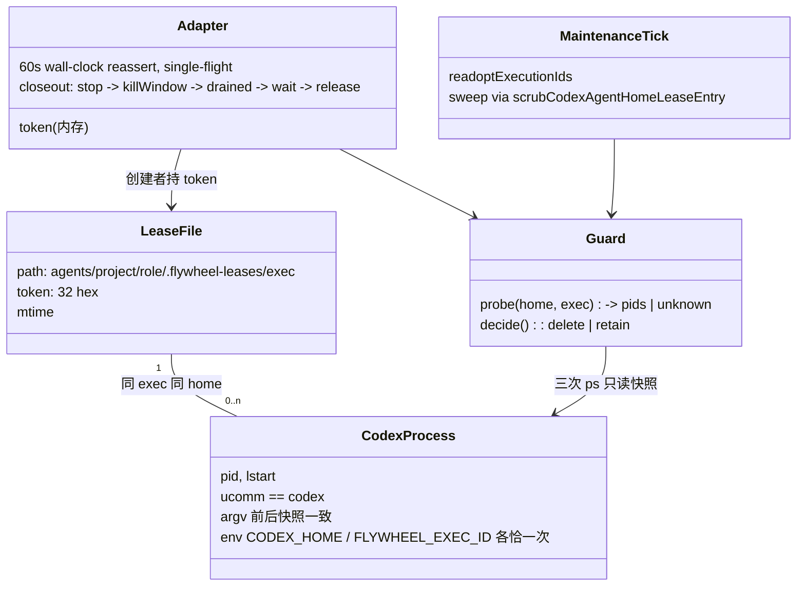

# FLY-2877 Codex lease 生命周期 — 实施计划
Issue: FLY-2877 (https://linear.app/geoforge3d/issue/FLY-2877/病根codex-lease-codextmuxadapter-在-runner-的-codex-进程仍活着时就释放了-flywheel)
日期: 2026-09-25
基于: research.md

**Version**: v1.57.x
**Status**: codex-approved（R1 7 条、R2 5 条、R3 4 条修订；Lead 裁定授权范围限定 R4；R4 APPROVED，2 条措辞 advisory 已改）

## 0. 一句话

让 `.flywheel-leases/<exec>` 与该 exec 的 codex 进程同生同灭：所有删除都过一个「进程还活着就不删」的守卫（进程判定与 FLY-2869 的进程权威合同逐字一致）；adapter 收尾顺序固定为 `runtime.stop → killWindow → drained → 等持有者归零 → 释放`；持 token 的 adapter 用独立的 60 s wall-clock 定时器复核并放回被外来者删掉的 lease（single-flight，收尾前 join）；进程退清后残留的 lease 由既有维护 tick 通过不依赖 session.json 的 janitor 原语收掉。

## 1. 目标 / 非目标

目标
1. **严格不变量（新代码）**：本仓库任何删除路径都不会在该 exec 的 codex 进程活着时删掉它的 lease。
2. **恢复保证（外来删除）**：被旧 worktree 的旧 janitor / 旧 vitest 或任何外部动作删掉后，adapter **≤ 60 s 内发起**恢复；首次成功取得 home 锁（`withMkdirLock` 10 s 超时）并通过 marker 校验即放回同一 token；锁超时或 I/O 失败只记日志、下一个 60 s tick 再试。这是恢复，不是不变量；两者在 QA 判据里分开验。
3. 进程退出后 lease 被释放：正常收尾由 adapter 释放；异常残留（含 session.json 缺失/损坏的）由维护 tick 释放。
4. 每一条释放路径都有「进程活着 → lease 还在」与「无进程 → 释放」两条回归。逐名列出：adapter `resumeExistingExecution` 快照读取失败（约 750）、`runWithOwnership` owner admission 失败（约 791）、`retireExecutionCredential` 的 `prepublished`（约 875）/ `unknown+createdLease`（约 879）/ **`keyed` 正常收尾 → `retireCodexExecutionHome`（约 882）**；Blueprint 未交接回滚 ×2；reown 回滚；启动 janitor `scrubOrphanedCodexAgentHomes`；维护 tick 清扫。调用层测试必须证明 probe 被**转发**到了原语（漏传 probe 时在 live holder 下必须失败）。
5. `host-readiness.ts` 及其测试零改动（FLY-2523 证据规则不放宽）。

非目标
* 不修 lease 归零时顺带擦 GH_TOKEN 的副作用（follow-up F1）。
* 不改 `codex-session-reown` 的「两轮不健康就不动」策略。
* 不处理生产上已丢 lease 的 37624e3d（旧代码进程，token 不可得；见 §9）。
* 不改 collector 的进程计数（FLY-2869 的 census）；不把 FLY-2869 的 `host-process-snapshot.ts` 抽到共用位置（follow-up F2）。

## 2. 总体流程



## 3. 改动清单（按文件）

### C1 `packages/claude-runner/src/codex-process-snapshot.ts`（新）— 进程权威（与 FLY-2869 逐字同合同）

从 `origin/flywheel-FLY-2869:packages/teamlead/src/codex-quota/host-process-snapshot.ts` **原样复制**以下语义（本单不改 teamlead 那份，也不让 teamlead 反向依赖）：

* 三次快照：`ps -axww -o pid=,lstart=,command=`（argv before）→ `ps -axwwE -o pid=,lstart=,stat=,ucomm=,command=`（authoritative，argv 后跟环境）→ 再一次 argv after；`timeout 3000`、`maxBuffer 16 MB`。
* 只有 `ucomm === "codex"`（内核可执行名，非 argv0）才是 codex 进程；`stat` 以 `Z` 开头的僵尸跳过。
* 环境只从 authoritative 行里 **argv 之后** 的部分读取；argv 必须与 before/after 两次快照逐字节相等，否则该进程 `unattributed`（fail-closed）。argv 里伪造的 `CODEX_HOME=… FLYWHEEL_EXEC_ID=…` 因此不会被当成环境事实。
* `CODEX_HOME` / `HOME` / `FLYWHEEL_EXEC_ID` 任一出现两次 → `unattributed`；`FLYWHEEL_EXEC_ID` 不合 `^[A-Za-z0-9_.-]{1,160}$` → `unattributed`。
* 空快照 / 超限 / 行不合形 → 抛 `process_authority_invalid`。

在其上加一层薄的持有者探测：

```ts
export type CodexLeaseHolderProbeResult =
  | { status: "ok"; holders: number[] /* pids only */ }
  | { status: "unknown"; reason: "process_authority_invalid" | "unattributed_present" | "probe_failed" };
export type CodexLeaseHolderProbe = (home: string, executionId: string, options?: { deadlineMs?: number }) => Promise<CodexLeaseHolderProbeResult>;
// 守卫内的调用省略 options（三次 ps 各 3 s）；adapter 等待阶段传入剩余 deadline；超时 → { status:"unknown", reason:"probe_failed" }
export interface CodexProcessSnapshot { argsBefore: string; authoritative: string; argsAfter: string } // 同 2869
export interface CodexProcessRecord { pid; startIdentity; argv0; codexHome; home; executionId }         // 同 2869
export function parseCodexProcessSnapshot(snapshot: CodexProcessSnapshot): { codex: CodexProcessRecord[]; unattributed: CodexUnattributedProcess[] };
export function holdersFromSnapshot(snapshot: CodexProcessSnapshot, home: string, executionId: string): CodexLeaseHolderProbeResult;
export async function captureCodexProcessSnapshot(deadlineMs?: number): Promise<CodexProcessSnapshot>; // 三次 ps 共用一个剩余 deadline
export const defaultCodexLeaseHolderProbe: CodexLeaseHolderProbe; // captureCodexProcessSnapshot → holdersFromSnapshot
```

* `holders` = `codex` 记录中 `codexHome === home && executionId === executionId` 的 pid。
* 只暴露 pid；不携带 command / 环境；`unknown.reason` 是固定枚举，不拼接任何快照文本。
* 任何 `unattributed` 记录存在 → 整体 `unknown`（本轮保留，下轮再判；与 collector 的「unattributed ⇒ 不可判」一致）。

导出：`packages/claude-runner/src/index.ts` 新增 `CodexLeaseHolderProbe`、`CodexLeaseHolderProbeResult`、`CodexProcessSnapshot`、`CodexProcessRecord`、`CodexUnattributedProcess`、`defaultCodexLeaseHolderProbe`、`holdersFromSnapshot`、`parseCodexProcessSnapshot`、`captureCodexProcessSnapshot`，以及 C2 的 `CodexLeaseReleaseOutcome`、`CodexLeaseGuardOptions`、`reassertCodexAgentHomeLease`、`scrubCodexAgentHomeLeaseEntry`（teamlead 只从根入口 import；`package.json` 无子路径 export）。

### C2 `packages/claude-runner/src/codex-home.ts` — 守卫进所有删除；新增 janitor 原语与 reassert

```ts
export type CodexLeaseReleaseOutcome =
  | { released: true; remaining: number }
  | { released: false; reason: "live_process" | "probe_unknown"; holders: number[] };
export interface CodexLeaseGuardOptions { probe?: CodexLeaseHolderProbe } // 默认 defaultCodexLeaseHolderProbe；测试注入

export async function releaseCodexAgentHomeLease(handle, env?, guard?): Promise<CodexLeaseReleaseOutcome>;          // token 校验保留
export async function retireCodexExecutionHome(executionId, expected, env?, guard?): Promise<CodexLeaseReleaseOutcome | { released: false; reason: "unresolved" | "legacy" }>;
export async function scrubCodexAgentHomeLeaseEntry(                                                                  // 新：janitor 原语，不依赖 session.json / token
  entry: { home: string; executionId: string }, env?, guard?): Promise<CodexLeaseReleaseOutcome | { released: false; reason: "entry_invalid" }>;
  // 只收 home + executionId：project/role 从锁内读到的 marker 取（目录名是 encodeMemoryPathComponent 编码后的，不是业务 identity）
export async function scrubOrphanedCodexAgentHomes(sessions, env?, guard?): Promise<number>;                          // 改为逐条调用 scrubCodexAgentHomeLeaseEntry
export async function reassertCodexAgentHomeLease(handle, env?): Promise<"present" | "restored" | "conflict">;
```

行为：
1. `release` / `retire` 在进 home 锁**之前**调 `probe(home, executionId)`；`ok && holders.length === 0` 才进锁执行 unlink；否则不进锁、不删、不擦凭据。`scrubEntry` 是例外：按第 2 条的专门顺序（只读预验证 → 取锁 → 锁内复验 → **锁内** probe → unlink），以专门顺序为准。守卫拒绝时 warn `[codex-home] keyed_home_lease_retained exec=… home=… reason=live_process|probe_unknown holders=<pids>`。
2. `scrubCodexAgentHomeLeaseEntry({home, executionId})`，顺序固定为**只读预验证 → 取锁 → 锁内复验**：
   - 只读预验证（不调用任何会写目录的 helper）：`home` 是非软链普通目录；`readCodexAgentHomeMarker(home)` 非空；`codexAgentHomeDir(marker, env) === home`（canonical-path 证明，目录名不参与 identity 判断）；lease 条目 `lstat` 为普通文件（非软链）且内容为 32 hex。任一不成立 → 立即返回 `entry_invalid`，**此时尚未调用 `prepareCodexAgentHomeLock`**（它会 `mkdirSync(root)` 并 `ensurePlainDirectory` `agents/<encoded-project>/.locks`，对一个声称别的 identity 的坏 marker 这就是外部写入）。
   - 通过后才 `prepareCodexAgentHomeLock(marker)` 并 `withMkdirLock`；锁内**重读** marker，重复 identity 与 canonical-path 校验（防 TOCTOU），再守卫探测（`home + executionId`）、unlink。删除后若 lease 归零 → `scrubCodexHomeCredentialAt(home,true)`（原语义）。
3. `scrubOrphanedCodexAgentHomes`：遍历与状态过滤逻辑不变；对每个候选调 `scrubCodexAgentHomeLeaseEntry`；返回实际删除数；每条删除 warn `keyed_home_lease_scrubbed exec=… home=…`。
4. 实际删除时 warn `keyed_home_lease_released exec=… remaining=N`（原 `keyed_home_scrub_deferred` 保留）。
5. `reassertCodexAgentHomeLease`：进锁；marker 校验同上；文件缺失 → `atomicWriteFile(token)` 返回 `restored`；存在且 token 相同 → `present`；存在但不同 → `conflict`（不覆盖）。
6. 兼容：现有只 `await` 不读返回值的调用方，在无活进程时行为不变。所有 `typeof releaseCodexAgentHomeLease` seam（`Blueprint.codexAgentHomeReleaser`、`codex-session-reown` 的 `deps.release`）及其 mocks/fixtures 按新返回类型更新。

### C3 `packages/claude-runner/src/CodexTmuxAdapter.ts` — 收尾顺序 + 有界等待 + 自愈

deps 新增（`CodexDaemonAdapterDeps`）：
```ts
codexLeaseHolderProbe?: CodexLeaseHolderProbe;   // 透传给 codex-home
leaseHolderWaitMs?: number;                      // 默认 5000：整个等待阶段的总 deadline（含探测本身；剩余 deadline 传给 captureCodexProcessSnapshot）
leaseHolderPollMs?: number;                      // 默认 500
leaseReassertIntervalMs?: number;                // 默认 60_000；<=0 关闭（仅测试）
```

1. **唯一收尾合同**（两条 closeout 分支、`order` 测试、流程图、§0 全部同此）：
   `runEnded = true` → 停 reassert 定时器 → `await leaseReassertInFlight`（若有）→ `runtime.stop()` → `killWindow()`（失败只 log）→ `await runtime.drained()` → `awaitLeaseHoldersGone(ctx)`（每 `leaseHolderPollMs` 探测一次；`leaseHolderWaitMs` 是**总** deadline：每次探测把剩余 deadline 传给 `captureCodexProcessSnapshot`，超时的探测记 `probe_failed` 并结束等待；探测 `unknown` 立即停止等待）→ `retireOnce()`（其内部的最后一次探测不受该 deadline 约束，最坏约 9 s） → 其后原有 ack / heartbeat.stop / controller.stop 不变。FLY-1269 钉的不变量「`credential.scrub` 先于 `shutdown.ack`」保持。
2. `retireExecutionCredential` 四个分支不变，但把 `CodexLeaseReleaseOutcome` 记日志：`released:false` → `[CodexTmuxAdapter] keyed_home_lease_retained exec=… reason=…`；**不**变成 `teardownError`。真正的 I/O 抛错仍走 `cleanup_unconfirmed`。748 / 791 两处 rescue 释放同样只记日志。
3. **自愈**：不复用 `heartbeat()`（它同时被 5 s 定时器和每条 daemon 通知同步调用，拍数不等于时间）。改为在 `runtime` 起来后、`runEnded` 之前，用 `this.startHeartbeat(tick, leaseReassertIntervalMs)` 起**第二个** wall-clock 定时器（同一注入 seam，测试可控）；`tick` 内：若 `leaseReassertInFlight` 非空则跳过（single-flight）；否则 `leaseReassertInFlight = reassertCodexAgentHomeLease(handle).then(log).catch(log).finally(()=>{leaseReassertInFlight=undefined})`。`restored` → warn `keyed_home_lease_restored`；`conflict` → warn `keyed_home_lease_conflict`；抛错 → warn。所有 rejection 都在该 Promise 上被消费。
4. 收尾第一步就停定时器并 `await` 在途 reassert，因此不可能在 `retireOnce()` unlink 之后再重建 lease。

### C4 `packages/teamlead/src/bridge/codex-runner-orphan-reaper.ts` + `plugin.ts` — 残留 lease 清扫

```ts
export async function sweepStaleCodexHomeLeases(
  input: { readoptExecutionIds: ReadonlySet<string>; now?: () => number },
  deps: { env?; probe?: CodexLeaseHolderProbe; audit?; minAgeMs?: number /* 默认 600_000 */ },
): Promise<{ released: number; retained: number; skipped: number; invalid: number }>;
```

* 遍历 `codexHomesRoot/agents/<project>/<role>/.flywheel-leases/*`（复用 `defaultListCodexHomeExecutionIds` 的安全过滤：目录非软链、条目为普通文件、名字合 `SAFE_IDENTIFIER_RE`）。
* 每个 lease：exec ∈ `readoptExecutionIds` → skipped；`mtime > now - minAgeMs` → skipped；否则 `scrubCodexAgentHomeLeaseEntry({home, executionId}, env, {probe})`（**不是** `retireCodexExecutionHome`，后者要求 session.json 解析为 `keyed`，残留场景恰恰常常没有 session.json；也**不**把 `agents/<p>/<r>` 的目录名当 project/role——那是编码后的路径分量，大小写和 `--` 都会被 `encodeMemoryPathComponent` 变换，原始 identity 只在 marker 里）。结果进 audit：`codex_home_lease_swept` / `codex_home_lease_retained` / `codex_home_lease_entry_invalid`。
* `plugin.ts`：在 `sweepCodexRunnerOrphans(...)` 之后、同一 `if (!worktreeAutocleanEnabled()) return;` 之下调用，`readoptExecutionIds = new Set(codexCandidateSnapshot.map(s => s.execution_id))`；失败只 warn。

### C5 `packages/teamlead/vitest.setup.ts` — 测试隔离

`beforeEach` 追加 `FLYWHEEL_CODEX_HOMES_ROOT = join(isolatedRoot,"codex-homes")`、`FLYWHEEL_CODEX_SESSION_DIR = join(isolatedRoot,"codex-sessions")`；新增一条测试断言 `startBridge` 的启动 janitor 只扫隔离根（注入 `env`/日志断言）。

### C6 `packages/edge-worker/src/Blueprint.ts`

不改逻辑；`codexAgentHomeReleaser` 的类型随 C2 变化（返回 outcome），`releaseUnhandedCodexAgentHome` 记 retained 日志。测试见 T8。

### C7 文档 / 里程碑

`engineering/doc/milestones/FLY-2877.md` 作为 PR 最后一个提交；本文件夹随分支合入。

## 4. 数据 / 结构模型



不变量：
* I1（严格，新代码）`LeaseFile` 被本仓库代码 unlink ⇒ unlink 前一次探测 `status=ok && holders=∅`。
* I2（恢复）存在 `CodexProcess(home, exec)` 且 lease 缺失 ⇒ ≤ `leaseReassertIntervalMs` 内发起恢复，首次成功取锁并校验后存在。
* I3 Guard 判「codex 进程」与 FLY-2869 collector 判「codex 进程」用的是**同一份被复制的合同**，T0 镜像 2869 的 table-driven fixtures 在本包钉住；本单不声称二者共享代码。

## 5. 迁移 / 回滚 / 兼容

* 无 schema、无新文件格式、无新 flag。lease 文件内容不变。
* 旧代码 runner + 新代码 Bridge：守卫保护旧 runner；旧 runner 收尾照旧释放。
* 新代码 runner + 旧代码 Bridge / 旧测试：自愈 ≤60 s 内发起，首次成功取锁并校验后放回（锁超时 / I/O 失败下一 tick 再试）。
* 回滚 = revert PR；无残留状态。
* 负面守卫：探测 unknown 一律不删；`reassert` 遇 token 冲突不覆盖；清扫只碰 mtime > 10 min 且不在 readopt 集合的条目；`scrubEntry` 遇任何 marker/路径/条目歧义 fail-closed。

## 6. 测试证据

| 编号 | 文件 | 断言 |
|---|---|---|
| T0 | `packages/claude-runner/test/codex-process-snapshot.test.ts`（新）| **镜像 FLY-2869 `host-process-snapshot` 的 table-driven fixtures（逐条复制，不自拟）**，至少含：ucomm 非 codex 不计；argv 里伪造 `CODEX_HOME=/FLYWHEEL_EXEC_ID=` 不计；before/after argv 不一致 → unattributed；authoritative 行前缀与 argv 不匹配 → unattributed；同一 pid+lstart 在 args 快照出现两行 → unattributed；非法 execution id → unattributed；重复 env key → unattributed；僵尸跳过；空/超限/坏行快照 → `process_authority_invalid`。本单叠加：任一 unattributed → probe `unknown`；正常 daemon + TUI 两进程 → holders 两个 pid；异 home / 异 exec 不计 |
| T1 | `codex-home.test.ts` | release / retire / scrubEntry × {有持有者, 探测 unknown, 无持有者}；scrubEntry 的 marker 缺失 / 锁内外 identity 不一致 / `codexAgentHomeDir(marker)≠home` / 条目非法 → `entry_invalid` 且零写入——**零写入的断言对象是 marker 所指向的 `agents/<encoded-identity>/` 与其 `.locks/`：用例前后对整个 homes root 做递归 `lstat` 快照（路径、mode、mtime、ctime、目录清单）逐项相等**；**identity 含大写与 `--`**（目录名被编码）的 stale lease 能被 scrubEntry 清掉且相邻 home 不受影响；`reassert` 三态；**`scrubOrphanedCodexAgentHomes` 调用层**：同一非 readopt 候选在 live holder 下保留、无 holder 下删除（证明 guard 转发到原语）|
| T2a–d | `CodexTmuxAdapter.test.ts` | 750 / 791 / 875 / 879 / **882（keyed 正常收尾）** 五条路径：注入 `codexLeaseHolderProbe` 返回 live holder → lease 仍在、日志 retained；返回 ∅ → 释放（与现有 558 行、420 行「无持有者 → 删」并存）。882 的用例专门证明 adapter 把 probe 透传给了 `retireCodexExecutionHome`（不注入时默认 probe 看不到假 pid，用例必红）。`drained()` 抛 → run 失败且 lease 仍在 |
| T2e | 同上 | 两条收尾分支的 `order`：`runtime.stop` < `tui.kill` < `runtime.drained` < `credential.scrub` < `shutdown.ack`；「request-bound phase shutdown…」既有数组按此更新 |
| T2f | 同上 | 有界等待：持有者第 3 次探测后消失 → 释放；5 s 内不消失 → 保留 + warn，run 不失败；探测 unknown → 立即停止等待并保留；**慢探测**：注入每次耗时 4 s 的 probe，等待阶段在总 deadline 5 s 内结束（假时钟断言注入 probe 收到的 `options.deadlineMs` 逐次递减；default probe 把该值转交 `captureCodexProcessSnapshot` 由 T0 单独覆盖）|
| T3 | `codex-session-reown.test.ts` | admit 后校验失败且持有者活着 → lease 仍在；无持有者 → 释放 |
| T4 | `CodexTmuxAdapter.test.ts` | 自愈：注入 `startHeartbeat` 记录两个定时器；60 s tick 间删掉 lease → 同 token 重建；期间灌 200 条 daemon 通知不触发复核；异 token → 不覆盖 + conflict 日志；**竞态**：reassert 在 home 锁上挂起时进入收尾 → 收尾先 join 再释放，最终 lease 不存在，且无 unhandled rejection（`process.on("unhandledRejection")` 断言）|
| T5 | `codex-runner-orphan-reaper.test.ts` | 清扫：无持有者+终态+mtime>10 min → 删（含 **session.json 缺失** 与 **session.json 损坏** 两种，以及 **identity 含大写 / 含 `--`** 两种编码目录名）；有持有者 → 留；mtime 新 → 留；readopt → 留；探测 unknown → 留；marker 歧义 → invalid；挂在维护 tick 上且受总开关 |
| T6 | `packages/teamlead/src/bridge/__tests__/vitest-codex-home-isolation.test.ts`（新）| 隔离根已设且在 tmp 下；`startBridge` 的 janitor 只扫隔离根 |
| T7 | PR body | `git diff --stat origin/main -- packages/teamlead/src/codex-quota/` 为空 |
| T8 | `packages/edge-worker/src/__tests__/Blueprint.fly1356-skill-framework.test.ts`（邻近新增）| 未交接回滚两处（成功返回未交接 / catch）：持有者活着 → lease 仍在、日志 retained；无持有者 → 释放（保留既有断言）|
| T9 | `packages/claude-runner/test/index-exports.test.ts`（或既有导出测试）| 根入口导出 C1/C2 列出的名字 |

本机只跑相关测试（位置过滤 ≤6 文件/批）：
```
pnpm --filter flywheel-claude-runner exec vitest run test/codex-process-snapshot.test.ts test/codex-home.test.ts test/CodexTmuxAdapter.test.ts test/index-exports.test.ts
pnpm --filter flywheel-teamlead exec vitest run src/bridge/__tests__/codex-runner-orphan-reaper.test.ts src/bridge/__tests__/codex-session-reown.test.ts src/bridge/__tests__/vitest-codex-home-isolation.test.ts src/bridge/__tests__/run-infra-window-authority.test.ts
pnpm --filter flywheel-edge-worker exec vitest run src/__tests__/Blueprint.fly1356-skill-framework.test.ts
```
构建：`pnpm --filter "flywheel-claude-runner..." build` 后 `pnpm --filter "...flywheel-claude-runner" typecheck`（导出与返回类型变了）。新增 `ps` 调用登记到 child-process census / kill-path inventory（若守卫命中）。全量只由 exact-head CI 出证。

## 7. QA 判据（对应 issue）

| issue 硬红 | 验法 | 依赖 |
|---|---|---|
| 进程活着期间 lease 始终在；退出后释放 | 两个 Codex runner 同 role home；跑中 `ls .flywheel-leases` = 2；结束一个 → 1；结束两个 → 0。**另测恢复**：另一 worktree 跑 `alert-drain-switch.integration.test.ts`（旧 base）后 ≤ 60 s 恢复为 2，并在报告里标注这是「恢复」而非「不变量」| 无 |
| FLY-2869 collector 对两 runner 并行判 ready | **Lead 裁定（2026-09-25）**：QA 用临时分支验——本单 PR head + `git cherry-pick 2d5d24efc`（FLY-2869 的 census 提交「a Codex daemon and its client are one execution in the readiness census」），**只推 sandbox/ 前缀分支、不进 PR**；在该头上起两个 Codex runner 到同一 role home，跑 `scripts/codex-quota-readiness-check.mjs`，registered 结果须为 ready 且无 `lease_without_process` / `comm_orphan`；若 FLY-2869 已合入 main，则直接在合并后的头上验。本单不改 `host-readiness.ts` | **FLY-2869**（未合入时只能用临时分支）|
| 没放宽 FLY-2523 | T7 零 diff | 无 |

## 8. Follow-ups（不在本单）

* F1 lease 归零擦 GH_TOKEN 的副作用：误删后活 runner 失去 push 凭据直到下一次 provision；需要「擦凭据也过守卫」或自愈时重 provision，另开单。
* F2 `codex-process-snapshot.ts` 与 FLY-2869 的 `host-process-snapshot.ts` 是两份逐字同合同；待 2869 合入后抽到 claude-runner 共用、teamlead 改 import。
* F3 `codex-session-reown` 对「两轮不健康」的 session 不重 admit，丢 lease 的老 runner 无法被 Bridge 侧治愈。

## 9. 诚实边界

* 生产 23:25–23:36 那一次删除的具体进程没有钉死；机制由同晚两份 vitest 日志（21:08 / 21:22）证明，并是窗口内唯一满足条件的删除者。
* 本单不会修复正在跑的 37624e3d：它的 lease 已丢、token 只在旧代码进程内存里；它结束后该 home 恢复可判。
* 「进程活着期间 lease 始终在」对本仓库新代码是严格不变量；对旧代码 / 外部删除只是「≤60 s 发起恢复、首次成功取锁后放回」的条件保证；QA 健康路径要求实测 60 s 内恢复，前提是首次取锁与 I/O 成功。
* QA 判据 2 只能在含 FLY-2869 census 的 head 上成立。
* 守卫的「探测 unknown 一律不删」在 `ps` 长期失败或长期存在 unattributed 进程时会让 lease 迟迟不释放；同一情形下 collector 也不可判，不会更坏。
