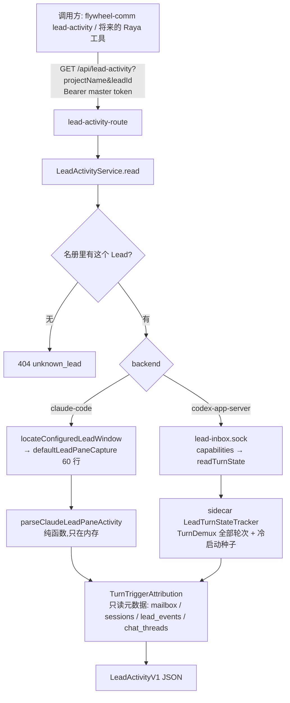

# FLY-2882 Lead 忙闲只读接口 — 实施计划
Issue: FLY-2882 (https://linear.app/geoforge3d/issue/FLY-2882/语音耳机bridge-某个-lead-现在在忙什么只读接口在不在一轮活里在做哪张单已经多久claudecodex-两种载体)
日期: 2026-09-25
基于: research.md

**Status**: draft(待 design review)

## 0. 一句话
新增一个只读 Bridge 接口 `GET /api/lead-activity`(外加 `flywheel-comm lead-activity` CLI):输入 project + leadId,返回 `busy | idle | unknown`、本轮开始时间与已用时长、这轮由哪张单引起(给不了就写「判断不了」)、观测时间与数据来源。Claude Lead 读终端转圈行,Codex Lead 问 sidecar 新增的只读方法。

## 1. 目标 / 非目标

目标:
- G1 覆盖 `projects.json` 里全部生产 Lead(今天 17 个:14 Claude + 3 Codex)。
- G2 busy/idle 与真实一致;unknown 必须带**枚举原因 + 一句人话**,绝不因为读不到就答 idle。
- G3 busy 时开始时间误差 ≤ 30 秒,并标注精度。
- G4 「哪张单」:唯一可证才给;否则 `undetermined + 原因`。
- G5 只读:不向任何 pane 输入;截屏只在内存里解析,不落盘、不进日志、不进响应;不读、不记消息正文。

非目标:打断(FLY-2883)、语音侧调用、缓存/推送/订阅、历史查询、subagent/后台任务明细。

## 2. 总体流程



## 3. 对外合同:`LeadActivityV1`

```ts
type LeadActivityV1 = {
  schema: "lead-activity.v1";
  projectName: string;
  leadId: string;
  carrier: "claude-code" | "codex-app-server";
  state: "busy" | "idle" | "unknown";
  observedAt: string;               // ISO,Bridge 取到数据的时刻
  source: "claude_pane_spinner" | "codex_sidecar_turn_state";
  unknown?: { reason: UnknownReason; detail: string }; // 仅 state=unknown;detail 是固定文案,不含路径/正文
  turn?: {                          // 仅 state=busy
    startedAt: string;              // ISO
    elapsedMs: number;              // observedAt - startedAt
    precision: "second" | "minute"; // Claude 跨天/无秒位 = minute
    origin: "message" | "founder_terminal" | "unknown";
  };
  trigger?:                         // 仅 state=busy
    | { kind: "issue"; issueId: string; basis: "codex_journal_members" | "claude_delivery_window" }
    | { kind: "undetermined"; reason: TriggerUndeterminedReason };
};

type UnknownReason =
  // Claude
  | "lead_window_not_found"        // plist/manifest/socket 找不到
  | "pane_identity_indeterminate"  // probeV2LeadPane 失败(不是 lead-body.sh / pid 对不上)
  | "lead_process_not_running"     // pane 在,但当前前台命令不是 claude(重启间隙)
  | "pane_capture_failed"          // tmux 超时/报错
  | "pane_unrecognized"            // 没找到输入框边框,或出现菜单/权限弹窗/compact 冻结
  // Codex
  | "sidecar_unreachable"          // socket 连不上/超时/认证失败
  | "sidecar_lacks_turn_state"     // 老 sidecar,capabilities 没有 turn_state_v1
  | "turn_state_not_seeded"        // sidecar 刚起/刚重连,种子探针还没完成
  | "observer_disconnected"        // sidecar 与 codex daemon 的连接断了
  | "carrier_unsupported";         // headless 形态 / 未知 backend

type TriggerUndeterminedReason =
  | "founder_terminal_turn"        // Codex: founder 自己在终端敲的轮
  | "no_delivery_in_window"        // Claude: 开轮前后窗口里没有投递
  | "multiple_issues"              // 映射出 ≥2 张单
  | "unmapped_delivery"            // 有投递映射不到单(如主频道聊天)
  | "turn_origin_unknown"          // Codex 冷启动种子里的轮,不知道谁发起
  | "attribution_unavailable";     // 读 CommDB/StateStore 失败(不影响 state)
```

HTTP:
- `GET /api/lead-activity?projectName=<p>&leadId=<l>` → 200 `LeadActivityV1`;参数必须恰好这两个、非空、`^[A-Za-z0-9._-]{1,64}$`,否则 400 `{kind:"refused",reason:"invalid_arguments"}`;不在名册 → 404 `{kind:"refused",reason:"unknown_lead"}`。
- `GET /api/lead-activity/fleet`(无参数)→ 200 `{schema:"lead-activity-fleet.v1", observedAt, leads: LeadActivityV1[]}`,并发 4,单个 Lead 的失败只会变成那一项的 unknown。
- 认证:`masterOnlyAuthMiddleware(config.apiToken, config.geminiAgentToken)`,与 `/api/lead-persona` 同级;Bridge 只听 loopback。
- **读失败一律 200 + unknown**(那是答案,不是错误);只有参数/名册/认证是 4xx。

CLI:
- `flywheel-comm lead-activity --project <p> --lead <l>` / `flywheel-comm lead-activity --all`,打印一行 JSON。沿用 `ship-judgment-history.ts` 的套路(strict parseArgs、`TEAMLEAD_API_TOKEN`、`assertLoopbackCarrierUrl`、`redirect:"error"`、15 秒超时;`--all` 30 秒)。
- 退出码:0 = 拿到答案(哪怕是 unknown);非 0 = 调用本身失败(连不上 Bridge / 4xx / 5xx)。

## 4. Claude 载体:`parseClaudeLeadPaneActivity`

新文件 `packages/teamlead/src/bridge/lead-activity/claude-pane-activity.ts`,**纯函数**,输入 `(pane: string, leadId: string)`,输出 `{state:"busy", elapsedMs, precision} | {state:"idle"} | {state:"unknown", reason:"pane_unrecognized", detail}`。

算法:
1. 按行切。从底往上找**输入框上边框**:优先匹配 `^─{6,}.*@<leadId 转义>\s+─`;找不到再退回 `^─{20,}\s*$` 且紧下一行以 `❯` 开头。都没有 → unknown `pane_unrecognized`(菜单/弹窗会替换掉输入框)。
2. 边框下方(状态栏/subagent 行)**一律不看**。
3. 在边框上方最多 40 行里,**从下往上**找第一条匹配以下之一的行:
   - 转圈行 `^\s*[✻✶✳✢✽·*]\s+\S.*…\s*\((?<dur>(?:\d+d\s*)?(?:\d+h\s*)?(?:\d+m\s*)?(?:\d+(?:\.\d+)?s)?)\s*(?:·|\))` 且 `dur` 非空 → **busy**,elapsed = 解析 `dur`;有秒位 `precision="second"`,否则 `"minute"`。
   - 已完成行 `^\s*[✻✶✳✢✽·*]\s+\S+ for (?:\d+[dhms]\s*)+·\s*done\b` → **idle**。
4. 两种都没找到:若边框下方 3 行内有 `IDLE_READY_MARKERS` 任一(导出现有私有常量,不复制)→ **idle**(重启后没干过活的形态);否则 unknown `pane_unrecognized`。
5. 在第 3 步的扫描范围里若出现 `compacting conversation` 或 `esc … to cancel` 且没有转圈行 → unknown `pane_unrecognized`(FLY-193 的冻结形态,不猜)。
6. 返回值**不带**任何原文(动词、tokens 数、正文都不返回)。

外层 `readClaudeLeadActivity(deps)`(同目录 `claude-lead-activity.ts`):
- `locateConfiguredLeadWindow()` 失败 → `lead_window_not_found`。
- `probeV2LeadPane(ref, "send")` 用于区分 `lead_process_not_running`(pane 在但前台不是 claude);`"capture"` 强度失败 → `pane_identity_indeterminate`。
- `defaultLeadPaneCapture(ref, 60)` 抛错/超时 → `pane_capture_failed`。
- busy:`startedAt = observedAt − elapsedMs`,`origin = "unknown"`(Claude 看不出是消息还是 founder 在终端敲的)——然后交给 §6 归因。
- 截屏字符串只在函数作用域内;不写日志、不写文件。

## 5. Codex 载体:sidecar 新增 `readTurnState`

### 5.1 `LeadTurnStateTracker`(新文件 `lead-backends/codex/LeadTurnStateTracker.ts`,纯内存)
状态:`seeded: boolean`、`connected: boolean`、`active: Map<turnId, {startedAtMs, origin: "message"|"founder_terminal"|"unknown"}>`。
- `onTurnStarted(turnId, params, origin)`:`startedAtMs = params.turn.startedAt*1000`(没有就用本地观测时刻)。
- `onTurnCompleted(turnId)`:删除。
- `markDisconnected()`:`connected=false; seeded=false; active.clear()`。
- `seed(latestTurn | null)`:`latestTurn.status==="inProgress"` → 放入 `{origin:"unknown"}`;之后 `seeded=connected=true`。
- `snapshot()` → `{schema:"turn-state.v1", seeded, connected, activeTurns:[{turnId, startedAt, origin, deliveryIds?}] }`。

### 5.2 接线(`codex-lead-tui-runtime.ts` 的 `wireDemuxedProcess`)
- `toExecutor` 包装:`turn/started` → `tracker.onTurnStarted(id, params, "message")`;`turn/completed` → `onTurnCompleted`。
- `toObserver` 包装:同上,origin = `"founder_terminal"`。
- 扣住后回放的事件 params 不变(R4),所以 `startedAt` 仍准。
- 进程/daemon 连接断开(`proc` 的退出事件、`DaemonConnectionSupervisor` 的断开回调——实现时以代码里实际存在的那个钩子为准)→ `markDisconnected()`;连上并拿到 `threadId` 后跑一次 `thread/turns/list {limit:1, sortDirection:"desc", itemsView:"notLoaded"}`(抽出 `codex-lead-thread-rotation.ts` 里现成的探针为共享函数,不复制)→ `seed()`。线程轮换时同样先 `markDisconnected()` 再 seed。
- 种子探针失败 → 保持 `seeded=false`(Bridge 答 unknown),30 秒后重试一次,不无限重试。
- headless `codex-lead-runtime.ts`:**不接**,不宣告 feature ⇒ Bridge 答 `sidecar_lacks_turn_state`。

### 5.3 socket 方法
- `CodexLeadInboxSocket.ts`:`features` 增加 `"turn_state_v1"`;新增请求 `{method:"readTurnState"}`(无参数;有多余字段 → 拒绝)→ `{ok:true, state: tracker.snapshot()}`。
- 对 `origin="message"` 的轮:用 `journal` 按 `turn_id` 找条目 → `listMemberIds(entry.id)` → 去掉 `#r<n>` 后缀 → `deliveryIds`(最多 20 个)。**只回 id,不回 payload。**
- 只读:不 bump `lastActivityAt`,不动 router/journal 状态。HMAC 认证同现有方法。
- Bridge 客户端 `readCodexLeadTurnState()`(新文件 `bridge/lead-activity/codex-lead-activity.ts`),模仿 `probeCodexLeadInboxCapabilities()`,3 秒超时。

### 5.4 Bridge 端映射
| sidecar 回答 | 接口 state |
|---|---|
| 连不上 / 超时 / 认证失败 | unknown `sidecar_unreachable` |
| capabilities 无 `turn_state_v1` | unknown `sidecar_lacks_turn_state` |
| `connected=false` | unknown `observer_disconnected` |
| `seeded=false` | unknown `turn_state_not_seeded` |
| `activeTurns` 非空 | busy(取 startedAt 最早的一轮) |
| `activeTurns` 为空 | idle |

## 6. 「这轮由哪张单引起」:`TurnTriggerAttribution`

新文件 `bridge/lead-activity/turn-trigger-attribution.ts`。输入候选投递,输出 `trigger`。**只读这些列**:mailbox 的 `delivery_id, from_agent, source_kind, source_ref, delivered_at`;CommDB `sessions.execution_id, issue_id`;StateStore `lead_events.seq, session_key`;`chat_threads / phase_chat_threads` 的 `thread_id, issue_id`。全部参数化查询、只读句柄(CommDB 用 `mode=ro`;StateStore 用 Bridge 现有实例的 getter,必要时加只读 getter)。

候选投递:
- Codex `origin="message"`:sidecar 回的 `deliveryIds`(确定性)。`origin="founder_terminal"` → `founder_terminal_turn`;`"unknown"` → `turn_origin_unknown`。
- Claude:`to_agent = leadId AND delivered_at BETWEEN start−10s AND start+3s`(ISO 字符串比较前统一格式),最多取 20 行。空 → `no_delivery_in_window`。

逐条映射:
- `question` → `sessions.issue_id WHERE execution_id = from_agent`
- `lead_event` → `lead_events.session_key WHERE seq = source_ref`,取 `":"` 之后,且必须匹配 `^[A-Z][A-Z0-9]+-\d+$`
- `discord_chat` → `from_agent` 必须是 `discord:<数字>`,再查两张 thread 表
- 其他 / 查不到 → 记为「映射不到」

判定:有任何映射不到 → `unmapped_delivery`;映射到的 issue 去重后 ≥2 → `multiple_issues`;恰好 1 → `{kind:"issue", issueId, basis}`。读库异常 → `attribution_unavailable`(state 不受影响)。

措辞约定(给将来的语音侧):这叫「**这轮是由 FLY-xxx 的消息引起的**」,不是「他正在做 FLY-xxx」。

## 7. 改动清单

| 文件 | 改动 |
|---|---|
| `packages/teamlead/src/bridge/lead-activity/claude-pane-activity.ts` | 新增:纯解析器 |
| `packages/teamlead/src/bridge/lead-activity/claude-lead-activity.ts` | 新增:定位 + 核身份 + 截屏 + 解析 |
| `packages/teamlead/src/bridge/lead-activity/codex-lead-activity.ts` | 新增:socket 客户端 + 映射表 §5.4 |
| `packages/teamlead/src/bridge/lead-activity/turn-trigger-attribution.ts` | 新增:§6 |
| `packages/teamlead/src/bridge/lead-activity/lead-activity-service.ts` | 新增:名册 → 载体 → 读 → 归因;fleet 并发 4 |
| `packages/teamlead/src/bridge/lead-activity-route.ts` | 新增:两个 GET |
| `packages/teamlead/src/bridge/plugin.ts` | 挂载路由(master-only),注入依赖 |
| `packages/teamlead/src/bridge/pane-blocked-classifier.ts` | 导出 `IDLE_READY_MARKERS`(只加 `export`) |
| `packages/teamlead/src/lead-backends/codex/LeadTurnStateTracker.ts` | 新增 |
| `packages/teamlead/src/lead-backends/codex/codex-lead-tui-runtime.ts` | 接 tracker、种子、断连 |
| `packages/teamlead/src/lead-backends/codex/codex-lead-thread-rotation.ts` | 抽出 latest-turn 探针为可复用函数(行为不变) |
| `packages/teamlead/src/lead-backends/codex/CodexLeadInboxSocket.ts` | feature `turn_state_v1` + `readTurnState` |
| `packages/flywheel-comm/src/commands/lead-activity.ts` + `index.ts` | 新增 CLI 子命令(纯新增,不删不改名) |

不新增 spawn/kill(截屏复用 `defaultLeadPaneCapture`),不新增 SQLite 表(不触发 retention 清册)。

## 8. 测试(TDD,只跑与改动直接相关的)
1. `claude-pane-activity.test.ts`(夹具来自 R1/R3 的真实形态,正文全部换成假文字):
   - 转圈行 `8s` / `1m 4s` / `2h 3m 4s` / `1d 2h 3m`(precision=minute)/ `·` 符号 → busy + 正确毫秒。
   - 已完成行 `Worked for 1m 17s · done 12:17 PM`、`… done Thursday 12:42 AM` → idle。**阴性对照:这行不得判 busy。**
   - 只有输入框 + 状态栏 → idle。
   - 转圈行与边框之间隔着 Tip / 待办清单 / 排队消息 → 仍 busy。
   - subagent 行(边框下方)带时长,主轮已完成 → idle(不得被 subagent 计时骗成 busy)。
   - 无边框(菜单/弹窗)→ unknown;compacting 冻结 → unknown。
   - 正文里出现旧的已完成行、更下方有新转圈行 → busy(取最底下)。
   - 边框 `@` 名字与 leadId 不符时的退回路径。
2. `claude-lead-activity.test.ts`:locate/probe/capture 各失败分支 → 对应 unknown 原因;注入假 capture,不起真 tmux。
3. `LeadTurnStateTracker.test.ts`:message/founder 轮开始结束;`startedAt` 取服务端值;未 seed → not seeded;断连清空;种子 inProgress → origin unknown。
4. `CodexLeadInboxSocket` 现有测试文件内追加:capabilities 含 `turn_state_v1`;`readTurnState` 返回快照且只含 id;多余字段被拒;认证失败被拒。
5. `codex-lead-activity.test.ts`:§5.4 映射表每一行。
6. `turn-trigger-attribution.test.ts`:临时 sqlite 夹具覆盖三类映射 + 映射不到 + 多单 + 空窗口 + 读库异常。
7. `lead-activity-route.test.ts`:express 起在 `127.0.0.1:0`(**不调 startBridge**);400/401/404/200;fleet 单项失败不影响其他项。
8. `flywheel-comm` CLI 测试:参数校验、退出码、只输出一行 JSON。

运行约束:`pnpm --filter flywheel-teamlead exec vitest run <上述文件>`(≤6 个一批);核对 Tests 条数,不看退出码;排除 `**/tmux-viewer.macos.test.ts`;本地需要短 TMPDIR 时注明。

## 9. 上线与回滚边界
- Bridge 部分(路由 + Claude 读法 + 归因):随 Bridge 重启生效(独立 updater 的窗口),对现有行为零影响(纯新增只读路由)。
- Codex 部分:**只有 Codex Lead 进程重启后**才有 `turn_state_v1`。在那之前接口对 3 个 Codex Lead 如实答 unknown `sidecar_lacks_turn_state`——不是缺陷,QA 判据 4 的生产调用里要这样标注。
- 回滚:revert 即可;没有数据迁移、没有新表、没有持久状态。
- 与 FLY-2883(受控打断)的交叠:两单都可能改 `CodexLeadInboxSocket.ts` 的 features 枚举和方法分派,属于文本冲突级别,后合者 rebase;本单不引入任何写/打断能力。

## 10. QA 对应
| 判据 | 怎么证 |
|---|---|
| 1 两种载体 busy/idle 一致 | 529 房各起 1 个 Claude slot Lead + 1 个 Codex slot Lead;各做「长轮进行中」「空闲」两态;同时刻人工/截屏核真实状态(Claude 看转圈行,Codex 看 TUI 窗口) |
| 2 开始时间 ≤30s;单号能给必须对 | 触发轮的那一刻记下时间戳对照;用带 issue 的投递(runner question 或 issue thread 消息)触发一次,核 `trigger.issueId`;用主频道消息触发一次,核 `undetermined` |
| 3 进程不在 → unknown 不是 idle | Claude:停掉 slot Lead 的 claude 进程/pane 不在;Codex:停 sidecar;另测老 sidecar(无 feature) |
| 4 生产只读一次 | `flywheel-comm lead-activity --all`,报告只放 leadId/state/时间/来源/原因 |

QA 风险(开房前先核):Codex slot Lead 必须跑**本分支**的 sidecar 代码才有 `turn_state_v1`(项目记忆:529 slot 的 distSha 是沙箱 main 克隆);若房里跑不到本分支 sidecar,Codex busy/idle 这一格要改用模块级台架证,并在报告里写明。拆房前 ask Lead。

## 11. 已知边界(诚实写明)
- Claude 主轮已结束、只有 subagent/后台任务在跑 → idle(主轮能接新消息)。
- Claude 看不出一轮是消息触发还是 founder 在终端敲的 → `origin="unknown"`,归因只看投递窗口。
- Claude 转圈行识别依赖 2.1.282 的画面格式;Claude Code 升级改了格式时会退化成 unknown `pane_unrecognized`(不会错答 idle/busy),需要跟着改夹具。
- 正文里恰好有一行假的转圈行、且在真实状态行之下——理论上会误判;真实状态行永远紧贴输入框,实际不会发生,不做防护。
- Codex sidecar 收到消息但还没开轮的几秒 → idle。
- 「哪张单」对信箱很密的 Lead(如 Tadashi)多半是「判断不了(多张单)」。
