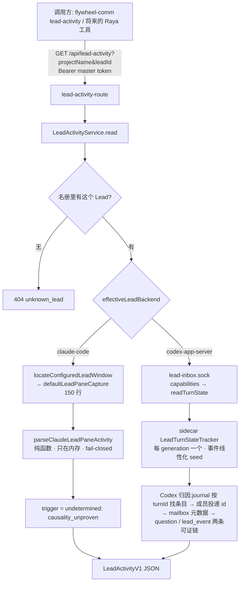

# FLY-2882 Lead 忙闲只读接口 — 实施计划
Issue: FLY-2882 (https://linear.app/geoforge3d/issue/FLY-2882/语音耳机bridge-某个-lead-现在在忙什么只读接口在不在一轮活里在做哪张单已经多久claudecodex-两种载体)
日期: 2026-09-25
基于: research.md

**Status**: codex-approved v3(R1 7+1 → v2;R2 4 → v3;R3 APPROVED + 1 advisory 已并入 §8.3b;处置表见 §12)

## 0. 一句话
新增一个只读 Bridge 接口 `GET /api/lead-activity`(外加 `flywheel-comm lead-activity` CLI):输入 project + leadId,返回 `busy | idle | unknown`、本轮开始时间与已用时长、这轮由哪张单引起(只在**可证明**时给,否则「判断不了 + 原因」)、观测时间与数据来源。Claude Lead 读终端状态行,Codex Lead 问 sidecar 新增的只读方法。

## 1. 目标 / 非目标

目标:
- G1 覆盖 `projects.json` 里全部生产 Lead(今天 17 个:14 Claude + 3 Codex)。
- G2 **fail-closed**:任何读不到、看不懂、证据不足的情况都答 `unknown + 枚举原因 + 固定人话`;**没有任何代码路径能在证据不足时答 idle**。
- G3 busy 时开始时间误差 ≤ 30 秒,并标注精度。
- G4 「哪张单」只在因果链可证明时给;错单比「判断不了」更坏。
- G5 只读 + 不读正文:不向 pane 输入;截屏只在内存里解析,不落盘/不进日志/不进响应;SQL 只 `SELECT` 显式元数据列,从不选 `content / delivery_content / payload`。

非目标:打断(FLY-2883)、语音侧调用、缓存/推送/订阅、历史查询、subagent 明细;**v1 不为 Claude 载体做单号归因**(见 §6)。

## 2. 总体流程



## 3. 对外合同:`LeadActivityV1`(判别联合,不变量写进类型)

```ts
type Base = {
  schema: "lead-activity.v1";
  projectName: string;
  leadId: string;
  carrier: "claude-code" | "codex-app-server";
  observedAt: string;                       // ISO
  source: "claude_pane" | "codex_sidecar";  // 载体级来源,不再暗示「看到了 spinner」
};
type LeadActivityV1 =
  | (Base & { state: "busy"; turn: Turn; trigger: Trigger })
  | (Base & { state: "idle" })
  | (Base & { state: "unknown"; unknown: { reason: UnknownReason; detail: string } });

type Turn = {
  startedAt: string;               // ISO
  elapsedMs: number;               // observedAt − startedAt,≥ 0
  precision: "second" | "minute";
  origin: "message" | "founder_terminal" | "unknown";
};
type Trigger =
  | { kind: "issue"; issueId: string; basis: "codex_journal_members" }
  | { kind: "undetermined"; reason: TriggerUndeterminedReason };

type UnknownReason =
  // Claude
  | "lead_window_unavailable"   // 找不到或无法证明这个 Lead 的私有终端(没配置 / tmux 不通 / 身份对不上——locator 本身不区分,如实合并)
  | "pane_capture_failed"       // capture-pane 报错/超时
  | "pane_unrecognized"         // 找不到属于该 leadId 的唯一输入框(菜单/弹窗/claude 进程不在都会这样)
  | "no_turn_status_line"       // 输入框上方没有任何状态行(重启后没干过活、或格式变了)——无法证明空闲
  | "unrecognized_status_line"  // 最近的状态行既不是已知的进行中格式,也不是已知的完成格式
  | "status_line_blocked"       // 最近状态附近是 compacting / esc…to cancel(FLY-193 冻结形态)
  // Codex
  | "sidecar_unreachable"       // socket 连不上/超时/认证失败
  | "sidecar_lacks_turn_state"  // capabilities 无 turn_state_v1(老 sidecar 或 headless)
  | "sidecar_protocol_invalid"  // 回包不符合严格 schema
  | "observer_disconnected"     // sidecar 与 codex daemon 的连接断了
  | "turn_state_not_seeded"     // 本 generation 还没拿到可信初值
  | "carrier_unsupported";      // 未知 backend

type TriggerUndeterminedReason =
  | "causality_unproven"        // Claude:没有结构化的「这轮由哪条投递开启」记录
  | "founder_terminal_turn"     // Codex:founder 在终端里自己敲的
  | "turn_origin_unknown"       // Codex:seed 得来的轮,不知道谁发起
  | "turn_not_yet_bound"        // Codex:turn 已开始但 journal 还没绑定 turnId(几百毫秒窗口)
  | "ambiguous_turn_binding"    // Codex:journal 里 >1 条目绑定同一 turnId
  | "no_delivery_binding"       // Codex:条目没有信箱成员(sidecar 直收的 Discord / bootstrap)
  | "candidate_overflow"        // 成员数超上限,拒绝在截断集合上判唯一
  | "unmapped_delivery"         // 有成员映射不到单(Discord 聊天、未知来源、行不存在)
  | "multiple_issues"
  | "attribution_unavailable";  // 读库失败(不影响 state)
```

`detail` 是每个 reason 一条**固定**中文文案(常量表),绝不拼接路径、SQL 参数、pane 文字或 sidecar 原始回包。

HTTP:
- `GET /api/lead-activity?projectName=<p>&leadId=<l>` → 200 `LeadActivityV1`。参数恰好这两个、非空、`^[A-Za-z0-9._-]{1,64}$`,否则 400 `{kind:"refused",reason:"invalid_arguments"}`;不在名册 → 404 `{kind:"refused",reason:"unknown_lead"}`。
- `GET /api/lead-activity/fleet`(拒绝任何 query)→ 200 `{schema:"lead-activity-fleet.v1", observedAt, leads: LeadActivityV1[]}`,并发 4;单个 Lead 的异常只变成那一项 unknown。
- 认证 `masterOnlyAuthMiddleware(config.apiToken, config.geminiAgentToken)`(同 `/api/lead-persona`,`plugin.ts:5518-5521`);Bridge 只听 loopback。
- 读失败一律 200 + unknown;只有参数/名册/认证是 4xx;服务端出口前用同一个运行时校验器校验 DTO(不合法 → 500,测试里断言不会发生)。

CLI:`flywheel-comm lead-activity --project <p> --lead <l>` / `--all`,单行 JSON;沿用 `ship-judgment-history.ts:48` 套路(strict parseArgs、`TEAMLEAD_API_TOKEN`、`assertLoopbackCarrierUrl`、`redirect:"error"`,单个 15s / `--all` 30s 超时)。退出码 0 = 拿到答案(含 unknown);非 0 = 调用本身失败。

## 4. Claude 载体

### 4.1 纯解析器 `parseClaudeLeadPaneActivity(pane, leadId)`(新文件 `bridge/lead-activity/claude-pane-activity.ts`)
按**当前帧状态机**判定,优先级固定,每一步只能落到 busy / idle / unknown 之一:

1. **定位输入框**:收集所有匹配 `^─{6,}.*@<escape(leadId)>\s+─` 的行,取最底下一条,且其下一行必须以 `❯` 开头。不存在 → `pane_unrecognized`。(**不再**退回无 `@` 的边框——生产 14/14 都带 `@leadId`,见 research R3;名字对不上一律 unknown。)
2. 边框**下方**(状态栏、subagent 行)一律不看。
3. **状态槽位行**:从边框往上逐行走,只跳过三类**已证明可跳过**的行——空行、以空白开头的缩进行(正文输出、`⎿ Tip`、待办清单都缩进)、以 `⏺ ` 开头的对话条目行(助手回复、工具调用、系统提示;生产实查:完成行之后常跟着 `⏺ everything-claude-code: hooks.json …` 警告和 `⏺ Remote …` 提示,而进行中的转圈行永远渲染在所有条目**下方**)。遇到的**第一条其它第 0 列行**就是状态槽位行;**任何**不认识的第 0 列行(新符号 `◆ …`、`› Message` 排队行、`❯ …` 刚提交的提示……)都占住槽位,扫描到此为止,绝不越过它去找更早的完成行。槽位行与边框之间若出现 `compacting conversation` 或 `esc … to cancel` → `status_line_blocked`。
4. 对槽位行:
   - 匹配**进行中**格式 `^[✻✶✳✢✽·*] \S[^(]*…\s*\((?<dur>DUR)\s*(?:·|\))`,DUR = `(\d+d\s*)?(\d+h\s*)?(\d+m\s*)?(\d+(\.\d+)?s)?` 且非空 → **busy**;有秒位 `precision="second"`,否则 `"minute"`。
   - 匹配**完成**格式 `^[✻✶✳✢✽·*] \S+ for (?:\d+[dhms]\s*)+·\s*done\b` → **idle**。
   - 其它 → `unrecognized_status_line`。
5. 截屏范围内走到顶都没有槽位行 → `no_turn_status_line`。**不**用状态栏(`bypass permissions`、`ctx N%` 是常驻锚点,不是空闲专属)授权 idle。
   - 生产实查(2026-09-25,截 150 行,本规则):14 个 Claude Lead = 12 idle、1 busy(`39s`)、1 `no_turn_status_line`。(R1 前用 40 行窗口时看似有 6 个没有状态行,是窗口太小。)
6. 返回值不含任何原文。

### 4.2 外层 `readClaudeLeadActivity`(`bridge/lead-activity/claude-lead-activity.ts`)
- `locateConfiguredLeadWindow()`(内部已做 capture 强度身份核验)返回 null → `lead_window_unavailable`(它把没配置/tmux 不通/身份不符合并成 null,我们如实合并,不细分——避免给出错误的细分原因)。
- `defaultLeadPaneCapture(ref, 150)`(它会再做一次 capture 身份核验)抛错 → 身份类错误 `lead_window_unavailable`,其余 `pane_capture_failed`。**不使用** `"send"` 强度:生产 Lead 的 `pane_current_command` 实测全是 `bash`(claude 是 lead-body.sh 的子进程),send 探针对所有 Lead 都会是 false。
- 不新增 exec/spawn 调用点;Claude 进程不在时画面里没有输入框 → 自然落到 `pane_unrecognized`。
- busy:`startedAt = observedAt − elapsedMs`,`origin="unknown"`,`trigger = {kind:"undetermined", reason:"causality_unproven"}`。

## 5. Codex 载体:sidecar 新增 `readTurnState`

### 5.1 `LeadTurnStateTracker`(新文件 `lead-backends/codex/LeadTurnStateTracker.ts`,纯内存,**每个 proc generation 一个实例**)
字段:`generation`、`connected`、`seeded`、`revision`(每个 turn 生命周期事件 +1)、`active: Map<turnId, {startedAtMs, origin}>`。
- `onTurnEvent("turn/started", turnId, params, origin)`:`revision++`;`startedAtMs = params.turn.startedAt * 1000`(必须是有限正数且不晚于本地时钟 + 5s,否则用本地观测时刻);写入 `active`;**并置 `seeded = true`**(同一对话同一时刻只有一个进行中的轮——看到 started 即知道真相)。
- `onTurnEvent("turn/completed", turnId)`:`revision++`;删除;置 `seeded = true`。
- `markDisconnected()`:`connected=false; seeded=false; active.clear()`,之后本实例作废(新 generation 新建实例)。
- `beginSeed()` 返回 `rev0 = revision`;`applySeed(rev0, latest: LatestTurn | null)`:**仅当** `connected && !seeded && revision === rev0` 才应用,否则丢弃回包(期间任何实时事件都比 seed 回包新,绝不让迟到的 seed 复活已完成的轮)。应用时:`latest.status==="inProgress"` → `active` 只含这一轮(`origin:"unknown"`);`latest` 为终态(`completed|interrupted|failed`)或 `null`(线程还没有任何轮)→ `active.clear()`;**三种成功结果最后都置 `seeded = true`**。回包畸形或 status 不认识 = seed 失败,保持 unseeded,绝不授权 idle。
- `snapshot()` 严格输出 `{schema:"turn-state.v1", generation, connected, seeded, activeTurns: SidecarTurn[] }`,其中 `SidecarTurn` 是判别联合:`{origin:"message", turnId, startedAtMs, binding: Binding}` | `{origin:"founder_terminal"|"unknown", turnId, startedAtMs}`(**后两类不带 binding 字段**,带了即协议错误)。`Binding = {status:"pending"} | {status:"ambiguous"} | {status:"no_members"} | {status:"overflow"} | {status:"bound", deliveryIds: string[]}`。

### 5.2 接线(`codex-lead-tui-runtime.ts`)
- 在 `wireDemuxedProcess` 创建 demux 时**同步**创建本 generation 的 tracker,并**先**挂 `proc.on("exit", () => tracker.markDisconnected())`(文件里已有 `:446`、`:1213` 两处 exit 挂法,沿用同款);`toExecutor` 包装 → origin `"message"`;`toObserver` 包装 → origin `"founder_terminal"`。闭包持有 generation,旧 generation 的迟到事件只会落到已作废的旧 tracker。
- 连接建立并确定 `threadId` 后:`tracker.connected = true` → `rev0 = beginSeed()` → `readLatestTurn(proc, threadId)` → `applySeed(rev0, …)`。失败/被丢弃且仍 `!seeded` → 2s、10s 后各重试一次,之后放弃(保持 unseeded,直到下一次实时事件自然 seed)。线程轮换(`:1039` 附近 rotation 路径)视为新 generation。
- 新共享函数 `readLatestTurn(): Promise<LatestTurn | null>`(`codex-lead-thread-rotation.ts` 旁新增导出):`thread/turns/list {threadId, limit:1, sortDirection:"desc", itemsView:"notLoaded"}`,10s bound,严格校验整个回包;`data: []` → `null`;一行 → `{id, status, startedAt}`(status 必须属于 `inProgress|completed|interrupted|failed`);其它一律 throw(= seed 失败)。**原 `boundedTurnsList()` 行为不变**。
- headless `codex-lead-runtime.ts` 不接、不宣告 feature ⇒ `sidecar_lacks_turn_state`。

### 5.3 单号绑定(sidecar 侧,只回 id)
- `JournalStore` 接口 + 内存实现 + `SqliteJournalStore` 新增只读 `findEntryIdsByTurnId(turnId): string[]`(`SELECT id FROM journal WHERE turn_id = ? LIMIT 2`,不选 payload)。
- snapshot 时对 `origin="message"` 的轮计算 `binding`:
  - 0 条 → `{status:"pending"}`(turn/started 在 `claimTurn()` 内回放,早于 router 的 `toDispatched(id, turnId)`,这几百毫秒如实报 pending);
  - ≥2 条 → `{status:"ambiguous"}`;
  - 1 条 → `listMemberIds(entryId)`:0 个 → `{status:"no_members"}`(sidecar 直收的 Discord `source:"discord"` / bootstrap 走这里);> 64 个 → `{status:"overflow"}`;否则 `{status:"bound", deliveryIds}`(去掉 `#r<n>` 后缀,**全部**返回,不截断)。
- 方法只读:不 bump `lastActivityAt`,不改 router/journal。
- 线上格式与现有 v2 请求一致:`ReadTurnStateRequest = {version:2, method:"readTurnState", leadId, auth}`,无其它业务字段;加入 request union、严格 allowed-key 解析、unsigned union、HMAC canonical(覆盖 version/method/leadId)与 Bridge 客户端 helper。
- **按能力宣告**:`CodexLeadInboxServerOptions` 新增可选 `turnState?: { snapshot(): TurnStateSnapshot }`;只有传了 provider 才在 `features` 里宣告 `"turn_state_v1"` 并接受该方法,否则该方法按现有「unsupported inbox method」拒绝。TUI 运行时传 tracker 的 provider;headless(`codex-lead-runtime.ts:2048-2075` 同一个 server 类)不传 ⇒ 不宣告。

### 5.4 Bridge 端(`bridge/lead-activity/codex-lead-activity.ts`)
- 用 `resolveCodexLeadStateDir(project, leadId)` + `resolveCodexLeadInboxSocketPath()`;模仿 `probeCodexLeadInboxCapabilities()` 写 `readCodexLeadTurnState()`,3s 超时。
- 回包用**严格运行时 schema**校验(字段齐全且类型对、`activeTurns ≤ 4`、turnId ≤ 128 字符、`startedAtMs` 有限且不晚于 observedAt + 5s、deliveryIds ≤ 64 且每个 ≤ 200 字符);不合法 → `sidecar_protocol_invalid`,**绝不默认成空数组 → idle**。

| sidecar 情况 | 接口 |
|---|---|
| 连不上/超时/认证失败 | unknown `sidecar_unreachable` |
| 无 `turn_state_v1` | unknown `sidecar_lacks_turn_state` |
| 回包不合 schema | unknown `sidecar_protocol_invalid` |
| `connected=false` | unknown `observer_disconnected` |
| `seeded=false` | unknown `turn_state_not_seeded` |
| `activeTurns` 非空 | busy(取最早一轮) |
| `activeTurns` 为空 | idle |

## 6. 单号归因(只保留可证明的链)

- **Claude:v1 一律 `causality_unproven`。** R1 指出时间窗只能证「相关」不能证「因果」(founder 在终端开轮时恰好到一条信,就会唯一映射到错单),而 Claude 没有「这轮由哪条投递开启」的结构化记录。做出这个记录需要改 Lead 启动链路,另开单。
- **Codex:** busy 轮按 `origin` / `binding`:
  - `founder_terminal` → `founder_terminal_turn`;`unknown` → `turn_origin_unknown`;
  - `pending` → `turn_not_yet_bound`;`ambiguous` → `ambiguous_turn_binding`;`no_members` → `no_delivery_binding`;`overflow` → `candidate_overflow`;
  - `bound` → 新文件 `bridge/lead-activity/turn-trigger-attribution.ts`:
    1. 在该 Lead 所属项目的 CommDB 用**只读句柄**(`readonly + fileMustExist`)一次查出成员行:`SELECT delivery_id, source_kind, from_agent, source_ref FROM mailbox WHERE to_agent = ? AND delivery_id IN (…)`(参数化);行数 ≠ 成员数 → `unmapped_delivery`。
    2. `question`:`from_agent` 必须是 UUID 形 → CommDB `SELECT issue_id FROM sessions WHERE execution_id = ?`。
    3. `lead_event`:`source_ref` 必须是正整数 → StateStore **新增** metadata-only getter `getLeadEventSessionKeyBySeq(seq)`(`SELECT session_key FROM lead_events WHERE seq = ?`;**不用** `getLeadEventBySeq()`,它 `SELECT *` 会读出 payload)→ 取 `:` 后段。
    4. `discord_chat` 与其它来源 → 映射不到(当前 producer 的 `from_agent` 是作者 id 不是频道 id,见 `discord-chat-ingest.ts:163-203`;不读正文就证不了 thread)。
    5. 每个结果必须匹配 `^[A-Z][A-Z0-9]+-\d+$`;有映射不到 → `unmapped_delivery`;去重后 ≥2 → `multiple_issues`;恰好 1 → `{kind:"issue", issueId, basis:"codex_journal_members"}`。
    6. 任何读库异常 → `attribution_unavailable`(state 不变);错误日志只写 reason 常量,不写行/参数。
- 措辞约定:「这轮是由 FLY-xxx 的消息引起的」,不是「他正在做 FLY-xxx」。

## 7. 改动清单

| 文件 | 改动 |
|---|---|
| `packages/teamlead/src/bridge/lead-activity/types.ts` | 新增:DTO 判别联合 + reason 常量 + detail 文案表 + 运行时校验器 |
| `packages/teamlead/src/bridge/lead-activity/claude-pane-activity.ts` | 新增:§4.1 纯解析器 |
| `packages/teamlead/src/bridge/lead-activity/claude-lead-activity.ts` | 新增:§4.2 |
| `packages/teamlead/src/bridge/lead-activity/codex-lead-activity.ts` | 新增:§5.4 |
| `packages/teamlead/src/bridge/lead-activity/turn-trigger-attribution.ts` | 新增:§6 Codex 链 |
| `packages/teamlead/src/bridge/lead-activity/lead-activity-service.ts` | 新增:名册 → 载体 → 读 → 归因;fleet 并发 4 |
| `packages/teamlead/src/bridge/lead-activity-route.ts` | 新增:两个 GET |
| `packages/teamlead/src/bridge/plugin.ts` | 挂载路由(master-only)、注入依赖 |
| `packages/teamlead/src/StateStore.ts` | 新增 `getLeadEventSessionKeyBySeq()`(显式列) |
| `packages/teamlead/src/lead-backends/codex/LeadTurnStateTracker.ts` | 新增:§5.1 |
| `packages/teamlead/src/lead-backends/codex/codex-lead-tui-runtime.ts` | §5.2 接线 |
| `packages/teamlead/src/lead-backends/codex/codex-lead-thread-rotation.ts` | 新增导出 `readLatestTurn()`;`boundedTurnsList()` 不变 |
| `packages/teamlead/src/lead-backends/codex/LeadJournal.ts` + `SqliteJournalStore.ts`(+ 内存实现) | `findEntryIdsByTurnId()` |
| `packages/teamlead/src/lead-backends/codex/CodexLeadInboxSocket.ts` | feature + 方法 + 严格校验 |
| `packages/flywheel-comm/src/commands/lead-activity.ts` + `index.ts` | 新增 CLI(纯新增) |

不新增 spawn/kill/exec 调用点;不新增 SQLite 表(`findEntryIdsByTurnId` 若需索引,用 `CREATE INDEX IF NOT EXISTS` 于 sidecar 私有 journal.db,不属于 Bridge retention 清册;实现时核对)。`pane-blocked-classifier.ts` **不再改动**(不再借用 `IDLE_READY_MARKERS`)。

## 8. 测试与验证门槛(TDD,只跑与改动直接相关的)

1. `claude-pane-activity.test.ts`(正文用假文字):
   - busy:`8s`/`1m 4s`/`2h 3m 4s`/`1d 2h 3m`(minute)/`·` 符号;槽位行与边框之间隔着缩进的 Tip / 待办清单仍 busy;`› ` 排队行在转圈行**上方**时仍 busy(生产 Tadashi 画面实测即此形态)。
   - idle:`Worked for 1m 17s · done 12:17 PM`、`… done Thursday 12:42 AM`。
   - **fail-closed 阴性**:旧 done + 更近的**未知符号**行(`◆ Thinking… (8s · …)`)→ `unrecognized_status_line`;旧 done + 更近的 `› Message` / `❯ …` → `unrecognized_status_line`;旧 done + 其后若干 `⏺ ` 系统提示行 → idle(可跳过);只有状态栏、无槽位行 → `no_turn_status_line`;旧 done + compacting → `status_line_blocked`;`@` 名字与 leadId 不符 → `pane_unrecognized`;无边框(菜单)→ `pane_unrecognized`;subagent 行(边框下方)带时长、上方是 done → idle;缩进的正文行以 `· ` 开头不占槽。
2. `claude-lead-activity.test.ts`:locate null / capture 身份错误 / capture 其它错误 → 对应 reason;注入假 capture,不起真 tmux。
3. `LeadTurnStateTracker.test.ts`:三种成功 seed(`null` / 终态 / inProgress)各自正确并置 seeded,且各自与实时事件交叉时被正确丢弃;畸形回包保持 unseeded;message/founder 开始结束;`startedAt` 取服务端值,非法/未来值回退;**seed 回包与 completion 交叉**(seed 取到 inProgress 后 completion 先到 → 丢弃 seed,idle);seed 期间新 start;disconnect 后作废;旧 generation 迟到事件不影响新实例;两次 seed 失败保持 unseeded,之后实时事件自然 seed。
3b. `codex-lead-thread-rotation.test.ts` 追加 `readLatestTurn()` 表驱动测试:`data:[]`、四种合法 status、两行、缺字段/多字段、未知 status、非法 `startedAt`、超时;另留一条回归断言证明 `boundedTurnsList()` 的 terminal-only 行为未变。tracker/runtime 测试只负责「parser throw 后保持 unseeded」与 revision 竞态。
4. `SqliteJournalStore` / 内存实现:`findEntryIdsByTurnId` 0/1/2 三态,SQL 不选 payload。
5. `CodexLeadInboxSocket` 既有测试文件内追加:有 provider 时宣告 feature 且调用成功;无 provider(headless 形态)不宣告且方法被拒;`readTurnState` 各 binding 状态;只返回 id;缺 version/leadId/auth 或多余字段拒绝;错误 HMAC 拒绝;不 bump 活动时间。
6. `codex-lead-activity.test.ts`:§5.4 表每一行 + schema 违规(缺字段、类型错、超长、未来时间、founder/unknown 轮带了 binding、message 轮缺 binding)→ `sidecar_protocol_invalid`;founder_terminal 与 unknown 轮经严格校验后返回 busy + 对应 undetermined 原因(端到端)。
7. `turn-trigger-attribution.test.ts`:临时 sqlite 夹具——question / lead_event 可证链;discord 映射不到;行缺失;多单;读库异常。**隐私哨兵**:夹具的 `content`、`delivery_content`、`payload` 列写入哨兵串,用包装的 DB seam 记录全部 SQL,断言没有任何语句选了这些列,且响应/日志不含哨兵。
8. `lead-activity-route.test.ts`:express 起在 `127.0.0.1:0`(**不调 startBridge**);400/401/403/404/200;fleet 单项异常不影响其他;DTO 校验器对每个出口生效。
9. `flywheel-comm` CLI 测试:参数校验、退出码、单行 JSON。

验证门槛(三条同时满足才算通过):**进程退出码 0、无 Unhandled Errors、Test Files/Tests 条数与预期一致**。
- `pnpm --filter flywheel-teamlead exec vitest run <文件…>`(≤6 个一批),排除 `**/tmux-viewer.macos.test.ts`;
- `pnpm --filter flywheel-comm exec vitest run <CLI 测试>`;
- 两个包各跑一次 `typecheck`;biome 按退出码判。
- 不跑全量;本地真 unix socket 用例需要短 TMPDIR 时注明。

## 9. 上线与回滚边界
- Bridge 部分随 Bridge 重启生效(独立 updater 窗口);纯新增只读路由,对现有行为零影响。
- Codex 部分**只有 Codex Lead 进程重启后**才有 `turn_state_v1`;在那之前接口对 3 个 Codex Lead 如实答 `sidecar_lacks_turn_state`。
- 回滚:revert;无迁移、无新 Bridge 表、无持久状态(journal.db 若加索引可留存无害)。
- 与 FLY-2883(受控打断)都会改 `CodexLeadInboxSocket.ts` 的 features 枚举与分派,文本冲突级,后合者 rebase;本单不引入任何写/打断能力。

## 10. QA 对应
| 判据 | 怎么证 |
|---|---|
| 1 两种载体 busy/idle 一致 | 529 房各 1 个 Claude slot Lead + 1 个 Codex slot Lead;「长轮进行中」「空闲(已完成过至少一轮)」两态;同时刻对照真实画面 |
| 2 开始时间 ≤30s;单号能给必须对 | 触发时刻记时间戳对照;Codex 用 runner question 或 lead_event 触发一轮核 `issueId`;Discord 触发核 `undetermined`;Claude 核恒为 `causality_unproven` |
| 3 进程不在 → unknown 不是 idle | Claude:停 slot Lead 的 claude 进程 / pane 不在;Codex:停 sidecar;另测无 feature 的老 sidecar |
| 4 生产只读一次 | `flywheel-comm lead-activity --all`,报告只放 leadId/state/时间/来源/原因 |

QA 风险:Codex slot Lead 必须跑**本分支** sidecar 代码才有 `turn_state_v1`(项目记忆:529 slot 的 distSha 是沙箱 main 克隆);跑不到时 Codex busy/idle 这格改用模块级台架证并在报告写明。拆房前 ask Lead。

## 11. 已知边界(诚实写明)
- **Claude 最近 150 行里没有任何状态槽位行的 Lead 答 unknown(`no_turn_status_line`)**,不是 idle——常驻状态栏不能证明空闲。实查今天 14 个里 1 个是这种形态;干完一轮后就能正常答。
- 状态槽位规则依赖「`⏺ ` 行永远不是状态行、且活跃转圈行总在所有条目下方」这一画面事实(2.1.282 实测);若 Claude Code 改了这一点,需要跟着改夹具。
- Claude 不给单号(v1)。
- Claude 主轮已结束、只有 subagent/后台任务在跑 → idle(主轮能接新消息)。
- Claude 看不出一轮是消息触发还是 founder 在终端敲的 → `origin="unknown"`。
- Claude Code 升级改了状态行格式 → `unrecognized_status_line` / `no_turn_status_line`(unknown,不会错答),需要跟着改夹具。
- Codex sidecar 收到消息但还没开轮的几秒 → idle;sidecar 直收的 Discord 消息引起的轮 → `no_delivery_binding`。
- 「哪张单」对 Codex 只覆盖 runner 提问与 Bridge 事件两类来源。

## 12. R1 评审处置
| # | 结论 | 处置 |
|---|---|---|
| 1 Claude 有 unknown/busy → idle 路径 | 采纳 | §4.1 改成离边框最近一条候选行的状态机;删掉状态栏授权 idle;无候选 → unknown |
| 2 locator/probe 给不出细分原因 | 采纳(减法) | 合并成 `lead_window_unavailable`;删 `lead_process_not_running`(实查 current command 全是 bash,send 探针不可用) |
| 3 seed 与实时事件无线性化 | 采纳 | §5.1 revision 栅栏 + 每 generation 一个 tracker + exit 先挂;实时事件即 seed;`readLatestTurn()` 新函数,`boundedTurnsList()` 不变 |
| 4 journal 无按 turnId 查询、漏 Discord 路径 | 采纳 | `findEntryIdsByTurnId` 三态;pending / ambiguous / no_members 各有原因 |
| 5 归因可给错单 | 采纳(减法) | Claude 一律 `causality_unproven`;Discord 一律映射不到;不截断,超限 `candidate_overflow` |
| 6 现有 getter 会读 payload | 采纳 | 新增 metadata-only getter;CommDB 显式列只读句柄;哨兵测试 |
| 7 合同/验证门槛没编码不变量 | 采纳 | 判别联合 + 严格 schema + `sidecar_protocol_invalid`;退出码+无 unhandled+条数三条同时满足;两包 targeted + typecheck |
| 8 source 标签不真实 | 采纳 | `claude_pane` / `codex_sidecar` |

### R2 处置
| # | 结论 | 处置 |
|---|---|---|
| 1 未知符号行会被跳过、旧 done 越权授权 idle | 采纳 | §4.1 槽位 = 第一条「非可跳过」第 0 列行;可跳过仅三类(空行/缩进/`⏺ ` 条目),任何其它第 0 列行都占槽;生产 14 个重验(12 idle / 1 busy / 1 unknown) |
| 2 terminal/empty seed 语义未定义 | 采纳 | `readLatestTurn(): LatestTurn \| null`;三种成功结果都置 seeded;畸形 = 失败 |
| 3 非 message 轮的 binding 合同矛盾 | 采纳 | `SidecarTurn` 判别联合,founder/unknown 不带 binding |
| 4 socket envelope 与 feature 宣告 | 采纳 | `{version:2, method, leadId, auth}` 全链路;可选 provider 决定是否宣告,headless 不宣告 |

### R3
APPROVED。唯一 advisory(`readLatestTurn()` 严格解析的直接测试归属)已并入 §8 第 3b 条。
