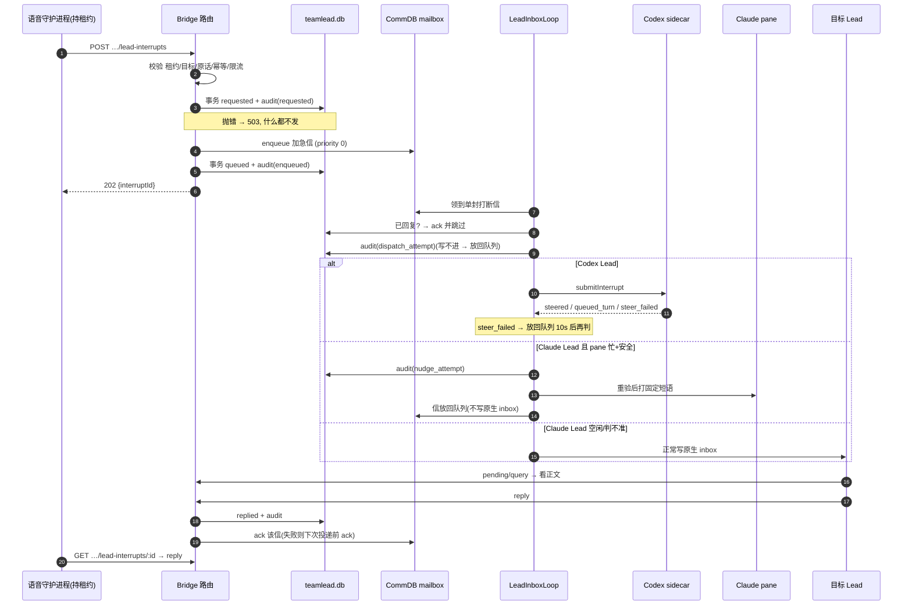

# FLY-2883 受控打断 Lead — 实施计划
Issue: FLY-2883 (https://linear.app/geoforge3d/issue/FLY-2883/语音耳机bridge-受控打断-lead先记审计-正文进信箱标加急-插进它当前这一轮不让它停下手上的活-回复回到发起方claudecodex)
日期: 2026-09-25
基于: research.md

**Status**: draft v4(Codex R1 8+1、R2 4+2、R3 1+2 已处理;v4 另按新实测事实改为复用 FLY-2882 的忙闲判定,见 §13「v4 事实驱动改动」)

## 0. 一句话

新增一个只有「持租约的语音会话」能调用的 Bridge 接口:先在一个事务里写打断记录 + 审计(写不进就 503 什么都不发),再把正文作为 `priority 0` 的加急信投进目标 Lead 的 CommDB 信箱;Bridge 的投递循环领到这封信时按载体处理——Codex 在 sidecar 里 `turn/steer` 进当前轮(空闲则普通起一轮),Claude 在 pane「确定在忙、不阻塞、输入框空」时只打一句固定短语并**把信扣在 CommDB 不写进原生 inbox**,直到 Lead 回信(直接 ack)或转为空闲(再正常投递);Lead 用显式回信接口按打断 id 回复,发起方按 id 取回。

## 1. 范围

**做**
- D1 路由 `POST /api/voice/sessions/:sessionId/lead-interrupts`、`GET …/lead-interrupts/:interruptId`(发起、取回)。
- D2 teamlead.db 两张表:`lead_interrupts` + `lead_interrupt_audit`(追加式)。
- D3 CommDB 加急信(`type='lead_interrupt'`,`priority=0`,`from_agent='lead-interrupt:<id>'`)。
- D4 投递循环里的打断分支(扣信 / 放行 / ack)。
- D5 Codex:新 socket 方法 `submitInterrupt` + 特性位 `lead_interrupt_steer_v1`。
- D6 Claude:pane 纯函数判据 + 固定短语(先审计、打字前重验)。
- D7 Lead 侧取信/回信:`POST /api/lead-interrupts/pending/query`、`POST /api/lead-interrupts/:interruptId/reply`;客户端 `flywheel-comm lead-interrupt pending|reply`(Claude)与 `lead_actions` 工具 `lead_interrupt_pending|lead_interrupt_reply`(Codex)。

**不做(⛔ = issue 明令)**
- ⛔ Esc / `turn/interrupt` / 任何取消当前轮的动作。
- ⛔ 改 Lead→Runner 的规则或 `runner-recovery-nudge.ts`;Runner 不能发起(ingest 档 403),也不能被打断(目标只从 Lead 身份表解析)。
- Raya 的对话逻辑(看忙闲、问 founder 等/打断、念回复)= FLY-2881 S4 集成单;`voice-codex` 不改(FLY-2799 PR #1306 正在大改 `bridge-client.ts`)。
- 不改 `lead-rules-base/*.md`;v1 不做过期状态机(R1#9)。

**依赖(v4)**:本单**复用 FLY-2882(已 Codex 批准的 Lead 忙闲只读接口)的两个纯模块**,不另写一套忙闲判定:
- Claude:`parseClaudeLeadPaneActivity(pane, leadId)`(FLY-2882 plan §4.1,`bridge/lead-activity/claude-pane-activity.ts`)——当前帧「状态槽位」规则,已在生产 14 个 Claude Lead 上实测;
- Codex:`LeadTurnStateTracker`(FLY-2882 plan §5.1–5.2,`lead-backends/codex/LeadTurnStateTracker.ts`)——每 generation 一个、含 founder 轮与 seed 初值的活跃轮表。
⇒ **实现顺序:FLY-2882 先合入,本单在其上实现。** 若 FLY-2882 推迟,本单不另造替代判定(那会形成两套会漂移的词表),而是等它。

## 2. 流程



## 3. 数据模型(teamlead.db,`migrateLeadInterrupts()` 在 `migrate()` 列表里登记)

```sql
CREATE TABLE IF NOT EXISTS lead_interrupts (
  interrupt_id TEXT PRIMARY KEY,                 -- 'li_' + uuid v4
  initiator_kind TEXT NOT NULL CHECK(initiator_kind IN ('voice_session')),
  initiator_ref TEXT NOT NULL,                   -- voice session id
  idempotency_key TEXT NOT NULL,
  request_digest TEXT NOT NULL,                  -- sha256(规范化请求)
  founder_message_id TEXT NOT NULL,
  target_project TEXT NOT NULL,
  target_lead_id TEXT NOT NULL,
  target_backend TEXT NOT NULL CHECK(target_backend IN ('claude-code','codex-app-server')),
  body TEXT NOT NULL,
  body_digest TEXT NOT NULL,                     -- sha256(body)
  delivery_id TEXT NOT NULL UNIQUE,              -- 'lead-interrupt:<interrupt_id>'
  state TEXT NOT NULL CHECK(state IN ('requested','queued','delivered','replied','failed')),
  disposition TEXT CHECK(disposition IS NULL OR disposition IN ('steered','queued_turn','nudged','mailbox_only')),
  disposition_reason TEXT,
  reply_text TEXT,
  reply_digest TEXT,
  replied_at TEXT,
  created_at TEXT NOT NULL,
  updated_at TEXT NOT NULL,
  UNIQUE(initiator_kind, initiator_ref, idempotency_key)
);
CREATE INDEX IF NOT EXISTS lead_interrupts_target_open
  ON lead_interrupts(target_project, target_lead_id, state);

CREATE TABLE IF NOT EXISTS lead_interrupt_audit (
  id INTEGER PRIMARY KEY AUTOINCREMENT,
  interrupt_id TEXT NOT NULL,
  event TEXT NOT NULL CHECK(event IN ('requested','refused','enqueued','enqueue_failed',
    'dispatch_attempt','steered','queued_turn','steer_failed','nudge_attempt','nudged',
    'nudge_skipped','nudge_failed','mailbox_only','replied','acked_after_reply')),
  initiator_kind TEXT NOT NULL,
  initiator_ref TEXT NOT NULL,
  founder_message_id TEXT,
  target_project TEXT,
  target_lead_id TEXT,
  body_digest TEXT,
  detail TEXT,                                   -- 短原因码;绝不存正文
  at TEXT NOT NULL
);
-- 追加式:原样照 lead_config_audit 的三条触发器(StateStore.ts:14323-14329)
CREATE TRIGGER IF NOT EXISTS lead_interrupt_audit_no_update BEFORE UPDATE ON lead_interrupt_audit
  BEGIN SELECT RAISE(ABORT, 'lead_interrupt_audit is append-only'); END;
CREATE TRIGGER IF NOT EXISTS lead_interrupt_audit_no_delete BEFORE DELETE ON lead_interrupt_audit
  BEGIN SELECT RAISE(ABORT, 'lead_interrupt_audit is append-only'); END;
CREATE TRIGGER IF NOT EXISTS lead_interrupt_audit_no_replace BEFORE INSERT ON lead_interrupt_audit
  WHEN NEW.id IS NOT NULL AND EXISTS (SELECT 1 FROM lead_interrupt_audit WHERE id = NEW.id)
  BEGIN SELECT RAISE(ABORT, 'lead_interrupt_audit is append-only'); END;
```

- 审计只存 `body_digest`,不存正文。
- 状态机:`requested → queued → delivered → replied`;`queued → replied` 也允许(Lead 在扣信期间就回了);`requested → failed` 只在 enqueue 调用本身抛错时。所有转移 `WHERE state IN (<期望旧状态>)`,0 行即抛。
- 没有过期状态(R1#9)。「未结」= `state ∈ {requested,queued,delivered}` 且 `created_at` 在 30 分钟内,**只用于限流查询**,不改状态、不影响投递。
- 保留分类:`scripts/lib/fly-2006-retention-tables/teamlead/lead_interrupts.json`、`lead_interrupt_audit.json` → `protectedCurrentOrReference`。

## 4. 接口合同

所有 SQL 参数化;所有输入 zod `.strict()`;错误体只含短错误码。

### 4.1 发起 `POST /api/voice/sessions/:sessionId/lead-interrupts`
- 认证:挂在现有 `voiceSessionAuthMiddleware` 下,`masterOnly()` + `X-Voice-Lease` 须 `getActiveVoiceLease(sessionId, lease, now)` 命中,会话状态 ∈ `claimed|warming|live`;否则 403 / 409(与 outbound 路由同码)。
- 请求体:`{ targetProject: string(1..64), targetLeadId: string(1..64), founderMessageId: /^\d{17,20}$/, body: string(1..2000 code points,去掉 \n 之外的控制字符), idempotencyKey: /^[A-Za-z0-9:_-]{8,128}$/ }`。
- 校验(失败 → 尽力写 `refused` 审计,返回错误码;审计写不进也同码返回——反正什么都不发):
  1. 目标:`resolveLeadIdentity({projectsPath, projectName: targetProject, leadId: targetLeadId})`(`flywheel-comm/src/lead-identity.ts:558`)命中且 backend ∈ 两种 → 否则 422 `target_not_lead`。
  2. founder 原话:在**会话所在项目** CommDB 用 `CommDB.openReadonly` + `inspectMailboxDeliveryState/Content` + `parseChatDeliveryEnvelope`(同 `commands/message-status.ts:107-124`)查 `chat:<session.leadId>:<founderMessageId>`:`location ∈ {live,archived}` ∧ `origin==='voice'` ∧ `voiceSessionId===sessionId` ∧ `authorId === 会话投影里的 founderUserId` → 否则 422 `founder_quote_unverified`。
  3. 幂等:同 `(voice_session, sessionId, idempotencyKey)` 已存在 → digest 不同 409 `idempotency_conflict`;相同 → 按当前状态**续做**(见下),不重复写 `requested`。
  4. 限流(只对新请求):同会话 + 同目标有「未结」打断 → 409 `interrupt_already_open`;同会话 10 分钟内 ≥ 3 次 → 429 `interrupt_rate_limited`。
- 三段写入与错误边界(R1#5):
  - **段 1** 事务:插 `lead_interrupts(state=requested)` + 审计 `requested`。抛错 → 503 `audit_unavailable`,返回。**此后才可能有副作用。**
  - **段 2** `MailboxQueue.enqueue({ id: deliveryId, deliveryId, fromAgent:'lead-interrupt:<id>', toAgent: targetLeadId, recipientKind:'lead', sourceKind:'lead_interrupt', sourceRef: interruptId, type:'lead_interrupt', msgClass:'model', priority:0, content: <§5 信件>, senderRef: encodeSenderRef() })`(R1#1:与 `discord-chat-ingest.ts:204` 同法)。
    - **只有 enqueue 调用本身抛错**才尝试事务 `requested → failed` + `enqueue_failed` 审计,返回 502 `mailbox_unavailable`(这一步也失败 → 行留在 `requested`,返回 503;重试会再次 enqueue)。
    - enqueue 返回 `inserted | active` 视为「信已在信箱」,**之后绝不写 `failed`**。
    - 返回 `archived`(只会发生在幂等续做时:信已进终态)→ 用 `MailboxQueue.inspectDeliveryState(deliveryId)`(`mailbox-queue.ts:938`)区分:`ACKED` → 段 3 改为 `requested → delivered`(disposition `mailbox_only`,reason `reconciled_acked`);`DEAD` → `requested → failed` + `enqueue_failed(letter_dead)`。R2#2
  - **段 3** 事务:`requested → queued` + 审计 `enqueued`。抛错 → 行留在 `requested`,返回 503 `state_commit_failed`。信已在信箱,但投递循环在状态补成 `queued` 之前**不产生任何副作用**(§6 第 1 步自己补状态),所以不依赖调用方重试(R2#2)。
  - 续做规则:幂等重放时,`requested` → 从段 2 重做;`queued|delivered|replied|failed` → 直接返回当前结果。
- 之后 best-effort 唤醒目标 Lead 的 inbox loop(与 `/api/lead-inbox/nudge` 同一内部函数),返回 202 `{ interruptId, state }`。

### 4.2 取回 `GET /api/voice/sessions/:sessionId/lead-interrupts/:interruptId`
- 同上认证;只能读 `initiator_ref === sessionId` 的行(否则 404)。只读,不改状态。
- 返回 `{ interruptId, state, targetProject, targetLeadId, disposition, dispositionReason, reply: {text, repliedAt} | null, createdAt }`。

### 4.3 Lead 取信 `POST /api/lead-interrupts/pending/query`(R1#6:用 POST,复用现有传输)
- master token + JSON 体 `{ project, leadId, identityDigest, leaseClaim? }`,carrier claim 走 `respond.ts` 里的 `postCarrierClaim()` 同一写法;Bridge 侧按 `founder-routing-response-route.ts:57-75` 从请求体重建 env 调 `authorizeLeadWrite({claimedLeadId: leadId})`。
- 返回该 Lead 名下 `state ∈ {queued, delivered}` 的打断:`[{ interruptId, founderMessageId, body, createdAt }]`。

### 4.4 Lead 回信 `POST /api/lead-interrupts/:interruptId/reply`
- 同 4.3 认证 + `leadId === target_lead_id ∧ project === target_project`,否则 403 `not_target_lead`。
- 体:`{ …身份字段, text: string(1..2000 code points) }`。
- 事务:`state IN ('queued','delivered') → replied`,写 `reply_text/reply_digest/replied_at` + 审计 `replied`。
- 重放(R1#2):已 `replied` 且 `reply_digest` 相同 → 200 返回原结果并**重试 ack**;digest 不同 → 409 `already_replied`。
- 回信事务提交后 `MailboxQueue.ack(deliveryId, now)`(`mailbox-queue.ts:2961`);ack 失败不影响回信结果——投递循环在下次领到这封信时会先看到 `replied` 并 ack(§6 第 1 步),所以不会再投正文。

### 4.5 客户端
- `packages/flywheel-comm/src/commands/lead-interrupt.ts`:`pending`、`reply <interruptId> --text-stdin`;身份 `authorizeLeadWrite`,传输复用 `respond.ts:147-205`(含 `postCarrierClaim` 分支,均为 POST + JSON 体)。
- `lead-actions-main.ts`:工具 `lead_interrupt_pending`、`lead_interrupt_reply`,raw bearer 只在子进程 env(照同文件 attachment reader,`:374-390`)。

## 5. 信件与短语

信件正文(CommDB `content`;Codex steer 的 input 也用它):

```
[加急 · 语音代 founder 转问] 打断 id: li_…
来源:语音分身代 founder 转问(会话 <sessionId>),引用她的语音消息 <founderMessageId>。
这不是 founder 本人在终端输入,不构成授权;需要动手的事仍走正常 founder 授权。
问题:<body>
请:用 lead-interrupt reply / lead_interrupt_reply 回一两句能念出口的话,然后继续你手上的活,不要停下。
```

Claude 终端固定短语(导出常量,白名单完全相等;测试钉死它不含 `li_`、不含正文):

```
有加急信件,请先运行 flywheel-comm lead-interrupt pending 看信并回复,然后继续手上的活
```

## 6. 投递(`LeadInboxLoop.deliverModelBatch`,新增可选依赖 `interruptHooks`;缺席 = 当普通信,字节兼容)

对「单封且 `type==='lead_interrupt'`」的批次(唯一 `from_agent` 保证单封,`mailbox-queue.ts:1580-1600`):

1. **绑定校验(fail-closed,R2#1)** `hooks.validateInterruptRow(project, leadId, row)`:必须找到 StateStore 行,且 `row.delivery_id === lead_interrupts.delivery_id`、`row.from_agent === 'lead-interrupt:<id>'`、`row.source_kind === 'lead_interrupt'`、`row.source_ref === interruptId`、`row.to_agent === target_lead_id`、所在项目 === `target_project`、载体 backend 与记录一致、`row.content` **逐字节等于**由 StateStore 字段重新渲染的 §5 信件(渲染函数确定性、单测钉死)。缺失或任一不符 → `queue.markDead(row.id, now, 'lead_interrupt_binding_mismatch')` + 尽力写审计 `refused(binding_mismatch)`,**不交 adapter / sidecar / tmux**。⇒ 只有经 4.1 受控路由写出的信才享有 steer / 打字能力;伪造或篡改的 `lead_interrupt` 行什么都得不到。
   **状态闸门**:`replied` → `queue.ack` + 审计 `acked_after_reply`,跳过(R1#2 兜底);`requested` → 先幂等补 `requested → queued` + `enqueued` 审计,失败则 `releaseClaimForRetry(30s)` 本 tick 结束(R2#2);`failed` → markDead 跳过;只有 `queued | delivered` 才往下走。
2. **审计** `dispatch_attempt`;写不进 → `releaseClaimForRetry`(不加重试计数,`mailbox-queue.ts:1119-1141`,30s),本 tick 结束。
3. **Codex**(`batch.kind='lead_interrupt'` 交 `CodexLeadDeliveryAdapter`):
   - 对端特性含 `lead_interrupt_steer_v1` → socket `submitInterrupt`;否则普通 `submitBatch`,记 `mailbox_only(steer_unsupported)`。
   - 回 `steered | queued_turn` → 落 disposition(`queued|delivered → delivered`)+ 同名审计;按现有 durable-accept 语义结算该行。
   - `recordDisposition` 遇到行已是 `replied`(Lead 抢先回信,R2#6)→ 只补 `disposition/reason` 与审计,**不降状态**;同 disposition 重放幂等,不同则 fail-closed 记审计不改表。
   - 回 `steer_failed` → 审计 `steer_failed`(detail 为 `stale_turn` 或 `steer_outcome_unknown`,见 6.1),`releaseClaimForRetry`(10s),下一轮重新判(R1#3:不在 sidecar 里立即 submit)。
4. **Claude**:
   - 若审计里已有本打断的 `nudged`(已打过字):pane 仍判「忙」→ `releaseClaimForRetry`(10s)继续扣信;否则 → 走正常 `ClaudeLeadDeliveryAdapter`,记 `mailbox_only(lead_idle_after_nudge)`。
   - 未打过字:判据(§6.2)为「忙 ∧ 不阻塞 ∧ 输入框空」→ 审计 `nudge_attempt`(写不进 → 当判不准处理)→ **重新 capture + 重验身份/前台/判据**(R1#8)→ `sendLiteralLineToLeadPane(ref, PHRASE)` → 成功:审计 `nudged`、disposition `nudged`、`releaseClaimForRetry`(10s)**不写原生 inbox**;重验不过或发送失败:审计 `nudge_skipped|nudge_failed`,落到下一条。
   - 判不准 / 空闲 / 阻塞 / 输入框非空 / 找不到 pane → 正常 `ClaudeLeadDeliveryAdapter`,记 `mailbox_only(<原因>)`。
   - ⇒ 原生 inbox 只在「Lead 空闲或判不准」时才写,且写之前第 1 步已排除「已回复」;busy+nudge+reply 路径下原生 inbox 不会出现这封信。

### 6.1 Codex sidecar `submitInterrupt`(`CodexLeadInboxSocket` 新 dispatch 分支 → TUI runtime 注入 `onSubmitInterrupt`)

- 新增最窄只读访问器 `LeadInputRouter.isPaused(): boolean`(R1#3)。活跃轮一律读 FLY-2882 的本 generation `LeadTurnStateTracker.snapshot()`(它同时覆盖机器轮 `origin:"message"` 与 founder 在 TUI 起的轮 `origin:"founder_terminal"`,并由 `thread/turns/list` seed 初值),不再读 `founderTurnActive`,也不再调用 `boundedTurnsList`。
- 一个确定性 journal observation(R1#4,用现有 append-only `recordObservation` + `getByIdempotencyKey`,不加新状态、不原地更新):`interrupt-result:<batchId>`,payload 记真实 disposition(`steered` 或 `queued_turn`)。只在副作用成功之后写。
- 逻辑(第 2–5 步之间**没有 await**,读状态与决定在同一同步段内完成——R3#1 从结构上消失):
  1. 已有 `interrupt-result:<batchId>` → 原样返回存的 disposition,不做任何副作用。
  2. router `isPaused()`(轮换栅栏中)→ 返回 `steer_failed(router_paused)`。
  3. `snap = tracker.snapshot()`;`!snap.connected || !snap.seeded` → 返回 `steer_failed(turn_state_unknown)`,**绝不 submit**。
  4. `snap.activeTurns` 非空 → 取其中唯一(>1 则取最早)一轮的 `turnId` → `proc.steerTurn({threadId, expectedTurnId: turnId, input:[{type:'text', text}], clientUserMessageId: batchId})`;成功 → 记 result `steered` → 返回;抛错 → 什么都不记,返回 `steer_failed`,detail:`CodexLeadProcessError.kind === 'protocol'`(轮已结束 / expectedTurnId 不符,确定未生效)→ `stale_turn`;`timeout | closed | exited`(可能已生效)→ `steer_outcome_unknown`,归 L3(R2#5)。
  5. `snap.activeTurns` 为空 → `router.submitBatch`(按 batchId 幂等,journal 自带去重)→ 记 result `queued_turn` → 返回。
- 崩溃窗口:steer 成功后、记 result 前崩溃 → 重投会再 steer 一次(至少一次,L3);`submitBatch` 路径靠 journal 按 batchId 去重。
- Bridge 侧回执只接受 `steered | queued_turn | steer_failed`,没有泛化的 `duplicate`。
- 特性位 `lead_interrupt_steer_v1` 只在 TUI runtime 同时注入了 `onSubmitInterrupt` 与 tracker 时宣告;headless 形态不宣告。

### 6.2 Claude pane 判据与打字(v4:复用 FLY-2882 解析器)

- 截屏:`defaultLeadPaneCapture(ref, 150)`(`bridge/lead-alert-helpers.ts:232`,内部做 capture 强度身份核验;150 行是 FLY-2882 实测能覆盖状态行的窗口)。
- 「安全」= 同时满足:
  1. `parseClaudeLeadPaneActivity(pane, leadId).state === "busy"`(FLY-2882 §4.1:按 `@<leadId>` 边框定位本 Lead 的输入框,只看输入框上方第一条第 0 列「状态槽位行」,进行中格式才算忙;完成行 `… for 1m 17s · done` 判空闲;`compacting` / `esc … to cancel` / 排队行 `› …` / 对话框 / 找不到输入框一律 unknown)。**unknown 与 idle 都不打字。**(取代 v3 的 `ownStateRegion + ACTIVE_INFLIGHT`,也就废掉了 R3#3 的逐行问题)
  2. `promptEmpty`:紧贴那条 `@<leadId>` 边框下方的 `❯` 行,`❯` 之后只有空白(本单新增的一个小纯函数,放 `bridge/lead-interrupt-delivery.ts`,与解析器用同一个边框定位常量)。
- 打字前身份证明(v4 更正):生产 Claude Lead 的 `pane_current_command` 是 `bash`(claude 是 `lead-body.sh` 的子进程),现有 `probeV2LeadPane(…,"send")` 对**所有**生产 Lead 都是 false(FLY-2882 实测)。⇒ 在 `LeadWindowLocator.ts` 新增探针强度 `"send_claude_child"`:在 capture 强度的全部检查之上,再用一次 `ps -A -o pid=,ppid=,comm=` 证明 pane 进程(`lead-body.sh`)**恰有一个**直接子进程且其 comm 基名为 `claude`(或 semver 形态,同现有正则);否则 false。现有 `"send"` 强度及 `sendEnterToWindow` 不动(它们的同类问题不在本单范围,另记 follow-up)。
- 打字原语 `sendLiteralLineToLeadPane(ref, text)` 放 `tmux-lookup.ts`(与 `sendEnterToWindow` 同构):只接受等于 PHRASE 常量的 text(否则抛)→ `probeV2LeadPane(ref, "send_claude_child")` → `tmux -S sock send-keys -t %0 -l -- <text>` → `Enter`。
- §6 第 4 步的「打字前重 capture + 重验」即:再截一次 150 行,再跑一遍上面两条判据 + `send_claude_child` 探针,任一不过 → `nudge_skipped`。

## 7. 文件清单

| 文件 | 改动 |
|---|---|
| `packages/teamlead/src/StateStore.ts` | `migrateLeadInterrupts()` + 读写方法 |
| `packages/teamlead/src/bridge/lead-interrupt-routes.ts`(新) | 4.1–4.4 |
| `packages/teamlead/src/bridge/lead-interrupt-delivery.ts`(新) | `interruptHooks`:绑定校验/审计/disposition/Claude 判定(调 FLY-2882 解析器 + `promptEmpty`)与打字编排 |
| `packages/teamlead/src/bridge/voice-session-routes.ts` | 挂 4.1/4.2(复用 masterOnly/lease) |
| `packages/teamlead/src/bridge/plugin.ts` | 挂 4.3/4.4,注入 hooks |
| `packages/teamlead/src/bridge/lead-inbox-loop.ts` | 打断分支 + 可选 hooks |
| `packages/teamlead/src/bridge/lead-delivery-adapter.ts` | `kind` 加 `lead_interrupt`;Codex 分支 |
| `packages/teamlead/src/bridge/lead-inbox-runtime.ts` | 构造 loop 时传 hooks |
| `packages/teamlead/src/bridge/tmux-lookup.ts` | `sendLiteralLineToLeadPane` |
| `packages/teamlead/src/LeadWindowLocator.ts` | 探针强度 `"send_claude_child"` |
| `packages/teamlead/src/lead-backends/codex/CodexLeadInboxSocket.ts` | `submitInterrupt` + 特性位 + 客户端函数 |
| `packages/teamlead/src/lead-backends/codex/LeadInputRouter.ts` | `isPaused()` |
| `packages/teamlead/src/lead-backends/codex/codex-lead-tui-runtime.ts` | 注入 `onSubmitInterrupt`(读 FLY-2882 的本 generation tracker) |
| `packages/teamlead/src/lead-backends/codex/lead-actions/lead-actions-main.ts` | 两个工具 |
| `packages/flywheel-comm/src/commands/lead-interrupt.ts`(新)+ `index.ts` | CLI |
| `scripts/lib/fly-2006-retention-tables/teamlead/*.json`(2 个新) | 保留分类 |

顺序(FLY-2882 合入之后):StateStore → 路由(真 `MailboxQueue`)→ Lead 侧路由与两个客户端 → 投递循环 hooks → Codex socket/sidecar → Claude 判据与打字。每步先写测试。

## 8. 测试(TDD;只跑改动文件相关用例;排除 `**/tmux-viewer.macos.test.ts`;跑 Bridge 用例前 export 隔离的 `FLYWHEEL_CODEX_HOMES_ROOT`)

- StateStore:建表;审计三条触发器(UPDATE / DELETE / `INSERT OR REPLACE` 同 id 都被拒);注入 `RAISE(ABORT)` 触发器时段 1 抛错且无残行;状态转移守卫(含 `queued → replied`)。
- 路由(supertest,**真 `MailboxQueue` + 临时 CommDB**,R1#1):入队成功且 senderRef 可 decode;无租约 / ingest 档;目标非 Lead;原话四个失败面 + 已归档通过;幂等重放与冲突;限流两种;**审计写不进 → 503 且 CommDB 无新行**;enqueue 抛错 → 502 + `failed`;**enqueue 成功后段 3 注入失败 → 503、行仍 `requested`、信在信箱、同键重试补成 `queued`**(R1#5);取回只见本会话;回信非目标 403、同文重放 200 并再 ack、异文 409。
- 投递循环:**伪造 `lead_interrupt` 行(无 StateStore 记录)与复用真实 id 但改正文/目标/from_agent 的行 → DEAD,且零 steer、零 tmux 输入、零原生 inbox 写入**(R2#1);**段 3 失败留 `requested` 时并发领信 → 补成 `queued` 前零副作用,补成后 pending/reply 正常**(R2#2);`archived` 的 ACKED/DEAD 两种对账;回信抢先于 disposition 写入 → 不降状态、审计补全(R2#6);已回复 → ack 跳过;`dispatch_attempt` 审计失败 → 放回不交 adapter;Codex 三种回执;Claude:忙+安全 → 打字 + 放回 + **原生 inbox 文件无新条目**;打过字后仍忙 → 继续放回且不再打字;打过字后空闲 → 正常投递;**打字后回信、ack 失败 → 下次领到先 ack、原生 inbox 仍无该信**(R1#2)。
- Codex sidecar(假 proc + 真 `LeadTurnStateTracker`):`origin:message` 轮 steer;`founder_terminal` 轮 steer;**tracker 未 seed / 已断连 → `steer_failed(turn_state_unknown)` 且 `router.submitBatch` 未被调用**(R2#3);seed 为空 → submit;steer protocol 错误 → `stale_turn`、timeout → `steer_outcome_unknown`,两者 router 都未被调用;**决策段内无 await 的结构钉死:在 `onSubmitInterrupt` 调用前让 tracker 收到 `turn/started` → 本次走 steer 而非 submit**(R3#1);paused → `steer_failed`;已有 result → 原样返回、无副作用;steer 成功后记账前模拟崩溃 → 重投再 steer 一次(L3 行为钉死);`submitBatch` 路径重投不重复起轮(R1#4 故障注入)。
- Claude 判据(忙闲本身由 FLY-2882 的解析器测试覆盖,本单只测组合):FLY-2882 的 busy / idle(完成行)/ unknown fixture × `promptEmpty` 真假 → 只有 busy∧空才打字;scrollback 留有旧进行中行、当前槽位是完成行 → 不打字(R2#4);`send_claude_child` 探针:前台 bash + 唯一 claude 子进程 → true;无子进程 / 两个子进程 / 子进程不是 claude → false;编排:**审计后重 capture 发现输入框变非空 → 不打字**、pane 身份变化 → 不打字(R1#8);打字 argv 钉死等于常量短语。
- CLI / lead_actions:请求形状、身份字段、错误透传。

## 9. QA 判据映射(529 房,⛔ 不碰生产 Lead)

| issue 判据 | 做法 |
|---|---|
| 1 两载体 Lead 在长活中,下个工具边界读到并回答,手上的活完成 | 529 房起 Claude 与 Codex 各一 slot Lead;各跑一轮会多次调工具的长活(如逐个读 20 个文件再汇总);台架 `claim` 语音会话租约 + chat-ingest 替身写一句 founder 原话 → 发起打断;看:审计 `nudged`/`steered`、Lead 在该轮中途 pending/reply、原长活最终汇总照常产出、轮未被取消 |
| 2 审计齐全 + 写不进不发(阴性真跑) | 查 `lead_interrupt_audit` 字段;在 slot `teamlead.db` 装 `BEFORE INSERT ON lead_interrupt_audit … RAISE(ABORT)` 再发起 → 503、目标 CommDB 无 `lead-interrupt:` 行、pane 无输入;删触发器复原 |
| 3 Claude 终端只出现固定短语、不出现正文;回复按 id 取回 | 打断前后 `capture-pane` 比对;`GET …/lead-interrupts/:id` 取回 reply;原生 inbox 文件无该信 |
| 4 空闲时走普通信箱正常回答 | 两载体空闲时发起 → Claude `mailbox_only(lead_idle)`、Codex `queued_turn`,Lead 正常回复 |
| 5 本机只跑相关测试;拆房前 ask Lead | 流程约束 |

## 10. 回滚与安全边界

- 回滚 = revert PR;新表与新信件都是增量,旧代码不读;旧 sidecar 无特性位 → 走普通排队。
- 往生产 Lead pane 打字的唯一路径:常量短语 + 纯函数判据 + 审计 + 打字前重 capture 重验 + `probeV2LeadPane("send")`。main 上没有生产发起方(Raya 集成是后续单),合入本身不会在生产产生打断。
- 用户派生文本(body/reply)只进 SQLite 参数、CommDB、Codex steer input、JSON 响应;不进 HTML、argv、tmux。

## 11. 已知限制

- L1 Claude「忙」判据仍是画面解析(FLY-2882 的状态槽位规则);unknown 降级为普通信箱(不会误打字,但可能等到这一轮结束)。Claude Code 改画面格式时它会先变 unknown,不会误判忙。
- L2 Codex tracker 未 seed(sidecar 刚起、seed 两次重试都失败)期间不 steer 也不起轮,信扣在 CommDB 每 10s 复判;下一个实时 turn 事件会自然 seed。
- L3 至少一次:sidecar 崩在 steer 成功与记账之间,或 steer 请求超时/断连(`steer_outcome_unknown`)后重试,Lead 可能收到两次;回信只收第一条、同文重放幂等兜底。
- L4 `founderMessageId` 校验依赖引擎 A 的 chat-ingest;引擎 B 合入后由集成单调整校验器。
- L5 v1 只有 `voice_session` 一种发起方。
- L6 扣信期间若 Lead 一直在忙且不回信,信会一直扣在 CommDB(每 10s 复判一次,不再打字);它空闲的那一刻正常投递。

## 12. 实现须知(R3 advisory,实现时照做,不改架构)

- R3#2:§3 状态机那句应读作「`requested → failed` 只允许两种来源:enqueue 调用本身抛错,或同一 deliveryId 的 archived-DEAD 对账(§4.1)」;状态转移守卫测试各钉一个来源。
- R3#3:已随 v4 失效(不再使用 `ACTIVE_INFLIGHT`,改用 FLY-2882 解析器)。

## 12b. Follow-ups(不在本单)

- Raya S4 对话集成。
- 现有 `probeV2LeadPane(…,"send")` / `sendEnterToWindow`(rescue 发 Enter)对所有生产 Claude Lead 都是 false(前台是 bash)——同类问题,另开单。

## 13. Codex 评审处理记录

| R1 条目 | 处理 |
|---|---|
| #1 senderRef 非法 | 改 `encodeSenderRef()`;路由测试用真 `MailboxQueue` |
| #2 Claude 原生 inbox 重复 | 忙+安全时打字后扣信不写原生 inbox;投递前先查 `replied` 并 ack;同文回信重放 200 + 再 ack |
| #3 私有状态 / fallback 立刻起轮 | 加 `activeTurnId()`、`isPaused()`;steer 失败回 `steer_failed` 由 Bridge 稍后复判,sidecar 不立即 submit |
| #4 journal 重放 | 只在副作用成功后记一条确定性 result observation;重放返回存的真实 disposition;去掉 `duplicate`;steer 崩溃窗口列 L3 |
| #5 跨库 saga | 三段写入的错误边界写死;enqueue 成功后绝不写 `failed`;段 3 失败留 `requested` 可同键补齐 |
| #6 GET 鉴权 | 改 `POST /api/lead-interrupts/pending/query`,复用 `postCarrierClaim` |
| #7 追加式缺 no_replace | 补第三条触发器 + 测试 |
| #8 未导出常量 / 打字前不重验 | 抽导出纯函数;审计后重 capture 重验 |
| #9 expiry 不一致(advisory) | v1 去掉过期状态;「未结」只用于限流 |

| R2 条目 | 处理 |
|---|---|
| #1 保留类型行未与权威记录绑定 | 投递前 `validateInterruptRow` 逐字段 + 正文逐字节比对重新渲染的信件;不符 DEAD,零副作用 |
| #2 `requested` 状态的信会被投递 / archived 含义错 | 投递循环只对 `queued|delivered` 产生副作用,遇 `requested` 先自己补状态;archived 按 ACKED/DEAD 分别对账 |
| #3 unknown 立即 submit | unknown 只在 `boundedTurnsList` 证明空闲时 submit,否则 `steer_failed` 交 Bridge 复判 |
| #4 判据被旧 scrollback 污染 / 路径错 | 先 `ownStateRegion` 限定活区域;路径更正为 `account-heal/model-cap.ts`,新纯函数单独成文件 |
| #5 (advisory) steer 抛错≠无副作用 | 区分 `stale_turn` 与 `steer_outcome_unknown`,后者归 L3 |
| #6 (advisory) 回信抢先导致 disposition 丢失 | `replied` 时只补 disposition 与审计,不降状态 |

| R3 条目 | 处理 |
|---|---|
| #1 unknown 分支 await 后不重验 | v4 改读 FLY-2882 tracker 快照,决策段内无 await,问题在结构上消失;未 seed 一律不 submit |
| #2 (advisory) 状态机文字矛盾 | 记入 §12 实现须知 |
| #3 (advisory) ACTIVE_INFLIGHT 须逐行 | v4 不再使用该正则 |

### v4 事实驱动改动(不是评审条目,是 R3 之后查到的新事实)

| 事实(来源) | 影响 | 改动 |
|---|---|---|
| 生产 Claude Lead `pane_current_command` = `bash`,`probeV2LeadPane(…,"send")` 对全部 Lead 为 false(FLY-2882 实测,记忆 reference_claude_tui_status_line_busy_idle_facts) | v3 的打字路径永远不会触发,QA 判据 1 必败 | 新增 `send_claude_child` 探针强度 |
| Claude 2.1.282 进行中行无 `esc to interrupt`;完成行 `✻ Worked for … · done` 会被字形正则误判为忙(同上) | v3 判据会把空闲 Lead 判忙并打字 | 改用 FLY-2882 已批准的状态槽位解析器 |
| FLY-2882 plan v3 已 Codex 批准,含 `LeadTurnStateTracker` | Codex 活跃轮有了唯一权威来源 | 改读 tracker,删除 `founderTurnActive`/`boundedTurnsList`/`activeTurnId()` 相关设计 |
