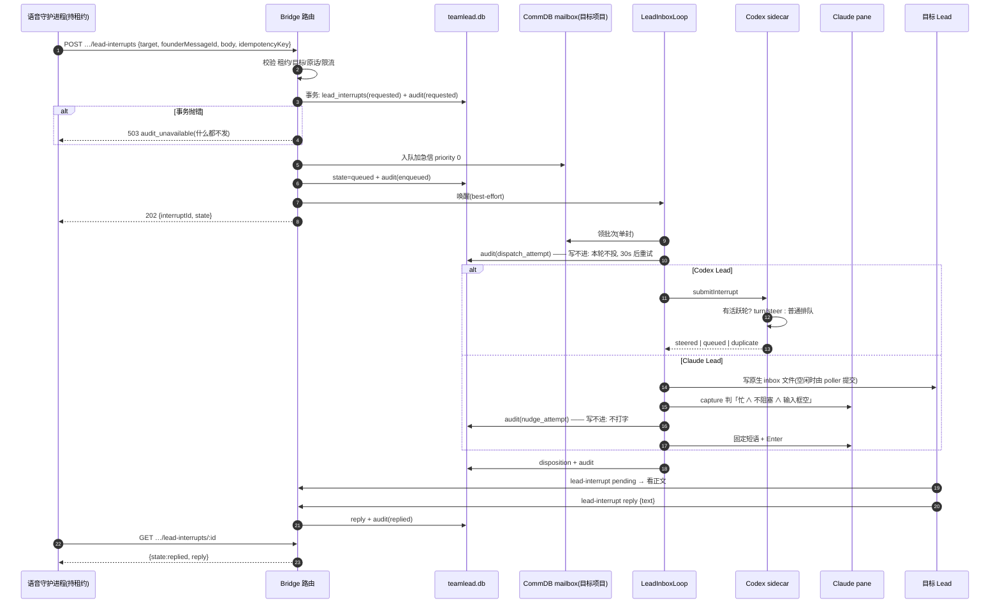

# FLY-2883 受控打断 Lead — 实施计划
Issue: FLY-2883 (https://linear.app/geoforge3d/issue/FLY-2883/语音耳机bridge-受控打断-lead先记审计-正文进信箱标加急-插进它当前这一轮不让它停下手上的活-回复回到发起方claudecodex)
日期: 2026-09-25
基于: research.md

**Status**: draft

## 0. 一句话

新增一个只有「持租约的语音会话」能调用的 Bridge 接口:先在一个事务里写打断记录 + 审计(写不进就 503 什么都不发),再把正文作为 `priority 0` 的加急信投进目标 Lead 的 CommDB 信箱;投递时按载体插进当前这一轮——Codex 在 sidecar 里 `turn/steer`,Claude 只在 pane「确定在忙且可安全输入」时打一句固定短语;Lead 用显式回信接口按打断 id 回复,发起方按 id 取回。

## 1. 范围

**做**
- D1 路由 `POST/GET /api/voice/sessions/:sessionId/lead-interrupts[/:interruptId]`(发起、取回)。
- D2 teamlead.db 两张表:`lead_interrupts`(一行一次打断)+ `lead_interrupt_audit`(追加式事件)。
- D3 CommDB 加急信(`type='lead_interrupt'`,`priority=0`,`from_agent='lead-interrupt:<id>'`)。
- D4 Codex:新 socket 方法 `submitInterrupt` + 特性位 `lead_interrupt_steer_v1`,sidecar 内 steer/退回排队。
- D5 Claude:投递后按 pane 判据打固定短语(先审计,fail-closed)。
- D6 Lead 侧取信/回信:路由 `GET /api/lead-interrupts/pending`、`POST /api/lead-interrupts/:interruptId/reply`;客户端 `flywheel-comm lead-interrupt pending|reply`(Claude)与 `lead_actions` 工具 `lead_interrupt_pending|lead_interrupt_reply`(Codex)。

**不做(⛔ = issue 明令)**
- ⛔ Esc / `turn/interrupt` / 任何取消当前轮的动作。
- ⛔ 改 Lead→Runner 的规则或 `runner-recovery-nudge.ts`;Runner 既不能发起(ingest 档 403),也不能被打断(目标只从 Lead 身份表解析)。
- Raya 的对话逻辑(1 分钟没回 → 看忙闲 → 问 founder 等/打断 → 把回复念出来)= FLY-2881 S4 集成单;本单只交付接口,`voice-codex` 不改(FLY-2799 PR #1306 正在大改 `bridge-client.ts`,避免冲突)。
- 不改 `lead-rules-base/*.md`(共享字节预算)。
- 不建 Lead 忙闲只读接口(FLY-2882)。

## 2. 流程



## 3. 数据模型(teamlead.db,`migrateLeadInterrupts()`,在 `migrate()` 列表里登记)

```sql
CREATE TABLE IF NOT EXISTS lead_interrupts (
  interrupt_id TEXT PRIMARY KEY,                 -- 'li_' + uuid v4
  initiator_kind TEXT NOT NULL CHECK(initiator_kind IN ('voice_session')),
  initiator_ref TEXT NOT NULL,                   -- voice session id
  idempotency_key TEXT NOT NULL,
  request_digest TEXT NOT NULL,                  -- sha256(规范化请求)
  founder_message_id TEXT NOT NULL,
  target_project TEXT NOT NULL,
  target_lead_id TEXT NOT NULL,
  target_backend TEXT NOT NULL CHECK(target_backend IN ('claude-code','codex-app-server')),
  body TEXT NOT NULL,
  body_digest TEXT NOT NULL,                     -- sha256(body)
  delivery_id TEXT NOT NULL UNIQUE,              -- 'lead-interrupt:<interrupt_id>'
  state TEXT NOT NULL CHECK(state IN ('requested','queued','delivered','replied','failed','expired')),
  disposition TEXT CHECK(disposition IS NULL OR disposition IN ('steered','queued_turn','nudged','mailbox_only')),
  disposition_reason TEXT,
  reply_text TEXT,
  replied_at TEXT,
  created_at TEXT NOT NULL,
  updated_at TEXT NOT NULL,
  expires_at TEXT NOT NULL,                      -- created_at + 30 min
  UNIQUE(initiator_kind, initiator_ref, idempotency_key)
);
CREATE INDEX IF NOT EXISTS lead_interrupts_target_open
  ON lead_interrupts(target_project, target_lead_id, state);

CREATE TABLE IF NOT EXISTS lead_interrupt_audit (
  id INTEGER PRIMARY KEY AUTOINCREMENT,
  interrupt_id TEXT NOT NULL,                    -- 拒绝的请求也有 id(未落 lead_interrupts 行)
  event TEXT NOT NULL CHECK(event IN ('requested','refused','enqueued','enqueue_failed',
    'dispatch_attempt','steered','queued_turn','nudge_attempt','nudged','nudge_skipped',
    'nudge_failed','mailbox_only','replied','expired')),
  initiator_kind TEXT NOT NULL,
  initiator_ref TEXT NOT NULL,
  founder_message_id TEXT,
  target_project TEXT,
  target_lead_id TEXT,
  body_digest TEXT,
  detail TEXT,                                   -- 短原因码/窗口名;绝不存正文
  at TEXT NOT NULL
);
-- 追加式:照 lead_config_audit
CREATE TRIGGER IF NOT EXISTS lead_interrupt_audit_no_update BEFORE UPDATE ON lead_interrupt_audit
  BEGIN SELECT RAISE(ABORT, 'lead_interrupt_audit is append-only'); END;
CREATE TRIGGER IF NOT EXISTS lead_interrupt_audit_no_delete BEFORE DELETE ON lead_interrupt_audit
  BEGIN SELECT RAISE(ABORT, 'lead_interrupt_audit is append-only'); END;
```

- 审计只存 `body_digest`,不存正文;正文只在 `lead_interrupts.body` 与 CommDB 信件里。
- 状态机:`requested → queued → delivered → replied`;`requested|queued → failed`(入队失败);`queued|delivered → expired`(到期未回,惰性:读时判定并补一条 `expired` 审计)。所有状态更新 `WHERE state = <期望旧状态>`,写失败即抛。
- 保留分类:`scripts/lib/fly-2006-retention-tables/teamlead/lead_interrupts.json`、`lead_interrupt_audit.json` → `protectedCurrentOrReference`。

## 4. 接口合同

所有 SQL 参数化;所有输入 zod `.strict()`;错误体只含短错误码,不回显正文或路径。

### 4.1 发起 `POST /api/voice/sessions/:sessionId/lead-interrupts`
- 认证:挂在现有 `voiceSessionAuthMiddleware` 下,`masterOnly()` + `X-Voice-Lease` 必须 `getActiveVoiceLease(sessionId, lease, now)` 命中,会话状态 ∈ `claimed|warming|live`。否则 403/409(与既有 outbound 路由同码)。
- 请求体:`{ targetProject: string(1..64), targetLeadId: string(1..64), founderMessageId: /^\d{17,20}$/, body: string(1..2000 code points,去除 \n 以外的控制字符), idempotencyKey: /^[A-Za-z0-9:_-]{8,128}$/ }`。
- 校验顺序(任一失败 → 写 `refused` 审计后返回;`refused` 审计本身写不进 → 仍返回同一错误码,不做任何投递):
  1. 目标:`resolveLeadIdentity({projectsPath, projectName: targetProject, leadId: targetLeadId})`(`flywheel-comm/src/lead-identity.ts:558`) 必须命中,backend ∈ 上面两种 → 否则 422 `target_not_lead`。
  2. founder 原话:在**会话所在项目**的 CommDB 用 `CommDB.openReadonly` + `inspectMailboxDeliveryState/Content` 查 `chat:<session.leadId>:<founderMessageId>`:`location ∈ {live,archived}` ∧ `origin==='voice'` ∧ `voiceSessionId===sessionId` ∧ `authorId === 会话投影里的 founderUserId` → 否则 422 `founder_quote_unverified`。
  3. 幂等:同 `(voice_session, sessionId, idempotencyKey)` 已存在 → `request_digest` 相同返回原结果(200),不同 → 409 `idempotency_conflict`。
  4. 限流:同会话 + 同目标已有未到期且未回复的打断 → 409 `interrupt_already_open`;同会话 10 分钟内 ≥ 3 次 → 429 `interrupt_rate_limited`。
- 写入:**一个事务**插 `lead_interrupts(state=requested)` + 审计 `requested`。抛错 → 503 `audit_unavailable`,返回,**不入队**。
- 入队:目标项目 CommDB `MailboxQueue.enqueue({ id/deliveryId:'lead-interrupt:<id>', fromAgent:'lead-interrupt:<id>', toAgent:targetLeadId, recipientKind:'lead', sourceKind:'lead_interrupt', sourceRef:<id>, senderRef:'voice_session:<sessionId>', type:'lead_interrupt', msgClass:'model', priority:0, content:<§5 信件> })`。成功 → `state=queued` + 审计 `enqueued`;失败 → `state=failed` + 审计 `enqueue_failed`,返回 502 `mailbox_unavailable`。
  - 唯一 `fromAgent` 让它天然单独成批(批次按 `from_agent` 聚合,`mailbox-queue.ts:1580-1600`),不改批次 SQL。
  - 重试同一幂等键且行停在 `requested`(崩在事务与入队之间)→ 重做入队(按 deliveryId 幂等)。
- 然后 best-effort 唤醒目标 Lead 的 inbox loop(与 `/api/lead-inbox/nudge` 同一内部函数),返回 202 `{ interruptId, state }`。

### 4.2 取回 `GET /api/voice/sessions/:sessionId/lead-interrupts/:interruptId`
- 同上认证;只能读 `initiator_ref === sessionId` 的行(否则 404)。
- 返回 `{ interruptId, state, targetProject, targetLeadId, disposition, dispositionReason, reply: { text, repliedAt } | null, createdAt, expiresAt }`。读时若已过期 → 置 `expired` + 审计。

### 4.3 Lead 取信 `GET /api/lead-interrupts/pending?project=&leadId=`
- master token(`tokenAuthMiddleware`)+ Lead 写身份:请求带 `identityDigest` + (`leaseClaim` | carrier claim header),Bridge 侧 `authorizeLeadWrite({claimedLeadId: leadId})`,照 `founder-routing-response-route.ts:57-75`。
- 返回该 Lead 名下 `state ∈ {queued, delivered}` 且未到期的打断:`[{ interruptId, founderMessageId, body, createdAt, expiresAt }]`。

### 4.4 Lead 回信 `POST /api/lead-interrupts/:interruptId/reply`
- 同 4.3 的认证;额外要求 `leadId === target_lead_id` 且 `project === target_project`,否则 403 `not_target_lead`。
- 体:`{ text: string(1..2000 code points) }`。
- 事务:`UPDATE … SET state='replied', reply_text=?, replied_at=? WHERE interrupt_id=? AND state IN ('queued','delivered')` + 审计 `replied`;0 行 → 已回复返回 409 `already_replied`,已过期返回 410 `interrupt_expired`。
- 成功后对目标 CommDB 里那封信调 `MailboxQueue.ack(deliveryId, now)`(`mailbox-queue.ts:2961`,若仍在队列/租出中),避免空闲后再触发一轮;标不上不影响回信结果(信件标头已写明「已回复则只 ack」)。

### 4.5 客户端
- `packages/flywheel-comm/src/commands/lead-interrupt.ts`:`pending`(打印正文列表)、`reply <interruptId> --text-stdin`;身份用 `authorizeLeadWrite`,传输照 `respond.ts:147-205`(含 carrier claim 分支)。
- `lead-backends/codex/lead-actions/lead-actions-main.ts`:工具 `lead_interrupt_pending`、`lead_interrupt_reply`,raw bearer 只在子进程 env(照同文件 attachment reader 写法)。

## 5. 信件与短语(Lead 看到的全部文字)

信件正文(CommDB `content`,Codex steer 的 input 也用它):

```
[加急 · 语音代 founder 转问] 打断 id: li_…
来源:语音分身代 founder 转问(会话 <sessionId>),引用她的语音消息 <founderMessageId>。
这不是 founder 本人在终端输入,不构成授权;需要动手的事仍走正常 founder 授权。
问题:<body>
请:先用 lead-interrupt pending / lead_interrupt_pending 看信,用 lead-interrupt reply / lead_interrupt_reply 回一两句能念出口的话,然后继续你手上的活,不要停下。
若这封信你已经回过(reply 返回 already_replied),只需 ack。
```

Claude 终端固定短语(常量,白名单完全相等;测试钉死它不含 `li_`、不含正文):

```
有加急信件,请先运行 flywheel-comm lead-interrupt pending 看信并回复,然后继续手上的活
```

## 6. 投递(LeadInboxLoop 内)

- `deliverModelBatch`:单封且 `type==='lead_interrupt'` → `batch.kind = 'lead_interrupt'`,并通过新增的可选依赖 `interruptHooks`(Bridge 注入,缺席 = 当普通信,字节兼容)在交给 adapter **之前**写审计 `dispatch_attempt`;写不进 → 本 tick 不投,`releaseClaimForRetry`(30s)。
- **Codex**(`CodexLeadDeliveryAdapter`):`kind==='lead_interrupt'` 且对端特性含 `lead_interrupt_steer_v1` → socket `submitInterrupt`(字段同 `submitBatch`);否则普通 `submitBatch`,结果记 `mailbox_only`(原因 `steer_unsupported`)。返回的 `disposition ∈ {steered, queued_turn, duplicate}` 经 `interruptHooks.recordDisposition` 落表 + 审计。
- **sidecar**(`CodexLeadInboxSocket` 新 dispatch 分支 → TUI runtime 注入的 `onSubmitInterrupt`):
  1. journal 已有该 batchId → `duplicate`;
  2. 活跃轮 = `executor.active?.turnId` ?? (`founderTurnActive === true` ? `founderTurnId` : null);router `paused` 视为无活跃轮;
  3. 有 → journal 记 `steering` → `proc.steerTurn({threadId, expectedTurnId, input:[{type:'text', text}], clientUserMessageId: batchId})` → 记 `steered` → 返回 `steered`;
  4. 无 / steer 抛错 → `router.submitBatch(...)` → `queued_turn`;
  5. 重投时 journal 停在 `steering`(崩溃)→ 走 4(至少一次)。
  - journal 的 `steering/steered` 用现有 `recordObservation`/批次接受原语实现,**不加新 journal 状态**;若实现时发现必须加,先报 Lead。
- **Claude**(`ClaudeLeadDeliveryAdapter` 照常写 inbox 文件,成功后 `interruptHooks.afterClaudeAccept`):
  1. `locateConfiguredLeadWindow`(`fleet-lead-locator.ts:21`)找不到 / `probeV2LeadPane(…,"capture")` 失败 → `mailbox_only(pane_unavailable)`;
  2. capture 最后 40 行:未命中 `ACTIVE_INFLIGHT` → `mailbox_only(lead_idle)`;命中阻塞/对话框 → `mailbox_only(pane_blocked)`;提示符行非空 → `mailbox_only(input_not_empty)`;
  3. 审计 `nudge_attempt` 写不进 → `mailbox_only(audit_unavailable)`,不打字;
  4. `sendLiteralLineToLeadPane(ref, PHRASE)`(内部再 `probeV2LeadPane(…,"send")`,`send-keys -l --` + `Enter`)→ `nudged` / 失败 `nudge_failed` → `mailbox_only(send_failed)`。
  - 同一打断最多打一次字(以审计里是否已有 `nudge_attempt` 为准)。
- 所有 disposition 写入时 `state: queued → delivered`。

## 7. 文件清单

| 文件 | 改动 |
|---|---|
| `packages/teamlead/src/StateStore.ts` | `migrateLeadInterrupts()` + CRUD(create/transition/listPending/reply/expire/appendAudit) |
| `packages/teamlead/src/bridge/lead-interrupt-routes.ts`(新) | 4.1–4.4 路由与校验 |
| `packages/teamlead/src/bridge/lead-interrupt-delivery.ts`(新) | `interruptHooks`:审计、disposition、Claude pane 判据与打字 |
| `packages/teamlead/src/bridge/voice-session-routes.ts` | 挂载 4.1/4.2 子路由(复用 masterOnly/lease) |
| `packages/teamlead/src/bridge/plugin.ts` | 挂载 4.3/4.4,注入 hooks |
| `packages/teamlead/src/bridge/lead-inbox-loop.ts` | `lead_interrupt` 批次种类 + 可选 hooks |
| `packages/teamlead/src/bridge/lead-delivery-adapter.ts` | `kind` 加 `lead_interrupt`;Codex 分支 |
| `packages/teamlead/src/bridge/lead-inbox-runtime.ts` | 构造 loop 时传入 hooks |
| `packages/teamlead/src/bridge/tmux-lookup.ts` | `sendLiteralLineToLeadPane` |
| `packages/teamlead/src/lead-backends/codex/CodexLeadInboxSocket.ts` | `submitInterrupt` 方法 + 特性位 + 客户端函数 |
| `packages/teamlead/src/lead-backends/codex/codex-lead-tui-runtime.ts` | 注入 `onSubmitInterrupt` |
| `packages/teamlead/src/lead-backends/codex/lead-actions/lead-actions-main.ts` | 两个工具 |
| `packages/flywheel-comm/src/commands/lead-interrupt.ts`(新)+ `index.ts` 注册 | CLI |
| `scripts/lib/fly-2006-retention-tables/teamlead/*.json`(2 个新) | 保留分类 |

## 8. 测试(TDD;本机只跑改动文件直接相关的测试,排除 `**/tmux-viewer.macos.test.ts`,跑 Bridge 用例前 export 隔离的 `FLYWHEEL_CODEX_HOMES_ROOT`)

- StateStore:建表/触发器(UPDATE/DELETE 被拒);`requested` 事务在注入 `RAISE(ABORT)` 触发器时抛错且无残行;状态转移守卫;过期惰性判定。
- 路由(supertest):无租约 403/409;ingest 档 403;目标不是 Lead 422;原话校验四个失败面各一例 + 已归档行通过;幂等重放/冲突;限流两种;**审计写不进 → 503 且 CommDB 无新行**(阴性);入队失败 → 502 + `failed`;取回只见本会话;回信非目标 Lead 403、重复 409、过期 410。
- 投递:`lead_interrupt` 单封成批;`dispatch_attempt` 审计失败 → 不交 adapter;Codex adapter 有/无特性位两路;sidecar `onSubmitInterrupt`(假 proc):机器轮 steer、founder 轮 steer、无活跃轮排队、steer 抛错退回排队、duplicate、`steering` 重投退回排队;Claude 判据六种分支(找不到/空闲/阻塞/输入非空/审计失败/发送失败)+ 成功打字的参数钉死为常量短语(假 exec 断言 argv 不含正文)。
- CLI / lead_actions:请求形状、身份字段、错误透传。
- 保留分类用例(`fly-2563-retention-protection`)自然覆盖新表。

## 9. QA 判据映射(529 房,⛔ 不碰生产 Lead)

| issue 判据 | 做法 |
|---|---|
| 1 两载体各一 Lead 在长活中,下个工具边界读到并回答,手上的活完成 | 529 房起 Claude 与 Codex 各一 slot Lead;让各自跑一轮会调用多次工具的长活(如逐个读 20 个文件并汇总);台架 claim 语音会话租约 + chat-ingest 替身写一句 founder 原话 → 发起打断;看:审计 `nudged`/`steered`,Lead 在该轮中途调 pending/reply,原长活的最终汇总仍产出、轮未被取消 |
| 2 审计齐全 + 写不进不发(阴性真跑) | 查 `lead_interrupt_audit` 字段;在 slot `teamlead.db` 装 `BEFORE INSERT … RAISE(ABORT)` 触发器再发起 → 503,目标 CommDB 无 `lead-interrupt:` 行,pane 无输入;删触发器复原 |
| 3 Claude 终端只有固定短语、不出现正文;回复按 id 取回 | `tmux capture-pane` 前后比对,只出现常量短语;`GET …/lead-interrupts/:id` 取回 reply |
| 4 空闲时走普通信箱正常回答 | 两载体 Lead 空闲时发起 → disposition `mailbox_only(lead_idle)` / `queued_turn`,Lead 正常回复 |
| 5 本机只跑相关测试;拆房前 ask Lead | 流程约束 |

## 10. 回滚与安全边界

- 回滚 = revert PR。两张新表与 CommDB 信件都是增量,旧代码不读;旧 sidecar 无特性位 → 自动走普通排队。
- 唯一会往生产 Lead pane 打字的路径:常量短语 + 三重判据 + `probeV2LeadPane("send")` + 先审计。main 上当前没有任何生产发起方(Raya 集成是后续单),所以合入本身不会在生产产生打断。
- 用户派生文本(body/reply)只进 SQLite 参数、CommDB、Codex steer input 和 JSON 响应,不进 HTML、不进 argv、不进 tmux。

## 11. 已知限制

- L1 Claude 的「忙」判据是 pane 启发式;判不准时降级为只进信箱(不会误打字,但可能晚到这一轮结束)。FLY-2882 落地后可换成它的只读接口。
- L2 Codex 的 founder 轮在 sidecar 启动后第一次观察到之前是 `"unknown"`,此时不 steer,走排队。
- L3 至少一次:sidecar 崩在 steer 前后时 Lead 可能看到两次;回信接口只收第一条兜底。
- L4 `founderMessageId` 校验依赖引擎 A 的 chat-ingest 路径;引擎 B 合入后由集成单调整校验器。
- L5 v1 只有 `voice_session` 一种发起方。

## 12. Follow-ups(不在本单)

- Raya S4 对话集成(调用本接口、把回复排队念出)。
- 接 FLY-2882 忙闲接口替换 L1 判据。
