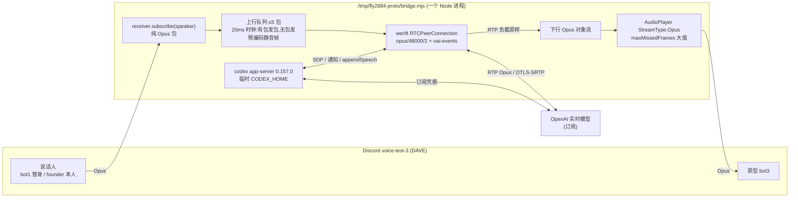

# FLY-2884 Discord 真人接 WebRTC 订阅实时会话 — 实施计划
Issue: FLY-2884 (https://linear.app/geoforge3d/issue/FLY-2884/语音bprototype-接-discord-真人说话把-webrtc-订阅的实时会话接进测试语音房opus-直转量真人延迟-插话-环境声)
日期: 2026-09-25
基于: research.md

## 0. 边界(逐条来自 issue)

- 原型代码放 `/tmp/fly2884-proto`(临时目录),**不改** `flywheel-FLY-2799` 分支、不改 `packages/voice-*`。本分支只提交文档 + 去敏证据。
- 登录:临时 `CODEX_HOME`,`auth.json` 软链到 `~/.codex/auth.json`;⛔ 任何 login/logout;每场前后记 auth.json mtime + email;清理只删软链本身。
- 额度:只有 school 号;每场 ≤10 分钟,总场次 ≤8。
- ⛔ 本机不跑整包测试。拆房(释放 slot 3 锁、bot 退出语音)前 ask Lead;请 founder 进房前把邀请原文交 Lead 过目。

## 1. 架构

- **直转**:两个方向都不解码不重编码;唯一编码动作是启动时预编码一个 20ms Opus 静音帧用于填空档。
- **测量解码(旁路)**:上下行各用 opusscript 解码一份**只用于算 RMS / 存录音**,不回送任何一方。
- **说话人进程** `speaker.mjs`(bot1):按剧本播放 WAV(opusscript 编码成 Opus 包喂 AudioPlayer),同时订阅 bot3 的声音并录下来 = 「房里人实际听到的」录音。
- 时钟见 §2.2:各进程只用单调时钟,指标只在进程内计算,**不做跨进程时间差**。

## 2. 测量合同(评审 R1 后重写;正式评审 R2 后补)

### 2.1 直转合法性检查(R1-1)
- **不假设 20ms**:每个 Opus 包先读 TOC 字节(config → 帧长 2.5/5/10/20/40/60ms;code → 帧数)得到样本数;旁路解码再核一次样本数。
- **上行**:单调 20ms 调度器,**只接受每声道 960 样本(20ms)的包**;Discord 包在入队前先查 TOC,不是 960 就 `uplink_non960` 并**在转发前停场**(不做「照样推进」)。每发一包 RTP timestamp +960。
- **下行**:两类分开记:(a) **包长不兼容** = 非 960 样本包 ⇒ `downlink_violation` 并停场(AudioPlayer 按 20ms/包 播放);(b) **传输间断** = 丢包 / 乱序 / DTX 造成的 timestamp 差 ≠ 960×seq 差 ⇒ 只计数(`downLoss`/`downReorder`/`downTsAnomaly`),**报告为传输情况,不归因为直转不兼容,也不据此转码**(RFC 7587 允许 DTX 省略静音帧)。
- **判定**:只有 (a) 类包长不兼容才算该方向「直转失败」并停场;另跑转码兜底并单独标注,**兜底结果不算直转通过**。
- 记录两个 Discord 连接实际协商的 DAVE 状态(`VoiceConnection` debug 里的 protocol version / session 就绪);未确认加密时不声称走通了 DAVE 路径。

### 2.2 时钟与阈值(R1-3)
- 每个进程只用单调时钟 `performance.now()`;**桥指标只在原型进程内算,房内指标只在说话人进程内算,不做跨进程时间差**。
- 有声帧判定:每场开头 3 秒静音校准,阈值 `th = max(3 × 底噪 RMS, 300)`,冻结后全场不变,写进 metrics。
- 语音段:连续有声 ≥200ms 才算开口;非有声持续 400ms(hangover)才算说完;「说完时刻」= 该段最后一个有声帧。
- 每场保存逐帧时间线(t, 方向, 字节数, 样本数, RMS)原始数据。

### 2.3 指标定义
| 指标 | 定义 |
|------|------|
| 说完→开口(桥) | 原型进程内:上行(说话人)语音段结束时刻 → 下行下一个语音段开始时刻 |
| 说完→开口(房内) | 说话人进程内:自己播放的最后一个有声帧送出时刻 → 从 Discord 收到 bot3 下一个语音段开始时刻。founder 场只有「桥」 |
| 插话(R1-2) | **有效尝试**:说话人进程确认 bot3 的回答在房内已连续播放 ≥1s 且插话开始前 300ms 内仍有声,才开口插话;不满足(回答已自然结束)作废、在场内补做,直到 5 次有效。**被打断的证据(R2-2,排除自然结束)**:必须有服务端实际截断的观察——数据通道 `turn.done`(assistant)的 `end_ms` 落在插话 user 轮 `start_ms` 之后 ≤400ms,且该回答转写未完成(截断在句中 / 带「...」,且之后又续说或另起);只满足「回答停了」而无截断事件的样本记**不确定**,不计成功。**成功** = 有上述截断证据 **且** 房内旧声音在说话人开口后 ≤1.5s 内停止(= 桥上「插话声到达 → 服务端用户开口事件」用时 + 下行缓冲与 Discord 传输)**且** 模型下一轮直接回答新问题(transcript 含对应算术答案)。另报两个分项:能否打断(截断证据有/无)、之后是直接答还是先续说旧内容 |
| 环境声误触发(R1-3) | 刺激窗口:风扇 60s、键盘 60s、远处人声 60s,窗口间 10s 静音;主指标 = **唯一的自发轮次数**,以**模型回答为准**:窗口内每一个模型自发回答轮次算 1 次误触发(无论有没有 user transcript;有转写的只用于关联去重,同一轮多条 delta 合并);「只有转写无回答」单列为诊断数,不进主指标;启动后前 5s 不计 |
| 稳定(R1-4) | 一场总长 600s(从 `thread/realtime/start` 请求起算,硬停 600s);报告实际 connected 时长;判据:首次 connected 后无意外断线、无 `thread/realtime/error|closed`、每题有回答、下行无 >2s 断流、上行队列无持续溢出 |
| 额度(R1-7) | 每场前后各读 `account/rateLimits/read`(`usedPercent` + `resetsAt` 窗口标识)与 `account/usage/read` 当日 token 桶;只在同一窗口(`resetsAt` 相同)内做差,跨窗口记 N/A;差值标注为「共享账号上界」;空闲漂移只作同期背景参考,不从差值里扣除。注:设计评审 R1 实测当日 token 桶未即时更新,若全程不动则如实写「只有周窗口整数百分比可用」 |

## 3. 场次(≤8 场,每场 ≤10 分钟;脚本从 realtime/start 起硬停 600s)

| # | 场次 | 内容 | 时长上限 |
|---|------|------|---------|
| 1 | 冒烟 | 连通 + 1 问 1 答,确认两个方向直转可听、DAVE 状态、包时长检查全过 | 3 min |
| 2 | 延迟 ×5 + 后台回合 | 5 个短问题各等回答完;第 6 句「请读取 hello.txt 的第一行,告诉我写了什么」触发只读后台回合,结果 appendSpeech 交回 | 8 min |
| 3 | 插话 ×5 有效 | 让模型长答(「详细讲讲…」),房内回答连续播放 ≥1s 后插话「停一下,换个问题:X 加 X 等于几?」;无效尝试补做 | 8 min |
| 4 | 环境声 | 风扇 60s、键盘 60s、远处人声 60s(期间不说话,窗口间 10s 静音);其后在风扇底噪上问 2 题确认仍能正常回答 | 6 min |
| 5 | 10 分钟稳定 | 每 ~60s 一问(短问/长问混合 + 1 次后台回合),总长 600s | 10 min |
| 6 | founder | founder 本人进房约 5 分钟,自由说话 + 至少 1 次插话 | 6 min |
| 7–8 | 预留 | 某场因原型缺陷失败时重跑 | — |

延迟「至少 5 次取均值」由场 2 的 5 次给出,场 5 的约 9 次作补充样本,两组分开报。
环境声是 bot 直接播放的,没有真人 Discord 客户端的降噪(Krisp)⇒ 比真人条件更严;结论页写明。

## 4. 后台只读回合

- `thread/start` 参数同第五版:`approvalPolicy:"never"`, `sandbox:"read-only"`, `ephemeral:true`,cwd = `/tmp/fly2884-proto/work`(内含 `hello.txt`)。
- `clientManagedHandoffs:true`;`turn/completed` 后取 final_answer → `thread/realtime/appendSpeech`。
- 每场最多 1 次后台回合;第 2 次 `turn/started` 立即 `turn/interrupt`(第五版同款保险)。

## 5. 证据与产出

- 每场:`log-<n>.jsonl`(去敏)、`room-<n>.m4a`(说话人进程录到的房内声音)、`uplink-<n>.m4a`/`downlink-<n>.m4a`(原型侧旁路解码)、`metrics-<n>.json`。
- 去敏证据提交到 `engineering/doc/FLY-2884-discord-webrtc-voice/evidence/`;原型源码快照也放这里(只读参考,不进任何 package)。
- 结论页 HTML:每节评论框 + 「复制全部评论」,`publish-report --publish-only` 取 URL,自验 200 后 ask Lead。
- 可复用代码片段(Opus 直转两段、20ms 时钟补静音、插话检测)写进结论页给「核心·连接层」单。

## 6. 失败处置

- 直转不可听 / 解码失败:先抓包对比 TOC 与声道,再加最小转码(只在失败方向),结论页写明原因。
- DAVE 解密失败持续:记 `decrypt_failures` 诊断,换 `decryptionFailureTolerance`,仍不行则报 Lead。
- 服务端拒绝 / 额度耗尽:立即停,不重试循环,报 Lead。
- 任何一项做不到:写清在哪一步、为什么、下一步怎么办。

## 7. 房间占用与安全(R1-5、R1-6)

- **锁**:`mkdir /tmp/flywheel-test-slot-3.lock`(原子),`pid` 写常驻守护进程 pid,另写 `owner.txt`(FLY-2884 + exec id + 时间);结束 ask Lead 后释放并留证据。
- **bot1 的占用(R2-1,已知限制)**:bot1 属于 slot 1。Lead 裁定本单不得触碰 slot 1/2/4 的锁,所以**不占 slot 1 锁**;缓解:每场 bot1 进房前 fail-closed 预检(bot1 不在任何语音频道、目标频道无外人),运行中守护(bot1 被移走/有人闯入即停本场),且此后每场开跑前确认 `/tmp/flywheel-test-slot-1.lock` 不存在(存在则不跑)——**如实记录:替身场 s1–s6 跑之前没有逐场查这把锁**,只有预检 + 运行中守护;各场日志里未出现 intruder / bot 被移走,事后核对该锁不存在。bot1 只进语音、不碰文字频道;founder 场不用 bot1。若 Lead 另行授权占 slot 1 锁,则改为连接前持有 slot 1、3 两把锁,任一被占用即停止。
- **每场 fail-closed 预检**(bot3 网关读 guild voice states,记录 guild/channel/bot id 与检查时刻):
  目标频道 `voice-test-3` 除 bot1/bot3 外无人(founder 场仅允许 founder);bot1、bot3 当前不在任何语音频道;任一不满足 ⇒ 不进房、不抢占。
- **运行中守护**:目标频道出现非预期成员,或 bot1/bot3 被移出/移走 ⇒ 立即停本场并退出语音,不自动移动任何人。
- **凭据**:临时目录 0700、日志 0600;bot token 只从环境读入内存;日志按**实际加载的 secret 值**精确替换 + 过滤认证字段;
  提交证据前扫描 token / JWT / Authorization / 邮箱 / auth.json 内容;不跟随或复制软链目标。

## 8. 验收自检(对 issue 验收条 1–6)

1. 场 2/5/6 的录音 + transcript;2. 场 2 五次值 + 均值,场 3 成功率,场 4 误触发数;3. 场 5 全程指标;4. 场 2(及场 5)后台回合 transcript;5. 每场前后读数表;6. 未达项逐条写原因与下一步。
