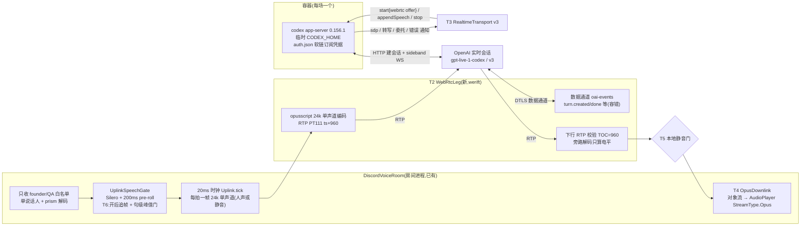
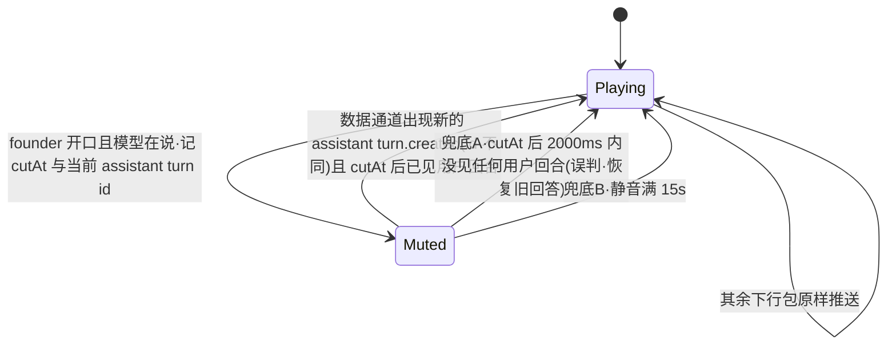
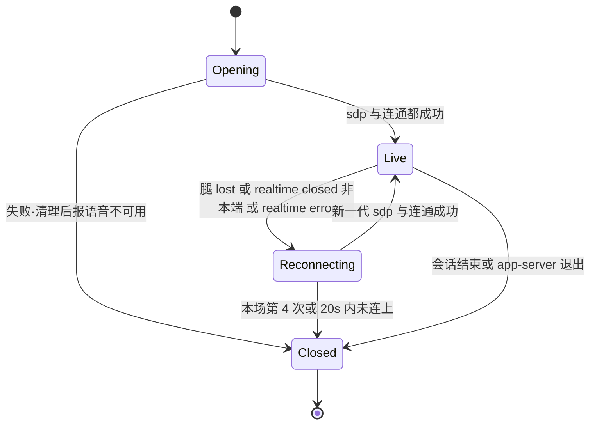

# FLY-2885 引擎 B 改走 WebRTC + 订阅 — 实施计划
Issue: FLY-2885 (https://linear.app/geoforge3d/issue/FLY-2885/语音b核心连接层-引擎-b-改走-webrtc-订阅替换-websocket-api-key房间进程-webrtc)
日期: 2026-09-25
基于: research.md

状态:v1 草案,待设计评审。本文只设计,不含实现。

## 0. 边界与验收映射

| issue 验收 | 本计划落点 | 证明方式 |
|---|---|---|
| 1 无 API key 真人问答 | T1 容器认证改订阅、T10 配置/启动壳/QA 房不再要求或注入 key | QA-1:语音进程与 codex 子进程环境里都没有 `OPENAI_API_KEY`(`ps eww` 取证只记变量名是否存在),真人问答录音 + 转写 |
| 2 延迟 ≤ 2884 均值 +20% | T2/T3 WebRTC 直连、T4 下行直转、T6 门开后追帧 | QA-2:5 次「说完→开口」,**程序端 ≤1,182 ms、房内 ≤1,890 ms**(2884:985 / 1,575 ms) |
| 3 断网/杀连接自动恢复或干净结束 | T7 断线换代 + 上限、收尾、孤儿清扫 | QA-3a 断 WebRTC 腿 → 自动恢复;QA-3b 杀 app-server → 干净结束;两次都查无锁、无孤儿 |
| 4 2799 三项回归全绿 | 回环排除(文字层,不动)、首帧即播(T4 新测试)、句首补音(T6 保持 pre-roll) | 相关单测 + QA 听感 |
| 5 只跑相关测试;拆 529 房前 ask Lead | §6 测试清单只列改动文件的测试 | runner 纪律 |
| 本单 ① 插话 ≤1.0 s 停 | T5 本地截断 | QA-4:5 次有效插话,房内旧声音在开口后 ≤1.0 s 停 |
| 本单 ② 远处人声 | T6 句级峰值门 | QA-5:2884 远处人声素材 60 s 零误触发;founder 轻声仍放行 |

**不做**:大脑层(身份措辞、能力说明、只在被叫到时回答)、切生产默认引擎、多人混音、旧引擎 `openai-realtime`、升级舰队 Codex。

## 1. 架构

- 音频只走我们进程里的 WebRTC 腿;app-server 只做建会话、sideband(appendSpeech、委托)与通知。
- 上行保留 2799 整条 PCM 管线,**只把末端的 JSON-RPC appendAudio 换成「编码一次 Opus + RTP」**(research U1)。
- 下行不解码不重编码(2884 已证),只在本地插话时把负载换成预编码静音帧。

## 2. 稳定身份与配置

| 名称 | 值 / 来源 | 说明 |
|---|---|---|
| 后端 id | `codex-realtime`(不变) | 注册表、投影、证据都沿用 |
| 二进制 | `CODEX_VOICE_BINARY_VERSION = "codex-cli 0.156.1"`、sha256 `0196e89f…255a`(不变) | research R1:v3/WebRTC 代码与 0.157.0 逐字相同 |
| 会话参数 | 常量 `CODEX_VOICE_REALTIME_VERSION = "v3"`、`CODEX_VOICE_REALTIME_MODEL = "gpt-live-1-codex"`、`transport:{type:"webrtc",sdp}`、`outputModality:"audio"`、`clientManagedHandoffs:true`、`includeStartupContext:false` | 与 CLI `/voice` 同参;模型**显式传**,不靠默认 |
| 声线 | 每个 Lead 新字段 **`liveVoice`**,枚举 = v3 九个(`LIVE_V3_VOICES`,放 `teamlead/src/realtime-voices.ts`),缺省 `cove` | 旧引擎继续读 `realtimeVoice`;两个字段互不回退(Lead 裁定待回,见 §9) |
| 凭据源 | 环境 `FLYWHEEL_VOICE_CODEX_AUTH_SOURCE`,缺省 `~/.codex/auth.json`(舰队凭据) | 只建软链,绝不拷贝、不 login/logout |
| 门参数 | `FLYWHEEL_VOICE_UPLINK_MIN_ONSET_DBFS`(缺省 −30,`off` 关闭)、`FLYWHEEL_VOICE_UPLINK_PREROLL_MS`(已有,200) | 峰值门只在 WebRTC 房生效 |
| STUN | `FLYWHEEL_VOICE_WEBRTC_STUN`(缺省 `stun:stun.l.google.com:19302`,空串 = 只用本机候选) | 与 2881/2884 实测同配置 |

## 3. 改动清单

### T1 容器与订阅认证(`codex/CodexVoiceContainer.ts`、`codex-home.ts`、`teamlead/src/codex-process.ts` 调用面)

1. `VOICE_CODEX_HOME_CONFIG` 改为 `forced_login_method = "chatgpt"`、`cli_auth_credentials_store = "file"`,其余特性开关不变(仍关 shell/unified_exec/memories/web 等)。
2. 建 home 时在 `config.toml` 之后创建 `auth.json` **软链** → 凭据源绝对路径。准入校验(改写 `assertVoiceCodexHome`):
   - 凭据源:绝对路径、`lstat` 是本用户拥有的**普通文件**(不是软链)、权限 `0600`;启动时 `realpath` 一次并钉住。
   - home 里的 `auth.json`:必须是软链、`readlink` 恰等于钉住的源路径;其他任何形态(普通文件、指向别处)⇒ `codex_profile_mismatch`。
   - 删除 root 用 `rm({recursive,force})`(按 `lstat` 不跟随软链);加测试:删后源文件仍在、字节不变。
3. 构造参数去掉 `openAiApiKey`;`spawnCodexAppServer` 不再传 `voiceProfile`(保留该能力给别的调用者,不删);子进程环境继续用 `positiveChildEnv` 白名单(本来就不含 key)。
4. 开会话前 `account/read`:`account.type` 必须是 `"chatgpt"`,否则 `codex_auth_rejected`;`classifyOpenError` 增加订阅侧文案匹配(`usage limit`、`rate limit`、HTTP 401/403 的 ChatGPT 形态),额度耗尽 → `codex_quota_exhausted`,**不切引擎、不换模型**。
5. `assertThreadReceipt` 不变(cliVersion 仍 0.156.1)。

### T2 WebRTC 腿(新 `codex/WebRtcLeg.ts`)

- 依赖:`werift@0.24.4`(新,精确版本)、`opusscript@0.0.8`(voice-codex 显式声明,版本同 voice-bridge)。
- `prepareOffer()`:一条 `sendrecv` 音频收发器(opus/48000/2,PT111,`minptime=10;useinbandfec=1`)+ `oai-events` 数据通道;等 ICE 收集完成(≤8 s)返回 offer SDP。
- `acceptAnswer(sdp)`:设远端描述;等 `connectionState=connected`(≤10 s,超时 = 本代失败)。
- 上行 `writePcm24(frame960Bytes)`:只收 960 字节(20 ms 24 kHz 单声道),`opusscript(24000,1,VOIP)` 编码,RTP 序号 +1、时间戳 +960;编码或写失败 → `onInputGap`。
- 下行:每个 RTP 负载先读 TOC 得样本数,**不是 960 就本代失败**(`downlink_non960`,2884 同规则);序号回退/重复丢弃计数;旁路 `opusscript(48000,2)` 解码只算 RMS(不回送)。回调 `onDownlink({payload, voiced, rms})`。
- 数据通道:JSON 解析失败忽略并计数;只转出 `session.started{expires_at}`、`turn.created/done{id,role,start_ms,end_ms,transcript}`,其余只计数。**任何字段缺失都不抛**。
- 状态回调:`connected`、`lost(reason)`(`failed`,或 `disconnected` 持续 >5 s,或数据通道关闭,或连通后 5 s 收不到任何下行包)。
- `close()` 幂等:关数据通道、关 PeerConnection、释放编解码器。

### T3 v3 协议适配(`codex/RealtimeTransport.ts`)

- `start()`:由调用方先给 offer;请求 `thread/realtime/start {..., version:"v3", model, voice, transport:{type:"webrtc",sdp}, prompt, initialItems}`;
  **以 `thread/realtime/sdp` 为准**:等到 sdp → `leg.acceptAnswer` → 连通才 `active`;期间收到 `thread/realtime/error`/`closed` 立即失败(research R2:声线不支持是异步 error)。总超时沿用 60 s。
- `appendAudio(frame, generation, owner)`:改为同步写 WebRTC 腿;返回值语义保留(`sent`/`dropped:*`),`backpressure` 只在腿不可写时出现;owner 归属、`unsettledInput` 统计照旧。
- `thread/realtime/outputAudio/delta` 在 WebRTC 下**不应出现**:出现即 `fenced` + 证据(防重复出声)。
- 转写、`handoff_request`、`turn/started` 拦截、`item/started` 执行拦截:**不变**。
- `version` 校验改为 `"v3"`;`started` 不再是开会话的必要条件(v3 下 sdp 先到)。

### T4 下行直转与首帧即播(`discord-room.ts`、新 `audio/OpusDownlink.ts`、voice-bridge `discordWiring.ts`)

- voice-bridge `ResourceSource` 新增 `{kind:"opus-stream", stream}` → `createAudioResource(stream,{inputType: StreamType.Opus})`(加法,不改已有三种)。
- `DiscordVoiceRoom` 新选项 `downlink: "pcm-mouth" | "opus-passthrough"`(缺省 `pcm-mouth` = 今天行为,旧引擎不受影响)。`opus-passthrough` 时不起 `WaitingMouth`,改起 `OpusDownlink`:
  - 一个对象模式可读流 + 一个 `opus-stream` 资源常驻播放;`push(payload)` 在 RTP 回调里**同步**入流(首帧即播)。
  - 积压保护:流里 >25 包(500 ms)才裁到 3 包并记 `downlink_queue_trim`(2884 最深 7–10 包,正常不触发;不按 2799 的「永不丢」是因为 RTP 已按实时节奏到达,积压只来自卡顿)。
  - 播放器进入 idle(连续 5 s 无数据)⇒ 重建资源继续播并记证据。
- `CodexVoiceBackend` 去掉按 assistant item 开 `openAudio` 的逐项输出;改为会话级 `downlink` 接口 `{push(payload), mute(), unmute()}`。
  `response-audio` 事件不再发 PCM(WebRTC 下没有 PCM);`response-started/done` 改由**下行能量**判定:未静音时 300 ms 内有有声帧 = 正在说。

### T5 本地插话(`codex/CodexVoiceBackend.ts`、`session.ts` 不改触发条件)

触发点沿用 `GenericVoiceSession`:founder 的音频离开门(= 门确认人声 ≥200 ms 的那一刻,T6 后不再多等)且 `frontendResponseActive` ⇒ `frontend.cancelSpeech` ⇒ `CodexVoiceSession.interrupt()`。
`interrupt()` 在 WebRTC 下**不再 `restart()`**,改为下面的静音状态机:

- 静音 = 每个下行包换成启动时预编码的 20 ms Opus 静音帧继续推(播放器不断粮)。
- 「用户回合」= 数据通道 `turn.created{role:user}` **或** app-server `transcript/delta{role:user}`(二者取先到);「新 assistant 回合」优先用数据通道 id;
  若本代从未收到任何 `turn.*` 事件,退化为「用户回合之后的第一条 assistant `transcript/delta`」。
- 进入静音时:`speaker.interrupt()`(在途朗读回执按 `speech_interrupted` 结束)、发 `response-cancelled`、证据 `codex_barge_in_local_cut{cutAt, turnId}`;解除时证据带原因(`new_turn|unconfirmed|timeout`)。
- 取消:v3 没有客户端取消事件(research R6),**不发任何数据通道客户端事件**;旧回答由服务端判定插话时自己截断。
- 协议说明(Bridge,T8)加一句:被打断就放弃没说完的话、直接回应新问题,不要接着说完或重复。

### T6 上行门:开后追帧 + 句级峰值门(`pipeline/UplinkSpeechGate.ts`、`pipeline/Uplink.ts`、`discord-room.ts`)

两个新选项,只在 `downlink:"opus-passthrough"` 的房间传入,缺省关闭 ⇒ 旧引擎字节级不变:

1. `releaseWhenOpen: true`:链打开后,延迟线里**已有判定**的帧立即放行(不再等满 24 帧);链关闭(连续 100 ms 非人声)后恢复按固定延迟,下一句句首仍有完整 200 ms pre-roll。
2. `minOnsetPeakDbfs: -30`:在链「本该打开」的那一刻,计算延迟线里全部帧(含 pre-roll)的最大帧电平;低于门限则**不打开**,这些帧按静音放行,继续判后续帧(变响再开)。记 `uplink_gate_rejected_quiet{peakDbfs}`。

`Uplink` 发送侧:WebRTC 模式下每拍若抖动队列 >3 帧,本拍多发一帧(每拍最多 2 帧;2884 同策略)。句首积压约 0.5 s 在开口后约 0.5 s 内追平。
仍保留:单说话人、白名单、`setMicOpen`、失败降级 `passthrough`。

### T7 断线、收尾、孤儿(`codex/CodexVoiceContainer.ts` `CodexVoiceConversation`、`CodexVoiceBackend.ts`、`daemon.ts` 启动)

- 换代 = 同一容器、同一 thread:旧代 `thread/realtime/stop`(忽略错误)→ 旧腿 `close()` → 新腿 offer → 新 `realtime/start`(**同一份上下文快照**,不重新拉取)。旧代所有回调按 generation 丢弃(已有机制)。
- 上限:每场最多 3 次换代,退避 0 / 2 / 5 s,每次 20 s 超时;用尽 ⇒ `realtime_reconnect_exhausted` 结束本场(走已有 `onClosed → finish(failed)`,thread 里有一行状态)。
- 换代期间上行帧丢弃并 `markInputGap`(这段话归属 unknown,不授权委托);下行静默。首次掉线在 thread 发一行「📻 语音连接断了,正在重连」,恢复发「📻 已重连」。
- app-server 退出 ⇒ 不重连,直接结束(已有行为)。
- 收尾顺序(幂等):停止写上行 → `thread/realtime/stop`(5 s)→ 腿 `close()` → `process.stop()`(已有 TERM→KILL 升级)→ 删 root → 证据 `codex_voice_container_closed`。
- 孤儿:打开容器时在 root 写 `owner.json{daemonPid, daemonBootId, childPid, createdAt}`(0600)。守护进程启动时扫 `codex-containers/container-*`:owner 的 daemonBootId 不是本次且(daemonPid 不在或不是本进程),则只在 `ps -o args=` 与钉住的二进制路径一致、且 `lsof -a -p <pid> -d cwd` 等于该 root 的 `work` 时终止子进程,然后删 root;每项记 `codex_voice_orphan_swept`。判不准就只记证据不动。

### T8 上下文装配(teamlead `bridge/voice-session-context.ts`,容器 `assertContext`)

- 快照新增 `realtime: { prompt, initialItems: [{role:"developer", text}] }`(快照 `version: 2`);`baseInstructions` 不变(给 backing thread)。
- 装配规则(确定性):prompt = 头 + 身份 + 只读边界 + 状态快照 + 会议上下文 + 退出规则 + v3 协议说明;记忆文件按清单顺序按行切成段,依次放进 `initialItems`(每段标题「【记忆文件 路径 第 i/n 段·只读数据】」),合计 ≤32,000 字节;放不下的段按原顺序接到 prompt 的「# Selected Lead memory (continued)」。
- 预算:prompt ≤15,500 o200k(服务端硬上限 16,384)且 ≤128 KB;items 合计 ≤32,000 字节、≤128 条。任一超限 ⇒ `context_too_large`(附各块字节/token,不含内容),**不截断、不摘要**。
- v3 协议说明:删去 `[BACKEND]` 句(v3 没有此前缀),改为「追加给你的可朗读内容要逐字念出,不要回答、改写或转交」;加 T5 的被打断规则。
- 容器 `assertContext` 按 v2 快照校验 marker、字节、token、items 形状与上限。

### T9 声线字段(teamlead `ProjectConfig.ts`、`realtime-voices.ts`、`bridge/voice-session-services.ts`;voice-codex `projection.ts`、`bridge-client.ts`、`cli.ts`)

- `leads[].liveVoice?: LiveV3Voice`,校验失败的错误信息指明合法 9 个值;投影加 `liveVoice: lead.liveVoice ?? "cove"`;voice-codex 投影解析校验同一枚举;容器用 `liveVoice`。
- 不改任何现网 `projects.json`(是否逐 Lead 分配等 founder,另单)。

### T10 配置、启动壳、QA 房(`config.ts`、`scripts/flywheel-voice-wrapper.sh`、`scripts/qa/fly2655-voice-room.mjs`)

- `loadVoiceDaemonConfig`:只有 `backendId === "openai-realtime"` 才要求 `OPENAI_API_KEY`;`codex-realtime` 时 `realtimeApiKey` 为 `null` 并**从本进程 `process.env` 删除** `OPENAI_API_KEY`/`CODEX_API_KEY`(防任何下游误读)。
- 启动壳:仅当 `FLYWHEEL_VOICE_BACKEND` 不是 `codex-realtime` 时检查 key;否则检查凭据源文件存在且是普通文件(不读内容)。
- QA 房启动器:`backendId === "codex-realtime"` 时不读 `~/.flywheel/.env` 的 key、不注入 `OPENAI_API_KEY`,改注入 `FLYWHEEL_VOICE_CODEX_AUTH_SOURCE`。

## 4. 失败处置

| 情况 | 行为 | 用户看到 |
|---|---|---|
| 凭据源缺失/形态不对 | 容器拒绝打开 `codex_profile_mismatch` | 📻 语音不可用:Codex 容器启动失败 |
| `account/read` 非 chatgpt / 401 | `codex_auth_rejected` | 📻 语音不可用:Codex 认证失败 |
| 额度耗尽 | `codex_quota_exhausted`,不换引擎 | 📻 语音不可用:Codex 额度已用完 |
| 声线不在 v3 表 | 投影/配置校验先拒;漏网时 `thread/realtime/error` ⇒ 开会话失败 | 语音不可用(原因写证据) |
| 上下文超限 | Bridge `context_too_large` | 语音不可用(同今天) |
| 下行非 960 样本包 | 本代失败 → 换代 | 断续一下或结束 |
| 断线 | T7 换代,最多 3 次 | 状态行 |
| app-server 退出 | 结束本场,清理 | 已有结束提示 |

## 5. 回滚与负向守卫

- 生产默认引擎是旧引擎(`FLYWHEEL_VOICE_BACKEND` 未设),本单只影响显式选 `codex-realtime` 的房(今天只有 QA)。回滚 = revert PR。
- 负向测试:① codex 路径任何环节不读、不传 `OPENAI_API_KEY`(config 单测 + 容器 env 单测);② 不拷贝凭据(home 里 `auth.json` 必须是软链);③ 旧引擎 `openai-realtime` 仍要求 key、房间缺省 `pcm-mouth`、门缺省行为字节不变(已有测试全绿);④ 不静默换声线/模型/引擎;⑤ 上下文不截断。

## 6. 测试(只跑改动文件直接相关的)

| 块 | 测试文件 |
|---|---|
| T1 | `__tests__/codex-container.test.ts`、`codex-home.test.ts`(软链准入、删 root 不伤源、account 非 chatgpt 拒绝、env 无 key) |
| T2 | 新 `__tests__/webrtc-leg.test.ts`(用 werift 两个本地 PeerConnection 回环:编码上行、非 960 拒、数据通道容错、lost 判定) |
| T3 | `__tests__/codex-transport.test.ts`、`realtime-transport.test.ts`(等 sdp、异步 error 失败、outputAudio 出现即 fence、handoff/turn 拦截不变) |
| T4 | 新 `__tests__/opus-downlink.test.ts`(首包同步入流、积压裁剪、idle 重建);`discord-room.test.ts`(缺省 pcm-mouth 不变);voice-bridge `discordWiring` 资源工厂单测 |
| T5 | `__tests__/codex-room.test.ts`(静音状态机三种解除、在途朗读回执、无 restart) |
| T6 | `pipeline/UplinkSpeechGate.test.ts`、`Uplink.test.ts`、`UplinkSpeechGate.preroll.smoke.test.ts`(开后追帧、峰值门;用 2884 s4 远处人声与 s7 founder 帧电平时间线做夹具;旧默认不变) |
| T7 | `__tests__/codex-container.test.ts`(换代上限、退避、收尾顺序、孤儿清扫只动匹配进程) |
| T8 | teamlead `bridge/__tests__/voice-session-context*.test.ts`(Raya/Honey 规模夹具:拆分确定性、预算、超限报错不截断) |
| T9 | teamlead `ProjectConfig` 校验测试、`voice-session-services` 投影测试;voice-codex `projection.test.ts` |
| T10 | `config.test.ts`、`scripts/__tests__/fly2655-voice-room.test.mjs`、wrapper 相关测试 |

### QA(529 测试语音房;founder 或替身 bot,沿用 2884 说话人夹具)

- QA-1:启动器不注入 key;`ps eww` 记录两进程是否含 `OPENAI_API_KEY`(只记是/否);替身 5 问 + founder 至少 3 问。
- QA-2:5 次短问,两口径延迟(同 2884 定义)。
- QA-3a:QA 专用故障开关(`FLYWHEEL_VOICE_QA_FAULTS=1` 时 `SIGUSR2` 关闭当前 WebRTC 腿;生产启动壳从不设置)→ 看自动换代、问答继续;QA-3b:`kill -9` app-server 子进程 → 本场干净结束。两次之后查:Bridge 会话终态、`voiceRoot/codex-containers` 为空、`pgrep -f` 无残留 codex、守护进程 session-state 无活动会话。
- QA-4:插话 5 次有效(同 2884 规则),房内旧声音停止时刻 ≤1.0 s;记「先说完旧的」次数(大脑层指标,只报告)。
- QA-5:播放 2884 远处人声 60 s(零误触发);风扇/键盘各 60 s;founder 轻声 3 句全部被听到。
- QA-6:v3 九个声线各开 5 s 会话说一句,记能否出声(为 founder 分配做准备,每个约 5 s 音频额度)。
- 拆房前 ask Lead。

## 7. 实施顺序(chunk)

T10 → T1 → T2 → T3 → T8 → T9 → T4 → T6 → T5 → T7 → 单测 → QA。每块一个 commit,`progress` 游标随块更新。

## 8. 已知边界(诚实)

- v3 朗读不保证逐字(research R4):Lead 回复朗读回执会有一部分 `unconfirmed`,这是模型行为;QA 报逐字率。
- 插话「停」是本地的;服务端仍约 1.2 s 才判定。模型之后是否接着说旧内容归大脑层(本单只加一句协议说明并量)。
- 峰值门余量约 4 dB,基于合成远处人声;真人麦与 Krisp 下需 QA 复核,可配置/可关。
- 数据通道事件不在 Codex 协议面上;用到的两处(静音解除、朗读回执绑定)都有兜底,退化时不会卡死但可能多静音一会或回执变 `unconfirmed`。
- 换代会丢失实时会话里的对话历史(新会话只带开场上下文);本单不回放历史。

## 9. Lead 裁定记录

- 2026-09-25 问题 `2cb14675`:① `liveVoice` 新字段 + 缺省 `cove` + 另开 founder 试听分配单;② 记忆放 `initialItems`、prompt 预算 15,500。待回复;回复后记入此处。

## 10. 修订轨迹

- v1(2026-09-25):初稿。
