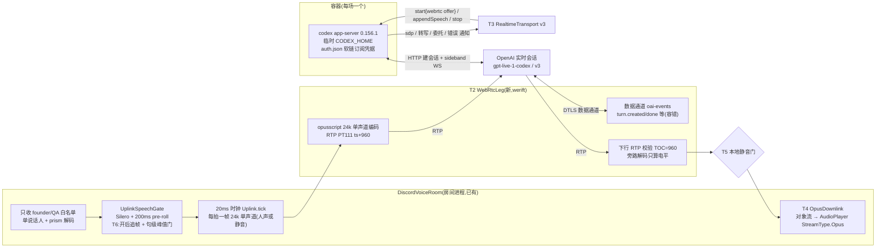
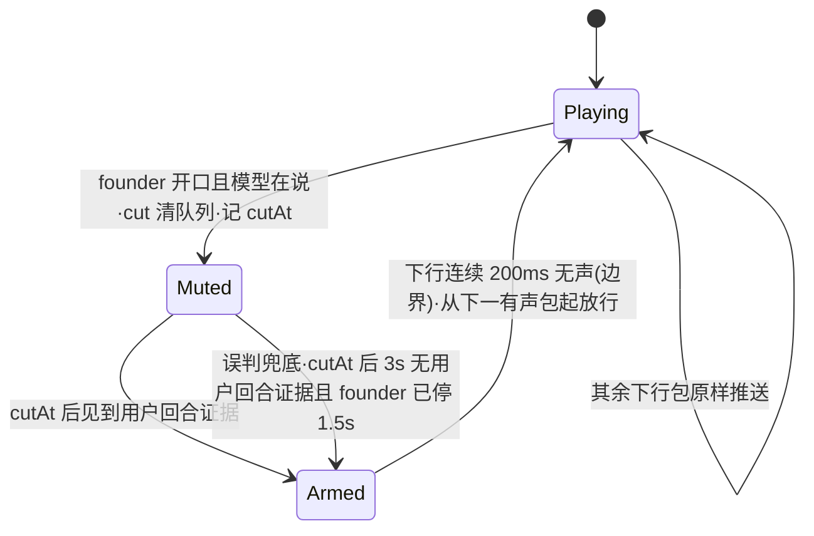
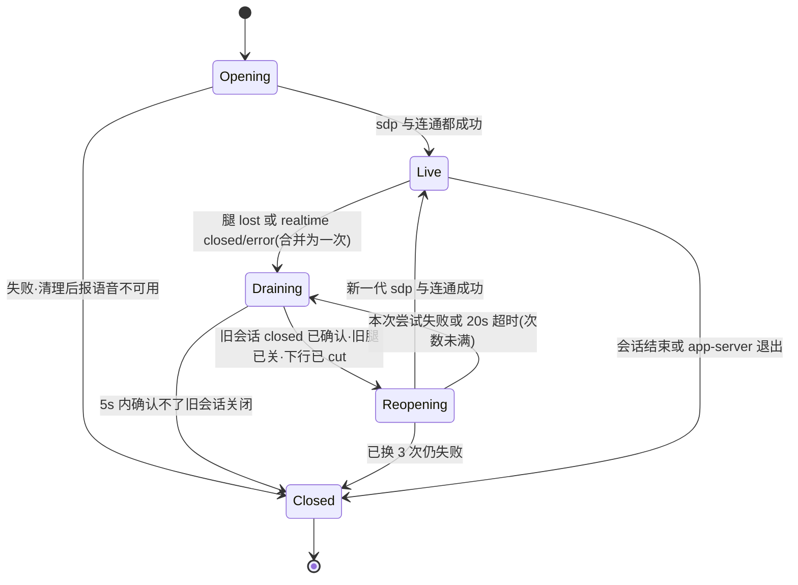

# FLY-2885 引擎 B 改走 WebRTC + 订阅 — 实施计划
Issue: FLY-2885 (https://linear.app/geoforge3d/issue/FLY-2885/语音b核心连接层-引擎-b-改走-webrtc-订阅替换-websocket-api-key房间进程-webrtc)
日期: 2026-09-25
基于: research.md

状态:v2(按设计评审 R1 修订),待重审。本文只设计,不含实现。

## 0. 边界与验收映射

| issue 验收 | 本计划落点 | 证明方式 |
|---|---|---|
| 1 无 API key 真人问答 | T1 容器认证改订阅、T10 配置/启动壳/QA 房不再要求或注入 key | QA-1:语音进程与 codex 子进程环境里都没有 `OPENAI_API_KEY`(`ps eww` 取证只记变量名是否存在),真人问答录音 + 转写 |
| 2 延迟 ≤ 2884 均值 +20% | T2/T3 WebRTC 直连、T4 下行直转、T6 门开后追帧 | QA-2:5 次「说完→开口」,**程序端 ≤1,182 ms、房内 ≤1,890 ms**(2884:985 / 1,575 ms) |
| 3 断网/杀连接自动恢复或干净结束 | T7 断线换代(关闭屏障 + 上限)、收尾、遗留目录清扫 | QA-3a 断 WebRTC 腿 → 自动恢复(恰好一个当前代);QA-3b 杀 app-server → 干净结束,查本场 root 已删、本场子进程已退、会话终态、租约已放 |
| 4 2799 三项回归全绿 | 回环排除(文字层,不动)、首帧即播(T4 新测试)、句首补音(T6 保持 pre-roll) | §6 列出的三项现有回归测试 + 新测试 + QA 听感 |
| 5 只跑相关测试;拆 529 房前 ask Lead | §6 测试清单只列改动文件的测试 | runner 纪律 |
| 本单 ① 插话 ≤1.0 s 停 | T5 本地截断 | QA-4:5 次有效插话,房内旧声音在开口后 ≤1.0 s 停 |
| 本单 ② 远处人声 | T6 句级峰值门 | QA-5:2884 远处人声素材 60 s 零误触发;founder 轻声仍放行 |

**不做**:大脑层(身份措辞、能力说明、只在被叫到时回答)、切生产默认引擎、多人混音、旧引擎 `openai-realtime`、升级舰队 Codex。

## 1. 架构

- 音频只走我们进程里的 WebRTC 腿;app-server 只做建会话、sideband(appendSpeech、委托)与通知。
- 上行保留 2799 整条 PCM 管线,**只把末端的 JSON-RPC appendAudio 换成「编码一次 Opus + RTP」**(research U1)。
- 下行不解码不重编码(2884 已证),只在本地插话时把负载换成预编码静音帧。

## 2. 稳定身份与配置

| 名称 | 值 / 来源 | 说明 |
|---|---|---|
| 后端 id | `codex-realtime`(不变) | 注册表、投影、证据都沿用 |
| 二进制 | `CODEX_VOICE_BINARY_VERSION = "codex-cli 0.156.1"`、sha256 `0196e89f…255a`(不变) | research R1:v3/WebRTC 代码与 0.157.0 逐字相同 |
| 会话参数 | 常量 `CODEX_VOICE_REALTIME_VERSION = "v3"`、`CODEX_VOICE_REALTIME_MODEL = "gpt-live-1-codex"`、`transport:{type:"webrtc",sdp}`、`outputModality:"audio"`、`clientManagedHandoffs:true`、`includeStartupContext:false` | 与 CLI `/voice` 同参;模型**显式传**,不靠默认 |
| 声线 | 每个 Lead 新字段 **`liveVoice`**,枚举 = v3 九个(`LIVE_V3_VOICES`,放 `teamlead/src/realtime-voices.ts`),缺省 `cove` | 旧引擎继续读 `realtimeVoice`;两个字段互不回退(Lead 裁定 §9①) |
| 凭据源 | 环境 `FLYWHEEL_VOICE_CODEX_AUTH_SOURCE`,缺省 `~/.codex/auth.json`(舰队凭据) | 只建软链,绝不拷贝、不 login/logout |
| 门参数 | `FLYWHEEL_VOICE_UPLINK_MIN_ONSET_DBFS`(缺省 −30,`off` 关闭)、`FLYWHEEL_VOICE_UPLINK_PREROLL_MS`(已有,200) | 峰值门只在 WebRTC 房生效 |
| STUN | `FLYWHEEL_VOICE_WEBRTC_STUN`(缺省 `stun:stun.l.google.com:19302`,空串 = 只用本机候选) | 与 2881/2884 实测同配置 |

## 3. 改动清单

### T1 容器与订阅认证(`codex/CodexVoiceContainer.ts`、`codex-home.ts`、`teamlead/src/codex-process.ts` 调用面)

1. `VOICE_CODEX_HOME_CONFIG` 改为 `forced_login_method = "chatgpt"`、`cli_auth_credentials_store = "file"`,其余特性开关不变(仍关 shell/unified_exec/memories/web 等)。
2. 建 home 时在 `config.toml` 之后创建 `auth.json` **软链** → 凭据源绝对路径。准入校验(改写 `assertVoiceCodexHome`):
   - 凭据源:绝对路径、`lstat` 是本用户拥有的**普通文件**(不是软链)、权限 `0600`;启动时 `realpath` 一次并钉住。
   - home 里的 `auth.json`:必须是软链、`readlink` 恰等于钉住的源路径;其他任何形态(普通文件、指向别处)⇒ `codex_profile_mismatch`。
   - 删除 root 用 `rm({recursive,force})`(按 `lstat` 不跟随软链);加测试:删后源文件仍在、字节不变。
3. 构造参数去掉 `openAiApiKey`;`spawnCodexAppServer` 不再传 `voiceProfile`(保留该能力给别的调用者,不删);子进程环境继续用 `positiveChildEnv` 白名单(本来就不含 key)。
4. 开会话前 `account/read`:`account.type` 必须是 `"chatgpt"`,否则 `codex_auth_rejected`;`classifyOpenError` 增加订阅侧文案匹配(`usage limit`、`rate limit`、HTTP 401/403 的 ChatGPT 形态),额度耗尽 → `codex_quota_exhausted`,**不切引擎、不换模型**。
5. `assertThreadReceipt` 不变(cliVersion 仍 0.156.1)。

### T2 WebRTC 腿(新 `codex/WebRtcLeg.ts`)

- 依赖:`werift@0.24.4`(新,精确版本)、`opusscript@0.0.8`(voice-codex 显式声明,版本同 voice-bridge)。
- `prepareOffer()`:一条 `sendrecv` 音频收发器(opus/48000/2,PT111,`minptime=10;useinbandfec=1`)+ `oai-events` 数据通道;等 ICE 收集完成(≤8 s)返回 offer SDP。
- `acceptAnswer(sdp)`:设远端描述;等 `connectionState=connected`(≤10 s,超时 = 本代失败)。
- 上行 `writePcm24(frame960Bytes)`:只收 960 字节(20 ms 24 kHz 单声道),`opusscript(24000,1,VOIP)` 编码,RTP 序号 +1、时间戳 +960;编码或写失败 → `onInputGap`。
- 下行:每个 RTP 负载先读 TOC 得样本数,**不是 960 就本代失败**(`downlink_non960`,2884 同规则);序号回退/重复丢弃计数;旁路 `opusscript(48000,2)` 解码只算 RMS(不回送)。回调 `onDownlink({payload, voiced, rms})`。
- 数据通道:JSON 解析失败忽略并计数;只转出 `session.started{expires_at}`、`turn.created/done{id,role,start_ms,end_ms,transcript}`,其余只计数。**任何字段缺失都不抛**。
- 状态回调:`connected`、`lost(reason)`(`failed`,或 `disconnected` 持续 >5 s,或数据通道关闭,或连通后 5 s 收不到任何下行包)。
- `close()` 幂等:关数据通道、关 PeerConnection、释放编解码器。

### T3 v3 协议适配(`codex/RealtimeTransport.ts`)

- `start()`:由调用方先给 offer;请求 `thread/realtime/start {..., version:"v3", model, voice, transport:{type:"webrtc",sdp}, prompt, initialItems}`。
  固定版本的顺序是先 `started` 后 `sdp`(`realtime_conversation.rs:1616-1637`,probe-2/3 相隔 <1 ms):收到 `started` 时**照旧校验 `version === "v3"`**(不符立即失败);媒体就绪条件 = `sdp` 到达 → `leg.acceptAnswer` → 连通,三者都成才 `active`。
  RPC 成功不算开成:期间收到 `thread/realtime/error`/`closed` 立即失败(research R2:声线不支持是 start 成功后的异步 error)。总超时沿用 60 s。
- `appendAudio(frame, generation, owner)`:改为同步写 WebRTC 腿;返回值语义保留(`sent`/`dropped:*`),`backpressure` 只在腿不可写时出现;owner 归属、`unsettledInput` 统计照旧。
- `thread/realtime/outputAudio/delta` 在 WebRTC 下**不应出现**:出现即 `fenced` + 证据(防重复出声)。
- 转写、`handoff_request`、`turn/started` 拦截、`item/started` 执行拦截:**不变**。
- **通知路由收口**(配合 T7):transport 不再各自在共享 RPC 上挂常驻监听;由 `CodexVoiceConversation` 持有唯一的 `notification/exit` 监听,只转发给**当前代** transport,退休的 transport 立刻解绑。`onError/onClosed` 统一带上当前代 generation。

### T4 下行直转、首帧即播、清队列(`discord-room.ts`、新 `audio/OpusDownlink.ts`、voice-bridge `discordWiring.ts`)

- voice-bridge `ResourceSource` 新增 `{kind:"opus-stream", stream}` → `createAudioResource(stream,{inputType: StreamType.Opus})`(加法,不改已有三种)。
- `DiscordVoiceRoom` 新选项 `downlink: "pcm-mouth" | "opus-passthrough"`(缺省 `pcm-mouth` = 今天行为,旧引擎不受影响)。`opus-passthrough` 时不起 `WaitingMouth`,改起 `OpusDownlink`:
  - 一个对象模式可读流 + 一个 `opus-stream` 资源常驻播放;`push(payload)` 在 RTP 回调里**同步**入流(首帧即播)。
  - **`cut()`(同步清队列)**:沿用 `WaitingMouth.dropQueuedOutput` 的做法(`audio.ts:377-392`)——新建流与资源交给播放器、销毁旧流,应用队列与已交给播放器但未取走的旧包一起作废,记 `downlink_flushed{droppedPackets}`。
    `DiscordVoiceRoom.cancelAllSpeech()` 在 opus 模式下调用 `downlink.cut()`;插话、换代(T7)、租约失效都调用它。
  - **租约**:每次 `push` 前调 `assertLease()`(迁移 `WaitingMouth.tick` 的检查,`audio.ts:395-402`),失败 ⇒ `cut()` + 停止 + `onError`。
  - 积压保护:流里 >25 包(500 ms)才裁到 3 包并记 `downlink_queue_trim`(2884 最深 7–10 包,正常不触发)。
  - 播放器进入 idle(连续 5 s 无数据)⇒ 重建资源继续播并记证据。
- `CodexVoiceBackend` 去掉按 assistant item 开 `openAudio` 的逐项输出;改为会话级 `downlink` 接口 `{push(payload, meta), cut(), mute(), unmute()}`。
  `response-audio` 事件不再发 PCM;`response-started/done` 改由**下行能量**判定:未静音时 300 ms 内有有声帧 = 正在说(WebRTC 腿旁路解码给出 `voiced`)。

### T5 本地插话(`codex/CodexVoiceBackend.ts`;`session.ts` 触发条件不改)

触发点沿用 `GenericVoiceSession`:founder 的音频离开门(门确认人声 ≥200 ms 的那一刻)且 `frontendResponseActive` ⇒ `frontend.cancelSpeech` ⇒ `CodexVoiceSession.interrupt()` 与 `room.cancelAllSpeech()`。
`interrupt()` 在 WebRTC 下**不再 `restart()`**,改为下面的静音状态机。

**核心不变量:只在下行「静音边界」解除静音。** 服务端判定插话时会截断旧回答(2884:10/10),截断之后到新回答开始之间必有一段静音(你还在说 + 模型起答时间,≥约 1 s)。
所以不用任何「事件到达时刻」当音频边界(R1-1:assistant `turn.created` 比该回答第一个有声包晚约 0.9 s,probe-2/3 实测 915 / 968 ms),而是看下行音频本身:

- Muted/Armed 期间每个下行包都换成预编码 20 ms Opus 静音帧继续推(播放器不断粮)。
- **用户回合证据**(逐次插话判定,不按「本代有没有事件」):数据通道 `turn.created{role:user}`,或 app-server `transcript/delta{role:user}`,取先到;只认 `cutAt` 之后到达的。
- **Armed → Playing 只看音频**:连续 10 个下行包(200 ms)`voiced=false` 后解除;解除后的第一个有声包就是新回答的句首,原样播放(不吞句首)。
- 误判兜底(咳一声、服务端没当回事):3 s 内无用户回合证据且门已关 1.5 s ⇒ 进入 Armed,**同样要等静音边界**才放 ⇒ 旧回答只会从句间停顿处接着播,不会从半个字处冒出来。
- 你持续说话超过 15 s:仍保持静音直到上述条件满足(期间服务端早已截断旧回答,下行本就无声),不设「到点强放」。
- 进入静音时:在途朗读按 `speech_interrupted` 结算(T5b)、发 `response-cancelled`、证据 `codex_barge_in_local_cut{cutAt}`;解除时证据带 `reason: user_turn|unconfirmed` 与静音时长。
- 取消:v3 没有客户端取消事件(research R6),**不发任何数据通道客户端事件**;旧回答由服务端判定插话时自己截断。
- 协议说明(Bridge,T8)加一句:被打断就放弃没说完的话、直接回应新问题,不要接着说完或重复。

### T5b 朗读回执在 v3 下的绑定(`codex/CodexProofSpeaker.ts`、`codex/CodexVoiceBackend.ts`)

今天的回执靠 assistant item id + 同 id 的 final 转写 + 逐 item 播放完成(`CodexProofSpeaker.ts:154-208`、`CodexVoiceBackend.ts:797-825`),v3 三样都没有(R1-3)。新契约:

| 步骤 | 依据 | 失败时 |
|---|---|---|
| 绑定 | 某块 `appendSpeech` RPC 成功之后,本代数据通道里**第一个** `turn.created{role:assistant}` 的 `turn.id`;若这之前先出现用户回合证据 ⇒ 不绑定 | `speech_preempted`,`transport:none` |
| 转写 | 同一 `turn.id` 的 `turn.done.transcript`,用现有 `isFiniteSpeechEquivalent` 判等价 | required 且不等价 ⇒ `speech_not_equivalent` |
| 已提交播放 | 同一 `turn.id` 的 `turn.done` 到达,且从该块 RPC 成功到 `turn.done` 之间 `OpusDownlink` 以**未静音**状态推出过 ≥1 个有声包,且期间没有 cut | 否则 `transport:none` |
| 中断 | 期间发生本地插话 cut、换代或会话关闭 | `speech_interrupted` / `generation_changed`,已推出有声包则 `transport:submitted` |
| 无法关联 | 超时(沿用 30 s)内没有可绑定的 `turn.created`,或 `turn.done` 缺失 | `speech_binding_unavailable`,`transport:none` ⇒ 前端判 `failed`(诚实:我们不知道它念没念) |

- 不用能量活动、时间邻近或 RPC 成功本身当「已播放」证据;多块朗读逐块按上表,前一块未结算不发下一块(现有串行不变)。
- 数据通道事件缺失时的退化结果是 `failed` 而不是假的 `unconfirmed`;QA 报绑定成功率与逐字率。

### T6 上行门:开后追帧 + 句级峰值门(`pipeline/UplinkSpeechGate.ts`、`pipeline/Uplink.ts`、`discord-room.ts`)

两个新选项,只在 `downlink:"opus-passthrough"` 的房间传入,缺省关闭 ⇒ 旧引擎字节级不变:

1. `releaseWhenOpen: true`:链打开后,延迟线里**已有判定**的帧立即放行(不再等满 24 帧);链关闭(连续 100 ms 非人声)后恢复按固定延迟,下一句句首仍有完整 200 ms pre-roll。
2. `minOnsetPeakDbfs: -30`:在链「本该打开」的那一刻,计算延迟线里全部帧(含 pre-roll)的最大帧电平;低于门限则**不打开**,这些帧按静音放行,继续判后续帧(变响再开)。记 `uplink_gate_rejected_quiet{peakDbfs}`。

`Uplink` 发送侧:WebRTC 模式下每拍若抖动队列 >3 帧,本拍多发一帧(每拍最多 2 帧;2884 同策略)。句首积压约 0.5 s 在开口后约 0.5 s 内追平。
仍保留:单说话人、白名单、`setMicOpen`、失败降级 `passthrough`。

### T7 断线换代、收尾、遗留目录(`codex/CodexVoiceContainer.ts` `CodexVoiceConversation`、`CodexVoiceBackend.ts`、`cli.ts` 启动段)

- **合并**:腿 `lost`、`thread/realtime/closed`(非本端发起)、`thread/realtime/error` 任一先到即进入 Draining,之后同类信号只记证据,不再触发第二次换代。
- **关闭屏障(R1-4)**:同一 thread 的 error/closed 通知不带 realtime 代号,只能靠顺序。Draining 必须**观察到旧会话的 `thread/realtime/closed`**(本来就已到,或 `thread/realtime/stop` 之后 5 s 内到)才允许开新代;屏障内到达的 closed/error 全部归旧代。
  确认不了(stop 超时且无 closed)⇒ 不复用这个 thread,**干净结束本场**(`realtime_reconnect_unconfirmed`)。
- **尝试归属**:每次 Reopening 持有一个 `AbortController`;新腿从创建起归该尝试,超时/关闭 ⇒ abort ⇒ 关腿;若新 `realtime/start` 已发出则按上面的屏障先 stop 再决定下一次,绝不留下半开的腿或会话。
- 上限:每场最多 3 次换代,退避 0 / 2 / 5 s,每次 20 s;用尽 ⇒ `realtime_reconnect_exhausted`,走已有 `onClosed → finish(failed)`。
- 换代期间上行帧丢弃并 `markInputGap`(这段话归属 unknown,不授权委托);下行先 `cut()` 再静默;在途朗读按 `generation_changed` 结算。
  首次掉线 thread 发一行「📻 语音连接断了,正在重连」,恢复发「📻 已重连」。
- 新一代用**同一份上下文快照**(不重新拉取);实时会话里之前的对话历史不回放(§8)。
- app-server 退出 ⇒ 不重连,直接结束(已有行为)。
- 收尾顺序(幂等):停止写上行 → `downlink.cut()` → `thread/realtime/stop`(等 closed,5 s)→ 腿 `close()` → `process.stop()`(已有 TERM→KILL 与退出确认)→ 删 root → 证据 `codex_voice_container_closed`。
- **遗留目录(R1-5,已简化)**:本单实测 app-server 在父进程被 `SIGKILL` 后 1 s 内因 stdin 关闭自行退出(`evidence/orphan-parent-kill.*`),WebRTC 腿在我们进程里随之消失 ⇒ **不会有孤儿进程,只可能遗留临时目录**。
  守护进程在拿到 `voice.lock`(`cli.ts:177-207`)**之后、接受任何会话之前**,扫 `codex-containers/container-*`:此时本进程还没开过容器,且锁保证没有别的守护进程,所以这些目录都属已死的旧进程。
  删除前再查一次:`lsof -d cwd -Fn` 若有任何进程的 cwd 落在该目录下 ⇒ 不删、记 `codex_voice_stale_root_busy`(不杀任何进程);否则 `rm`(按 lstat 不跟随软链)并记 `codex_voice_stale_root_removed`。不需要 PID 接口、owner 文件或新的进程监管。

### T9 声线字段(teamlead `ProjectConfig.ts`、`realtime-voices.ts`、`bridge/voice-session-services.ts`;voice-codex `projection.ts`、`bridge-client.ts`、`cli.ts`)

- `leads[].liveVoice?: LiveV3Voice`,校验失败的错误信息指明合法 9 个值;Bridge 投影新增 `liveVoice: lead.liveVoice ?? "cove"`。
- **旧投影兼容(R1-6)**:voice-codex `parseVoiceProjection` 把 `liveVoice` 当**可选**字段:缺失合法(已存盘的投影、恢复中的会话都没有它);出现则必须是 9 个值之一,否则拒绝。
  缺省 `cove` 只在**引擎 B 消费处**(`cli.ts` 构造容器时)补上;旧引擎不读这个字段;不回退到 `realtimeVoice`。
- 不改任何现网 `projects.json`(逐 Lead 分配由 Lead 并入 FLY-2866 试听后写入,§9①)。

### T10 配置、启动壳、QA 房(`config.ts`、`scripts/flywheel-voice-wrapper.sh`、`scripts/qa/fly2655-voice-room.mjs`)

- `loadVoiceDaemonConfig`:只有 `backendId === "openai-realtime"` 才要求 `OPENAI_API_KEY`;`codex-realtime` 时 `realtimeApiKey` 为 `null`,并从本进程 `process.env` 删除 `OPENAI_API_KEY`/`CODEX_API_KEY`(第二道防线)。
- 启动壳(R1-7):`.env` 仍整体加载(共享文件,旧引擎要用);**在 exec Node 之前**,若 `FLYWHEEL_VOICE_BACKEND=codex-realtime` 则 `unset OPENAI_API_KEY CODEX_API_KEY`,并改为检查凭据源文件存在且是普通文件(不读内容);其他后端照旧检查并传递 key。
- QA 房启动器:`backendId === "codex-realtime"` 时不读 `~/.flywheel/.env` 的 key、不注入 `OPENAI_API_KEY`,改注入 `FLYWHEEL_VOICE_CODEX_AUTH_SOURCE`。
- 保证的准确说法:**codex 路径不要求、不使用 API key,也不把它传给语音进程及其 Codex 子进程**(共享 `.env` 文件里可以仍有这把 key,供旧引擎用)。

## 4. 失败处置

| 情况 | 行为 | 用户看到 |
|---|---|---|
| 凭据源缺失/形态不对 | 容器拒绝打开 `codex_profile_mismatch` | 📻 语音不可用:Codex 容器启动失败 |
| `account/read` 非 chatgpt / 401 | `codex_auth_rejected` | 📻 语音不可用:Codex 认证失败 |
| 额度耗尽 | `codex_quota_exhausted`,不换引擎 | 📻 语音不可用:Codex 额度已用完 |
| 声线不在 v3 表 | 投影/配置校验先拒;漏网时 `thread/realtime/error` ⇒ 开会话失败 | 语音不可用(原因写证据) |
| 上下文超限 | Bridge `context_too_large` | 语音不可用(同今天) |
| 下行非 960 样本包 | 本代失败 → 换代 | 断续一下或结束 |
| 断线 | T7 换代,最多 3 次 | 状态行 |
| app-server 退出 | 结束本场,清理 | 已有结束提示 |

## 5. 回滚与负向守卫

- 生产默认引擎是旧引擎(`FLYWHEEL_VOICE_BACKEND` 未设),本单只影响显式选 `codex-realtime` 的房(今天只有 QA)。回滚 = revert PR。
- 负向测试:① codex 路径不要求、不使用 `OPENAI_API_KEY`,也不传给语音进程与 Codex 子进程(wrapper 捕获 exec 环境的测试 + config 单测 + 容器 env 单测);② 不拷贝凭据(home 里 `auth.json` 必须是软链);③ 旧引擎 `openai-realtime` 仍要求 key、房间缺省 `pcm-mouth`、门缺省行为字节不变(已有测试全绿);④ 不静默换声线/模型/引擎;⑤ 上下文不截断。

## 6. 测试(只跑改动文件直接相关的)

| 块 | 测试文件 |
|---|---|
| T1 | `voice-codex/src/__tests__/codex-container.test.ts`、`codex-home.test.ts`(软链准入、删 root 不伤源、account 非 chatgpt 拒绝、env 无 key) |
| T2 | 新 `__tests__/webrtc-leg.test.ts`(werift 两个本地 PeerConnection 回环:编码上行、非 960 拒、数据通道容错、lost 判定) |
| T3 | `__tests__/codex-transport.test.ts`、`realtime-transport.test.ts`(先 started 后 sdp 的顺序、started 版本不符即失败、异步 error 失败、outputAudio 出现即 fence、handoff/turn 拦截不变、退休 transport 收不到通知) |
| T4 | 新 `__tests__/opus-downlink.test.ts`(首包同步入流;积压 10/25 包且播放器已取走部分时 `cut()` 后消费不到旧包、随后新首包正常;租约失效停止;idle 重建);`discord-room.test.ts`(缺省 pcm-mouth 不变、opus 模式 `cancelAllSpeech` 走 cut);voice-bridge `discordWiring` 资源工厂单测 |
| T5 | `__tests__/codex-room.test.ts`(新回答事件比音频晚 ~1 s 时句首完整;当前轮缺数据通道事件改用 app-server 用户转写;用户转写晚于 2 s;founder 连说 >15 s;误判只在静音边界恢复、不从半个字处冒;不再 restart) |
| T5b | `__tests__/codex-speak.test.ts`(单块/多块正常绑定、插话中断、先出现用户回合、无 turn 事件 ⇒ `speech_binding_unavailable`、换代 ⇒ `generation_changed`) |
| T6 | `pipeline/UplinkSpeechGate.test.ts`、`Uplink.test.ts`、`UplinkSpeechGate.preroll.smoke.test.ts`(开后追帧、峰值门;用 2884 s4 远处人声与 s7 founder 帧电平时间线做夹具;旧默认不变) |
| T7 | `__tests__/codex-container.test.ts`(合并多重故障为一次换代;stop 超时无 closed ⇒ 干净结束;屏障内迟到 closed/error 归旧代;ICE/answer 等待中 abort 关腿;上限与退避;收尾顺序;启动清扫 busy/removed 两分支) |
| T8 | teamlead `src/__tests__/voice-session-context.test.ts`(Raya/Honey 规模夹具:拆分确定性、两项预算、超限报错不截断) |
| T9 | teamlead `ProjectConfig` 校验测试、`voice-session-services` 投影测试;voice-codex `projection.test.ts`、`session-state.test.ts`、`recovery.test.ts`(缺 `liveVoice` 的旧投影照常解析与恢复,非法值拒绝) |
| T10 | `config.test.ts`、`scripts/__tests__/fly2655-voice-room.test.mjs`、wrapper 测试(codex 分支 exec 环境无 key,旧引擎分支照旧) |
| 2799 回归 | 回环按来源排除:`voice-codex/src/__tests__/codex-handoff-transcript.test.ts`、teamlead `src/bridge/__tests__/voice-session-poller.test.ts`;句首补音:`UplinkSpeechGate.preroll.smoke.test.ts`、`discord-room.test.ts` pre-roll 用例;首帧即播:新 `opus-downlink.test.ts` 首包用例 |

### QA(529 测试语音房;founder 或替身 bot,沿用 2884 说话人夹具)

- QA-1:启动器不注入 key;`ps eww` 记录两进程是否含 `OPENAI_API_KEY`(只记是/否);替身 5 问 + founder 至少 3 问。
- QA-2:5 次短问,两口径延迟(同 2884 定义)。
- QA-3a(恢复):QA 专用故障开关(`FLYWHEEL_VOICE_QA_FAULTS=1` 时 `SIGUSR2` 关闭当前 WebRTC 腿;生产启动壳从不设置)。判据:证据里恰好一次 Draining→Reopening→Live、当前代号 +1、旧腿已关、会话租约仍有效、紧接着能继续问答;本阶段**不**要求目录为空或会话终态。
- QA-3b(干净结束):对**本场**记录的 app-server 子进程 `kill -9`。判据:本场会话在 Bridge 为终态、本场租约已放、本场 container root 已删、该子进程已退出;守护进程自己的 `voice.lock` 合法保留;进程/目录检查只针对本场 root 与本场子进程,不用全局 `pgrep`。
- QA-3c(收尾):获 Lead 同意结束 QA-3a 那一场后,同样按 QA-3b 判据检查。
- QA-4:插话 5 次有效(同 2884 规则),房内旧声音停止时刻 ≤1.0 s;记「先说完旧的」次数(大脑层指标,只报告)。
- QA-5:播放 2884 远处人声 60 s(零误触发);风扇/键盘各 60 s;founder 轻声 3 句全部被听到。
- QA-6:v3 九个声线各开 5 s 会话说一句,记能否出声(交给 FLY-2866 试听分配用,每个约 5 s 音频额度)。
- 拆房前 ask Lead。

## 7. 实施顺序(chunk)

T10 → T1 → T2 → T3 → T8 → T9 → T4 → T6 → T5 → T5b → T7 → 单测 → QA。每块一个 commit,`progress` 游标随块更新。

## 8. 已知边界(诚实)

- v3 朗读不保证逐字(research R4):Lead 回复朗读在「已推出有声包但转写不等价」时回执为 `unconfirmed`(T5b),这是模型行为;QA 报逐字率与绑定成功率。
- 插话「停」是本地的;服务端仍约 1.2 s 才判定。模型之后是否接着说旧内容归大脑层(本单只加一句协议说明并量)。
- 峰值门余量约 4 dB,基于合成远处人声;真人麦与 Krisp 下需 QA 复核,可配置/可关。
- 数据通道事件不在 Codex 协议面上。静音解除以下行音频为准、事件只作「用户回合证据」之一(另一来源是 app-server 用户转写);朗读回执绑定依赖它,缺失时回执诚实地变 `failed`(`speech_binding_unavailable`)。
- 换代会丢失实时会话里的对话历史(新会话只带开场上下文);本单不回放历史。

## 9. Lead 裁定记录

- 2026-09-25 问题 `2cb14675`(Lead 已回复):
  ① **同意** 新增 `liveVoice`(9 个 v3 声线枚举,缺省 `cove`),引擎 B 读它,旧引擎继续读 `realtimeVoice`;本单全部先用 `cove`。**试听分配不另开单**,由 Lead 把 FLY-2866 改成试听这 9 个声线。
  ② **同意** 身份/边界/状态/协议留在 prompt(预算 15,500 o200k),记忆放 v3 `initialItems`(developer 角色),都放不下才 `context_too_large`;两个上限与实测数据写入本计划(research R3,§3 T8)。

## 10. 修订轨迹

- v1(2026-09-25):初稿。
- v2(2026-09-25):设计评审 R1(4 HIGH / 4 MEDIUM / 1 LOW)全部接受:
  1. 静音解除改为「用户回合证据 + 下行 200 ms 静音边界」,不再以迟到约 0.9 s 的 `turn.created` 当音频边界;误判也只在静音边界恢复(T5)。
  2. 新增 `OpusDownlink.cut()` 同步清应用队列与播放器资源,接入 `cancelAllSpeech`、换代、租约失效(T4)。
  3. 新增 T5b:v3 朗读回执绑定契约(数据通道 turn id + 未静音有声包 + 无 cut),无法关联时诚实返回 `failed`。
  4. T7 加关闭屏障(观察到旧会话 closed 才开新代,确认不了就结束)、故障合并、尝试 abort;T3 通知路由收口到当前代。
  5. 实测 app-server 在父进程被杀后 1 s 内自退 ⇒ 去掉 owner/PID 方案,改为拿锁后清扫遗留目录 + `lsof` cwd 复核(T7)。
  6. `liveVoice` 在投影里可选,缺省只在引擎 B 消费处补,旧投影恢复不受影响(T9)。
  7. 启动壳在 exec 前 unset key,保证措辞收窄为「不要求、不使用、不传给」(T10、§5)。
  8. QA-3 拆成恢复/干净结束/收尾三段,检查绑定本场 root 与子进程;补 2799 回环排除回归测试、修正 T8 测试路径(§6)。
  9. 更正 v3 顺序为先 started 后 sdp,started 时仍校验版本(T3)。
