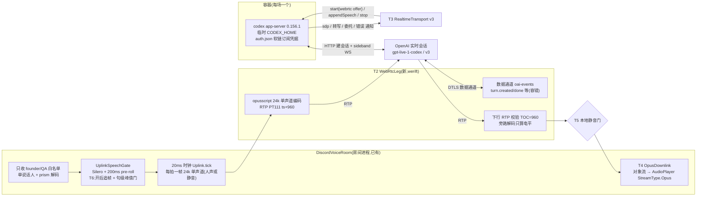
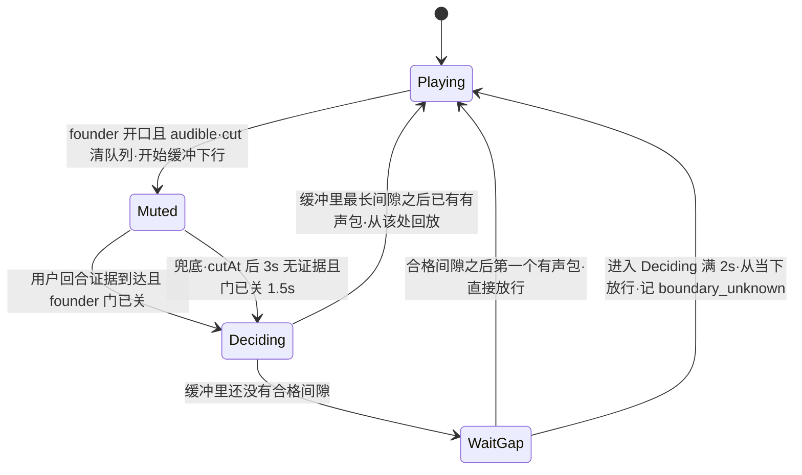
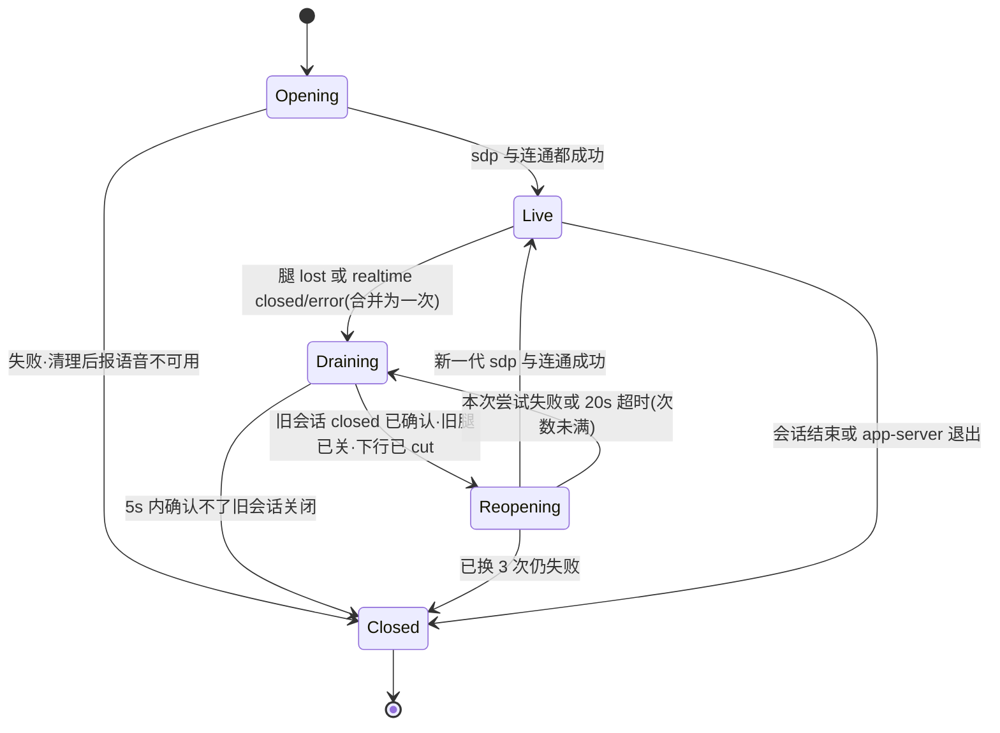

# FLY-2885 引擎 B 改走 WebRTC + 订阅 — 实施计划
Issue: FLY-2885 (https://linear.app/geoforge3d/issue/FLY-2885/语音b核心连接层-引擎-b-改走-webrtc-订阅替换-websocket-api-key房间进程-webrtc)
日期: 2026-09-25
基于: research.md

状态:v5(按设计评审 R1–R4 与 Lead 指令 0f475441 / f845f720 修订),待 T5c 定向复核。本文只设计,不含实现。

## 0. 边界与验收映射

| issue 验收 | 本计划落点 | 证明方式 |
|---|---|---|
| 1 无 API key 真人问答 | T1 容器认证改订阅、T10 配置/启动壳/QA 房不再要求或注入 key | QA-1:语音进程与 codex 子进程环境里都没有 `OPENAI_API_KEY`(`ps eww` 取证只记变量名是否存在),真人问答录音 + 转写 |
| 2 延迟 ≤ 2884 均值 +20% | T2/T3 WebRTC 直连、T4 下行直转、T6 门开后追帧 | QA-2:5 次「说完→开口」,**程序端 ≤1,182 ms、房内 ≤1,890 ms**(2884:985 / 1,575 ms) |
| 3 断网/杀连接自动恢复或干净结束 | T7 断线换代(关闭屏障 + 上限)、收尾、遗留目录清扫 | QA-3a 断 WebRTC 腿 → 自动恢复(恰好一个当前代);QA-3b 杀 app-server → 干净结束,查本场 root 已删、本场子进程已退、会话终态、租约已放 |
| 4 2799 三项回归全绿 | 回环排除(文字层,不动)、首帧即播(T4 新测试)、句首补音(T6 保持 pre-roll) | §6 列出的三项现有回归测试 + 新测试 + QA 听感 |
| 5 只跑相关测试;拆 529 房前 ask Lead | §6 测试清单只列改动文件的测试 | runner 纪律 |
| 本单 ① 插话 ≤1.0 s 停 | T5 本地截断 + 有界回放 | QA-4:≥10 次有效插话,旧声音 ≤1.0 s 停 10/10,新回答句首完整 ≥8/10,`boundary_unknown`/`head_lost` 各 ≤1 |
| 本单 ② 远处人声 | T6 句级峰值门 | QA-5:2884 远处人声素材 60 s 零误触发;founder 轻声仍放行 |
| Lead 指令 `0f475441`:朗读自编内容 / 无声 | T5c 越界检测截断 + 审计、无声重试 | QA-7 负向用例 |

**不做**:大脑层(身份措辞、能力说明、只在被叫到时回答)、切生产默认引擎、多人混音、旧引擎 `openai-realtime`、升级舰队 Codex。

## 1. 架构

- 音频只走我们进程里的 WebRTC 腿;app-server 只做建会话、sideband(appendSpeech、委托)与通知。
- 上行保留 2799 整条 PCM 管线,**只把末端的 JSON-RPC appendAudio 换成「编码一次 Opus + RTP」**(research U1)。
- 下行不解码不重编码(2884 已证),只在本地插话时把负载换成预编码静音帧。

## 2. 稳定身份与配置

| 名称 | 值 / 来源 | 说明 |
|---|---|---|
| 后端 id | `codex-realtime`(不变) | 注册表、投影、证据都沿用 |
| 二进制 | `CODEX_VOICE_BINARY_VERSION = "codex-cli 0.156.1"`、sha256 `0196e89f…255a`(不变) | research R1:v3/WebRTC 代码与 0.157.0 逐字相同 |
| 会话参数 | 常量 `CODEX_VOICE_REALTIME_VERSION = "v3"`、`CODEX_VOICE_REALTIME_MODEL = "gpt-live-1-codex"`、`transport:{type:"webrtc",sdp}`、`outputModality:"audio"`、`clientManagedHandoffs:true`、`includeStartupContext:false` | 与 CLI `/voice` 同参;模型**显式传**,不靠默认 |
| 声线 | 每个 Lead 新字段 **`liveVoice`**,枚举 = v3 九个(`LIVE_V3_VOICES`,放 `teamlead/src/realtime-voices.ts`),缺省 `cove` | 旧引擎继续读 `realtimeVoice`;两个字段互不回退(Lead 裁定 §9①) |
| 凭据源 | 环境 `FLYWHEEL_VOICE_CODEX_AUTH_SOURCE`,缺省 `~/.codex/auth.json`(舰队凭据) | 只建软链,绝不拷贝、不 login/logout |
| 门参数 | `FLYWHEEL_VOICE_UPLINK_MIN_ONSET_DBFS`(缺省 −30,`off` 关闭)、`FLYWHEEL_VOICE_UPLINK_PREROLL_MS`(已有,200) | 峰值门只在 WebRTC 房生效 |
| STUN | `FLYWHEEL_VOICE_WEBRTC_STUN`(缺省 `stun:stun.l.google.com:19302`,空串 = 只用本机候选) | 与 2881/2884 实测同配置 |

## 3. 改动清单

### T1 容器与订阅认证(`codex/CodexVoiceContainer.ts`、`codex-home.ts`、`teamlead/src/codex-process.ts` 调用面)

1. `VOICE_CODEX_HOME_CONFIG` 改为 `forced_login_method = "chatgpt"`、`cli_auth_credentials_store = "file"`,其余特性开关不变(仍关 shell/unified_exec/memories/web 等)。
2. 建 home 时在 `config.toml` 之后创建 `auth.json` **软链** → 凭据源绝对路径。准入校验(改写 `assertVoiceCodexHome`):
   - 凭据源:绝对路径、`lstat` 是本用户拥有的**普通文件**(不是软链)、权限 `0600`;启动时 `realpath` 一次并钉住。
   - home 里的 `auth.json`:必须是软链、`readlink` 恰等于钉住的源路径;其他任何形态(普通文件、指向别处)⇒ `codex_profile_mismatch`。
   - 删除 root 用 `rm({recursive,force})`(按 `lstat` 不跟随软链);加测试:删后源文件仍在、字节不变。
3. 构造参数去掉 `openAiApiKey`;`spawnCodexAppServer` 不再传 `voiceProfile`(保留该能力给别的调用者,不删);子进程环境继续用 `positiveChildEnv` 白名单(本来就不含 key)。
4. 开会话前 `account/read`:`account.type` 必须是 `"chatgpt"`,否则 `codex_auth_rejected`;`classifyOpenError` 增加订阅侧文案匹配(`usage limit`、`rate limit`、HTTP 401/403 的 ChatGPT 形态),额度耗尽 → `codex_quota_exhausted`,**不切引擎、不换模型**。
5. `assertThreadReceipt` 不变(cliVersion 仍 0.156.1)。

### T2 WebRTC 腿(新 `codex/WebRtcLeg.ts`)

- 依赖:`werift@0.24.4`(新,精确版本)、`opusscript@0.0.8`(voice-codex 显式声明,版本同 voice-bridge)。
- `prepareOffer()`:一条 `sendrecv` 音频收发器(opus/48000/2,PT111,`minptime=10;useinbandfec=1`)+ `oai-events` 数据通道;等 ICE 收集完成(≤8 s)返回 offer SDP。
- `acceptAnswer(sdp)`:设远端描述;等 `connectionState=connected`(≤10 s,超时 = 本代失败)。
- 上行 `writePcm24(frame960Bytes)`:只收 960 字节(20 ms 24 kHz 单声道),`opusscript(24000,1,VOIP)` 编码,RTP 序号 +1、时间戳 +960;编码或写失败 → `onInputGap`。
- 下行:每个 RTP 负载先读 TOC 得样本数,**不是 960 就本代失败**(`downlink_non960`,2884 同规则);序号回退/重复丢弃计数;旁路 `opusscript(48000,2)` 解码只算 RMS(不回送)。回调 `onDownlink({payload, voiced, rms})`。
- 数据通道:JSON 解析失败忽略并计数;只转出 `session.started{expires_at}`、`turn.created/done{id,role,start_ms,end_ms,transcript}`,其余只计数。**任何字段缺失都不抛**。
- 状态回调:`connected`、`lost(reason)`(`failed`,或 `disconnected` 持续 >5 s,或数据通道关闭,或连通后 5 s 收不到任何下行包)。
- `close()` 幂等:关数据通道、关 PeerConnection、释放编解码器。

### T3 v3 协议适配(`codex/RealtimeTransport.ts`)

- `start()`:由调用方先给 offer;请求 `thread/realtime/start {..., version:"v3", model, voice, transport:{type:"webrtc",sdp}, prompt, initialItems}`。
  固定版本的顺序是先 `started` 后 `sdp`(`realtime_conversation.rs:1616-1637`,probe-2/3 相隔 <1 ms):收到 `started` 时**照旧校验 `version === "v3"`**(不符立即失败);媒体就绪条件 = `sdp` 到达 → `leg.acceptAnswer` → 连通,三者都成才 `active`。
  RPC 成功不算开成:期间收到 `thread/realtime/error`/`closed` 立即失败(research R2:声线不支持是 start 成功后的异步 error)。总超时沿用 60 s。
- `appendAudio(frame, generation, owner)`:改为同步写 WebRTC 腿;返回值语义保留(`sent`/`dropped:*`),`backpressure` 只在腿不可写时出现;owner 归属、`unsettledInput` 统计照旧。
- `thread/realtime/outputAudio/delta` 在 WebRTC 下**不应出现**:出现即 `fenced` + 证据(防重复出声)。
- 转写、`handoff_request`、`turn/started` 拦截、`item/started` 执行拦截:**不变**。
- **通知路由收口**(配合 T7):transport 不再各自在共享 RPC 上挂常驻监听;由 `CodexVoiceConversation` 持有唯一的 `notification/exit` 监听,只转发给**当前代** transport,退休的 transport 立刻解绑。`onError/onClosed` 统一带上当前代 generation。

### T4 下行直转、首帧即播、清队列(`discord-room.ts`、新 `audio/OpusDownlink.ts`、voice-bridge `discordWiring.ts`)

- voice-bridge `ResourceSource` 新增 `{kind:"opus-stream", stream}` → `createAudioResource(stream,{inputType: StreamType.Opus})`(加法,不改已有三种)。
- `DiscordVoiceRoom` 新选项 `downlink: "pcm-mouth" | "opus-passthrough"`(缺省 `pcm-mouth` = 今天行为,旧引擎不受影响)。`opus-passthrough` 时不起 `WaitingMouth`,改起 `OpusDownlink`:
  - 一个对象模式可读流 + 一个 `opus-stream` 资源常驻播放;`push(payload)` 在 RTP 回调里**同步**入流(首帧即播)。
  - **`cut()`(同步清队列)**:沿用 `WaitingMouth.dropQueuedOutput` 的做法(`audio.ts:377-392`)——新建流与资源交给播放器、销毁旧流,应用队列与已交给播放器但未取走的旧包一起作废,记 `downlink_flushed{droppedPackets}`。
    `DiscordVoiceRoom.cancelAllSpeech()` 在 opus 模式下调用 `downlink.cut()`;插话、换代(T7)、租约失效都调用它。
  - **租约**:每次 `push` 前调 `assertLease()`(迁移 `WaitingMouth.tick` 的检查,`audio.ts:395-402`),失败 ⇒ `cut()` + 停止 + `onError`。
  - 积压保护:流里 >25 包(500 ms)才裁到 3 包并记 `downlink_queue_trim`(2884 最深 7–10 包,正常不触发)。
  - 播放器进入 idle(连续 5 s 无数据)⇒ 重建资源继续播并记证据。
- `CodexVoiceBackend` 去掉按 assistant item 开 `openAudio` 的逐项输出;改为会话级 `downlink` 接口 `{push(payload, meta), cut(), mute(), unmute()}`。
  `response-audio` 事件不再发 PCM;`response-started/done` 改由 `OpusDownlink.audible()` 判定(未消费的有声包,或 300 ms 内播放器取走过有声包;定义见 T5,`voiced` 由 WebRTC 腿旁路解码给出)。

### T5 本地插话(`codex/CodexVoiceBackend.ts` + `audio/OpusDownlink.ts`;`session.ts` 触发条件不改)

触发点沿用 `GenericVoiceSession`:founder 的音频离开门(门确认人声 ≥200 ms 的那一刻)且 `frontendResponseActive` ⇒ `frontend.cancelSpeech` ⇒ `CodexVoiceSession.interrupt()` 与 `room.cancelAllSpeech()`。
`interrupt()` 在 WebRTC 下**不再 `restart()`**,改为下面的「静音 + 有界回放」状态机。

**「还听得到」的定义(R3-2)**:`OpusDownlink.audible()` = 播放器里还有**未消费的有声包**(沿用 `audio.ts:363-374` 的消费进度思路:已推出包数 − 播放器已取走包数,逐包记 `voiced`),或最近 300 ms 内播放器取走过有声包。
`response-started/done`(⇒ `frontendResponseActive`)与 T5b 空闲准入都以 `audible()` 为准,**不再只看网络下行最近 300 ms**;因此回放积压还在播时 founder 再开口,一定会走到 cut。

**事实前提(设计依据,不是协议保证)**:① 事件比音频晚且不定:assistant `turn.created` 比首个有声包晚 915/968 ms(probe-2/3);2884 s3 里用户 delta 到达后旧回答音频还持续了约 0.9 s(R3-1 复算);`turn.start_ms` 与有声起点偏差 770–930 ms 且不恒定。② 服务端判定插话后截断旧回答(2884:10/10)。③ 新回答只能在 founder 说完、服务端判停、模型起答之后出声。
⇒ 新旧回答的分界**只能估计**。本节只承诺:旧声音在本地 cut 后立即停;新回答句首「尽量」保住,并且**任何情况下都在有限时间内恢复播放**,每次结果可观测。

- **Muted**:下行包换成预编码静音帧推给播放器(不断粮);原始包连同 `voiced` 进回放缓冲(环形 75 包 = 1.5 s)。
- **用户回合证据**:数据通道 `turn.created{role:user}` 或 app-server `transcript/delta{role:user}`,取先到;只认 `cutAt` 之后到达的。进入 Deciding 还要求 founder 门已关。
- **合格间隙**:cut 之后连续 `voiced=false` ≥240 ms(12 包)的一段。阈值按 2884 s3 真实切换处(15 包、19 包)取在其下;有多段取最长,并列取最后。这只是估计:回答内的长停顿、或切换处恰好很短,都可能判错——结果进证据由 QA 统计,不宣称句首一定完整。
- **Deciding**:最长合格间隙之后缓冲里已有有声包 ⇒ 从该间隙结束处回放全部后续缓冲包再接实时包(额外延迟 = 当前 − 间隙结束,≤1.5 s)。该间隙已被挤出缓冲 ⇒ 从当下实时放行,记 `head_lost`。
- **WaitGap**:还没有合格间隙 ⇒ 继续静音,出现合格间隙后第一个有声包直接放行(零额外延迟)。**期限 2 s**(自进入 Deciding 起):到期仍无合格间隙 ⇒ 从当下实时放行,记 `boundary_unknown`(可能丢了新回答句首,也可能放出一小段旧回答尾巴)。
- 所有路径都有终点:founder 门不关就保持 Muted(她在说话时不该放声);门关后最长 3 s(兜底)+ 2 s(期限)必然恢复播放。
- 回放积压在后续停顿里消化:队列 >3 包时收到的 `voiced=false` 包直接丢弃(只丢静音);回放包不受 T4「>25 包裁剪」规则影响。
- 解除时证据 `codex_barge_in_resumed{trigger: user_turn|unconfirmed, boundary: replay|live|head_lost|boundary_unknown, gapMs, replayMs, mutedMs}`;QA-4 用它统计,并检查插话后的新回答是否完整、何时开始可听。
- 进入静音时:在途朗读按 T5b 结算、发 `response-cancelled`、证据 `codex_barge_in_local_cut{cutAt}`。
- 取消:v3 没有客户端取消事件(research R6),**不发任何数据通道客户端事件**;旧回答由服务端判定插话时自己截断。
- 协议说明(Bridge,T8)加一句:被打断就放弃没说完的话、直接回应新问题,不要接着说完或重复。

### T5b 朗读回执在 v3 下的准入与绑定(`codex/CodexProofSpeaker.ts`、`codex/CodexVoiceBackend.ts`)

今天的回执靠 assistant item id + 同 id 的 final 转写 + 逐 item 播放完成(`CodexProofSpeaker.ts:154-208`、`CodexVoiceBackend.ts:797-825`),v3 三样都没有;`appendSpeech` RPC 成功只表示请求入队(`C156 turn_processor.rs:1339-1361`),不带 turn id。先**准入**再绑定:

**待答用户轮次(R3-3)**:每条用户回合证据(见 T5)都开一个「待答」标记,记下证据到达时刻 `u`。只有满足下面条件的 assistant 回合 A 才能清除它:A 的 `turn.created` **在 `u` 之后到达**,且 A 的 `turn.done` 已到。在 `u` 之前就已 created 的 assistant 回合(旧回答)即使其 done 晚于 `u` 到达,也**不能**清除(2884 s3 实测:旧回答的 done 晚于新用户 delta 到达)。数据通道没有 assistant 回合事件时无法证明 ⇒ 待答标记一直保留。

1. **空闲准入**(每块发送前,全部满足才发):① 没有未结束的 assistant 回合(created 而无同 id done);② `OpusDownlink.audible()` 为假且已持续 600 ms;③ founder 门关着,且**没有待答用户轮次**;④ 不在 Muted/Deciding/WaitGap。不满足就等,最多 10 s ⇒ 仍不满足 ⇒ `rejected{reason:"busy_conversation"}`、`transport:none`(前端 `failed`,走现有「没能念出」路径)。
2. **绑定**:准入并发出后,本代第一个 `turn.created{role:assistant}` 的 `turn.id`;绑定前出现新的用户回合证据 ⇒ `speech_preempted`。准入已排除「有待答用户轮次」与「有在途 assistant 回合」,首个新回合才被认为由本次朗读引起;这仍是基于事件完整性的推断,数据通道缺事件时走第 6 条的诚实失败。
3. **转写**:同一 `turn.id` 的 `turn.done.transcript`,用现有 `isFiniteSpeechEquivalent` 判等价(越界见 T5c)。
4. **已提交播放**:发出到同 id `turn.done` 之间,播放器以未静音状态**消费**过 ≥1 个有声包,且期间没有 cut、没有 T4 裁剪、没有静音丢包。发生裁剪 ⇒ `failed{reason:"playback_trimmed", transport:"submitted"}`。
5. **中断**:期间本地插话 cut ⇒ `speech_interrupted`;换代 / 会话关闭 ⇒ `generation_changed`;已消费过有声包则 `transport:submitted`,否则 `none`。
6. **无法关联**:30 s 内没有可绑定的 `turn.created`,或 `turn.done` 缺失 ⇒ `speech_binding_unavailable`、`transport:none` ⇒ 前端 `failed`。
7. 多块朗读逐块走 1–6;每块都重新准入(前一块尾音播完、`audible()` 为假 600 ms 后才发下一块)。

### T5c 朗读越界与无声的守卫(`codex/CodexProofSpeaker.ts`、`codex/CodexVoiceBackend.ts`、`audio/OpusDownlink.ts`)

输入(Lead 指令 `0f475441`,FLY-2866 `research-v3.md:49-52`,gpt-live-1-codex / v3 / WebRTC 同路径):23 次 `appendSpeech` 实录中 **4 次在念完原句后自编了一段虚构「工作汇报」**(原始记录 `spruce-3、sol-3、spruce-1、vale-1/session.jsonl:18`),**1 次整段无声**(`vale-3`,appendSpeech 成功后约 60 s 无声),另有十几次 1–6 字出入。

守卫只作用于**朗读类输出**(T5b 准入并发出的块);自由对话回合里的编造属于大脑层,本单不管。

**1. 检测输入(单一来源)**
- 只用 app-server `thread/realtime/transcript/delta{role:assistant}` 与 `transcript/done{role:assistant}`(Codex 协议面;数据通道的 `output_transcript.added` 是同一内容的另一份,**不用**,避免两路去重问题;T2 的数据通道只转出 `session.started` 与 `turn.*`)。
- 从该块**发出那一刻**起累积所有 assistant 增量(含早于 `turn.created` 到达的前缀):T5b 准入保证此刻没有别的 assistant 回合在途,所以发出之后到本块结算之间的 assistant 增量都归本块;结算后迟到的增量见第 3 条。
- 增量缺失、只有 final 的情况:在 `transcript/done{assistant}` 到达时对全文再做一次同样的检查(第 2 条),**先检查再持久化/镜像**。

**2. 越界判定(对齐计量,R4-1)**
- 规范化同 `prepareReplySpeech`(去标点、全半角、空白)。期望文本 `E`、累积转写 `A`。
- 用有界的逐字对齐(LCS;`E` 为单块 ≤80 字的朗读块,`A` 超过 `2×|E|+64` 字时截断计算并直接判越界)算出 `A` 中**没有对齐到 `E` 的字数** `u`。
- **`u ≥ 8` ⇒ 越界**(容忍 1–6 字改写与 1 字标点/语气词余量)。每来一个增量就重算一次(字数小,开销可忽略)。
- 这样「改几个字 + 追加一段」不会绕过:R4 反例(期望 38 字,把「目前」改成「现在」再追加 20 字)得 `u = 22` ⇒ 越界;单纯 1–6 字改写 `u ≤ 6` ⇒ 不越界。

**3. 越界处置与「丢弃态」生命周期(R4-2)**
- 触发即 `downlink.cut()`,进入会话级 **OverrunDiscard 状态**(属于 `CodexVoiceSession`,不挂在朗读 Promise 上,朗读回执结算后仍存在):该态下每个下行包都换成静音帧。
- **退出条件**(先满足者):① 已见本块绑定回合的 `turn.done` **且**其后下行连续 ≥240 ms 无声(处理「done 先到、尾音后到」);② 未见 done,但下行连续 ≥1.5 s 无声(回合实际已结束,事件缺失);③ **15 s 上限**仍有有声下行持续 ⇒ 走 T7 换代(关闭屏障 + 新一代)强制终止该回答,记 `codex_speech_overrun_forced_restart`——不无限静音,也不放过旧尾音。
- **优先级**:founder 开口 ⇒ T5 的插话静音接管(OverrunDiscard 清除,之后按 T5 的边界规则恢复);换代/关闭 ⇒ 清除。
- **转写处理**:本块被判越界后,「截断标记」保留到对应的 assistant `transcript/done` 被处理完(最长 30 s):持久化与 thread 镜像**截到期望文本为止**并标注「(已截断越界内容)」;越界部分只进审计证据 `codex_speech_overrun{pendingKey, turnId, expectedChars, unalignedChars, extraTextSha256, detectedAtMs, stopLatencyMs}`(长度与指纹,不含正文)。迟到的 final 因此不会走回普通镜像路径。
- 回执 `failed{reason:"speech_overrun", transport:"submitted"}` ⇒ 前端 `unconfirmed`。

**4. 无声与「不知道」分开(R4-3)**
- 统一用**消费**口径:播放器取走的有声包数(T5b 同口径),外加「仍在队列里的有声包」。
- **确认无声** = 本块绑定回合的 `turn.done` 已到,且从发出到此刻播放器消费的有声包为 0、队列里也没有有声包、之后再等 600 ms 仍为 0 ⇒ `speech_silent`,**重试 1 次**(重新走空闲准入;旧回合已 done,迟到事件不会被结算给新尝试,因为新尝试只绑定它发出之后才 created 的回合,且旧回合 id 已登记为已结束)。重试仍确认无声 ⇒ `failed{speech_silent, transport:none}` ⇒ 前端 `failed`,thread 有文字。
- **不知道** = 30 s 内没有可绑定的 `turn.created` 或没有 `turn.done`(不论有没有听到声音)⇒ 沿用 T5b 的 `speech_binding_unavailable`,**不自动重试**(可能已经念过,重试会重复);已消费过有声包则 `transport:submitted`,否则 `none`。

**5. 指标与验收口径(R4-4)**
- `stopLatencyMs`(进程内、单调时钟):从越界判定时刻,到播放器消费最后一个**非静音替换**的越界回合音频包的时刻(`OpusDownlink` 消费记录)。每次越界都记。验收:**每次 ≤200 ms**。
- `overrunExposureMs`(房内录音人工标注):从越界内容第一个可听音节,到它最终停下。由 QA 的房内录音 bot 录音 + 转写,人工/离线标注起止,**不从字符数或 `turn.done` 推算**。验收:**每次 ≤1.0 s**,并报告分布。
- 诚实边界:检测跟随转写,转写比声音晚时越界开头会先播出一段;`overrunExposureMs` 就是量这一段。若 QA 实测超 1.0 s,如实报告,交 Lead 决定是否改为「朗读整句转写确认后再放」(显著加延迟,本单不默认采用)。

### T6 上行门:开后追帧 + 句级峰值门(`pipeline/UplinkSpeechGate.ts`、`pipeline/Uplink.ts`、`discord-room.ts`)

两个新选项,只在 `downlink:"opus-passthrough"` 的房间传入,缺省关闭 ⇒ 旧引擎字节级不变:

1. `releaseWhenOpen: true`:链打开后,延迟线里**已有判定**的帧立即放行(不再等满 24 帧);链关闭(连续 100 ms 非人声)后恢复按固定延迟,下一句句首仍有完整 200 ms pre-roll。
2. `minOnsetPeakDbfs: -30`:在链「本该打开」的那一刻,计算延迟线里全部帧(含 pre-roll)的最大帧电平;低于门限则**不打开**,这些帧按静音放行,继续判后续帧(变响再开)。记 `uplink_gate_rejected_quiet{peakDbfs}`。

`Uplink` 发送侧:WebRTC 模式下每拍若抖动队列 >3 帧,本拍多发一帧(每拍最多 2 帧;2884 同策略)。句首积压约 0.5 s 在开口后约 0.5 s 内追平。
仍保留:单说话人、白名单、`setMicOpen`、失败降级 `passthrough`。

### T7 断线换代、收尾、遗留目录(`codex/CodexVoiceContainer.ts` `CodexVoiceConversation`、`CodexVoiceBackend.ts`、`cli.ts` 启动段)

- **合并**:腿 `lost`、`thread/realtime/closed`(非本端发起)、`thread/realtime/error` 任一先到即进入 Draining,之后同类信号只记证据,不再触发第二次换代。
- **关闭屏障(R1-4)**:同一 thread 的 error/closed 通知不带 realtime 代号,只能靠顺序。Draining 必须**观察到旧会话的 `thread/realtime/closed`**(本来就已到,或 `thread/realtime/stop` 之后 5 s 内到)才允许开新代;屏障内到达的 closed/error 全部归旧代。
  确认不了(stop 超时且无 closed)⇒ 不复用这个 thread,**干净结束本场**(`realtime_reconnect_unconfirmed`)。
- **尝试归属**:每次 Reopening 持有一个 `AbortController`;新腿从创建起归该尝试,超时/关闭 ⇒ abort ⇒ 关腿;若新 `realtime/start` 已发出则按上面的屏障先 stop 再决定下一次,绝不留下半开的腿或会话。
- 上限:每场最多 3 次换代,退避 0 / 2 / 5 s,每次 20 s;用尽 ⇒ `realtime_reconnect_exhausted`,走已有 `onClosed → finish(failed)`。
- 换代期间上行帧丢弃并 `markInputGap`(这段话归属 unknown,不授权委托);下行先 `cut()` 再静默;在途朗读按 `generation_changed` 结算。
  首次掉线 thread 发一行「📻 语音连接断了,正在重连」,恢复发「📻 已重连」。
- 新一代用**同一份上下文快照**(不重新拉取);实时会话里之前的对话历史不回放(§8)。
- app-server 退出 ⇒ 不重连,直接结束(已有行为)。
- 收尾顺序(幂等):停止写上行 → `downlink.cut()` → `thread/realtime/stop`(等 closed,5 s)→ 腿 `close()` → `process.stop()`(已有 TERM→KILL 与退出确认)→ 删 root → 证据 `codex_voice_container_closed`。
- **遗留目录(R1-5 简化;R2-4 措辞校准)**:本单实验(`evidence/orphan-parent-kill.*`,只覆盖 initialize 之后、无活动 thread 的情形)里,父进程被 `SIGKILL` 后 app-server 1 s 内退出;固定版本源码在 stdin EOF 后启动关停,并有 45 s 的退出兜底(`C156 app-server-transport/src/transport/stdio.rs:125-133,168-180`),正常关停还会先收尾后台任务。WebRTC 腿在我们进程里随之消失 ⇒ **孤儿进程至多存活到这个有界收尾结束,之后只可能遗留临时目录**。
  守护进程在拿到 `voice.lock`(`cli.ts:177-207`)**之后、接受任何会话之前**,扫 `codex-containers/container-*`:锁保证没有别的守护进程,本进程也还没开过容器。
  删除前查一次 `lsof -d cwd -Fn`:有进程的 cwd 落在该目录下(旧子进程仍在收尾)⇒ 不删、记 `codex_voice_stale_root_busy`;`lsof` 不可用或出错 ⇒ **同样保留**并记 `codex_voice_stale_root_unverified`(不能当作确认空闲);确认无人使用才 `rm`(按 lstat 不跟随软链)并记 `codex_voice_stale_root_removed`。不杀任何进程,不需要 PID 接口或 owner 文件。

### T8 上下文装配:prompt + initialItems(teamlead `bridge/voice-session-context.ts`;voice-codex `codex/CodexVoiceContainer.ts`、`codex/RealtimeTransport.ts`)

Lead 已批准(§9②)。服务端实测上限与本地计量见 research R3:`Instructions must not exceed 16384 tokens`(probe-1:17,012 o200k 被拒;probe-2:13,662 通过);`initialItems` 由 Codex 客户端按「字节/4」估计、单条与合计 ≤8,192(`C156 realtime_conversation.rs:104-106,1442-1459`),probe-3 证实 item 里的事实模型能用上。

**Bridge 侧装配(`buildVoiceSessionContext`)**
- `baseInstructions` 不变:头 + 身份 + 边界 + **全部记忆** + 状态 + 会议 + 退出规则,只给 backing thread 的 `thread/start`(那里没有 16k 限制)。
- 新增 `realtime` 块,确定性生成:
  - `prompt` = 头 + 身份 + 只读边界 + 状态快照 + 会议上下文 + 退出规则 + **v3 协议说明** +(若有)「# Selected Lead memory (continued)」里放不进 items 的记忆段。
  - `initialItems` = 记忆文件按 manifest 顺序、按行切段(不在行中间切),每段一条 `{role:"developer", text:"【记忆文件 <relativePath> 第 i/n 段·只读数据】\n<段落>"}`;按顺序装,直到再加一条会使合计超过 32,000 字节(Codex 估计 8,000,留 192 余量)或超过 128 条为止;剩余段按原顺序进 prompt 的 continued 块。单个无法切到 ≤32,000 字节的超长行 ⇒ 整段进 prompt。
  - v3 协议说明:删去 `[BACKEND]` 句(v3 没有此前缀,research R4),改为「追加给你的可朗读内容要逐字念出,不要回答、改写或转交」;加 T5 的被打断规则。其余句子不变。
- 预算(不截断、不摘要):`realtime.prompt` ≤15,500 o200k 且 ≤128 KB;`initialItems` 合计 ≤32,000 字节、≤128 条;`baseInstructions` 沿用现有 128 KB / 32,768 预算。任一超限 ⇒ `context_too_large{block, bytes, estimatedTokens, limits}`(不含内容)。
- **digest 计算顺序(R3-4,无自引用)**:先构造三样**不含头**的正文——`baseBody`(= 今天的 assembled)、`realtimePromptBody`、最终 `initialItems`;再对 canonical JSON `{baseBody, realtimePromptBody, initialItems, leaseBindingDigest, sourceManifest, rosterDigest, sessionId}` 求 `snapshotDigest`(`sourceManifest` = `input.sources.manifest` 原样,不含任何衍生字段如 `snapshotDigest/capturedAt`);最后给两段正文加同一个头 `[voice-context version=2 snapshotDigest=… sessionId=…]` 得到 `baseInstructions` 与 `realtime.prompt`。字节/token 预算对**加头后**的实际发送文本计量。返回的 `manifest` 另加 `version:2`、`snapshotDigest` 等衍生字段(同今天 `:594-603` 的做法)。
- `measurements` 增加 `realtimePrompt{bytes,estimatedTokens}` 与 `initialItems{count,bytes,codexEstimatedTokens}`。
- 路由 `GET /api/voice/sessions/:sessionId/context`(`voice-session-routes.ts:374`)原样返回新形状;只有引擎 B 调它(`cli.ts` 的 `loadContext`),无其他消费者需要兼容。

**容器侧**
- `CodexVoiceContextSnapshot` 改为 `{baseInstructions, realtime:{prompt, initialItems}, snapshotDigest, manifest(version 2), measurements}`;删除 `realtimePrompt` 字段。
- `assertContext` 改写:删去 `realtimePrompt.startsWith(baseInstructions)` 不变量(拆分后必然不成立);改为 ① `baseInstructions` 与 `realtime.prompt` 都以同一 `[voice-context version=2 snapshotDigest=… sessionId=…]` 头开头;② manifest.version=2,且按上面同一顺序(去头 → canonical → SHA-256)复算 digest 与头一致;③ 字节与 token 复核(prompt ≤15,500 / 128 KB,items 字节 ≤32,000、条数 ≤128、每条 `role==="developer"` 且 `text` 为非空字符串);④ 新鲜度检查不变。任何不符 ⇒ `context_invalid`。
- `thread/start.baseInstructions = snapshot.baseInstructions`(不变);`thread/realtime/start.prompt = snapshot.realtime.prompt`、`initialItems = snapshot.realtime.initialItems`(T3 原样透传,每次换代用同一份)。

### T9 声线字段(teamlead `ProjectConfig.ts`、`realtime-voices.ts`、`bridge/voice-session-services.ts`;voice-codex `projection.ts`、`bridge-client.ts`、`cli.ts`)

- `leads[].liveVoice?: LiveV3Voice`,校验失败的错误信息指明合法 9 个值;Bridge 投影新增 `liveVoice: lead.liveVoice ?? "cove"`。
- **旧投影兼容(R1-6)**:voice-codex `parseVoiceProjection` 把 `liveVoice` 当**可选**字段:缺失合法(已存盘的投影、恢复中的会话都没有它);出现则必须是 9 个值之一,否则拒绝。
  缺省 `cove` 只在**引擎 B 消费处**(`cli.ts` 构造容器时)补上;旧引擎不读这个字段;不回退到 `realtimeVoice`。
- **声线映射从哪来(Lead 指令 `f845f720`)**:founder 已选定——raya=`sol`、flywheel-eng-lead=`cove`、flywheel-product-lead=`breeze`、flywheel-cos-lead=`vale`、product-lead=`ember`、ops-lead=`spruce`、joycon-lead=`arbor`、tidal-echo-content-lead=`maple`、sub-lead=`juniper`,其余 8 个缺省 `cove`。
  **运行时唯一来源 = `projects.json` 的 `leads[].liveVoice`**(Bridge 启动时 `loadProjects()` 读入 → 投影 `liveVoice` → 引擎 B)。FLY-2866 在它的 PR 里落的机器可读映射文件**只是写入输入**,运行时不读它;不复用 `realtimeVoice`。
  写入方式沿用 FLY-2866 的受控写(`projects.json.cfglock` + 临时文件 fsync rename + 写前备份 + 写后 `validate-projects`),可由 FLY-2866 在任意时点执行:现有 `ProjectConfig` 只对 `cosContext` 做未知字段拒绝(`ProjectConfig.ts:768-779`),lead 顶层的 `liveVoice` 在 T9 合入前会被忽略、不会让校验失败;T9 合入并部署后才生效。写入与生效时机:Bridge 只在启动时读配置,生效要等下一次定时部署重启。
  本单 QA 在 529 测试房用测试项目自己的 `projects.json` 配 `liveVoice`,不依赖现网写入。

### T10 配置、启动壳、QA 房(`config.ts`、`scripts/flywheel-voice-wrapper.sh`、`scripts/qa/fly2655-voice-room.mjs`)

- `loadVoiceDaemonConfig`:只有 `backendId === "openai-realtime"` 才要求 `OPENAI_API_KEY`;`codex-realtime` 时 `realtimeApiKey` 为 `null`,并从本进程 `process.env` 删除 `OPENAI_API_KEY`/`CODEX_API_KEY`(第二道防线)。
- 启动壳(R1-7):`.env` 仍整体加载(共享文件,旧引擎要用);**在 exec Node 之前**,若 `FLYWHEEL_VOICE_BACKEND=codex-realtime` 则 `unset OPENAI_API_KEY CODEX_API_KEY`,并改为检查凭据源文件存在且是普通文件(不读内容);其他后端照旧检查并传递 key。
- QA 房启动器:`backendId === "codex-realtime"` 时不读 `~/.flywheel/.env` 的 key、不注入 `OPENAI_API_KEY`,改注入 `FLYWHEEL_VOICE_CODEX_AUTH_SOURCE`。
- 保证的准确说法:**codex 路径不要求、不使用 API key,也不把它传给语音进程及其 Codex 子进程**(共享 `.env` 文件里可以仍有这把 key,供旧引擎用)。

## 4. 失败处置

| 情况 | 行为 | 用户看到 |
|---|---|---|
| 凭据源缺失/形态不对 | 容器拒绝打开 `codex_profile_mismatch` | 📻 语音不可用:Codex 容器启动失败 |
| `account/read` 非 chatgpt / 401 | `codex_auth_rejected` | 📻 语音不可用:Codex 认证失败 |
| 额度耗尽 | `codex_quota_exhausted`,不换引擎 | 📻 语音不可用:Codex 额度已用完 |
| 声线不在 v3 表 | 投影/配置校验先拒;漏网时 `thread/realtime/error` ⇒ 开会话失败 | 语音不可用(原因写证据) |
| 上下文超限 | Bridge `context_too_large` | 语音不可用(同今天) |
| 下行非 960 样本包 | 本代失败 → 换代 | 断续一下或结束 |
| 断线 | T7 换代,最多 3 次 | 状态行 |
| app-server 退出 | 结束本场,清理 | 已有结束提示 |

## 5. 回滚与负向守卫

- 生产默认引擎是旧引擎(`FLYWHEEL_VOICE_BACKEND` 未设),本单只影响显式选 `codex-realtime` 的房(今天只有 QA)。回滚 = revert PR。
- 负向测试:① codex 路径不要求、不使用 `OPENAI_API_KEY`,也不传给语音进程与 Codex 子进程(wrapper 捕获 exec 环境的测试 + config 单测 + 容器 env 单测);② 不拷贝凭据(home 里 `auth.json` 必须是软链);③ 旧引擎 `openai-realtime` 仍要求 key、房间缺省 `pcm-mouth`、门缺省行为字节不变(已有测试全绿);④ 不静默换声线/模型/引擎;⑤ 上下文不截断。

## 6. 测试(只跑改动文件直接相关的)

| 块 | 测试文件 |
|---|---|
| T1 | `voice-codex/src/__tests__/codex-container.test.ts`、`codex-home.test.ts`(软链准入、删 root 不伤源、account 非 chatgpt 拒绝、env 无 key) |
| T2 | 新 `__tests__/webrtc-leg.test.ts`(werift 两个本地 PeerConnection 回环:编码上行、非 960 拒、数据通道容错、lost 判定) |
| T3 | `__tests__/codex-transport.test.ts`、`realtime-transport.test.ts`(先 started 后 sdp 的顺序、started 版本不符即失败、异步 error 失败、outputAudio 出现即 fence、handoff/turn 拦截不变、退休 transport 收不到通知) |
| T4 | 新 `__tests__/opus-downlink.test.ts`(首包同步入流;积压 10/25 包且播放器已取走部分时 `cut()` 后消费不到旧包、随后新首包正常;租约失效停止;idle 重建);`discord-room.test.ts`(缺省 pcm-mouth 不变、opus 模式 `cancelAllSpeech` 走 cut);voice-bridge `discordWiring` 资源工厂单测 |
| T5 | `__tests__/codex-room.test.ts` + 新 `opus-downlink.test.ts`(按实际推给播放器的包序列断言:R2 合成反例从 1800 回放 40/40;R3 反例 16 包间隙 + 35 包回答 ⇒ 按 ≥240 ms 规则回放,不再 0/35;整段回答无合格间隙 ⇒ 2 s 期限放行并记 `boundary_unknown`;2884 s3 时间线夹具;两路事件都缺失走兜底且终会恢复;合格间隙挤出缓冲 ⇒ `head_lost`;回放积压消化;founder 连说 >15 s 保持静音) + **跨层**:回放积压仍在播、网络下行已静音 >600 ms 时 founder 开口 ⇒ `frontendResponseActive` 为真、cut 真被调用、之后旧包消费为 0 |
| T5b | `__tests__/codex-speak.test.ts`(待答轮次:旧回答 done 晚于新用户 delta 到达时不清待答 ⇒ busy;R3 反例(新自然回答音频先到、created 迟到 915 ms、期间 600 ms 安静)不发朗读;短自然回答后长停顿;数据通道缺 assistant 事件 ⇒ 待答不清 ⇒ 10 s 后 `busy_conversation`;准入后用户抢先 ⇒ `speech_preempted`;单块/多块;等价旧转写不被借用;裁剪 ⇒ `playback_trimmed`;插话中断;无 turn ⇒ `speech_binding_unavailable`;换代 ⇒ `generation_changed`);`codex-room.test.ts` 里 Lead 回复朗读的现有用例改到新契约 |
| T5c | `__tests__/codex-speak.test.ts`(越界:R4 反例「2 字替换 + 20 字追加」⇒ 越界;FLY-2866 四个真实越界文本的逐字增量夹具在第 56 字附近触发;1–6 字改写不越界;早于 `turn.created` 的增量被计入;只有 final 无增量时 final 检查仍截断;越界 ⇒ cut、OverrunDiscard 静音、回执 `speech_overrun`、镜像截到期望文本并标注、审计无正文。丢弃态:done 缺失时 1.5 s 静音退出;done 早于尾音 RTP 时尾音仍被静音;15 s 仍有声 ⇒ 强制换代;done 之后迟到的 final 仍走截断;插话/换代与越界同时发生。无声:确认无声(已 done、零消费、零积压)⇒ 重试 1 次、旧回合迟到事件不结算给新尝试、再次无声 ⇒ `speech_silent`;已播但 created 缺失 ⇒ `speech_binding_unavailable` 不重试;done 先于队列消费不误判无声) |
| T6 | `pipeline/UplinkSpeechGate.test.ts`、`Uplink.test.ts`、`UplinkSpeechGate.preroll.smoke.test.ts`(开后追帧、峰值门;用 2884 s4 远处人声与 s7 founder 帧电平时间线做夹具;旧默认不变) |
| T7 | `__tests__/codex-container.test.ts`(合并多重故障为一次换代;stop 超时无 closed ⇒ 干净结束;屏障内迟到 closed/error 归旧代;ICE/answer 等待中 abort 关腿;上限与退避;收尾顺序;启动清扫 busy/removed 两分支) |
| T8 | teamlead `src/__tests__/voice-session-context.test.ts`(Raya/Honey 规模夹具:builder→container 确定性样例(改任一 prompt 正文或 item ⇒ digest 变、加头不影响计算输入)、拆分确定性、按行切段、items 32,000 字节/128 条边界、prompt 15,500 边界、超长单行进 prompt、超限报错不截断、digest 覆盖 prompt 与 items);voice-codex `codex-container.test.ts`(v2 快照校验通过/各类不符 ⇒ `context_invalid`,同一快照把完整 prompt 与 items 原样传给 `realtime/start`,换代复用同一份);teamlead voice-session-routes 路由形状测试 |
| T9 | teamlead `ProjectConfig` 校验测试、`voice-session-services` 投影测试;voice-codex `projection.test.ts`、`session-state.test.ts`、`recovery.test.ts`(缺 `liveVoice` 的旧投影照常解析与恢复,非法值拒绝) |
| T10 | `config.test.ts`、`scripts/__tests__/fly2655-voice-room.test.mjs`、wrapper 测试(codex 分支 exec 环境无 key,旧引擎分支照旧) |
| 2799 回归 | 回环按来源排除:`voice-codex/src/__tests__/codex-handoff-transcript.test.ts`、teamlead `src/bridge/__tests__/voice-session-poller.test.ts`;句首补音:`UplinkSpeechGate.preroll.smoke.test.ts`、`discord-room.test.ts` pre-roll 用例;首帧即播:新 `opus-downlink.test.ts` 首包用例 |

### QA(529 测试语音房;founder 或替身 bot,沿用 2884 说话人夹具)

- QA-1:启动器不注入 key;`ps eww` 记录两进程是否含 `OPENAI_API_KEY`(只记是/否);替身 5 问 + founder 至少 3 问。
- QA-2:5 次短问,两口径延迟(同 2884 定义)。
- QA-3a(恢复):QA 专用故障开关(`FLYWHEEL_VOICE_QA_FAULTS=1` 时 `SIGUSR2` 关闭当前 WebRTC 腿;生产启动壳从不设置)。判据:证据里恰好一次 Draining→Reopening→Live、当前代号 +1、旧腿已关、会话租约仍有效、紧接着能继续问答;本阶段**不**要求目录为空或会话终态。
- QA-3b(干净结束):对**本场**记录的 app-server 子进程 `kill -9`。判据:本场会话在 Bridge 为终态、本场租约已放、本场 container root 已删、该子进程已退出;守护进程自己的 `voice.lock` 合法保留;进程/目录检查只针对本场 root 与本场子进程,不用全局 `pgrep`。
- QA-3c(收尾):获 Lead 同意结束 QA-3a 那一场后,同样按 QA-3b 判据检查。
- QA-4:≥10 次有效插话(同 2884 规则)。**验收阈值**:① 每次房内旧声音在 founder 开口后 ≤1.0 s 停止(10/10);② 新回答从第一个字起可听(人工对照录音与转写)≥8/10;③ `boundary_unknown` ≤1/10 且 `head_lost` ≤1/10;④ 插话后新回答开始可听的额外延迟(相对无插话时的「说完→开口」)中位数 ≤0.5 s、最大 ≤1.5 s。不达标如实报告、不放宽。另记「先说完旧的」次数(大脑层指标,只报告)。
- QA-5:播放 2884 远处人声 60 s(零误触发);风扇/键盘各 60 s;founder 轻声 3 句全部被听到。
- QA-7(负向,Lead 指令 `0f475441`):用固定的 Lead 回复文本做 ≥20 次朗读(覆盖 cove 与 FLY-2866 里出过问题的 spruce/vale/sol),房内录音 bot 录下全程。判据:① 事后人工听录音确认的所有越界都被检测;② 每次 `stopLatencyMs` ≤200 ms;③ 每次 `overrunExposureMs`(人工标注越界首个可听音节 → 停下)≤1.0 s;④ thread 镜像里没有越界内容、回执为 `unconfirmed`;⑤ 确认无声的块被重试,重试仍无声时回执 `failed` 且 thread 有文字;「不知道」的块不重试。
- QA-6:v3 九个声线各开 5 s 会话说一句,记能否出声(交给 FLY-2866 试听分配用,每个约 5 s 音频额度)。
- 拆房前 ask Lead。

## 7. 实施顺序(chunk)

T10 → T1 → T2 → T3 → T8 → T9 → T4 → T6 → T5 → T5b → T5c → T7 → 单测 → QA。每块一个 commit,`progress` 游标随块更新。

## 8. 已知边界(诚实)

- v3 朗读不保证逐字(research R4):Lead 回复朗读在「已推出有声包但转写不等价」时回执为 `unconfirmed`(T5b),这是模型行为;QA 报逐字率与绑定成功率。
- 插话「停」是本地的;服务端仍约 1.2 s 才判定。插话后新回答的起点只能估计(T5),可能丢句首或漏出一小段旧音,QA 按次统计。
- 朗读越界只能在转写出现后截断,越界开头可能已播出一小段(T5c,`overrunExposureMs` 验收 ≤1.0 s);越界丢弃态最坏靠强制换代收尾,会丢实时会话历史。模型之后是否接着说旧内容归大脑层(本单只加一句协议说明并量)。
- 峰值门余量约 4 dB,基于合成远处人声;真人麦与 Krisp 下需 QA 复核,可配置/可关。
- 数据通道事件不在 Codex 协议面上。静音解除以下行音频为准、事件只作「用户回合证据」之一(另一来源是 app-server 用户转写);朗读回执绑定依赖它,缺失时回执诚实地变 `failed`(`speech_binding_unavailable`)。
- 换代会丢失实时会话里的对话历史(新会话只带开场上下文);本单不回放历史。

## 9. Lead 裁定记录

- 2026-09-25 问题 `2cb14675`(Lead 已回复):
  ① **同意** 新增 `liveVoice`(9 个 v3 声线枚举,缺省 `cove`),引擎 B 读它,旧引擎继续读 `realtimeVoice`;本单全部先用 `cove`。**试听分配不另开单**,由 Lead 把 FLY-2866 改成试听这 9 个声线。
  ② **同意** 身份/边界/状态/协议留在 prompt(预算 15,500 o200k),记忆放 v3 `initialItems`(developer 角色),都放不下才 `context_too_large`;两个上限与实测数据写入本计划(research R3,§3 T8)。

## 10. 修订轨迹

- v1(2026-09-25):初稿。
- v2(2026-09-25):设计评审 R1(4 HIGH / 4 MEDIUM / 1 LOW)全部接受:
  1. 静音解除改为「用户回合证据 + 下行 200 ms 静音边界」,不再以迟到约 0.9 s 的 `turn.created` 当音频边界;误判也只在静音边界恢复(T5)。
  2. 新增 `OpusDownlink.cut()` 同步清应用队列与播放器资源,接入 `cancelAllSpeech`、换代、租约失效(T4)。
  3. 新增 T5b:v3 朗读回执绑定契约(数据通道 turn id + 未静音有声包 + 无 cut),无法关联时诚实返回 `failed`。
  4. T7 加关闭屏障(观察到旧会话 closed 才开新代,确认不了就结束)、故障合并、尝试 abort;T3 通知路由收口到当前代。
  5. 实测 app-server 在父进程被杀后 1 s 内自退 ⇒ 去掉 owner/PID 方案,改为拿锁后清扫遗留目录 + `lsof` cwd 复核(T7)。
  6. `liveVoice` 在投影里可选,缺省只在引擎 B 消费处补,旧投影恢复不受影响(T9)。
  7. 启动壳在 exec 前 unset key,保证措辞收窄为「不要求、不使用、不传给」(T10、§5)。
  8. QA-3 拆成恢复/干净结束/收尾三段,检查绑定本场 root 与子进程;补 2799 回环排除回归测试、修正 T8 测试路径(§6)。
  9. 更正 v3 顺序为先 started 后 sdp,started 时仍校验版本(T3)。
- v3(2026-09-25):设计评审 R2(新 thread;原 thread 因 15:38–16:44 PDT 共享 Codex 登录故障不可用)3 HIGH / 1 LOW 全部接受:
  1. T5 改为「静音 + 1.5 s 有界回放缓冲」,边界取 cut 后最长的 ≥400 ms 下行静音段;证据迟到时从该段之后回放保住句首(额外延迟 ≤1.5 s,挤出缓冲则记 `head_lost`),回放积压在下一段静音里消化;不再把低能量间隙称作句间停顿。复算 2884 s6:`turn.start_ms` 与有声起点偏差 770–930 ms 且不恒定,故不用它逐包划分。
  2. T5b 增加「空闲准入」:无未结束 assistant 回合、600 ms 无有声下行、founder 未说话且无待答用户回合时才发朗读,否则等待 ≤10 s 后 `busy_conversation`;绑定、播放证明、裁剪、抢占的结算逐条写明。
  3. 恢复 v2 误删的 T8,并补全端到端契约:Bridge 快照 v2 字段、digest/measurements、容器 `assertContext` 改写(去掉 startsWith 不变量)、`realtime/start` 透传与测试。
  4. 遗留目录一节改为引用源码的 EOF 退出兜底(45 s),实验只作 initialize 场景证据;`lsof` 失败也保留目录。
- v4(2026-09-25):设计评审 R3(3 HIGH / 1 MEDIUM)全部接受 + Lead 指令 `0f475441`:
  1. T5 合格间隙降到 ≥240 ms(按 2884 s3 真实切换处 15/19 包),WaitGap 加 2 s 期限,到期实时放行并记 `boundary_unknown`;所有路径都有终点;保证措辞收窄为「估计」。
  2. 新增 `OpusDownlink.audible()`(未消费有声包或 300 ms 内播过),`response-active` 与朗读准入都以它为准;补跨层测试。
  3. T5b 引入「待答用户轮次」:只有证据之后才 created 且已 done 的 assistant 回合能清除;旧回答迟到的 done 不算;数据通道证明不了就 busy。
  4. T8 digest 先 hash 无头正文再加头,明确排除衍生 manifest 字段。
  5. 新增 T5c(Lead 指令):朗读越界边播边比、越界即 cut + 审计 + 镜像截断;无声重试 1 次;QA-7 负向用例(越界后已播 ≤1.0 s)。
  6. T9 并入 founder 选定的声线映射(Lead 指令 `f845f720`),写明运行时唯一来源 = `projects.json` `leads[].liveVoice`,FLY-2866 映射文件只作受控写入的输入。
  7. QA-4 改成可量阈值(Lead 裁定 `1b96a832`)。
- v5(2026-09-25):限定 R4 通过 R3 四条与 T9 映射;T5c 的 3 HIGH / 1 MEDIUM 按 Lead 裁定本轮修掉:
  1. 越界改为 LCS 对齐计量「未对齐字数 ≥8」,不再依赖「先覆盖全文」;检测输入只用 app-server assistant 转写,从发出起累积(含 created 前的前缀),final 到达时再检一次后才持久化/镜像。
  2. 新增会话级 OverrunDiscard 态:done + 240 ms 静音 / 无 done 时 1.5 s 静音 / 15 s 上限强制换代三种退出;插话、换代优先;截断标记保留到对应 final 处理完。
  3. 「确认无声」(已 done、零消费、零积压)才重试 1 次;绑定或完成状态未知一律 `speech_binding_unavailable` 不重试;统一消费口径。
  4. 指标拆成 `stopLatencyMs`(进程内,≤200 ms)与 `overrunExposureMs`(房内录音人工标注,≤1.0 s),QA-7 按两项判定。

## 11. Follow-ups(R4 之后按 Lead 裁定 `1b96a832` 登记,由 Lead 开单)

- R4 未发现范围外问题,本表暂无条目。实施提醒(非缺陷):FLY-2866 的 `write-voices.py` 目前写 `realtimeVoice`,执行 founder 映射前须改为写 `liveVoice`,不能直接运行旧脚本。
