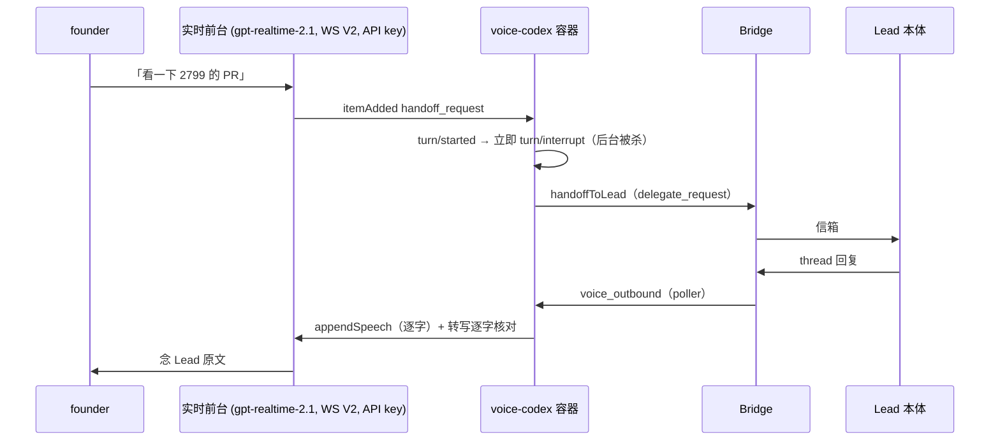

# FLY-2886 语音·B·核心·大脑 — 探索
Issue: FLY-2886 (https://linear.app/geoforge3d/issue/FLY-2886/语音b核心大脑-codex-自带后台-agent订阅与-lead-同权-记忆与上下文三层装载-口语转述关键字段一字不差-等待话术-20)
日期: 2026-09-25
基于: 无（上游事实来自 FLY-2799 plan/research、FLY-2881 v4/v4b/v5、FLY-2884 结论页）

## 1. 要解决的问题（founder 原话 → 工程语言）

| founder 定的 | 工程含义 |
|---|---|
| 13:00「用语音会话里 Codex 自带的后台 agent，给它配所有工具，和 Lead 一样的权限」；20:19Z「全开权限」；15:04「起码和所有 Lead 一样」 | 语音线程里的 **backing Codex model**（下称「后台 agent」）不再被立即 `turn/interrupt`，而是带着该 Lead 的工具与权限真正干活 |
| 12:54「走订阅，不走 API」 | 后台回合用 ChatGPT 登录（auth.json），不读 `OPENAI_API_KEY` |
| 13:18「memory 和 lead 的 context 要怎么 inject」 | 三层装载：开场简报 / 细节现查 / 会话中新事件背景追加 |
| 12:33 口语转述，编号/单号/数字/人名一字不差 | 删除「逐字念 + 逐字核对」，换成「口语稿 + 关键字段保真检查」 |
| 12:33 等待只说「我去看一下」、~20 秒「还在查」最多两次、打断后结果不丢 | 客户端控制的等待话术计时器 + 与实时代数（generation）无关的结果信箱 |
| 14:59 能开浏览器并操作网页（像 Lead 用她电脑上的 Chrome） | 后台 agent 有浏览器工具 |
| FLY-2884 真人场：夸口、不知道在 Discord、给不了链接、闲聊也交后台 | 开场简报写清「我是谁/在哪/能做什么/不能做什么」；链接发 thread；收紧交接判断 |
| 2799 遗留 MEDIUM | mirror 撤回与 outbound 认领竞态会杀掉整个语音会话 |

Lead 裁定（问询 e30ae882，2026-09-25）：标题里「动手交 Lead 本体」是旧说法。后台 agent **自己直接读写**，每次写操作同步一条动作日志进该 Lead 本体信箱；会话结束纪要交 Lead；只有 founder-only 动作走现有门。并发冲突走既有幂等/409 保护、**以常驻 Lead 为准**并在语音里说明；改代码默认派 runner，不在 Lead 工作区直接改产品代码。

## 2. 现状（main @ ef47e9a05）

语音引擎 B（`packages/voice-codex`）当前是「只读分身 + 交给 Lead 本体」：

锚点：
- `CodexVoiceContainer.ts:579-686` —— 必须有 API key；`thread/start` 固定 `sandbox:"read-only"`、所有工具 feature 关、`mcpArgv: []`；`assertThreadReceipt`（:136-165）要求 readOnly/无网络，放开权限会被它拒。
- `codex-home.ts:11-30` —— `forced_login_method="api"`、`cli_auth_credentials_store="ephemeral"`；`assertVoiceCodexHome` 拒绝任何 `auth.json`。
- `RealtimeTransport.ts:601-636` —— 每个 `turn/started` 都 `turn/interrupt`；`item/started` 的 commandExecution/mcpToolCall 走「中断 + 交 Lead」。
- `CodexVoiceBackend.ts:307-368` —— 插话 = `thread/realtime/stop` + 重开（generation+1），旧代的一切事件被丢弃。
- `CodexVoiceBackend.ts:569-642` —— 交办的唯一出口是 `handoffToLead`。
- `CodexProofSpeaker.ts:190-197` —— 转写与原文不等价即 `speech_not_equivalent`（`verification: required`）。
- `voice-session-context.ts:519,540` —— 「只读边界」+「[BACKEND] 行逐字念」规则；`:442-606` 把**完整 memory 文件**塞进 realtime prompt（上限 128KiB / 32,768 token），状态投影用未截断的 `LeadBootstrap`，大 Lead 会整体 `context_too_large` 失败（调研 agent 在 `voice-session-services.ts:265-299` 确认未走 `formatBootstrap`）。
- `daemon.ts:872-950` —— Lead 本体回复经 `voice_outbound` 认领后逐段 `session.speak(readback)`。

## 3. 已被证实的事实（不再重证）

- 同一 Codex 线程里后台回合走订阅（ChatGPT·Pro）可行，结果回到前台说出（FLY-2881 v4/v5；FLY-2884 s1-s7）。
- 0.157 的 WebRTC/V3 实时腿可用订阅；WebSocket V2 实时腿必须 API key（`realtime_conversation.rs:1873-1895`）。
- `clientManagedHandoffs:true` 下，`turn/completed` 的 `final_answer` 由客户端 `appendSpeech` 交回——这正是 Codex TUI `/voice` 的做法（`tui/src/chatwidget/realtime.rs:887-999`），也是 founder 试用后说「和 Codex App 一样」的那条路径。
- V2 下 `appendText` 不会让前台开口（FLY-2799 research.md:8-14）——可作为「只知道、不念」的静默背景通道。
- 模型会把闲聊也交后台（FLY-2884 §8）；后台回合数硬上限会把真正要查的那次挤掉。

## 4. 与「核心·连接层」的边界

连接层（兄弟单，WebRTC/V3 + 订阅、Discord Opus 直转）负责**传输**；本单负责**线程之上的大脑**。两者的接缝是 `thread/*` 与 `turn/*` RPC/通知（`thread/start`、`turn/started|completed`、`thread/realtime/itemAdded`、`appendSpeech`、`appendText`），这些在 WS 与 WebRTC 下同名同义。本单把大脑逻辑放进一个与传输无关的协调器，先在现有 WS V2 连接上开发（实时腿暂用 API key，后台腿已走订阅），连接层落地后只换传输。

**诚实边界**：验收 1「全程不走 API key」要等连接层把实时腿换成 WebRTC 才能整体成立；本单保证**后台腿**从第一天起就不碰 API key（并有断言）。

## 5. 开放问题与处理

| 问题 | 处理 |
|---|---|
| 客户端接管交接（true）还是让 Codex 自己转（false） | research §2 定：**true**（本单要求的每一条都需要一个客户端控制点） |
| 口语转述谁来写 | research §3 定：后台结果由后台 agent 直接写口语稿；Lead 本体/Bridge 文字由同进程一条无工具的「改稿线程」改写；两者都过关键字段保真检查后再 `appendSpeech` |
| 浏览器用哪个 | research §5：她的 Chrome（chrome-devtools-mcp `--auto-connect`），每 Lead 开关，可退到隔离浏览器；Lead 已同意默认 founder_chrome（07429662） |
| 能力包 v2 能否给语音会话单独签发 | 实现 Step 1 先打通（见 plan §7），打不通即停下报 Lead，不降级成只读 |
