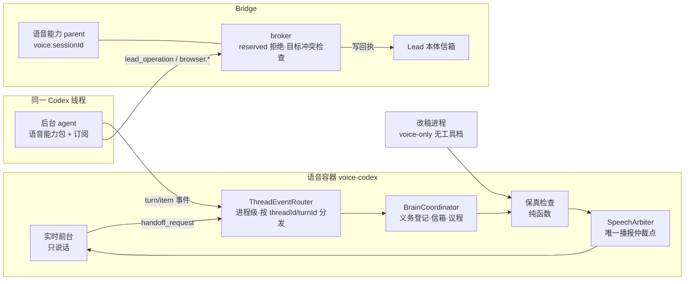
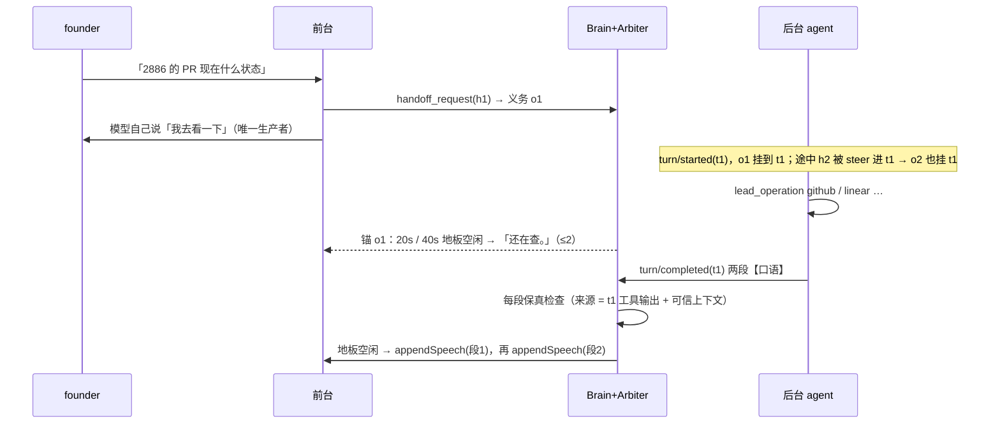

# FLY-2886 语音·B·核心·大脑 — 实施计划
Issue: FLY-2886 (https://linear.app/geoforge3d/issue/FLY-2886/语音b核心大脑-codex-自带后台-agent订阅与-lead-同权-记忆与上下文三层装载-口语转述关键字段一字不差-等待话术-20)
日期: 2026-09-25
基于: exploration.md、research.md

状态：v12 — 追加 §14 Lead 裁定修订二（真宿主起 parent：按集成装配、会话级降级、node 运行时闭包、部署前置、真宿主验收），只增不改已批准部分；v11 — 追加 §3.1 Lead 裁定修订（上游时序限制，写入前防重门）；v10 — §5.3 第五轮 scoped design review 已 effective APPROVED（Lead 回执 c757cb0b，外部 Codex `VERDICT: APPROVED`）；v5 其余部分仍按 Lead effective APPROVED（问询 947a7585，R4 后裁定）。真实语音准入全部通过前，live 旁注仍默认关闭，只使用持久背景环回退。

修订记录：
- v12（QA@2 FAIL claim 1632 + Lead 2026-09-26 11:5xZ 裁定）：真宿主上语音后台 parent 从未起来过（基线缺、gbrain 配置缺、Context7 漂移、node 被沙箱挡、Linear key 缺都会让整场 `voice_unavailable`）。新增 §14：语音 parent 按集成装配（缺集成只不装配并记原因）、后台准入段失败降级为无后台的前台语音、沙箱放行 node 运行时闭包（常驻同修）、部署前置清单与真宿主起 parent 的验收。§0–§13 不改。
- v11（Lead 裁定，问询 cd6d1609；2026-09-26 重派说明）：上游时序限制下新增写入前防重门，见 §3.1；§3「已成功的写不重做」由该门结构性保证，不再依赖 handoff 顺序、事后 steer 或规约。
- v10（§5.3 scoped review 修正）：撤销「现有 `cancelSpeech` 足够」的错误假设；新增逐帧 owner ledger，身份保留到消费或撤回，选择性重建 output resource 时只移除目标 speechId、按原顺序重放其他未消费帧；固定「目标帧已全交 player 未消费」和「授权尾帧与泄漏共用缓冲」两条边界测试，realtime cancel/stop 仍为零。
- v9（§5.3 scoped review 修正）：补齐 audio-first/transcript-later 泄漏处置：按 generation/item 绑定本地 speechId，检测后既拦后续事件，也调用 `WaitingMouth.cancelSpeech(speechId)` 清掉 speech queue 与已经交给播放器但尚未消费的尾帧；仍不调用 realtime `cancel/stop`，已播帧按不可逆事故记录。
- v8（§5.3 scoped review 修正）：不确定输出归属时保留已授权 tell/结果并永久关闭 live；无 provider 音频项到本地 utterance 的可信绑定时一律隔离，不再凭 VAD 时间窗放行；V2 泄漏处置改为按 itemId 本地持续拦截，不调用实际会 stop realtime leg 的 `cancel()`；熔断位与启停位分离，关闭再开启同一 session 也不得恢复 live。
- v7（§5.3 scoped review 修正）：把 v6 的 5/5 降格为候选可行性证据，不再授权 live 路径；补生产 prompt + 真语音 + 近 600 字多事件/连续批次/完整回答准入、静默上限探测、静止窗口与 generation 顺序合同、上下文来源隔离、可执行泄漏判据和不可逆音频处置；熔断位与背景环改为 sessionId 绑定的持久状态。
- v6（§5.3 设计修正）：实测否定 `appendText(developer)`；0.157.0 无 live instructions/session update 接口；A「user-role 静默旁注」5/5 通过，B「重开 realtime leg 刷 prompt」3/3 丢失上一 leg 口令，故选择 A，并把 B 降为只在自然重开时重装最近背景环的回退，不为背景事件主动重开。
- v5（R4 + Lead 裁定）：锁只凭可信终态证据释放（abort/超时/5xx/含糊/目标未变一律保持 unknown），对账无「旧请求已完成」证据不清，唯一例外是带审计的人工 force-clear；关开关进入 draining，存量 held/unknown 清零前常驻仍做只检查的锁约束；unknown 行对 Lead 可见。
- v4（R3）：目标锁 unknown 对双方都阻断写、只凭可信对账解除；补目标锁完整状态转换合同（等待绑定与移除、幂等、holder/fence 匹配、派发标记、崩溃/失联/重启恢复、回滚）；常驻 broker 只为开启语音后台的 Lead 接锁（控制影响面）；迟到交办涉及写时不诱导重做；地板兜底计时取补静音前的原始接收活动。
- v3（R2）：义务结算不再按段数推断、迟到交办有明确终态；授权合同贯穿 provider / envelope / Bridge scope / runner 路由；常驻优先改为 Bridge 托管的目标锁（语音与 Codex broker 写互斥），Claude 常驻路径如实写为尽力预检；地板以房间本地 VAD 为权威、按语音段身份复位、跨重开保留；确认语改为模型独占；改稿用独立的「无工具 + 订阅」配置档；拒绝按目录 classification 分类。
- v2（R1 + Lead 指令 ad0b344d）：后台并发改按「单活动回合 + start/steer」真实语义（删 3+1）；语音能力 parent 与常驻 Lead 的共存、授权、回执、撤销写清；C1 启动链改为专用启动档并列出准入改动；常驻优先改为 broker 目标级冲突检查 + 失败交接带操作账本；保真来源排除回答自身；后台事件订阅挂在进程级、不依赖实时腿；地板信号与唯一播报仲裁点；reserved 拒绝按真实错误码、只在确有卡片/回执时才说「已提交」；浏览器三档作为能力装配的可信输入、founder Chrome 走同一门面与回执钩子；权限下限 = 所有 Lead 权限并集；三条建议（议程收尾、改稿隔离、事件时效）纳入。

## 0. §5.3 设计修正（2026-09-25）

Step 0 在 Codex 0.157.0 上得到与 v5 假设冲突的事实：V2 `thread/realtime/appendText` 以 `role:"developer"` 调用时 RPC 先成功，约 146ms 后异步报 `Developer messages are not supported for realtime sessions.` 并关闭 realtime。生成的 app-server TypeScript 协议只暴露 `thread/realtime/start|stop|appendAudio|appendText|appendSpeech|listVoices`；`thread/settings/update` 与 `turn/settings/update` 也没有 instructions/prompt 字段，因此候选 C「在线更新 instructions/session」不存在。`prompt`、`realtimeStartInstructions`（以及 V3 的 `initialItems`）只在 realtime start 入参存在。

按 Lead 对问询 `a510a57d-bcab-4ea2-988f-eaf6db2fcf37` 及后续收窄回复的裁定，在隔离临时 `CODEX_HOME`、不切账号、不 login/logout、无工具且 thread receipt 为 read-only 的条件下，A 跑 5 次；B 的 3 次是在后续「A 通过则无需 B」回复到达前按原裁定完成，保留原始结果但不再追加：

| 候选 | 结果 | 决策 |
|---|---|---|
| A：`appendText(role:"user")` 写入 `[旁注,勿回应]`，不请求响应 | 5/5：每批仅 200 字符；4 秒观察窗内无 assistant transcript/audio、handoff 或 realtime error；随后问 `2+2`，探针见首个 `4` 即停止，未覆盖完整回答、相关问题、连续批次、真实语音与生产 prompt | **仅保留为候选可行性证据；不能启用生产 live 路径** |
| B：stop/start realtime leg，以新 prompt 重装背景 | 0/3 保留上一 leg 的 `ORBIT-N`；重启 ready 548/647/602ms，停止前 500ms 无输出音频事件；新 prompt 的 `1326` 三次都进回答，但格式被模型改写 | **淘汰为主动注入方案**；隔离台架没有 Discord 输出链，不能把音频事件代理冒充 founder 真人无切口证明 |
| C：live instructions/session update | 0 次；0.157.0 协议无该接口 | 不存在 |

原始 JSONL、判据与环境边界见 `evidence/README.md`。因此 v7 的默认路径是持久背景环；A 只有在 §5.3 的全部 build-bound 准入通过后才能按测试过的 Codex build 开启。旁注必须是 generation-bound 上下文，不触发 `appendSpeech`、handoff 或额外 response；一旦来源无法区分、顺序条件失效、出现任何模型输出/泄漏/跑题/realtime error，先阻止可逆副作用，再持久熔断该 session 的 live context，仅保留背景环。绝不为了背景事件主动 stop/start，因 B 已证明这样会丢上一 leg 对话连续性。

FLY-2885 已在 V3 `initialItems` 证实约 8,192 个**真实 `o200k_base` token** 的服务端静默上限，超限可能整批不可见且无错误；V2 的 realtime start prompt 与 `appendText` 目前没有对应实测，不能按字符或字节推断。启用 A 前增加 build-bound 探测：分别对 start prompt 与 `appendText` 用 4,096 / 6,144 / 8,192 / 9,216 token 的首中尾哨兵测可见性、异步错误和关闭，并测连续 append 的累计行为。探测未完成时 live 路径保持关闭；实现仍先写死更保守的双限：单批 `≤600` Unicode 字符且 `≤768 o200k_base token`，每 generation live append 累计 `≤4,096 token`，realtime start 的动态上下文 `≤4,096 token`。若探测得到更低安全线，发布上限取「最小全哨兵可见值的 50%」与上述上限的较小者。

## 1. 一句话

把语音会话里 Codex 自带的后台 agent 从「一出现就被掐掉」改成「带着 Lead 的全部工具、走订阅真正干活」，前台只负责说话：先说「我去看一下」，查到后用口语讲、编号数字人名一字不差，插话不丢结果；开场就知道自己是谁、在哪个房、能做什么。

## 2. 架构



原则：
- **一个线程两个角色**：实时前台没有工具；后台 agent（backing Codex model）有语音能力包。
- **大脑在传输之上**：后台事件由进程级路由收取，不依赖实时腿是否 active；连接层换 WebRTC 时只换实时腿。
- **单一真源**：能力 = Lead 能力目录（`catalog.ts`）；founder-only = 目录 `reserved`；关键字段名册 = Bridge roster。
- **开关即回滚**：`voiceBackground.enabled=false` 且无存量锁行时行为与今天完全一致；有存量锁行时先 draining（§4.3）。

## 3. 交接与并发（R1#1）

- `clientManagedHandoffs: true`：只意味着 Codex 不自动回送回答（schema 原文）；**不给客户端准入控制**。
- 真实语义（`core/src/session/turn_input.rs` `StartOrSteer`）：线程同一时刻最多一个活动后台回合；活动回合存在时，新的 handoff 输入被 steer 进该回合，不一定产生新的 `turn/started`。
- 因此 BrainCoordinator 以**义务（obligation）**建模：每个 `handoff_request` 生成一条义务（handoff_id、input_transcript、到达时刻）。归属规则（R2#1）：
  - 到达时有活动回合 → 挂该回合。
  - 到达时无活动回合 → 挂「待定」；5 秒内出现 `turn/started` → 挂新回合；5 秒内没有，但上一回合在义务到达前 ≤2 秒内终态（上游先路由输入、后发通知，可能已被上一回合处理）→ 挂上一回合并**只能结算为「未确认」**；两者都不是 → 结算为「未确认」。
  - 「未确认」不无限等待。口语按情况（R3#3）：上一回合**没有**写回执 →「刚才那件我没接上，你再说一次？」；上一回合**有**写回执或 unknown 回执 →「刚才那件的结果还没对应上，我先核对一下」，并先播该回合已有的终态结果与动作回执；她再次提起时，新义务携带原义务 id 与操作账本（§4.3），已成功的写不重做、unknown 先对账。
  - 测试：写已成功 + handoff 迟到 + 她重复原话 → 不产生第二次写。
  - 同一 handoff_id 重复到达只保留第一条。
- 回合终态时，其下所有义务一起结算。**不按回答段数推断哪件完成**：后台规约要求最终回答逐件回答（每件一段【口语】），答不了的件必须在回答里写一段【未完成】并说明；容器只播回答里实际写出的内容，不替模型宣称任何一件「已完成」或「没查完」。
- 测试：`started→completed→handoff`（迟到）、回合交界迟到通知、只答第二问、回答乱序；这些都只影响「未确认」提示与播出内容，不产生错误的完成声明。
- 不中断后台回合，除非：会话结束、开关关闭。**不设回合数上限**。
- Step 0 增加实测：第一个任务未完成时连续提第二、三个查询，记录 handoff/turn/steer 事件顺序与最终回答覆盖情况；与上述模型不符即停下改 plan。

### 3.1 Lead 裁定修订（上游时序限制）

**事实**：Codex 0.156.1 `realtime_conversation.rs` 先 `await StartOrSteer`（1672 行），1675 行才发 handoff 事件；后台输入不带 handoff_id；`clientManagedHandoffs=true` 只管结果回送。因此上游顺序无法保证「她重复原话不产生第二次写」。按 Lead 对问询 `cd6d1609` 的裁定，本单加一道写入前防重门，规则写死、不扩展：

1. **触发**：执行任何写类能力前（仅新 requestId；同 requestId 的重试仍走原幂等回放），查本语音会话写账本（本会话 journal 的回执表，activation = `voice:<sessionId>`）里最近 10 分钟内**之前某个后台回合**已派发的写——账本 outcome 为 succeeded 或 unknown 都算（`dispatched` 在账本里即 unknown）。能力 id + 规范化目标键 + 规范化后的关键参数都相同 → 不写，不建回执。
   - **只跨回合生效**（Lead 补充裁定，问询 `dac7093e`）：同一后台回合里 agent 自己的连续动作（连按两次 PageDown、同页再截图、分步填表）一律不拦；防的是她重复原话（开新回合），不是一次任务里的正常多步操作。浏览器不整体排除，跨回合重复提交表单仍要挡。回执的「所属回合」= 它第一条投递关联（`lead_operation_receipt_deliveries` 最早一行）；没有投递上下文时按「不同回合」处理（安全方向）。同 requestId 重放进当前回合的旧回执，其所属回合仍是原回合，照拦。
   - 残余边界（已报 Lead）：若她重复原话时第一个回合仍在运行，StartOrSteer 会把输入 steer 进同一回合，此时按本条属同回合、不拦。
   - 规范化关键参数：去掉每次尝试都会新生成的业务重试身份（`idempotencyKey`、`requestId`）；字符串 NFKC、去首尾空白、折叠空白；`*Id`/`*Ids` 字段不区分大小写；键排序后取 sha256。该指纹写入回执新列 `dedupe_digest`（可空，只增不删；常驻回执恒为 null）。
   - 时间取回执 `started_at`（与实际派发相差不超过该操作 15s 期限）。
2. **口语**：broker 返回 `rejected` + `duplicate_recent_write`，`data.spokenText` 为固定句——成功：「这件刚才已经做了：<已有回执结果>，要再做一次吗？」（<已有回执结果> 只由已记录的回执生成，如「Linear 上 FLY-2886 已更新」）；unknown：「这件刚才已经发出去了，结果还在核对，要再发一次吗？」。后台规约：带 `data.spokenText` 的拒绝，该请求的【口语】就是这句原文（同时覆盖 §4.5 的 founder-only 文案）。
3. **新请求与重试的唯一区分**：她对这句确认**明确**说要再做 → 视为新请求，模型用新 requestId 再调用一次，门放行恰好一次（放行即消费）；其他回答或沉默一律不写。结构性要素：
   - 确认只能在「拦截所在的后台回合结束」之后成立（回答里的确认句此后才可能被她听到）；之前她说的话不算回答。
   - 只认说话人已归属的 founder 终稿转写（`attribution.kind="known"`），由容器可信转交 parent；拦截后她的**第一句**回答决定：明确「再做/再发/再按/再点/重新做…」或整句只是「要/对/好/是/行/可以」且不含任何否定词（不/别/没/算了/等等/取消/停）→ 确认；「再说一次/再讲一遍」是要她重听，不算；否则作废，下次同样的写会再次拦截并重问。
   - 待确认与已确认都在 10 分钟后失效；parent 重启后待确认丢失（安全方向：重问，不写）。
4. 读类能力不受影响；不改自动后台协议；不把事后 steer 或规约当防重证明——防重只由 broker 在写之前查持久账本给出。
5. 用例（先红后绿，`voice-repeat-gate.test.ts`；跨回合补充另见 `resume2-turn-scope-red/green.txt`：同回合两次相同浏览器动作都执行、跨回合相同浏览器动作被拦并播确认句、她确认后新 requestId 执行、重放进当前回合的旧回执照拦）：写已成功 + handoff 迟到 + 她重复原话 → 0 次第二写并返回确认句；她确认再做 → 恰好第二次写且 requestId 不同，之后同样的第三次再被拦；参数不同 → 照常写；另覆盖 unknown 文案、沉默/其他回答/否定、确认句可听到之前的话不算、10 分钟窗口、`idempotencyKey` 不参与比较、读能力与同 requestId 重放不受影响、没装门的 broker 行为不变。
6. 同批补齐每 turn 回执关联：语音 actor 的写在执行或重放时写入 `lead_operation_receipt_deliveries`（turn journal entry ↔ 回执），`listByDelivery` 让 §3「上一回合有无写回执 / unknown 回执」也能看到重放的旧回执；没有该关联时回退到原「回合开始时账本差集」。

## 4. 与 Lead 同权（Lead 指令 ad0b344d + R1#2/#3/#8/#9）

### 4.1 权限下限 = 所有 Lead 权限并集

- 能力清单：目录中**所有非 reserved 操作**，按本项目在宿主上实际具备凭据的集成（bridge、discord、linear、github、memory、docs、report、runner 派活、browser…）装配；**不以所选 Lead 自身的载体/档位裁剪**（Claude Lead 的语音分身也拿到同一并集）。
- 文件与命令：`flywheel-lead-v2` 权限档（凭据 deny、localhost deny、受管代理、写根 = 项目 worktrees）。读写代码能力在；按 Lead 裁定默认派 runner，不在 Lead 工作区直接改产品代码（规约级）。
- 浏览器：§4.4。memory：`memory.add/search` 读写 + memory 文件只读路径。
- founder-only：目录 `reserved`（ship/merge/terminate/restart/park/unpark/approve_to_ship、terminal.close）不进可执行清单。

### 4.2 语音能力 parent：授权、回执、共存、撤销（R1#2）

新增可信解析器 `resolveVoiceBackgroundCapabilities({project, leadId, sessionId, browserMode})`（`teamlead/src/lead-capabilities/voice-resolve.ts`），**不复用** `resolve.ts` 的 Codex department Lead 准入，不伪造 backend/profile：

| 项 | 设计 |
|---|---|
| 授权 | 新授权种类 `voice_session`：Bridge 校验「语音租约活跃 + 所选 Lead 在注册表当前 + 会话开关开启」，替代 `validateLeadCarrierAuthorization` 的载体授权；不抢占、不读写常驻 carrier 记录 |
| 身份 | manifest `leadId` = 所选 Lead，`activationId = voice:<sessionId>`，`actor = voice`；所有回执带 actor |
| journal | 每会话独立 journal 文件（`<stateDir>/voice-capability/<sessionId>/journal.db`）；**恢复只扫本会话 activation**，不调用按 project/Lead 全扫的 `recoverInterruptedParent`（避免把常驻在途回执改成 unknown） |
| delivery context | 每个后台回合一个 journal entry（entryId = turnId），回合开始进入、终态退出；同会话单活动回合与 §3 一致 |
| 撤销 | 会话结束 / 失租约 / 开关关闭 → `close()`：关 broker socket、关 providers、删除会话 artifact 根；在途 dispatched 回执标 unknown 并进纪要 |
| 验收 | 集成测试：常驻 Lead 有 dispatched 写时启动并关闭语音 parent，常驻回执状态不变 |

**授权合同贯穿到底（R2#2）**。现有 provider 与 Bridge 路由各自再校验 carrier（`runtime-context.ts:30-47,74-88`、`handlers/bridge-read.ts:143-155,219-227`、`bridge/lead-capability-scope.ts:35-48`、`bridge/lead-capability-runners.ts:20-33,92-134`）。改为一个显式的授权联合类型，沿整条链传递：

```ts
type LeadCapabilityAuthority =
  | { kind: "carrier"; carrierClaim: CarrierClaim }            // 常驻：原路径，字节不变
  | { kind: "voice_session"; projectName: string; leadId: string;
      sessionId: string; leaseFence: string };                 // 语音
```

- `runtime-context.ts`：构造 authority；`voice_session` 不走 Codex department 准入与 carrier 查询。
- 所有发 `carrierClaim` 的 handler（实现期 `git grep carrierClaim packages/teamlead/src/lead-capabilities/handlers` 全量改）改为发 `authority` envelope；strict envelope schema 接受两种 kind 之一。
- `lead-capability-scope.ts` 与 runner 路由：`carrier` 保持原检查；`voice_session` 校验「语音租约活跃且 fence 相符 + Lead 在注册表当前 + `voiceBackground.enabled`」，**在最终副作用前**再校验一次（撤销即时生效）。
- Step 1 用真实 Claude Lead 身份经完整链路完成一次读取与一次非 reserved 写；失租约 / 关开关后写被拒；常驻 Codex Lead 的既有路径回归不变。

### 4.3 常驻 Lead 优先（R1#4）

现有幂等键只在同一 requestId 内有效，跨 actor 不相撞，也没有资源版本 CAS；回执里也没有目标字段（`receipts.ts:31-38`）。常驻 Codex Lead 的 broker 在它自己的进程里，所以保护必须放在两边共享的 Bridge（R2#3）：

- **目标键**：目录为每个 write 操作新增 `targetKey(input)`，按业务目标归一化（linear issue → 规范化 identifier，如 `linear:FLY-2886`，UUID 与 identifier 别名先经 provider 解析到同一键；runner 派活 → `issue:FLY-2886`；github PR → `github:<repo>#<n>`；discord → `discord:<channel>:<thread>`）。缺 `targetKey` 的 write 对语音 actor fail-closed（测试覆盖全部 write 操作）。
- **Bridge 目标锁**：新表 `capability_target_locks(target_key PK, holder_actor, holder_activation, request_id, fence, acquired_at, deadline, dispatched_at, state)` 与 `capability_target_lock_waiters(target_key, activation, request_id, enqueued_at, deadline)`（两张都补 `fly-2006-retention-tables` 分类片段）与路由 `POST /api/lead-capabilities/target-lock/{acquire,mark-dispatched,release,reconcile}`。语音 broker 与常驻 **Codex broker** 在各自「最终副作用」之前 acquire、回执终态后 release；持锁期间另一方 acquire 返回 `target_busy`。
  - 常驻优先：常驻 acquire 遇到语音持锁时**排队等待**（不失败），语音 acquire 遇到常驻持锁或常驻排队时**立即拒绝** `resident_lead_active_on_target`。
  - 语音已派发后常驻到来：常驻等语音这次写结束再执行（常驻后写，结果以常驻为准）。
  - 回执 unknown（R3#1）：锁转 `state=unknown`，**对双方都阻断**该目标的写（语音得 `target_pending_reconcile` 并照实说；常驻也得 `target_pending_reconcile`，不放行），直到可信对账解除：
    1. **只凭可信终态证据释放**（R4#1）：该请求的 provider 成功响应；或证明从未发出（没有 `mark_dispatched`，或发送前失败）；或 provider 对该请求的明确拒绝（执行前的 4xx 校验失败）。连接中止、超时、5xx、含糊错误、「目标当前没变」一律**保持 unknown**。broker 保留原 provider 调用，只按上述结果类别处理，不在 finally 里无条件解锁。
    2. `reconcile`（常驻 Lead 执行）只有在拿到「旧请求已完成」的证据时才清锁（如 provider 历史 / 审计记录里能看到该请求的改动）；「现在看不到改动」不算证据，保持待对账。
    3. 唯一例外：常驻 Lead 显式 `force-clear`，必须写明「可能被旧请求覆盖」的风险确认，记审计行（谁、何时、哪个目标、原请求 id）；从不自动发生。
    - **不因 TTL 到期放行**已派发的写。
  - **锁状态转换合同**（R3#2），全部在 Bridge 单事务内：
    - `acquire(target, actor, activation, requestId, deadline)`：同 (activation, requestId) 重复调用返回同一授权（幂等）；空闲 → `held`（发新 fence）；被占 → 常驻写入 `waiters` 行（绑定 activation+requestId+deadline，deadline = 该操作现有 15s 期限的剩余部分，等待计入期限），语音直接拒绝。
    - `mark_dispatched(target, requestId, fence)`：持有者在最终副作用**前**调用；未标记即超期的 `held` 行可安全释放（证明未派发）。
    - `release(target, requestId, fence, outcome)`：必须匹配当前 holder+requestId+fence，否则 no-op 并返回当前状态（迟到 / 重复 release 无害）；释放后按入队顺序唤醒下一个 waiter。
    - waiter 移除：调用方取消、超时、失权时 broker 在 finally 里删；Bridge 也清理 deadline 已过的 waiter（它们从未派发，清理安全）。
    - 持有者崩溃 / release 丢失：`held` 且超 deadline → 未 `mark_dispatched` 则释放，已 `mark_dispatched` 则转 `unknown`（走上面的对账）。
    - Bridge 重启：`waiters` 全部清空（调用方收到错误后按原期限重试或失败）；`held`/`unknown` 行保留并按上面规则处理。
  - **影响面控制**：常驻 Codex broker 只对「`voiceBackground.enabled` 或处于 draining」的 Lead 调用锁；从未启用且无存量锁行的 Lead 写路径字节不变。实现口径（Round 1 评审修正）：Lead 配置里**没有** `voiceBackground` 键 = 从未启用，常驻既不做别名解析也不发任何锁/policy 请求；键存在但 `enabled:false` 时每次写都现查 Bridge policy（不缓存，任何「启用→关闭」周期后都能进入 draining）。
  - **关开关 = draining（即回滚）**（R4#2）：新的语音工作立即停止；该 Lead 仍有 `held`/`unknown` 行时，常驻 broker 继续对命中这些目标的写做**只检查**的锁约束（命中即 `target_pending_reconcile`），直到该 Lead 行数清零才回到原路径。表只增不删。
  - **unknown 可见**（Lead 条件 1）：每条 `unknown` 行在该 Lead 的现有状态面（bootstrap「受阻」节与 Lead 信箱提醒）显示目标、卡住时长、原因、原请求 id；超过 30 分钟重复提醒一次；`force-clear` 入口带审计与风险声明。
  - **Lead 条件 3**：实现阶段代码评审专门核「终态证据分类」与「draining 只检查约束」两处。
  - 验收（窄集成）：「语音超时 → 常驻尝试写 → 旧 provider 晚成功」断言常驻被 `target_pending_reconcile` 挡住直到拿到终态证据；「连接中止但远端随后提交」「对账读到旧值后原请求才提交」均保持 unknown；**「已派发或 unknown → 关开关 → 常驻同目标写 → 旧请求晚完成」必须被挡住（Lead 条件 2，必须进实现）**；排队者取消；acquire 后进程死亡（已/未 mark_dispatched 两支）；release 丢失 / 迟到；Bridge 重启。
  - 回执表增加 `target_key` 列与索引，两边都写，用于对账与纪要。
- **诚实边界**：Claude 常驻 Lead 的写不经 Codex broker，拿不到这把锁。对 Claude Lead，语音侧只能做「写前查 Bridge 最近动作 + 写后动作日志通知」，**不能保证**不被在途写覆盖；HTML 与口语能力说明如实写。
- runner 派活另有 Bridge 既有准入（同 issue 活跃 session 冲突），错误码原样分类。
- **文案按真实回执**：只有回执来源确为常驻 Lead 时才说「Lead 那边已经在处理」。
- **失败交接带账本**：撞额度或会话异常回退「交 Lead 本体」时，handoff payload 附本会话操作账本（成功 / 未执行 / 结果未知，各带 requestId、operationId、目标键）；成功项不重做，unknown 由 Lead 先对账。
- 验收：两个 actor、不同 requestId、同目标；写成功后额度耗尽；回执 unknown 后交接。

### 4.4 浏览器三档（R1#9，Lead 已同意默认 founder_chrome）

浏览器模式是能力装配的**可信输入**，同时决定 provider、manifest、MCP、有效配置断言与生命周期：

| 档 | provider | 暴露给模型 |
|---|---|---|
| `founder_chrome`（默认） | 新 provider：chrome-devtools-mcp `--auto-connect --channel=stable` 连她的 Chrome（首次连接 Chrome 弹允许框） | 同一个浏览器门面 `chrome_devtools`（`browser-capability-proxy.ts`），只有一套浏览器 |
| `isolated` | 现有隔离 Seatbelt worker | 同上 |
| `off` | 无浏览器 provider；**保留**模型网络代理 | 无浏览器工具；manifest 无 `browser.*`、有效配置断言相应变化 |

- founder Chrome 的调用仍经门面 → broker，沿用目录对 `browser.*` 的 read/write 分类与回执，因此 §6.6 的写日志钩子覆盖它；写回执成功而通知失败时按同一回执幂等补送。
- 三档都用实际工具发现（MCP tools/list）验证，不只比配置字符串。
- 诚实边界：在她 Chrome 里，founder-only 对网页按钮是规约级约束（与 Claude Lead 现状同等暴露）。

### 4.5 founder-only 拒绝怎么说（R1#8）

- 真实错误码：模型调用 manifest 外操作得到 `operation_not_in_manifest`（`lead-capability-proxy.ts:196-201`），直达 broker 得到 `reserved_operation`（`broker.ts:164-165`）。按请求 operationId 在可信目录里的 classification 分类（R2#7）：`reserved` → `founder_only_denied`；非 reserved 但不在本会话 manifest（缺凭据、browser=off）→ `unavailable`，口语「这场没开这个能力」；目录里不存在 → `invalid`。只有 `founder_only_denied` 走下面的文案与 Lead 信箱记录。
- manifest 的能力说明从目录 `reserved` 生成「不能做」清单（进开场简报与后台规约）。
- 本单**不新增** founder 请求提交入口。口语只说真的事实：若 founder 注意力里已有对应卡片（ship 卡 / founder gate）→「这个要你在 Discord 卡片上批」；否则 →「这个只能你本人做，我已经记给 <Lead 名>」，且必须拿到 Lead 信箱写入回执后才这么说；写入失败 →「这个只能你本人做」。
- 验收：merge、停 runner 均被拒并按上述文案说出；Lead 信箱有对应记录。

## 5. 三层装载（回答 founder 13:18）

### 5.1 第 1 层 开场简报（前台 `prompt`；V3 后放 `initialItems`）

总量 ≤ 6,000 token，超出按 §5.4 收缩，永不整体失败：
1. **我是谁**：「我是 <Lead 名> 的语音分身」+ persona 说话风格段（≤800 字符）；称呼她用「你」，不用 ChatGPT 账号名。
2. **我在哪**：「你在 Discord <服务器名> 的语音房 <房名> 跟我说话；逐句文字和链接发在这个会话的文字 thread。」
3. **能做 / 不能做**（由语音能力 manifest 与目录 reserved 生成）：我自己聊天、答简报里有的；后台助手有所有 Lead 的工具（列类别）；不能：合并、ship、停 runner、批准；看不到你的屏幕；链接发 thread。**不确定能不能做时先让后台查，不夸口。**
4. **何时交后台**：闲聊、常识、看法、简报里有的自己答；要查最新状态、读文件、上网、动手才交；交后台前说且只说「我去看一下」；只回应对你说的话；被打断就停，不续旧话。
5. **此刻状态**：`formatBootstrap` 格式（每节 ≤10 行、标识符不截断），加 founder 注意力（`readFounderAttentionFacts`）与受阻（stuck / parked / failed）。
6. **memory 索引摘要**：MEMORY.md 索引行，≤4,000 字符。

### 5.2 第 2 层 细节现查（后台 `developerInstructions`）

≤ 32,768 token：身份全文、memory 文件只读路径清单、状态全量（12,000 字符版）、规则：
- 最终回答格式：每个请求一段，段首 `【口语】`（短句、无 markdown、无链接、编号数字人名照原文、≤120 字），可选 `【文字版】`（链接与长内容，容器发 thread）。不要直接往本会话 thread 发消息。
- 写操作用 `lead_operation`；被 `resident_lead_active_on_target` 拒绝即停，照实说。
- 改代码默认派 runner。
- founder-only 被拒不重试、不绕路（浏览器里也不点 merge/ship/批准按钮）。

### 5.3 第 3 层 会话中新事件（R1#12；v10 scoped correction）

| 事件 | 键 | 投递类 |
|---|---|---|
| 新 founder 注意力项 | `attention:<kind>:<id>` | `tell` |
| 该 Lead 的 runner 失败 / 受阻 | `session:<executionId>:<status>` | `tell` |
| runner 开始 / 完成 / 进 QA | `session:<executionId>:<status>` | `context` |
| Lead 本体在会话 thread 的回复（现有） | Discord message id | `tell` |

- 只为 `voiceBackground.enabled` 且引擎 B 的会话生产；关闭档与 Engine A 不产生新行（测试）。
- 键集：简报时刻写入 `voice_sessions.brief_keys_json`；poller 推新键，`message_id = bridge-event:<sessionId>:<key>`（`INSERT OR IGNORE` 去重）。
- `tell` 播前复核：注意力项已解决 / 状态已变 → 丢弃（证据 `agenda_stale_dropped`）。
- **持久真源与恢复顺序**：`voice_sessions` 以 `session_id` 分开保存可变启停位 `live_context_mode = disabled|eligible` 与不可逆熔断位 `live_context_fused_at`、`live_context_fuse_reason`，另存 `context_ring_json`、`context_ring_revision`、`context_prompt_generation`；新列默认 `disabled` 且未熔断。有效资格必须同时满足 `mode=eligible AND fused_at IS NULL`。poller 先以事件 key 幂等更新最近背景环（≤10 个唯一 key，并受 §0 token 上限约束），再考虑 live 投递。daemon/进程恢复**先读熔断位**，再读 mode 与环，最后才启动 realtime；有 `fused_at` 时同一 session 永不再进入 eligible。自然 realtime start 只把去重后的环按 key 各装一次，并把本 generation 原子记入 `context_prompt_generation`；同 generation 重试不重复装载，旧 generation 的待发项只留在环中。
- **容量**：每批合并节流 ≤1 条/10s，必须同时满足 `≤600` Unicode 字符、`≤768 o200k_base token`；每 generation live append 累计与自然 start 动态上下文分别 `≤4,096 token`，超出只留背景环。V2 静默上限未完成 §0 探测前 `live_context_mode` 不得进入 `eligible`；有熔断位时无论容量证据如何都不得进入。
- **注入准入与顺序**：新增 `LiveContextInjector`，与 `BrainCoordinator`/`SpeechArbiter` 共用单一派发锁。只有同一 generation 在发送前、RPC 返回后两次都满足以下条件才可 append：本地 VAD 无开放 founder utterance；没有未结算的 founder transcript/input；没有 active/未终态 assistant response；SpeechArbiter 无正在播放或已获地板的 result/tell；没有 handoff/义务派发；realtime 状态为 ready 且 generation 未变。`tell`、真实语音、结果播报优先，任何一项到达都取消尚未发出的旁注；RPC 等待中 generation 变化则把该批只留环，不向新 leg 重放。已完成 append 不请求 response、不调用 `appendSpeech`、不创建 handoff/义务，也不进入 SpeechArbiter。
- **来源标记与镜像隔离**：每次 append 先持久登记 `(sessionId,generation,injectionId,nonce,exactTextHash,state)`；payload 带不可口述的唯一 nonce。`RealtimeTransport` 在调用 `CodexVoiceBackend.observeTranscript` **之前**做来源分类：匹配 provider itemId，或在无 itemId 时匹配当前 generation 的 nonce + exact normalized payload，标为 `live_context`。该来源不得归属 founder、不得写 transcript、不得发 thread mirror、不得创建 handoff/义务、不得作为授权或交办输入；只更新注入记录。provider 去掉标记、改写文本或缺 itemId 时一律进入隔离区并持久熔断，**绝不凭 VAD 时间邻近放行**；只有 provider 音频 item 明确携带 `inputOwner.utteranceId`，且它与 RoomIO 已登记的同一本地 utterance 的 owner、generation 与音频 ownership binding 全相符，才可作为 founder 输入。markerless echo 即使与真实语音落在同一时间窗也不得放行。某 Codex build 的真房样本出现一次不可区分 echo，即该 build 禁止 live 路径，只用背景环。
- **授权输出归属与泄漏判据**：`SpeechArbiter` 给每条已授权 tell/结果分配 `speechAttemptId`，在 appendSpeech 前把其 generation、pendingKey 和随后得到的 provider assistant itemId 登记为 `authorized_output`；`LiveContextGuard` 持有每批 nonce、事件 key、关键字段与归一化内容指纹，并收集到 item 终态的**完整** assistant transcript/audio/handoff 序列。下一条真实 founder utterance 前，只有不属于 `authorized_output` 的 assistant transcript/audio/handoff（包括「收到」式确认）才是旁注主动泄漏。append 成功后到来的 tell/结果照常优先播报；若其输出 itemId 无法与授权记录可靠绑定，**保留这次正常播报、不丢不截**，同时因归属不确定持久熔断 live，后续只用背景环。真实 founder 输入后，只有当输入含明确的背景查询意图（如「刚才/最新状态/那条待批」）或与环中至少一个受保护 subject key 完整相交时，回答才可使用相应背景；否则回答出现 nonce、context-only 关键字段或内容指纹即为改写泄漏/跑题。不满足确定条件一律按泄漏处理，不让语义猜测 fail-open。QA 另以人工语义判据检查无关键字段的改写跑题。
- **熔断与已产生输出（V2 可执行合同）**：V2 没有 response cancel；现有 `RealtimeTransport.cancel()` 实际是 realtime stop，因此本路径**不得调用 cancel/stop，也不重开腿**。每个非授权 assistant audio item 在进入本地播放队列前，先以 `(generation,itemId)` 绑定唯一 `speechId`，并一直保留到 item terminal。检测到来源不明、主动确认、改写泄漏、跑题、realtime 异步 error/closed 或顺序条件失效时，先在同一事务写 `fused_at` 并保留环，再把已观察到且不属于 `authorized_output` 的 assistant itemId 加入 generation-bound `blockedOutputItems`。`RealtimeTransport`/`CodexVoiceBackend` 对这些 item 持续丢弃后续 audio/transcript/handoff 直到 item terminal；转写不持久化/镜像，handoff 不建义务；没有 itemId 的可疑输出整段隔离并熔断。
- **逐帧本地撤回（替换现有 `cancelSpeech` 假设）**：不能直接复用当前 `WaitingMouth.cancelSpeech` / `dropQueuedOutput`，因为 `writeFrame` 把最后一帧交给 player 时会先移除 `QueuedSpeech`，而重开共享 resource 会把别的授权尾帧一起清掉。新增 output-frame ledger：每个交给当前 resource 的 20ms PCM 帧记录稳定递增 `frameSeq`、`speechId | null`、帧副本与该 resource 的提交序号；`QueuedSpeech` 出队、其 `done` 结算或 provider item terminal **都不得提前删掉这份 owner 记录**，只有 `playbackDuration` 证明该帧已被本地消费，或该帧已完成撤回，才从 ledger 删除。`cancelSpeech(speechId)` 先按当前 resource 的 `playbackDuration` 原子推进 consumed prefix；再同时移除尚未提交的该 `speechId` 队列帧，并从 ledger 选出该 id 的未消费帧。若存在已提交未消费帧，则销毁旧 resource，创建新 resource，并把 ledger 中**其余 speechId（包括 authorized_output）和 bed/静音帧**按原 `frameSeq` 精确顺序重新提交；目标 id 的帧不重放。重建期间 pump 持锁，先重放保留帧再接受新帧，避免重复、换序或夹入；新 resource 使用新的本地 consumed 基线，保留帧继续带原 owner，直至实际消费。已消费目标帧不可逆，只计入 audible 事故；撤回结果返回 `{removedQueuedFrames, removedSubmittedFrames, alreadyConsumedFrames}` 供证据记录。此机制只重建 Discord 本地 output resource，realtime `cancel/stop` 调用数必须为 0，且不得清除或截断属于或可能属于 `authorized_output` 的 tell/结果。若检测前已有泄漏帧实际送房，记录 `voice_live_context_leak_audible`（generation/injectionId/itemId/已播时长/本地撤回帧数），该 build 的 live 准入失败，并在地板空闲时排一条「刚才那句是后台旁注误触发，请忽略」；不得继续 append。自然 realtime start 仍只装背景环，**不得为背景事件主动 stop/start**。
- **启用条件**：单测通过后，按精确 Codex build 在 QA 真房用**生产 prompt、真实语音、真实 transcript/mirror 链路**至少 5 轮；每轮发送含多个事件、接近 600 字且不超 token 上限的批次，并覆盖至少两个连续批次。每轮先问一个无关问题（完整等到 response done，零确认/零泄漏），再问与最新背景相关的问题（回答必须使用尾部与中部哨兵，证明背景不是被忽略）；同时核对 transcript、thread mirror、handoff/义务均零泄漏。任一失败、静默丢尾、来源不可区分或 §0 容量探测未完成，live 保持关闭，只允许背景环回退。v6 的 5/5 不计入这 5 轮。
- **关闭开关 / 回滚**：只原子把 `live_context_mode` 置 `disabled`，**绝不清空或覆盖** `live_context_fused_at/reason`；未投递的 `context` 行置 `dropped`，环可留作纪要但不装载。同一 session 关闭、daemon/实时腿/进程重启再开启时，只要熔断位存在就拒绝 eligible；只有新 sessionId 才有新的未熔断位。旧 daemon 只按 `delivery_class` 缺省 `tell` 理解（新列默认值），enabled 会话之外不会出现 `context` 行。

### 5.4 体积与失败

通用简报超 6,000 token：先删 memory 索引，再按节从尾部删整行（`formatBootstrap` 规则），标识符永不截断；仍超 → 只保留 1-4 项 + 「状态我让后台去查」。送进 realtime start 的动态上下文另受 §0 的 `≤4,096 o200k_base token` 上限，按同一整行规则继续收缩；不得用字符/字节估算。状态读取失败：该节如实写「现在读不到」，`unavailable` 如实填。

## 6. 运行时行为

### 6.1 一次委派时序



### 6.2 进程级后台事件（R1#6）

- `ThreadEventRouter`（`voice-codex/src/codex/ThreadEventRouter.ts`）在 `CodexVoiceProcess` 启动时订阅一次通知，按 `threadId`/`turnId` 分发 `turn/started|completed`、`item/started|completed`、handoff 相关事件；**不依赖** `RealtimeTransport` 的 active 状态。`RealtimeTransport` 只处理 `thread/realtime/*` 音频与转写，按 generation 隔离。
- enabled 档：`item/started`（commandExecution/mcpToolCall）不再 `turn/interrupt`；关闭档保持原中断与 fence。
- 终态：`completed` 且有最终回答 → 结算；`completed` 无最终回答 / `failed` / `interrupted` → 义务结算为失败，口语「这件没查成」+ 原因类别（额度 / 权限 / 出错），细节进 thread。
- 测试：完成事件分别落在「旧 transport cancel 等待中」「新 transport opening」「新 transport started 后」三个位置都进入信箱；真实工具 item 序列不被中断。

### 6.3 关键字段保真检查（R1#5）

- 来源集 `C`：本回合**实际完成的工具结果**（`mcpToolCall` / `commandExecution` 输出，保留 itemId）、本会话可信上下文（开场简报快照、Bridge 事件文本）、她本次请求的转写。**排除**最终回答本身及其 `【文字版】`。改稿来源 = Lead 原文。
- 规则 A（不凭空）：`S` 中每个关键字段须在 `C` 中以**完整 token** 出现（边界匹配：`12` 不能由 `312` 支撑；`FLY-28` 不能由 `FLY-2886` 支撑）。
- 规则 B（不丢号，仅改稿）：Lead 原文中的单号 / PR 号须出现在稿中，除非稿以 thread 指针结尾。
- 不过 → 兜底稿「这条我发到 thread 了，编号以文字为准。」+ `【文字版】`或原文进 thread；**只有 thread 发布成功才说这句**，否则说「编号我没核对上，等下再给你」并进纪要。
- 测试含循环来源反例（工具返回 FLY-2886 / PR #2886，回答写 FLY-9999 / PR #9876 → 必走兜底）。

### 6.4 地板信号与唯一仲裁点（R1#7）

- `SpeechArbiter` 是所有非前台自发语音（补话、结果、议程、兜底）的唯一出口；一次只放一条。确认语不经它（模型独占，见下）。
- user-active（R2#4）：**以房间本地 VAD（RoomIO 上行 Silero 语音段）为权威**，它按说话人的语音段（utteranceId）开始/结束，不受实时腿重开影响（重开期间房间音频照常经 VAD，并被缓存回放）。provider 的 `speech_started{item_id}` 只作补充：记为「开放段 item_id」，只由**同一 item_id** 的 completed / final 关闭；迟到的旧段 final 不能关闭新段。user-active = 任一本地语音段未结束 或 任一 provider 开放段未关闭。实时 generation 切换**不**复位 user-active；provider 开放段在 generation 切换时丢弃（本地 VAD 仍在）。兜底（R3#4）：计时取**补静音之前**的原始接收活动（`Uplink.ts` 原始帧入口，不看每 20ms 补齐的静音 tick）；本地语音段已结束且原始接收无有效语音 ≥3 秒 → 清掉没有结束事件的 provider 补充段（只清开始时间早于本地段结束的旧段，不影响正在说的新段）。测试：本地已结束 + provider final 缺失 + 静音 tick 持续 → 3 秒后恢复地板。V3 的 provider 信号由连接层接缝提供，本地 VAD 规则不变。
- output-active：`response-started` 置位，`response-done` / `response-cancelled` / 播放结束复位；断线 / generation 切换复位（输出取消只释放播放，不影响 user-active）。
- 地板空闲 = 两者皆否且持续 ≥800ms。
- 「我去看一下」只有一个生产者（R2#5）：**模型独占**。前台 prompt 固定「交后台前说且只说『我去看一下』」；V3 同时设 `delegationAckFiller:false`，关掉服务端默认填充语；客户端**永不**播确认语，SpeechArbiter 不含确认语出口。模型漏说时不补（避免与迟到的模型音频竞争）；Step 0 实测措辞遵从率，作为兼容性证据写进报告，不作为去重机制。
- 「还在查」：锚 = 最早未结算义务；20s、40s 各一次，需地板空闲（顺延不越过下一档）；结算即取消；≤2。
- 打断：结果 / 议程稿被打断 → 回队首，`attempts+1`，每次重投用新 pendingKey（`<业务 id>:attempt:<n>`，业务 id 稳定）；以「刚才查到的：」开头；`attempts>2` → 发 thread + 一句指针。

### 6.5 议程收尾与纪要（R1#10）

- `daemon.deliverOutbound` 对 `tell` 行：claim → 交 BrainCoordinator → **等其终态**（spoken / fallback_posted / stale_dropped / failed）→ 才提交 receipt（`confirmed`=spoken、`dropped`=stale、`failed`=其余）。
- 会话关闭：先把未播结果与未投递议程导出到现有纪要（`cli.ts:609-629` 的 minutes 输入新增 `unplayed[]`），再释放容器；后台在途回合 `turn/interrupt`，其义务写「未完成」。

### 6.6 写操作日志（C11）

broker 对 actor=voice 的 write 类回执（含 `browser.*` 写）成功 → Lead 本体信箱 `voice_background_action`（operationId、目标键、回执 id、会话 id；通知按回执 id 幂等）。

### 6.7 改稿（R1#11）

改稿不在后台线程所在进程里做（那里装了可写 MCP）。新增独立配置档 **voice-scribe**（R2#6），把「工具策略」与「登录策略」分开：
- 工具策略：沿用 voice-only 的禁用集（`mcpArgv: []`、shell / unified_exec / web_search / memories / apps / plugins / browser_use / computer_use / multi_agent / hooks 全关，read-only，ephemeral）。
- 登录策略：订阅；独立受管 home（`<scratch>/scribe-<sessionId>/home`），`auth.json` 软链接宿主真源，**不写** `forced_login_method="api"`，子进程 env 不含 `OPENAI_API_KEY` 与业务 MCP 变量。
- 新常量 `VOICE_SCRIBE_HOME_CONFIG` + `assertVoiceScribeHome`；旧 voice-only 档与 `assertVoiceCodexHome` 原样保留。
- 构造与销毁：由容器随会话创建、会话结束删除（与现有 container root 同法）。
- 启动断言：`account.type === "chatgpt"`、`config/read` 与工具发现为空工具集、一次普通 `turn/start` 成功。
- 用法：`turn/start` + `outputSchema {spoken: string, threadText: string|null}`，输入作为数据；本地校验 JSON 与长度；15s 超时 → `turn/interrupt` 该回合、丢弃迟到结果、走兜底。

## 7. 组件与文件落点

| # | 组件 | 文件 |
|---|---|---|
| C1 | 语音能力启动档（R1#3） | `teamlead/src/lead-backends/codex/codex-lead-runtime.ts`：`spawnCodexAppServer` 新增显式 `profile: "voice-capability"` 分支（可同时带 `capabilityModelEnv` 与实时腿临时 `voiceProfile`），**不放宽**其他调用方的互斥守卫；`voice-codex/src/codex-home.ts` 新增 `VOICE_CAPABILITY_HOME` 校验（home/config 唯一构造者 = 语音能力 parent）；`native-skill-baseline.ts` 为语音所用二进制版本补采基线（按现有采集流程，不放宽比较）；`CodexVoiceContainer.ts`：账户断言 `account.type === "chatgpt"`，权限按 thread 回执 + `config/read`，MCP 按有效配置 + tools/list |
| C2 | 语音能力 parent | 新 `teamlead/src/lead-capabilities/voice-resolve.ts`、`voice-capability-parent.ts`；`runtime-parent.ts` 抽出「按 activation 恢复」入口；`broker.ts` 加 actor 与目标冲突检查（§4.3）；`catalog.ts` 为 write 操作加 `targetKey`；授权联合类型贯穿 `runtime-context.ts`、全部发 carrierClaim 的 handlers、`bridge/lead-capability-scope.ts`、`bridge/lead-capability-runners.ts`；Bridge 目标锁表 + `bridge/lead-capability-target-lock.ts` 路由 + retention 片段；回执表加 `target_key`；常驻 Codex broker 接入 acquire/release |
| C3 | 浏览器三档 | `lead-capabilities/browser-provider.ts` 加 founder-chrome provider；`buildCodexLeadMcpArgv.ts` 接受 browserMode；有效配置断言按档 |
| C4 | BrainCoordinator + SpeechArbiter | 新 `voice-codex/src/codex/{BrainCoordinator,SpeechArbiter}.ts` |
| C5 | 口语稿与保真 | 新 `voice-codex/src/codex/SpokenScript.ts` |
| C6 | 改稿 | 新 `voice-codex/src/codex/ScriptWriter.ts`（新 voice-scribe 档进程：`VOICE_SCRIBE_HOME_CONFIG` + `assertVoiceScribeHome`） |
| C7 | 进程级事件路由 + 实时适配 | 新 `ThreadEventRouter.ts`；`RealtimeTransport.ts`、`CodexVoiceBackend.ts`、`CodexVoiceContainer.ts`（按档） |
| C8 | 去逐字 | `CodexProofSpeaker.ts`（enabled 档 `best_effort`、关键字段只记证据）、`CodexRoomFrontend.ts`、`daemon.ts`（§6.5） |
| C9 | 三层上下文 | `teamlead/src/bridge/voice-session-context.ts`、`voice-session-services.ts` |
| C10 | 新事件 | `voice-session-poller.ts`、`StateStore.ts`（`voice_outbound` 加 `delivery_class`、`source`；`voice_sessions` 加 `brief_keys_json`、持久 live fuse/背景环/装载 generation 字段；注入记录含 source nonce/hash）、`voice-session-routes.ts`；`RealtimeTransport` 在 `observeTranscript` 前做来源隔离 |
| C11 | 写日志 | C2 broker 回执钩子 → Lead 信箱 |
| C12 | 2799 MEDIUM | `StateStore.claimVoiceOutbound` 三态；路由 410 `voice_outbound_not_claimable`；`daemon.ts:190-197,872-903` 跳过继续 |
| C13 | 配置 | `ProjectConfig.ts` `lead.voiceBackground?: {enabled, browser}`，缺省 `{enabled:false}`；`voice-codex/src/config.ts` |

## 8. 实现顺序

| Step | 内容 | 验证 |
|---|---|---|
| 0 | 协议实测（订阅、单账号、隔离临时 home）：① WS V2 下 auth.json 订阅 + env API key 实时腿，后台回合 `account.type=chatgpt`；② `appendText(developer)` 反证；③ v6 A user-role 静默旁注 N=5 与 B realtime leg 重开 N=3 只作候选证据；④ 0.157.0 live instructions/session update 接口检查；⑤ 改稿 voice-scribe 档订阅 + 空工具集；⑥ 待补 V2 start prompt / appendText 的 `o200k_base` 静默上限探测；⑦ 待补 §5.3 生产 prompt + 真语音 + 近 600 字多事件/连续批次/完整回答 N≥5 准入 | 原始证据 JSONL 进 `evidence/`；⑥⑦ 与 scoped review 全通过前不做 live 旁注生产代码，只做持久背景环 |
| 1 | C2 + C1：语音能力 parent 与启动档；read 成功、reserved 被拒（真实错误码）；**常驻 Lead 有在途写时启停语音 parent，常驻回执不变**；关闭后 socket 不可连；授权联合类型贯穿（真实 Claude Lead 身份一读一写、失租约/关开关后写被拒、常驻 Codex 路径回归不变） | 集成测试 + 一次真 broker 读写 |
| 2 | C7：事件路由、enabled 不中断、终态处理、三种完成时机 | 单测 + Step 0 台架复跑 |
| 3 | C5 + C6：口语稿、保真（含循环来源反例、token 边界）、改稿进程空工具集 | 表驱动单测 |
| 4 | C4：义务归属（迟到 / 交界 / 只答第二问 / 乱序）、仲裁、本地 VAD 地板（旧段 final 迟到、跨 restart 连续说话）、补话 ≤2、打断重投新 key | 注入时钟单测 |
| 5 | C8 + C9：去逐字、三层简报 | 快照测试（体积、收缩、标识符不截断、unavailable 如实） |
| 6 | C10 + C11 + C12 + §4.3 | StateStore/路由/daemon/broker 单测：目标锁两种到达顺序、慢 provider、超时 unknown 锁不自释放、别名归一、额度耗尽带账本、410 跳过 |
| 7 | C3 + C13 | 三档实际工具发现；founder Chrome 写操作有 Lead 信箱记录 |

## 9. 测试计划（本机只跑相关测试）

- 按包、按文件跑 vitest；排除 `**/tmux-viewer.macos.test.ts`；teamlead 里起 Bridge 的用例先隔离 `FLYWHEEL_CODEX_HOMES_ROOT`。
- 负向守卫：关闭档行为不变（既有测试全绿）；shell 读不到凭据、连不上 127.0.0.1（`verifyModelIsolation`）；保真循环来源反例；前台 prompt 不含「逐字」「exactly as written」；后台直发会话 thread 的消息不被念回；非 enabled 会话不产生 `context` 行；旁注不得触发 `appendSpeech`/handoff/义务/额外 response；`RealtimeTransport` 回归必须覆盖「append RPC ack 后异步 `thread/realtime/error` + closed」并断言持久熔断/回退，不能只用 dispatch mock。
- live-context 顺序矩阵：旧回答在 append 前后迟到、founder 同时开口、tell/结果已获地板、append 成功后且 founder 未再输入时新 tell/结果到达、append RPC 等待中 generation 重开；断言真实语音/tell/结果优先，授权输出照常完整播报，归属不明时只熔断 live 而不误杀播报，旧 generation 不向新 leg 重放。来源矩阵覆盖 echo 有 itemId、无 itemId但 exact nonce、markerless echo 与真实语音处于同一时间窗、provider item 与本地 utterance 有/无可信 ownership binding；无绑定一律隔离，断言 founder attribution、持久 transcript、thread mirror、handoff/义务和授权输入全部零泄漏。
- live-context 输出矩阵：旁注后主动说「收到」、旁注同义改写、无关问题跑题、明确询问最新背景的合法使用；收集到 item/response terminal 而不是见到首 token 即停。用真实 V2 transport 事件序列（非 mock cancel）证明 `blockedOutputItems` 持续丢弃该 item 的 audio/transcript/handoff，且整个过程中 realtime stop/cancel 调用数为 0。另做 audio-first/transcript-later，并固定两条播放器边界：①泄漏项全部帧都已从 speech queue 交给 player、但 `playbackDuration=0` 时才收到 transcript，撤回后这些帧一帧不播；②授权 tell/结果尾帧与泄漏帧已按顺序共用旧 resource 缓冲，选择性重建只移除泄漏帧，授权帧按原顺序完整且恰好播放一次。两例都断言 owner ledger 保留到实际消费/撤回、未误删其他 generation/item、已播放帧只记不可逆事故并排纠正话术、realtime stop/cancel 为 0。重开实时腿与重启进程后断言熔断位不恢复、背景环按唯一 key/上限重装且同 generation 不重复；同 sessionId 的「熔断→关闭→进程重启→开启」仍拒绝 live append。
- 容量矩阵用真实 `o200k_base` token 生成首中尾哨兵，覆盖 start prompt、单次 append、连续 append 的 4,096/6,144/8,192/9,216 档；发现静默丢失即不启用 live。常驻回执不被语音 parent 恢复逻辑改写；写操作缺 `targetKey` 时语音 actor fail-closed。
- 迁移：新列带默认值 + 迁移测试；新表 `capability_target_locks`、`capability_target_lock_waiters` 必须补 `fly-2006-retention-tables` 片段。
- 新增 spawn（改稿进程、founder-chrome provider）按 shell 枚举 / child-process census / kill-path inventory 清册登记。

## 10. QA 验收映射

| 验收 | 测法 | 判据 |
|---|---|---|
| 1 | 真房（codex slot、`TEST_CODEX_LEAD_OUTBOUND_MODE=bridge`、`FLYWHEEL_VOICE_BACKEND=codex-realtime`）问「FLY-xxxx 的 PR 状态」 | 先「我去看一下」；口语结果单号/PR 号与 GitHub 一致；后台 `account.type=chatgpt`。实时腿在连接层落地前仍用 key，报告如实写 |
| 2 | >45s 查询 | 「还在查」1-2 次 |
| 3 | 后台在跑时插话 | 前台立停；她说完补「刚才查到的：…」 |
| 4 | 开场抽 3 项对照 Bridge；会话中造一条待批 | 3/3；新待批在停顿时说出；已解决的不说 |
| 4b | 精确 Codex build 的 §5.3 准入：生产 prompt + 真语音，N≥5 轮近 600 字多事件和连续批次；每轮先无关问、再相关问，append 后插入一条授权 tell/结果，并查完整 transcript/thread/handoff；另注入 audio-first/transcript-later 泄漏序列 | 无关问到 response done 零确认/零泄漏；相关问能用中尾哨兵；授权播报不被旁注守卫截断；无 ownership binding 的 markerless echo 即使同 VAD 窗也隔离；检测后可撤回尾音不再送房且 realtime stop/cancel 为 0；来源链零镜像/零误归属；容量首中尾都可见。任一失败则本次发布只开持久背景环，不开 live append |
| 5 | 改测试 issue 状态 / 派空活；再让它 merge、停 runner | 前者成功且 Lead 信箱有动作日志；后者被拒，文案符合 §4.5 |
| 5b | 打开网页读标题（founder_chrome） | 成功；若是写操作有日志 |
| 5c | 常驻 Codex Lead 正在改同一张单时让语音改它；以及语音先写、常驻后到 | 前者被 `resident_lead_active_on_target` 拒并照实说；后者常驻排队后执行，结果以常驻为准。Claude 常驻按 §4.3 诚实边界只验预检与日志 |
| 6 | 纪律 | 只跑相关测试；拆 529 房前 ask Lead |

## 11. 发布与回滚

合并后默认 `enabled=false`；QA 在测试 Lead 开；founder 验收后按 Lead 开。回滚 = 关开关（该 Lead 进入 §4.3 draining，存量锁清零前保护不撤）——关开关请写 `enabled:false` 并**保留** `voiceBackground` 键；删除该键会被视为从未启用，常驻不再做 draining 检查；数据库改动 = `voice_outbound`/`voice_sessions`/回执表加列 + 新表 `capability_target_locks` 与 `capability_target_lock_waiters`（只增不删，回滚处置见 §4.3）。部署由独立 updater 执行，本单不部署、不重启。

## 12. 依赖与风险

| 项 | 处置 |
|---|---|
| 连接层（兄弟单） | 大脑只依赖进程级事件与 `appendSpeech/appendText`；地板信号接缝写明；验收 1「全程不走 API key」待连接层整体成立 |
| 语音能力 parent 与常驻共存 | Step 1 集成测试先行；不成立即停下报 Lead，不降级只读 |
| 订阅额度共享 | 撞额度 → 口语说明 + 带账本回退交 Lead；不自动换号 |
| 她的 Chrome 规约级风险 | 可切 `isolated`；HTML 如实写 |
| auth.json 刷新竞争 | 软链接宿主真源（FLY-2358 同法），不复制不写 |
| 模型仍把闲聊交后台 | 证据计数 `handoff_smalltalk_suspect`，不硬拦 |
| user-role 旁注产生模型输出、来源不可区分或改变话题 | sessionId 独立持久熔断位；按 itemId 本地隔离可逆输出，绝不调用会 stop realtime leg 的 V2 cancel；授权 tell/结果归属不明时保留播报并关闭 live；已播泄漏音频记不可逆事故并纠正；开关不清熔断，保留背景环；scoped review、容量探测、QA N≥5 任一未过即不启用 live 路径 |

## 13. 不做什么

不做 WebRTC/V3 传输与 Opus 直转；不改 founder 门、不新增 founder 请求入口；不在语音里念链接；不改 Engine A、`/gemini`、`/eleven`；不建线程池或第二套消息存储。

## 14. Lead 裁定修订二：真宿主起 parent（v12；QA@2 FAIL claim 1632）

本节只增不改：§0–§13 已批准的内容（防重门 A1–A3、确认分类器、运维口径 B、开场简报状态键）一律保留。真源仍以本 plan 为准。

### 14.0 问题与处置总表

实现阶段的 container 证据全部来自注入进程或夹具，真宿主上从未起过语音后台 parent。QA@2 在 529 房（slot 5，真 codex 0.156.1）逐个撞到的阻断，以及本节的处置：

| # | 真宿主现象（QA@2 原件 `~/.flywheel/artifacts/FLY-2886/qa2/`） | 根因（代码位置） | 处置 |
|---|---|---|---|
| 1 | `codex_open_failed:Error:native_skill_home_unverified` | 0.156.1 原生技能基线目录没物化；`native-home.ts` fail-closed | §14.4 部署前置第 1 条；缺失时 §14.2 降级，不再整场挂 |
| 2 | `gbrain_host_unverified` | `~/.gbrain/config.json` 不存在 → `pinGbrainHost` 抛错 → `startGbrainProvider` 抛错 → `runtime-factory.ts:423` 整个 providers 失败 | §14.1：gbrain 不装配，原因 `host_config_unverified` |
| 3 | `baseline_drift` | Context7 远端工具表与 pin 不一致（`upstream-http-session.ts` 比较）；且无 `CONTEXT7_API_KEY` | §14.1：Context7 不装配，原因 `baseline_drift`；未登记工具永不暴露 |
| 4 | `model_isolation_unproven`：Homebrew node exit 134（`@rpath/libnode.141.dylib` 被挡）；静态 node exit 1（`/System/Library/OpenSSL//openssl.cnf` 被挡） | 权限档 readPaths 只放 node 可执行文件本身（`voice-capability-parent.ts:335`；常驻 `default-runtime.ts:253` 同写法） | §14.3：放行 node 运行时闭包 + 固定 `OPENSSL_CONF`；常驻同修 |
| 5 | `voice_capability_linear_unavailable` | `voice-capability-parent.ts:107` 缺 `LINEAR_API_KEY` 直接抛 | §14.1：Linear 不装配，原因 `credential_missing` |
| (a) | 缺一个集成就 `runtime_handler_coverage_incomplete` | `runtime-factory.ts:501-510` 要求每个非 reserved 操作都有 handler；语音分支 `runtime-factory.ts:146` 同样要求 `missingOperationIds` 为空 | §14.1：改覆盖契约为「每个操作要么有 handler，要么属于已记录原因的不可用集成」 |
| (b) | 沙箱内所有 node（隔离探针、模型侧 MCP 工具代理）都起不来 | 同 #4 | §14.3 |

### 14.1 契约改动 (a)：语音 parent 按集成装配

**新可信参数**：`LeadRuntimeProviderOptions.integrationFailurePolicy: "fail_closed" | "omit_integration"`，由启动方给，不来自模型。

- 常驻（`default-runtime.ts`）不传 = `fail_closed`：行为与 manifest **字节不变**（本节不改常驻的装配策略，见 14.6）。
- 语音 parent（`voice-capability-parent.ts`）传 `omit_integration`。

**集成分两类**（按 catalog 的 `credentialConsumer` 和 handler 组的构造依赖划分）：

| 类 | 集成 | 缺了怎么办 |
|---|---|---|
| 核心 | Bridge（含经 Bridge 走的 discord / runner / memory / voice / report / inbox / patrol 写入 / terminal）、artifact 存储、订阅登录、原生技能 home、模型隔离、部署校验、权限档 | parent 不成立 → §14.2 整个后台降级 |
| 可选 | `linear`、`github`、`gbrain`、`context7`、`xiaohongshu-mcp`、`browser` | 只不装配这个集成，记原因，其余照开 |

- **handler 组声明依赖**：`startLeadRuntimeProviders` 里每个 handler 组显式声明 `requires: IntegrationId[]`（例：`createGithubReadProviderHandlers` 与 `createPatrolHandlers` 都用 `github.client`，所以都 `requires: ["github"]`；`linear.handlers` → `["linear"]`；gbrain / context7 / 小红书 provider 各自一项）。任一依赖不可用 → 整组不装配，组内操作记为 omitted，原因取该集成的原因。不靠从操作名猜。
- **启动顺序**：可选集成逐个 `try` 启动；失败时由该 provider 自己的 partial-start 清理收尾（现有合同），本层把它记进 `unavailable` 表，**不**把已启动的其他 provider 关掉。
- **浏览器（R1#B3）**：`fail_closed` 档沿用现有启动失败回退（`runtime-factory.ts:470-497`：保留受管 egress 代理 + 整组 `browser_unavailable` 拒绝 handler），常驻不变。`omit_integration` 档改为：保留受管 egress 代理（模型网络仍走它，与 `browser: off` 同法），**不**生成拒绝 handler，`browser.*` 操作全部不装配，`unavailable` 记 `{id:"browser", reason:"provider_start_failed"}`；manifest 的 `browser` 集成项、`browserGeneration` 与 MCP 有效配置断言按「浏览器缺席」处理（与 `off` 同一套分支，但 `browserMode` 仍记原配置值、`unavailableIntegrations` 说明原因）。简报因 `browser.*` 不在 `operationIds` 而不再说能开浏览器（`voice-capability-brief.ts:29-32` 现有判断即可）。
- **原因枚举**（只有这四个，原始错误只进本地 evidence，不进 manifest、简报、模型或 thread）：

| 原因 | 触发（按错误码映射） |
|---|---|
| `credential_missing` | Linear 无 `LINEAR_API_KEY`；`resolveLeadGithubToken` 取不到 token |
| `host_config_unverified` | `gbrain_host_unverified`（配置缺失或 bun/lock/源码/配置摘要不符） |
| `baseline_drift` | gbrain / Context7 工具表与 pin 不一致；`tools.nextCursor` 非空 |
| `provider_start_failed` | 其他启动失败（`context7_provider_unavailable`、`gbrain_migration_observed`、连接/握手超时等） |

- **覆盖不变式**（替换 `runtime-factory.ts:501-510`）：检查集合与语音解析使用**同一个操作集合**——catalog 去掉可信配置主动排除的操作（现有 `browserMode === "off"` 时的 `browser.*` 排除保留，R1#B2）。对集合内每个操作，恰好成立一条——reserved；`unconditionalDenial`；有 handler；`omit_integration` 档下属于 `unavailable` 表里的集成。都不成立 → 仍抛 `runtime_handler_coverage_incomplete`（抓代码漏装，fail-closed 不变）。属于不可用集成却有 handler → 抛 `invalid_runtime_handler`。`fail_closed` 档下任何可选集成失败仍然整体抛错（常驻不变）。
- **语音分支**（`runtime-factory.ts:124-147`）：`missingOperationIds` 只允许全部属于 `unavailable` 集成；否则照旧 `runtime_capabilities_incomplete`。
- **manifest**：`integrations` 去掉不可用项；新增 `unavailableIntegrations: [{ id, reason }]`（按 id 排序、计入 `manifestDigest`）；`fail_closed` 档该字段**缺席**，常驻 manifest 字节不变。`localIntegrations`（`runtime-factory.ts:151`）与 `integrationIds` 同样只列实际装配的。
- **模型看到的**：不可用集成的操作不在 manifest → 模型调用得到 `operation_not_in_manifest` → §4.5 已有分类为 `unavailable` →「这场没开这个能力」。
- **开场简报**：`bindAdmittedVoiceCapabilities` 读 `unavailableIntegrations`，追加一句固定模板：「这场没接上：Linear（缺凭据）、记忆库（宿主没配置）、Context7 文档（工具表跟登记的不一致）。问到这些我直接说查不了，不去试。」集成名和原因都走固定中文映射表，不拼原始错误或路径。
- **不做**：会话中途不重试、不热插拔集成；不放宽任何 pin / baseline 比较（漂移仍然意味着不暴露未登记工具）；不给不可用集成造「永远拒绝」的假 handler。

### 14.2 会话级降级：后台起不来 → 无后台的前台语音

**后台准入段**（`CodexVoiceContainer.openWithinDeadline` 内）= parent 启动 → capability 进程启动 → `assertCapabilityProcess`（含模型侧 MCP `tools/list`）→ capability thread → scribe 进程与 thread → `writer.rewrite` 试写。这一段里任一失败，除了「open 已被取消 / 失租约」这两种，都**不再**让整场 `voice_unavailable`，而是：

1. **准入段独立所有权（R1#B5）**：准入段用自己的 `AdmissionScope { cancelled; resources[] }`，与整场 open 的 `resources.cancelled` 分开。准入段内每个 `await` 之后都 `assertAdmissionActive()`（整场取消或准入取消任一成立即停）。准入段的全部目录放在 `root/admission/`（`home`、`activation`、`scribe-home`、`scribe-work`）；前台只用 `root/fg/`。准入失败或超时 → 置 `admission.cancelled`，此后到达的任何 continuation 只能**关闭**它手里的资源，不能再装配，也不能清理 `root/fg/` 或整场 root。
2. **撤销、回收、残留（R2#B5 / R3#B5 / R3#N2）**。降级合同不变：准入段失败后**一定**进前台；回收是否干净**不影响**前台是否开（Lead 裁定：后台起不来绝不整场 `voice_unavailable`）。安全靠「先撤权、再回收、残留有主」三步，而不是靠拒绝整场。
   - **固定执行顺序（R6#N5）**：**parent 撤权 → Bridge degraded 确认 → 快照/冻结/回收（下面①–⑤）→ 资源清理（各项 `close()`）→ 进前台**。任何一步失败都继续后面的步骤（degraded POST 失败除外：那一步失败时仍完成回收与清理，然后按上面第 4 条整场不可用）。本地测试用调用序列断言这个顺序。
   - **先撤权（同步、不依赖进程退出、不触发清理）**：①voice parent 新增同步方法 `revoke()`：只置一个撤权位，不关 socket、不关 provider、不删目录；`currentIdentity`（`voice-capability-parent.ts:126-127`）首行同时检查撤权位与现有 `closed` 位，因此 `revoke()` 返回后 parent 进程内所有 provider handler 的 `current()` 立刻抛 `voice_capability_closed`，broker 对任何残留 capability 进程的调用一律拒绝；现有 `cleanup()` 开头也先调用 `revoke()`，常驻路径不受影响（常驻 parent 不走这个文件）；②degraded POST 成功后，Bridge 的 `voice_session` scope（`bridge/lead-capability-scope.ts:99-127`）把 `voice_sessions.background_state` 读进 `readVoiceRevision`，`degraded` 即拒绝，最终副作用前的再校验也因 revision 变化而拒绝。两道撤权都在回收之前生效，所以残留进程即使还活着也拿不到任何 Lead 权限的业务操作。
   - **再回收（尽力、限时）**：逆序 scribe → capability 进程 → parent；每项独立 try/finally，一项失败不跳过其余；进程以 `exitInfo` 置位为「已退出」。`TEARDOWN_RESERVE_MS` 内全部确认 → 干净；否则不等，进前台。
   - **残留有主（可重试的最终回收；R4#N3、R5#N3/N4）**：container 维护本会话的 `AdmissionResiduals`，与 `OpenResources` 分开，**不进** `cleanupOpen` 的失败路径（`cleanupOpen` 不会因准入残留而提前退出、缓存失败或跳过删除 root，`CodexVoiceContainer.ts:1176-1195` 的现有问题因此不波及准入段）。回收**不再调用**已缓存失败的 `stop()`/`close()` promise（`CodexLeadProcess.ts:353`、`voice-capability-parent.ts:186` 都只执行一次），也**从不按进程组号发信号**（组号可被复用，`setpgid` 还能把别的进程拉进复用的组），只按**精确进程身份**动手：
     - **身份** = `(pid, 启动时间)`，由 `/bin/ps -A -o pid=,ppid=,lstart=` 读出。同一个身份永远指同一个进程（pid 复用后启动时间必然不同）。
     - **所有权只能继承，不能推断**。根：本单亲手 spawn 的进程（capability 进程、scribe 进程、parent 的 provider 子进程——后者经新增的 `onChildSpawned` 回调在各 transport 构造处上报），spawn 时即记录身份。继承：某次快照里，一个进程的 `ppid` 等于某个已登记身份的 pid、且该父进程在同一快照里启动时间与登记一致、子进程启动时间不早于父进程 → 子进程身份登记为「我们的」。登记只增不减地写入残留文件。
     - **回收步骤（冻结后再杀，防回收途中再 fork）**：①快照，登记所有可继承的后代；②对全部仍存活的已登记身份发 `SIGSTOP`（发信号前逐个复核启动时间一致，不一致即视为已退出、跳过）；③再快照，把冻结前新生的子进程继续登记并冻结，直到一轮不再出现新后代（上限 8 轮，超限按本次失败处理、下次周期重来）；④对全部已登记身份发 `SIGKILL`（同样逐个复核身份）；⑤再快照确认已登记身份全部消失。
     - **销账**：所有已登记身份都已消失才销账。
     - **证据断了就不动手**：某个已登记进程在我们观察到它的子进程之前就自己退出，子进程会被系统改挂到 launchd（`ppid=1`），所有权链断掉、无法证明是我们的 → **不杀**；写 evidence `codex_voice_admission_residual_unprovable {parentIdentity}`，经 daemon 失败报告通道上报，交人处理。这是诚实边界：只有「在某个已登记祖先还活着时被观察到」的后代才自动回收。为把这个窗口压到最小，①–⑤ 紧接在撤权与 degraded 确认之后、任何 `close()` 之前执行（`close()` 会先关 provider，可能在首次快照前把父进程结束掉）；provider 自己的 close 仍照现有进程组清理（`bounded-stdio-transport.ts:137-170`），不受影响。
     - **时机**：准入回收时一次、会话结束时一次、之后挂在语音 daemon 现有的周期迭代上（约 60s 一次），直到销账或判为 unprovable。每次写 evidence `codex_voice_admission_residual {identity, attempt, outcome}`；连续 3 次仍未销账经 daemon 失败报告通道上报。
     - **重启续做**：残留文件 `<voiceRoot>/codex-containers/residuals/<sessionId>.json`（已登记身份、父子关系、目录路径；0600；放在准入目录**之外**，不会随准入目录一起被删）在 spawn 与每次快照后落盘；daemon 重启时据此重建、按同一规则继续——父进程在重启期间已退出、但子进程此前**已被登记**的，照常回收；**从未被登记**的孤儿按上一条判为 unprovable。
     - 目录用 `rm -rf` 重试。
   - **迟到资源**：准入截止后才返回的 parent / 进程，由 `.then(...)` 立即 `close()` 并登记进 `AdmissionResiduals`；关闭 promise 被观察（不留未处理拒绝）；它们只能被关闭，不能装配，也不碰 `root/fg/`。
3. 在 `root/fg/home` 上走现有 voice-only 分支（`VOICE_CODEX_HOME_CONFIG` + `assertVoiceCodexHome`、read-only thread），不复用准入段写过的任何目录。
4. 先告诉 Bridge，再拉前台上下文：container 调用 open 输入里新增的回调 `markBackgroundDegraded(reason)`（`CodexVoiceBackend` 转给 `cli.ts`，由现有 bridge client 带租约发 `POST /api/voice/sessions/:id/background-degraded {reason}`），成功后再 `loadContext(undefined)`，拿到前台形状的 snapshot。这个 POST 失败 → 整场 `voice_unavailable`，因为此时 Bridge 仍会给后台形状的 snapshot，不能拿它冒充前台。

**时间预算（R1#B4）**：全部按**绝对截止时间**算，不再用相对的段预算。

- open 截止 `openDeadlineAt`：后台会话由 `cli.ts` 传入 `min(open 入口 + 90s, 会话启动截止 − 10s)`（会话启动截止即现有 `SESSION_START_DEADLINE_MS = 120_000` 的 `startDeadlineAt`）；非后台会话保持现有 60s 不变。`withTimeout` 改为对这个绝对时间计时。
- 两笔预留从截止往回扣：`TEARDOWN_RESERVE_MS = 25_000`（准入段逆序关闭；两个子进程各走 `CodexLeadProcess.stopChild` 的 grace→SIGTERM→SIGKILL 等待，`CodexLeadProcess.ts:369-385`）与 `FOREGROUND_RESERVE_MS = 20_000`（degraded POST + 重拉上下文 + 前台进程与 thread + realtime transport 启动）。
- 准入截止 `admissionDeadlineAt = openDeadlineAt − TEARDOWN_RESERVE_MS − FOREGROUND_RESERVE_MS`。进入准入段前若剩余 `< 10s`（前置的二进制校验、上下文读取、目录准备太慢），直接跳过后台，原因 `admission_budget_exhausted`。准入段到点未完成 → `admission_timeout`。
- 每次真宿主启动都记 evidence：前置耗时、准入耗时、关闭耗时、前台耗时，QA-R1 以此核预算是否够用。

**降级原因枚举** `VoiceBackgroundDegradedReason`：`native_skill_baseline_unverified` · `model_isolation_unproven` · `node_runtime_closure_unresolved` · `bridge_unavailable` · `subscription_auth_unverified` · `capability_process_failed` · `admission_timeout` · `admission_budget_exhausted` · `parent_start_failed`（兜底）。从错误码映射；原始信息只进本地 evidence `codex_voice_background_degraded {reason, stage, errorCode}`。`bridge_unavailable` 在 parent 启动时新增显式检查（Bridge URL 或 token 为空），不再等到第一次调用才失败。

**Bridge 侧**：

- 路由：`POST /:sessionId/background-degraded`，要求 `masterOnly` + 活跃租约；body 严格 schema `{ reason: VoiceBackgroundDegradedReason }`，多余字段或未知值返回 400。
- 存储：`voice_sessions` 加列 `background_state TEXT NOT NULL DEFAULT 'configured'`（取值 `configured` | `degraded`）、`background_degraded_reason TEXT NULL`、`background_degraded_at TEXT NULL`（迁移带默认值与迁移测试）。只能单向变成 degraded，本会话不再回升；重复 POST 返回 200 并保留**第一次**的原因。
- `getSessionContext`：会话 degraded 时 `background = { enabled: false }`，走非 enabled 分支（不读 founder attention、不初始化 brief keys、不涨 `contextPromptGeneration`），在 `baseInstructions` 末尾追加固定句：「这场后台没接上（<原因中文>）。我能聊天、回答简报里已有的信息；要查或要动手的事我转给 <Lead 显示名>，不说自己能查。」原因中文走固定映射，不拼原始文本。
- poller：degraded 会话不写 context ring、不做后台议程。

**守护进程侧，单一真源**：container 在 conversation 上给出 `background: { state: "enabled" } | { state: "degraded"; reason }`。`CodexVoiceSession`（open 之后才构造）、`CodexRoomFrontend.allowSpokenParaphrase`、`GenericVoiceSession.speechCoordination` 一律读 backend 的 `effectiveBackground()`，不再读 `cli.ts` 里的配置值 `voiceBackground.enabled`（它只表示「尝试开后台」）。open 完成之前按 disabled 行为处理。degraded 走的就是 `enabled:false` 那条既有路径：交接走 `handoffToLead`、proof speaker 维持原来的逐字行为（即 FLY-2884 founder 试过的形态）。

**让 founder 知道**：降级时经现有 mirror 往会话文字 thread 发一句固定文本：「这场语音后台没接上（<原因中文>），我先只陪你聊，要查的事转给 <Lead 显示名>。」

**仍会让整场 `voice_unavailable` 的**只剩与后台无关的几种：二进制不符、实时腿（API key）失败、Bridge 上下文不可用、上面那次 degraded POST 失败、前台自身资源的清理挂起、open 被取消或失租约。准入段的回收失败**不在**其中。

### 14.3 沙箱放行 node 运行时闭包 (b)，常驻同修

新可信函数 `resolveNodeRuntimeClosure(nodePath)`（新文件 `lead-capabilities/node-runtime-closure.ts`），语音与常驻共用：

1. 先取 `realpath(nodePath)`。
2. 用固定绝对路径 `/usr/bin/otool -l` 读 Mach-O load command：`LC_LOAD_DYLIB`、`LC_LOAD_WEAK_DYLIB`、`LC_REEXPORT_DYLIB`、`LC_RPATH`。按 dyld 规则解析 `@rpath` / `@loader_path` / `@executable_path`，递归处理依赖。dyld 共享缓存里的系统库（`/usr/lib/`、`/System/Library/` 前缀）跳过——`:minimal` 已可读，而且磁盘上本来就不存在。本机实测 Homebrew node 25.6.1 直接依赖 19 个非系统库：`libnode.141.dylib` 经 `@rpath`（`@loader_path/../lib`）解析，其余在 `/opt/homebrew/opt/*` 下且都是软链接；`libnode` 自己又有 19 个非系统依赖，必须递归。
3. 每个依赖同时放两条：load command 里写的字面路径（软链接本身）和它的 realpath（Cellar 里的真文件）。**只放精确文件，不放目录**。
4. 上限：至多 64 个文件、递归深度至多 8。解析不到、非绝对路径、超限 → `node_runtime_closure_unresolved`。语音侧按 §14.2 降级；常驻侧 parent 启动失败（与今天同向 fail-closed）。

**OpenSSL 配置（R1#B1）**：沙箱内的 node 子进程 env 固定 `OPENSSL_CONF=<pins 目录>/openssl.cnf`。这个文件由 `runtime-parent.ts` 在建 pins 目录（`activationRoot/run-*`，`runtime-parent.ts:258`）时写入，内容是固定的最小合法配置（空），权限 0400。pins 目录本身**不**可读，所以 `runtime-parent.ts` 在拼有效权限 spec 时（现 `permissionProfile = {...options.permissionProfile, credentialPaths, artifactRoot, brokerSocket}` 那一处）把这个**精确文件路径**追加进 `readPaths`；常驻与语音都经这里，一处改两边生效，不放行整个 activation 或 run 目录。注入到三处，三处用同一个来源函数：①模型侧 capability MCP 代理的 server env；②`buildLeadModelEnv` 生成的模型 shell env；③`verifyModelIsolation` 探针 env。**不**放行 `/System/Library/OpenSSL` 或 `/opt/homebrew/etc/openssl@3`。

**两边同修**：`voice-capability-parent.ts:335` 与 `default-runtime.ts:253` 的 `readPaths` 都改成 `[deploymentRoot, ...leadNodeRuntimeReadPaths(nodePath), codexPath, ...原有其他项]`。有效权限档断言（`assertLeadPermissionProfile`）两边按同一 spec 计算，比较逻辑不用改。凭据重叠检查照旧对新路径生效。

**准入证明**仍是 `verifyModelIsolation`：真 node 在真权限档里跑。探针在与 MCP 代理相同的 env（含 `OPENSSL_CONF`）下运行，并补两项：读一次 `OPENSSL_CONF` 指向的文件必须成功、`require("node:crypto").randomBytes(1)` 必须成功，覆盖 OpenSSL 初始化。模型侧 MCP 代理能否起来，由 `assertCapabilityProcess` 的 `tools/list` 证明；失败 → 语音降级（§14.2）。

### 14.4 部署前置清单（原样写进 PR body）

| # | 项 | 缺了会怎样 | 部署前怎么核 |
|---|---|---|---|
| 1 | Codex 0.156.1 原生技能基线：按 FLY-2766 plan 同一流程（先在同父目录 staging、去写位后 rename、已有目录绝不覆盖）物化到 `$(cd ~/.codex-259-qa/packages && pwd -P)/native-skill-baselines/0.156.1` | 后台降级（`native_skill_baseline_unverified`），前台照开 | `FLYWHEEL_NATIVE_SKILL_BASELINE_VERSION=0.156.1 node scripts/qa-fly-2766-native-origin-canary.mjs` 为 `passed`，且目录无写位。本机 QA 已按 Lead 授权装入（60/60 逐字节一致）——部署前只复核，不重装。canary 若还不认 0.156.1，实现阶段补登记 |
| 2 | 核心：Bridge 地址与 token（`FLYWHEEL_BRIDGE_URL`/`BRIDGE_URL`、`FLYWHEEL_API_TOKEN`/`TEAMLEAD_API_TOKEN`）、`~/.codex/auth.json` 订阅登录、`~/.flywheel/deployed-sha` 与 checkout 一致、`/usr/bin/otool` 可用（Xcode CLT） | 后台降级，前台照开 | 真宿主起 parent（14.5 QA-R1）|
| 3 | 可选：`LINEAR_API_KEY` | 只少 Linear | 简报「没接上」一行与 manifest 一致 |
| 4 | 可选：`GH_TOKEN` 或 `gh auth` 登录 | 只少 GitHub 与 patrol 快照 | 同上 |
| 5 | 可选：`~/.gbrain/config.json`（本机当前不存在） | 只少记忆库 gbrain | 同上 |
| 6 | 可选：Context7 pin 与远端一致（当前漂移）；`CONTEXT7_API_KEY` 可选 | 只少 Context7 文档 | 同上；重新登记 pin 不在本单，列入 PR Follow-ups |
| 7 | `voiceBackground` 缺省 `{enabled:false}` 不变 | — | 合并后默认不开，按 §11 由 QA / Lead 打开 |

### 14.5 验收：真宿主起 parent

全部在 529 codex 载体房（slot 5）里做。「真宿主」指：**不装任何 provider 桩**（没有 `QA_STUB_GBRAIN`，没有替换 provider 的 `NODE_OPTIONS` import hook）；用真 Homebrew node、真 codex 0.156.1；`authSourcePath` 的 realpath 等于生产 `~/.codex/auth.json`——容器 home 里的 `auth.json` 是软链接，`lstat` 证明它是链接、`stat` 的 inode 与真源一致，房内零副本（沿用 FLY-2358 同法，不复制、不写）。拆 529 房前先 ask Lead。

| 编号 | 场景 | 判据 |
|---|---|---|
| QA-R1 | 真宿主现状（无 gbrain 配置、Context7 漂移），测试 Lead 开 `voiceBackground`；有 Linear key、无 Linear key 各开一场 | ① evidence 有 `codex_voice_container_opened`，`backgroundExecution=enabled`、`accountType=chatgpt`；② manifest `unavailableIntegrations` 恰好等于宿主实际缺的集成，原因正确（gbrain=`host_config_unverified`、context7=`baseline_drift`，无 key 那场 linear=`credential_missing`）；③ `verifyModelIsolation` 用真 Homebrew node 通过；④ capability MCP `tools/list` 非空；⑤ 一次后台读（某单的 PR 状态）成功，口语里单号 / PR 号与 GitHub 一致；⑥ 开场简报「这场没接上」一行与 manifest 一致；⑦ 有 Linear 的那场里，改测试 issue 状态成功（原验收 5） |
| QA-R2a | 后台准入段在 parent 处失败 → 降级 | 同一真房，用 container 既有构造缝 `createCapabilityParent`，由 harness 替换成抛 `model_isolation_unproven` 的工厂（真宿主上能自然触发的核心失败都和守护进程自身共用配置，没法只坏 parent）。判据：会话**开起来**；Bridge `voice_sessions.background_state=degraded`、reason 正确；thread 里出现那句固定降级提示；她问「FLY-xxxx 的 PR 状态」→ 走 `handoffToLead`，Lead 信箱有这条交办；evidence 记 parent / capability 进程 / scribe「未创建」；全程没有 `voice_unavailable` |
| QA-R2b | 真 parent 起来之后失败 → 降级、撤权且真资源被收回 | `createCapabilityParent` 照常返回**真** parent（container 已登记所有权）；失败注入在下一阶段：用 container 既有构造缝 `createProcess`，harness 在 `profile === "voice-capability"` 的那次进程创建时抛错（R2#N1）。判据：同 R2a 的会话判据；另按 pid / socket 核：真 parent 的 broker socket 不可连、其 provider 子进程已退出（或在 `AdmissionResiduals` 里且下一次周期回收后退出）、`root/admission/` 已删除、`root/fg/` 完好；降级后用该会话的 `voice_session` 授权直调 Bridge 一个写操作被拒。capability 进程与 scribe 的退出证据由本地「后续阶段失败 / 迟到返回」用例提供（R1#A1） |
| QA-R3 | 常驻回归 | 本机相关测试：`verifyModelIsolation` 用真 codex 0.156.1 + 真 Homebrew node + 常驻形状的权限档真跑通过（旧 readPaths 下同一用例先红：exit 134）。`fail_closed` 档 manifest 快照与改动前逐字节相同 |

本地相关测试（实现阶段先红后绿）：准入回收里某项关闭报错 → 其余仍关闭、前台照开、残留登记；某进程超出预留仍未退出 → 前台照开、之后的周期回收按身份真的把它杀掉（首次 `stop()` 失败后最终回收完成）；「worker 已登记、helper 在 worker 活着时被快照登记、之后 worker 退出、daemon 重启」→ helper 按身份被回收后才销账；「helper 出生后 worker 在任何快照前就退出」→ 不杀、判 unprovable 并上报；执行顺序严格为撤权 → degraded 确认 → 快照/冻结/回收 → `close()`（调用序列断言；`revoke()` 后 handler 立即拒绝且 socket、provider 仍在，首次快照能看到 provider 子进程）；「复用的组号里被 `setpgid` 拉进一个较老的无关进程」→ 不受影响（从不按组号发信号，无关进程不在登记身份里）；pid 复用（启动时间不符）→ 不杀；冻结期间新 fork 的子进程被登记并一起回收；daemon 重启后按残留文件继续回收；清理报错不导致整场不可用；`closed` 置位后 provider handler 立即拒绝；Bridge `voice_session` scope 在 `background_state=degraded` 后拒绝读写；迟到 parent 返回后被关闭并登记；可选集成四种原因各一例、`browser: off` 正常启动（不触发覆盖失败）、语音档浏览器启动失败 → `browser.*` 不装配且简报不提浏览器、常驻档浏览器失败仍是拒绝 handler、`requires` 连带不装配（github 缺 → patrol 快照一起不装配）、覆盖不变式反例（漏装 handler 仍抛错）、`fail_closed` 档行为不变；准入段每个 stage 失败都降级且资源按 pid 全部退出、parent 迟到返回也被关闭且不再装配、迟到 continuation 不清理 `root/fg/`、某项关闭失败其余仍关闭、慢前置读取 → `admission_budget_exhausted`、慢清理仍在 `openDeadlineAt` 前完成前台、degraded POST 失败即整场不可用；Bridge 路由的 schema、租约、单调性、重复 POST；闭包解析的 fixture（`@rpath` / `@loader_path` / 软链接 / 超限 / 解析失败）；`OPENSSL_CONF` 三处同源。

### 14.6 取舍与诚实边界

- **只对语音开 `omit_integration`**：Lead 的方向是「缺集成就不装配」，但改常驻会改变生产 Codex Lead 的行为（今天是 fail-closed 的，parity 要求也建立在这个前提上），这属于另一张单的范围。Lead 已答复问询 `111f5945`：同意常驻保持 `fail_closed` 字节不变。**已知现状**：本机没有 gbrain 配置、Context7 又在漂移，所以常驻 Codex Lead 在这台宿主上起 parent 同样会失败——不是本单引入的；写进 PR Follow-ups，现在不另开单，合入后由 Lead 问 founder。
- **不采用的做法**：放行整个 `/opt/homebrew`（太宽，会连带其他工具的配置与凭据）；放行真实的 `openssl.cnf`（静态 node 读 `/System/Library/OpenSSL`，Homebrew node 读 `/opt/homebrew/etc/openssl@3`，路径因 node 而异，且没法从 node 可靠查到；`OPENSSL_CONF` 对两种都生效）；用 `DYLD_PRINT_LIBRARIES` 实测装载集（输出格式不是契约，还得额外跑一次）；给不可用集成造「永远拒绝」的假 handler（模型会看到用不了的工具去试，反而夸口）。
- **降级后不走口语转述**：降级场的交办由 Lead 本体回答，proof speaker 维持逐字——这和 FLY-2884 founder 试过的行为一致。代价是降级场里 Lead 的回答仍然逐字念。
- **`OPENSSL_CONF` 的代价**：沙箱内 node 用 OpenSSL 默认配置，不读宿主配置。这些 node 子进程只走 unix socket 和受管代理，不依赖宿主 OpenSSL 定制。
- **QA-R2 用注入缝**：「会话降级」这条路径在真房里靠构造缝触发；「真 parent 能起来」由 QA-R1 在零桩条件下证明。两件事分开证，报告里如实写。
