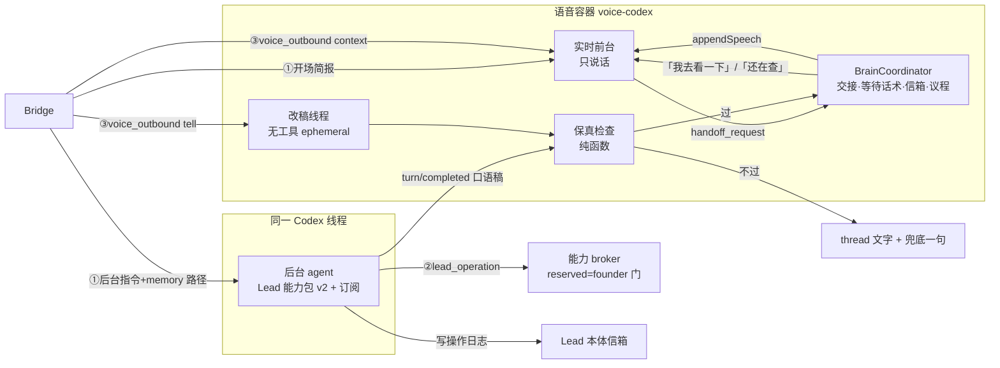
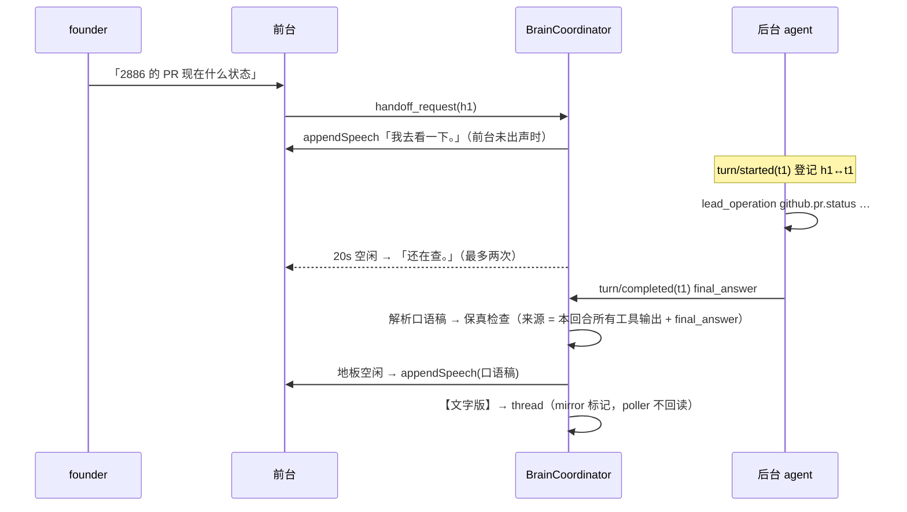

# FLY-2886 语音·B·核心·大脑 — 实施计划
Issue: FLY-2886 (https://linear.app/geoforge3d/issue/FLY-2886/语音b核心大脑-codex-自带后台-agent订阅与-lead-同权-记忆与上下文三层装载-口语转述关键字段一字不差-等待话术-20)
日期: 2026-09-25
基于: exploration.md、research.md

状态：draft（待 design review）。本文只设计，不含实现。

## 1. 一句话

把语音会话里 Codex 自带的后台 agent 从「一出现就被掐掉」改成「带着该 Lead 的全部工具、走订阅真正干活」，前台只负责说话：先说「我去看一下」，查到后用口语讲、编号数字人名一字不差，插话不丢结果；开场就知道自己是谁、在哪个房、能做什么。

## 2. 架构

原则：
- **一个线程两个角色**：实时前台（realtime model）与后台 agent（backing Codex model）共用一条 Codex 线程；前台没有工具，后台有 Lead 的全部工具。
- **大脑在传输之上**：所有新逻辑只依赖 `thread/*`、`turn/*`、`thread/realtime/itemAdded|appendSpeech|appendText` 与「用户语音开始/结束、前台输出开始/结束」四个信号；连接层换 WebRTC 时不动大脑。
- **单一真源**：「同权」= 复用 Lead 能力目录与 manifest 生成器，不另列工具清单；关键字段名册 = Bridge roster；founder-only 列表 = 目录 `reserved`。
- **开关即回滚**：每 Lead `voiceBackground.enabled=false` 时行为与今天完全一致（后台立即中断 + 交 Lead 本体 + 逐字念）。

## 3. 交接模式决策

`clientManagedHandoffs: true`（理由见 research §2）。`delegationAckFiller: false`（V3 生效，V2 忽略）。后台回合不再被 `turn/interrupt`；只在以下情况中断：会话结束、同会话已有 3 个后台回合在跑（第 4 个排队而非丢弃，见 §6.4）、开关关闭。

## 4. 组件与文件落点

| # | 组件 | 文件 | 说明 |
|---|---|---|---|
| C1 | 订阅登录 + 能力化 Codex 家 | `voice-codex/src/codex-home.ts`、`codex/CodexVoiceContainer.ts` | 新配置档 `VOICE_CODEX_HOME_CONFIG_V2`：去掉 `forced_login_method="api"` 与 ephemeral 凭据；`auth.json` 软链接到宿主真源（照 `claude-runner/src/codex-home.ts`）；app-server 带 Bridge 下发的能力 `-c` argv；`thread/start` 用 `permissions:"flywheel-lead-v2"`、`cwd`=Lead 项目根、`approvalPolicy:"never"`、`developerInstructions`=后台规约；`assertThreadReceipt` 改为按档位断言（enabled 档断言 permission profile 与 MCP 清单，关闭档保持旧断言）；启动后 `account/read` 断言 `authMode=chatgpt` |
| C2 | 语音会话能力激活 | `teamlead/src/lead-capabilities/runtime-factory.ts`（加入口）、新 `teamlead/src/bridge/voice-background-capability.ts` | Bridge 以 `activationId = voice:<sessionId>` 为所选 Lead 起一个能力 parent（同目录、同 manifest 生成器、同权限档、独立 broker socket 与 artifact 根）；会话结束或租约失效即 `close()`；返回给容器的只有受信路径与 argv，模型拿不到 |
| C3 | 浏览器 | 同 C2 | `founder_chrome`：追加 `chrome_devtools_founder` MCP = `chrome-devtools-mcp@<pin> --auto-connect --channel=stable`，`default_tools_approval_mode="approve"`；`isolated`：沿用 v2 门面；`off`：不给。每 Lead 配置 |
| C4 | BrainCoordinator | 新 `voice-codex/src/codex/BrainCoordinator.ts` | 交接登记（handoff_id↔turnId）、等待话术计时器、结果信箱、地板空闲判定、议程队列、重投上限；纯状态机 + 注入时钟，便于单测 |
| C5 | 口语稿与保真检查 | 新 `voice-codex/src/codex/SpokenScript.ts` | 解析后台最终回答（口语段 + `【文字版】` 段）；`checkFidelity(script, sources, roster)`；兜底稿 |
| C6 | 改稿线程 | 新 `voice-codex/src/codex/ScriptWriter.ts` | 同 app-server 的第二条 ephemeral 线程，read-only、无工具、`turn/start` + `outputSchema {spoken:string, threadText:string|null}`；超时 15s → 兜底稿 |
| C7 | 实时适配改造 | `codex/RealtimeTransport.ts`、`codex/CodexVoiceBackend.ts` | enabled 档：`turn/started` 不中断，改为上报 `onBackgroundTurn{started}`；新增 `turn/completed` 解析（final_answer 文本、status）；`input_audio_buffer.speech_started/stopped` 上报为地板信号；`handoffRequest` 改交 C4，不再 `handoffToLead` |
| C8 | 去掉逐字 | `codex/CodexProofSpeaker.ts`、`codex/CodexRoomFrontend.ts`、`daemon.ts` | enabled 档：`speak` 默认 `verification:"best_effort"`，不再因转写不等价失败；关键字段是否出现在转写里只记证据 `codex_spoken_key_fields`；`daemon.deliverOutbound` 不再逐段 `readback`，而是把行交给 C4 议程 |
| C9 | 三层上下文 | `teamlead/src/bridge/voice-session-context.ts`、`voice-session-services.ts` | 拆成 `realtimePrompt`（前台简报）与 `backgroundInstructions`（后台规约）；前台用 `formatBootstrap` + founder 注意力 + 受阻；memory 只放索引摘要；后台拿到 memory 文件的只读路径清单；删除 `:519` 只读边界与 `:540` 逐字规则（仅 enabled 档） |
| C10 | 新事件背景追加 | `teamlead/src/bridge/voice-session-poller.ts`、`StateStore.ts`、`voice-session-routes.ts` | `voice_outbound` 加列 `delivery_class TEXT NOT NULL DEFAULT 'tell'`（`tell`/`context`）与 `source TEXT NOT NULL DEFAULT 'thread'`（`thread`/`bridge_event`）；poller 每 tick 对比「简报键集」与当前状态，新键以 `message_id = bridge-event:<sessionId>:<key>` 入队（`INSERT OR IGNORE` 天然去重） |
| C11 | 写操作动作日志 | C2 的 broker 回执钩子 → `teamlead/src/bridge/voice-handoff.ts` 旁路 | 每个 `classification=write` 的 `lead_operation` 成功回执，追加一条动作日志到该 Lead 本体信箱（kind `voice_background_action`，含 operationId、目标、回执 id、会话 id），纯通知不要求 Lead 回复 |
| C12 | 2799 遗留 MEDIUM | `StateStore.claimVoiceOutbound`、`voice-session-routes.ts:593-610`、`voice-codex/src/daemon.ts:190-197,872-903` | claim 三态；`not_claimable` → 410 `voice_outbound_not_claimable`；daemon 跳过继续，只有 409 才判失租约 |
| C13 | 配置 | `teamlead/src/ProjectConfig.ts`（Lead 字段）、`voice-codex/src/config.ts` | `lead.voiceBackground?: { enabled: boolean; browser: "founder_chrome" \| "isolated" \| "off" }`，缺省 `{enabled:false}`；边界校验同 `codexVoiceActions` |

## 5. 三层装载（回答 founder 13:18 的问题）

### 5.1 第 1 层 开场简报（前台 `prompt`；连接层上 V3 后放 `initialItems`）

按顺序，总量 ≤ 6,000 token（超出按 §5.4 规则收缩，永不整体失败）：

1. **我是谁**：「我是 <Lead 名> 的语音分身，在 Flywheel 里替 <Lead 名> 跟你说话。」+ persona 的说话风格段（≤800 字符）。称呼她用「你」，不用 ChatGPT 账号上的名字。
2. **我在哪**：「你在 Discord <服务器名> 的语音房 <房名> 跟我说话；逐句文字和链接发在这个会话的文字 thread。」
3. **我能做什么 / 不能做什么**（由目录生成，不手写）：
   - 我自己：聊天、回答开场简报里就有的事。
   - 后台助手（有 <Lead 名> 的全部工具）：查 Linear / Bridge / 代码 / memory、改 issue、派 runner、开浏览器操作网页（你的 Chrome / 隔离浏览器 / 无，按配置）。
   - 不能：合并、ship、停 runner、批准 —— 这些要你本人在 Discord 卡片上批；我能帮你把请求提上去。
   - 我看不到你的屏幕；给不了可点的链接，链接我发到 thread。
   - **不确定能不能做时，先让后台查，查清再答；不夸口。**
4. **什么时候交后台**：「绝大多数问题你自己答：闲聊、常识、看法、简报里有的。只有需要查最新状态、读文件、上网、或者动手时才交给后台。交后台时你自己不要说话。」「只有她对你说话时才回应；背景里别人的声音不答。」「被打断就停，不续说旧话。」
5. **此刻状态**（`formatBootstrap` 格式化，标识符不截断）：在跑的单（issue、阶段、runner）、等你答的（ship 卡、founder gate、founder_ask，来自 `readFounderAttentionFacts`）、受阻的（stuck / parked / failed）。每节 ≤10 行，超出给「另有 N 条」。
6. **memory 索引摘要**：所选 Lead 的 MEMORY.md 只取索引行（`- [标题](文件) — 钩子`），≤4,000 字符；正文不进前台。

### 5.2 第 2 层 细节现查（后台 `developerInstructions` + 工具）

后台规约（`backgroundInstructions`，≤ 32,768 token，沿用现有上限）包含：身份全文、memory 文件只读路径清单（后台自己读，不再把正文塞进 prompt）、此刻状态全量（`formatBootstrap` 12,000 字符版）、以及以下规则：

- 最终回答格式：第一段是**要说给她听的口语稿**（短句、无 markdown、无链接、编号数字人名用原文阿拉伯数字与原样拼写、≤ 120 字）；如有链接或长内容，另起一段以 `【文字版】` 开头，容器会发到 thread。不要自己往本会话 thread 发消息。
- 写操作：用 `lead_operation`；遇到 409 / 幂等冲突 / 「已由常驻 Lead 处理」一律以常驻 Lead 为准，口语稿里说明「<Lead 名> 那边已经在处理了」。
- 改代码：默认派 runner，不在工作区直接改产品代码（Lead 裁定）。
- founder-only 操作被拒（`founder-workflow-required`）时，口语稿说「这个要你本人批，我已经把请求提上去了 / 你可以在 Discord 卡片上批」，不重试、不绕路（浏览器里也不点 merge / ship 按钮）。

### 5.3 第 3 层 会话中新事件（Bridge → `voice_outbound`）

事件键（简报时刻的键集写进 `voice_sessions.brief_keys_json`，poller 只推新键）：

| 事件 | 键 | 投递类 |
|---|---|---|
| 新的 founder 注意力项（待批 ship、founder gate、founder_ask） | `attention:<kind>:<id>` | `tell` |
| 该 Lead 的 runner 失败 / 受阻 | `session:<executionId>:<status>` | `tell` |
| 该 Lead 的 runner 开始 / 完成 / 进入 QA | `session:<executionId>:<status>` | `context` |
| Lead 本体在会话 thread 的回复（现有） | Discord message id | `tell` |

- `context`：容器 `appendText(role:"developer", "[背景] …只供你知道，不要主动念")`，合并节流 ≤1 条 / 10 秒，每条 ≤600 字符。
- `tell`：进议程（C4），经改稿 + 保真检查，在地板空闲时说；她正在说话或后台结果在说时排队。

### 5.4 体积与失败

- 前台简报超 6,000 token：先删 memory 索引、再按节从尾部删整行（`formatBootstrap` 既有规则），标识符永不截断；仍超 → 只保留 1-4 项 + 「状态我让后台去查」。
- 状态读取失败：该节写「现在读不到 <节名>，要的话我让后台查」，不再整场失败（`unavailable` 标志如实填，不再硬写 false）。

## 6. 运行时行为

### 6.1 一次委派的完整时序

### 6.2 关键字段保真检查（C5）

- 输入：口语稿 `S`、来源集 `C`（后台：本回合全部 `mcpToolCall` / `commandExecution` 输出文本 + final_answer 全文；改稿：Lead 原文）、名册 `N`。
- 规则 A（不凭空）：`S` 中每个关键字段在 `C` 中逐字出现。
- 规则 B（不丢号，仅改稿来源）：`C` 中的单号/PR 号必须出现在 `S`，除非 `S` 以 thread 指针结尾。
- 不过 → 兜底稿「这条我发到 thread 了，编号以文字为准。」+ 原文/`【文字版】`进 thread；证据 `codex_fidelity_rejected {rule, token}`。
- 关键字段正则见 research §3；只做大小写与全角/半角归一。

### 6.3 地板、等待话术、打断

- 地板空闲：无进行中用户语音段、无前台输出播放中，持续 ≥800ms。
- 「我去看一下。」：`handoff_request` 到达时若当前前台回应无音频帧 → 由我们说；已有音频帧 → 不补（证据 `ack_source`）。
- 「还在查。」：锚 = 最早未完成委派；20s、40s 各一次，需地板空闲（不空闲则顺延到空闲，但超过下一档时间点就跳过该次）；结果到即取消；每批委派最多两次。
- 打断：沿用现有「前台立停」；若被打断的是结果稿 / 议程稿，稿回到信箱队首（`attempts+1`），地板空闲后以「刚才查到的：」开头重说；`attempts>2` → 发 thread + 一句指针。插话导致的实时 generation 变化不清空信箱与委派登记。

### 6.4 并发与上限

- 同会话并行后台回合 ≤3；第 4 个 handoff 排队到有空位（不中断、不丢）。无「每场回合数」上限（FLY-2884 证明会挤掉真需求）。
- 多个结果同时就绪：按完成顺序说，每条之间留地板空闲。
- 会话结束时仍在跑的回合：`turn/interrupt`；已完成未说出的结果写进纪要的「未播结果」节交 Lead 本体。

### 6.5 写操作与 Lead 本体同步（C11）

`lead_operation` 回执为 write 类且成功 → Lead 本体信箱一条 `voice_background_action`（纯通知）。409 / 幂等命中 → 不写日志、口语稿说明常驻 Lead 已在处理。

## 7. 实现顺序（每步可单独验证）

| Step | 内容 | 验证 |
|---|---|---|
| 0 | 协议实测（订阅、单账号、≤3 场 ≤2 分钟）：① 0.156.1 WS V2 下 auth.json 订阅 + env API key 实时腿，后台回合是否走 chatgpt；② 实时腿 stop+start 重开时，进行中的后台回合是否继续并 `turn/completed`；③ `appendText(developer)` 在 V2 是否静默 | 证据 JSONL 进 `evidence/`；任何一条与本设计假设不符 → 停下报 Lead，改 plan |
| 1 | C2 能力激活打通：Bridge 为 `voice:<sessionId>` 起能力 parent，app-server 拿到 v2 MCP + 权限档；`lead_operation bridge.read sessions.list` 成功；`bridge.merge` 得到 `founder-workflow-required` | 集成测试 + 一次真 broker 调用 |
| 2 | C1 + C7：订阅家、能力 thread、后台不再中断、turn/completed 解析 | 单测 + Step 0 台架复跑 |
| 3 | C5 + C6：口语稿解析、保真检查、改稿线程 | 纯函数表驱动单测（含全角、大小写、缺号、凭空号） |
| 4 | C4：BrainCoordinator 状态机 | 注入时钟单测：20/40s 补话、最多两次、打断重投、并发 3+1 排队 |
| 5 | C8 + C9：去逐字、三层简报 | 快照测试（体积上限、收缩顺序、标识符不截断、unavailable 如实） |
| 6 | C10 + C11 + C12：新事件、动作日志、MEDIUM 修复 | StateStore / 路由 / daemon 单测；新列走迁移测试 |
| 7 | C3 浏览器 + C13 配置 | 配置边界单测；手动：后台打开一个网页并读标题 |

## 8. 测试计划（本机只跑相关测试）

- 单测（vitest，按包过滤，逐文件跑，排除 `**/tmux-viewer.macos.test.ts`）：
  - `voice-codex`：`SpokenScript`、`BrainCoordinator`、`ScriptWriter`（假 RPC）、`RealtimeTransport`（turn/completed、speech_started、enabled 档不中断）、`CodexVoiceContainer`（新家配置、授权断言、receipt 断言两档）、`daemon`（410 跳过、409 终止、议程投递）。
  - `teamlead`：`voice-session-context`（三层拆分、6,000 token 收缩、founder 注意力节）、`voice-session-poller`（事件键去重、delivery_class）、`StateStore`（新列迁移、claim 三态）、`voice-session-routes`（410）、`voice-background-capability`（manifest 与 Lead 同源、reserved 拒绝、close）、`ProjectConfig`（`voiceBackground` 校验）。
- 负向守卫：
  - 关闭档行为逐字节不变（现有测试全绿即证）。
  - 后台 agent 的 shell 读不到 `auth.json` 以外的凭据、连不上 127.0.0.1（沿用 `verifyModelIsolation`）。
  - 口语稿含未在来源出现的单号 → 必走兜底。
  - 前台 prompt 不含「逐字」「exactly as written」。
  - 后台往会话 thread 直接发的消息不会被念回（poller 过滤 + 测试）。
- 新增 StateStore 列不需新表，但需补迁移测试；若实现期改为新表，必须补 `fly-2006-retention-tables` 分类片段。
- 新增 spawn（改稿线程在同进程，不新增子进程；chrome-devtools-mcp 由 app-server 拉起）——若实现期新增任何 `spawn`/`kill`，按四本清册登记。

## 9. QA 验收映射（issue 验收 1-6）

| 验收 | 怎么测 | 通过判据 |
|---|---|---|
| 1 问需要查的事 | 真房（codex slot、`TEST_CODEX_LEAD_OUTBOUND_MODE=bridge`、`FLYWHEEL_VOICE_BACKEND=codex-realtime`），问「FLY-xxxx 的 PR 状态」 | 前台第一句「我去看一下」；结果口语、单号与 PR 号与 GitHub 一致；`account/read` authMode=chatgpt、后台腿无 API key 调用。实时腿在连接层落地前仍用 key，报告如实写 |
| 2 20 秒以上查询 | 让后台做一件 >45s 的查询 | 「还在查」出现 1-2 次，不多于 2 |
| 3 查询中插话 | 后台在跑时插话聊别的 | 前台立停；她说完后主动补「刚才查到的：…」；事件证据 `result_redelivered` |
| 4 开场简报一致 | 开场后抽 3 项与 `GET /api/sessions` / founder 注意力对照；会话中造一条待批 | 3/3 一致；新待批在她停顿后被说出，不打断 |
| 5 写操作与 founder 门 | 测试房里让它改测试 issue 状态 / 派空活；再让它 merge、停 runner | 前者成功且 Lead 信箱有动作日志；后者得到 founder-workflow-required，口语说明要她批 |
| 5b 浏览器 | 让它打开一个网页读标题 | `founder_chrome` 档在她 Chrome 打开并读出标题 |
| 6 纪律 | 只跑相关测试；拆 529 房前 ask Lead | 报告附命令与计数 |

## 10. 发布与回滚

- 合并后默认 `voiceBackground.enabled=false`，行为不变；QA 在测试 Lead 上开启；founder 验收后由 Lead 按 Lead 开启。
- 回滚：关开关即回到今天路径；数据库只加列（默认值兼容旧代码）。
- 部署仍由独立 updater 在其窗口执行；本单不部署、不重启服务。

## 11. 依赖与风险

| 项 | 说明 | 处置 |
|---|---|---|
| 连接层（兄弟单） | 实时腿订阅化、V3 `initialItems` | 本单与之并行；大脑只依赖线程级接口；验收 1「全程不走 API key」在连接层落地后整体成立 |
| 能力 parent 能否按会话起 | 它挂在 Lead activation 上（journal、delivery context） | Step 1 先打通；打不通停下报 Lead，不降级只读 |
| 订阅额度共享 | 后台回合与所有 Codex Lead / runner 共用账号 | 撞额度 → 口语「后台额度用完了，我先记下，稍后让 <Lead 名> 处理」+ 走旧交 Lead 路径；不自动换号 |
| 她的 Chrome 的规则级风险 | 见 research §5 | 可配置 `isolated`；HTML 如实写 |
| auth.json 刷新竞争 | 多进程共享真源 | 软链接真源（与 FLY-2358 runner 同法），不复制、不写 |
| 模型仍把闲聊交后台 | prompt 只能降低概率 | 证据计数 `handoff_smalltalk_suspect`（handoff 输入 <8 字且无单号/动词）供调 prompt；不做硬拦截 |

## 12. 不做什么

- 不做 WebRTC / V3 传输、Discord Opus 直转（连接层）。
- 不改 founder 门本身、不新增 founder-only 类别。
- 不在语音里念链接；不做多语言。
- 不改 Engine A（`openai-realtime`）与 `/gemini`、`/eleven`。
