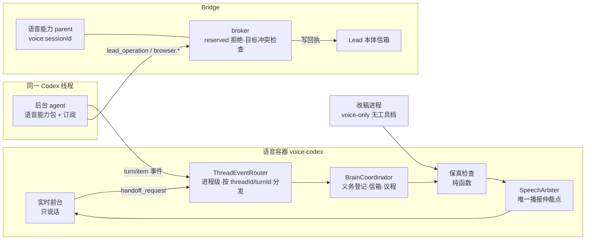
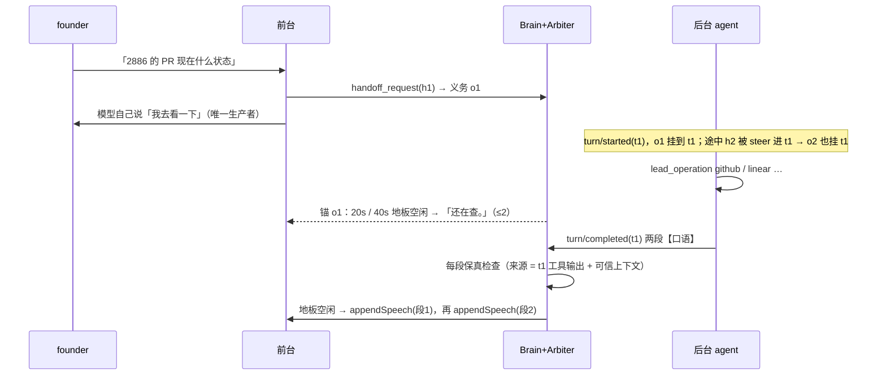

# FLY-2886 语音·B·核心·大脑 — 实施计划
Issue: FLY-2886 (https://linear.app/geoforge3d/issue/FLY-2886/语音b核心大脑-codex-自带后台-agent订阅与-lead-同权-记忆与上下文三层装载-口语转述关键字段一字不差-等待话术-20)
日期: 2026-09-25
基于: exploration.md、research.md

状态：v4 draft（R3 CHANGES_REQUESTED 后修订；R3 为规则上限轮，交 Lead 裁定）。本文只设计，不含实现。

修订记录：
- v4（R3）：目标锁 unknown 对双方都阻断写、只凭可信对账解除；补目标锁完整状态转换合同（等待绑定与移除、幂等、holder/fence 匹配、派发标记、崩溃/失联/重启恢复、回滚）；常驻 broker 只为开启语音后台的 Lead 接锁（控制影响面）；迟到交办涉及写时不诱导重做；地板兜底计时取补静音前的原始接收活动。
- v3（R2）：义务结算不再按段数推断、迟到交办有明确终态；授权合同贯穿 provider / envelope / Bridge scope / runner 路由；常驻优先改为 Bridge 托管的目标锁（语音与 Codex broker 写互斥），Claude 常驻路径如实写为尽力预检；地板以房间本地 VAD 为权威、按语音段身份复位、跨重开保留；确认语改为模型独占；改稿用独立的「无工具 + 订阅」配置档；拒绝按目录 classification 分类。
- v2（R1 + Lead 指令 ad0b344d）：后台并发改按「单活动回合 + start/steer」真实语义（删 3+1）；语音能力 parent 与常驻 Lead 的共存、授权、回执、撤销写清；C1 启动链改为专用启动档并列出准入改动；常驻优先改为 broker 目标级冲突检查 + 失败交接带操作账本；保真来源排除回答自身；后台事件订阅挂在进程级、不依赖实时腿；地板信号与唯一播报仲裁点；reserved 拒绝按真实错误码、只在确有卡片/回执时才说「已提交」；浏览器三档作为能力装配的可信输入、founder Chrome 走同一门面与回执钩子；权限下限 = 所有 Lead 权限并集；三条建议（议程收尾、改稿隔离、事件时效）纳入。

## 1. 一句话

把语音会话里 Codex 自带的后台 agent 从「一出现就被掐掉」改成「带着 Lead 的全部工具、走订阅真正干活」，前台只负责说话：先说「我去看一下」，查到后用口语讲、编号数字人名一字不差，插话不丢结果；开场就知道自己是谁、在哪个房、能做什么。

## 2. 架构



原则：
- **一个线程两个角色**：实时前台没有工具；后台 agent（backing Codex model）有语音能力包。
- **大脑在传输之上**：后台事件由进程级路由收取，不依赖实时腿是否 active；连接层换 WebRTC 时只换实时腿。
- **单一真源**：能力 = Lead 能力目录（`catalog.ts`）；founder-only = 目录 `reserved`；关键字段名册 = Bridge roster。
- **开关即回滚**：`voiceBackground.enabled=false` 时行为与今天完全一致。

## 3. 交接与并发（R1#1）

- `clientManagedHandoffs: true`：只意味着 Codex 不自动回送回答（schema 原文）；**不给客户端准入控制**。
- 真实语义（`core/src/session/turn_input.rs` `StartOrSteer`）：线程同一时刻最多一个活动后台回合；活动回合存在时，新的 handoff 输入被 steer 进该回合，不一定产生新的 `turn/started`。
- 因此 BrainCoordinator 以**义务（obligation）**建模：每个 `handoff_request` 生成一条义务（handoff_id、input_transcript、到达时刻）。归属规则（R2#1）：
  - 到达时有活动回合 → 挂该回合。
  - 到达时无活动回合 → 挂「待定」；5 秒内出现 `turn/started` → 挂新回合；5 秒内没有，但上一回合在义务到达前 ≤2 秒内终态（上游先路由输入、后发通知，可能已被上一回合处理）→ 挂上一回合并**只能结算为「未确认」**；两者都不是 → 结算为「未确认」。
  - 「未确认」不无限等待。口语按情况（R3#3）：上一回合**没有**写回执 →「刚才那件我没接上，你再说一次？」；上一回合**有**写回执或 unknown 回执 →「刚才那件的结果还没对应上，我先核对一下」，并先播该回合已有的终态结果与动作回执；她再次提起时，新义务携带原义务 id 与操作账本（§4.3），已成功的写不重做、unknown 先对账。
  - 测试：写已成功 + handoff 迟到 + 她重复原话 → 不产生第二次写。
  - 同一 handoff_id 重复到达只保留第一条。
- 回合终态时，其下所有义务一起结算。**不按回答段数推断哪件完成**：后台规约要求最终回答逐件回答（每件一段【口语】），答不了的件必须在回答里写一段【未完成】并说明；容器只播回答里实际写出的内容，不替模型宣称任何一件「已完成」或「没查完」。
- 测试：`started→completed→handoff`（迟到）、回合交界迟到通知、只答第二问、回答乱序；这些都只影响「未确认」提示与播出内容，不产生错误的完成声明。
- 不中断后台回合，除非：会话结束、开关关闭。**不设回合数上限**。
- Step 0 增加实测：第一个任务未完成时连续提第二、三个查询，记录 handoff/turn/steer 事件顺序与最终回答覆盖情况；与上述模型不符即停下改 plan。

## 4. 与 Lead 同权（Lead 指令 ad0b344d + R1#2/#3/#8/#9）

### 4.1 权限下限 = 所有 Lead 权限并集

- 能力清单：目录中**所有非 reserved 操作**，按本项目在宿主上实际具备凭据的集成（bridge、discord、linear、github、memory、docs、report、runner 派活、browser…）装配；**不以所选 Lead 自身的载体/档位裁剪**（Claude Lead 的语音分身也拿到同一并集）。
- 文件与命令：`flywheel-lead-v2` 权限档（凭据 deny、localhost deny、受管代理、写根 = 项目 worktrees）。读写代码能力在；按 Lead 裁定默认派 runner，不在 Lead 工作区直接改产品代码（规约级）。
- 浏览器：§4.4。memory：`memory.add/search` 读写 + memory 文件只读路径。
- founder-only：目录 `reserved`（ship/merge/terminate/restart/park/unpark/approve_to_ship、terminal.close）不进可执行清单。

### 4.2 语音能力 parent：授权、回执、共存、撤销（R1#2）

新增可信解析器 `resolveVoiceBackgroundCapabilities({project, leadId, sessionId, browserMode})`（`teamlead/src/lead-capabilities/voice-resolve.ts`），**不复用** `resolve.ts` 的 Codex department Lead 准入，不伪造 backend/profile：

| 项 | 设计 |
|---|---|
| 授权 | 新授权种类 `voice_session`：Bridge 校验「语音租约活跃 + 所选 Lead 在注册表当前 + 会话开关开启」，替代 `validateLeadCarrierAuthorization` 的载体授权；不抢占、不读写常驻 carrier 记录 |
| 身份 | manifest `leadId` = 所选 Lead，`activationId = voice:<sessionId>`，`actor = voice`；所有回执带 actor |
| journal | 每会话独立 journal 文件（`<stateDir>/voice-capability/<sessionId>/journal.db`）；**恢复只扫本会话 activation**，不调用按 project/Lead 全扫的 `recoverInterruptedParent`（避免把常驻在途回执改成 unknown） |
| delivery context | 每个后台回合一个 journal entry（entryId = turnId），回合开始进入、终态退出；同会话单活动回合与 §3 一致 |
| 撤销 | 会话结束 / 失租约 / 开关关闭 → `close()`：关 broker socket、关 providers、删除会话 artifact 根；在途 dispatched 回执标 unknown 并进纪要 |
| 验收 | 集成测试：常驻 Lead 有 dispatched 写时启动并关闭语音 parent，常驻回执状态不变 |

**授权合同贯穿到底（R2#2）**。现有 provider 与 Bridge 路由各自再校验 carrier（`runtime-context.ts:30-47,74-88`、`handlers/bridge-read.ts:143-155,219-227`、`bridge/lead-capability-scope.ts:35-48`、`bridge/lead-capability-runners.ts:20-33,92-134`）。改为一个显式的授权联合类型，沿整条链传递：

```ts
type LeadCapabilityAuthority =
  | { kind: "carrier"; carrierClaim: CarrierClaim }            // 常驻：原路径，字节不变
  | { kind: "voice_session"; projectName: string; leadId: string;
      sessionId: string; leaseFence: string };                 // 语音
```

- `runtime-context.ts`：构造 authority；`voice_session` 不走 Codex department 准入与 carrier 查询。
- 所有发 `carrierClaim` 的 handler（实现期 `git grep carrierClaim packages/teamlead/src/lead-capabilities/handlers` 全量改）改为发 `authority` envelope；strict envelope schema 接受两种 kind 之一。
- `lead-capability-scope.ts` 与 runner 路由：`carrier` 保持原检查；`voice_session` 校验「语音租约活跃且 fence 相符 + Lead 在注册表当前 + `voiceBackground.enabled`」，**在最终副作用前**再校验一次（撤销即时生效）。
- Step 1 用真实 Claude Lead 身份经完整链路完成一次读取与一次非 reserved 写；失租约 / 关开关后写被拒；常驻 Codex Lead 的既有路径回归不变。

### 4.3 常驻 Lead 优先（R1#4）

现有幂等键只在同一 requestId 内有效，跨 actor 不相撞，也没有资源版本 CAS；回执里也没有目标字段（`receipts.ts:31-38`）。常驻 Codex Lead 的 broker 在它自己的进程里，所以保护必须放在两边共享的 Bridge（R2#3）：

- **目标键**：目录为每个 write 操作新增 `targetKey(input)`，按业务目标归一化（linear issue → 规范化 identifier，如 `linear:FLY-2886`，UUID 与 identifier 别名先经 provider 解析到同一键；runner 派活 → `issue:FLY-2886`；github PR → `github:<repo>#<n>`；discord → `discord:<channel>:<thread>`）。缺 `targetKey` 的 write 对语音 actor fail-closed（测试覆盖全部 write 操作）。
- **Bridge 目标锁**：新表 `capability_target_locks(target_key PK, holder_actor, holder_activation, request_id, fence, acquired_at, deadline, dispatched_at, state)` 与 `capability_target_lock_waiters(target_key, activation, request_id, enqueued_at, deadline)`（两张都补 `fly-2006-retention-tables` 分类片段）与路由 `POST /api/lead-capabilities/target-lock/{acquire,mark-dispatched,release,reconcile}`。语音 broker 与常驻 **Codex broker** 在各自「最终副作用」之前 acquire、回执终态后 release；持锁期间另一方 acquire 返回 `target_busy`。
  - 常驻优先：常驻 acquire 遇到语音持锁时**排队等待**（不失败），语音 acquire 遇到常驻持锁或常驻排队时**立即拒绝** `resident_lead_active_on_target`。
  - 语音已派发后常驻到来：常驻等语音这次写结束再执行（常驻后写，结果以常驻为准）。
  - 回执 unknown（R3#1）：锁转 `state=unknown`，**对双方都阻断**该目标的写（语音得 `target_pending_reconcile` 并照实说；常驻也得 `target_pending_reconcile`，不放行），直到可信对账解除：
    1. broker 保留原 provider 调用的 promise，调用方超时后仍等它真正落定（HTTP 响应或连接中止），落定即写终态回执并解锁；
    2. 持有进程已死或 promise 丢失 → 只能由常驻 Lead 执行 `reconcile`（读目标当前状态、确认旧操作已落地或未落地后显式清锁，记审计行）；常驻拥有对账优先权与对账后的下一次执行权。
    - **不因 TTL 到期放行**已派发的写。
  - **锁状态转换合同**（R3#2），全部在 Bridge 单事务内：
    - `acquire(target, actor, activation, requestId, deadline)`：同 (activation, requestId) 重复调用返回同一授权（幂等）；空闲 → `held`（发新 fence）；被占 → 常驻写入 `waiters` 行（绑定 activation+requestId+deadline，deadline = 该操作现有 15s 期限的剩余部分，等待计入期限），语音直接拒绝。
    - `mark_dispatched(target, requestId, fence)`：持有者在最终副作用**前**调用；未标记即超期的 `held` 行可安全释放（证明未派发）。
    - `release(target, requestId, fence, outcome)`：必须匹配当前 holder+requestId+fence，否则 no-op 并返回当前状态（迟到 / 重复 release 无害）；释放后按入队顺序唤醒下一个 waiter。
    - waiter 移除：调用方取消、超时、失权时 broker 在 finally 里删；Bridge 也清理 deadline 已过的 waiter（它们从未派发，清理安全）。
    - 持有者崩溃 / release 丢失：`held` 且超 deadline → 未 `mark_dispatched` 则释放，已 `mark_dispatched` 则转 `unknown`（走上面的对账）。
    - Bridge 重启：`waiters` 全部清空（调用方收到错误后按原期限重试或失败）；`held`/`unknown` 行保留并按上面规则处理。
  - **影响面控制**：常驻 Codex broker 只对 `voiceBackground.enabled` 的 Lead 调用锁；其他 Lead 的写路径字节不变。
  - **回滚**：关 `voiceBackground.enabled` → 该 Lead 的常驻 broker 不再 acquire；存量 `held` 按规则自然释放，`unknown` 行保留待对账并在 Lead 信箱各发一条提醒；表保留（只增不删）。
  - 验收（窄集成）：「语音超时 → 常驻尝试写 → 旧 provider 晚成功」断言常驻被 `target_pending_reconcile` 挡住直到旧调用落定；排队者取消；acquire 后进程死亡（已/未 mark_dispatched 两支）；release 丢失 / 迟到；Bridge 重启。
  - 回执表增加 `target_key` 列与索引，两边都写，用于对账与纪要。
- **诚实边界**：Claude 常驻 Lead 的写不经 Codex broker，拿不到这把锁。对 Claude Lead，语音侧只能做「写前查 Bridge 最近动作 + 写后动作日志通知」，**不能保证**不被在途写覆盖；HTML 与口语能力说明如实写。
- runner 派活另有 Bridge 既有准入（同 issue 活跃 session 冲突），错误码原样分类。
- **文案按真实回执**：只有回执来源确为常驻 Lead 时才说「Lead 那边已经在处理」。
- **失败交接带账本**：撞额度或会话异常回退「交 Lead 本体」时，handoff payload 附本会话操作账本（成功 / 未执行 / 结果未知，各带 requestId、operationId、目标键）；成功项不重做，unknown 由 Lead 先对账。
- 验收：两个 actor、不同 requestId、同目标；写成功后额度耗尽；回执 unknown 后交接。

### 4.4 浏览器三档（R1#9，Lead 已同意默认 founder_chrome）

浏览器模式是能力装配的**可信输入**，同时决定 provider、manifest、MCP、有效配置断言与生命周期：

| 档 | provider | 暴露给模型 |
|---|---|---|
| `founder_chrome`（默认） | 新 provider：chrome-devtools-mcp `--auto-connect --channel=stable` 连她的 Chrome（首次连接 Chrome 弹允许框） | 同一个浏览器门面 `chrome_devtools`（`browser-capability-proxy.ts`），只有一套浏览器 |
| `isolated` | 现有隔离 Seatbelt worker | 同上 |
| `off` | 无浏览器 provider；**保留**模型网络代理 | 无浏览器工具；manifest 无 `browser.*`、有效配置断言相应变化 |

- founder Chrome 的调用仍经门面 → broker，沿用目录对 `browser.*` 的 read/write 分类与回执，因此 §6.6 的写日志钩子覆盖它；写回执成功而通知失败时按同一回执幂等补送。
- 三档都用实际工具发现（MCP tools/list）验证，不只比配置字符串。
- 诚实边界：在她 Chrome 里，founder-only 对网页按钮是规约级约束（与 Claude Lead 现状同等暴露）。

### 4.5 founder-only 拒绝怎么说（R1#8）

- 真实错误码：模型调用 manifest 外操作得到 `operation_not_in_manifest`（`lead-capability-proxy.ts:196-201`），直达 broker 得到 `reserved_operation`（`broker.ts:164-165`）。按请求 operationId 在可信目录里的 classification 分类（R2#7）：`reserved` → `founder_only_denied`；非 reserved 但不在本会话 manifest（缺凭据、browser=off）→ `unavailable`，口语「这场没开这个能力」；目录里不存在 → `invalid`。只有 `founder_only_denied` 走下面的文案与 Lead 信箱记录。
- manifest 的能力说明从目录 `reserved` 生成「不能做」清单（进开场简报与后台规约）。
- 本单**不新增** founder 请求提交入口。口语只说真的事实：若 founder 注意力里已有对应卡片（ship 卡 / founder gate）→「这个要你在 Discord 卡片上批」；否则 →「这个只能你本人做，我已经记给 <Lead 名>」，且必须拿到 Lead 信箱写入回执后才这么说；写入失败 →「这个只能你本人做」。
- 验收：merge、停 runner 均被拒并按上述文案说出；Lead 信箱有对应记录。

## 5. 三层装载（回答 founder 13:18）

### 5.1 第 1 层 开场简报（前台 `prompt`；V3 后放 `initialItems`）

总量 ≤ 6,000 token，超出按 §5.4 收缩，永不整体失败：
1. **我是谁**：「我是 <Lead 名> 的语音分身」+ persona 说话风格段（≤800 字符）；称呼她用「你」，不用 ChatGPT 账号名。
2. **我在哪**：「你在 Discord <服务器名> 的语音房 <房名> 跟我说话；逐句文字和链接发在这个会话的文字 thread。」
3. **能做 / 不能做**（由语音能力 manifest 与目录 reserved 生成）：我自己聊天、答简报里有的；后台助手有所有 Lead 的工具（列类别）；不能：合并、ship、停 runner、批准；看不到你的屏幕；链接发 thread。**不确定能不能做时先让后台查，不夸口。**
4. **何时交后台**：闲聊、常识、看法、简报里有的自己答；要查最新状态、读文件、上网、动手才交；交后台前说且只说「我去看一下」；只回应对你说的话；被打断就停，不续旧话。
5. **此刻状态**：`formatBootstrap` 格式（每节 ≤10 行、标识符不截断），加 founder 注意力（`readFounderAttentionFacts`）与受阻（stuck / parked / failed）。
6. **memory 索引摘要**：MEMORY.md 索引行，≤4,000 字符。

### 5.2 第 2 层 细节现查（后台 `developerInstructions`）

≤ 32,768 token：身份全文、memory 文件只读路径清单、状态全量（12,000 字符版）、规则：
- 最终回答格式：每个请求一段，段首 `【口语】`（短句、无 markdown、无链接、编号数字人名照原文、≤120 字），可选 `【文字版】`（链接与长内容，容器发 thread）。不要直接往本会话 thread 发消息。
- 写操作用 `lead_operation`；被 `resident_lead_active_on_target` 拒绝即停，照实说。
- 改代码默认派 runner。
- founder-only 被拒不重试、不绕路（浏览器里也不点 merge/ship/批准按钮）。

### 5.3 第 3 层 会话中新事件（R1#12）

| 事件 | 键 | 投递类 |
|---|---|---|
| 新 founder 注意力项 | `attention:<kind>:<id>` | `tell` |
| 该 Lead 的 runner 失败 / 受阻 | `session:<executionId>:<status>` | `tell` |
| runner 开始 / 完成 / 进 QA | `session:<executionId>:<status>` | `context` |
| Lead 本体在会话 thread 的回复（现有） | Discord message id | `tell` |

- 只为 `voiceBackground.enabled` 且引擎 B 的会话生产；关闭档与 Engine A 不产生新行（测试）。
- 键集：简报时刻写入 `voice_sessions.brief_keys_json`；poller 推新键，`message_id = bridge-event:<sessionId>:<key>`（`INSERT OR IGNORE` 去重）。
- `tell` 播前复核：注意力项已解决 / 状态已变 → 丢弃（证据 `agenda_stale_dropped`）。
- `context`：`appendText(developer, "[背景] …只供你知道，不要主动念")`，合并节流 ≤1 条/10s、≤600 字符；同时写入会话「最近背景」环（≤10 条），实时腿重开时与最新简报一起重新装入 prompt。
- 关闭开关 / 回滚：未投递的 `context` 行置 `dropped`；旧 daemon 只按 `delivery_class` 缺省 `tell` 理解（新列默认值），enabled 会话之外不会出现 `context` 行。

### 5.4 体积与失败

超 6,000 token：先删 memory 索引，再按节从尾部删整行（`formatBootstrap` 规则），标识符永不截断；仍超 → 只保留 1-4 项 + 「状态我让后台去查」。状态读取失败：该节如实写「现在读不到」，`unavailable` 如实填。

## 6. 运行时行为

### 6.1 一次委派时序



### 6.2 进程级后台事件（R1#6）

- `ThreadEventRouter`（`voice-codex/src/codex/ThreadEventRouter.ts`）在 `CodexVoiceProcess` 启动时订阅一次通知，按 `threadId`/`turnId` 分发 `turn/started|completed`、`item/started|completed`、handoff 相关事件；**不依赖** `RealtimeTransport` 的 active 状态。`RealtimeTransport` 只处理 `thread/realtime/*` 音频与转写，按 generation 隔离。
- enabled 档：`item/started`（commandExecution/mcpToolCall）不再 `turn/interrupt`；关闭档保持原中断与 fence。
- 终态：`completed` 且有最终回答 → 结算；`completed` 无最终回答 / `failed` / `interrupted` → 义务结算为失败，口语「这件没查成」+ 原因类别（额度 / 权限 / 出错），细节进 thread。
- 测试：完成事件分别落在「旧 transport cancel 等待中」「新 transport opening」「新 transport started 后」三个位置都进入信箱；真实工具 item 序列不被中断。

### 6.3 关键字段保真检查（R1#5）

- 来源集 `C`：本回合**实际完成的工具结果**（`mcpToolCall` / `commandExecution` 输出，保留 itemId）、本会话可信上下文（开场简报快照、Bridge 事件文本）、她本次请求的转写。**排除**最终回答本身及其 `【文字版】`。改稿来源 = Lead 原文。
- 规则 A（不凭空）：`S` 中每个关键字段须在 `C` 中以**完整 token** 出现（边界匹配：`12` 不能由 `312` 支撑；`FLY-28` 不能由 `FLY-2886` 支撑）。
- 规则 B（不丢号，仅改稿）：Lead 原文中的单号 / PR 号须出现在稿中，除非稿以 thread 指针结尾。
- 不过 → 兜底稿「这条我发到 thread 了，编号以文字为准。」+ `【文字版】`或原文进 thread；**只有 thread 发布成功才说这句**，否则说「编号我没核对上，等下再给你」并进纪要。
- 测试含循环来源反例（工具返回 FLY-2886 / PR #2886，回答写 FLY-9999 / PR #9876 → 必走兜底）。

### 6.4 地板信号与唯一仲裁点（R1#7）

- `SpeechArbiter` 是所有非前台自发语音（补话、结果、议程、兜底）的唯一出口；一次只放一条。确认语不经它（模型独占，见下）。
- user-active（R2#4）：**以房间本地 VAD（RoomIO 上行 Silero 语音段）为权威**，它按说话人的语音段（utteranceId）开始/结束，不受实时腿重开影响（重开期间房间音频照常经 VAD，并被缓存回放）。provider 的 `speech_started{item_id}` 只作补充：记为「开放段 item_id」，只由**同一 item_id** 的 completed / final 关闭；迟到的旧段 final 不能关闭新段。user-active = 任一本地语音段未结束 或 任一 provider 开放段未关闭。实时 generation 切换**不**复位 user-active；provider 开放段在 generation 切换时丢弃（本地 VAD 仍在）。兜底（R3#4）：计时取**补静音之前**的原始接收活动（`Uplink.ts` 原始帧入口，不看每 20ms 补齐的静音 tick）；本地语音段已结束且原始接收无有效语音 ≥3 秒 → 清掉没有结束事件的 provider 补充段（只清开始时间早于本地段结束的旧段，不影响正在说的新段）。测试：本地已结束 + provider final 缺失 + 静音 tick 持续 → 3 秒后恢复地板。V3 的 provider 信号由连接层接缝提供，本地 VAD 规则不变。
- output-active：`response-started` 置位，`response-done` / `response-cancelled` / 播放结束复位；断线 / generation 切换复位（输出取消只释放播放，不影响 user-active）。
- 地板空闲 = 两者皆否且持续 ≥800ms。
- 「我去看一下」只有一个生产者（R2#5）：**模型独占**。前台 prompt 固定「交后台前说且只说『我去看一下』」；V3 同时设 `delegationAckFiller:false`，关掉服务端默认填充语；客户端**永不**播确认语，SpeechArbiter 不含确认语出口。模型漏说时不补（避免与迟到的模型音频竞争）；Step 0 实测措辞遵从率，作为兼容性证据写进报告，不作为去重机制。
- 「还在查」：锚 = 最早未结算义务；20s、40s 各一次，需地板空闲（顺延不越过下一档）；结算即取消；≤2。
- 打断：结果 / 议程稿被打断 → 回队首，`attempts+1`，每次重投用新 pendingKey（`<业务 id>:attempt:<n>`，业务 id 稳定）；以「刚才查到的：」开头；`attempts>2` → 发 thread + 一句指针。

### 6.5 议程收尾与纪要（R1#10）

- `daemon.deliverOutbound` 对 `tell` 行：claim → 交 BrainCoordinator → **等其终态**（spoken / fallback_posted / stale_dropped / failed）→ 才提交 receipt（`confirmed`=spoken、`dropped`=stale、`failed`=其余）。
- 会话关闭：先把未播结果与未投递议程导出到现有纪要（`cli.ts:609-629` 的 minutes 输入新增 `unplayed[]`），再释放容器；后台在途回合 `turn/interrupt`，其义务写「未完成」。

### 6.6 写操作日志（C11）

broker 对 actor=voice 的 write 类回执（含 `browser.*` 写）成功 → Lead 本体信箱 `voice_background_action`（operationId、目标键、回执 id、会话 id；通知按回执 id 幂等）。

### 6.7 改稿（R1#11）

改稿不在后台线程所在进程里做（那里装了可写 MCP）。新增独立配置档 **voice-scribe**（R2#6），把「工具策略」与「登录策略」分开：
- 工具策略：沿用 voice-only 的禁用集（`mcpArgv: []`、shell / unified_exec / web_search / memories / apps / plugins / browser_use / computer_use / multi_agent / hooks 全关，read-only，ephemeral）。
- 登录策略：订阅；独立受管 home（`<scratch>/scribe-<sessionId>/home`），`auth.json` 软链接宿主真源，**不写** `forced_login_method="api"`，子进程 env 不含 `OPENAI_API_KEY` 与业务 MCP 变量。
- 新常量 `VOICE_SCRIBE_HOME_CONFIG` + `assertVoiceScribeHome`；旧 voice-only 档与 `assertVoiceCodexHome` 原样保留。
- 构造与销毁：由容器随会话创建、会话结束删除（与现有 container root 同法）。
- 启动断言：`account.type === "chatgpt"`、`config/read` 与工具发现为空工具集、一次普通 `turn/start` 成功。
- 用法：`turn/start` + `outputSchema {spoken: string, threadText: string|null}`，输入作为数据；本地校验 JSON 与长度；15s 超时 → `turn/interrupt` 该回合、丢弃迟到结果、走兜底。

## 7. 组件与文件落点

| # | 组件 | 文件 |
|---|---|---|
| C1 | 语音能力启动档（R1#3） | `teamlead/src/lead-backends/codex/codex-lead-runtime.ts`：`spawnCodexAppServer` 新增显式 `profile: "voice-capability"` 分支（可同时带 `capabilityModelEnv` 与实时腿临时 `voiceProfile`），**不放宽**其他调用方的互斥守卫；`voice-codex/src/codex-home.ts` 新增 `VOICE_CAPABILITY_HOME` 校验（home/config 唯一构造者 = 语音能力 parent）；`native-skill-baseline.ts` 为语音所用二进制版本补采基线（按现有采集流程，不放宽比较）；`CodexVoiceContainer.ts`：账户断言 `account.type === "chatgpt"`，权限按 thread 回执 + `config/read`，MCP 按有效配置 + tools/list |
| C2 | 语音能力 parent | 新 `teamlead/src/lead-capabilities/voice-resolve.ts`、`voice-capability-parent.ts`；`runtime-parent.ts` 抽出「按 activation 恢复」入口；`broker.ts` 加 actor 与目标冲突检查（§4.3）；`catalog.ts` 为 write 操作加 `targetKey`；授权联合类型贯穿 `runtime-context.ts`、全部发 carrierClaim 的 handlers、`bridge/lead-capability-scope.ts`、`bridge/lead-capability-runners.ts`；Bridge 目标锁表 + `bridge/lead-capability-target-lock.ts` 路由 + retention 片段；回执表加 `target_key`；常驻 Codex broker 接入 acquire/release |
| C3 | 浏览器三档 | `lead-capabilities/browser-provider.ts` 加 founder-chrome provider；`buildCodexLeadMcpArgv.ts` 接受 browserMode；有效配置断言按档 |
| C4 | BrainCoordinator + SpeechArbiter | 新 `voice-codex/src/codex/{BrainCoordinator,SpeechArbiter}.ts` |
| C5 | 口语稿与保真 | 新 `voice-codex/src/codex/SpokenScript.ts` |
| C6 | 改稿 | 新 `voice-codex/src/codex/ScriptWriter.ts`（新 voice-scribe 档进程：`VOICE_SCRIBE_HOME_CONFIG` + `assertVoiceScribeHome`） |
| C7 | 进程级事件路由 + 实时适配 | 新 `ThreadEventRouter.ts`；`RealtimeTransport.ts`、`CodexVoiceBackend.ts`、`CodexVoiceContainer.ts`（按档） |
| C8 | 去逐字 | `CodexProofSpeaker.ts`（enabled 档 `best_effort`、关键字段只记证据）、`CodexRoomFrontend.ts`、`daemon.ts`（§6.5） |
| C9 | 三层上下文 | `teamlead/src/bridge/voice-session-context.ts`、`voice-session-services.ts` |
| C10 | 新事件 | `voice-session-poller.ts`、`StateStore.ts`（`voice_outbound` 加 `delivery_class`、`source`；`voice_sessions` 加 `brief_keys_json`）、`voice-session-routes.ts` |
| C11 | 写日志 | C2 broker 回执钩子 → Lead 信箱 |
| C12 | 2799 MEDIUM | `StateStore.claimVoiceOutbound` 三态；路由 410 `voice_outbound_not_claimable`；`daemon.ts:190-197,872-903` 跳过继续 |
| C13 | 配置 | `ProjectConfig.ts` `lead.voiceBackground?: {enabled, browser}`，缺省 `{enabled:false}`；`voice-codex/src/config.ts` |

## 8. 实现顺序

| Step | 内容 | 验证 |
|---|---|---|
| 0 | 协议实测（订阅、单账号、≤4 场 ≤2 分钟）：① WS V2 下 auth.json 订阅 + env API key 实时腿，后台回合 `account.type=chatgpt`；② 实时腿 stop+start 时进行中回合继续且客户端（进程级订阅）收到 `turn/completed`；③ `appendText(developer)` V2 静默；④ 活动回合中连续提第二、三个查询的 handoff/turn/steer 顺序；⑤ 模型确认语措辞遵从率（10 次，只作兼容性证据）；⑥ 改稿 voice-scribe 档订阅 + 空工具集 | 证据 JSONL 进 `evidence/`；与假设不符 → 停下报 Lead 改 plan |
| 1 | C2 + C1：语音能力 parent 与启动档；read 成功、reserved 被拒（真实错误码）；**常驻 Lead 有在途写时启停语音 parent，常驻回执不变**；关闭后 socket 不可连；授权联合类型贯穿（真实 Claude Lead 身份一读一写、失租约/关开关后写被拒、常驻 Codex 路径回归不变） | 集成测试 + 一次真 broker 读写 |
| 2 | C7：事件路由、enabled 不中断、终态处理、三种完成时机 | 单测 + Step 0 台架复跑 |
| 3 | C5 + C6：口语稿、保真（含循环来源反例、token 边界）、改稿进程空工具集 | 表驱动单测 |
| 4 | C4：义务归属（迟到 / 交界 / 只答第二问 / 乱序）、仲裁、本地 VAD 地板（旧段 final 迟到、跨 restart 连续说话）、补话 ≤2、打断重投新 key | 注入时钟单测 |
| 5 | C8 + C9：去逐字、三层简报 | 快照测试（体积、收缩、标识符不截断、unavailable 如实） |
| 6 | C10 + C11 + C12 + §4.3 | StateStore/路由/daemon/broker 单测：目标锁两种到达顺序、慢 provider、超时 unknown 锁不自释放、别名归一、额度耗尽带账本、410 跳过 |
| 7 | C3 + C13 | 三档实际工具发现；founder Chrome 写操作有 Lead 信箱记录 |

## 9. 测试计划（本机只跑相关测试）

- 按包、按文件跑 vitest；排除 `**/tmux-viewer.macos.test.ts`；teamlead 里起 Bridge 的用例先隔离 `FLYWHEEL_CODEX_HOMES_ROOT`。
- 负向守卫：关闭档行为不变（既有测试全绿）；shell 读不到凭据、连不上 127.0.0.1（`verifyModelIsolation`）；保真循环来源反例；前台 prompt 不含「逐字」「exactly as written」；后台直发会话 thread 的消息不被念回；非 enabled 会话不产生 `context` 行；常驻回执不被语音 parent 恢复逻辑改写；写操作缺 `targetKey` 时语音 actor fail-closed。
- 迁移：新列带默认值 + 迁移测试；新表 `capability_target_locks`、`capability_target_lock_waiters` 必须补 `fly-2006-retention-tables` 片段。
- 新增 spawn（改稿进程、founder-chrome provider）按 shell 枚举 / child-process census / kill-path inventory 清册登记。

## 10. QA 验收映射

| 验收 | 测法 | 判据 |
|---|---|---|
| 1 | 真房（codex slot、`TEST_CODEX_LEAD_OUTBOUND_MODE=bridge`、`FLYWHEEL_VOICE_BACKEND=codex-realtime`）问「FLY-xxxx 的 PR 状态」 | 先「我去看一下」；口语结果单号/PR 号与 GitHub 一致；后台 `account.type=chatgpt`。实时腿在连接层落地前仍用 key，报告如实写 |
| 2 | >45s 查询 | 「还在查」1-2 次 |
| 3 | 后台在跑时插话 | 前台立停；她说完补「刚才查到的：…」 |
| 4 | 开场抽 3 项对照 Bridge；会话中造一条待批 | 3/3；新待批在停顿时说出；已解决的不说 |
| 5 | 改测试 issue 状态 / 派空活；再让它 merge、停 runner | 前者成功且 Lead 信箱有动作日志；后者被拒，文案符合 §4.5 |
| 5b | 打开网页读标题（founder_chrome） | 成功；若是写操作有日志 |
| 5c | 常驻 Codex Lead 正在改同一张单时让语音改它；以及语音先写、常驻后到 | 前者被 `resident_lead_active_on_target` 拒并照实说；后者常驻排队后执行，结果以常驻为准。Claude 常驻按 §4.3 诚实边界只验预检与日志 |
| 6 | 纪律 | 只跑相关测试；拆 529 房前 ask Lead |

## 11. 发布与回滚

合并后默认 `enabled=false`；QA 在测试 Lead 开；founder 验收后按 Lead 开。回滚 = 关开关；数据库改动 = `voice_outbound`/`voice_sessions`/回执表加列 + 新表 `capability_target_locks` 与 `capability_target_lock_waiters`（只增不删，回滚处置见 §4.3）。部署由独立 updater 执行，本单不部署、不重启。

## 12. 依赖与风险

| 项 | 处置 |
|---|---|
| 连接层（兄弟单） | 大脑只依赖进程级事件与 `appendSpeech/appendText`；地板信号接缝写明；验收 1「全程不走 API key」待连接层整体成立 |
| 语音能力 parent 与常驻共存 | Step 1 集成测试先行；不成立即停下报 Lead，不降级只读 |
| 订阅额度共享 | 撞额度 → 口语说明 + 带账本回退交 Lead；不自动换号 |
| 她的 Chrome 规约级风险 | 可切 `isolated`；HTML 如实写 |
| auth.json 刷新竞争 | 软链接宿主真源（FLY-2358 同法），不复制不写 |
| 模型仍把闲聊交后台 | 证据计数 `handoff_smalltalk_suspect`，不硬拦 |

## 13. 不做什么

不做 WebRTC/V3 传输与 Opus 直转；不改 founder 门、不新增 founder 请求入口；不在语音里念链接；不改 Engine A、`/gemini`、`/eleven`；不建线程池或第二套消息存储。
