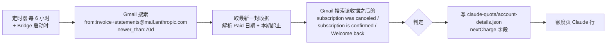

# FLY-2894 Claude 下次扣费日来源 — 实施计划（推荐接入方案）
Issue: FLY-2894 (https://linear.app/geoforge3d/issue/FLY-2894/调研-claude-账号下次扣费日从哪里能稳定读到邮件收据-claudeai-网页账单-stripe-门户逐个号实测给出可接进额度页的来源)
日期: 2026-09-25
基于: research.md

> 本单是只读调研，**不实施**。下面是给后续实施单用的方案，需要 founder 先做两个决定（§1）才能开单。

## 0. 结论一句话

**推荐：从各号 Gmail 里的 Anthropic 收据邮件读取。**
最近一封收据的「本期结束日」就是下次扣费日。如果那封收据之后又收到取消邮件，就改写成「已取消，某日到期」。

这条路径不碰任何 Claude 凭据，符合条款，可以无人值守。
personal 已和 claude.ai 接口交叉核对一致（10-04 = 10-04）。

| 方案 | 准确度 | 条款 | 无人值守 | 结论 |
|---|---|---|---|---|
| A 收据邮件（Gmail API）| 日期准。只写到日，不含时刻 | 合规 | 能（需要 Gmail 授权）| **推荐** |
| B claude.ai `subscription_details`（cookie）| 最准，到秒 | **违反**，founder 已否决 | 要存 5 份 cookie | 不推荐 |
| C Stripe 门户 | — | — | Anthropic 未开放 | 不可用 |
| D 应用内订阅 | — | — | 没有号走这条 | 不适用 |
| E 开通日推算 | 3/3 反例 | — | — | 禁止 |

## 1. 需要 founder 决定的

1. **允许读收据邮件吗？** FLY-2830 research §5 里记着「Stripe 收据邮件 founder 9-24 已否决」，但设计页只写了否决 cookie。
   founder 今天要求重新调研这一项，本单按「重新开放」处理。如果 9-24 的否决仍然有效，就走 §5 的「读不到」文案。
2. **重新授权 4 个邮箱。** gog 的 4 个授权目前全部失效（`invalid_grant`），school 的 Google 会话也要重新输密码。
   这一步只能 founder 本人做：`! gog auth add <邮箱>`，权限最好只给 `gmail.readonly`。
   失效原因还没查（可能是 OAuth 应用处于 Testing 模式，授权 7 天就过期）。**实施单第一步要先查清这一点。** 否则每周都要重新授权，这条路就谈不上稳定。

## 2. 读取路径

- 号与邮箱的对应：用 `claude-accounts.json` 的 `identity.email` 找到 gog 的授权账号。
- 读邮件的方式：`gog --account <邮箱> gmail messages search … --json`，再对最新一封执行 `gog gmail get <id>`。
  正文只在内存里解析，解析完就丢，**不落盘**。
- 只提取两类行：
  - `Paid <Month D, YYYY>`
  - `<Mon D>–<Mon D>, <YYYY>`，跨年时是 `<Mon D, YYYY>–<Mon D, YYYY>`
- 只保存这些字段：`{account, periodStart, periodEnd, paidOn, receiptDate, canceledAfterReceipt, readAt, status}`。
  不保存金额、卡号、正文。
- 同一天可能有两封收据（例如 5x 首付加上升级 20x 的补差价），两封的本期起止相同，取 `periodEnd` 最大的那封即可。

## 3. 判定规则（按顺序，先命中的算数）

| 条件 | status | 页面文案 |
|---|---|---|
| 号的 profile `billing_type = none` 或者是免费套餐 | `free` | 「免费号，无扣费」|
| 这个邮箱没有有效授权（gog 报 `invalid_grant` 或没有账号）| `mail_auth_missing` | 「读不到：邮箱授权失效（<邮箱>），需要重新授权」|
| 70 天内没有收据 | `no_receipt` | 「读不到：邮箱里近 70 天没有 Anthropic 收据」|
| 收据正文里认不出本期起止 | `parse_failed` | 「读不到：收据格式没认出（<日期> 那封）」，**不猜** |
| 最新收据之后有取消邮件，而且取消之后没有确认 / 重订邮件 | `canceled` | 「已取消，<periodEnd> 到期不续费」|
| `periodEnd` 已经过去 1 天以上，还没有新收据 | `overdue` | 「<periodEnd> 应扣费，未见新收据（可能扣费失败或已停）」|
| 其余情况 | `ok` | 「<MM/DD> 扣费 · 据 <MM/DD> 收据」|

每一行都附「读于 HH:MM」（PT），与 FLY-2830 已经上线的「用量读于 / 卡读于」并列显示。

## 4. 刷新频率

- 扣费日只会在「扣费 / 取消 / 重订」时变化。每 6 小时读一次，加上 Bridge 启动时读一次，就够了。
  每个号每轮最多 2 次搜索加 1 次读取，Gmail 配额可以忽略。
- 读失败时保留上次成功的值，并标明「沿用 HH:MM 读数」。如果上次成功距今超过 48 小时，就不再沿用，改为显示失败原因。

## 5. 如果 founder 不批准读邮件（或授权修不好）

额度页这一格的文案改成：

> 「读不到：Anthropic 只在 claude.ai 账单页和收据邮件里给出扣费日。前者需要保存网页登录（违反条款，已否决），后者没有接入。」

已取消的号仍显示「已取消」，免费号显示「免费号，无扣费」。不显示推算值。

## 6. 实施单的验收要点（供后续开单）

- personal 的邮件结果要和 claude.ai 账单页人工对照一次。本单已经对过：10-04 = 10-04。
- 用 fixture 测解析器：同日两封收据、跨年周期、取消后重订（personal 07-31 / 08-03 那种周期不变的情况）、取消后不重订（business 07-21 那种）、模板认不出。
- 日志和页面里**不能出现**邮件正文、金额、卡号、token。
- school 号在重新授权后补测一次，确认 Northwestern Workspace 允许 gog 读邮件。

## 7. 本单明确不做

- 不改生产配置，不接入代码，不重新授权 gog（需要 founder 本人操作）。
- 不保存、也不复用 claude.ai cookie。
- 不去访问收据里的 Stripe 托管链接。
