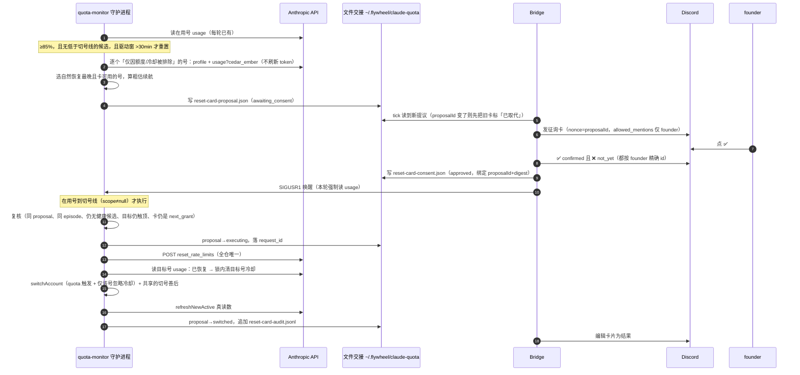

# FLY-2896 满额时征得同意用充值卡续号并切过去 — 实施计划
Issue: FLY-2896 (https://linear.app/geoforge3d/issue/FLY-2896/claude-切号充值卡-5-小时额度到-80-90percent-且没有别的可用号时挑最晚自然重置的号征得-founder)
日期: 2026-09-25
基于: research.md, exploration.md

> v2（2026-09-25）：并入 Claude bar-raiser 第 1 轮 9 条阻断 + 采纳的建议项（`design-review/claude-round1.md`）。
> v3（2026-09-25）：并入 Codex R1 8 条阻断 + 2 条建议（`design-review/codex-round1.md`）。做了一处**减法**：取消「未确认后同 id 重发」，每个提议**至多发 1 次** POST（§3.2 I2）。处置表见 §11。
> v4（2026-09-25）：并入 Codex R2 5 条阻断 + 2 条建议（`design-review/codex-round2.md`）。又一处**减法**：崩溃后**不重试切号**，只按账号库精确对账（§5.4 恢复表）。
> v5（2026-09-25）：并入 Codex R3 2 条阻断 + 2 条建议（`design-review/codex-round3.md`）：CAS 失败不改任何 store 字段、成功判据加当前 generation；崩溃恢复不依赖被 state 加载清掉的 `blockedEpisode`（快照进 proposal）；intent 与 executing 之间崩溃复用同一 requestId。
> v6（2026-09-25）：Codex R4（Lead 授权的限定验证轮，`design-review/codex-round4.md`）确认 R3 #2–#4 已解决；R3 #1 余一处——第 8 步在 CAS 前调了会写 store 的 `recordObservation`。本版把观测投影挪进 CAS 临界区、只在 CAS 成功后写。R4 的 MEDIUM/LOW 两条按 Lead 裁定进 §12 follow-ups。

## 1. 结果（founder 看到的）

1. 在用的 Claude 号 5 小时或周用量 ≥ **85%**（可配），且**没有「健康的」可直接切的号**（低于切号线的号），但有号「已满且有可用充值卡」时：#flywheel-alerts 出现一张 **@她（真推送）** 的卡——「要不要给 business 用一张充值卡、到点切过去？」，写明哪个号、它本来几点自然恢复、用哪张卡/还剩几张、用后大约能撑多久、几点前不回就算不用。卡下有 ✅ / ❌。
2. 她点 ✅ → 卡片改为「已同意，在用号用到切号线时执行」→ 在用号到现有切号线（5h 90% / 周 100%；已在线上则立即）时，守护进程复核事实 → 用这张卡 → 真读数确认该号已恢复 → 切过去 → 卡片改成「已用卡并切到 business（5h 0%）」；照常收到切号通知、面板复活、FLY-2830 在则全量重读。
3. 她点 ❌ / 到点没回 → **不用卡**，卡片改成「已拒绝 / 已过期，未用卡」；额度页顶部横幅与该号行标「已满、等你决定」；原有 `quota_no_target` 告警照常（正文首行写明征询状态）。
4. 有健康的可直接切的号时：什么都不问，照常在 90% 切（现有行为不变）。在用号的驱动窗 30 分钟内就会自然重置时，也不问。
5. **任何路径都不会在没有她 ✅ 的情况下花卡；每个提议最多发出 1 次领卡请求，结果说不清时只读核对、绝不重发。**

## 2. 总体流程



## 3. 范围与不变量

### 3.1 改动文件（路径相对 `packages/teamlead/src/`）

新增：

| 文件 | 职责 | 纯/IO |
|---|---|---|
| `account-heal/reset-card-contract.ts` | 严格解析 `cedar_ember` 全字段与领卡响应 | 纯 |
| `account-heal/reset-card-select.ts` | 选号、自然恢复时刻、粗估续航、提议 digest | 纯 |
| `account-heal/reset-card-files.ts` | proposal / consent / audit 三文件原子读写与校验 | IO |
| `account-heal/reset-card-redeem.ts` | **全仓唯一**发 `reset_rate_limits` 的模块 | IO |
| `account-heal/reset-card-flow.ts` | 守护进程编排：评估→提议；同意→复核→领卡→验证→切号→审计 | IO |
| `bridge/reset-card-consent.ts` | Bridge 自限流 tick：发卡、读反应、写同意、唤醒、编辑结果 | IO |

修改：

- `account-heal/quota-monitor.ts`：H1/H2 两个评估挂点；执行挂点 X（§5.4）；把普通切号成功后的善后抽成共享函数 `settleSuccessfulSwitch()`（§5.4 第 9 步）；`refreshNewActive` 返回结果；导出 `readCandidateCredential`（现为模块内函数，§5.3）。
- `account-heal/quota-usage-api.ts`：导出现有 `validatePayload`（从 cedar 响应里解析 five_hour/seven_day，§5.3）。
- `account-heal/quota-monitor-config.ts`：3 个可选键（§4）。
- `account-heal/quota-monitor-cli.ts`：依赖接线。
- `account-heal/switch-executor.ts`：窄输入 `resetCardTarget`（§5.5）。
- `account-heal/account-store.ts`：锁内清单个号 `switchCooldownUntil / quotaExhaustedUntil` 的窄 helper（只改已有字段，§5.4 第 7 步）。
- `claude-quota/account-detail-observer.ts`：只导出现有 `parseProfile`，行为不变。
- `bridge/discord-utils.ts`：`postDiscordMessageToChannel` 新增可选 `allowedUserIds`（缺省行为不变，§5.6）。
- `bridge/plugin.ts`：tick 接线（单独 try）+ 额度页读两个文件。
- `bridge/account-quota-view.ts` / `bridge/account-quota-page.ts`：横幅与行标。
- 对应测试。**不改** `account-candidate-selector.ts`。

### 3.2 不变量

- **I1 不自动用卡**：`redeemResetCard()` 唯一入参类型 `ApprovedRedeem` 只能由 `bindApproval()` 构造：consent 与当前 proposal 的 `proposalId`、`digest` 完全相等，`state==="approved"`，`founderId` 非空，`decidedAt ≤ proposal.expiresAt`。守护进程无法独立算出 founder id——**信任锚点是同 uid 的 0600 文件 + Bridge 侧的 founder 精确 id 校验**，文档与代码注释如实写明。负向守卫：`reset_rate_limits` 作为**字符串字面量**只出现在 `reset-card-redeem.ts`（守卫只扫字面量，不扫注释；`account-detail-observer.ts:29` 注释里已有该词）；`juniper_tide` 在非测试代码零出现。
- **I2 每个提议至多 1 次 POST，永不重发**：结果未确认时只做只读判定（§5.4 第 7 步），不会发第二次；同一 `(目标号, grant id)` 只要审计里出现过 `intent` 行（POST 前落盘，§5.4 第 5 步），就再也不会被提议（§5.3 第 6 步）。
- **I3 FLY-1456**：Bridge 不切号、不领卡；只发/读 Discord、写 consent 文件、SIGUSR1。
- **I4 回滚安全**：`claude-accounts.json` 不加键、不加 triggerKind（用卡切号记 `triggerKind:"quota"`）；`quota-monitor.json` 新键旧版忽略；新文件旧版不读。
- **I5 新配置不连坐**：新键非法只回落该键默认值，不让 `parseConfig` 返回 null（否则进 monitor-only）。
- **I6 现有切号不变**：90%/100% 触发、候选排序、冷却回退、`quota_no_target` 节奏不变；普通路径抽出的 `settleSuccessfulSwitch()` 行为逐字等价（有回归测试）。
- **I7 单写者文件**：proposal、audit 只由守护进程写；consent 只由 Bridge 写。父目录 0700、文件 0600、临时名写入→fsync(文件)→rename→**fsync(父目录)**（保证 rename 本身在断电后也持久）；audit 追加后 `fsync` 才允许把 proposal 置终态；读取先 `lstat`、大小上限 16 KiB、键白名单、canonical ISO、名字过 `VALID_ACCOUNT_NAME`。**「不存在」（ENOENT）与「存在但不合法」严格区分**：后者 fail-closed（§5.7）。
- **I8 外部输入**：Anthropic 响应严格校验；grant id 过 `/^[a-z0-9_-]{1,40}$/`；request_id = `randomUUID()`；卡片不展示服务端自由文本（`label`）；卡片与额度页动态文字全部转义；Discord `allowed_mentions` 只含 founder 一个 user id。
- **I9 不存敏感物**：文件与日志无 token、email、uuid（org uuid 只在内存里拼 URL）、支付信息。grant id、request_id 可存。
- **I10 不多刷 token**：评估阶段只读池里现有凭据（`refresh=false`）；只有执行阶段对**目标号**做一次锁内新鲜度校验（可能刷新）。

## 4. 配置（`~/.flywheel/quota-monitor.json`，全部可选）

| 键 | 默认 | 合法范围 | 含义 |
|---|---|---|---|
| `resetCardEnabled` | `true` | boolean | 总开关；false = 不评估、不提议、**不执行**已批准的提议（下一轮生效，无需重启） |
| `resetCardAskPct` | `85` | 50–99 | 在用号 5h 或周 ≥ 此值进入评估；`≥ trigger5hPct` 时 H1 不触发（只剩 H2） |
| `resetCardConsentMinutes` | `120` | 10–1440 | 征询有效期 |

monitor-only（`order` 为空）时整流程不启用。

## 5. 详细设计

### 5.1 纯函数：`reset-card-contract.ts`

```ts
type LimitKey = "five_hour" | "seven_day" | "seven_day_overage_included" | "seven_day_opus"
  | "seven_day_sonnet" | "seven_day_cowork" | "seven_day_omelette" | "seven_day_oauth_apps";
interface CedarGrant { id: string; resetsLeft: number; resetsTotal: number; startsAt: string|null;
  endsAt: string|null; clears: LimitKey[]; blocking: LimitKey[]; paused: boolean; usableNow: boolean;
  useRequiresLimit: boolean }
interface CedarStatus { eligible: boolean; ineligibleReason: string|null; atLimit: boolean;
  exhausted: LimitKey[]; grants: CedarGrant[]; nextGrantId: string|null; cooldownUntil: string|null }
parseCedarStatus(raw: unknown): { ok: CedarStatus } | { error: "absent"|"malformed" }
parseRedeemResponse(status: number, raw: unknown):
  | { kind: "reset"; resetsLeft: number|null; cleared: LimitKey[] }                 // 本次花卡成功
  | { kind: "not_spent"; cause: "not_limited"|"cooldown"|"ineligible"|"rate_limited"|"auth_error" }
  | { kind: "already_used" }                                                       // 这张卡已被用掉（不归因于本次）
  | { kind: "unconfirmed"; cause: "unavailable"|"http_5xx"|"http_4xx_other"|"malformed"|"network"|"timeout" }
```

- 缺省值与 CLI 一致：`paused=false`、`usable_now=false`、`use_requires_limit=true`；`clears/blocking/exhausted` 丢弃未知键；数组 ≤128；整数 0–1000；时间走 `normalizeExternalInstant`。
- **证据矩阵**（与 CLI 合同对齐，`cedar-ember-excerpts.txt:400-447`）：只有「200 + `result:reset`」证明本次花了卡；只有 200 + `not_limited / cooldown / ineligible` 与 HTTP 429 / 401 / 403 是**有合同证据**的「未受理、没花」；200 + `already_used` = 这张卡已不在（可能别处/先前用掉），**不**归因于本次、也**不**算没花；其余一切（`unavailable`、无法解析的 result、5xx、其它 4xx 如 400/408/409、畸形体、网络错、超时）= `unconfirmed`，卡**可能**已花。

### 5.2 纯函数：`reset-card-select.ts`

```ts
interface CardCandidateInput { name: string; usage: SuccessfulUsage; cedar: CedarStatus;
  subscription: "active"|"canceled"|"unknown" }
usableGrant(c: CedarStatus, now): { grant: CedarGrant } | { none: ReasonCode }
naturalRecoveryAt(usage): string | null
selectResetCardTarget(inputs, now): { target; grant; recoveryAt; cardsLeft } | { none: {name, reason}[] }
estimateRunway(activeUsage, now): { fiveHourMinutes: number } | { unknown: "too_early"|"no_reset_time" }
proposalDigest(core): string   // sha256(canonical JSON of proposal core fields)
```

- `usableGrant`：取 `id === nextGrantId` 那张；要求 `eligible && usableNow && !paused && resetsLeft ≥ 1 && (endsAt===null || endsAt > now) && (startsAt===null || startsAt ≤ now) && blocking.length===0 && exhausted ⊆ clears`，并且**无论 `useRequiresLimit` 如何都要求 `atLimit`**（本功能只给已满的号用卡，不提前用）。
- **v1 只支持两个窗**：`exhausted` 必须非空且 ⊆ `{five_hour, seven_day}`（我们只能读到并验证这两个窗的用量与重置时刻，`quota-usage-api.ts:16-27`）；出现任何其它 limit 键（`seven_day_opus / cowork / …`）→ `none:unsupported_limit`，fail-closed 不提议。
- `naturalRecoveryAt`：该号所有 ≥100% 窗（five_hour / seven_day）的 `resetsAt` 取**最大值**；任一触顶窗 `resetsAt` 为 null → null（不选）。
- 排序：`recoveryAt` 降序 → 同分钟 `sum(resetsLeft)` 降序 → 名字升序。
- 排除：`subscription==="canceled"`、`!eligible`、无可用卡、`recoveryAt===null`。
- `estimateRunway`：research §3；`elapsed < 15 min` → `too_early`。

### 5.3 守护进程：评估与提议

**「健康候选」口径**：`verifyAndRankCandidates` 的 `ranked` 中存在低于 `trigger5hPct` 的号（即非 `headroomDegraded` 那批）。只有「低余量」候选（如另一号 97%）时**仍然问**；她拒绝/超时后，现有的降级切号照常在切号线发生。

**挂点**（均要求 `modelDetection === null && !monitorOnly && resetCardEnabled`）：

- **H1 提前问**：`scope === null` 且 `max(fiveH.pct, sevenD.pct) ≥ resetCardAskPct` 且 `resetCardAskPct < trigger5hPct` → `evaluateResetCardAsk()`，然后原路径继续（`sweepCandidates` / `openBlockedRecovery` / `finish("observed")` 不变）。
- **H2 已无路可走**：`preferredOrder.length === 0` 分支或 `ranked` 全为低余量，在 `openBlockedEpisode` 之前调用 `evaluateResetCardAsk(本轮已验证的 candidates)`；`quota_no_target` 的 `detail` **首行**写 `reset_card: proposed <name> | awaiting | approved_pending_trigger | rejected | expired | post_failed | none:<reason>`（放首行避免被 4000 字节截断）。

`evaluateResetCardAsk` 步骤：

1. **episode**：`drivingWindow` = 达到 askPct 的窗（都达到取 `resetsAt` 较早者）；`episodeKey = sha256(activeName, store.generation, drivingWindow, drivingWindowResetAt)`。驱动窗 `resetsAt − now < 30 min` → 不问（记日志 `skip:natural_reset_soon`）。
2. 当前 proposal 同 `episodeKey` 且状态为非终态、或终态为 `rejected / expired / post_failed / failed / ambiguous / redeem_unconfirmed / redeemed_switch_failed / switched*` → 返回（她拒绝/没回的同一 episode 不再问）。终态为 `cancelled`（事实变了：卡或目标号变化、出现又消失的候选等，**卡没用**）→ 允许在同一 episode 用新 `proposalId` 重新评估、重新问（Lead 2026-09-25 裁定「事实变了就重新问」）；`cancelled` 原因为 `active_changed / active_recovered` 时 episode 本身已变或已无需要，自然不会重复。proposal 文件存在但不合法 → fail-closed（§5.7），不提议。
3. **节流**：进程内 `lastEvalAt`，同 episode 无提议时两次评估间隔 ≥ `candidateSweepMinutes`（默认 60 min）。
4. **是否有健康候选**：H1 调 `verifyAndRankCandidates(deps, snapshot, [])`（副作用同 `sweepCandidates`：`recordObservation` + 每候选一次 `verifyCandidate` 新鲜度探测）；H2 复用本轮结果。有健康候选 → 返回。
5. **读卡候选**：panorama 中 `excludedBy ∈ {"quota","cooldown"}` 的号（`account-candidate-selector.ts:244/:304`；其它排除码一律不碰）。**冷却号在 panorama 里没有 usage**（selector 在读凭据前就排除，`:227-247`），所以对每个候选：
   - `readCandidateCredential(deps, snapshot, name, refresh=false)`（`quota-monitor.ts:330`，锁内 witness 校验；**不刷新 token**，I10）；凭据缺失/过期 → 该号 `none:credential_unavailable`。
   - `GET /api/oauth/profile` → org uuid + 订阅状态（复用 observer 的 `parseProfile`）。
   - `GET /api/oauth/usage?cedar_ember=1&skip_spend=1`（UA `claude-cli/<readClaudeCliVersion()> (external, cli)`；版本 null → 整个评估放弃 `none:cli_version_unknown`）：同一响应用 `validatePayload` 解析 five_hour/seven_day（得到 `SuccessfulUsage`），用 `parseCedarStatus` 解析卡。
   - 每号超时 5 s、总 45 s；origin 只来自注入的 `baseUrl`，且必须与 `fetchFn` 同时注入（照 observer 的约束），**不读任何 env**。
6. `selectResetCardTarget` → `none` 记日志返回；否则写 proposal（`awaiting_consent`，`expiresAt = now + resetCardConsentMinutes`）。提议前查 audit，**按 `(target.name, grant.id)` 去重**（grant id 形如 `opus55-launch-promax-20260921`，是活动级 id，不同号可以相同，不能只按 grant id）：该组合若已有任一 `intent` 行（即曾经走到 POST 前一刻）→ 不提议、告警。audit 读不全（行截断/畸形）→ fail-closed 停用本功能并告警（§5.7）。

**进行中提议的轻量复核（每轮，不读外部）**：在用号名或 generation 变了、或在用号两窗都回落到 askPct 以下 → `cancelled`（`active_changed` / `active_recovered`）。`awaiting_consent` 超过 `expiresAt + 10 min` 仍无 consent 决定（Bridge 不在线）→ 守护进程自行置 `expired`。

### 5.4 守护进程：执行（挂点 X）

**位置**：`pollOnce` 中 reconcileActive / 过渡日志 / authority 检查**之后**、在用号 usage 读取与 `commitSuccessfulObservation` **之后**、普通切号逻辑**之前**。

**唤醒不被吞**：进入 `pollOnce` 时若存在 `approved` 且与当前 proposal 绑定的 consent（纯本地文件读），则像 `witnessDue` 一样**强制本轮读 usage**（绕过 `nextUsageDueAt > now` 与 backoff 的 `local_scan` 早退，`quota-monitor.ts:~1789/1851/1877`）。本轮没执行（未到切号线）则恢复正常节奏；在用号 ≥ askPct 时节奏本就是 10 min 加速档。

步骤：

1. 读 proposal 与 consent。**consent 的 `proposalId`/`digest` 与当前 proposal 不一致 → 视为不存在，不做任何状态迁移。** 一致时：`rejected/expired/post_failed` → proposal 置同名终态并返回；`approved` → 继续；其它 → 返回。
2. `bindApproval()`（I1）。失败 → 返回（不迁移、记日志；不合法不等于拒绝）。
3. **执行时机**：本轮 `scope === null`（在用号未到切号线）→ 不执行，proposal 保持 `awaiting_consent`（consent 已 approved，页面/卡片显示「已同意，等到切号线」），返回并照常走后续逻辑。`scope !== null` → 继续，`trigger = {kind:"quota", scope, resetAt}` 直接取本轮现有计算。
4. **复核 = 重跑选号**（外部读，锁外；任一不符 → `cancelled: facts_changed:<字段>`，**不领卡**，照常进入普通切号逻辑；因 `cancelled` 允许同 episode 重新问，事实变了会自动再问她）：
   - 在用号名与 generation 仍等于 proposal；
   - `verifyAndRankCandidates` 仍无健康候选（出现 → `cancelled: direct_candidate_appeared`）；
   - 对全部卡候选重跑 §5.3 第 5 步的读取（目标号用 `readCandidateCredential(refresh=true)`，I10 唯一一次刷新；其余号 `refresh=false`）与 `selectResetCardTarget`，得到 `executionFacts`。窄读取路径改用 `readPoolMonitorCredentialSnapshot`（`quota-monitor-credentials.ts:117`），连同 token 一起返回**目标池文件的 `rawDigest`**（生产接线现用的 `readPoolMonitorCredential` 会丢掉它，`quota-monitor-runtime.ts:566`），记为 `targetDigest`（在刷新之后取）。**同意所依据的事实**（下称 consent facts）= `{episodeKey（用当前在用号读数按 §5.3 第 1 步重算：activeName、generation、drivingWindow、drivingWindowResetAt）, target.name, grant.id, grant.endsAt, canonical(grant.clears), target.exhausted, target.recoveryAt, cardsLeftTotal, 订阅非 canceled}`；要求新算出的 consent facts 与 proposal 中的完全相等（仅 `recoveryAt` 允许 ±5 min 抖动）。`grant.clears` 同时进入 proposal digest。例：按 5h episode 获批后 5h 自然重置、周窗又到 100% → episodeKey 不同 → cancelled 重新问。**允许漂移**的只有：在用号用量上升（从 askPct 到切号线）、目标号用量读数（仍须 `atLimit`）、runway 粗估。
5. **线性化点（锁内）**：重新拿 accounts 锁，锁内再验：在用号名、generation、在用号凭据 `rawDigest` 与第 4 步开始时一致；**目标池文件重读后的 `rawDigest` 等于 `targetDigest`**；proposal 与 consent 仍是同一 `proposalId` 且仍 approved；`resetCardEnabled` 仍为 true。然后在锁内依次：① 生成 `requestId = randomUUID()`——若 audit 里已有本 `proposalId` 的 intent 行（上次在 ①② 之间崩溃），则**复用该行的 requestId**，且该行 target/grantId 必须与 proposal 一致，否则 fail-closed；向 audit 追加 `intent` 行（`{proposalId, target, grantId, requestId}`，幂等命中时返回原行）并 fsync；② 把 proposal 写成 `executing`，含 `redeem:{requestId（与 intent 行同一个）, startedAt}` 与 `switchIntent:{from, to, generationBefore, expectedGeneration: generationBefore+1, trigger, targetDigest}`（落盘含父目录 fsync）；释放锁。任一不符 → `cancelled`，不 POST。
6. **POST（仅 1 次）**：`redeemResetCard(approved, token, orgUuid, cliVersion)` → 按 `parseRedeemResponse`：
   - `reset` → proposal `redeem_confirmed`（带 `resetsLeftAfter`），第 8 步。
   - `not_spent/*` → proposal `failed`（带 cause，审计写「本次没花」），告警，不切号，目标号冷却不动。
   - `already_used` → proposal `grant_already_used`（审计写「这张卡已被用掉，不是本次」）→ 同轮只读检查提议时触顶的窗：已恢复 → `recovered_without_proven_redeem`，第 8 步；否则 `failed`。永不转 `redeem_confirmed`。
   - `unconfirmed/*`，或守护进程在 `executing` 中重启（有 requestId、无结果）→ proposal `redeem_unconfirmed`，本轮返回（不 sleep、**不重发**），下一轮第 7 步。
7. **只读判定**（仅 `redeem_unconfirmed` 进入；每轮一次，最多 3 轮）：读目标号 cedar + usage：
   - **同一 grant id 仍在列表**且其 `resetsLeft` 比提议时少 ≥1 → `redeem_confirmed`，第 8 步（grant 从列表消失**不算**证据：到期、撤回、别处使用都会造成同样观测）；
   - 计数未变或 grant 消失，但提议时触顶的窗已全部恢复 → `recovered_without_proven_redeem`：号已可用，继续第 8 步切号，审计/卡片如实写「卡是否被用未能证实」；
   - 否则仍 `redeem_unconfirmed`；第 3 轮仍如此 → `redeem_ambiguous`，告警，终态，**永不 POST**。
   - 每次只读判定前先比对目标池文件 `rawDigest === switchIntent.targetDigest`；不等 → `redeem_ambiguous: credential_changed`（新凭据可能是另一个账号，不能拿来归因）。
8. **验证恢复**：读目标号 usage，要求提议时触顶的窗全部 `< trigger5hPct`（5h）/ `< 100`（周）。否则 `failed: usage_not_recovered`（卡已用，记审计），告警，不切号。通过 → 拿 accounts 锁，**锁内先做联合 CAS**：generation 仍等于 `switchIntent.generationBefore`、在用号仍是 `switchIntent.from`、目标池 `rawDigest` 仍等于 `targetDigest`——**全部满足后**，才基于锁内读到的 store 做**一次**写入：投影本次目标号观测（与 `recordObservationInStore` 同语义的锁内变体，不单独调用会自行 `writeStore` 的现有 helper）+ 清 `switchCooldownUntil / quotaExhaustedUntil`；随后仍在同一把锁内把 proposal 写成 `switching`（含本步的 `verifiedAt`，以及当时内存里的 `state.blockedEpisode` 快照 `blockedEpisodeAtSwitch`，用现有 `parseBlockedEpisode` 校验，可为 null）；**任一条件不满足则直接 `redeemed_switch_failed: active_changed_after_redeem | credential_changed`，告警，不进第 9 步，且不调用任何会写 AccountStore 的函数**（包括观测投影）（CAS 失败说明另一个写者已介入，例如 A→T→C 时 `commitSwitch` 给 T 写了新的冷却，`switch-executor.ts:565-596`，不能被本流程擦掉）。只有 CAS 成功时才清冷却——清冷却保证下一步即使切号失败，普通 90% 路径也能选中它。
9. **切号**：`attemptSwitchWithDriftRecovery` → `switchAccount({ trigger, preferredOrder:[target], quotaPreverified:true, verifiedAt, resetCardTarget:{name:target}, … })`；不受 `minSwitchIntervalMinutes` 限制（founder 明确同意；日志 `min_interval_bypassed_by_consent`）。
   - **成功判据**：锁内重读 AccountStore，**当前 `store.generation === expectedGeneration`**、`lastSwitch` 恰为 `{generation: expectedGeneration, from, to: target, triggerKind: "quota"}` 且 `activeAccount === target`（generation 可以不改 `lastSwitch` 而前进，`account-store.ts:109-110 / 878-891`，所以只比 `lastSwitch` 不够）。`switched` 结果也要过这条；`noop_already_switched`（executor 对**任意**新 active 都会返回它，`switch-executor.ts:869-905`）只有过这条才算成功。不满足 → `redeemed_switch_failed: concurrent_switch | switch_failed`，告警（目标号已无冷却，后续普通切号线会选到它）。
10. **善后与收尾**：proposal → `switch_committed`（落盘）→ 调用从普通成功路径抽出的共享 `settleSuccessfulSwitch(generation, from, trigger)`（`quota-monitor.ts:~2313-2339` 那段：设 `lastSwitchAt`、`observedGeneration`、`reviveEpoch{generation}`，清 `confirmation`、`pendingSwitchFailure`，一次 `persistState`，再 `openBlockedRecovery`；普通路径改调同一函数，逐字等价、回归测试覆盖）。**幂等判据**：`state.reviveEpoch?.generation === generation && state.observedGeneration === generation` → 跳过状态写入（不重置 `openedAt/panes`）。**崩溃恢复时**（判据不成立 = settle 尚未落盘）：runtime 在进入 `pollOnce` 前加载 state，若 store generation 已前进，`loadQuotaMonitorState` 会先清掉 `reviveEpoch` 与 `blockedEpisode`（`quota-monitor-state.ts:1149-1170`，由 `quota-monitor-runtime.ts:409-425` 调用）——所以 settle 在同一次 `persistState` 里：若 `state.blockedEpisode === null` 且 proposal 有 `blockedEpisodeAtSwitch`，先把它还原，再设 reviveEpoch 等字段；然后 `openBlockedRecovery`。settle 落盘后判据成立，再次崩溃不会二次还原；`openBlockedRecovery` 先持久化 `activeDelivery=recovered` 再投递，确认后清 episode，重跑不重复发。**不改** state 加载路径本身。`openBlockedRecovery` 在无 episode 或 `activeDelivery.kind === "recovered"` 时即返回，重跑不重复发。→ proposal `settled`（落盘）→ `refreshNewActive`（改为返回 `"updated"|"skipped"|"failed"`，现有调用方忽略）→ 追加审计并 fsync → proposal 置 `switched`（新号两窗 < `trigger5hPct`）或 `switched_unverified`（告警）→ `finish`。FLY-2830 在则因 generation 变大自动全量重读。

**崩溃恢复（每轮 `pollOnce` 开头，先于一切 reset-card 逻辑，且不受 `resetCardEnabled` 影响——开关只停新提议/新动作，不抹掉已开始的结局）**：

| 落盘状态 | 重启后 |
|---|---|
| `awaiting_consent` + consent approved + audit 已有本 proposal 的 intent 行 | POST 尚未发生（POST 在 `executing` 落盘之后）。照常从第 4 步重来，第 5 步复用 intent 的 requestId |
| `executing`（无结果） | → `redeem_unconfirmed`，走第 7 步（不重发） |
| `redeem_unconfirmed` | 第 7 步 |
| `grant_already_used` | 只检查提议时触顶的窗：已恢复 → `recovered_without_proven_redeem`（第 8 步）；否则 `failed`。**永不**转 `redeem_confirmed`，不看 resetsLeft |
| `redeem_confirmed` / `recovered_without_proven_redeem` | 第 8 步 |
| `switching` | **不重试切号**。锁内读 AccountStore：当前 `store.generation === expectedGeneration`、`lastSwitch` 恰为 `{generation: expectedGeneration, from, to, triggerKind:"quota"}` 且 `activeAccount === to` → 当作已切成，进 `switch_committed` 走第 10 步；否则 → `redeemed_switch_failed: interrupted`，告警（目标号冷却已在第 8 步清掉，普通切号线会选到它） |
| `switch_committed` | 第 10 步（`settleSuccessfulSwitch` 按上面的幂等判据） |
| `settled` | 补 `refreshNewActive` + audit 终态行 + 终态 |
| 终态但 audit 无终态行 | 补写（按 `proposalId:terminal` 幂等） |

**顺序**：上述恢复在 `pollOnce` 里放在现有 `reconcileActive()`（`quota-monitor.ts:~1642-1667`）**之前**执行。更早一层的 state 加载清理（见第 10 步）无法绕开，因此 settlement 需要的 `blockedEpisode` 靠 proposal 里的快照还原，而不是指望 state 里还留着。

`resetCardEnabled=false` 时：不评估、不提议、不从 `awaiting_consent` 进入执行；上表的恢复照常进行。

**轻量复核**（§5.3 末）只作用于 `awaiting_consent`；`executing` 及之后的状态不会因 `active_changed` 被取消（由上表对账）。

### 5.5 切号执行器：`resetCardTarget`（`switch-executor.ts`）

- 新可选输入 `resetCardTarget?: { name: string }`。校验：`trigger.kind === "quota"`；`preferredOrder` 恰为 `[name]`；`quotaPreverified === true` 且 base `verifiedAt` 合法；与 `manualOverrides` / `cooldownFallbacks` 互斥；否则 `failed: invalid_reset_card_target`。
- 生效：`eligibilityOverrides = new Map([[name, {ignoreCooldown:true}]])`（第 7 步已清冷却，这里是防御：清冷却与切号之间若有别的写者也不被挡）；其余选择逻辑全部照旧。
- 不改 `commitSwitch`、store schema；`lastSwitch.triggerKind = "quota"`。

### 5.6 Bridge：征询卡（`bridge/reset-card-consent.ts`）

- **接线**：`plugin.ts` `onLandOperationTick` 回调的**第一行**（在 `await landOperationTick()` 之前）同步触发 `resetCardConsent.tick()`，外包 `try { … } catch { log }`：tick 本身只是「若空闲则启动一轮异步单飞」，同步部分不抛、不 await，因此既不依赖 `landOperationTick()` 不抛（它今天在 try 外，`plugin.ts:~12877`），也不会拖慢或打断后面的链。测试：`landOperationTick` 抛错时 resetCard tick 仍已被调用；resetCard tick 抛错时后续链照常。（`codexReadingScheduler.tick()` 在 land 抛错时的既有行为不在本单范围，不改不测。）`VITEST` 下不启动。节流：读文件每 5 s、读反应每 20 s。
- **发卡**：频道 `FLYWHEEL_UNIFIED_ALERT_CHANNEL_ID`；bot = flywheel 项目 `flywheel-eng-lead` 的 `botToken ?? config.discordBotToken`；founder = `deriveCanonicalFounderId(...)`。任一缺失 → consent `post_failed`（原因码）。bot 对该频道的发帖/加反应权限在实现阶段用 529 测试频道先实测，不通则改为该 lead 的告警频道并在 PR 写明。
- `postDiscordMessageToChannel` 新增可选 `allowedUserIds?: string[]` → `allowed_mentions: {parse:[], users: allowedUserIds}`（缺省仍 `{parse:[]}`，现有调用方不变）；并使用已有 `nonce/enforceNonce`（`discord-utils.ts:221-231`：nonce 1–25 字符、仅单段消息；卡片文案必须在 2000 字符内单段），nonce = proposalId 去连字符后的前 25 位——POST 成功但 messageId 未落盘时崩溃，重启重发不会出第二张卡。
- **状态机**（consent 单写）：`pending_post → posted → approved | rejected | expired`，另有 `post_failed`、`superseded`。
  - 发现 proposal 的 `proposalId` 变了：先把旧卡编辑成「已被新情况取代，未用卡」，再原子写新 consent `{proposalId:new, state:"pending_post", messageId:null}`，之后才读新卡的反应。`messageId` 只对其所属 proposalId 有效。
  - 发卡后先持久化 `{channelId, messageId}`，再由 bot 挂 ✅ ❌。
- **判定**（每 20 s 一轮，单飞——同一时刻只有一轮在跑；两次 `checkReactionConfirmation` 均按 founder 精确 id、fail-closed，**顺序固定：先 ✅，最后 ❌**）：
  1. 读 ✅。非 `confirmed` → 若 `now > expiresAt` 则 `expired`，否则本轮不决定。
  2. ✅ `confirmed` → **紧接着**读 ❌（本轮最后一次外部读）：`confirmed` → `rejected`；非 `not_yet`（读失败）→ 本轮不决定；`not_yet` → 再核 `now ≤ expiresAt`、consent 仍属当前 proposalId → 原子写 `approved`，随即专用 `createQuotaDaemonWaker()` 唤醒。
  3. 仅 ❌ 的情形：步骤 1 未命中 ✅ 时也读 ❌，`confirmed` → `rejected`。
  - 线性化：❌ 检查是写 `approved` 前的最后一次观察，所以「读 ✅ 之后她才点 ❌」会被这次 ❌ 读到。剩余窗口只有「❌ 读完到文件写完」这几毫秒；她在那之后点的 ❌ 不回退（决定写入即终局，撤/加反应都不回退），卡片会立刻改成「已同意」让她看到。
  - `now > expiresAt` 且未决定 → `expired`。
- **结果回写**：proposal 状态变化时编辑卡片正文（已同意·等切号线 / 已用卡并切到 X / 已拒绝 / 已过期 / 已取消：原因 / 失败：原因 / 不确定：请人工核对），`outcomeRenderedFor` 记已渲染的 `proposalId:status`，同一状态只编辑一次。

卡片文案（Markdown，动态值全部转义）：

```
<@founder> Claude 额度快用完了，要不要用一张充值卡？
在用号 personal：5 小时 88%（19:00 重置）· 周 41%
能直接切的号：没有
建议：给 business 用卡，在用号用到 90% 时切过去
· 选它的原因：business 不用卡要到 10/01 周四 19:00（还要 5 天 3 小时）才自然恢复，是有卡的号里最晚的，用卡最划算
· 用它的第 1 张卡（10/22 到期），用后还剩 0 张
· 用后 5 小时和周额度都清零；按 personal 当前用速粗估，5 小时窗约能撑 4 小时 30 分
✅ 同意（只给 business 用这一张）  ❌ 不用
21:05 前不回应 = 不用卡
```

### 5.7 文件合同（`~/.flywheel/claude-quota/`，`FLYWHEEL_STATE_DIR` 可覆盖）

```ts
// reset-card-proposal.json — 守护进程单写
{ schemaVersion: 1, proposalId: UUID, episodeKey: hex64, createdAt: ISO, expiresAt: ISO,
  status: "awaiting_consent"|"executing"|"redeem_unconfirmed"|"grant_already_used"|"redeem_confirmed"
        |"recovered_without_proven_redeem"|"switching"|"switch_committed"|"settled"
        |"switched"|"switched_unverified"|"redeemed_switch_failed"|"redeem_ambiguous"
        |"cancelled"|"rejected"|"expired"|"post_failed"|"failed",
  statusReason: SAFE_STATUS|null, statusAt: ISO,
  active: { name, generation, drivingWindow: "5h"|"7d", fiveHPct, sevenDPct, fiveHResetAt, sevenDResetAt },
  target: { name, recoveryAt: ISO, exhausted: LimitKey[], fiveHPct, sevenDPct, fiveHResetAt, sevenDResetAt },
  grant: { id, endsAt: ISO|null, clears: LimitKey[], resetsLeftBefore: int, cardsLeftTotal: int },
  runway: { fiveHourMinutes: int } | { unknown: "too_early"|"no_reset_time" },
  digest: hex64,
  redeem: null | { requestId: UUID, startedAt: ISO, result: string|null, cause: string|null,
                   resetsLeftAfter: int|null, unconfirmedChecks: 0..3 },
  switchIntent: null | { from, to, generationBefore: int, expectedGeneration: int, trigger: {scope, resetAt},
                         targetDigest: hex64, verifiedAt: ISO|null },
  blockedEpisodeAtSwitch: BlockedEpisode | null }   // 复用 quota-monitor-state 的类型与 parseBlockedEpisode 校验

// reset-card-consent.json — Bridge 单写
{ schemaVersion: 1, proposalId: UUID, digest: hex64,
  state: "pending_post"|"posted"|"approved"|"rejected"|"expired"|"post_failed"|"superseded",
  reason: SAFE_STATUS|null, channelId: snowflake|null, messageId: snowflake|null,
  postedAt: ISO|null, decidedAt: ISO|null, founderId: snowflake|null,
  outcomeRenderedFor: string|null }

// reset-card-audit.jsonl — 守护进程单写、只追加。每个 proposal 至多两行：
//   kind:"intent"   —— 第 5 步锁内、POST 之前追加并 fsync（幂等键 proposalId:intent）：{at, kind, proposalId, target, grantId, requestId}
//   kind:"terminal" —— 进入任一终态前追加并 fsync（幂等键 proposalId:terminal），字段如下
//   去重（§5.3 第 6 步）：同 (target, grantId) 存在任一 intent 行即永不再提议
{ at, kind: "terminal", proposalId, episodeKey, outcome, reason, active:{name,fiveHPct,sevenDPct},
  target:{name, before:{fiveHPct,sevenDPct}, after:{fiveHPct,sevenDPct}|null},
  grant:{id, resetsLeftBefore, resetsLeftAfter}, requestId|null, redeemResult|null, redeemProven: boolean|null,
  consent:{state, founderId, decidedAt, channelId, messageId}|null,
  switch:{outcome, generation}|null }
```

**不合法文件 fail-closed**：proposal 存在但校验失败 → 守护进程本功能停用（不评估、不执行），发一次告警「充值卡提议文件损坏，已停用自动征询，请人工核对 audit」；只有人工删除/修复后恢复。consent 不合法 → 守护进程视为「无决定」；Bridge 自己读到不合法 consent → 不发卡、不写，记日志。audit 只追加（每行 `JSON + \n`，写后 fsync）；提议前整读按 `(target.name, grant.id)` 去重。任何一行无法解析（含最后一行被截断）→ 本功能 fail-closed 停用并告警，直到人工处理；文件超过 1 MiB → 同样 fail-closed（正常一年也不到几百行，超限本身就是异常）。

### 5.8 额度页与告警

- 额度页路由 best-effort 读 proposal + consent（任何错误 → 不显示），传展示专用 `resetCardDecision`（不进分组/排序/切号，与 `nextCharge` 同待遇）。
- 横幅（同 episode、在用号仍 ≥ askPct、proposal 非 `switched`）：「Claude 在用号 personal 已用 88%，没有能直接切的号 · 建议给 business 用卡 · **已满、等你决定**」，后缀按状态：征询卡 19:05 发出 / 你已同意，等到切号线执行 / 你已拒绝 / 已过期未用卡 / 征询卡没发出去（原因）/ 用卡后状态不确定，请人工核对。目标号行名字旁 chip「有卡 · 等你决定」。
- **告警**：失败类（`failed / ambiguous / redeemed_switch_failed / usage_not_recovered / switched_unverified / proposal 文件损坏`）复用现有 `quota_no_target` kind（severe，#flywheel-alerts @founder），signature `reset-card-<proposalId>-<status>`，标题「Claude 充值卡：<状态中文>」。实现第一步先核实 `LeadAlertNotifier` / `alert-kind-copy.ts` 不会用固定文案覆盖该 kind 的标题正文；若会覆盖，则新增 kind `reset_card_failed` 并登记全部位置（`QuotaMonitorAlertKind`、`quota-monitor-alert.ts ROUTING`、`scripts/lead-alert.sh:257` kind case、`LeadAlertNotifier.ts`、`bridge/kind-contract.ts`、`bridge/alert-kind-copy.ts`），不做 info 级。正文不含服务端自由文本。

## 6. 测试（TDD，RED 先行）

隔离：临时 `FLYWHEEL_STATE_DIR`、`FLYWHEEL_CLAUDE_ACCOUNTS_PATH`、池目录、`FLYWHEEL_QUOTA_PIDFILE`；`applyProfile` 一律桩；**不跑**任何 `startBridge` 全量用例（真实 HOME 下会跑 FLY-2358 janitor）；排除 `**/tmux-viewer.macos.test.ts`；判成功看 `Tests N passed` 条数。

| 文件 | 关键用例 |
|---|---|
| `reset-card-contract.test.ts` | 脱敏 business 样例；默认值；未知 limit 键丢弃；非法 grant id / 超 128 / left>total → malformed；redeem：200+reset → reset；200+not_limited/cooldown/ineligible 与 429/401/403 → not_spent；200+already_used → already_used；unavailable/无法解析的 result/5xx/400/408/409 等其它 4xx/畸形/网络/超时 → unconfirmed |
| `reset-card-select.test.ts` | 三号全满 recovery 10/01 vs 09/29 → 选 10/01；5h 与周都满取最大；同分钟取卡多；canceled / ineligible / paused / !usable_now / 过期 / 未开始 / blocking / exhausted⊄clears / 需触顶但未触顶 / 非 next_grant → 排除带原因；runway 封顶与 too_early |
| `reset-card-files.test.ts` | 往返；ENOENT → 不存在；软链/超大/未知键/非法时间/非法名字 → invalid（与不存在区分）；原子写失败清临时文件；0600/0700；audit 只追加、按 `(target, grantId)` 查 intent 行 |
| `reset-card-redeem.test.ts` | 注入 fetch：POST、URL、body 三键、UA、`redirect:"error"`；baseUrl 无 fetchFn → 抛；不读 env；`bindApproval`：proposalId 不符 / digest 不符 / 非 approved / founderId 空 / decidedAt > expiresAt → 构造失败 |
| `reset-card-flow.test.ts`（假 deps） | 同 episode：`cancelled`（事实变了）后可用新 proposalId 重新问，`rejected/expired` 后不再问；**验收 1** 在用 88%、其余全满、business 有卡且在冷却（panorama 无 usage）→ 仍被选中，proposal 字段正确、选最晚恢复号；有健康候选 → 无 proposal；只有低余量候选（97%）→ 仍提议；驱动窗 20 min 后重置 → 不问；askPct ≥ trigger → H1 不触发；同 episode 被拒后不再问、新 episode 可问；**B1** 旧 consent approved/rejected 而 proposal 已换 → 新 proposal 状态不变；approved 但 scope===null → 不执行、保持等待；到切号线 → 复核通过 → 恰好 1 次 POST → 恢复 → 清冷却 → switchAccount 收到 `resetCardTarget` → `settleSuccessfulSwitch` 设 `reviveEpoch`/`lastSwitchAt` → switched + 审计完整；rejected/expired → 0 次 POST；复核失败四种 → cancelled 且 0 次 POST；**B7/R1-1** unconfirmed → 之后各轮 0 次 POST → 读到 resetsLeft 少 1 → redeem_confirmed；三轮仍未变且 atLimit → redeem_ambiguous；executing 中重启 → 不直接重发；usage 未恢复 → failed 不切号；**B6** 切号失败 → redeemed_switch_failed 且目标号冷却已清；proposal 文件不合法 → 停用 + 告警；audit 已有该 `(target, grantId)` 的 intent 行 → 不再提议；`resetCardEnabled=false` → 已 approved 也不执行；评估阶段 `readCandidateCredential(refresh=false)`、执行阶段对目标恰好一次 `refresh=true` |
| `quota-monitor.test.ts`（增补） | **B3** 有 approved consent 且 `nextUsageDueAt` 在未来 → 本轮仍读 usage 并执行；H1/H2 在 monitor-only、model 触发时不调用；no_target 正文首行是 `reset_card:`；普通切号成功路径抽出 `settleSuccessfulSwitch` 后原有用例全部不变 |
| `quota-monitor-config.test.ts` | 三键默认；非法值只回落该键，整份配置仍有效 |
| `switch-executor.test.ts`（增补） | `resetCardTarget` 放行冷却中的该号；非 quota / preferredOrder 非单元素 / 与 manualOverrides 或 cooldownFallbacks 同传 → invalid；lastSwitch.triggerKind 为 quota；旧校验副本能读新写出的 store |
| `account-store.test.ts`（增补） | 清单号冷却 helper 只动两个字段、需在锁内 |
| `discord-utils.test.ts`（增补） | `allowedUserIds` → body 为 `{parse:[],users:[id]}`；缺省仍 `{parse:[]}` |
| `bridge/reset-card-consent.test.ts`（假 Discord fetch） | 新提议 → 发一次卡（带 nonce、allowed_mentions 仅 founder）→ 挂两反应；**B2** ✅ confirmed + ❌ 429 → 不写 approved；✅ + ❌ not_yet → approved + waker；❌ confirmed（有无 ✅）→ rejected；非 founder ✅ 不算；过期 → expired + 编辑；founder id 缺失/冲突 → post_failed；proposal 换代 → 旧卡编辑「已取代」再写新 consent；重启按持久化 messageId 续轮询；同一状态只编辑一次；tick 抛错不影响其它 tick |
| `account-quota-page.test.ts`（增补） | 横幅各状态文案；chip 只在目标号行；文件读失败页面照常；转义 |
| 负向守卫 | `reset_rate_limits` 字面量只在 `reset-card-redeem.ts`；`juniper_tide` 非测试代码零出现；observer 仍只发 GET |
| Codex R3 增补 | **CAS 失败不写 store**（R4 收紧）：generation、在用号、targetDigest 三种 CAS 失败各一例，断言**整个 AccountStore 序列化内容字节不变**（不只看冷却）；验证 T 恢复后并发 A→T→C（T 得到新冷却）→ redeemed_switch_failed 且 T 的新 `switchCooldownUntil` 原样保留；**当前 generation**：`syncFreshenedActiveAccountInStore` 让 generation 前进而 lastSwitch 不变 → 不当作切成、不 settle；**真实 runtime 路径**：经 `makeQuotaMonitorRuntime()` 加载（不是直接调 pollOnce）在 store 提交后崩溃 → 加载时 state 被清 → settle 从 `blockedEpisodeAtSwitch` 还原 → reviveEpoch 与 `quota_blocked_recovered` 各恰好一次；settle 落盘后再崩 → 不二次还原、不重复发；**requestId**：intent 后/executing 前崩溃 → 重来后 audit、proposal、实际 POST 的 requestId 三者相同；intent 行 target/grant 与 proposal 不符 → fail-closed 0 POST |
| Codex R2 增补 | **证据矩阵**：首次 400/408/409 → unconfirmed（不是 failed）；首次 `already_used` → grant_already_used（不写「本次没花」）、已恢复则切号；grant 到期从列表消失而窗未恢复 → 不当 redeem_confirmed；**episode/clears**：原 5h 窗重置后周窗触发 → cancelled 0 POST；clears 从 {5h,周} 变 {5h} 且 exhausted 仍被覆盖 → cancelled 0 POST；**目标凭据**：第 4 步后换目标池文件 → 锁内 cancelled 0 POST；executing 重启后 digest 变 → redeem_ambiguous；POST 后切号前 digest 变 → redeemed_switch_failed 且冷却不清；**并发切号**：POST 后/清冷却前 A→C → redeemed_switch_failed 且不调 switchAccount；switching 落盘后/调用前 A→C → executor 返回 noop_already_switched(C) → redeemed_switch_failed；**settlement**：在 store 提交后、reconcileActive 前/后、settle 的 persistState 前/后各崩一次 → reviveEpoch 与恢复通知各恰好一次；switching 且 lastSwitch 不精确匹配 → 不重试切号 |
| Codex R1 增补 | **每个提议至多 1 次 POST**：unconfirmed 后三轮只读判定均不 POST；首次 `not_limited/cooldown/ineligible/429/401/403` → failed 且 0 次再发（`already_used` 见 R2 增补）；计数减 1 → redeem_confirmed；计数不变但越过 recoveryAt → recovered_without_proven_redeem；**执行时事实**：同 grant id 但 recoveryAt/卡数/clears/exhausted 变了、出现更晚恢复的号、目标自然恢复、目标不再 atLimit（即使 useRequiresLimit=false）→ cancelled 且 0 次 POST，之后同 episode 重新提议；**线性化**：第 4 步读完后、写 executing 前插入一次切号（generation+1）→ cancelled 0 次 POST；恢复观测后、清冷却前插入切号 → 不清冷却；**崩溃注入**：在 intent 行后/executing 前、executing 落盘后、redeem_confirmed 后、switching 后、switchAccount 提交后、switch_committed 后、settle 后、audit 终态行前各断一次，重启结果符合 §5.4 恢复表且 POST 总数 ≤1；`resetCardEnabled=false` 时 switching/redeem_unconfirmed 仍被对账；**持久化**：注入 fs，断言 文件 fsync→rename→父目录 fsync→POST 的顺序、audit fsync 先于终态；audit 末行截断 → fail-closed；**去重**：两个号同 grant id 均可提议，同号同 grant id 已有记录 → 不提议；**窗类型**：`seven_day_opus` / `cowork` / 混合 exhausted → none:unsupported_limit；**反应竞态**：✅ 读后、❌ 读前出现 ❌ → rejected；**降级路径**：拒绝/超时/读不到/proposal 损坏各用例都断言 0 次 POST **且**现有低余量 `switchAccount()` 照常被调用；proposal/audit 读写抛错时普通切号与轮询不受影响 |

## 7. 验收（对应 issue）

**本机台架**（`scripts/qa-fly-2896-reset-card-harness.mjs`，实现阶段新建）：隔离 `FLYWHEEL_STATE_DIR` / accounts store / 池目录（假凭据）/ pidfile；`applyProfile` 桩（**绝不**调 `flywheel-claude-profile`、不碰 Keychain）；本地假 Anthropic（注入 `baseUrl + fetchFn`，记录每个请求）；真 `reset-card-consent` 模块发到 529 测试频道（bot 可达的频道之一），founder id 用测试 id。

| issue 验收 | 证据 |
|---|---|
| 88%/其余全满/某号有卡 → 发一条要你批、内容正确、选最晚恢复号 | 台架 + 卡片截图 + proposal 文件 |
| 同意 → 用卡 + 切号 + 新号可用 + 审计完整 | 台架：假 Anthropic 恰好 1 次 POST 及 body；隔离 store generation+1、triggerKind=quota、目标号冷却已清；`reviveEpoch` 已设；audit 行齐全 |
| 不同意/超时 → 不用卡、明确提示 | 台架：❌ 与超时两路 0 次 POST；卡片与额度页截图 |
| 有可直切号 → 不打扰 | 台架：一个 5h 30% 的号 → 无 proposal、无卡片 |
| ⛔ 真用卡 E2E | **只在 founder 当场同意时做一次**：由 founder 在真实满额时刻点 ✅；QA 只读审计与读数，不自行制造满额、不代点 |

## 8. 实施分块（progress 用）

| chunk | 内容 |
|---|---|
| C1 | contract + select（纯函数与测试） |
| C2 | files（三文件 I/O、fail-closed 与测试） |
| C3 | redeem + bindApproval（含负向守卫） |
| C4 | switch-executor `resetCardTarget` + account-store 清冷却 helper + `refreshNewActive` 返回值 + `settleSuccessfulSwitch` 抽取（先写等价回归测试） |
| C5 | flow + quota-monitor 挂点 H1/H2/X + 强制读 usage + config + cli 接线 |
| C6 | discord-utils `allowedUserIds` + Bridge consent tick + plugin 接线 |
| C7 | 额度页横幅/chip + 告警（先核实 kind 文案覆盖） |
| C8 | 台架验收 + milestone `engineering/doc/milestones/FLY-2896.md` |

## 9. 依赖、冲突与回滚

- **FLY-2830（PR #1330，未合）**：不依赖其代码，但**语义上会冲突**：两单都在 `pollOnce` 前段加逻辑且都改 `nextUsageDueAt` 的早退条件（2830 的 sweep 请求、本单的「有 approved consent 强制读」）。后合者做技术性合并时，把两个「强制本轮读」条件合并为一个 `forceUsageRead` 布尔（取或），并跑两单的相关用例。`plugin.ts` 两单都只在 finally 块各加一行。
- **回滚**：revert 即可。三个新文件旧版不读；`quota-monitor.json` 新键旧版忽略；store 无 schema 变化；目标号被清的冷却字段是已有字段。回滚前若有 `executing / redeem_unconfirmed` 的提议，审计里有 request_id 供人工核对。
- **关闭开关**：`resetCardEnabled:false`，下一轮生效。

## 10. 已知限制（明确不做）

- 续航只做粗估（按在用号当前 5h 用速），不预测周额度耗尽时间。
- 只处理 Claude；Codex 兑换卡不在本单。
- 不主动「提前用卡」（`use_requires_limit=false` 的卡兼容但不寻找）。
- 同一 episode 被拒/过期后不再问；她若改主意，可手动 `/limit-reset` 或 `flywheel-claude-switch use`。
- 只认反应，不做按钮、不做文字回复确认。
- 等待同意期间 `quota_no_target` 仍按现有节奏 @ 她（正文首行写明征询状态）；不改其节奏（I6）。

## 11. 评审处置

### Codex 第 4 轮（Lead 授权的限定验证轮，`design-review/codex-round4.md`）

| R3 项 | R4 结论 | 处置 |
|---|---|---|
| #1 CAS 失败零写入 + 当前 generation | 未解决（generation 部分已解决） | v6：观测投影挪进 CAS 临界区、CAS 通过后一次写入；测试改为比对整个 store 字节不变 |
| #2 blockedEpisode 被加载清理 | 已解决 | — |
| #3 requestId 复用 | 已解决（原问题） | 新引出的 orphan intent（MEDIUM）→ §12 F1 |
| #4 §6 旧断言 / already_used 分支 | 已解决 | — |
| 新 LOW：`parseBlockedEpisode` 未导出、文件清单漏列 | — | §12 F2 |

### Codex 第 3 轮（`design-review/codex-round3.md`）

| # | 处置 |
|---|---|
| 1 CAS 失败仍改冷却 / 成功判据缺当前 generation | 采纳：CAS 失败不写 AccountStore 任何字段；实时与恢复的成功判据都加 `store.generation === expectedGeneration`（§5.4 第 8–9 步、恢复表） |
| 2 state 加载先清掉 blockedEpisode | 采纳（取「耐久信息进 proposal」这一选项，不改 state 加载路径）：`switching` 时快照 `blockedEpisodeAtSwitch`，崩溃恢复的 settle 在同一次 persist 里还原（§5.4 第 10 步） |
| 3 intent 与 executing 之间崩溃（建议） | 采纳：复用 intent 行的 requestId，恢复表新增一行（§5.4 第 5 步） |
| 4 §6 旧断言 / `grant_already_used` 分支（建议） | 采纳：清旧断言；`grant_already_used` 单列，只看窗是否恢复（§5.4 第 6 步、恢复表、§6） |

### Codex 第 2 轮（`design-review/codex-round2.md`）

| # | 处置 |
|---|---|
| 1 响应证据矩阵 | 采纳：只有合同证据的才算「没花」；其它 4xx → unconfirmed；`already_used` 单列不归因；grant 消失不算证据（§5.1、§5.4 第 6–7 步） |
| 2 episode 与 clears 未绑定 | 采纳：执行时重算 episodeKey 必须相等；`grant.clears` 进 digest 与 consent facts（§5.4 第 4 步） |
| 3 目标凭据未绑定 | 采纳：`readPoolMonitorCredentialSnapshot` 取目标 `rawDigest`，锁内比对并持久化到 intent；只读判定与清冷却前再比（§5.4 第 4、5、7、8 步） |
| 4 并发切号被误报成功 | 采纳：清冷却 CAS 失败直接终态不切号；成功只认 AccountStore `lastSwitch` 精确匹配（§5.4 第 8–9 步） |
| 5 settlement 不可恢复 | 采纳并**做减法**：崩溃后不重试切号，只精确对账；新增 `switch_committed / settled` 阶段与 settle 幂等判据；恢复先于 `reconcileActive`（§5.4 恢复表） |
| 6 audit 口径（建议） | 采纳：audit 只有 intent / terminal 两类行，去重看 intent 行（§5.7） |
| 7 GatePoller 断言（建议） | 采纳：删掉 scheduler 那条断言，不改既有控制流（§5.6） |

### Codex 第 1 轮（`design-review/codex-round1.md`）

| # | 处置 |
|---|---|
| 1 结果解释不感知先前未确认 / 用量恢复≠花卡 | 采纳并**做减法**：取消重发，每提议至多 1 次 POST；unconfirmed 只做只读判定，区分 `redeem_confirmed / recovered_without_proven_redeem / redeem_ambiguous`（§5.4 第 6–7 步，I2） |
| 2 切号前后无可恢复提交点 | 采纳：`switchIntent` + `switching` 状态 + 崩溃恢复对账表；对账不受开关影响（§5.4） |
| 3 执行时没有重跑选号、允许提前用卡 | 采纳：执行时重跑全部卡候选与选号，consent facts 必须一致（允许漂移项写明）；一律要求 atLimit（§5.2、§5.4 第 4 步） |
| 4 在用号 witness 太旧、清冷却无 CAS | 采纳：锁内线性化点写 `executing`；清冷却按 generation/在用号 CAS（§5.4 第 5、8 步） |
| 5 持久化不够强 | 采纳：父目录 fsync、audit fsync 先于终态、audit 畸形/超限 fail-closed（I7、§5.7） |
| 6 八种 limit 只能验两种 | 采纳前一个选项：v1 只支持 `{five_hour, seven_day}`，其它 fail-closed（§5.2） |
| 7 两次反应读的线性化 | 采纳：先 ✅ 后 ❌、❌ 是写入前最后一次观察、单飞（§5.6） |
| 8 去重只按 grant id | 采纳：按 `(target.name, grant.id)`（§5.3 第 6 步） |
| 9 GatePoller 隔离（建议） | 采纳：tick 放在 `onLandOperationTick` 第一行、同步不抛（§5.6） |
| 10 降级路径断言（建议） | 采纳：§6 增补 |

### Claude bar-raiser 第 1 轮（`design-review/claude-round1.md`）

| # | 处置 |
|---|---|
| B1 consent 未按 proposalId 绑定 | 采纳：§5.4-1、§5.6 换代流程、测试 |
| B2 ❌ 读失败被当同意 | 采纳：✅ confirmed 且 ❌ not_yet 才 approved |
| B3 唤醒被早退吞掉、执行位置 | 采纳：挂点 X 位置 + 有 approved consent 时强制读 usage |
| B4 善后缺失 / scope 未定义 | 采纳：抽 `settleSuccessfulSwitch()`；产品语义「85% 提前问、到切号线执行」经 Lead 裁定（2026-09-25）；事实变了重新问（§5.3 第 2 步） |
| B5 冷却号无 usage | 采纳：cedar 响应里用 `validatePayload` 解析窗 |
| B6 花卡后切号失败被卡住 | 采纳：恢复确认后锁内清目标号冷却 + `redeemed_switch_failed` |
| B7 盲重发 / unconfirmed 语义 | 采纳；v3 按 Codex R1-1 进一步收紧为「永不重发」 |
| B8 allowed_mentions 写死 | 采纳：`allowedUserIds` + nonce 防重复卡 |
| B9 台架误切生产 | 采纳：§7 隔离清单 + `applyProfile` 桩 + origin 只能注入 |
| A10 多刷 token | 采纳：评估 `refresh=false`，执行对目标刷新一次；不改 selector |
| A11 不合法文件 fail-closed | 采纳 §5.7 |
| A12 Bridge 不在线 | 采纳：`expiresAt+10min` 守护进程自置 expired |
| A13 founderId 自比 | 采纳：如实写明信任锚点（I1） |
| A14 告警 kind 登记 | 采纳：优先复用 `quota_no_target`，先核实文案覆盖，否则全位置登记；删 info 级 |
| A15 负向守卫撞注释 | 采纳：只扫字面量 |
| A16 finally 链 | 采纳：单独 try |
| A17 detail 截断 / 重复打扰 | 前半采纳（首行）；后半不改节奏（I6），写入已知限制 |
| A18 低余量候选 / 快重置 | 采纳并经 Lead 裁定（2026-09-25）：低余量不算健康候选；30 min 内自然重置不问 |
| A19 与 2830 冲突 | 采纳：§9 改写 |
| A20 可删项 | 采纳：删 `alternatives`、本轮 sleep、`resetCardTarget.verifiedAt`、audit 尾读（改为整读小文件） |
| A21 补测试 | 采纳：§6 |

## 12. Follow-ups（Lead 2026-09-25 裁定：R4 中非「花卡/切号/同意」链的 HIGH 及以下进这里）

| # | 来源 | 内容 | 建议处理 |
|---|---|---|---|
| F1 | Codex R4 MEDIUM | intent 已落盘、`executing` 未落盘时崩溃，重来后第 4 步因事实变化 `cancelled`：这张卡可证明**没有**被 POST，却因「同 `(target, grant)` 有 intent 行即永不再提议」被永久封死（活性问题，不会多花卡）。 | 实现阶段新增可审计终态 `aborted_before_post`（intent 行后追加一条 `voided` 行），去重只忽略这种「可证明未 POST」的 intent；继续执行时仍复用原 requestId、后续提议不得复用旧 requestId。加对应测试。若实现阶段不做 F1 的自动作废，**本单实现至少必须**：① 额度页该号行显示「这张卡被一次未完成的尝试挡住（未发出领卡请求）· 需人工解除」，横幅同步提示，不能静默挡着；② 提供安全的手动解除：Lead/founder 在本机运行 `flywheel-claude-reset-card void-intent --proposal <proposalId>`（实现阶段新增的窄 CLI，走守护进程同一把 accounts 锁）——它只在「proposal 从未写过 `executing`、audit 无该 proposalId 的 terminal 行、intent 的 requestId 未出现在任何 executing 记录」时，向 audit 追加 `voided` 行（记操作者与时间）；任一条件不满足即拒绝并说明原因。**绝不**删除或改写 audit 已有行，也不直接编辑 JSON 文件。 |
| F2 | Codex R4 LOW | `parseBlockedEpisode` 在 `quota-monitor-state.ts:481` 未导出，§3.1 文件清单未列该文件。 | 实现时把 `quota-monitor-state.ts` 加入修改清单，只导出既有 parser（不改 state 加载行为），proposal parser 复用它。 |

## 13. 实现期 Lead 裁定

| 日期 | 裁定 | 落地 |
|---|---|---|
| 2026-09-25 | §5.2「v1 只支持两个窗」放宽为 `{five_hour, seven_day, seven_day_overage_included}`：周额度打满的号很可能同时报 `seven_day_overage_included`，按原规则 founder 这次的真实场景（business/school/shopping 周满）会永远不提议。仍要求每个 exhausted 键都在该卡真实读到的 `clears` 里；其它键（含未知键）照旧 `none:unsupported_limit` fail-closed，原因写进 `quota_no_target` 首行。每次兑卡都要 founder 本人同意，兜住误提议的代价。只有 `seven_day_overage_included`（没有可读回的 5h/周窗触顶）时 `naturalRecoveryAt` 为 null，不会被选中。 | `reset-card-select.ts SUPPORTED_EXHAUSTED`；`reset-card-select.test.ts`「Lead ruling」三例 + 单独 overage 一例 |
| 2026-09-25 | F1 走 plan §12 首选项（自动作废）：`awaiting_consent` 且 audit 已有本提议 intent 行的提议，在进入任何终态前先追加 `voided`（`aborted_before_post`）行；去重忽略已作废的 intent；复用原 requestId 的续跑路径不变。因此不需要额度页「被挡住」提示与 `void-intent` 手动 CLI。 | `reset-card-files.ts`（`voided` 行、`hasLiveIntentFor`）；`reset-card-flow.ts` |

## 14. 2026-09-26 第二次重开：HIGH 修复及 founder 消息第四版

本节记录 Lead 最新重开授权，取代仅解冲突和消息第三版的旧游标。继续 `aee4f0eaf`，不重做设计。

- `quota-monitor.ts` 在执行及恢复挂点之后检查持久化的 post-POST 非终态，兑卡未落定期间暂停普通切号。保留 WIP 的此项最小修复。两条回归分别模拟 POST timeout/unconfirmed 和 reset 已确认但额度读数延迟；原 monitor 上均先红（错误切向 school），修复后当轮、下一轮均等待，只发一个 POST，随后切向已恢复的 business，清冷却并完成审计。
- 外部切号导致 CAS 不成立仍不覆盖外部 store；现有 `redeemed_switch_failed` 审计和告警增加断言。Discord 结果改成明确要求核对额度页并手动切号，删除“普通切号线会再选它”的错误承诺。
- 征求消息按第四版：全名、在用 `*`、5 小时/周剩余百分比、PT 自然恢复、卡数和 MM/DD；最后只提供原有 ✅/❌ 审批。保留单独的 founder mention。完整消息固定读数等值钉测。
- 为列全账号，在 proposal 增加可选且校验/digest 绑定的 `accountRows` 快照；候选号使用本次只读探针，其余使用账号库及已有 account-detail-observer 卡读数。未知仍为未知，无卡为无；既有 proposal 不含快照仍可恢复。快照只供展示，不改变选号和执行复核。每次结果编辑仍使用原始快照。
- 原合并 `f421ad055` 的两个冲突保持：`account-quota-page.ts` 并存 reset-card 和 terminal-body 横幅/参数；`plugin.ts` 保留两者页面 options。fetch 后 PR 为 MERGEABLE，无新增冲突。

验证（仅本地相关测试）：

- 竞态 RED 2/2；新格式、快照及文件校验 RED 3/3；之后核心 107/107 通过。
- 消费者 full path / filename / parent-directory / `.js` 导入搜索共 1,148 个文件，逐项记录理由。相关 TS 测试保留 13 个；`vitest related` 保留范围内 10 文件 341/341；其余 3 文件加最终格式复验 4 文件 119/119；合计去重 13 文件 418 项。setup-quota-monitor shell 17/17。未跑本地整包套件。
- `pnpm lint` exit 0（25 warnings，无 error）；`pnpm --filter "flywheel-teamlead..." build`、`pnpm --filter "...flywheel-teamlead" typecheck` exit 0。首轮构建发现表格数组索引的严格类型错误，修复后重跑通过。
- Evidence：`~/.flywheel/evidence/FLY-2896/a3bbf8b5-rework/`，含 red/green、相关/补充测试 JSON、消费者处置、构建日志及由真实 renderer 导出的 `message-v4.txt` / `.html` / `-proposal.json`。截图工具因审批策略为 never 被拒绝，未声称视觉验收。
- 3 MEDIUM / 2 LOW 原评审建议保留在 PR Follow-ups，未扩大本轮修复。实现不请求 full CI；QA 在新头上请求完整 CI，复核两个竞态回归及消息钉测截图。真实用卡仅 founder 当场明确同意后进行。

## 15. 2026-09-26 scoped review HIGH 修复

评审 `6a4fc127-d492-4d8a-ba63-0fbb4557e174` 在 `a4d7c2bbd` 提出两条 HIGH，本轮只修这两项及 Lead 明确要求的审计损坏告警边界：

- `account-rows-noncanonical-instant`：展示快照的自然恢复时刻复用 `canonicalInstant`，先归一化再排序和写 proposal。真实 API 的 `+00:00` 格式贯穿提议、同意、兑卡、切号的回归先红后绿；真实生产模块 + 本地 HTTP 台架原有四场景由 12 条失败变为全部通过。
- `switch-pending-busy-loop-unbounded`：执行后和重启恢复均使用未来的 usage deadline，恢复读取每 60 秒最多一次；pane-only wake 不提前读 Anthropic、不延后已有恢复 deadline，过期的 pane/confirmation deadline 不造成零延迟循环。恢复失败按原 `redeem.startedAt` 的 10 分钟上限收口，不能因 statusAt 更新或重启延长；已确认兑卡记 `redeemed_switch_failed`，未确认记 `redeem_ambiguous`，写终态审计并发告警，绝不重发 POST。已提交切号仍按已有精确 store 对账完成 settlement。
- Lead 在问题 `a54b83b9-135c-4511-bebf-84952d7803ac` 裁定：invalid audit 保留 fail-closed hold，不切号、不写无审计终态、不放行普通切号；同样 60s pacing，同一故障只发一次 severe 告警，文案给出修复审计自动恢复或手动切号步骤。非终态 proposal 的 `statusReason=audit_invalid_hold` 持久化告警标记；损坏 audit 不改写，修复后恢复原对账。钉测覆盖零延迟复现、节流、单次告警、无 store 写、修复后自动恢复。

本地相关验证：13 TS 文件 427/427（`vitest related` 4 文件 173，其余 9 文件 254）；setup shell 17/17；四个本地假服务台架场景全部通过。消费者路径/文件名/父目录/JS import 搜索 443 个匹配均有逐项纳入或排除理由；没有本地整包测试。首次增强审计测试错误地期待已超时（fixture 的 POST 时间较晚），按真实时间修正为恢复切号，相关组重跑通过。证据位于 `~/.flywheel/evidence/FLY-2896/7cdb5841-review-fixes/`。本轮不改第四版消息、不使用真实卡；其余建议留 PR Follow-ups，QA 仍负责新头完整 CI 与消息截图。

## 16. 2026-09-26 episode 时间抖动 HIGH 修复

评审 `73247ef2-9898-40cf-a4f9-5c330dacf4c7` 在 `2711f450c` 提出 `episode-key-subsecond-jitter`：同一额度窗的真实 API `resets_at` 在整分钟两侧有亚秒抖动，毫秒级哈希导致重新提议和批准失效。三条新回归先红：5h/7d 两条完整 flow 都换出新 proposalId，helper 的稳定性断言失败。

最小修复在共享 `episodeKey` 内将 reset instant **四舍五入到最近一分钟**再哈希，evaluate 与 execute 自动使用相同口径；不 floor，保留账号/generation/驱动窗的绑定。固定的整分钟旧 key 不变；历史非整分钟的待同意提议可能安全作废后重新征询，不迁移或复用旧批准。展示读数、proposal digest、目标排序及用卡授权不变。

新 flow 测试使用 `02:00:00.123456+00:00 → 01:59:59.876543+00:00 → 02:00:00.401234+00:00`，分别证明 5h/7d 提议和 digest 稳定、原批准可执行、恰好一次 POST、无取消终态；helper 验证时区等价、真正下一分钟与不同账号不混同，原 generation/驱动窗负向断言保留。

本地相关验证：14 TS 文件 463/463（scoped `vitest related` 11 文件386，补充3文件77）、shell17/17；lint（0错误/25既有警告）、依赖构建和依赖方 typecheck 通过。381 个消费者搜索匹配逐项处置，没有本地整包测试。证据 `~/.flywheel/evidence/FLY-2896/7cdb5841-jitter/`。其余新 MEDIUM/LOW 放 PR Follow-ups；full CI 和消息渲染截图仍由 QA 在新头完成。
