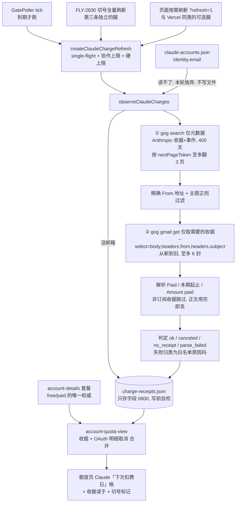

# FLY-2897 Claude 扣费日读收据 — 实施计划
Issue: FLY-2897 (https://linear.app/geoforge3d/issue/FLY-2897/额度页claude-扣费日-定时读各号-gmail-里-anthropic-的-stripe-收据-额度页显示下次扣费日取消邮件则显示已取消)
日期: 2026-09-25
基于: research.md

修订：v5（v2 吸收独立评审；v3 / v4 / v5 吸收 Codex 设计评审 Round 1 / 2 / 3，见 §10）。

## 0. 一句话

Bridge 用 gog 按号只检索 Anthropic 的收据 / 取消 / 确认邮件（先只拿元数据，精确过滤后才取需要的那一两封收据正文），
解析出「本期起止、付款日、金额」，写进 `~/.flywheel/claude-quota/charge-receipts.json`（只存字段，不存正文）；
额度页 Claude 行「下次扣费日」格改读这个文件，并与 OAuth 明细里已有的取消信号合并；每格带「收据读于」时间；
每天至少读一次，另外在 FLY-2830 切号全量刷新、页面按需刷新时顺带读。

基线：本分支叠在 `origin/flywheel-FLY-2830`（PR #1330，未合并）之上，PR base = main，合并顺序 #1330 → 本单（Lead 已同意）。

## 1. 总体流程



## 2. 新文件

全部在 `packages/teamlead/src/claude-quota/`。

### 2.1 `charge-receipt-parse.ts`（纯函数）

| 函数 | 作用 |
|---|---|
| `classifyAnthropicMail({ from, subject })` | 返回 `"receipt" \| "cancel" \| "resume" \| null`。From 整串锚定解析出唯一地址（见下），转小写后**精确比较**；主题用锚定正则。对不上一律 `null`（丢弃）|
| `parseReceiptBody(body)` | 返回 `{ periodStart, periodEnd, paidOn, amountCents } \| null`。周期认不出就返回 `null`；付款日、金额认不出只是字段为 `null` |
| `hasPlanLine(body)` | 正文里有没有订阅套餐行（`/\b(?:Pro\|Max\|Team\|Enterprise)(?: plan\b\| \d{1,2}x\b)/i`，真实为 `Max plan - 20x`）|
| `parseGogDate("YYYY-MM-DD HH:MM")` | 按 UTC 还原成 ISO；格式不对返回 `null`（gog 解析不了 Date 头时会原样输出，这类邮件直接丢弃）|
| `decideCharge({ receipts, events })` | 见 §4 |

From 地址解析（整串锚定，不取「第一个尖括号」）：
- 裸地址：`^\s*([^\s<>"]+@[^\s<>"]+)\s*$`
- 带显示名：`^\s*(?:"[^"]*"|[^"<>]*)\s*<([^<>\s]+)>\s*$`
- 其余（多个尖括号、尖括号后还有内容等）→ 视为无地址 → 丢弃。

发件人 / 主题规则：

| 种类 | From 地址 | 主题正则 |
|---|---|---|
| receipt | `=== "invoice+statements@mail.anthropic.com"` | `^Your receipt from Anthropic, PBC #[0-9-]{4,40}$` |
| cancel | `^no-reply[a-z0-9._+-]{0,64}@mail\.anthropic\.com$` | `^Your Claude [A-Za-z0-9 ]{1,40} subscription was canceled$` |
| resume | 同上 | `^Your [A-Za-z0-9 ]{1,40} subscription is confirmed$`、`^Welcome to the [A-Za-z0-9 ]{1,40} plan$`、`^Welcome back to Claude [A-Za-z0-9 ]{1,40}$` |

正文解析（先截到前 200 000 字符；像 HTML 就去标签、解 `&ndash;` `&#8211;` `&nbsp;` `&amp;` `&#36;` 等实体；再把空白压成单个空格）：

- 周期：`\b(Jan|Feb|…|Dec)[a-z]*\.? (\d{1,2})(?:, (\d{4}))? ?[–—-] ?(Jan|…|Dec)[a-z]*\.? (\d{1,2}), (\d{4})\b`，取第一处。
  起始年缺省时取结束年；若起始月日晚于结束月日，起始年 = 结束年 − 1（跨年）。
  校验：两个日期都是真实日历日，`start < end`，跨度 1–400 天；否则视为认不出。
  `after 17 Sep 2026`（日-月-年）不符合这个模式，不会被误认。
- 付款日：`\bPaid (January|…|December) (\d{1,2}), (\d{4})\b`，同样校验日历日。
- 金额：`Amount paid -?\$([0-9]{1,3}(?:,[0-9]{3})*|[0-9]+)\.([0-9]{2})` → 美分整数（负号保留为负数）。只认 `Amount paid`，单价 / 抵扣行的 `$` 不用。
- 周期是**太平洋时间的日历日**：personal 那封收据的邮件时间是 09-05 00:06 UTC（= 09-04 17:06 PDT），正文写 `Sep 4–Oct 4`。所以 `periodEnd` 不做时区换算，直接和页面的太平洋「今天」比。

### 2.2 `charge-receipt-store.ts`

```ts
type ClaudeChargeStatus =
  | "ok" | "canceled" | "no_mailbox"
  | "auth_missing" | "auth_invalid" | "no_receipt" | "parse_failed" | "read_failed";

type ClaudeChargeReason =   // 白名单；null 表示无细分
  | "invalid_grant" | "unauthorized" | "permission_denied" | "rate_limited" | "retryable"
  | "not_found" | "gog_config" | "gog_missing" | "timeout" | "output_too_large"
  | "malformed" | "candidate_limit" | "search_truncated" | "error";

interface ClaudeChargeFacts {
  periodStart: string;        // YYYY-MM-DD（太平洋日历日）
  periodEnd: string;          // YYYY-MM-DD = 下次扣费日（ok）/ 到期日（canceled）
  paidOn: string | null;      // YYYY-MM-DD
  amountCents: number | null; // 同周期收据 Amount paid 之和；任一张缺金额、或不能证明同周期收据已全部读到，则 null
  receiptCount: number | null; // 同周期收据张数（1..6）；与 amountCents 一样，不能证明读全时为 null
  receiptAt: string;          // 最新订阅收据的邮件时间 ISO
  canceledAt: string | null;  // 最新收据之后、未被重订抵消的取消邮件时间 ISO
  resumedAt: string | null;   // 最新收据之后最后一封 resume 邮件时间 ISO（用于与明细取消比先后）
}

interface ClaudeChargeReading {
  name: string;
  mailboxKey: string | null;      // claudeChargeMailboxKey(邮箱)；读写两侧（observer 与 view）都用它绑定邮箱身份
  readAt: string;                 // 本次尝试时间 ISO
  status: ClaudeChargeStatus;
  reason: ClaudeChargeReason | null;
  facts: ClaudeChargeFacts | null; // 只有 ok / canceled 有
  lastGood: { readAt: string; status: "ok" | "canceled"; facts: ClaudeChargeFacts } | null;
}

interface ClaudeChargeStore { version: 1; generatedAt: string; accounts: ClaudeChargeReading[] }
```

- 路径：`$FLYWHEEL_STATE_DIR/claude-quota/charge-receipts.json`（默认 `~/.flywheel/...`），与 `account-details.json` 同目录。
- **读写共用一个 `validateClaudeChargeStore`**：写之前先自检，不过就抛安全码 `store_invalid`、不落盘；读取时同一套校验，任何一项不对整份当作没有（`null`）。
  校验项：大小上限 64 KiB、最多 64 个号、号名正则 `^[A-Za-z0-9][A-Za-z0-9._-]{0,63}$` 且不重复、ISO 时间规范形式、日历日、状态与原因枚举、金额为安全整数、`receiptCount` 为 null 或 1..6（为 null 时 `amountCents` 也必须为 null）、`mailboxKey` 为 64 位小写 hex 或 null。
- 写：与 `writeClaudeAccountDetailStore` 同样的临时文件 + fsync + rename，文件 0600、目录 0700。只有 single-flight 的一个 writer。
- **没有任何字段能装主题、发件人、收据号、邮箱地址或正文。**
- 共享纯函数 `claudeChargeMailboxKey(email) = sha256(trim + 小写)`：observer 写入时用，view 消费时也用（§5），两边不会各算各的。

### 2.3 `charge-receipt-observer.ts`

```ts
interface ClaudeChargeTarget { name: string; email: string | null }

claudeChargeTargets(accountStore): ClaudeChargeTarget[] | null  // accountStore 为 null → null
observeClaudeCharges({ targets, previous, runGog, now, signal }): Promise<{ store, summary }>
createGogRunner({ bin?, timeoutMs = 30_000, maxBytes = 1 MiB }): GogRunner
resolveGogBin(): string   // /opt/homebrew/bin/gog → /usr/local/bin/gog → "gog"（PATH）
```

- `claudeChargeTargets`：号与邮箱取 `claude-accounts.json` 的 `identity.email`，号名先过正则（不合格的号跳过）。**observer 不判断免费号**：免费 / 付费只由页面按当前明细套餐决定（§5），收据读数里没有 `free` 状态，避免把旧套餐盖上新时间戳。免费号没有 gog 授权时只会得到 `auth_missing`，不会读到任何邮件。
  **accounts 文件读不了（`readStoreStrict` 返回 null）→ 本轮以安全码 `accounts_unreadable` 放弃，不写文件**，上一份读数原样保留。
- 每个号（并发 4，排队的号开跑前先看 `signal.aborted`，已中止就记 `read_failed/timeout`）：
  - 邮箱缺失或不合法（长度 ≤ 254、`^[^\s@]+@[^\s@]+\.[^\s@]+$`）→ `no_mailbox`，不调 gog。
  - 否则（全部 `execFile` 无 shell，传 `signal`，超时即 kill，stdout 上限 1 MiB）：
    1. **只拿元数据的一次检索**：
       `gog --account=<email> --no-input --json gmail messages search '<检索式>' --max 40 --timezone UTC [--page=<token>]`，
       检索式 = `from:mail.anthropic.com {subject:"Your receipt from Anthropic" subject:"subscription was canceled" subject:"subscription is confirmed" subject:"Welcome to the" subject:"Welcome back to Claude"} newer_than:400d`。
       穷尽与否**只看 gog 信封里的 `nextPageToken`**（实测：还有下一页时非空，最后一页为空串），不用行数、也不用邮件 Date 头推断未返回的页。
       有 token 就带 `--page=<token>` 继续取，至多 3 页（120 条）；3 页后仍有 token → 整号 `read_failed/search_truncated`（**失败闭合**：没看全就不下结论，因为未返回页里可能有本期补差收据，也可能有取消邮件）。token 先校验 `^[A-Za-z0-9_.~][A-Za-z0-9_.~-]{0,511}$`。
       **每页的完整性契约（任何一条不满足 → 整号 `malformed`）**：信封必须有字符串 `nextPageToken`（gog 总会输出，末页为空串；缺失即不能证明穷尽）；每一行必须是对象且带合法 message id（gog 的行必有 id；缺 id 是输出损坏，不是可跳过的邮件）；跨页按 id 去重，同 id 的 date / from / subject 不一致也算损坏。只有「真实邮件但 Date 认不出、或发件人 / 主题不是 Anthropic 精确形状」才静默丢弃。
    2. `classifyAnthropicMail` + `parseGogDate` 过滤；收据按时间从新到旧排序（同分钟保持 gog 的顺序）。
    3. **只对需要的收据取正文**，至多 6 封：
       `gog --account=<email> --no-input --json --select=body,headers.from,headers.subject gmail get <id>`；
       取回后再核一次 `headers.from` / `headers.subject` 仍是收据，否则当作这封不存在。
       - 从最新一封往回走：认出周期 → 这就是「最新订阅收据」L，停；没有周期也没有套餐行 → 非订阅收据（额外用量 / API credits 等），跳过继续；有套餐行但没周期 → `parse_failed`，停。
       - 找到 L 后，继续往回取邮件时间不早于「L 的 `periodStart` 前一天 00:00 UTC」的收据（同周期内的升级补差只可能在本期开始之后发出），作为同周期候选；上个月的收据因此不会被取正文。
       - **有界扫描不冒充结论**：
         - 检索没翻完（见上）→ `read_failed/search_truncated`，不看收据；
         - 6 封正文用完仍没找到 L → `read_failed/candidate_limit`（不是 `no_receipt`）；
         - 只有检索翻完、候选走完、确实没有订阅收据，才是 `no_receipt`；
         - 找到 L 后，正文预算在本期下界之前用完 → `amountCents = null`、`receiptCount = null`（不展示部分和）；越过下界或候选走完才算同周期读全（此时检索已翻完，看到的是全部匹配邮件）。
  - 失败归类（任一调用失败即整号失败，不做半截判定；原因只取白名单）：
    stderr 某一行以 `No auth for ` 开头（`/^No auth for /m`）→ `auth_missing`；stderr 含 `invalid_grant` → `auth_invalid/invalid_grant`；
    其余退出码 4 → `auth_invalid/unauthorized`；5 → `read_failed/not_found`；6 → `permission_denied`；7 → `rate_limited`；8 → `retryable`；10 → `gog_config`；
    130、被信号杀掉、超时、abort → `timeout`；spawn ENOENT → `gog_missing`；超出 stdout 上限 → `output_too_large`；
    （`candidate_limit` / `search_truncated` 见上一条）
    stdout 不是期望的 JSON（`JSON.parse` 包在 try 里，异常信息丢弃）→ `malformed`；其余 → `error`。
  - 成功时 `decideCharge`。
- `lastGood`：本次是 ok / canceled → 等于本次；否则沿用上一份读数的 `lastGood`（上一份本身是 ok / canceled 时取它），**但 `mailboxKey` 变了就丢弃**。
- 正文与 stderr 只在局部变量里；**不写日志、不落盘、不放进抛出的错误**。
- 返回 `summary = { accounts, ok, canceled, failed: ["personal1:auth_missing", "school:auth_invalid/invalid_grant", …] }`，只有号名和枚举码。

### 2.4 `charge-receipt-scheduler.ts`

- `nextClaudeChargeDueAt(store, nowMs)`（纯函数）：
  - 文件不存在 / 读不了 → 现在；
  - `generatedAt`、任一 `readAt` 或任一 `lastGood.readAt` 比现在晚 60 秒以上（时钟回拨）→ 现在；
  - 否则取以下最早者：`generatedAt + 24h`；以及每个 ok / canceled 读数的「`periodEnd` 次日 00:05 America/Los_Angeles」——用真实时区换算（PST 为 08:05 UTC，PDT 为 07:05 UTC，冬夏各一条测试），只算 `readAt` 的太平洋日期 ≤ `periodEnd` 的那些（扣费日已过、还没在扣费日之后读过；读过一次后此项自然消失，不会反复触发）。
- `createClaudeChargeScheduler({ refresh, readStore, now, minRetryMs = 30 min, log })` → `{ tick() }`：
  - 进程内缓存 `nextDueAt`；首个 tick 读一次文件算出来，每轮结束（成功或失败）后重读文件重算，**不在每个 3 秒 tick 上读文件**。
  - 在跑就跳过；本进程上次启动距今 < `minRetryMs` 就跳过（失败时不会每个 tick 都去读邮箱）；`now ≥ nextDueAt` 才启动，不 await，异常只记一行固定文本。

## 3. 改动的现有文件

| 文件 | 改动 |
|---|---|
| `bridge/account-quota-refresh.ts` | 新增 `createClaudeChargeRefresh({ ceilingMs, observe, write, log })`：复用本文件的 `singleFlight` + `withCeiling`（协作上限，abort 信号传进 observer），外加 `ceilingMs + 5s` 的**硬上限**（race 输了就抛 `timeout`、不写文件）；成功时写文件，记一行摘要 `[claude-charge] accounts=5 ok=4 canceled=0 failed=1 [failures=personal1:auth_missing]`。`createAccountQuotaRefresh` 增加可选腿 `refreshClaudeCharges`，与 Vercel 腿一样**失败不影响整轮**（固定文本 warn）|
| `bridge/switch-refresh-trigger.ts` | deps 增加可选 `refreshClaudeCharges`；`runOnce` 用 `allSettled` 并行三条腿；**只有配置了这条腿**时日志行才追加 ` chargeRefresh=ok \| failed:<code>`（现有测试逐字钉着不带它的日志行）；收据腿失败不影响另外两条 |
| `bridge/account-quota-view.ts` | `AccountQuotaViewOptions.claudeCharges?: ClaudeChargeStore \| null`；`claudeNextChargeCell` 按 §5；`AccountQuotaRow` 增加 `receiptReadAt?: string \| null`（Claude 专用：该号收据上次读取时间；`null` = 从未读到；缺省 = 不显示，即手填格）；Claude `sources` 增加 `charge: string \| null`（只供切号标记：有收据读数取其 `readAt`，走兜底分支时取明细读取时间）|
| `bridge/account-quota-page.ts` | `CLAUDE_CELL_SOURCE.nextCharge = "charge"`；`renderNextCharge` 支持多行（首行 `.next-charge`，其余 `.charge-note`）；`receiptReadAt !== undefined` 时末尾加 `<span class="charge-read-time">收据读于 HH:MM</span>`（`null` 写「收据读于 从未读到」），**不依赖 `sources`**，所以已取消 / operator 标记不可用 / 快照缺号的行也有；新增两个样式 |
| `bridge/plugin.ts` | `startBridge`：组装 `refreshClaudeCharges`（targets 每轮现读 accounts + 明细两份文件）；接进按需刷新、切号触发器、GatePoller tick（放在 `switchRefreshTrigger.tick()` 之后，单独包 try）。页面路由**只有 `opts.accountPageClaudeCharges` 给了才读**收据文件（与 `accountPageVercel` 同样写法，缺省视为没有，测试不会读到开发机上的真文件），startBridge 显式传默认路径 |

不改：capacity snapshot（`/api/capacity` 的结构）、quota-monitor 守护进程、Codex / Vercel 的扣费日、flag 配置。

## 4. 判定规则（`decideCharge`）

输入：observer 已取回正文的订阅收据 `{ at, parsed | null }[]`（非订阅收据已被跳过；`null` = 有套餐行却认不出周期）、精确过滤后的事件 `{ at, kind: "cancel" | "resume" }[]`（`at` 为分钟精度 ISO）。

1. 没有收据 → `no_receipt`。
2. 最新收据（`at` 最大；同分钟取 `periodEnd` 较晚的）解析失败 → `parse_failed`（**不退回更早的收据去猜**）。
3. 同周期合并：只按 `periodEnd` 作 key（补差那张的 `periodStart` 可能不同）；张数、金额求和（任一张缺金额则 `null`），`periodStart` / `paidOn` / `receiptAt` 取最新那张。
4. `canceledAt` = 晚于最新收据的最后一封取消邮件；若之后还有 resume 邮件（晚于这封取消）则视为已重订，`canceledAt = null`。`resumedAt` = 晚于最新收据的最后一封 resume 邮件。
5. `canceledAt` 非空 → `canceled`，否则 `ok`。`facts.periodEnd` 都是最新收据的本期结束日。

真实时间线对照（research §2.4）：personal 07-31 取消 → 08-03 重订 → 08-04 收据 → ok；business 09-08 取消 → 09-16 确认 + 收据 → ok（取消早于收据，本就不算）。

## 5. 页面显示（`claudeNextChargeCell`）

**邮箱身份绑定（消费侧）**：view 用当前 `claudeEmails[name]` 算 `claudeChargeMailboxKey`，与读数的 `mailboxKey` 不同（同名号改绑了邮箱）→ 整条收据读数（`facts` / `lastGood`）都不用，格子写「读不到（邮箱已变更，待重读）」，`receiptReadAt = null`，`sources.charge = null`（切号标记显示「尚未读到」）。

先定「取消」：**收据判定 canceled，或者 OAuth 明细 `subscriptionStatus === "canceled"` 且明细读取时间晚于最新收据与最后一封 resume 邮件**（两个来源合并，不是二选一；取消邮件漏掉时，接口已经确认的取消仍然显示）。
这个合并**故意是单向的**：较新的明细 `active` 不会清掉较早的取消邮件。原因是 Stripe 的「期末取消」在本期结束前状态仍是 `active`（取消后要到期才失效），所以 `active` 证明不了「又重订了」；能证明重订的只有 resume 邮件或更新的收据。宁可显示取消（founder 最在意的场景），也不在期末取消期间误报一个会续费的日期。

「免费」只看当前明细：页面生成时快照里该号的套餐 `subscriptionTier.subscriptionType === "free"` → 「免费号，无扣费」（与套餐格同一数据源，明细每次刷新都会更新）。收据读数不参与免费判断，所以并行刷新的先后顺序不会把旧套餐固化成新结论。

优先级：
1. founder 手填的取消确认（原逻辑不变）。
2. 当前明细套餐是 free → 免费号，无扣费（这是当前明细的事实，不需要任何收据读数）。
3. 邮箱身份不符 → 「读不到（邮箱已变更，待重读）」。
4. 该号有收据读数（含 48 h 内、且读取时间不在未来的 `lastGood`）→ 下表。
5. 兜底（没有收据文件 / 没有这个号的读数 / 失败且无可沿用）：明细 `canceled` → 「已取消」；否则 → 「读不到（<原因>）」，没有读数时原因是「收据还没读过」。

有收据事实时（`today` = 页面生成时刻的太平洋日期；`cancel` = 上面合并后的取消判定）：

| 情况 | 格子文字 | 来源 |
|---|---|---|
| 未取消，`periodEnd ≥ today` | `10/16 周五`<br/>`本期 9/16–10/16 · 已付 $200.01` | machine |
| 未取消，`periodEnd < today`，`readAt` 日期 ≤ `periodEnd` | 读不到（读数早于扣费日，待重读）| missing |
| 未取消，`periodEnd < today`，`readAt` 日期 > `periodEnd` | 读不到（10/04 周日 应扣费，未见新收据）| missing |
| 取消，`periodEnd ≥ today` | 已取消 · 10/16 周五 到期 | machine |
| 取消，`periodEnd < today` | 已取消 · 10/04 周日 已到期 | machine |
| 本次失败，用 48 h 内的 `lastGood` 按上面显示 | 再加一行「沿用 09/25 16:40 读数 · 本次读不到：<原因>」| machine |

原因文案：

| status / reason | 文案 |
|---|---|
| `no_mailbox` | 账号没有登记邮箱 |
| `auth_missing` | 邮箱未授权 gog |
| `auth_invalid` / `invalid_grant` | 邮箱授权失效 invalid_grant，需重新授权（外层已有「读不到（…）」括号，避免括号套括号）|
| `auth_invalid` / 其他 | 邮箱授权失效，需重新授权 |
| `no_receipt` | 邮箱里没找到 Anthropic 收据 |
| `parse_failed` | 收据格式没认出 |
| `read_failed` / `timeout` · `gog_missing` · `rate_limited` · `retryable` · `permission_denied` · `gog_config` · `output_too_large` · `malformed` · `not_found` · `error` | 读邮箱超时 · 本机没装 gog · Gmail 限流 · Gmail 暂时不可用 · 邮箱授权范围不够 · gog 凭据未配置 · 邮件太大 · gog 返回格式不对 · 邮件已不存在 · 读邮箱失败 |
| `read_failed` / `candidate_limit` · `search_truncated` | 非订阅收据太多，没读到订阅收据 · Anthropic 邮件太多，没读完 |

每个 Claude 行（手填格除外）末尾都有「收据读于 HH:MM」（跨天带日期，与 FLY-2830 同一个 `formatAccountQuotaPageClock`；从没读过写「从未读到」），不依赖行的 `sources`。
切号标记：`nextCharge` 格的数据源改为 `sources.charge`；切号刷新会顺带重读收据，正常情况下标记在这一轮结束后消失。

## 6. 隐私与安全

按三道边界如实写（gogcli a92bd63 源码核对）：

| 边界 | 经过的数据 | 说明 |
|---|---|---|
| Gmail API → gog 子进程 | 检索：命中邮件的 `metadata` 头（From / Subject / Date）、labelIds，以及一次 label 名称表；取正文：该封收据的完整消息（`format=full`，含附件元数据）| 这是 gog 实现决定的，`--select` **不是**远端字段投影 |
| gog stdout → Bridge 进程 | 检索：`{messages:[{id,threadId,date,from,subject,labels}], nextPageToken}`（要靠信封里的 `nextPageToken` 判断是否翻完，所以不能用 `--results-only`；threadId / labels 读到即丢）；取正文：`{body, headers.from, headers.subject}` | message id / page token 只是临时定位符，不落盘 |
| Bridge → 文件 / 日志 | 只有 §2.2 的字段；日志只有号名、计数、枚举码 | stderr（含邮箱地址）只用于分类，不进日志、不进异常 |

- 检索式固定写死，只含 Anthropic 发件人域与固定主题词；gog 参数经 `execFile` 传 argv，不经 shell；邮箱用 `--account=<email>` 单参数形式并先做格式校验；消息 id 先校验 `^[A-Za-z0-9]{6,64}$`。
- 只有精确过滤后确认是 Anthropic 收据的那几封（每号至多 6 封）才取正文。
- **残余风险（部署前置条件：PR 里请 Lead / founder 确认接受这个精确范围）**：Gmail 的 `from:` / `subject:` 是模糊匹配；模糊命中的邮件（包括非 Anthropic 的）的 `id`、`threadId`、`labels`、`from`、`subject`、`date` 以及翻页用的 page token 会短暂进入 gog 子进程与 Bridge 内存（不含正文），随即丢弃，**不落盘、不进日志**；取正文时 gog 子进程会拿到那封 Anthropic 收据的完整消息（Bridge 只收到正文与发件人、主题两个头）。founder 批准的是「只提取发件人、主题、日期、金额、计费周期」，落盘与日志严格满足；内存里的瞬时范围要再收窄只能改 gog 本身，本单不做。
- 精确发件人地址过滤：`invoice+statements@mail.anthropic.com.evil.example`、`invoice+statements@anthropic.com`、显示名伪装、多个尖括号等全部丢弃（有测试）。
- 没有开关：要停读邮件，`gog auth remove <邮箱>` 即可，页面会如实显示「邮箱未授权 gog」。

## 7. TDD 顺序与测试

每一步先写失败测试，再写最少实现，再重构。

| # | 测试文件 | 覆盖 |
|---|---|---|
| 1 | `claude-quota/__tests__/charge-receipt-parse.test.ts` | 按真实形状构造的正文（单封、同日两封、`after 17 Sep 2026` 干扰、跨年两种写法、HTML 正文与实体、缺 `Amount paid`、非法日期、倒序周期）；`hasPlanLine`；发件人 / 主题分类（含显示名伪装、多尖括号）；`parseGogDate`；`decideCharge` 全部分支 + 两条真实时间线 + 同分钟 tie-break + 只按 `periodEnd` 合并 |
| 2 | `claude-quota/__tests__/charge-receipt-store.test.ts` | 往返、0600 权限、每种非法形状整份拒收（含「张数为 null 却有金额」）、超大文件拒收、写前自检拒绝非法值且不落盘 |
| 3 | `claude-quota/__tests__/charge-receipt-observer.test.ts` | 假 gog：检索与 get 的 argv 逐字断言（检索不带正文，翻页带 `--page=<token>`，get 带 `--select`）；非订阅收据跳过、至多 6 封正文；6 封非订阅后才出现订阅收据 → `candidate_limit`；找到 L 后预算用完且仍有同周期候选 → 金额与张数 null；少于 40 条但有 token → 继续翻页；第 2 页才出现的本期补差收据被计入；3 页后仍有 token → `search_truncated`；非法 token、缺 token、缺 / 非法 id 的行、非对象行 → `malformed`；跨页重复 id 只读一次（字段冲突 → `malformed`）；无邮箱不调用；accounts 读不了整轮放弃；各失败码归类（含 `No auth for` 不在首行、exit 130、maxBuffer、signal）；`lastGood` 沿用与换邮箱丢弃；abort 后排队的号不再开跑；**构造的取消场景**；落盘 JSON 与摘要里不含主题、发件人、收据号、正文片段、邮箱 |
| 4 | `claude-quota/__tests__/charge-receipt-scheduler.test.ts` | `nextClaudeChargeDueAt` 三条规则（扣费次日 00:05 太平洋时间，PST / PDT 各一例）+ 时钟回拨（含 `lastGood.readAt`）；tick 不重复读文件、`minRetryMs`、在跑时跳过、异常只记固定文本 |
| 5 | `bridge/__tests__/account-quota-refresh.test.ts`（增）| `createClaudeChargeRefresh` single-flight / 协作上限 / 硬上限不写文件 / 摘要日志；按需刷新腿失败不影响整轮 |
| 6 | `bridge/__tests__/switch-refresh-trigger.test.ts`（增）| 第三条腿并行、失败只记 `chargeRefresh=failed:<code>`、另两条照常；不配置时日志行与现有一致 |
| 7 | `bridge/__tests__/account-quota-view.test.ts`（增 / 改 939、1250 附近钉旧文案的断言）| §5 每一行、取消合并的两个方向（明细较新 → 已取消；收据 / resume 较新 → ok；较新的明细 active 不清取消邮件）、邮箱改绑后旧读数不渲染、免费只看当前明细套餐（收据读数 ok 也不影响；免费优先于邮箱改绑）、未来的 `lastGood` 不沿用、优先级、`receiptReadAt`、`sources.charge` |
| 8 | `bridge/__tests__/account-quota-page.test.ts`（增 / 改）| 多行格子、收据读于行（含无 `sources` 的行）、HTML 转义、切号标记改用 `sources.charge` |
| 9 | `bridge/__tests__/capacity-snapshot.test.ts`（改 1984 附近）、`capacity-route.test.ts`（确认不读开发机真文件）| 兜底文案 |
| 10 | `claude-quota/__tests__/charge-receipt-e2e.test.ts` | 构造 gog 输出 → observer → 文件 → view → 页面 HTML：business 取消场景出现「已取消 · 10/16 周五 到期」，personal1（套餐 free、邮箱未授权 gog）出现「免费号，无扣费」，school 授权失效出现明确原因 |

## 8. 本地验证（只跑相关测试）

- `pnpm lint`；`pnpm --filter "flywheel-teamlead..." build`；类型变化只在 teamlead 内部，跑 `pnpm --filter "...flywheel-teamlead" typecheck`。
- 上表测试 + `vitest related <改动文件> --run`；`git grep -lF` 找改动文件的消费者，逐个说明取舍。
- **真邮箱只读验收**（founder 已授权 4 个邮箱）：用构建产物跑一次 `observeClaudeCharges`，写到 scratch 临时路径（不碰生产文件），只打印字段表；再用它渲染一次页面片段。对照：business 10/16、personal 10/04（= claude.ai `next_charge_date`）、shopping 10/20、school 10/17、personal1 免费号。记录进 `verification.md`。
- 授权失效的原因文案用假 gog 覆盖（真实 4 号现在都有效，不去弄坏授权）。

## 9. 不做

- 不读 claude.ai 页面 / cookie，不访问收据里的 Stripe 链接，不下载附件。
- 不改 gog 授权（授权范围由 founder 决定）。
- 不改 Codex / Vercel 扣费日，不改 capacity snapshot 结构，不加 feature flag。
- 不重启 Bridge；部署由独立 updater 负责。

## 10. 评审记录

Round 1（独立全新上下文评审，2026-09-25；原文 `design-review-independent-round1.md`，结论 CHANGES REQUESTED）。按 Lead 裁定，它**不替代** Codex 设计评审，只作为输入。

| # | 意见 | 处理 |
|---|---|---|
| 1 BLOCKER | 收据 ok 会盖掉 OAuth 明细已确认的取消 | 采纳：§5 取消判定合并两个来源，按时间先后 |
| 2 | accounts 文件读不了会写出空 store | 采纳：§2.3 本轮放弃、不写文件 |
| 3 | 写入 / 读取校验不对称，可能整份被拒并每 30 分钟读一次邮箱 | 采纳：共用 `validateClaudeChargeStore`、写前自检；原因白名单；号名先过正则 |
| 4 | 非订阅收据会卡在 `parse_failed` | 采纳：`hasPlanLine` 区分，非订阅跳过；每号至多取 6 封正文 |
| 5 | From 地址提取有歧义 | 采纳：整串锚定解析 + 测试 |
| 6 | 正文在精确过滤前就进了内存 | 采纳：先元数据检索、精确过滤后 `gmail get --select` 只取需要的收据；残余风险写进 §6 |
| 7 | 「读于」依赖 `sources`，与无 `sources` 的行冲突 | 采纳：`receiptReadAt` 独立字段；`sources.charge` 只供标记，兜底分支取明细时间 |
| 8 | 页面路由测试缝与三处钉格式的测试 | 采纳：缺省不读；§7 列出要改的测试；日志行只在配置时追加 |
| 9–12 NIT | 调度缓存 `nextDueAt`、时钟回拨、硬上限、`No auth for` 按行、`JSON.parse` 包 try、只按 `periodEnd` 合并、同分钟 tie-break、丢弃无效日期、周期是太平洋日历日的证据 | 采纳 |
| 13 NIT | `lastGood` 绑邮箱；读于换独立 class | 采纳 |
| 13 NIT | 收据格不参与切号标记？| **不采纳**：issue 明确要求切号全量刷新时顺带读，FLY-2830 的约定是「每次切号每格都重读」，保持一致 |

Round 1（Codex 设计评审，2026-09-25，thread `01a0db0d-cf07-7423-bf26-1192b594afca`；结论 CHANGES REQUESTED）。

| # | 意见 | 处理 |
|---|---|---|
| 1 BLOCKER | `mailboxKey` 只保护 `lastGood`，没保护页面当前用的 `facts` / `free` | 采纳：共享 `claudeChargeMailboxKey`，view 消费前比对当前邮箱；不符写「邮箱已变更，待重读」，`sources.charge = null` |
| 2 BLOCKER | 有界扫描耗尽被误报成「没有收据」，还可能展示部分金额 | 采纳：`candidate_limit` / `search_truncated` 两个原因码；同周期未证明读全时金额为 null；检索多要一条判截断 |
| 3 SHOULD | §6 对 gog 数据边界描述不准（`--select` 是本地输出投影）| 采纳：§6 按三道边界重写；检索改 `--results-only --select=id,date,from,subject`；残余风险写明并在 PR 里请确认 |
| 4 SHOULD | 明细与邮件的取消合并只单向；`free` 可能被并行刷新固化 | 部分采纳：`free` 按新旧仲裁（两个方向）。**不采纳**「较新的明细 active 清掉更早的取消邮件」：Stripe 期末取消在到期前仍是 active，这样做会在期末取消期间误报续费日；理由写进 §5 |
| 5 NIT | 调度用真实太平洋时区换算；时钟回拨检查纳入 `lastGood.readAt` | 采纳：§2.4、§5、测试 |

Round 2（Codex，同一 thread；结论 CHANGES REQUESTED，Round 1 的 #1、#3、#4 取消仲裁、#5 已关闭）。

| # | 意见 | 处理 |
|---|---|---|
| 1 BLOCKER | `free` 仲裁用的是收据腿完成时间，并行刷新会把旧套餐盖上新时间戳 | 采纳（取建议的第二种）：免费 / 付费只看页面快照里的当前明细套餐；收据读数不再有 `free` 状态，observer 不再读明细 |
| 2 BLOCKER | 用第 41 行判截断、用 Date 头推断未返回页都不可靠 | 采纳：用信封 `nextPageToken`，有界翻页至多 3 页；翻不完整号 `search_truncated` 失败闭合（未返回页可能有补差收据或取消邮件）；读全后才谈同周期完整 |
| 3 NIT | 扫描不完整时 `receiptCount` 不是总张数 | 采纳：与 `amountCents` 一样置 null |

Round 3（Codex，同一 thread；结论 CHANGES REQUESTED，Round 2 全部关闭）。

| # | 意见 | 处理 |
|---|---|---|
| 1 BLOCKER | 缺 `nextPageToken` 被当成已穷尽；缺 / 非法 id 的行被静默跳过；跨页重复 id 未去重 | 采纳：§2.3 写明每页完整性契约，三种情况 `malformed` / 去重；测试覆盖 |
| 2 SHOULD | §6 残余风险文字要列全 Bridge 侧瞬时字段 | 采纳：列出 id / threadId / labels / from / subject / date / page token，并写成部署前置确认 |
| 3 NIT | §5 优先级顺序与实现不一致 | 采纳：按实现改为「手填 → 当前明细 free → 邮箱改绑」，补组合测试 |
| 4 NIT | 校验器未约束「张数为 null 则金额为 null」| 采纳：校验器与测试 |

