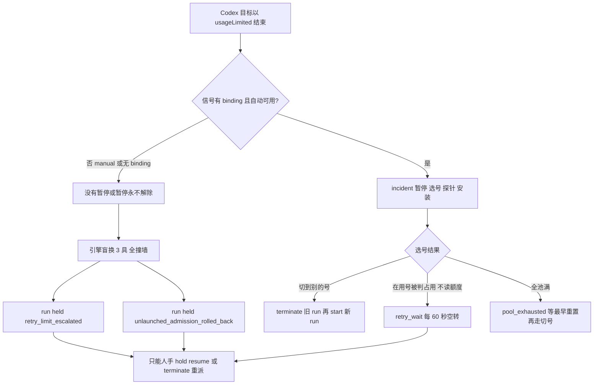

# FLY-2900 撞墙后自动续上 — 探索
Issue: FLY-2900 (https://linear.app/geoforge3d/issue/FLY-2900/codex额度墙-撞额度墙后-held-的-run额度恢复-切号成功后自动续上换体或唤醒不再挂起等人)
日期: 2026-09-25
基于: 无

## 0. 一句话

Codex 撞额度墙之后，今天的系统有「切号并恢复」的全套机器（FLY-2465），但它在生产上**一次都没转起来**；就算转起来，也只认「自动切号成功」这一种放行条件，看不见「原号到点回血」「有人手动切了号」「全池满了改派 Claude」，而且对已经挂起（held）的 run 完全没有自动出口。本单要补的是**放行条件**、**被放行对象**，以及（按 Lead 裁定）把撞墙改成「额度待命 → 同一 execution 新进程续原 thread」，现成的「替身」只作兜底。

## 1. 取证来源（只读）

- 生产 `~/.flywheel/teamlead.db` 只读句柄（`mode=ro`），窗口 2026-09-11 23:31Z → 2026-09-25；取证脚本留在本机 scratchpad（`holds.py`/`waste.py`/`ep.py`/`ul.py`），SQL 摘要见 research.md §1。
- FLY-2893 普查（`~/Dev/flywheel-FLY-2893/.../evidence/derived/classes.csv` 行 `codex,K1`）。
- 源码基线 `6523b997c`（含 FLY-2830）。
- Linear MCP 在本机 401、`.env` 无 key：FLY-2371/2521/2895 原文读不到，已非阻塞问 Lead（question `fe80c115`）；FLY-2371/2521 的要点从 FLY-2465/2893 文档转引。

## 2. 现场事实

| # | 事实 | 证据 |
|---|---|---|
| E1 | 14 天内 231 个执行体以 `goal_usage_limited` 失败，**全是 Codex**（implement 214 / eng_design 11 / qa 6），涉及 99 个 run、69 张单；Claude 0 个 | session_events × workflow_execution_runtime |
| E2 | 其中 195 个在同 run/节点后面**紧跟着又一个 Codex 执行体**（中位间隔约 4 分钟）——就是往同一堵墙上盲换，直到第 4 具触发 `retry_limit_escalated` | payload `maxLaunchOrdinal:4` |
| E3 | 与额度相关的挂起：`retry_limit_escalated` 31 次、`unlaunched_admission_rolled_back` 40 次、`delivery_reroute_operator_required` 14 次等；**释放全部是人工**（`principal:"master"`），17 次 hold resume、37 次 terminate+重派，仍有 2 个 run 挂着（FLY-2754 约 159h、FLY-2748 约 169h） | workflow_run_event |
| E4 | 浪费合计：普查 207.83h，其中**「挂着等人手」185.91h**；本次复算 241.9h（口径含跨 run）。单个最长：FLY-2751 66.9h、FLY-2693 44.1h、FLY-2755 38.2h | FLY-2893 classes.csv、本次 ep.py |
| E5 | 自动切号 14 天内**零次生效**：129 条额度信号全部 `disposition=manual`；原因依次是 `flag_disabled`/`runtime_unavailable`/`readiness_receipt_missing`（9-18→9-24）、`authority_unavailable`（9-25）。`codex_quota_switch_audit`、`switch-audit.jsonl` 为空；root 代数从 5 到 16 全是人工切号 | codex_quota_signal_event、outbox |
| E6 | 113 条 `lead_diagnostic identity_uncertain`：信号没有 binding（账号归属），于是**连暂停都不生效**，引擎照常盲换 | codex_quota_outbox |
| E7 | `codex_quota_paused` 从来不是 hold 原因；它是启动/换体被拒的返回码，`codex_quota_execution_pause` 0 行 | 同上 |
| E8 | Lead 手工的「标准解法」已经固定：`hold resume` 或 `terminate + 同单重派（带 handoff）`，号全满时重派到 Claude，理由里反复引用 founder 9-18「quota-death auto-restart」授权与 9-21「FLY-2763 plan B restart on Claude」 | run_terminated_by_operator.reason |
| E9 | Lead 理由里多次写「retry_limit_escalated resume does not mint a body」「unlaunched_admission_rolled_back door1 never mints (FLY-2329)」「replacement rolled back (dirty worktree)」——**hold resume 这扇门对额度死体经常不出新体**，Lead 只好 terminate+重派 | 同上，9-15、9-23 多条 |
| E10 | Claude 侧：quota-monitor 在撞墙**前**切号（63 次切号决策，42 次成功），在飞会话通过共享 Keychain 拿新凭据，卡在「usage limit reached」的 pane 由 `quota-revive-scan` 发 `continue` 唤醒；14 天 0 个 Claude runner 因额度失败、0 个 hold | quota-monitor.log、代码 `switch-executor.ts:679`、`quota-revive-scan.ts:308` |

## 3. 盘点：撞墙后 run 停在哪、缺哪扇自动门（任务 1）

| 停留状态 | 节点/派发意图 | 今天谁能放 | 缺的自动门 |
|---|---|---|---|
| S1 `retry_limit_escalated` held（额度盲换耗尽） | 节点 running 在死体上；run held | 仅人工 hold resume / terminate+重派 | **没有任何自动出口**；hold resume 本身常不出新体（E9） |
| S2 `unlaunched_admission_rolled_back` held（替身没起来，常因脏工作树或起跑即撞墙） | 节点 pending 无 execution；run held | 同上 | 同上；且 door1 不出新体（FLY-2329 形状） |
| S3 manual 处置的信号 + 有 binding | 执行体被 `isExecutionPaused` 挡住换体 | root 代数变化（有人切号）才解除 | **原号到点回血不解除**（代数不变），节点无限卡住 |
| S4 无 binding 的信号 | 不暂停 → 走 S1/S2 | — | 暂停本身缺失（E6） |
| S5 incident `identity_uncertain`（有人手动切号） | target 仍 waiting，执行体暂停 | **无**：恢复要自动切号 committed 的许可 | 手动切号后不认账，任务不续 |
| S6 incident `retry_wait/no_usable_credentials`（在用号被判占用） | 同上 | 无（每 60 秒空转） | 在用号从不读额度 → 看不到原号回血、也判不出全池满 |
| S7 incident `pool_exhausted` | 同上 | 到最早重置时刻重新观察 → 只能走「探针+安装」 | 全池满时没有改派 Claude（现有降级只覆盖 **implement 新启动**，不覆盖被暂停的旧目标） |
| S8 `codex_quota_admission_wait`（排队未启动） | 同一 execution 待 admit | 自动切号 committed 后自动 | 与 S3/S5/S6 同缺：只认自动切号许可 |
| S9 自动切号成功后的恢复 target | terminate + 新 run | 自动 | 已有；**只接受 Codex 节点**，缺审计/thread 一句话的统一格式 |

结论：FLY-2465 已有的执行动作是「替身」（terminate 旧 run + 在失败节点起新 run）；按 Lead 裁定它只做兜底（research.md §0）。缺的是：

1. **放行条件只有一种**（自动切号 committed）。缺「原号回血」「人工切号被确认」「全池满 + 开关 → 改派 Claude」。
2. **在用号读不到额度**（S6），导致前两条里有两条根本判不出来。
3. **被放行的对象只有 incident target / admission waiter**，挂起的 run（S1/S2）和无 binding 的信号（S4）不在册。
4. **暂停不全**：无 binding / manual 时引擎还在盲换，把一次撞墙放大成 3–4 具死体和一次 hold。

## 4. 「唤醒」还是「换体」

founder 问的 Claude 做法有两半：①在飞进程拿到新凭据；②卡住的会话被「continue」一下原地继续。Codex 这边：

- **①做不到**：FLY-2869 实测，已在跑的 Codex app-server 不跟随 auth 软链变化（`token-follow-run1/2`），只有新进程才读到新号。
- **②有条件做到**：Codex 支持新进程 `thread/resume` 原 thread（`CodexTmuxAdapter.ts:2087`、`codex-daemon-client.ts:495`），FLY-2808 已把「同一 execution、新进程、续原对话、核对工作目录/HEAD」做成 `resumeStandbyActor`（`plugin.ts:14615`），但它只服务**待命（standby）载体**，开关 `node_standby_resume` 默认关。撞墙的 Codex 执行体今天是直接**终态失败**（session_failed），不是待命；把终态体复活正是 FLY-2893 的 K13「终态后复活」事故类。
- **把原 thread 接到一个新 execution 上不安全**：旧 thread 的开发者指令里固化了旧 exec id、旧凭据命令；新 execution 的身份不同，模型会照着上下文里的旧 id 调命令。

> **已被 Lead 裁定取代（2026-09-25，question `31bb8011`，见 research.md §0）**：本节原先把「额度待命」放后续单的建议作废。本单主线就是「撞墙不判终态 → 额度待命 → 同一 exec id 起新进程 `thread/resume` 原 thread 续跑」；由于 exec id 不变，不存在「新 execution 接旧 thread」的身份错位。替身只做兜底。

## 5. 必须守住的边界

1. 不重复派：一个撞墙节点在一次放行里只出一个新体；Lead 手动动作、founder cancel/ship、健康接班者都让自动路径让位。
2. 不丢工作：新体从原分支 HEAD 出发，拿到进度账本；脏工作树不 reset、不 clean。
3. 放行要有新证据：同一代的旧读数、未刷新的缓存不能当回血证据。
4. 改派 Claude 不能破坏既有「同厂商互评」规则。
5. 通知克制：成功只在 issue thread 一句话；只有失败才升级 Lead，founder 只收既有「全池满」一条。
6. 本机只跑单测/集成测试；真 Codex 撞墙演练等 Codex 服务恢复后再做。

## 6. 需要 Lead 定的点（已答复，见 research.md §0）

- Q1 全池满改派 Claude 开关：默认开，附六条条件。
- Q2 「唤醒」范围：额度待命为本单主线。
