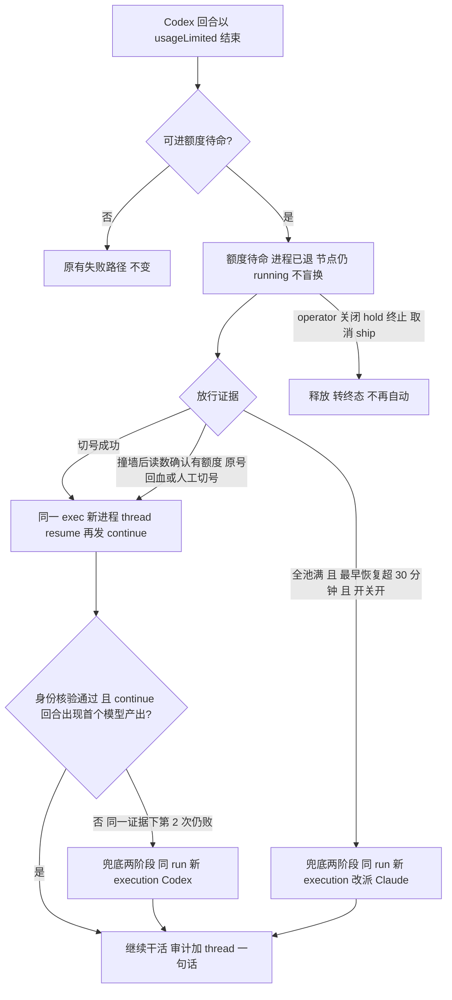
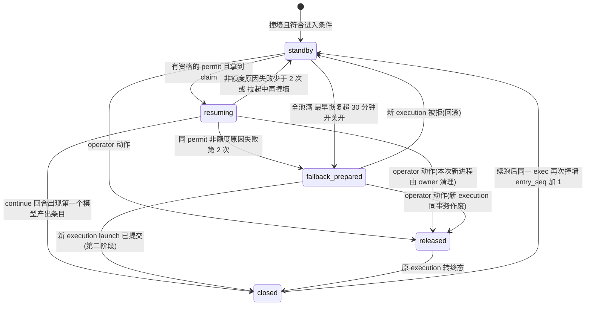

# FLY-2900 撞墙后自动续上（额度待命）— 实施计划
Issue: FLY-2900 (https://linear.app/geoforge3d/issue/FLY-2900/codex额度墙-撞额度墙后-held-的-run额度恢复-切号成功后自动续上换体或唤醒不再挂起等人)
日期: 2026-09-25
基于: research.md

版本：v5（v4 设计评审通过后，吸收 Lead 对实现评审 HIGH `reading-permit-settles-unprobed-incident` 的证明等价裁定；修订轨迹见 §14）。状态：v4 为 **Codex 设计评审 R4 APPROVED**；v5 的实现约束由 2026-09-26 Lead 返工指令直接批准：reading 路径保持只读，只有新进程真实身份（含当前凭据摘要）与因果上更晚的首个成功模型产出共同构成恢复证明。

## 0. 真 Codex 预实验（Lead question `65fdd8c6` 指令，2026-09-26 00:07Z）

隔离 `CODEX_HOME`（scratchpad）、`auth.json` 只做软链、两号都持 account lease、拒绝 canonical（school）与 business，codex 0.157.0。证据 `evidence/quota-resume-run1.jsonl`，脚本 `evidence/quota-resume-experiment.mjs.txt`。

| 步骤 | 结果 |
|---|---|
| 阶段 1：软链 → personal2（周额度 100%），`thread/start` + `thread/goal/set active` + `turn/start "Reply exactly: ok"` | goal 状态 `usageLimited`；回合 `failed`，`codexErrorInfo=usageLimitExceeded` |
| 停进程；软链原子换到 shopping；**新** app-server 进程 | `account/read` = shopping |
| `thread/resume` 同一 thread id | 成功，id 相同 |
| `thread/goal/get` | `usageLimited` |
| `thread/goal/set status=active`（objective 原样） | **接受** |
| `turn/start`（问「第一条消息让你回复哪个词」） | 回合 `completed`，模型答「ok resumed」——上下文跨进程、跨账号保留 |
| 收尾 | 两号 slot 字节未变；canonical 未变；home 仍是软链 |

结论：research §4 的两件事在「A 侧尚无模型推理内容」的 thread 上成立，主线保持额度待命（Lead 已确认）。**未证部分**：A 号上已产生加密推理（reasoning）条目的 thread 换到 B 号能否回放——本机唯二有额度的号中 school 是 canonical，不能安全实验；列入 §10「演练必证」。不成立时本设计自动落 Codex 兜底，并在审计 `detail_code` 记清原因。

## 1. 结果与范围

Codex runner 撞额度墙时，execution **不再判终态失败**，而是进入「额度待命」：进程已退出、节点仍 running、TURN 不动、不盲换。拿到放行证据（自动切号成功，或撞墙之后发出的只读读数确认当前号有额度——涵盖原号到点回血与人工切号）后，系统用**同一个 exec id** 起新 Codex 进程，`thread/resume` 原 thread，把 goal 重新置 active 并发一条短 continue 回合接着干。同一放行证据下拉起失败两次，或全部 Codex 号撞墙且最早恢复 > 30 分钟（开关开），才走兜底「替身」：同 run/节点/attempt 的新 execution（Codex 或 Claude），带分支、已推提交、WIP 提交与进度账本。每步留审计；成功只在 issue thread 说一句，失败才找 Lead。

Lead 裁定见 research.md §0（Q1 六条、Q2 额度待命为主线、FLY-2895「同一 dispatch 解析路径」）。本计划是设计交付；本机只跑相关测试。

不做：在飞 app-server 热换凭据（不可行）；OpenAI 服务端宕机（Lead Q1⑥）；Codex 审查进程 review_exec（已有 FLY-2465 wait/重跑合同）；legacy 非 engine-owned run（保持 FLY-2465 原路径）；FLY-2895 推荐器本身；FLY-2329 通用 hold resume 修复；FLY-2465 选号器对 canonical 号「在用即不读」的修复（本单的放行与 Claude 兜底改为直接读只读读数店，不依赖选号器，见 §3.2/§5.1；该修复记后续单）。



## 2. 数据模型（单一真源）

新表均幂等 `CREATE TABLE IF NOT EXISTS`，SQL 参数绑定；全部登记 retention registry 的 `protectedCurrentOrReference`（registry group + fixture + 计数三处）。

### 2.1 全局因果序号（R1 #6、R2 #5）

新计数表 `codex_quota_sequence(name PK, value)`，单一计数器 `quota_causal`，只在 StateStore 同步事务内自增（better-sqlite3，Bridge 单进程）。两类事件从**同一个**计数器取号：

- 额度信号：`codex_quota_signal_event` 新增列 `signal_seq`，在 `recordSignal` 同事务分配；旧行 NULL 视为 0。
- 额度读数（R3 #6）：在所有刷新入口（定时调度、额度页、切号后重读）共用的**每账号读取层**——`observeCodexAccounts`（`codex-accounts-observer.ts:268`）循环里，对每个号在调用 `readInUseQuota`（L387，只读 WHAM）或 `readSlot`（L457）**之前**经注入的 `allocateRequestSeq()` 取号；只有本轮**成功新读到**的条目写新字段 `requestSeq`；`carried()`（L87）沿用旧值时连同旧 `requestSeq` 一起沿用，绝不盖新号（schema v1 可选字段；无此字段的读数不可作放行证据）。

「读数晚于撞墙」一律判 `reading.requestSeq > signal_seq`（请求在信号入库之后才发出，所以它反映的一定是撞墙之后的服务端状态）。墙钟只用于新鲜度（≤5 分钟）与显示。

### 2.2 `codex_quota_standby`（一行 / execution，载体权威）

| 列 | 说明 |
|---|---|
| execution_id PK；run_id、node_id、attempt、activation_id | 进入时从当前 binding 取 |
| entry_seq | 同一 execution 第几次进入待命 |
| trigger_signal_seq | 触发（或最近一次刷新）本次待命的信号序号 |
| source_event_id | terminal signal event id（重放幂等键） |
| root_key、generation、binding_id | 有 binding 时记录；无 binding 也可进入 |
| state | CHECK IN ('standby','resuming','fallback_prepared','released','closed') |
| resume_phase | CHECK IN ('launching','identity_verified','continuing') 或 NULL；仅 resuming 时非空 |
| continue_attempt_id | 当前 continue 回合的持久 id（UUID），**独立于 owner claim**；只有该回合被确定判为成功或失败后才生成新 id；同时作为 `clientUserMessageId` 与 continue 文本里的标记（§6） |
| permit_id、resume_attempt | 当前依据的 permit；本 permit 下第几次物理拉起（1 或 2，换 permit 归零） |
| mechanical_failures、capacity_rejections | 本 permit 下非额度原因的拉起失败次数（到 2 才 Codex 兜底）；拉起中再撞墙次数（只计数、不触发兜底，R3 #7） |
| owner_claim_id、lease_expires_at | resuming / fallback_prepared 的独占声明；resuming 期间每 tick 续租 |
| fallback_attempt、fallback_execution_id、fallback_vendor、fallback_reason | 兜底当前第几次（1 起）与结果；上限 2 |
| checkpoint_commit | WIP 提交结果（§5.3） |
| release_reason、last_error_code | 有界机器码 `^[a-z0-9_:.-]{1,80}$` |
| entered_at、updated_at | 显示用 |

唯一谓词：`isCodexQuotaStandby(executionId)` = state ∈ {standby, resuming, fallback_prepared}。

### 2.3 `codex_quota_capacity_permit`

`permit_id` PK（`<kind>:<root_key>:<generation>:<covers_signal_seq>`），UNIQUE(root_key, generation, kind, covers_signal_seq)；`kind` CHECK IN ('switch_committed','reading_confirmed')；`account_key`、`profile`；`covers_signal_seq`：switch_committed 取切号事务时刻已分配的最大 `signal_seq`；reading_confirmed 取**小于该读数 `requestSeq` 的最大相关信号序号**（证据只能覆盖它发出之前的撞墙，R3 #4）；`evidence_ref`（selection id 或读数 `requestSeq`+摘要，不含 token/email）；`created_at`（显示）。同一代可因新证据发多张（R2 #4：被新信号作废后不会永久毒化）。

（v2 的 `codex_quota_generation_provenance` 已删除，理由见 §3.2 与 §14。）

reading_confirmed 只证明“当前账号有额度”，不等价于恢复成功。v5 新增 `codex_quota_resume_output_proof`：以 live claim 为主键，持久绑定 permit、execution、binding、continue attempt、thread/session、当前进程观察到的 `auth.json` SHA-256、identity 因果序与首个成功模型产出的 output 因果序。它只在 `output_seq > identity_seq > covers_signal_seq`、root/generation/account/profile/binding 仍为当前且之后没有新额度墙时，作为未 probe incident 的等价恢复证明；表按 `protectedCurrentOrReference` 登记 retention。

### 2.4 `codex_quota_dispatch_demand`

`new_execution_id` PK；`source_execution_id`、`entry_seq`、`fallback_attempt`；UNIQUE(source_execution_id, entry_seq, fallback_attempt)；`vendor` CHECK IN ('codex','claude')、`model`、`effort`（**两种 vendor 都冻结**）、`reason` CHECK IN ('resume_attempts_exhausted','codex_quota_fallback')、`same_vendor_evidence_json`、`pool_evidence_ref`、`state` CHECK IN ('prepared','committed','reverted')、`created_at`。ledger `source_demand_id='codex-quota-standby:<exec>:<entry_seq>:<fallback_attempt>'`。

### 2.5 （已删除）

v3 的 `codex_quota_resume_launch` 授权绑定表已删除（R3 #1：它的写入点 generalized admission 不在同 exec 拉起的真实路径上）。授权改为显式对象沿真实调用图传给每一个闸（§4.1）。

### 2.6 `codex_quota_resume_audit`（追加式）

`event_uid` PK（`<execution>:<entry_seq>:<action>:<n>`）、`at`、`execution_id`、`run_id`、`issue_id`、`node_id`、`action` CHECK IN ('standby_entered','resume_started','identity_verified','continue_started','resumed','resume_failed','capacity_rejected','fallback_prepared','fallback_committed','fallback_reverted','fallback_blocked','released','watchdog')、`permit_kind`、`from_profile`、`to_profile`、`vendor`、`detail_code`。额度页、thread 一句话、Lead 事件都从这里投影。

### 2.7 状态机



24 小时内同一 (run,node,attempt) 进入次数上限 6，超过则本次走原失败路径 + 一条 Lead 诊断。

## 3. 进入待命与放行

### 3.1 进入（`StateStore.recordEnrolledTerminalSignal` L50014 同一事务）

条件全满足才进入，否则原路径逐字节不变：`failureKind==='goal_usage_limited'` 且来源 runner terminal；run engine_owned 且 active；节点 running 于本 execution、activation 当前；runtime vendor=codex；开关 `codex_quota_standby` 开；24h 进入 < 6；无 operator close intent（prepared 或 committed）、无完成回执。

同事务：照旧 `codexQuota.recordSignal(...)`（分配 `signal_seq`）；照旧写 `session_events`（payload 加 `quotaStandby:true`）；**不改** `sessions.status`（保持 running，`last_error=codex_quota_standby`）；**不写** `generalized_teardown_recorded`、leadIntent；写/复用 standby 行（closed → standby 时 entry_seq+1、resume_attempt/mechanical_failures/capacity_rejections/fallback_attempt 归零）、审计、run event `codex_quota_standby_entered`。同 source_event_id 重放零写；payload 不同按现有 `terminal_signal_conflict` 拒绝。

**拉起中再次撞墙（R3 #7）**：若本 execution 行处于 resuming（新进程在新号上又拿到 usageLimited），同事务按独立的 `capacity_rejected` 结算：不开新 entry；`trigger_signal_seq` 更新为新信号序号（permit 随之失效，§3.3）；`capacity_rejections+1`；**不计入** `mechanical_failures`、不触发 Codex 兜底；行回 standby、owner 负责清理本次进程；审计 `capacity_rejected`。之后等下一张 permit（或满足 §5.1 的 Claude 兜底）。

### 3.2 resume loop 与放行 permit（R1 #7、R2 #4/#5/#6）

新模块 `codex-quota/resume-loop.ts`，在 `createCodexQuotaMaintenance` 的维护 tick 上**无条件**构造与调用（不经 `CodexQuotaCoordinator.run()` 的 `autoEnabled` 早退、不经 `runtime.readiness()`——runtime 只在自动切号开关开时构造，`plugin.ts:9031`）。每 tick：

1. 调 `reconcileCodexCanonicalRoot`（`runtime.ts:47`，其注释即写明「runtime 未构造时也可运行」）：人工切号在这里变成新代。
2. 凭据链前提：`checkCodexQuotaReadiness({canonicalAuthPath, collectHomes})`（`runtime.ts:153` 同款），要求 ready。
3. 评估 permit → 评估 Claude 兜底（§5.1）→ 推进 resumer（§6）。

自动切号开关关时 loop 照常运行，但**绝不** probe/install/rotate（测试断言调用数 0）。

**普通启动路径不改（R3 #5，撤回 v3 的「始终登记 binding」）**：自动切号开关关时，普通 Codex launch 维持 FLY-2465 design-correction 的裁定——quota 完全退出启动路径（不调 binder、不调 reconcile、零 fence）。开关关时启动的体撞墙是**无 binding** 的信号，照样进入待命（§3.1 不要求 binding），并由 reading_confirmed 放行（它只看此刻 canonical/root/读数三方身份，不依赖撞墙者的 binding）。**只有**额度待命的拉起流程（受 `codex_quota_standby` 开关管辖，不是普通启动）在 claim 事务里为本次新进程登记新代 binding（`registerBinding`，root/generation 取 claim 时的当前值），以便续跑后再撞墙能归因。开关开时普通启动的既有 binder 行为不变。

前提（任一不满足 → 不发 permit，额度页显示原因码，按 root+原因 latch 一条 Lead 诊断）：root 存在；canonical `auth.json` 身份 = root.accountKey/profile（步骤 1 之后）；readiness ready。

| kind | 何时写 | 证据 |
|---|---|---|
| switch_committed | FLY-2465 `commitGeneration` 同事务（新代） | 既有 probe ok + install 核验 |
| reading_confirmed | 存在待命行对当前 root 尚无有效 permit；读数店 canonical 账号读数显示有额度 | 读数 `identityKey===root.accountKey`、`name===root.profile`、`activeAccount===root.profile`；`requestSeq > max(trigger_signal_seq of 待放行的待命行)`；**且不存在 `signal_seq ≥ requestSeq` 的相关信号**（读数发出后又有撞墙 → 本读数作废，等更新的读数，R3 #4）；`now-observedAt ≤ 5 分钟`（新鲜度）；fiveH 与 weekly 都非 null 且 `usedPercent<100`。同事务：若当前代上存在 `signal_seq` 已登记的额度信号（本代撞过墙）→ root 代数 +1（同账号、不写 auth，复用 `codex_quota_external_generation` 同形记录、reason 列新增 `reading_confirmed` 取值）；人工切号已推进代数时不再 +1；最后写 permit（当前代）。**这里不 settle incident，也不释放旧代 admission waiter**；只有 §6 的 output proof 才能做这两件事。 |

v2 用 generation provenance 区分「人工切号」与「回血」；v3 把两者合并为 `reading_confirmed`：放行的充要依据是「此刻 canonical 身份 = root 身份 = 读数身份，且撞墙之后发出的读数显示有额度」。它不依赖这一代是怎么来的，所以旧数据、初始代、人工切号、回血都无需来历记录（R2 #6 的初始代歧义随之消失）。读数只来自 `codex-accounts.json`，由既有 observer 产生（canonical 在用时走只读 WHAM；空闲时走既有 `readSlot`，受 FLY-2830 占用守卫约束——本单不新增任何读法、不新增 token 刷新入口）。**按需补读（R3 #6）**：存在待命行而 canonical 最新读数的 `requestSeq ≤ max(trigger_signal_seq)` 时，resume loop 经既有刷新入口（与额度页同一单飞通道）触发一次重读，节流 ≤ 1 次 / 60 秒；加上调度器在 100% 窗口 reset+60 秒的补读，回血到 permit ≤ 2 分钟。

v5 把“permit 放行”和“incident 恢复”明确拆开：reading_confirmed 仍只读、仍可拉起同 execution；新进程通过 thread/model/cwd 身份校验后，还必须观察到其实际 `auth.json` 摘要，并在同一 claim/permit/continue attempt 下产生首个成功模型产出，才写成 `resume_output` 恢复证明并 settle 旧 incident。摘要读不到时 carrier 的成功不能作为共享恢复证明：旧 incident 与 admission waiter 保持等待，直到另一条带完整证明的恢复、真正的 switch_committed/probe 证据或 operator 处置；绝不以缺证据的读数释放 waiter。

### 3.3 standby 行对某 permit 的资格（全部用序号）

- permit.root_key = 当前 canonical root；permit.generation = root 当前代；
- `standby.trigger_signal_seq ≤ permit.covers_signal_seq`；
- 不存在 `signal_seq > permit.covers_signal_seq` 的相关信号（permit 所证明的号没再撞墙）。被作废后，下一次满足 §3.2 条件的读数会发**新的** permit（UNIQUE 含 covers_signal_seq）；
- `eligibleToClaim`（claim 前检查，R3 #2）：`mechanical_failures < 2`；无 operator close intent；run active、节点仍 running 于本 execution。已持有 claim 后的有效性由 §4.1 的 `validateActiveAuthorization` 判定，**不再**套用这条预算。

「相关信号」＝（`root_key=permit.root_key AND generation ≥ permit.generation`）或 `root_key IS NULL`（未绑定，保守计入）。旧代的迟到信号（FLY-2465 已有的「旧代迟到不归罪当前号」语义）不作废新代 permit。

## 4. 巡检、消费者与启动闸

### 4.1 显式拉起授权沿真实调用图传给每个闸（R1 #1、R2 #1、R3 #1/#2）

授权对象 `CodexQuotaResumeAuthorization { executionId, claimId, entrySeq, resumeAttempt }`，由 resumer 在 claim 事务后生成，放进 `StartRequest.processLifecycle.quotaResume`。同 exec 拉起的**真实调用图**是：`buildStandbyResumeStartRequest`（`workflow-resume-identity.ts:49`，不带 `generalizedExecution`）→ `startDispatcher.start`（`RunDispatcher`）→ `codexQuotaAdmission` → Blueprint → `CodexTmuxAdapter` → `beforeCodexDaemonStart`（内含 binder 前后两次检查）→ daemon spawn。它**不经过** `admitGeneralizedWorkflowExecution`、`fencedCommitWorkflowLaunch`、delivery repair（那些属于引擎的普通 generalized launch）。C5 第一步用真实请求形状跑通这条图并记录每个 quota 判定调用点；任何在图上却拿不到授权的点，都要把授权显式传进去，不允许从库里「环境式」推断。

判定收敛为一个三态函数 `StateStore.codexQuotaLaunchDecision(executionId, rootKey, authorization?) → 'authorized' | 'paused' | 'clear'`：

- 有 authorization → `validateActiveAuthorization`：standby 行 `state='resuming'`、`owner_claim_id=claimId`、`entry_seq=entrySeq`、`resume_attempt=resumeAttempt ∈ {1,2}`、lease 未过期、permit 仍满足 §3.3 的序号条件（**不**检查 `mechanical_failures` 预算，那是 claim 前的 `eligibleToClaim`）→ `authorized`（顶层直接放行：跳过 execution casualty、`hasRootSafetyGuard`、root `isPaused`，`StateStore.ts:3278-3292`）；不成立 → `paused`（带授权却不成立一律暂停，绝不回退到普通判断）。
- 无 authorization → 原有判断，返回 `paused` 或 `clear`。

`isCodexQuotaLaunchPaused(executionId, rootKey, authorization?)` 改为 `decision === 'paused'` 的薄封装。图上的闸：

| 闸 | 现状 | 改动 |
|---|---|---|
| `RunDispatcher.codexQuotaAdmission`（`run-dispatcher.ts:570-575`）与 runtime wiring（`runtime.ts:661-666` 目前丢弃 input、用常量 `"quota-admission"`） | 无 claim；常量 execution id | 签名加 `{executionId, authorization?}`，授权取自 `req.processLifecycle.quotaResume`；wiring 用真实 executionId（修掉常量）；**禁止任何闸用常量 execution id** |
| `beforeCodexDaemonStart`（`adapter-types.ts:149-156`、`runtime.ts:630-645` 的前后两次 `assertUnpaused` 与 binder） | `(home, executionId)` | 签名加第三参 `authorization?`；adapter 从 `ctx.processLifecycle.quotaResume` 透传；前后两次检查都用它 |

每一次 `await` 之后重新判定（不缓存结果）。授权随 CAS 离开 resuming（成功、失败、释放、lease 过期）立即失效。普通 launch（无 claim / 错 claim / 过期）仍被挡。自动切号开关关时，普通 launch 不经任何 quota 判定（FLY-2465 OFF 语义）；拉起流程自身的授权判定仍按上面执行。

### 4.2 消费者清单（一个谓词）

C3 第一步 `rg` 全仓对「running 但无进程」动手的消费者，PR 里逐个列处置；至少：

| 消费者 | 待命时的处置 |
|---|---|
| `rollbackDeadWorkflowNodeExecution`（L61157 前） | 返回 `codex_quota_standby`，零写 |
| dead-exec sweep（`workflow-engine-dispatcher.ts:1975-2180`） | 显式跳过（本来因无 teardown 事实不触发，加守卫 + 测试） |
| `HeartbeatService.reapOrphans`、zombie declare（L1188）、`crash-reaper.ts` | 跳过，不置 failed |
| `CodexSessionReowner` + plugin `isIntentionalStandby`（L10151） | 视为 intentional standby；复活只由 §6 负责 |
| resident hold 过期、`codex-terminal-harvest.ts`、`codex-runner-orphan-reaper.ts` | 不收 session.json / keyed home；旧 daemon 孤儿照常收 |
| `codex-quota/stale-running-tracker.ts`、`runner-recovery-nudge.ts`、`turn-wake-patrol.ts` | 不告警、不 nudge |
| runner 并发计数 | state=standby 的体不占槽；resuming 的体有活进程，照常占槽（R2 #2） |
| FLY-2465 `run-recovery.ts` `advanceCodexQuotaRunRecovery` | 第一步守卫：old_execution 满足 `isCodexQuotaStandby` 或其 standby 行已 closed/released 且对应本 incident → 不 terminate/start；target 由 §6/§5 结算（成功 `recovered`，兜底 committed / 释放 `abandoned`） |
| CommDB `sessions.status`（adapter 收尾写 `timeout`，L2551；CHECK 只允许 running/completed/timeout/blocked/failed） | 不改 adapter；§6 launch 前在授权下 CAS `timeout→running`（若既有 `sessions register` upsert 已覆盖则复用并以测试证明）；列出 CommDB `timeout` 读者逐个确认无害 |
| STEP 2 / cmux 显示 | 「额度待命」 |

### 4.3 operator 释放（R1 #4）

新事务 `releaseCodexQuotaStandbyTx({executionId|runId, reason})`：standby/resuming/fallback_prepared → released（幂等）；同事务作废 fallback_prepared 的新 execution（ledger `abandoned`、demand `reverted`、节点不再指向它）；结算 FLY-2465 target 为 `abandoned`；审计 `released`。之后按原 operator 路径把原 execution 转终态，行置 closed。

接入点（同事务调用，prepared 即生效）：

1. `prepareWorkflowOperatorCloseIntent`（L50481）：写 prepared intent 的同一事务释放；§3.3、§6 claim、§5 prepare/commit、WIP 最终事务都查「无 prepared/committed close intent」。
2. `changeWorkflowRunStateByOperator`（held/terminated，L51918/51927）。
3. 所有写 `run_cancelled` / `run_shipped` / `run_completed` / `run_terminated*` 的 writer（C3 用 `rg` 列全，PR 附清单）。
4. Lead 手动 rework / hold resume / `/api/runs/:id/terminate`（经上面 2/3 落地）。

拉起中被释放：resumer 的后续 CAS 都会失败（行已 released），随即由**本次拉起的 owner**（resumer 自己）调用既有 `cleanupFailedStandbyResume` 同款清理收掉新进程；Bridge 重启后，released 且有 `owner_claim_id` 的行由 loop 首轮扫描统一清理一次（按 persisted daemon pid，既有 `reapOrphanPid` 逻辑）。

## 5. 兜底（替身）与 Claude 改派

### 5.1 何时兜底

1. **Codex 新体**：某 permit 下同 execution 拉起失败第 2 次。
2. **Claude 新体**（Lead Q1 六条）：开关 `codex_quota_claude_fallback` 开；读数店里**所有登记号**都有新鲜读数（≤ 20 分钟）且各自至少一个窗口 `usedPercent=100`、identity 匹配（任何号缺读数/陈旧/身份不符 → 不算全满，不改派）；最早恢复 = `min(各号 max(100% 窗口 resetAt))`，未知 reset 视为不满足；最早恢复 > now + 30 分钟；预检不违反 same_vendor_review 且 Claude 模型可用（§5.4）。判定函数 `evaluatePoolExhaustionFromReadings(readings, pool, now)` 纯函数，额度页同源展示。
3. **不兜底**：单纯等久。待命 12 小时仍无 permit 且不满足 2 → 一条 Lead 诊断（`watchdog`，按 execution+entry latch）+ 额度页高亮。

### 5.2 两阶段分配（R1 #3/#5、R2 #7）

**第一阶段 `prepareCodexQuotaFallbackTx`**（输入：execution_id、entry_seq、vendor、reason、候选 new_execution_id、owner claim）：

1. **先查重放**：取该行当前 `fallback_attempt`（首次为 1），按 `UNIQUE(source_execution_id, entry_seq, fallback_attempt)` 查 demand：存在且 prepared/committed → 核对 vendor/reason/model/effort 等不可变字段，一致返回原 new_execution_id（不论候选 id），不一致 `fallback_replay_conflict`；存在且 reverted → 该 attempt 已结束，进入下一步时使用 `fallback_attempt+1`（上限 2，超过 → `fallback_exhausted`、Lead 诊断、保持 standby）。
2. CAS 行 standby/resuming（已判失败）→ `fallback_prepared`、写 `fallback_attempt`；fences：run active、节点 running 于原 execution、无 close intent、WIP 提交已完成或树本来 clean（§5.3）。
3. 写 demand（state=prepared，冻结 vendor/model/effort、same-vendor 证据、池满证据引用）；`allocateWorkflowLaunchOrdinalTx(run,node,attempt,new_exec,'resume_fallback', source_demand_id='codex-quota-standby:<exec>:<entry_seq>:<fallback_attempt>')`（ledger intent_recorded；`resume_fallback` 不计入盲换预算）；节点 `pending` 指向 new_exec；`workflow_actor` 行；审计 `fallback_prepared`。
4. **原 execution 不动**：session 仍 running、无 teardown、delivery/attachment 不迁移、FLY-2465 target 不结算。

之后由引擎正常调度 new_exec（dispatch 解析 → admission → launch）。

**第二阶段 `commitCodexQuotaFallbackTx`**：挂在 new_exec 的 launch 提交点——`workflow_launch_owner.committed_generation` 被置位的同一事务（`recoverOrAcquireWorkflowLaunch` L41404 与 L42488 两处写入点）：若该 execution 有 demand(state=prepared)，则：demand→committed；原 execution `sessions.status→failed`（`last_error=codex_quota_fallback`）、写 `generalized_teardown_recorded`（`reason:'codex_quota_fallback'`）、撤销未消费 output credential、迁移 issue_delivery 与 resume attachment（复用从 `rollbackDeadWorkflowNodeExecution` 抽出的 writer_replacement 私有助手，两处调用，旧路径行为锁定测试）；行 → closed；FLY-2465 target → abandoned（`standby_fallback`）；run event `codex_quota_fallback_committed`；审计 `fallback_committed`。重放幂等（demand 已 committed 即零写）。

**回滚 `revertCodexQuotaFallbackTx`**：new_exec 在第一阶段之后、launch 提交之前被拒——dispatch 解析失败、`admitGeneralizedWorkflowExecution` 拒绝、`releaseFailedWorkflowLaunch`（L41581）、precommit 失败——在这些拒绝写入点的同一事务：ledger→abandoned、demand→reverted、节点 CAS 回 running 指向原 execution、行 CAS 回 standby（`last_error_code=fallback_refused:<reason>`）、审计 `fallback_reverted`。原会话保持可恢复（后续 permit 仍能同 exec 续跑）；下一次兜底用 `fallback_attempt+1` 的新 demand 与新 execution。Bridge 在 prepared 与 launch 之间崩溃：引擎重启后照常调度 pending 的 new_exec（既有行为），两阶段钩子幂等。

### 5.3 WIP 提交（R1 #4/#9、R2 #3）

仅当工作树 dirty，且在第一阶段之前：

1. 取 worktree 锁（`WorktreeManager.locked` 同款）。**预检**（在任何 `add`/`hash-object` 之前）：`git status --porcelain=v2 -z --untracked-files=all` 与 `git ls-files -s -z` NUL 安全枚举；拒绝：存在 unmerged 条目、submodule/gitlink 变化、文件数 > 2000、未忽略新增/修改文件总字节 > 64MB（`lstat` 求和）；symlink 按链接本身入库、可执行位按 index mode 保留；staged 与 unstaged 同路径以**工作树内容**为准。
2. 在锁内做一次 DB fence 预读（行仍 standby、无 close intent、run active、节点 running 于原 execution、原 execution 无进程），不通过即退出。
3. 临时 index：`GIT_INDEX_FILE=<tmp>` **仅作用于** `git read-tree HEAD` → `git add -A`（尊重 .gitignore）→ `git write-tree`。随后不带 `GIT_INDEX_FILE`：`git commit-tree <tree> -p HEAD`（message `wip(<issue>): codex quota checkpoint of <exec>`，trailer `Flywheel-Quota-Checkpoint: <exec>:<entry_seq>`，固定 `-c user.name/email`，不跑 hook）。此时只写了不可达的 object，分支未动。
4. **线性化点**：在一个 StateStore 同步事务（better-sqlite3 `db.transaction`，Bridge 单进程单线程；所有 operator writer 都在同一进程内经 StateStore 写，事务执行期间无法插入）里依次：重验全部 fences → `execFileSync('git', ['update-ref', 'refs/heads/<branch>', <new>, <old>])`（CAS）→ 写 `checkpoint_commit`。operator 释放要么整体早于该事务（fence 失败，ref 不动），要么整体晚于（ref 已更新，但内容与工作树完全一致，不破坏任何东西，且释放后不会有后续兜底）。事务内的 git 调用限时 5 秒，超时抛错回滚事务（ref 未更新则无影响；若 git 已更新 ref 而事务回滚，由步 6 的 trailer 恢复收敛）。
5. 事务之后（锁仍持有）不带 `GIT_INDEX_FILE` 执行 `git read-tree <new>` 与 `git update-index --refresh`；成功条件 = `git status --porcelain=v2 -z --untracked-files=all` 为空且 `HEAD==<new>`。
6. 崩溃/失败恢复：重试时若 HEAD 带同 trailer 且 tree 与工作树一致 → 采纳（补写 `checkpoint_commit`、补做步 5），不重复提交。其他失败：行保持 standby，审计 `fallback_blocked:wip_checkpoint_<code>`，Lead 诊断一次，可重试。

不 push、不 reset、不 clean、不动被忽略文件。接班体从本地分支 HEAD 出发（takeover 看到 clean 且 head===startPoint）。C6 用精确 barrier 测试：operator 释放注入在「步 2 之后、步 4 之前」与「步 4 事务之后」两处，断言只有一种顺序生效。

### 5.4 冻结派发走同一条解析路径（R2 #8）

`resolveNodeDispatchAtLaunch`（`workflow-dispatch-resolution.ts:175`）新增输入 `executionId`；若存在该 execution 的 `codex_quota_dispatch_demand(state='prepared')`——**不论 vendor**——直接返回 demand 冻结的 `{vendor, model, effort}` 与 `dispatchReason`（Claude：`codex_quota_fallback`；Codex：`codex_quota_fallback_codex`），并**跳过**一切通用降级（包括 `applyImplementQuotaDegradation`）与 live template 重读。冻结值在第一阶段得出：Codex 取原 execution 的 `workflow_execution_runtime`（vendor/model/effort 原样）；Claude 由模型注册表 `opus` 解析 + `isModelSelectionSupported` 核验。本单不调用、也不扩展 `applyImplementQuotaDegradation`（FLY-2891 会删）；FLY-2895 以后替换的是「demand → dispatch」这一步。

第一阶段前的预检复用 admission 的同一纯函数：把 `StateStore.ts:46764-46784` 的 same_vendor_review 判定抽成 `evaluateSameVendorReview(run,node,vendor,model)`，admission 与预检共用。预检不过 → 不进入第一阶段，审计 `fallback_blocked:same_vendor_review` / `…:claude_model_unavailable`，额度页标「等 Codex（同厂商评审禁止改派）」。预检之后事实若变化导致 admission 拒绝，由 §5.2 回滚兜住。

admission 写 run event `dispatch_quota_fallback`（sourceExecutionId、assignedDispatch、resolved、poolEvidenceRef）。`workflow-model-assignment.ts` 评分读取新增状态 `quota_fallback`：两种 vendor 的兜底 activation 既不进 Codex 档也不进 Claude 正常分流样本（Lead Q1③）。demand 只绑定那一个 new_execution_id：Codex 恢复后已在 Claude 上跑的跑完，新派节点照常分流（Lead Q1④）。

## 6. 拉起执行器（同 exec 新进程，R1 #2、R2 #2、R3 #2/#3/#7）

`codex-quota/standby-resumer.ts`，由 §3.2 的 resume loop 驱动，单 Bridge 进程内单飞：

1. 取 `state='standby'`、`eligibleToClaim` 且对当前 permit 有资格的行，按 `trigger_signal_seq` 升序；同时 resuming 至多 2 个。
2. **claim 事务**：重验 §3.3 → CAS `standby→resuming`，`resume_phase='launching'`；写 permit_id、新 `owner_claim_id`、lease 10 分钟；`resume_attempt`＝本 permit 下第几次物理拉起（换 permit 归零后 +1）；`continue_attempt_id` **仅当为空时**生成新 UUID（上一次 continue 已被确定判定后才会被清空，见步骤 6）；同事务为本次新进程登记新代 binding（§3.2）；审计 `resume_started`。
3. 前置核验（从 `resumeStandbyActor` 抽出的共享函数 `relaunchSameWorkflowExecution`，rework 路径改调它、行为锁定测试）：runtime/binding 当前；run active 且节点 running 于本 exec；TURN 持有者 = 本 execution（显式断言）；manifest `session.json` 可读、thread id 非空；`resolvedModel===runtime.model`；cwd realpath = worktree realpath；读 HEAD/dirty 生成 `headDriftNotice`；CommDB 冻结 lead id；允许 dirty。**孤儿先收**：按 persisted daemon pid 收掉可能残留的旧 app-server（既有 `reapOrphanPid`），保证同一 thread 任一时刻只有一个本地进程在跑回合。
4. `startDispatcher.start(buildStandbyResumeStartRequest({..., processLifecycle:{mode:'resume', quotaResume:{authorization, continueAttemptId, callbacks}}}))`，回调：
   - `onIdentityVerified(evidence)`：CAS（resuming + claim + phase=launching）→ `identity_verified`，审计。
   - `resumeVerificationStatus()`：`identity_verified`/`continuing` 且 claim 匹配 → `accepted`；行离开 resuming 或 claim 不符 → `rejected`；否则 `pending`（`CodexTmuxAdapter.ts:1972-1993`）。
   - `onQuotaContinueReconciled({outcome, turnId?})`：见步骤 5 的对账。
   - `onQuotaContinueStarted({turnId})`：CAS `identity_verified→continuing`、记录 turnId，审计 `continue_started`。**不是成功。**
   - `onQuotaContinueProgress({turnId, kind})`：该 turn 的**第一个模型产出条目** `item/completed` → **唯一成功结算点**：CAS（continuing + claim + turnId）→ 行 `closed`、本 execution 名下全部未结算的 FLY-2465 runner target（不论属于哪个 incident，按 `old_execution_id` 选取）→ `recovered`、审计 `resumed`、outbox `resume_notice`。之后该回合的结束/失败按普通运行语义处理（再撞墙走 §3.1 新 entry）。
5. **runner 侧 exactly-once 与对账**（R3 #3）：
   - continue 文本带标记：`QUOTA_CONTINUE_TEXT` 首行为 `[flywheel quota-resume <continueAttemptId>]`（UUID，系统生成，不含外部内容），同一 id 也作为 `clientUserMessageId`。
   - `thread/resume` 之后、决定是否发 continue 之前，runner 用 `thread/read includeTurns`（`codex-daemon-client.ts:552`，Bridge 已用于重连对账，`plugin.ts:10357` + `parseThreadReadTurns`）查找首条用户输入带本 `continueAttemptId` 标记的回合：
     - 找到且该回合有 ≥1 个模型产出条目 → 上次已证明服务端接受了回放上下文：回调 `onQuotaContinueReconciled({outcome:'proven'})`，Bridge 记本次拉起为成功（不消耗 `mechanical_failures`），清空 `continue_attempt_id` 后由 runner 以**新** id 发下一条 continue（上一回合已随进程终止，不会并发）。
     - 找到但回合在首个产出前以 failed 结束 → `outcome:'failed_before_output'`：计为一次非额度失败（若失败信息是 usageLimited，则按 §3.1 的 `capacity_rejected`），清空 id。
     - 未找到 → 上次 continue 从未被接受：沿用**同一** id 发 continue（不新增失败计数）。
     - `thread/read` 失败或结果无法解析 → 不发 continue，本次拉起按失败清理，但**不**消耗 `mechanical_failures`；连续 3 次无法对账 → 保持待命、Lead 诊断一次（绝不盲发第二回合）。
   - **事件先缓冲**：runner 在调用 `startTurn` **之前**就开始缓冲该 thread 的 `turn/started`、`item/completed`、`turn/completed` 通知（扩展 `pendingTurnDispatch`，`codex-daemon-client.ts:947-1018` 目前只缓存 started/completed、忽略 item/completed）；拿到 turnId 后先同步回调 `onQuotaContinueStarted` 让 Bridge 持久化 `continuing`，再按到达顺序 drain 与该 turnId 匹配的缓冲事件，从而输出早于 RPC 响应也不会丢。
6. **失败**：任何 throw、`onIdentityVerificationFailed`、goal/set 被拒、startTurn 被拒、continue 回合在首个产出前以非 completed 结束、lease 过期、180 秒内身份未确认、首个产出 10 分钟内未到 → owner 调 `cleanupFailedStandbyResume` 同款清理收掉本次新进程；按原因记：usageLimited → `capacity_rejected`（§3.1，不计 mechanical）；其余 → `mechanical_failures+1`，到 2 → §5 Codex 兜底；行回 standby；已被确定判定的 continue 清空 `continue_attempt_id`；审计 `resume_failed`/`capacity_rejected` + `detail_code`（`thread_resume_failed`、`goal_reactivate_rejected`、`continue_turn_rejected`、`continue_turn_failed_before_output:<codexErrorInfo>`、`identity_timeout`、`progress_timeout`、`continue_reconcile_unavailable`）。resuming 期间每 tick 续租。
7. **Bridge 崩溃**：adapter 与 Bridge 同进程；daemon 可能成为孤儿继续跑回合（`CodexTmuxAdapter.ts:2076` 注释）。重启后 loop 首轮扫描：resuming（任一 phase）且 owner 不是当前进程 → 行回 standby，**不**计失败、**保留** `continue_attempt_id`；下一次拉起在步骤 3 先收孤儿、在步骤 5 对账，按对账结果决定成功/失败/重发同 id。已 closed 的不动。

runner 侧（`packages/claude-runner`）：

- `processLifecycle.quotaResume` 类型见上（只由 Bridge 生成，adapter 透传 authorization 给 `beforeCodexDaemonStart`）。
- 目标预检（`codex-daemon-client.ts:1573-1664`）新增分支：我们的 goal 且 `status==='usageLimited'` 且 `quotaResume` 存在 → 步骤 5 的对账 → `activateGoal()` → `startTurn(QUOTA_CONTINUE_TEXT, …, continueAttemptId)` → `onQuotaContinueStarted`，`skipInitialActivation=true`，**不**重放 kickText。无 `quotaResume` 时行为不变。§0 实验已证明 daemon 接受 resume + goal/set active + turn 这一序列。
- `QUOTA_CONTINUE_TEXT` 固定模板，唯一可变部分是系统生成的 UUID 标记：「[flywheel quota-resume <uuid>] Codex 额度已恢复（已换号或已回血）。上一回合因额度中断。请从中断处继续原任务：先 `git status` 并读进度账本核对现场，不要重复已完成的步骤。」

## 7. 通知与可见性

- **issue thread 一句话**（outbox kind `resume_notice`，经 `emitIssueThreadInfraNotification`，`onUndeliverable` → Lead 诊断）：续跑「⚙️ Codex 额度恢复：implement 已在原会话续上（business 撞墙 → school，待命 1h12m）。」；Claude 兜底「⚙️ Codex 全部账号额度用尽（最早 14:05 恢复），implement 改由 Claude 接手（WIP 已提交 abc1234）。」；Codex 兜底「⚙️ 原会话无法恢复，implement 换新 Codex 体接手（进度账本 + 已推提交保留）。」
- **失败才找 Lead**：`fallback_blocked:*`、`fallback_attempt` 超过 2（`fallback_exhausted`）、`watchdog`、permit 前提不满足、进入次数超限、thread 投递失败。founder 不新增任何消息；既有「全池满」founder 告警不变。
- **额度页**：「额度待命中的节点」（issue、节点、待命起点、撞墙账号、状态：等额度 / 恢复中 / 兜底准备中 / 同厂商评审阻止改派 / Claude 兜底开关关闭 / permit 前提不满足:原因码、预计最早恢复）；开关关 + 全池满的节点在这里「保持排队并标出」（验收②）。「近 14 天因额度改派 Claude」来自审计 `fallback_committed` + vendor=claude。所有 issue/节点/原因文本 HTML 转义。
- STEP 2：`CODEX_STANDBY count=<n> oldest=<dur> resumed_24h=<n> fallback_24h=<codex>/<claude>`；读失败 `CODEX_STANDBY unavailable reason=…`。

## 8. 开关与默认值

| 开关 | 默认 | 关时 |
|---|---|---|
| `codex_quota_standby`（新，bridge_global） | 开 | 新撞墙走原失败路径；已有待命行继续由 loop 处理完（不遗弃） |
| `codex_quota_claude_fallback`（新，bridge_global） | 开（Lead Q1） | 不做 Claude 兜底；全池满的待命节点排队并在额度页标出 |
| `codex_quota_auto_switch`（既有） | 不变 | 只影响 probe/install/rotate；resume loop、reading_confirmed permit、binding 登记与续跑不受影响（§3.2） |

注册于 `packages/config/src/feature-flags/registry.ts`，经 `flag-store-runtime.ts` 读取，下一 tick 生效。

## 9. 实施任务（每 chunk 先 RED 后 GREEN，独立 commit）

| Chunk | 文件与动作 | 必须先 RED 的断言 |
|---|---|---|
| C1 schema + 序号 | `StateStore.ts`/`codex-quota-store.ts`：§2 新表、`quota_causal` 计数器、`signal_seq` 列、读数 `requestSeq`（分配在 `codex-accounts-observer.ts` 每账号读取层；`codex-account-quota-store.ts` 校验器接受可选字段）、external_generation reason 取值、`isCodexQuotaStandby`、retention 登记 | 未登记 → `schema_unclassified`；同毫秒两次信号序号严格递增；重启后续增；读数 requestSeq 在 HTTP 之前分配；旧读数无 requestSeq 不作证据 |
| C2 进入待命 | `recordEnrolledTerminalSignal` 分支（`DirectEventSink.ts`、`event-route.ts` 透传加测试） | 旧：failed+teardown；新：running 保持、无 teardown、1 行、1 审计；重放零写；冲突拒绝；每个进入条件一反例走旧路径（逐字节） |
| C3 巡检 + 释放 | §4.2 每个消费者；§4.3 `releaseCodexQuotaStandbyTx` 与全部接入点 | 每个消费者「待命不被收/不复活/不告警」+ 非待命对照；每个 operator writer 在 standby/resuming/fallback_prepared 三态各一条释放测试；prepared close intent 立即阻止 claim |
| C4 permit + loop | `resume-loop.ts`（维护 tick 无条件，先 `reconcileCodexCanonicalRoot`，按需补读 ≤1/60s）；`codex-quota-store.ts`（permit 表、`commitGeneration` 写 switch_committed、reading_confirmed 只做代数推进与发 permit，不 settle）；`codex-accounts-observer.ts` 每账号 `requestSeq`；拉起流程内的新代 binding 登记 | 自动切号开关关且冷启动：普通 launch 的 binder/reconcile 调用数 = 0（FLY-2465 OFF 回归）；无 binding 的撞墙照样待命并由 reading_confirmed 放行；回血/人工切号续跑且 probe/install/rotate=0；permit 发出时旧 incident/waiter 不结算；续跑后再撞墙归因到新代；陈旧/身份不符/窗口 null/100%/`requestSeq ≤ signal_seq` → 无 permit；`request 分配 → 新信号 → 响应 → 评估` 交错下拒发；被新信号作废后新读数发新 permit；+1 代只一次（重放）；定时/额度页/切号后三个入口都带 requestSeq、部分账号失败时 carried 条目保留旧 seq；canonical 空闲时读数路径不变 |
| C5 启动授权 + 执行器 + runner | `codexQuotaLaunchDecision` 三态与 §4.1 表内每个闸（含 `runtime.ts:661-666` 常量 id 修复、`adapter-types.ts` 签名；第一步用真实 `buildStandbyResumeStartRequest` 形状跑通调用图并列出每个判定点）；`standby-resumer.ts`；`plugin.ts` 抽 `relaunchSameWorkflowExecution`（rework 行为锁定）；`workflow-resume-identity.ts`；`claude-runner` 的 `codex-daemon-client.ts`、`CodexTmuxAdapter.ts` | 旧 casualty target + root pause + root safety guard 同时存在：有效授权在 RunDispatcher admission、binder 前后全部放行；attempt 1 真实失败 → attempt 2 穿过每个闸 → 成功；无/错 claim/过期/stale permit/错 entry/错 attempt 一律拒；普通 launch 仍拒；自动切号关时普通 launch 零 quota 调用；三段握手：identity 后 Bridge 崩溃、accepted 后 adapter 未观察、goal/set 拒、startTurn 拒、**turn/start 已返回但回合在首个产出前 failed**、首产出超时 → 全部回 standby 且不发成功；首个 item/completed 才 closed；reading permit 额外要求新进程实际 auth digest + 因果更晚的首产出才 settle incident/释放 waiter，缺 digest、过期 generation/identity/signal 一律不作恢复证明；exactly-once：RPC 已被接受但响应前崩溃、响应后 onStarted 前崩溃、首个 item 到达但结算 CAS 前崩溃、item 早于 RPC 响应——每种最多一个 continue 回合在跑、对账结论正确；拉起中再撞墙 → capacity_rejected、兜底 launch=0、新 permit 后续跑；本 execution 两个 incident 的 target 全部结算；并发 ≤2；runner：usageLimited+quotaResume → activate+continue、不重放 kickText |
| C6 兜底 | `prepare/commit/revertCodexQuotaFallbackTx`、`wip-checkpoint.ts`、writer_replacement 助手抽取、`workflow-dispatch-resolution.ts` demand 分支（两种 vendor）、`evaluateSameVendorReview` 抽取、`evaluatePoolExhaustionFromReadings`、`workflow-model-assignment.ts` `quota_fallback` | 提交后丢响应重放返回原 exec、不同参数 conflict；attempt 1 回滚后 attempt 2 prepare/commit 及各自重放；attempt 2 回滚后 exhausted；Codex demand 在 live template 被改、旧 `applyImplementQuotaDegradation` 条件为真时仍解析为冻结的 Codex dispatch；解析/admission/`releaseFailedWorkflowLaunch`/precommit 各拒绝一次 → 回滚到 standby 且原会话可再续跑；commit 钩子两处写入点各一条；WIP：staged+unstaged 同路径、删除/重命名、symlink/mode、unmerged 拒绝、submodule 拒绝、超限且无 object 写入、真实 index 同步后 status 为空、ref 已更新未同步的崩溃恢复、operator 释放注入在线性化事务前/后两处 barrier 只有一种顺序生效；Claude：30 分钟内恢复不改派、>30 改派、任一号读数陈旧不改派、开关关不改派、同厂商预检拒绝；评分排除；Codex 恢复后已改派不回切；盲换计数恒不变 |
| C7 FLY-2465 衔接 | `run-recovery.ts` 守卫与 target 结算 | 同一撞墙 terminate/start 调用 = 0；续跑成功 target=recovered；兜底 committed / 释放 → abandoned |
| C8 可见性 | `outbox.ts` 新 kind、`account-quota-view.ts`/`account-quota-page.ts`、`lead-patrol-snapshot.sh` STEP 2 + `scripts/lib` helper | thread 文案三种；失败才发 Lead；founder 零新增；转义 canary；STEP 2 unavailable 不伪装 0 |

测试文件：新增 `packages/teamlead/src/__tests__/StateStore.codex-quota-standby.test.ts`、`packages/teamlead/src/codex-quota/__tests__/{standby-resumer,capacity-permit,resume-loop,wip-checkpoint,quota-fallback,standby-bench}.test.ts`、`packages/claude-runner/test/codex-quota-resume-preflight.test.ts`；扩展 terminal-signal、DirectEventSink、event-route、HeartbeatService、crash-reaper、codex-session-reown、workflow-engine-dispatcher、run-recovery、runtime/launch-binding、workflow-dispatch-resolution、workflow-model-assignment、account-quota-view、lead-patrol-snapshot 既有测试。

**集成台架** `standby-bench.test.ts`（复用 FLY-2465 台架：真实 HTTP event/runs 路由 + 真 StateStore + 协议 CLI 合成器，合成器按 §0 实测的协议行为建模 usageLimited goal、resume、goal/set active）：

- B1 切号：6 个 run 同代撞墙 → 6 行待命、0 盲换、0 hold；switch_committed → 同 exec 新进程（≤2 并发）、同 thread id；假时钟 ≤ 3 分钟全部 resumed。
- B2 回血：唯一号撞墙 → 待命；读数店写入 `requestSeq` 晚于撞墙的新鲜读数 → reading_confirmed（+1 代）→ 续跑，≤ 5 分钟；**从自动切号开关关的冷启动开始**（撞墙无 binding）同样成立，且普通 launch 的 quota 调用与 rotate 均为 0；续跑后再撞墙归因到新代；续跑中再撞墙 → capacity_rejected、不兜底。
- B3 人工切号：`reconcileCodexCanonicalRoot` 识别新代 → 读数有额度 → reading_confirmed（不 +1 代）→ 续跑；只有合成器提供与真实 adapter 相同的进程 identity + auth digest，并出现首个成功模型产出后，identity_uncertain incident 才被 settle。缺 digest 的对照即使 carrier 有输出，也不得产生 recovery permit 或 settle 旧 incident/waiter。
- B4 全池满：开关开 + 最早恢复 2h → Claude 两阶段兜底 committed、WIP 提交存在、dispatch reason 正确；开关关 → 保持待命 + 额度页行；最早恢复 20 分钟 → 不改派；admission 拒绝 → 回滚、之后 permit 到来仍同 exec 续跑。
- B5 合成器拒绝 thread/resume 两次 → Codex 兜底 1 个，盲换计数 0；合成器让 continue 回合在首个产出前以 failed 结束（模拟 reasoning 回放被拒）→ 同样计为失败，不发成功通知。
- B6 负例与重启：待命/拉起中/兜底准备中分别发生 operator 关闭、hold、terminate、cancel → released，后续拉起/兜底 0；Bridge 重启后状态续上、不重复 launch、不重复 WIP 提交。

定向命令：

```bash
pnpm install --offline && pnpm --filter flywheel-core build
pnpm --filter flywheel-teamlead test:run -- codex-quota-standby standby-resumer capacity-permit resume-loop wip-checkpoint quota-fallback standby-bench terminal-signal DirectEventSink event-route HeartbeatService crash-reaper codex-session-reown workflow-engine-dispatcher run-recovery launch-binding workflow-dispatch-resolution workflow-model-assignment account-quota-view
pnpm --filter flywheel-claude-runner test:run -- codex-quota-resume-preflight CodexTmuxAdapter codex-daemon-client
bash scripts/__tests__/lead-patrol-snapshot.test.sh
pnpm --filter flywheel-teamlead typecheck && pnpm --filter flywheel-claude-runner typecheck
```

每个选中文件必须实际运行（匹配 0 个测试不算通过）。

## 10. 验收映射与演练必证清单

| issue 验收 | 本地证据 | 真 Codex 演练（隔离 529 房） |
|---|---|---|
| 撞墙 → 切号成功后 N 分钟内续上、工作不丢 | B1（N=3 分钟），同 exec 同 thread，worktree 未动 | 真号打满一个隔离号 → 自动切号 → 同 exec 续跑 |
| 到点回血后 N 分钟内续上 | B2（N=5 分钟） | 用 5h 窗口即将重置的号 |
| 全池满 + 开关开 → 改派 Claude 并续上 | B4 | 隔离 root 全满（或合成读数）+ 真 Claude 接班 |
| 开关关 → 排队并在额度页标出 | B4 对照 + 额度页快照测试 | 截图 |

**演练必证（Lead 指令）**：

1. 用一个在 A 号上**真正产生过模型推理内容**（多回合、有工具调用）然后撞墙的 thread，切到 B 号续跑：`thread/resume` + `goal/set active` + continue 回合成功，且后续回合正常；不成立 → 验证系统落 Codex 兜底、审计 `detail_code=reasoning_replay_rejected`（或实测到的具体码）。
2. 同一 thread 在同一号回血后续跑（reading_confirmed + 代数 +1 路径）。
3. 端到端时间：撞墙 → permit → 回合恢复，记录 N。

「held」在本设计里的含义：新撞墙不再产生 hold；上线时已有的历史额度 hold（2 个 run）不自动处理，在 PR 与额度页列出交 Lead（其 execution 已终态，自动复活属 K13 事故类）。

## 11. 迁移、回滚与发布

- schema 纯增量（新表、新列、计数器、读数可选字段、external_generation reason 新取值）；无回填。
- 回滚：关 `codex_quota_standby` → 新撞墙走旧路径；已有待命行由 loop 处理到 closed/released。回退代码前等待命行清零（额度页、STEP 2 可见），或由 Lead 对每个待命 execution 手动 terminate（§4.3 释放）；不得在有非 closed 待命行时部署不认识该表的旧版本（旧版本会把它们当 running 孤儿收成 failed——回到今天的行为，不丢已推工作，但丢上下文）。
- merge 与部署分开；由独立 updater 在窗口部署。

## 12. 风险

| 风险 | 缓解 |
|---|---|
| A 号推理内容在 B 号上回放被拒 | §10 演练必证 1；失败 2 次即 Codex 兜底，审计记码 |
| 巡检漏接消费者 → 待命体被收成 failed | C3 `rg` 清单写进 PR；B6；漏接后果是退回今天的失败路径（standby CAS 与 rollback fence 互斥，不重复派） |
| WIP 提交含不该提交的未忽略文件 | 只本地提交不 push；上限与类型预检；接班体可 amend |
| 回血读数误判 | 两窗口都非 null 且 <100 才算；否则等下一读 |
| 新号被一拥而上再次打满 | 并发 ≤2；新信号立即使 permit 失效 |
| 两阶段兜底卡在 prepared | 引擎照常调度 pending；拒绝点同事务回滚；`fallback_attempt` 上限 2 + Lead 诊断 |

## 13. 后续单（本单不做）

- OpenAI 服务端宕机与额度区分（Lead Q1⑥）。
- FLY-2895 推荐器接管 `codex_quota_dispatch_demand → dispatch`。
- Codex 审查进程（review_exec）改用同款待命。
- FLY-2329：通用 hold resume 不出新体。
- FLY-2465 选号器：canonical 号在用时改用只读读数，使 `pool_exhausted` 与全池满 founder 告警可达。

## 14. 修订轨迹

| 版本 | 变化 |
|---|---|
| v1 | 额度待命主线、permit、兜底、可见性 |
| v2 | 吸收 Codex R1：#1 permit 作用域拉起授权（§4.1）；#2 两段握手 + `onQuotaResumeContinued` 唯一成功结算点（§6）；#3 两阶段兜底 prepare/commit/revert，挂 launch 提交点（§5.2）；#4 operator 释放事务与接入点、WIP 声明与锁内重验（§4.3、§5.3）；#5 兜底重放先查（§5.2）；#6 `signal_seq` 因果序（§2.1、§3.3）；#7 resume loop 独立于自动切号开关（§3.2）；#8 generation provenance 表与回填（§2.3）；#9 WIP 预检与 index 作用域（§5.3）。另：写入 §0 真 Codex 预实验与 §10 演练必证（Lead `65fdd8c6`/`d6bb0c79`）；Claude 兜底改为读数店纯函数判定、撤回对选号器 canonical 观察的改动（移入后续单） |
| v3 | 吸收 Codex R2：#1 显式授权对象贯穿所有启动闸 + 三态判定 + `codex_quota_resume_launch` 重建（§4.1）；#2 成功结算改为 continue 回合首个模型产出条目，turn/start 返回不算成功（§6）；#3 WIP 最终 fence + update-ref + 记录放进同一同步 StateStore 事务作为线性化点（§5.3）；#4 binder/reconcile 从自动切号 runtime 拆出、始终登记，permit 可按新证据重发（§3.2、§2.3）；#5 读数与信号共用全局因果计数器，读数在请求前取号（§2.1）；#6 删除 provenance 表，回血与人工切号合并为 reading_confirmed（§3.2）；#7 demand 加 fallback_attempt 维度（§2.4、§5.2）；#8 demand 对两种 vendor 都冻结并跳过通用降级（§5.4）。另：拉起中再次撞墙的结算（§3.1）|
| v4 | 吸收 Codex R3：#1 删除 `codex_quota_resume_launch`，授权沿真实同 exec 调用图显式传给每个闸（§4.1）；#2 `eligibleToClaim` 与 `validateActiveAuthorization` 分开，attempt 进授权（§3.3、§4.1）；#3 持久 `continue_attempt_id` + 文本标记 + `thread/read` 对账 + 先收孤儿 + 事件先缓冲再持久化 continuing（§6.5/§6.7）；#4 reading permit 只覆盖读数请求之前的信号，读数发出后有新信号即拒发（§2.3、§3.2）；#5 撤回普通启动路径的 binder/reconcile，OFF 语义不变，binding 只在拉起流程内登记（§3.2）；#6 requestSeq 在 observer 每账号读取层分配、carried 保留旧 seq、按需补读（§2.1、§3.2）；#7 `capacity_rejected` 独立结算不触发兜底，成功时结算本 execution 全部 target（§3.1、§6）|
| v5 | 吸收 Lead 对实现评审 HIGH `reading-permit-settles-unprobed-incident` 的等价证明裁定：reading_confirmed 只发 permit/推进代数，不再直接 settle；新进程真实 thread/model/cwd 身份、实际 auth digest 与因果上更晚的首个成功模型产出共同铸造 `resume_output` 证明，才 settle 未 probe incident 并释放 waiter；缺 digest、首产出失败、重启前未产出、过期 generation/signal/identity 均 fail closed。同步 B3 台架与 retention 约束，不新增共享凭据 probe/install/rotate。 |
