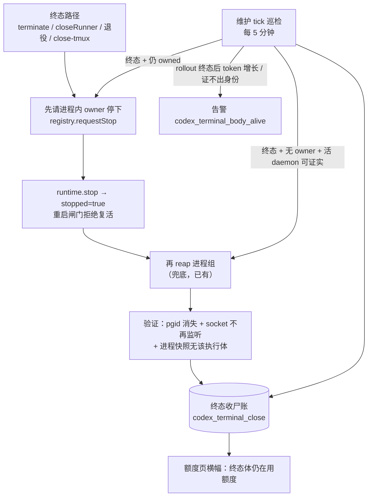

# FLY-2903 已结束的 Codex 体真正关掉 — 探索
Issue: FLY-2903 (https://linear.app/geoforge3d/issue/FLY-2903/codex收尸-已结束的-codex-runner-必须真正关掉daemon-app-server-关闭可验证goal-runtime)
日期: 2026-09-25
基于: 无

## 1. 要回答的问题

FLY-2893 的普查（分支 `flywheel-FLY-2893`，未合入）算出：会话已进入终态（completed / terminated / failed）之后，Codex 执行体又烧了约 **1207M token**，约合一个 Codex 号周额度的 112%。其中两具体占 92%：

| 单 | 执行体 | 会话状态 | 终态后 token | 形状 |
|----|--------|---------|-------------|------|
| FLY-2766 | cf70ee17 | completed | 872.6M | Lead close 后 daemon 收尸 `unverifiable`，又跑约 15h |
| FLY-2873 | 37624e3d | completed | 241.4M | 同形，约 10h；CommDB 行已删，app-server 仍活 |

普查方法（`evidence/scripts/usage.py`）：`session.json.threadId` → rollout 文件 → 累计 `total_token_usage` 差分，切点 = `sessions.terminal_at + 2min`。这是本单「终态后仍在用额度」检测信号的来源。

本文回答：为什么一个已终态的 Codex 体会继续跑，四条要求各自落在代码的哪里。

## 2. Codex 体的进程结构（术语先讲清）

- **daemon / app-server**：`codex app-server --listen unix://<socket>`，真正调模型、真正烧 token 的后台进程。它自成一个进程组（pgid），不在 tmux 里。
- **goal runtime**（`packages/claude-runner/src/codex-daemon-goal-runtime.ts`）：Bridge 进程**内部**的一个对象。它连上 daemon 的 socket，推着「目标」（goal）一轮一轮跑，直到终态。
- **adapter**（`CodexTmuxAdapter.ts`）：同样在 Bridge 进程内，持有 runtime，负责一次执行的开始、收尾、founder 可见的 TUI 窗口（`codex resume --remote`，只是客户端，不烧 token）。
- **所有权登记**（`CodexExecutionOwnershipRegistry`，`claude-runner/src/codex-execution-ownership.ts`）：Bridge 进程内的表，记录「这个执行体此刻由本进程里哪个 adapter 在跑」。现在只有 reserve / claim / release / isExecutionOwned，**没有「请它停下」的通道**。

## 3. 现场事实（代码审计，基线 `6523b997c`，已含 FLY-2830 软链修复）

### E1 复活：goal runtime 只认进程内存里的 `stopped` 标志

`runGoal` 的 catch（`codex-daemon-goal-runtime.ts:757-797`）：

```ts
if (isTransportDeath(err) && restarts < maxRestarts && !this.stopped) {
  restarts += 1;
  this.safeLog(`daemon died mid-goal — restart ${restarts}/${maxRestarts} (rotating account) + resume thread ${threadId}`);
  continue;
}
```

- `maxRestarts` 默认 5，adapter 不传（即 FLY-2814 的「×5」）。
- 每次重启都走 `startSession` → `beforeCodexDaemonStart`（`teamlead/src/codex-quota/runtime.ts:522`），重读 canonical 凭据；若期间切过号，新 daemon 就在**另一个号**上跑 —— 这就是「换号 resume」。该钩子只查额度暂停，不查会话状态。
- `stopped` 只由 `runtime.stop()` 置位。adapter 调 `stop()` 只有三处：受控 phase 关停（`CodexTmuxAdapter.ts:2255`）、进程退役看门狗（`:2261`）、以及 `runGoal` 已经返回之后的 finally（`:2386/:2484`，太晚）。
- runtime **不读任何持久状态**：不看 StateStore 会话状态、不看 terminate 意图、不看 CommDB、不看 TURN。

### E2 Bridge 侧的「关」绕开了 runtime

所有 Bridge 终态路径都经 `reapCodexDaemonForSession`（`teamlead/src/bridge/codex-daemon-teardown.ts:49`）→ `reapCodexDaemonForExecution`（`codex-daemon-runtime.ts:402`）**直接给 daemon 进程组发 SIGTERM/SIGKILL**，不经过 runtime：

| 路径 | 位置 | 先写终态？ | 先停 runtime？ |
|------|------|-----------|---------------|
| Lead / CEO terminate | `actions.ts:1596-1641` | 是（StateStore `terminated`） | **否** |
| closeRunner（非 resident） | `close-runner.ts:837` | 需已终态或 override | **否** |
| 引擎进程退役 | `plugin.ts:13110` → `retireWorkflowProcessBody` → `close-runner.ts:837` | body `retiring` | **否**（`workflowProcessCleanup` 跳过优雅分支） |
| close-tmux | `plugin.ts:4057` | — | 否 |
| closeRunner（resident Codex phase） | `close-runner.ts:751-790` | — | 是（受控关停） |

于是：Bridge 杀掉 daemon → runtime 看到 transport death、`stopped` 仍为 false → 判「中途崩溃」→ 重启 + resume，最多 5 次。StateStore 早已 `terminated`，但 runtime 从不读它。

**退役竞态**：Bridge tick 在 `retirementRequestedAt + 60s` 收割；adapter 看门狗从**首次观察到**批准才开始算 60s 宽限，再加轮询延迟。所以 Bridge 的杀通常先到，runtime 在 `stop()` 到来前已经重启。

**假成功**（代码推断，未复现）：reap 的 `waitForAbsent` 在旧进程组死后回 `reaped`；runtime 随后在同一个 socket 上重生，并经 `onSpawnIdentity` 把 ledger 的 pgid 改写成新的。审计看到「已收掉」，实际换了个身体继续跑。

### E3 关闭结果「不可验证」时没有下文

- reap 返回 `reaped | absent | residual | unverifiable`。`residual/unverifiable` 写两条 `session_events`（`exec_host_processes_residual`、`lead_close_runner_failed{cleanupPending:true}`），然后 **closeRunner 与 terminate 不看结果**，照样杀 tmux、终结 CommDB（`codex-daemon-teardown.ts:45-48` 的注释说是故意的）。
- 没有直接重试。两道间接兜底都够不着 FLY-2873 形状：
  - 终态收割（FLY-2555，`codex-terminal-harvest.ts`）只扫 CommDB `status='running'` 的行；CommDB 行一旦终结，就再也看不到这个执行体。
  - FLY-2169 孤儿收割器要求 `ppid===1` 且进程 ≥2h，而且**不读 StateStore 终态**。FLY-2830 讨论过把它放宽到「终态 10 分钟」，被拒（`FLY-2830/plan.md §4`）。
- reap 路径本身**不 unlink socket**（adapter 路径会）。
- 正常 `session_completed` 与合并后收尾（`post-merge.ts:198-323`）**完全不调** daemon 收割，全靠 adapter 进程内那一次拆除；拆除失败只打一行日志 `daemon teardown unconfirmed`，不写事件。

### E4 「终态后仍在烧 token」在 Bridge 里没人看

- scorecard 的 Codex 用量只在绑定时和收尾时（`final:true`）各导入一次，之后游标标 `complete`（`CodexTmuxAdapter.ts:1345-1377`）。终态之后写进 rollout 的 token 永远不会被导入。
- `codex_quota_signal_event` 只记额度耗尽信号，不记 token 数；`thread/tokenUsage/updated` 在 runner 转录层被丢掉。
- 现成可拼的零件都在：`findCodexRolloutPath`（`claude-runner/src/codex-rollout-probe.ts:10`）、`session.json` 的 threadId、`parseCodexUsageLine`（`teamlead/src/workflow-usage-source.ts:122`）、`sessions.terminal_at`。

### E5 告警与可见性

- 孤儿收割器事件（`codex_app_server_orphan_*`）只进 `session_events`，**没有告警 kind**，没人消费。
- 额度页（`account-quota-page.ts`）只渲染切号横幅、Claude/Codex/Vercel 表；`AccountQuotaView.warnings` 组装了但从未渲染。
- 巡检快照（`scripts/lead-patrol-snapshot.sh`）唯一的 Codex 事实是 `CODEX_SWITCH_FACT`，没有终态体一项。
- 新告警 kind 需要登记：`LeadAlertNotifier.ts` 的 `ALERT_EVENT_TYPES`、`bridge/kind-contract.ts`、`bridge/alert-kind-copy.ts`、`bridge/ticket-owner-map.ts`、`bridge/infra-event-router.ts`。可照抄 `codex_lead_residency_stalled`（`plugin.ts:12796`）。

### E6 已有、可复用的零件

- FLY-2830 `resolveSocketProbePath`：socket 软链先解析再 `lsof`，持有者证据在 0.157+ 上可用了。
- `inspectCodexDaemonOwnership`：ledger pgid + socket live + 持有者属于该 pgid → 才算证实；证不出则 `unverifiable`、**不发信号**。
- `reapCodexDaemonForExecution` 的 `beforeSignal`（每次发信号前同步复查）与 `gracefulOnly`（FLY-2555）。
- FLY-2877 进程快照 `codex-process-snapshot.ts`：按 `FLYWHEEL_EXEC_ID` + `CODEX_HOME` + 前后 argv 一致认进程，只读、不发信号。
- 维护 tick：`plugin.ts:10660` 心跳回调，默认 5 分钟（`TEAMLEAD_STUCK_INTERVAL`），「零新定时器」约定。
- `CodexSessionReowner` 只从 `getReadoptCandidateSessions` 选（已排除 terminated/completed/failed），**不是**本单的复活来源。

## 4. 四条要求 × 根因

| 要求 | 现状 | 根因 |
|------|------|------|
| 1 终态关闭可验证（进程退出 + socket 释放） | reap 自己会等 absent，但结果被丢弃；正常完成路径不经 Bridge；socket 不 unlink；无「每个终态体都有结论」的账 | E3 |
| 2 被终结的体不复活 | Bridge 杀 daemon 不停 runtime → 必复活 | E1 + E2 |
| 3 周期收割 + 告警 | 两道兜底都够不着「CommDB 已终结 + 进程 <2h 或不是 ppid 1」；无告警 | E3 + E5 |
| 4 额度页 / 巡检可见 | 无 | E4 + E5 |

## 5. 设计走向（细节见 research / plan）



## 6. 假设（显式列出）

- A1 Bridge 与 adapter/runtime 在同一进程（生产如此：adapter 由 run-infra 在 Bridge 内构造）。Bridge 重启后 runtime 随之消失，detached daemon 成孤儿，由本单巡检收。
- A2 `sessions.terminal_at` 对 completed/failed/terminated 都有值（FLY-2893 用它做切点，StateStore `:15128` 维护单调）。
- A3 终态且无进程内 owner 的执行体，其 daemon 任何时刻都不应存活：终态之后的合法继续工作一律换新执行体（land 冲突再激活即换体，FLY-2893 K0）。
- A4 TUI 客户端（`codex resume --remote`）不烧 token，daemon 死后它自己断开；本单不给它发信号。

## 7. 不在本单范围

- 真 Codex 演练（Codex 服务恢复后由 QA 做）。
- 用进程快照（env 归属）作为发信号依据 —— 那是新的杀进程路径，要过四本清册；本单证不出身份一律只告警。
- 修改 FLY-2169 孤儿收割器的 2h / ppid 门槛（FLY-2830 已拒）。
- 巡检快照脚本新增一项（额度页 + 告警已满足要求 4；shell 改动会撞 shell 清册守卫）。
- Claude 体（不走 goal runtime）。
