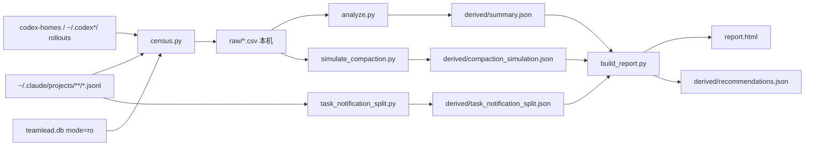

# FLY-2904 Token 浪费全景 — 实施计划
Issue: FLY-2904 (https://linear.app/geoforge3d/issue/FLY-2904/调研token-浪费全景-claude-与-codex-两边我们现在所有的设计和跑法里有哪些机制在浪费-token逐类量化)
日期: 2026-09-25
基于: research.md

## 1. 交付物

本单是只读调研，**不改任何生产配置、不改代码**。交付两样东西：

1. **founder 决策页** `report.html`：一页完整 HTML 文档。每条省法都有「做 / 先不做 / 要讨论」三选一和评论框，页底有「复制全部评论」（改自 FLY-2893 的 `comment_script.js`，本机 localStorage，按 1,800 字切块）。
   用 `flywheel-comm publish-report --publish-only` 发布，拿到 URL 后通过 `ask --report` 交给 Lead 投递。
2. **可复算证据**，全部进 docs PR：
   - 脚本：`evidence/scripts/census.py`、`analyze.py`、`simulate_compaction.py`、`task_notification_split.py`、`build_report.py`、`comment_script.js`。
   - 派生数据：`evidence/derived/summary.json`、`compaction_simulation.json`、`task_notification_split.json`、`recommendations.json`（每条省法的观测集合、假设比例、情景值、系数、分数）。
   - `evidence/raw/freeze-claude-codex.json`：窗口与采集时刻。
   - 逐请求原始行（`evidence/raw/*.csv`，约 60 MB）**不进 git**，本机重跑 `census.py` 生成。
   - 外部来源：FLY-2893 分支 `4fc15a46e53a` 的 `classes.csv`（PR #1336，未合），页上注明。

## 2. 估算规则（防止数字比证据强）

1. **观测消耗**：14 天原始 token，全部从逐请求行重算；总账、分项、闭合校验见 research §0。
2. **情景节省 = 观测集合 × 明示的假设比例**。页面和本表对每条都分开写三样：观测集合是什么、假设比例及理由、情景值。情景值**不是保底，也不是实测**；页面上用「情景省」字样，不用「下限」。
3. **观测集合尽量窄**：只取能直接对应到该省法的请求。无法分离的部分写「未知 / 不计入」，例如 ack 后继续干活的 7.1 亿、等待夹杂其它工作的 17.4 亿、无法归因的工具输出增长、替身首轮 40.5 亿。
4. **不相加**：页面明确写「各条有重叠，不能相加」，**不给总可省合计**。原因：压缩窗口让每次读得少，减少叫醒 / 轮询让读的次数少，两者相乘。
5. **权重**：主表用原始 token（founder 问的就是 token）。每条另标「缓存读为主（加权后约 1/10）」或「含缓存写」。
6. **Codex 折号周**：统一用 10 亿 ≈ 一号一周（FLY-2893 指纹中位），注明区间 3–17%/亿。
7. **排序**：分数 = 情景值中值（亿）× 好做系数，系数为 S=1、S–M=0.75、M=0.5、M–L=0.35、L=0.25；由 `build_report.py` 计算并排序，页面显示分数。只有上限、给不出可信比例的条目单列为「不排序」。

## 3. 省法清单（按分数排序，由 recommendations.json 生成）

| # | 省法 | 观测集合（亿） | 假设比例与理由 | 情景省（亿，14 天） | 好做 | 分数 | 主要代价 / 风险 | 你要亲手做什么 |
|---|---|---|---|---:|:-:|---:|---|---|
| 1 | 给 Lead 开自动压缩（40 万窗口），先拿工程 Lead 试点 | 回放模拟：所有 Lead 都开 40 万窗口时少读的量：91.4 | 67%–100%：模拟没算压缩后回头重读台账 / 文档，低值打 2/3 折；只有试点的 Lead 才拿得到对应部分 | 60.9–91.4 | M | 38.1 | 现成旋钮要先为每个 Lead 采集并核验 baseline（模型、Claude 版本、规则 / 工具指纹要逐项对上），Claude 升级后 baseline 失配会静默失效、要重采；压缩后 Lead 会丢一部分在飞细节，要靠台账补；每次压缩停顿几十秒 | 批准一个工程 Lead 的试点重启窗口 |
| 2 | 收信 ack 和第一个动作放进同一次调用（先改 Lead 提示） | 其中 ack 返回后直接收尾、没再调用工具的 5,457 个请求：25.8 | 75%–100%：提示方案不会 100% 被遵守；另有 7 亿是 ack 后继续干活的请求，合并后能否省掉要逐个看，不计入 | 19.4–25.8 | S | 22.6 | 只改提示，不改 ACK 语义；让 Bridge 代 ack 会改变「已收到」的含义，放到第二步再议 | 无 |
| 3 | 告警去重：同一 Lead、同一标题 6 小时内合并成一条；info 级只进摘要 | 同一 Lead 6 小时内已收过同一标题的 2,928 个回合：27.1 | 75%–100%：状况升级的再次告警要照常叫醒，低值留出 1/4 | 20.3–27.1 | S–M | 17.8 | 状况恶化时的再次告警必须照常叫醒（升级 / 计数翻倍） | 无 |
| 4 | 大输出规范：限制 rg / sed / Read 的输出量，Linear 写单不回显整单 | 能归因到工具输出的上下文增长里，超过 5,000 token 的部分 × 之后的重读次数：30.3 | 35%–55%：规则只能压掉一部分大输出，有些大输出确实需要 | 10.6–16.7 | S–M | 10.2 | 规则太死会让体多读几次 | 无 |
| 5 | 纯通知继续扩大「不叫醒」的覆盖（FLY-2749 的延续） | 这些回合的消耗（info 级告警已算进第 3 条，这里扣掉）：12.2 | 60%–90%：其中一部分带着真实待办，不能吞 | 7.3–11.0 | S | 9.1 | 同 FLY-2749：不能把待办一起吞掉 | 无 |
| 6 | 巡检移出 Lead 上下文：脚本或小模型一次性跑，有异常才叫醒 Lead | patrol_tick + summary_due 回合的消耗：21.3 | 70%–95%：小上下文跑一次约为现在的 1/5；有异常时仍要叫醒 Lead | 14.9–20.2 | M | 8.8 | 巡检判断力可能下降；要改巡检入口 | 无 |
| 7 | 评审作废止损：head 一动就停掉在飞评审；推送后静默 2 分钟再开评审 | 这些任务的全部消耗：16.1 | 50%–90%：停掉之前已经花掉的部分拿不回来；外部已答的可能是 Lead 主动答的 | 8.0–14.5 | S–M | 8.4 | 评审会晚开始约 2 分钟 | 无 |
| 8 | 给 Claude runner / 评审一套精简配置（去掉无关插件、MCP、代理描述、规则） | runner、评审、QA 环境每个请求高于 4.5 万（infra-bot 水平）的最小上下文 × 请求数：33.7 | 30%–50%：最小上下文是代理量，里面还含首个任务等内容，不全是能删的系统前缀 | 10.1–16.8 | M | 6.7 | 可能缺某个技能；要逐角色核对 | 无 |
| 9 | Lead 之间的 Discord 消息只在 @提及 / 本线程时叫醒 | 被其它 bot / Lead 的频道消息叫醒的回合：17.1 | 50%–90%：其中有真协作，比例未核 | 8.6–15.4 | M | 6.0 | 协作消息可能被漏看 | 定一条「Lead 之间什么时候必须 @」 |
| 10 | 轮询改成阻塞等待（check / turn / inbox 加长等待，规则里禁止 sleep 循环） | 只由「命中等待模式、未命中工作黑名单」的调用触发的 8,726 个请求（代理集合，可能仍含少量复合工作；命中工作标记的 24.2 亿不计入）：14.6 | 70%–90%：改成阻塞等待后每段等待仍剩 1–2 次请求 | 10.2–13.2 | M | 5.8 | 长等待期间必须还能收到 Lead 指令，否则体会变迟钝 | 无 |
| 11 | Codex 体终态后立即停干净（FLY-2814 / FLY-2892 一线） | 终态 2 分钟以后仍在消耗的 token（本单复算，与 FLY-2893 差 0.8%）：12.2 | 80%–100%：终态后的消耗理论上应为 0 | 9.7–12.2 | M | 5.5 | 见 FLY-2893 / FLY-2814 | 按 FLY-2893 拍板 |
| 12 | runner 的 Monitor 只推终态（CI 成功 / 失败各一次） | Monitor 事件叫醒的 317 个回合：5.0 | 50%–80%：终态那一次仍要叫醒 | 2.5–4.0 | S | 3.3 | 看不到中间过程 | 无 |
| — | runner / 评审也开自动压缩 | 25 万以上部分的缓存读：40.5（只有上限） | 无可信比例 | 不估 | M | 不排序 | 实现体长任务丢上下文，质量风险最大；没有可信的比例假设 | 建议先不做，观察 |

补充说明：

- 第 1 条的「好做」定为 M，不是 S：现成旋钮必须配 baseline 才会生效，baseline 的各项指纹要与实际相等（research W1）。建议写成「先为工程 Lead 采集并核验 baseline，确认 CLI 支持和余量，再申请一次试点重启」。模拟值假设所有 Lead 都开，只试点一个时只拿到对应部分（工程 Lead 约占模拟节省的 83%）。
- 「Codex 体终态后立即停干净」（key r5）只算终态后残留，对应 FLY-2814 / FLY-2892 一线，不归 FLY-2893 的前三类。
- 「runner / 评审也开自动压缩」（key r13）只有上限，不排序。
- FLY-2893 的引用值放在 `derived/external_refs.json`（带固定 commit），只作未分离参考，不参与排序。

## 4. 页面结构（按 founder-decision-page 经验：先结论，再「你要做什么」）

1. **一句话结论**：两周 685 亿 token，98% 是重读已有上下文。最大的两个漏洞是 Lead 常驻 1M 上下文、Lead 被重复 / 无需动作的消息反复叫醒。前三条都不需要你写代码，你只需要批一个工程 Lead 的试点重启窗口。
2. **推荐先做的 3 条**：分数最高的三条，每条一张卡片，写明观测、假设、情景省、代价、你要做什么、退路。
3. **总账**：谁在用（表 + 横条图）；Claude / Codex 两列；加权说明折叠放在后面。
4. **全部省法**：按分数排序的卡片，每条有选择和评论框；「不排序」条目放最后。
5. **核过、但不是问题的**：整包测试、缓存重建、founder 会话、语音缺口。
6. **口径**：窗口、校验、不能相加、只读。
7. **复制全部评论**。

页面遵循 Apple 浅色风格（`html-report-style` 规则）。完整文档包含 `<!doctype>`、`<head>`、charset / viewport；做 390px 适配，不出现横向滚动。

## 5. 验收

- `build_report.py` 只从 `derived/*.json` 读数，页面上的数字不手抄；`recommendations.json` 与页面同源生成。
- 发布后 `curl` 线上 URL：HTTP 200，占位符残留为 0；用 390px iframe 量 `scrollWidth`（参见 headless-chrome-min-viewport-500 经验）。
- 页面和 git 里都不含任何消息原文或命令原文，也不含 token / 密钥。
- PR 只含 `engineering/doc/FLY-2904-token-waste-census/**`。

## 6. 不做的事

- 不改 Lead 配置、不重启任何东西、不开 Linear 子单：这些都等 founder 在页上勾选后，由 Lead 决定。
- 不重测 FLY-2893 已经测过的 Codex 出事分类。
