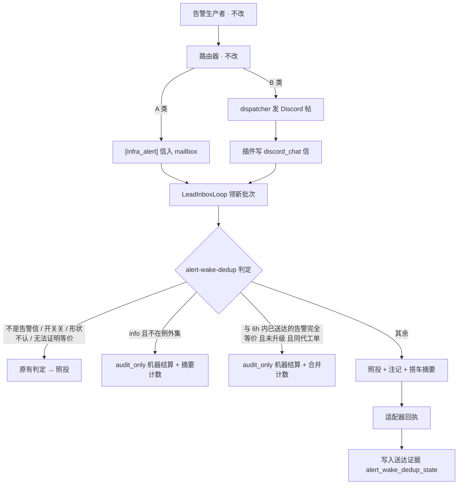

# FLY-2910 告警叫醒去重 — 实施计划
Issue: FLY-2910 (https://linear.app/geoforge3d/issue/FLY-2910/token3-告警去重同一-lead-6-小时内同一标题的告警只累加计数不再叫醒状况升级照常叫醒info-级只进摘要)
日期: 2026-09-25
基于: research.md

> 版本：v2.2（R1 后重写，R2、R3 各修两项，R4 scoped 验证 APPROVED；评审模型 gpt-6-astra xhigh，共 4 轮，见 §13 与 `review/`）。

## 0. 结论（给 founder）

**合并规则**：同一个 Lead 6 小时内又收到一条告警，只有同时满足以下几点才只记账、不叫醒：
- 与一条**已经确认送达**给它的告警**完全等价**：类别、标题、处理对象、处理要求、数量都一样，只允许时间戳不同；
- 没有变严重；
- 属于同一代工单。

**照常叫醒**：任何一点不同，或者无法证明等价，都照常叫醒。叫醒的信里写明「同类 6 小时内共几次、其中几次已合并」。

**info 级**：不叫醒，搭车进下一次叫醒的摘要，全量在告警看板可查。例外是带待办的 info（`flag_scan_handoff`），照常叫醒。

**开关**：`lead_alert_wake_dedup`，按项目生效，默认开；关掉后下一封信就恢复逐条叫醒。

**9-25 回放**（设计阶段快照，PT 00:00–21:00，`evidence/replay-0925-strict.json`；工单代次按「同一关联键视为同代」近似，属于**上限估算**，见 §8、§10）：

| 口径 | 叫醒次数 |
|---|---|
| 改前 | 152 |
| 本设计·上限（假设同一关联键在窗口内是同一代工单） | **102（-33%）** |
| 本设计·已验证下限（历史信没有代次映射，只算 info 摘要） | 134（-12%） |
| 其中：claw（告警值班），上限 | 138 → 88 |
| 其中：工程 Lead | **14 → 14，本单对它零节省** |

- founder 点名的 `Cross-family review job failed` 每条都是不同的 review 请求，多数带「请重试」的真实待办，按 issue 第 2 条和「不吞待办」必须叫醒。
- 省下来的来自三类：同一批僵尸 session 被反复报告（17 次）、同一个 cmux 监视器进程的重复告警（6 次）、info 级「评审通过但有建议」（18 次）。
- FLY-2904 的 27.1 亿是「只看标题」口径（9-25 为 152→37），它会把不同评审的失败合并掉。本设计只拿到可证明安全的那一部分：按 9-25 比例约为标题口径节省的 43%，粗估 14 天约 11–12 亿 token，以缓存读为主，上线后复测才算数。上线后 `alert_wake_letter` 开始有真实映射，实际值会落在下限与上限之间。

## 1. 范围

**做**
1. 在 Lead 收件箱消费端加一道判定，写在新模块 `packages/teamlead/src/bridge/alert-wake-dedup.ts`，覆盖 A 类 `[infra_alert]` 信和 B 类 dispatcher 的 ticket 格式帖。
2. 合并的信做机器结算：直接 ACKED，并标为 audit_only（只记审计、不交给模型）。
3. 送达证据只在适配器回执之后写入，存在新表 `alert_wake_dedup_state`（teamlead.db）。
4. 叫醒信加注记，下一次告警叫醒时在信首附摘要，`/duty/alert-board` 增加 `wakeDedup` 小节。
5. 新增项目级开关，默认开。
6. 补单测，并用生产判定模块对 9-25 整天做回放。

**不做**
- 不改任何告警生产者、路由器、Discord 帖、工单线程、`alert_mailbox_ledger` / `alert_threads`。
- 不新建 timer、daemon 或摘要频道。
- 不合并任何无法证明等价的告警，包括：未知形状、正文清单被截断且没有可信身份、plain 格式的帖、查不到工单代次的信。
- 不追溯历史信；冻结批次和重投一律照投。
- 顺带发现的 mailbox `priority` 排序疑似反向（`mailbox-queue.ts:1556`）只记为发现，交给 Lead 裁定是否开单。

## 2. 总体流程



判定过程**只读**安全状态。可以授权合并的状态，只能由送达之后的钩子写入。

## 3. 认信与等价指纹（纯函数）

### 3.1 认定告警信
- **A 类**：同时满足 `recipient_kind='lead'`、`source_kind='infra_alert'`、`content` 以 `[infra_alert] ` 开头（`[alert_handoff]` 不认），并且末行能解析出 `event=` 与 `severity=`。
- **B 类**：同时满足 `type='discord_chat'`、信封 JSON 可解析、`authorId === dispatcherUserId()`（运行时的 `alertDutyDispatcherBotUserId.current`，取不到就不认）、信封 `leadId` 等于本 Lead、首行符合 ticket 格式 `{🚨|⚠️|ℹ️} **<标题>** (<lead> / <kind>)`。
  - plain 格式（`deliveryStyle:"plain"`，`LeadAlertNotifier.ts:2110`）和 shell 发的非 ticket 格式都不认，照投。9-23 以来 dispatcher 的 494 个帖里 plain 为 0 个。
- 其他行返回 `null`，交给原有判定。

### 3.2 等价指纹 `fingerprint`
`fingerprint = sha256(kind ‖ 原始标题 ‖ identity)`，其中 identity 按下面两种情况取：

1. **已知形状，用可信的生产者身份**（白名单，逐条写死并由单测钉住）：
   - `zombie_session_backlog`（A 类）：`source_ref`（eventId）形如 `zombie-backlog:<sig>:<ms>`，其中 `sig` 是生产者对**完整**的排序 `shape:executionId` 集合算出的 sha256 前 16 位（`fleet-sensors.ts:666-691`）。identity 取 `sig`。正文里的样本清单即使被截断，也能靠它证明等价。
2. **其余 kind，用规范正文**：
   - 取除首行、`event=` 行、`🎫` 工单头以外的全部正文行；
   - 只折叠 ISO 时间戳，以及白名单里按 kind 列出的易变字段（本期只有 `cmux_watcher_stalled` 的 `heartbeat_age_ms=` / `event_age_ms=`）；
   - UUID、issue id、requestId、数字、session 清单一律**保留原样**；
   - 正文命中截断标记（如 `仅列前 N`、`…共 N 个`、`(+N more)`）的，不产生指纹，照投。

说明：
- 标题不做规范化。数量、issue id 只要变化，指纹就不同，自动算作「新对象 / 新数量」。
- 对象和处理要求绑定在同一个指纹里，不存在「A 对象 + Y 动作」的交叉误认。
- issue 列的四条升级规则中，「对象不同」「新的处理要求」「计数变化（含翻倍）」都被「指纹不同就叫醒」**严格覆盖**：只要数量变了就叫醒，比「翻倍才叫醒」更保守。「级别升高」单独判断。

### 3.3 类别键（只用于计数、摘要、看板，**不参与合并判定**）
`categoryKey = kind ‖ 规范化标题`。规范化按顺序把 ISO 时间、UUID、长 hex、issue id、数字替换成占位符。例：`FLY-2798 delivery contract stalled` 与 `FLY-2802 …` 归入同一类别，但它们的指纹不同，都会叫醒。

### 3.4 工单代次 `ticketGeneration`（R2 修正）

代次 = 该信所属工单的 **canonical event_id**，即账本里这一代工单首次开单时的 eventId。它全局唯一：resolve 之后复发会以新的 eventId 重开（`StateStore.ts:24776-24800` 的 reseed 分支把 `event_id` 换成来信的 eventId），所以不需要 `opened_at`（秒级精度，同一秒内可能碰撞）。

来信自己的 eventId **不是**代次。合并分支只给旧 canonical 行加 `fire_count`（`:24760-24774`），第二次触发的 eventId 在账本里查不到。

- **A 类：入队时记下关联，判定和回执时读同一份。**
  - `upsertAlertMailboxLedger` 的返回值增加 `canonicalEventId`：
    - `merged` 与 `locked_canonical` 取 `existing.event_id`；
    - 新建与 `reseeded` 取 `input.eventId`；
    - 其余分支没有可靠关联，返回 `null`。
    - 只改返回值，不改 SQL 与现有调用方行为。
  - `LeadInboxRuntime.enqueueInfraAlert`（`lead-inbox-runtime.ts:645`）在 upsert 成功后，把 `(delivery_id, correlation_key, canonical_event_id)` 用 `INSERT OR IGNORE` 写入新表 `alert_wake_letter`。首写为准，所以同一封信的进程内重试结果稳定。
  - 以下情况都不写映射，于是判定为「代次未知」、照投：upsert 抛错（现有 `ledgerWriteErrorCount` 路径）、duty fallback 以外的异常分支、`canonicalEventId=null`。
  - `canonicalArchived` 分支已有原 delivery，不重复写。
- **B 类**：用 `store.getAlertThreadByRootMessageId(envelope.messageId)`（`StateStore.ts:25961`）取该线程行的 `event_id`（episode 的 canonical 身份）。查不到时照投：帖子是线程内回复、映射已被覆盖、或尚未落账，都属于这种情况。
- 合并要求当前信的代次与送达记录里的代次**逐字相等**。回执钩子写送达证据时，读的是同一份关联（A 类读 `alert_wake_letter`，B 类用同样的 root 查询）。

## 4. 判定规则（`decideAlertWake`）

1. 开关关（读失败也算关）→ 返回 `null`，**零读零写**。
2. 解析失败或形状不认 → 返回 `null`，照投，计数器 `alertWakeDedup.unrecognized` 加一。
3. `severity=info` 且 `kind ∉ INFO_WAKE_KINDS`（`{"flag_scan_handoff"}`）→ digest：机器结算，并把 info 行的 `suppressed` 和 `digest_pending` 各加一。
4. 算出指纹和代次，任一失败 → 照投，reason 记 `unprovable`。
5. 查 `(lead_id, fingerprint)` 的送达记录 `rec`。满足下表任一条就照投（叫醒），reason 为命中的第一条：

   | reason | 条件 |
   |---|---|
   | `no_delivered_equivalent` | `rec` 不存在 |
   | `window_expired` | `now - rec.window_started_at > 6h` |
   | `severity_up` | `rank(severity) > rec.max_severity`（warning=1，severe=2） |
   | `new_ticket_generation` | `ticketGeneration ≠ rec.ticket_generation` |

6. 都不满足 → suppress：机器结算，`rec.suppressed`、`rec.digest_pending`、`rec.occurrences` 各加一，并更新 `rec.last_seen_at`。

**送达证据的写入**（`recordDelivered(row)`）：由 `markAuditDelivered` 在适配器回执和 owner 检查之后调用（`lead-inbox-loop.ts:494-526`）。它重新解析这一行，算出指纹和代次（A 类读 `alert_wake_letter`，代次未知则不写证据）。以下全部在**一个 StateStore 事务**里完成：
- **按 delivery 幂等（R3 修正）**：先给本 delivery 打持久标记。
  - A 类：`UPDATE alert_wake_letter SET evidence_recorded_at = ? WHERE delivery_id = ? AND evidence_recorded_at IS NULL`；
  - B 类：`INSERT OR IGNORE INTO alert_wake_letter (delivery_id, evidence_recorded_at, recorded_at) …`；
  - 只有恰好改动一行才继续，否则说明这封信已经记过账，直接返回。
  - 冻结批次在「钩子已执行、队列落账前崩溃」后原样重投时，回调顺序可能是 A→B→A→B，每个 delivery 仍只记一次。
- 若没有记录或窗口已过期：新建或重置记录，`window_started_at = now`，`delivered_delivery_id = row.delivery_id`，`max_severity`、`ticket_generation` 取本行的值，`occurrences = 1`，`suppressed = 0`。
- 若窗口仍有效：
  - **代次与记录相同**：`max_severity` 取两者较大值；
  - **代次与记录不同（R3 修正）**：`ticket_generation` 换成本行代次，`max_severity` **重建为本行级别**，保证级别证据与代次出自同一代已送达的告警；
  - 两种情况都执行 `delivered_delivery_id = row.delivery_id`、`occurrences += 1`，**`window_started_at` 不变**（固定窗口）。

写入失败只记日志，不抛错，也不影响投递。缺少证据时，下一条等价告警会照常叫醒（偏安全）。

**这样能挡住的失败序列**：
- 在回执之前失败的信不会产生送达记录，包括投递失败退避后死信、回执前崩溃、回执前 fence 丢失。所以后来的等价告警照常叫醒。
- 回执与 owner 检查已通过、证据已写入之后，队列落账仍可能失败并触发冻结重投。这时保留证据是正确的，因为 Lead 已经真实收到；靠幂等保证不重复计数。
- 别的对象送达成功不会遮盖它：记录按指纹分开，不按类别。

**注记（R2 修正）**：写在被叫醒信的信尾。只要本类别在窗口内（**含当前这封**）累计 ≥ 2 次，就加注记，包括「对象或数量变了」这类没有合并记录的升级。计数口径：
- `categoryOccurrences` = 同一 `(lead_id, category_key)` 下 `window_started_at ≥ now-6h` 的各记录 `occurrences` 之和，加上本批次中排在前面、同类别且被叫醒的信数，再加 1（当前这封）；
- `categorySuppressed` = 同范围内 `suppressed` 之和；
- 这是展示用计数，按判定时的快照计算；安全证据仍只在回执后建立。
```
[告警合并] 同类告警 6 小时内第 {categoryOccurrences} 次，其中 {categorySuppressed} 次与已送达的告警完全相同、已合并未叫醒你；这次叫醒原因：{内容与已送达的不同（对象、处理要求或数量变了）|超过 6 小时|级别升高|工单重开|无法证明与已送达的相同}。
```

**搭车摘要**：
- 挂在本批次第一封**被叫醒的告警信**的信首。取该 Lead 所有 `digest_pending > 0` 的记录（info 和重复），按次数降序最多列 10 行，取完清零（至多一次）。
- 挂不挂由判定时决定，写进 `delivery_content`。承载它的那封信如果最终没有送达，这段摘要会丢失，全量仍在看板上。
- 格式：
```
[告警摘要] 上次告警叫醒以来，有 {total} 条告警没有叫醒你（重复 = 与已送达告警完全相同；info = 通知）：
- ×{n} {kind} · {categoryTitle}（重复|info）
…（其余 {k} 类见 GET /duty/alert-board 的 wakeDedup）
```

## 5. 持久化与接线

### 5.1 teamlead.db 新表（在 `StateStore.ts` 用 `CREATE TABLE IF NOT EXISTS`）
```sql
CREATE TABLE IF NOT EXISTS alert_wake_dedup_state (
  lead_id TEXT NOT NULL,
  fingerprint TEXT NOT NULL,          -- info 行为 'info:' || category_key 的 sha256
  project_name TEXT NOT NULL,
  event_type TEXT NOT NULL,
  category_key TEXT NOT NULL,
  category_title TEXT NOT NULL,       -- 规范化标题（展示用）
  info_only INTEGER NOT NULL DEFAULT 0 CHECK (info_only IN (0,1)),
  window_started_at TEXT NOT NULL,    -- 非 info：首次送达时间；info：首次出现时间
  delivered_delivery_id TEXT,         -- 非 info 必填
  max_severity INTEGER NOT NULL DEFAULT 0,
  ticket_generation TEXT,             -- canonical event_id（A 类）或线程行 event_id（B 类）
  occurrences INTEGER NOT NULL DEFAULT 0,
  suppressed INTEGER NOT NULL DEFAULT 0,
  digest_pending INTEGER NOT NULL DEFAULT 0,
  last_seen_at TEXT NOT NULL,
  PRIMARY KEY (lead_id, fingerprint)
);
CREATE INDEX IF NOT EXISTS alert_wake_dedup_state_category
  ON alert_wake_dedup_state(lead_id, category_key, window_started_at);
```
- 全部使用参数化 prepare。StateStore 提供以下方法：
  - `getAlertWakeDedupRecord`
  - `recordAlertWakeDelivered`
  - `bumpAlertWakeSuppressed`
  - `bumpAlertWakeInfo`
  - `sumAlertWakeCategory(leadId, categoryKey, sinceIso)`
  - `takeAlertWakeDigest(leadId, limit)`（事务内读取并清零）
  - `listAlertWakeDedup(sinceIso)`
```sql
CREATE TABLE IF NOT EXISTS alert_wake_letter (
  delivery_id TEXT PRIMARY KEY,       -- mailbox delivery_id
  correlation_key TEXT,               -- A 类入队时写入；B 类为 NULL
  canonical_event_id TEXT,            -- A 类工单代次；B 类为 NULL（代次走线程查询）
  recorded_at TEXT NOT NULL,
  evidence_recorded_at TEXT           -- recordDelivered 的逐 delivery 幂等标记
);
```
- **增长与清理（R2 修正）**：指纹里保留了 UUID/requestId，一次性出现的指纹会一直累积，不受 6 小时窗口约束。两张表都不设单独的清理任务，改为 `recordDelivered` 每次顺带执行有界删除：
  - `DELETE … WHERE rowid IN (SELECT rowid … WHERE last_seen_at < now-48h AND digest_pending = 0 LIMIT 200)`；
  - `alert_wake_letter` 按 `recorded_at < now-48h` 同样删除（48 小时远大于 6 小时窗口加排队时间）。
  - 实际行数约为「48 小时内的不同指纹数」加「48 小时内的告警信数」，按 9-25 量级在数百行。
- 留存分类片段：`scripts/lib/fly-2006-retention-tables/teamlead/alert_wake_dedup_state.json` 与 `alert_wake_letter.json`，classification 为 `protectedCurrentOrReference`（表由自身逻辑有界清理，不纳入 FLY-2006 删除策略）。实现时按 README 的要求由评审确认分类。

### 5.2 flywheel-comm `MailboxQueue` 新增两个带 fence 的方法
- `settleClaimAsAudit({id, ownerEpoch, batchId, decision})`
  - WHERE 条件与 `releaseClaimForAudit`（`mailbox-queue.ts:1144`）相同：`LEASED`、本 owner、本 batch、`model`、`delivered_at IS NULL`、`notified_at IS NULL`。
  - 执行：`state='ACKED'`、`acked_at=decidedAt`、`resolved_via='alert_wake_dedup'`、`delivery_disposition='audit_only'`，写四个 notification 列，清空 claim、batch、`next_retry_at`。
  - 同一事务写 `mailbox_log`，id 为 `notification-audit:<deliveryId>:<policyVersion>`。
  - 恰好改了一行才返回 true。
  - 结算后的行由现有 ACKED 保留期归档（`mailbox-queue.ts:3089-3128`）。
- `annotateLeadDelivery({id, ownerEpoch, batchId, deliveryContent})`
  - fence 条件相同，只执行 `SET delivery_content = ?`，不改 `content`，所以 `parseDiscordChatRoute(row.content)` 不受影响。

### 5.3 `LeadInboxLoop` 判定结果类型扩展（`lead-inbox-loop.ts:62-69, 360-390`）
- 新增 `{deliver:true, deliveryContent:string}`：先调用 `annotateLeadDelivery`，返回 false 时抛 `owner fence lost`；然后 `getById`。
- 新增 `{deliver:false, disposition:"audit_only", auditDecision, settle:"acked"}`：调用 `settleClaimAsAudit`。
- 原有分支保持不变。审计字段：
  - `policyVersion = "alert-wake-dedup-v1"`；
  - `reason` 取 `alert_equivalent_delivered` 或 `alert_info_digest`；
  - `proofRef` 为 `alert-dedup:<leadId>:<fingerprint 前 16 位>:<delivered_delivery_id>`，info 行为 `alert-dedup:<leadId>:info:<category 哈希>`。

### 5.4 接线（`lead-inbox-runtime.ts:514-526`，以及 `:645` 的入队）
- 入队：`enqueueInfraAlert` 在 `upsertAlertMailboxLedger` 成功后写 `alert_wake_letter`（§3.4）。duty fallback 分支（`:760-790`）用它自己的 upsert 结果写入。写失败只记日志，信照常入队，后果是这封信的代次未知，照投。
- `StateStore.upsertAlertMailboxLedger` 的返回类型增加 `canonicalEventId: string | null`，现有调用方忽略它即可。
```ts
revalidateModel: async (row) =>
  alertWakeDedup.revalidate(row, lead.agentId, project.projectName) ?? admission.revalidate(row),
markAuditDelivered: (row) => {
  alertWakeDedup.recordDelivered(row, lead.agentId, project.projectName); // 内部 catch + log，不抛
  /* 原有 lead_event / question 镜像逻辑不变 */
},
```
- `alertWakeDedup` 由 runtime 构造，依赖：`store`；`dispatcherUserId: () => string|null`（plugin 传入 `alertDutyDispatcherBotUserId.current`，在 `plugin.ts:9548/10062`）；`isEnabled(project)`；`now`。
- **异常行为按现有合同**：`revalidate` 抛错会让本 tick 失败。批次成员已冻结，下一 tick 不再是新批次，也就不再重验证，于是照投（`lead-inbox-loop.ts:348-365`）。不新增失败计数兜底，用测试钉住这一行为。

## 6. 开关 `lead_alert_wake_dedup`
- 在 `packages/config/src/feature-flags/registry.ts` 登记：

  | 字段 | 值 |
  |---|---|
  | `configKey` | `"lead.alert_wake_dedup_enabled"` |
  | `category` | `feature` |
  | `source` | `project_config` |
  | `scope` | `project` |
  | `polarity` | `default_on` |
  | `valueKind` | `bool` |
  | `default` | `true` |
  | `toggleable` | `conversational` |
  | `whenOn` | 「同一 Lead 6 小时内与已送达告警完全等价（同类别、同标题、同对象与处理要求、未升级、同代工单）的告警只记账不叫醒；info（带待办的除外）进下一次叫醒的摘要。」 |
  | `description` | 写明 `feature-flags set --name lead_alert_wake_dedup --to off --project <p> --reason <r>` |
  | `readSites` | `flagStoreSite("packages/teamlead/src/bridge/alert-wake-dedup.ts","AlertWakeDedup.revalidate","storeLeadAlertWakeDedupEnabled")` |

- 读取器 `storeLeadAlertWakeDedupEnabled` 写在 `flag-store-runtime.ts`，照抄 `storeLeadTokenSavingsEnabled`（`:239`）；读失败或值非法返回 false。
- `recordDelivered` 不读开关，只要本行是被认出的告警信就记录。这样开关从关切到开时，已有送达证据可用；即使没有证据，也只会多叫醒。
- 同步更新：`feature-flags-drift.test.ts` 的 readSite 元组、`feature-flags-registry.test.ts` 的 `EXPECTED_WHEN_ON`、store-policy 测试；并按 `doc/engineer/implementation/flag-authoring-runbook.md` 核对。

## 7. 固定页
`bridge/alert-duty-router.ts` 的 board 响应加只读字段 `wakeDedup: Array<{leadId, eventType, categoryTitle, infoOnly, occurrences, suppressed, windowStartedAt, lastSeenAt}>`，数据来自 `listAlertWakeDedup(now-24h)`。沿用该路由现有鉴权，不新增路由。

## 8. 测试（本机只跑相关文件；排除 `**/tmux-viewer.macos.test.ts`）

**新增 `packages/teamlead/src/bridge/__tests__/alert-wake-dedup.test.ts`**：纯函数部分，加上真 StateStore 和真 MailboxQueue 的临时库。
1. 完全等价的第二封信：在已送达记录存在、6 小时内、同代工单时被合并；mailbox 行变为 ACKED + audit_only，`resolved_via='alert_wake_dedup'`，`mailbox_log` 有记录。
2. 以下各自叫醒，并断言注记里有累计次数：
   - 级别升高；
   - 数量变化（12→13、12→24）；
   - 不同 session / issue；
   - **同一执行、不同 requestId 的 `review_job_failed`**（人工重试文案）；
   - 正文 session 清单变化（真实反例：9-25 UTC 08:26:45 → 09:05:02，11→12）；
   - 正文处理要求变化；
   - A 类 resolve 后复发，**包括同一秒内的复发**：`canonical_event_id` 变化、`opened_at` 相同，仍须叫醒；
   - B 类 root 映射缺失或代次不同；
   - **对象或数量变化的升级（`suppressed=0` 时 12→13，以及同执行新 requestId），叫醒信的注记里要有包含当前这封的类别累计次数。**
2b. **沿真实路径的合并正例（R2）**：走 `upsertAlertMailboxLedger → enqueueInfraAlert → 投递回执 → recordDelivered → 第二次 fire（不同 eventId，同一未解决工单，内容相同）→ revalidate`，第二封必须被合并。`alert_wake_letter` 缺失时则必须叫醒。
2c. **幂等（R3）**：同一指纹的 `[A, B]` 批次，钩子执行完后、队列落账前崩溃，然后完整重投（回调顺序 A→B→A→B），最终 `occurrences` 仍为 2。单封 A→A 同理。
2d. **跨代级别（R3）**：G1 的 severe 已送达 → resolve → G2 的 warning 因代次变化叫醒并送达 → G2 的 severe 到来，必须按 `severity_up` 叫醒。
3. **失败序列**：A 判定叫醒 → 投递失败退避 → B 送达 → A 死信 → A 的等价信再来 → 叫醒。另测投递前崩溃、fence 丢失：都没有送达记录，下一条等价信叫醒。
4. 固定窗口：0h 送达 X，5h 送达 X 的升级版，6h+1ms 再来 X → 按 `window_expired` 叫醒。
5. 不同 Lead、相同告警互不合并；同一 Lead 不同 kind、相同标题也不合并。
6. info：`review_advisory_pass` 不叫醒、进摘要；`flag_scan_handoff` 照常叫醒。
7. 认信负向：
   - `[alert_handoff]`、founder 的 `discord_chat`、`authorId` 不是 dispatcher（`authorName` 伪造成 `flywheel-alerts-dispatcher`）、dispatcher id 取不到、plain 格式帖、question 行、lead_event 行，全部不经本模块；
   - 正文被截断、又不在已知形状白名单里的信，照投。
8. 开关关：`revalidate` 返回 `null`，不读写表；读开关抛错时同样处理。
9. 重验证抛错：本 tick 失败，下一 tick 冻结批次照投，没有信被结算。
10. 搭车摘要：只挂在批次里第一封被叫醒的告警信上，最多 10 行，取后清零；founder 消息批次不挂。
11. 表驱动：用 research.md §2 的真实标题和正文断言类别规范化、指纹稳定性，以及 cmux 易变字段折叠。

**扩展现有测试**
- `lead-inbox-loop`：两个新判定分支；fence 丢失抛错；批次全部被合并时不调用 adapter。
- `mailbox-queue`：`settleClaimAsAudit` / `annotateLeadDelivery` 的 fence 条件；结算行进入 ACKED 归档路径。
- flag 三处登记；retention fragment 走 loader 测试。

**验收回放**：`engineering/doc/FLY-2910-alert-wake-dedup/evidence/replay-real.ts`（`npx tsx`，只读 CommDB 和 teamlead.db）。
- 按时间顺序把 9-25（PT 整天）真实的信喂给**生产判定模块**，用内存 StateStore。原始状态为 ACKED 的被叫醒信视为已送达，并调用 `recordDelivered`。
- **工单代次分两栏报告，不设节省比例门槛**：历史信没有 `alert_wake_letter`（这张表上线才开始写），而 `alert_mailbox_ledger` / `alert_threads` 每个关联键只保留最新一代。
  - **「已验证」栏**：代次按生产接口的真实结果处理，查不到就照投。对历史数据来说，这一栏几乎只剩 info 摘要，作为下限。
  - **「代次假设同代」栏**：假设同一关联键的信在窗口内属于同一代，作为上限估算，明确标注「未验证」。
  - 上线后可以用真实的 `alert_wake_letter` 复测。
- 输出按批次口径的改前、改后叫醒次数，各 reason 计数，分 Lead 列出；再逐条列出**每一封被合并的信和它对应的已送达等价信**（kind、指纹、两者 delivery_id），供 QA 抽查。
- 设计阶段的 Python 近似为 152→102。与生产模块结果有差异时，逐项解释；节省少了就如实接受。

## 9. 已报 Lead 的口径（非阻塞，按推荐推进）
- 问题 `5b09be16-69a0-45c4-b94d-33c1546e76b3`：按 issue 字面规则实现，不放宽「对象不同」；工程 Lead 收益很小（v2 为零）。
- 问题 `a262e864-73f7-46bf-ac8f-8f78fb0dd697`：「计数翻倍」在 v2 中被更严格的「数量变化就叫醒」覆盖；info 设带待办例外集；摘要走「搭车 + 固定页」。
- v2 相对 v1 把 9-25 的节省从 -44% 降到 -33%，原因是只合并能证明安全的部分。将随 DESIGN-HTML 报告一并告知 Lead。若 Lead 改口径，写 design-correction.md 增量调整。

## 10. 诚实边界
- **只合并能证明等价的**。未知形状、截断清单（白名单外）、plain 帖、查不到工单代次的信全部照投。以后新增的告警默认不被合并，只有进了已知形状白名单或正文天然稳定的才会被合并。
- **摘要至多一次**：承载它的那封信如果最终没有送达，这段摘要会丢失；全量在 `/duty/alert-board` 和 mailbox audit 行。
- **判定只作用于新批次**：重投和冻结批次照投，实际节省可能略低于回放。
- **节省量是粗估**：由 9-25 单日外推，按 FLY-2904 平均每次重复叫醒约 92 万 token 折算。上线后用 FLY-2904 的 census 脚本复测才算数。
- **回放无法验证工单代次**（原因见 §8），节省量只能给出「已验证下限」与「假设同代上限」两个数；上线后以真实映射复测。
- **B 类合并依赖 root 映射**：如果同一 episode 的重复告警以线程内回复的形式到达，查不到 root 映射，一律照投。B 类的实际节省可能接近零，这是可证明安全的代价。

## 11. 回滚
- 运行时：`feature-flags set --name lead_alert_wake_dedup --to off --project <p> --reason <r>`，下一封信即恢复逐条叫醒。已合并的信不补投，它们以 ACKED + audit_only 留存，可逐条查。
- 代码：revert PR。新表成为孤表，无害。

## 12. 实施顺序（TDD）
1. 认信、类别规范化、指纹、代次的纯函数，加表驱动测试。
2. `decideAlertWake` 纯函数，加测试 2、4、5、6。
3. StateStore 表、方法、retention fragment。
4. MailboxQueue 两个方法，加 fence 测试。
5. LeadInboxLoop 判定分支与 `recordDelivered` 接线，加测试 1、3、9、10。
6. 开关登记，plugin 与 runtime 接线，加测试 7、8。
7. 注记、摘要、board 字段。
8. 真实回放，写入 `evidence/`，更新 progress.md。

## 13. Design review 记录
- **R1（CHANGES REQUESTED，5 项阻塞，全部采纳）**：
  1. 判定时写窗口不能当作送达证据 → 证据改在适配器回执后写入，按指纹逐条记录，删除「锚点」。
  2. 对象/动作的启发式把不同待办折叠在一起 → 改为完整等价指纹（保留 id 和数字），加已知形状白名单，截断即不可证明。
  3. 工单复发 → A、B 两类都比对工单代次，B 类改用 `getAlertThreadByRootMessageId`，查不到就照投。
  4. 窗口被无限续期 → 改为固定窗口，按指纹计。
  5. plain 通知 → 明确不认，照投。9-23 以来出现 0 次，写入边界。
  - 非阻塞建议全部采纳：删除失败两次兜底并测试现有冻结批次行为；翻倍口径已写明被更严格规则覆盖；回放逐条列出合并样本。
- **R4（Lead 授权的 scoped 验证轮，只验证 R3 两项）：APPROVED**。两项均关闭，没有新的 BLOCKER/HIGH，也没有 MEDIUM/LOW 的 follow-up。见 `review/design-review-round4.md`。
- **R3（CHANGES REQUESTED，2 项，全部采纳）**：
  1. 换代时 `max_severity` 重建为本行级别，只有同代才取最大值；补 G1 severe → G2 warning → G2 severe 用例。
  2. 幂等改为 `alert_wake_letter.evidence_recorded_at` 逐 delivery 持久标记（R2 时名为 `alert_letter_ticket`，R3 起更名并加这一列，下文 R2 记录已统一用新名），与计数更新同事务，删除 `last_recorded_delivery_id`；补 `[A, B]` 冻结批次重投用例。
- **R2（CHANGES REQUESTED，2 项，全部采纳）**：
  1. 工单代次改为 canonical event_id。入队时经 `upsertAlertMailboxLedger` 新增的返回值写入 `alert_wake_letter`，判定与回执读同一份关联；B 类用线程行 `event_id`；补真实路径正例和同一秒复发用例；回放分「已验证 / 假设同代」两栏。
  2. 注记条件改为「类别累计（含当前）≥ 2」，计数包含本批次前面的信；`recordDelivered` 按 delivery 幂等。
  - 非阻塞建议全部采纳：说明行数真实增长方式，并加有界顺带清理；fence 描述限定为回执之前；逐封对应表留在实施验收。
