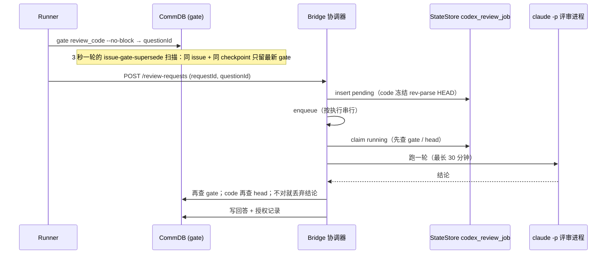

# FLY-2911 评审作废止损 — 探索
Issue: FLY-2911 (https://linear.app/geoforge3d/issue/FLY-2911/token7-评审作废止损新-head-一推就停旧评审推送后静默-2-分钟再开评审撞额度的自动重试先核版本同一-gate-只留最新任务)
日期: 2026-09-25
基于: 无

## 1. 范围确认：只有一条评审通道在烧这笔钱

- FLY-2904 W9 的 16.1 亿全部来自「Bridge 派的 Claude 评审」会话，也就是
  `packages/teamlead/src/bridge/review-request-coordinator.ts` 的 `ReviewRequestCoordinator`
  （codex 作者 → Claude 评审；FLY-2763 之后也包括受许可的同家族评审）。
- Claude 作者 → Codex 评审走 runner 本地的 `codex-design-review` / `codex-code-review`，不经过 Bridge，
  不在本单范围内。
- 评审任务表：StateStore `codex_review_job`（名字是历史遗留，内容是 Claude 评审任务）。

## 2. 现有链路（改动前）

关键事实（均已读代码核对）：

| 位置 | 事实 |
|---|---|
| `runJob` 开跑前 | 查 gate 是否仍开、code 的 head 是否等于冻结 head；不等就不跑 |
| `runJob` 跑完后 | 再查 gate（`verdictGate`）和 head；不对就 `superseded_by_revision` / `gate_answered_externally` / `head_moved` 失败，**评审已经跑完、钱已经花了** |
| 评审进程运行中 | **没有任何复查**；`claude -p` 子进程只受 30 分钟超时和 Bridge 关停约束，无法中途停 |
| `claude-review-runner.ts` | 子进程独立进程组，`killTree` 已存在（超时 / 输出溢出用），但没有外部中止入口 |
| 撞额度重试 `retryIfStillEligible` | 到点时先查 gate（不开就退役），code 再查 head；**head 变了会调 `handleHeadMoved` 在新 head 上铸一个继任任务并入队** |
| `handleHeadMoved` (FLY-2228) | 原任务 `head_moved` 失败，同 gate 铸继任（最多 2 次），继任立即入队 |
| 新请求登记 `accept` | 不看同一条线上已有的旧任务；旧任务照跑 / 照排重试 |
| `completeCodexReviewJob` | `WHERE request_id = ?`，**没有状态守卫**，谁最后写谁赢 |
| `recordCodexReviewJobFailure` | 守卫只是 `status NOT IN ('done','skipped')`，可以覆盖已失败行的原因并重新排重试 |
| 失败行复活 | 同 requestId 再 POST，gate 仍开即重新入队 |

## 3. 14 天真实数据（本机 `~/.flywheel/teamlead.db` 只读查询，2026-09-25 21:00 PDT）

失败任务 172 个，按原因：

| 原因 | 个数 | 跑超 1 分钟 | 平均时长 |
|---|---:|---:|---:|
| superseded_by_revision | 80（code 69 / design 11） | 78 | 45.5 分（含离群） |
| head_moved | 49 | 49 | 13.5 分 |
| gate_answered_externally | 21 | 19 | 29.8 分 |
| nonzero_exit（多为撞额度） | 12 | 9 | 4.2 分 |
| no_verdict | 6 | 5 | 13.0 分 |

两个关键比例（把单个任务时长封顶 35 分钟，时间 ≈ token 是**假设**）：

- **superseded_by_revision**：gate 被取代的时刻来自 CommDB `superseded_at` 与
  `review_gate_superseded` 审计事件，80/80 可对上。评审总时长 1,244 分钟，其中 **545 分钟（44%）发生在 gate 已被取代之后**；
  约 76/80 个是「跑着跑着 gate 被取代」（联表时有 1 行重复，数字按 ±1 看）。另有 19 个（code 14 / design 5）在请求登记后 2 分钟内就被取代。
- **head_moved**：用继任任务的新 head 在主仓查 committer 时间，48/49 可查。评审总时长 38,786 秒，其中 **14,680 秒（38%）发生在新提交出现之后**；
  10 个的新提交在请求登记后 2 分钟内。
- gate_answered_externally：21 个里只有 4 个能查到回答时刻，不足以估比例，按「未知」处理。

## 4. 9-25 晚的真实序列（FLY-2906，执行 446d8844 → 468db3e4）

| 时间 (UTC) | 事件 |
|---|---|
| 01:51:36 | `fc72a8e4` 登记（gate `a0ee3883`，head `040a668e`），4 秒后撞额度 `nonzero_exit`，排到 04:01:02（=21:01 PDT）重试 |
| 02:05:50 | `b94193db` 绑到普通 question `a220381c` → 登记时 `gate_mismatch` 拒绝（只留审计行，零花费） |
| 02:06:01 | 新 gate `9a75ffc7`；02:06:03 扫描把 `a0ee3883` 标成被 `9a75ffc7` 取代 |
| 02:06:17 → 02:12:18 | `1ae856df`（round 3，同 head `040a668e`）登记并跑完 |
| 02:53 → 02:56 | `73ea086f`（head `7c38922c`）跑完 |
| 03:06 | 工作流强制取消 446d8844，新执行 468db3e4 接手 |
| 03:10:03 | `49b16a5c`（468db3e4，gate `308c69c7`，head `7c38922c`）撞额度，排到 06:52 重试 |
| **04:01:03（本次实地观察）** | `fc72a8e4` 到点：现有 gate 复查发现已被取代 → `superseded_by_revision` 退役，**没有重跑**；Bridge 日志：`failed after a same-execution revision supersede; external failure alert suppressed` |

结论（如实）：

1. issue 里「21:01 自动重跑同一个已作废的 gate」这次**没有真的发生**——FLY-2177 的到点 gate 复查拦住了。
   真正的问题是：它在「已作废」状态下挂着重试计划 **2 小时 10 分钟**（02:06 → 04:01），巡检与 Lead 看到的是「还有任务在排队」。
2. 真正会重跑的洞在另一条分支：到点时 **gate 仍开但 head 已变**，现有代码会铸继任并立刻跑新 head——
   哪怕同一条线上已经有更新的请求（例如新执行的新请求）。
3. `49b16a5c` 是反例：它是这条线上最新的请求，gate 开着，head 没变，重试**应当照常执行**。

## 5. 待定的问题与我的默认

| 问题 | 默认 | 理由 |
|---|---|---|
| 「同一 gate」怎么界定 | 同项目 + 同 issue + 同评审类型 + 同目标仓（`target_repo_identity`）；issue 缺失时退回同执行 | 与现有 gate 取代扫描（同 issue + 同 checkpoint）一致，只会更窄，不会误伤它本来就会作废的任务 |
| 重试到点时 head 已变、gate 仍开、且它是最新请求 | **旧 head 不重跑**（作废）；为仍在等的 gate 走现有 FLY-2228 在新 head 上铸继任（带静默期） | 直接作废会让等 gate 的 runner 永远卡住；继任评审的是新 head，不是「重跑旧版本」 |
| 静默期是否用于设计评审 | 只用于代码评审 | issue 讲的是「推送」；设计评审的更新由「同一 gate 只留最新」覆盖 |
| 作废要不要叫 Lead | 不叫，只写审计 | FLY-2904 W2：同类告警反复叫醒 Lead 是大头；现有 FLY-2194 已对 supersede 静音 |
