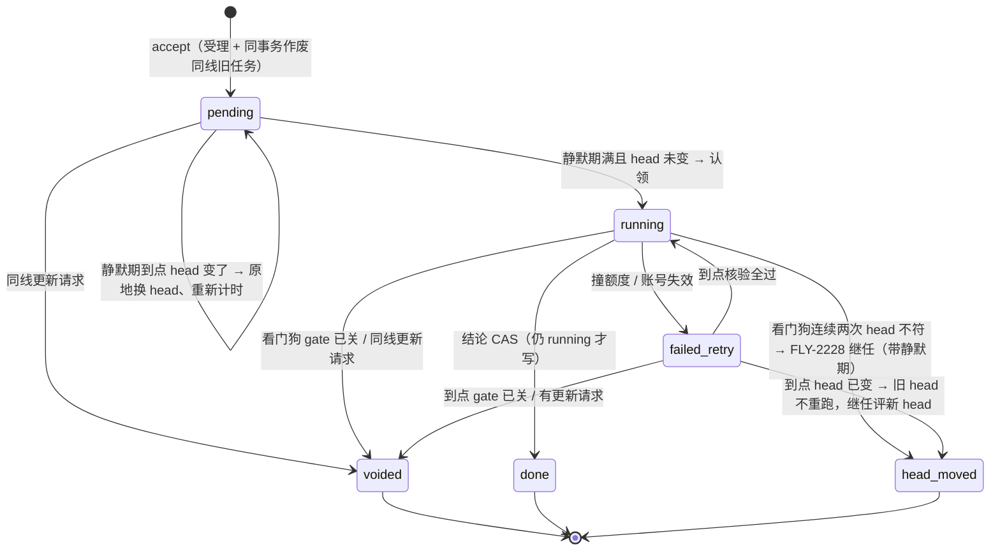

# FLY-2911 评审作废止损 — 实施计划
Issue: FLY-2911 (https://linear.app/geoforge3d/issue/FLY-2911/token7-评审作废止损新-head-一推就停旧评审推送后静默-2-分钟再开评审撞额度的自动重试先核版本同一-gate-只留最新任务)
日期: 2026-09-25
基于: research.md

**Status**: codex-approved（R4 APPROVED，Lead 授权的确认轮）

2026-09-26 QA 返工命名修正：为遵守既有 FLY-1560 守卫，下文旧名 `watchdogIntervalMs` / `FLYWHEEL_REVIEW_WATCHDOG_INTERVAL_MS` / trigger `watchdog` 的最终实现名分别为 `freshnessCheckIntervalMs` / `FLYWHEEL_REVIEW_FRESHNESS_INTERVAL_MS` / `freshness_check`；时序、默认值、边界和行为不变。稀疏历史 schema 的回填/索引须先检查所需列存在性。详见 verification.md 的 QA 返工证据。

## 0. 一句话

让 Bridge 的 Claude 评审在「结论注定作废」的那一刻就停下：运行中每 30 秒复查 gate 与 head，一变就杀进程；代码评审登记后静默 2 分钟再开跑；撞额度的重试到点先核 gate / 更新请求 / head；同一条线登记新请求时，在同一事务里作废旧的在飞 / 待重试任务。每次作废都落库审计，不叫 Lead。**不改评审判决语义，不跳过任何评审。**

## 1. 硬约束

- 判决语义不变：`computeEffectiveVerdict`、reviewer 提示词、授权记录（`recordCodexReviewApproved` / 设计证明）、gate 回答格式一律不动。
- 不跳过评审：任何被作废的任务，要么已有更新的已受理请求接替，要么它的 gate 已经不可能再被这个任务回答（已取代 / 已回答 / 已过期 / 丢失 / 不匹配），要么 head 已变且由 FLY-2228 继任接替。
- 只改 `packages/teamlead`（协调器、runner、StateStore）、`scripts/lead-patrol-snapshot.sh`，以及 `packages/flywheel-comm/src/db.ts` 的**一个只读方法**（§6.9）；不改 flywheel-comm CLI 契约（无子命令增删）。
- 本机只跑相关测试文件（§7 列表），不跑 `pnpm -r`。

## 2. 任务生命周期（改动后）



`voided` 不是新状态值：落库为 `status='failed'` + `voided_at` 非空（§3）。

## 3. 数据模型（StateStore，只加列）

`codex_review_job` 新增 4 列（沿用现有 `PRAGMA table_info` + `ALTER TABLE ADD COLUMN` 迁移循环，`StateStore.ts` 约 12035 行）：

| 列 | 类型 | 含义 |
|---|---|---|
| `accept_seq` | INTEGER | **受理序号**，唯一的「受理先后」事实。NULL = 未受理（登记时 gate 校验失败的审计行）；0 = 迁移前已受理、先后未知；≥1 = 迁移后受理，全局单调递增。新外部请求受理（pending / skipped 插入、复用绑定登记）时在同一事务里分配 `max(job.accept_seq, binding.accept_seq) + 1`（Bridge 是唯一写者，better-sqlite3 事务串行）。FLY-2228 继任**继承父行**的值；复用释放物化的任务**继承绑定行**的值（绑定无值 ⇒ 0）。用整数而不用时间戳：避免 `datetime('now')` 与 ISO 两种格式混比、秒精度并列（R3 #1） |
| `voided_at` | TEXT | 被 FLY-2911 作废的时刻（ISO UTC 毫秒）。非空 ⇒ 永不再跑、不可同 requestId 复活 |
| `superseded_by_request_id` | TEXT | 作废原因为 `superseded_by_request` 时，取代者的 request_id |
| `quiet_until` | TEXT | 静默期截止（ISO UTC 毫秒）；NULL = 无静默 |

`codex_review_reuse_binding` 也加 `accept_seq INTEGER`（迁移前的行保持 NULL，物化时按 0 处理）。

一次性回填（**仅在 `codex_review_job.accept_seq` 列本次刚被添加时**执行，与 ADD COLUMN 同一迁移事务）：

```sql
UPDATE codex_review_job SET accept_seq = 0
 WHERE accept_seq IS NULL
   AND (status <> 'failed' OR frozen_head_sha IS NOT NULL
        OR target_path IS NOT NULL OR target_repo_path IS NOT NULL);
```

回填只标「已受理」，**不猜先后**：历史行之间的同门先后一律视为未知（0 对 0 不算更新），所以迁移前已物化的绑定、多代继任都不可能凭回填值取代别人。

依据：登记拒绝分支（`accept()` 931–940 行）的插入从不传 head / plan 路径 / 目标仓路径。活库核对：满足「四者皆空的 failed 行」的原因只有 `gate_answered/gate_mismatch/gate_missing/superseded_by_revision`（共 21 行），全部是登记时拒绝。

新索引：`CREATE INDEX IF NOT EXISTS idx_codex_review_job_lane ON codex_review_job(project_name, issue_id, review_type, target_repo_identity)`。

`CodexReviewJob` 接口与 `rowToCodexReviewJob` 增加 `accept_seq? / voided_at? / superseded_by_request_id? / quiet_until?`；`CodexReviewReuseBinding` 增加 `accept_seq?`。

**线（lane）**：`project_name` + `review_type` + `target_repo_identity` + （`issue_id` 非空时同 `issue_id`；否则 `issue_id IS NULL AND execution_id` 相同）。

**「更新」只按 gate 的先后定义，不按任务插入先后**（R1 #1）。任务 N 可以取代同线任务 X（X 也可以是一个复用绑定），当且仅当 N 已受理（`accept_seq` 非空）且满足其一：

- `N.question_id = X.question_id` 且 `N.accept_seq > X.accept_seq`（整数比较；X 未受理的不参与；0 对 0 相等不算更新；迁移后受理的 ≥1 必然晚于迁移前的 0）；
- 两道门在 CommDB 里都读得到，且 N 的门严格更新：`(created_at, rowid)` 字典序更大——与 `issue-gate-supersede` 扫描和 `CommDB.canSupersedeGate` 用的是**同一个比较器**、同一张表（`mailbox_message_projection`）。

比较输入的适配：已受理的复用绑定 `accept_seq` 为 NULL（迁移前）时按 0 传入；拒绝审计行（job 的 NULL）不参与。这是**唯一**的比较函数 `isNewerRequest(N, X, gateOrder)`，§6.2 退役绑定、§6.3 登记作废、§6.6 到点核验三处都只调它，不各写一份。任一门读不到（归档 / CommDB 不可读）⇒ 不取代（保守）。N 是 X 自己的 FLY-2228 继任 ⇒ 不取代。**所有规则在不确定时一律「不作废」**：不作废最坏多花一次评审，作废错了会让一道开着的门没人评。gate 的 `created_at`/`rowid` 创建后不再变化，所以这个先后关系可以在事务外算好、在事务内按 CAS 落地。

为什么不能用任务插入顺序：`accept()` 查完 gate 后还要 await head 才插入，旧门的请求可能晚到；若按插入顺序，晚到的旧门请求会作废新门唯一的评审，而随后扫描又会取代旧门，新门就永远没人评审。

## 4. StateStore API（全部参数化 SQL）

### 4.1 `voidCodexReviewJob(input)` — 唯一的作废写入口

```ts
voidCodexReviewJob(input: {
  requestId: string;
  reason: string;                 // 见 research §2.2 词表
  trigger: "accept" | "watchdog" | "preflight" | "fallback" | "verdict"
         | "reset_timer" | "account_switch";
  supersededByRequestId?: string;
  retireBindingRequestIds?: string[];   // §6.2：同事务退役的复用绑定
  gateState?: string;
  observedHeadSha?: string;
  nowIso: string;
}): { voided: boolean; priorStatus?: CodexReviewJob["status"]; job: CodexReviewJob | null }
```

一个事务内：

```sql
UPDATE codex_review_job
   SET status = 'failed', failure_reason = ?, voided_at = ?,
       superseded_by_request_id = ?, retry_at = NULL, retry_trigger = NULL,
       retry_parked_at_ms = NULL, quiet_until = NULL,
       failure_attempt_count = failure_attempt_count + 1,
       updated_at = datetime('now')
 WHERE request_id = ? AND voided_at IS NULL
   AND (status IN ('pending','running')
        OR (status = 'failed' AND (retry_at IS NOT NULL OR retry_trigger = 'account_switch')));
```

改动 1 行才写审计事件（`insertEvent` 可嵌套：`raw.transaction` 为 savepoint）。`insertEvent` 对 UNIQUE 冲突 / 已归档返回 false 而不抛错；作废审计**必须返回 true**，否则主动抛错让整个事务回滚——`voided_at IS NULL` 的 CAS 保证每个任务只会真作废一次，所以这个键此前不可能存在，出现冲突就是不一致，宁可不作废（R2 #2）：

- `event_type='review_job_voided'`，`event_id='review-job-voided:<requestId>'`（UNIQUE ⇒ 幂等），`source='bridge.review-coordinator'`，`severity='info'`
- `payload = { requestId, reason, trigger, priorStatus, questionId, reviewType, frozenHeadSha, observedHeadSha?, gateState?, supersededByRequestId? }`
- `execution_id/project_name` 取任务行；`issue_id` 取任务行，空则用 execution_id。

同一事务内，对 `retireBindingRequestIds` 逐个执行绑定退役 CAS（`UPDATE codex_review_reuse_binding SET release_reason='superseded_by_request', released_at=? WHERE request_id=? AND responded_at IS NULL AND released_at IS NULL`），改动 1 行才写审计 `review_reuse_binding_retired`（`event_id='review-reuse-retired:<bindingRequestId>'`，payload `{bindingRequestId, sourceRequestId, supersededByRequestId, questionId}`），审计插入同样必须返回 true，否则整体回滚（R3 #2）。

done / skipped / 已作废 / 未排重试的失败行一律不动（返回 `voided:false`，也不退役任何绑定）。

### 4.2 受理插入顺带作废同线旧任务

`insertCodexReviewJob` 增加入参 `accepted?: boolean`（默认 true；登记拒绝分支传 false）、`quietUntil?: string`、`supersedeLane?: { nowIso: string }`。返回值增加 `voided: CodexReviewJob[]`。

`supersedeLane` 的形状改为 `{ nowIso: string; expectedAcceptSeq: number; candidates: Array<{ requestId: string; retireBindingRequestIds: string[] }> }`：候选集由协调器在事务外按 §3 的 gate 先后规则算好（§6.3）。同一事务内：`INSERT OR IGNORE` 成功且 `accepted` 时，对每个候选调用 4.1 的事务体（reason=`superseded_by_request`，trigger=`accept`，supersededBy=新 requestId）；4.1 的 CAS 负责「候选此刻仍可作废」。插入未发生（并发重复）时不作废任何行。任一审计写入抛错 ⇒ 整个事务回滚（新任务也不落库），`accept` 以 500 失败，runner 的 `request-review` 按现有有界重试重投——宁可不受理，也不留下没有审计的作废。

### 4.3 其它 CAS 守卫

| 方法 | 改动 |
|---|---|
| `claimCodexReviewJobRunning(requestId, quietGateNowIso?)` | WHERE 加 `AND voided_at IS NULL`；传了 `quietGateNowIso` 时再加 `AND (quiet_until IS NULL OR julianday(quiet_until) <= julianday(?))`（静默关闭时不传，§6.7）。SET 加 `quiet_until = NULL`：**认领即清静默**，所以「`quiet_until` 非空」恒等于「从未被认领过」（R1 #3） |
| `completeCodexReviewJob(...)` | WHERE 加 `AND status = 'running' AND voided_at IS NULL`；返回 `boolean`（是否写入） |
| `recordCodexReviewJobFailure(input)` | WHERE 恒加 `AND voided_at IS NULL`；新增可选 `expectStatus?: "running"` ⇒ 再加 `AND status = 'running'` |
| `failAndRequeueCodexReviewJobForHeadMove(input)` | 新增 `expectStatus?: "running" \| "failed" \| "pending"`、`quietUntil?`、`trigger`、`observedHeadSha`、`nowIso`。判定顺序：①已有继任 ⇒ `existing`（原样重放）；②父行 `voided_at` 非空 ⇒ `voided`；③状态不符 `expectStatus` ⇒ `stale`；②③都 ROLLBACK 不写任何东西。**requeued 分支**：父行 UPDATE 同时 `SET voided_at = ?, superseded_by_request_id = <继任 id>, quiet_until = NULL`（WHERE 加 `AND voided_at IS NULL`）——父任务从此永不可认领（claim 守卫）、同 requestId 重投走现有 lineage-tip 分支交给继任；继任行写 `accept_seq = 父行.accept_seq`（继任不是新请求）、`quiet_until`；requeued 父行的 UPDATE 仅在 `markParentVoided=true`（`EARLY_STOP` 开）时写 `voided_at`/取代者；同事务写 `review_job_voided`（reason=`head_moved`，payload 加 `successorRequestId`）。**exhausted 分支**：保持现状（不写 `voided_at`，原因 `head_moved_exhausted`，现有「请开新 gate」告警与巡检恢复文案不变），审计写**另一种事件** `review_head_move_exhausted`，`event_id='review-head-move-exhausted:<requestId>:<failure_attempt_count>'`（可重复发生、每次一条），不占用永久作废的 `review-job-voided:<requestId>` 键（R2 #2） |
| `releaseCodexReviewReuseBinding` | 事务开头先读绑定：`released_at` 或 `responded_at` 非空 ⇒ **不插入任务**，返回 `{released:false, job: 已存在的任务或 null}`（今天是先 INSERT OR IGNORE 再判断，已退役的绑定仍会物化出任务；改成先判断，R2 #1）。插入的任务写 `accept_seq = 绑定.accept_seq ?? 0`；新增 `quietUntil?`：协调器在绑定的当前 head ≠ 绑定冻结 head 时传入（新 head 首次真正开评，走完整静默，R1 #6）；head 未变（源失败 / 源 gate 关）不设静默。不做同线作废；它在线上的「新旧」按 §3 由它自己的门决定 |
| 新增 `retireCodexReviewReuseBindingForSupersede({bindingRequestId, sourceRequestId, supersededByRequestId, nowIso})` | 单独使用的同款「退役 CAS + 严格审计」事务，返回 boolean；供 §6.2 的恢复入口使用（启动 / 迟到释放时源任务早已作废） |
| `insertCodexReviewReuseBinding` | 新绑定在同一事务里分配 `accept_seq` |
| 新增 `listLaneJobs(job, filter)` | 只读：同线、排除自身，filter=`voidable`（状态同 4.1 WHERE 且 `voided_at IS NULL`）或 `acceptedOthers`（`accept_seq IS NOT NULL`，排除 `head_move_parent_request_id = job.request_id` 以及 `voided_at` 非空且原因为 `head_moved` 的父行——它们已由自己的继任代表）。gate 先后比较在协调器里做（StateStore 没有 CommDB） |
| 新增 `restartCodexReviewQuietWindow({requestId, expectedHeadSha, newHeadSha, quietUntil})` | `UPDATE ... SET frozen_head_sha = ?, quiet_until = ? WHERE request_id = ? AND status = 'pending' AND voided_at IS NULL AND lower(frozen_head_sha) = ?`；改动 1 行才写事件 `review_quiet_window_restarted`（`event_id='review-quiet-restart:<requestId>:<newHead>:<quietUntil>'`，payload `{requestId, previousHeadSha, newHeadSha, quietUntil}`）；返回 boolean |

`newHeadSha` 必须是 `^[0-9a-f]{40}$`（与继任相同的受信 SHA 校验），否则抛错。

## 5. 评审进程可中止（`claude-review-runner.ts`）

- `ClaudeReviewInvocation.signal?: AbortSignal`；`ClaudeReviewSpawner` 的 opts 同名透传；`SpawnResult.aborted: boolean`。
- `defaultClaudeReviewSpawner`：`signal.aborted` 已为真 ⇒ 不 spawn，直接 resolve `{aborted:true, code:null, ...}`；否则 `signal.addEventListener("abort", onAbort, {once:true})`，`onAbort` 置 `aborted=true` 并 `killTree()`；`finish` 里移除监听。
- `runClaudeReviewRound`：`res.aborted` 优先于其它判断 ⇒ `{kind:"failed", reason:"aborted", detail:"aborted by review coordinator", exitCode, timedOut:false}`（不带 raw，避免被额度分类器误判）。
- `ClaudeReviewOutcome` 的 failed reason 联合类型加 `"aborted"`。

## 6. 协调器（`review-request-coordinator.ts`）

### 6.1 配置（构造时读取，改动需重启 Bridge）

| 环境变量 | 默认 | 合法值 | 非法时 |
|---|---|---|---|
| `FLYWHEEL_REVIEW_EARLY_STOP` | 开 | `0/off/false` 关，其它或未设为开 | — |
| `FLYWHEEL_REVIEW_QUIET_WINDOW_MS` | 120000 | 纯数字 0–3600000；0 = 关 | 记日志，用默认 |
| `FLYWHEEL_REVIEW_WATCHDOG_INTERVAL_MS` | 30000 | 纯数字 5000–600000 | 记日志，用默认 |

`ReviewCoordinatorDeps` 增加同名测试缝 `earlyStopEnabled? / quietWindowMs? / watchdogIntervalMs?`（优先于环境变量）。

`EARLY_STOP` 关 ⇒ **所有**新增的永久作废入口都不生效（R2 #3）：§6.3 登记作废、§6.4 看门狗、§6.5 三处 gate 复查（回到现有 `failReviewJob`）、§6.6 新增核验（回到现有 gate + head 检查与 `failReviewJob`）、§4.3 head-move 父行不写 `voided_at`（`failAndRequeue` 增加 `markParentVoided: boolean`，由协调器按开关传入）。仍然保留：历史已作废行不可认领 / 不可复活、结论 / 失败写入的状态守卫、复用释放「先判断再插入」。静默期由自己的开关独立控制。

### 6.2 私有作废入口 `voidJob(job, reason, trigger, extras)`

1. 调 4.1；`voided=false` ⇒ 返回（已被别人处理）。
2. 清该 requestId 的重试定时器与静默定时器。
3. 若有活的运行（`liveRuns.get(requestId)`）⇒ `controller.abort()`。**先落库后杀进程**。
4. 复用绑定：reason 为 `superseded_by_request` 时，**调用 4.1 之前**先算出「取代者比它更新」的活绑定（`isNewerRequest(取代者, 绑定)`），作为 `retireBindingRequestIds` 传进 4.1——退役与作废、审计同一事务提交，没有中间崩溃窗口（R3 #2）。提交后，剩下的活绑定（以及其它作废原因的全部活绑定）走现有 `releaseReuseBindingsForSource`。
   **恢复入口 `settleBindingOfVoidedSource(source, binding)`**：`releaseReuseBindingToOwnLane` 在做任何事之前先调它——源任务 `voided_at` 非空、原因为 `superseded_by_request`、且 `isNewerRequest(取代者, 绑定)` ⇒ 用 `retireCodexReviewReuseBindingForSupersede` 退役并返回，不释放、不物化；否则照现有逻辑释放。`redriveOnBoot` 对失败源任务、`releaseReuseBindingsForSource`、`deliverReuseBinding` 的 head 变动分支都经过 `releaseReuseBindingToOwnLane`，所以正常路径、启动、迟到释放共用同一个判定。取代者行不存在 / 门读不到 ⇒ 按「不确定不作废」走现有释放。
5. 只写日志，**不**调 `emitReviewJobFailureAlert`，不 `alertLead`。

### 6.3 同一条线只留最新（issue 第 4 条）

`accept()`：

- 登记拒绝分支：`insertCodexReviewJob({..., accepted:false})`，不作废任何行。
- 所有 await（head 推导、repo 身份）结束后、插入之前，**同步**重做一次 `inspectGate`；不是 `open` ⇒ 走现有拒绝分支。从这一步到插入事务提交之间没有 await（Bridge 内的 gate 扫描同在一个事件循环里，不会插进来）。
- 同步算候选集（`EARLY_STOP` 开时）：新请求在插入事务里拿到的 `accept_seq` 必然是当前最大值，所以用它的**预期序号**（当前最大值 + 1，事务内再断言一致，不一致则整个受理事务重试一次）对 `listLaneJobs(newJobShape, "voidable")` 逐个调用 `isNewerRequest`；每个被选中的候选再按 §6.2 第 4 步算出要一起退役的绑定。门读不到的跳过。新请求的门若比某个在飞任务的门**更旧**，不作废对方、照常受理自己——扫描随后会取代这道旧门，看门狗 / 预检会把新任务作废，最新的门始终留着能完成的评审。
- codex_skip 分支与正常 pending 分支：`accepted:true`，带 `supersedeLane:{nowIso, candidateRequestIds}`；pending 分支对 `reviewType==='code' && quietWindowMs>0` 带 `quietUntil = now + quietWindowMs`。
- 插入返回的 `voided[]` 逐个执行 §6.2 第 2–5 步（落库已在事务里完成）。
- 复用分支（`findRunningCodexReviewJobForHead` 命中）不作废任何行：同 head 的在跑评审正是要复用的对象。
- 已存在的失败行被同 requestId 再 POST，分支顺序（R2 #4）：①现有身份校验（question / execution / type / 目标仓一致，否则 409）；②现有 head-move lineage 重放：父行原因为 `head_moved` 且能找到合法 lineage tip ⇒ 交给继任（pending 入队 / 已完成补投递），**找不到可用继任时不退回认领父行**，返回 409；③其它 `voided_at` 非空 ⇒ `409`，reason `request <id> was voided (<failure_reason>[, superseded by <id>]); submit a new request for the current head`，永不复活；④其余沿用现有逻辑。

### 6.4 运行中看门狗（issue 第 1 条 + 第 4 条的运行中部分）

`runJob` 认领成功、第一次 `runRound` 之前建立 `liveRuns.set(requestId, { controller, headMismatchStreak: 0, tickInFlight: false, timer })`；`EARLY_STOP` 开时按 `watchdogIntervalMs` 用 `setTimer` 链式调度 tick。`runRound`（含丢会话兜底的第二次）都传 `controller.signal`。`finally` 里停表、删除 `liveRuns` 条目。

每个 tick（`tickInFlight` 防重入；每次 await 之后都重查「运行仍在且行仍是 running」）：

1. 行不存在 / 不是 running / `voided_at` 非空 ⇒ `abort()`，结束。
2. `inspectGate`：
   - `open` ⇒ 继续。
   - `unknown` ⇒ 本轮不动（CommDB 暂不可读不是证据；交结论时的复查仍会 fail-close）。
   - 其它（`superseded/answered/expired/missing/mismatch`）且该任务**没有**活的复用绑定（`responded_at` 与 `released_at` 皆空）⇒ `voidJob(runtimeGateFailureReason(state), "watchdog", {gateState})`，结束。有活复用绑定 ⇒ 不动（其它 gate 还等着这个结论；只记一次日志）。
3. 代码评审：`tryDeriveHead`：
   - 等于冻结 head ⇒ `streak = 0`。
   - 不等 ⇒ `streak += 1`；`streak >= 2` ⇒ `handleHeadMoved(job, current, undefined, { trigger:"watchdog", expectStatus:"running" })`，然后 `abort()`。
   - 读不到（null）⇒ 不计数。
4. 安排下一次 tick。

### 6.5 runJob 的写入全部改为 CAS

- 评审返回后第一件事：`outcome.reason === "aborted"` ⇒ 记日志，返回（结算由中止方负责）。
- 紧接着同步检查 `store.getCodexReviewJob(requestId)?.status === "running"`，否则丢弃结果返回（此后到 `failReviewerOutcome` 写库之间无 await）。
- **确定性的 gate 失效统一作废**（R1 #4）：gate 预检、丢会话兜底前、交结论前三处复查，状态为 `superseded/answered/expired/missing/mismatch` 时改为 `voidJob(runtimeGateFailureReason(state), "preflight" | "fallback" | "verdict", {gateState})`（`expectStatus` 语义由 4.1 的 CAS 覆盖：这三处任务都在 running）；保留这三处现有的 `this.alert(...)` 文案不变（范围控制：不改今天 Lead 在这些时刻能看到的东西），只是不再额外走 `emitReviewJobFailureAlert`。状态为 `unknown` 仍走普通失败（可同 requestId 重投）。于是「谁先发现」都得到同一种作废 + 同一条审计。
- `runJob` 内其余失败写入（session_missing、worktree_missing、repair_audit_failed、reviewed_wrong_plan_blob、reviewed_plan_moved、reviewed_wrong_head ×2、`enqueue` 的 internal_error、`failReviewerOutcome`）改走 `expectStatus:"running"`；`updated=false` 时不告警、不释放复用绑定。
- `runJob` 内的 `handleHeadMoved`（预检 / 兜底 / 交结论）带 `expectStatus:"running"`；`outcome` 为 `voided`/`stale` 时什么都不做。
- `completeCodexReviewJob` 返回 false（交结论前被作废）⇒ 记日志「verdict discarded after void」，**不答 gate、不写授权、不投递复用绑定**，返回。R13 HIGH-2 的授权恢复分支同样处理。

### 6.6 撞额度重试到点先核版本（issue 第 3 条）

`retryIfStillEligible(requestId, origin)`，`EARLY_STOP` 开时的顺序：

1. 现有：已停止 / 非 failed / 无对应重试标记 / kill switch ⇒ 原样。
2. `inspectGate`：`unknown` ⇒ 维持现有 `failReviewJob`（非永久，可同 requestId 重投）；其它非 open ⇒ `voidJob(runtimeGateFailureReason(state), origin, {gateState})`，返回 `retired`。
3. `listLaneJobs(job, "acceptedOthers")` 里用 `isNewerRequest(other, job)` 找「比本任务更新」的已受理请求，取门最新（同门则 `accept_seq` 最大）的一个 ⇒ `voidJob("superseded_by_request", origin, {supersededByRequestId})`，返回 `retired`。门读不到的不算。
4. 代码评审 head 已变 ⇒ `handleHeadMoved(job, current, undefined, {trigger: origin, expectStatus:"failed"})`：**旧 head 不重跑**；因为 gate 仍开且它仍是最新请求，由 FLY-2228 继任评新 head（带静默期），否则等这个 gate 的 runner 会永远卡住。head 读不到 ⇒ 现有 `head_moved_unresolved`。
5. 全部通过 ⇒ `enqueue`（负向：照常重跑）。

两种 origin（`reset_timer` / `account_switch`）共用本函数，所以账号切换重驱也得到同样的核验。

### 6.7 推送后静默（issue 第 2 条）

`runJob` 最前面（认领之前）：

1. 行是 `pending` 且 `quiet_until` 非空：
   - `now < quiet_until` ⇒ `armQuietTimer(requestId, dueMs)`（`quietTimers` Map，回调里 `enqueue`；`stop()` 清空），返回。
   - 已到点且为代码评审 ⇒ `await tryDeriveHead`；`current` 与冻结 head 不同 ⇒ `restartCodexReviewQuietWindow(expected=frozen, new=current, quietUntil=now+quietWindowMs)`；成功 ⇒ 重新 `armQuietTimer`，返回；CAS 失败 ⇒ 返回（已被作废或别处改动）。`current` 为 null ⇒ 往下走，由现有预检处理。
2. 然后才是 `claimCodexReviewJobRunning(requestId, quietWindowMs > 0 ? nowIso : undefined)`；认领同时清掉 `quiet_until`。

**只有从未认领过的任务会原地换 head**：认领即清 `quiet_until`，所以曾经跑过、重启后被 `resetRunningCodexReviewJobs` 放回 pending 的任务 `quiet_until` 为空，走现有预检 → FLY-2228 继任 + 复用释放，不会原地改一个仍被复用绑定引用的源任务（R1 #3）。复用绑定只挂在 running 任务上，而 running 任务的 `quiet_until` 必为空，两者不相交。

**关闭静默（`QUIET_WINDOW_MS=0`）立即解除已有窗口**（R1 #5）：第 1 步整段跳过，认领不带静默守卫；已作废行仍被 `voided_at` 守卫挡住。窗口改短（非 0）只影响之后新设的窗口，已落库的截止时间照旧（最长 1 小时）。

静默期设置点：`accept` 的 pending 代码评审、FLY-2228 继任（`handleHeadMoved` 传 `quietUntil`）、复用释放时绑定 head 已变（§4.3）。设计评审、codex_skip、head 未变的复用释放不设。启动重驱无需改：`listRedrivableCodexReviewJobs` 入队 → `runJob` 看到未到点就挂定时器。

### 6.8 其它细节

- `reviewFailureRecovery`：`voided_at` 非空 ⇒ `superseded_by_request` 返回「已被更新请求 <id> 取代，无需处理」，其它作废原因沿用现有 gate 类文案；永不给出「同 requestId 重投」。
- `stop()`：额外清 `quietTimers` 与看门狗定时器；**不**主动 abort（关停时的杀进程仍由现有 `killAllClaudeReviewChildren` 负责，行为不变）。

### 6.9 读 gate 先后（CommDB 只读）

`CommDB` 新增 `getQuestionOrder(id: string): { createdAt: string; rowId: number } | undefined`：`SELECT created_at, rowid FROM mailbox_message_projection WHERE id = ? AND type = 'question'`——与 `getGatesForSupersede` 同表同列。`ReviewCommDb` 接口加同名方法（测试缝）。比较函数 `isStrictlyNewerGate(a, b)` = `a.createdAt > b.createdAt || (a.createdAt === b.createdAt && a.rowId > b.rowId)`，放在协调器里，单测覆盖同秒并列。读失败 ⇒ 视为读不到。

## 7. 测试（TDD；本机只跑这些文件）

| 文件 | 用例 |
|---|---|
| `bridge/__tests__/claude-review-runner.test.ts` | 已 abort 不 spawn；运行中 abort ⇒ killTree、`reason:"aborted"`；进程已退出后再 abort 不改结果 |
| `__tests__/StateStore.codex-review.test.ts` | 迁移加列 + 回填（拒绝审计行保持 NULL、受理行回填为 0；绑定表加列）；`accept_seq` 分配单调、继任继承、物化继承绑定（绑定无值 ⇒ 0）；`isNewerRequest` 真值表（0 对 0、0 对 ≥1、NULL、同门 / 异门、门读不到、同秒同 rowid 并列）；4.1 CAS 矩阵（pending/running/failed+reset_at/failed+account_switch 可作废；done/skipped/未排重试 failed/已作废不可）+ 事件恰好一条且幂等；**审计写入抛错 ⇒ 作废与新任务插入一起回滚**；4.2 只作废传入的候选（候选已不可作废时 CAS 跳过）；complete 拒非 running；failure 拒已作废 + `expectStatus`；claim 拒已作废、未到点静默（传守卫时）、认领后 `quiet_until` 为空、不传守卫时忽略静默；静默换 head CAS；继任判定顺序 existing → voided → stale，requeued 父行写 `voided_at`+`superseded_by_request_id` 且不可再认领，exhausted 父行不写 `voided_at`；继任行 `accept_seq`/`quiet_until`；复用释放行 `accept_seq`（继承绑定）、已退役绑定不物化、与按参数设静默；`listLaneJobs` 两种 filter 排除拒绝行与自己的继任 |
| `bridge/__tests__/review-request-coordinator.test.ts` | 见下 |
| `scripts/__tests__/lead-patrol-snapshot.test.sh` | `superseded_by_request` 不进 `REVIEW_JOB_FAILED` |
| `packages/flywheel-comm` 现有 db 测试文件（按实际文件名） | `getQuestionOrder`：question 行返回 `created_at/rowid`，非 question / 不存在返回 undefined |

协调器用例（假时钟 + 注入 `reviewRound` / `deriveHead`）：

1. **看门狗 head**：第一次 tick 不符不停；第二次停 ⇒ 父 `head_moved`、继任带静默、gate 未答、`review_job_voided` 事件（trigger=watchdog）。
2. 负向：head 不符一次后恢复 ⇒ 不停，评审正常出结论并答 gate。
3. **看门狗 gate**：gate 被同执行新 gate 取代 ⇒ `superseded_by_revision` 作废、进程被 abort、无 Lead 告警。
4. 负向：gate `unknown` ⇒ 不停；有活复用绑定 ⇒ 不停。
5. **静默期**：代码评审 120 秒前不跑；到点 head 未变 ⇒ 恰好跑一次；窗口内 head 变 ⇒ 原地换 head + 事件，下一个完整窗口后按新 head 跑；窗口=0 ⇒ 立即跑；设计评审 ⇒ 立即跑；静默中重启（`redriveOnBoot`）⇒ 到点前不跑。
6. **到点核版本**：gate 已取代 ⇒ 作废不跑；同线有更新已受理请求 ⇒ `superseded_by_request` 作废不跑；head 已变 + gate 开 + 最新 ⇒ 旧 head 不跑、继任评新 head（带静默）；负向：gate 开 + head 未变 + 最新 ⇒ 照常重跑。`account_switch` 同样四条。
7. **同线只留最新**：新请求登记 ⇒ 旧的在跑任务被 abort + 作废（`superseded_by_request_id`=新 id）；旧的静默中任务、旧的待重试任务（定时器被清）都被作废；不同线不动；`gate_mismatch` 拒绝的请求不作废任何东西。
7a. **门先后倒置（R1 #1）**：先建 Qold 再建 Qnew；Qnew 的请求 B 先登记（静默中），Qold 的请求 A 后登记 ⇒ A 不作废 B；扫描取代 Qold 后 A 被作废；断言 Qnew 始终有一个可完成的评审并最终答门。另测：A 在 await head 期间 Qold 被取代 ⇒ 插入前的同步复查拒绝 A；旧绑定延迟释放成任务 ⇒ 不因插入更晚而作废最新门的任务。
7b. **重启不改绑（R1 #3）**：源任务 running + 未交付复用绑定 → 模拟崩溃 → 源 worktree head 由 H1 变 H2 → `redriveOnBoot` ⇒ 源行 `frozen_head_sha` 仍为 H1，走 FLY-2228 继任 + 绑定释放；绑定只拿到它自己实际被评审的 head 的授权。
7d. **同门延迟物化（R2 #1）**：同门 Q：A 在 H1 跑；B 登记复用 A；推到 H2 后 C 登记（作废 A）⇒ B 的绑定被退役（不释放、不物化）；再模拟「退役前 B 已进入释放流程」⇒ 释放事务看到已退役不插入任务；C 撞额度 → 到点 ⇒ 照常重跑并最终答门。重启后释放同样断言。另测 B 早于 C 受理但物化更晚时，B 不算 C 的「更新请求」。
7f. **绑定退役原子性与恢复（R3 #2）**：①源作废事务里退役绑定的审计插入失败 ⇒ 源作废、新请求插入、绑定退役全部回滚；②模拟「源已作废提交、绑定仍活着」后重启（直接构造该持久状态）⇒ `redriveOnBoot` 经 `settleBindingOfVoidedSource` 退役它，不物化；③迟到释放同样只退役；每次成功退役恰好一条 `review_reuse_binding_retired`，取代者与行一致。
7g. **迁移前数据（R3 #1）**：构造迁移前的「绑定 10:00 受理、C 10:01 受理、绑定 10:02 物化、多代继任」行，迁移后 C 到点 ⇒ 物化行（0）不算 C（0）的更新请求，C 照常重跑；迁移后新请求（≥1）登记 ⇒ 正确取代迁移前同门行。迁移后新请求取代同门迁移前的**活复用绑定**（绑定 NULL 按 0）⇒ 绑定被退役而非释放（R4 follow-up #1）。
7e. **exhausted 审计（R2 #2）**：R 耗尽 → 事件 `review_head_move_exhausted`；同 ID 重投并认领 → 新请求 N 作废 R ⇒ `review_job_voided` 恰好一条且原因 / 取代者与行一致；重复 exhausted 各一条；伪造同键已存在 ⇒ 作废整体回滚。
7c. **复用释放遇新 head（R1 #6）**：B 在 H1 复用源 A，B 的 worktree 变 H2，A 随后失败 / 完成 ⇒ B 物化为 H2 任务并进入静默，窗口满前不跑；head 不变的复用照常即时投递。
8. **竞态**：作废后评审才返回结论 ⇒ 不答 gate、不写授权、行保持作废；被杀进程非零退出 ⇒ 不覆盖原因、不排重试；已作废请求同 requestId 重投 ⇒ 409；看门狗转成 head_moved 后，队列里残留的父请求被触发 ⇒ 认领失败不跑，同 requestId 重投 ⇒ 交给继任；**gate 在第 5 秒失效、评审第 10 秒返回（看门狗第 30 秒）⇒ 交结论前复查作废，审计 trigger=verdict；看门狗先到 ⇒ trigger=watchdog**，两种顺序各恰好一条审计。
8a. **静默开关（R1 #5）**：开窗登记 → 以 `QUIET_WINDOW_MS=0` 重建协调器 → `redriveOnBoot` ⇒ 立即跑；已作废行不复活。
9. `EARLY_STOP` 关 ⇒ 现有行为：无看门狗停止、无登记作废、到点只查 gate + head；预检 / 兜底 / 交结论遇 gate 关走 `failReviewJob`；head-move 父行不写 `voided_at`；全程不新增任何 `voided_at` 与 `review_job_voided`（R2 #3）。历史已作废行仍不可认领。
10. **9-25 回放**（夹具复刻真实 id 与顺序）：`fc72a8e4` 撞额度排 04:01 重试 → `b94193db` `gate_mismatch` 拒绝（不算取代者）→ gate `a0ee3883` 被 `9a75ffc7` 取代 → `1ae856df` 登记的**同一事务**里 `fc72a8e4` 被作废（superseded_by=`1ae856df`，重试定时器被清）→ 04:01 什么都不发生 → `73ea086f` 正常 → 新执行 `49b16a5c` 撞额度，到点 gate 开 / head 未变 / 最新 ⇒ 照常重跑（负向）。

运行命令（worktree 先 `pnpm install --offline` 并按拓扑构建依赖包，见 runner 记忆）：

```bash
pnpm --filter teamlead exec vitest run \
  src/bridge/__tests__/claude-review-runner.test.ts \
  src/__tests__/StateStore.codex-review.test.ts \
  src/bridge/__tests__/review-request-coordinator.test.ts
bash scripts/__tests__/lead-patrol-snapshot.test.sh
```

## 8. 实施分块

| 块 | 内容 | 依赖 |
|---|---|---|
| C1 | runner 可中止（§5）+ 测试 | — |
| C2 | StateStore 迁移、4.1–4.3、CommDB `getQuestionOrder` + 测试 | — |
| C3 | 协调器：配置、`voidJob`、登记作废、复活拒绝、runJob CAS（§6.1–6.3、6.5、6.8）+ 用例 7、8、9 | C1、C2 |
| C4 | 看门狗（§6.4）+ 用例 1–4 | C3 |
| C5 | 静默期（§6.7）+ 用例 5 | C3 |
| C6 | 到点核版本（§6.6）+ 用例 6、10 | C3、C5 |
| C7 | 巡检排除表 + 脚本测试 | — |

## 9. 上线与回滚

- 迁移只加列 + 一次性回填，旧代码读 `SELECT *` 不受影响。
- 部署：合并后由独立 updater 在窗口期重启 Bridge；本单不重启服务。
- 回滚优先用开关：Bridge 环境加 `FLYWHEEL_REVIEW_EARLY_STOP=off` 与 `FLYWHEEL_REVIEW_QUIET_WINDOW_MS=0` 后重启 ⇒ 不再有新的作废、已有静默窗口立即解除；**已作废的行保持作废**（不会复活，这是审计承诺）；认领 / 结论 / 失败写入的状态守卫保留（它们只在有作废时才会拒绝写入，没有作废时与现有行为一致）。整单 revert 也安全（新列被忽略）；唯一差异：revert 后已作废的失败行在 gate 仍开时可被同 requestId 重投复活——与今天的行为一致。
- 巡检脚本只新增一个排除原因，不引用新列（脚本可能先于 Bridge 重启生效）。

## 10. 明确不做

- 不改 Claude 作者 → Codex 评审（runner 本地，不经 Bridge）。
- 不改「源任务自己的 gate 被取代时、结论仍可投递给复用绑定」的现有丢弃行为（记为后续候选）。
- 不做跨执行复用已完成结论（`49b16a5c` 这类会照常重跑）。
- 不对设计评审做静默期或 plan blob 追踪；设计评审的更新由「只留最新」覆盖。
- gate 被外部回答那一桶只靠看门狗截停，不改回答方行为。
- 被杀会话再 `--resume` 的可靠性未实测（research §2.6）。

## 10a. Codex R4 follow-up（不阻塞，已在本版吸收）

| # | 级别 | 处理 |
|---|---|---|
| 1 | MEDIUM | 迁移前活绑定的 NULL 序号在比较输入处按 0 适配（§3）；补用例：迁移后新请求取代同门迁移前的活绑定 ⇒ 绑定被退役而非释放 |
| 2 | LOW | §4.2 `supersedeLane` 形状补上每个候选的 `retireBindingRequestIds` 与 `expectedAcceptSeq`；research §2.3 残留说法已改为 accept_seq |

## 11. 修订轨迹

| 版本 | 触发 | 改动 |
|---|---|---|
| v1 | 初稿 | — |
| v5 | Codex R4 APPROVED（确认轮） | 吸收两条非阻塞 follow-up（§10a），无设计变更 |
| v4 | Codex R3（1 HIGH / 1 MEDIUM，全部接受） | #1 用整数 `accept_seq` 取代 `accepted_at` 时间戳（受理时分配、继任 / 物化继承、迁移前一律 0 = 先后未知），唯一比较函数 `isNewerRequest` 三处共用，清掉「同 questionId 一律候选」「rowid 更大」等残留条款；#2 绑定退役并入源作废事务（严格审计），新增恢复入口 `settleBindingOfVoidedSource` 供启动 / 迟到释放共用；新增用例 7f、7g |
| v3 | Codex R2（1 HIGH / 2 MEDIUM / 1 LOW，全部接受） | #1 同门比较改用「最初受理时刻」`accepted_at`（继任继承父行、复用物化取绑定 `created_at`），被 `superseded_by_request` 作废的源任务上、比取代者更旧的复用绑定改为退役而非释放，释放事务先判断绑定是否已退役再插入；#2 exhausted 用独立事件类型与按次数的键，作废审计插入必须返回 true 否则回滚；#3 `EARLY_STOP` 关覆盖全部新增永久作废入口（含三处 gate 复查与 head-move 父行标记）；#4 同 requestId 重投的分支顺序写死；新增用例 7d、7e |
| v2 | Codex R1（3 HIGH / 3 MEDIUM，全部接受） | #1「更新」改按 gate 先后（与扫描同一比较器），插入前同步复查 gate，旧门请求不反向作废新门；#2 head-move requeued 父行写 `voided_at`+取代者，判定顺序 existing→voided→stale，exhausted 保持现状；#3 认领即清 `quiet_until`，只有从未认领的任务原地换 head；#4 预检 / 兜底 / 交结论三处确定性 gate 失效统一走作废事务，审计写入失败整体回滚；#5 静默设 0 立即解除已有窗口，回滚文案如实改写；#6 复用释放遇新 head 走完整静默；新增 CommDB 只读方法 §6.9 与用例 7a–7c、8a |
