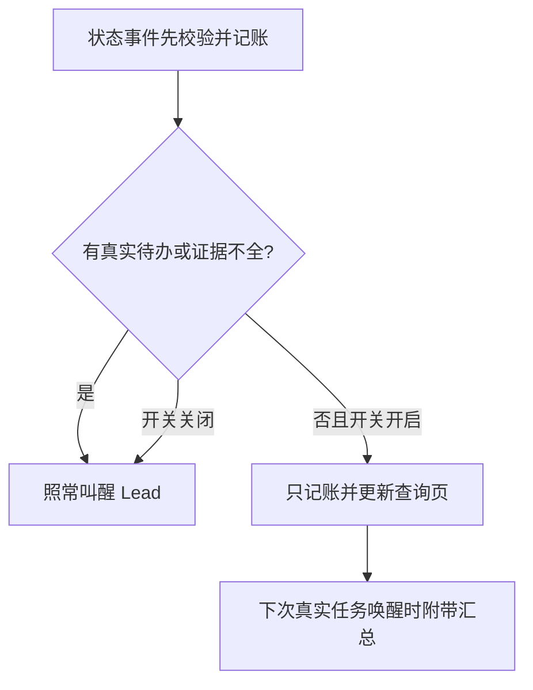

# FLY-2912 纯通知只记账 — 实施计划
Issue: FLY-2912 (https://linear.app/geoforge3d/issue/FLY-2912/token5-纯通知不叫醒扩面stage-changed-session-started-监控恢复-换体预告只记账不叫醒)
日期: 2026-09-25
基于: research.md

Status: review-pending
Design revision: 1
Baseline: 801ac86cb33e5ce5e11761817e8c341e07f5423a

## 1. Founder overview
只播报状态的事件先完整记账，等 Lead 被真实任务叫醒时一起看；夹带问题、founder 消息、失败或需要动作的仍马上到达。这里 Lead 指负责推进工作的 AI 负责人；audit_only 指保留记录但不单独发送给模型。



不改变任务调度、换体、审批或告警结案。静默不是已回答、已读或已完成。关开关恢复新事件的原投递方式，历史账目不批量重放。

## 2. 事件决策合同
决策顺序固定：原权限/事件有效性校验 → 原业务副作用/持久事实 → 读取项目开关 → 检查原 ingress 与渲染 projection 中待办字段 → 校验内部证据 → append 原稳定事件 ID → 仅 model 入原即时链路。任何缺证、解析错、读失败走 model；不把无效原始事件重新放行。

| 类型 | audit_only 必须同时满足 | 立即 model 的反例 |
|---|---|---|
| stage_changed | insertStageChangedEvent 验证成功；已知阶段；事件所属动作不存在或有确切关闭收据；review/pr 阶段有实际 owner 或已落地完成收据 | 问题/失败混入；pending decision；只有 running 推测 resolved；无 owner review；approve/ship/completed 没有对应已完成动作凭证 |
| session_started | exact execution/issue/activation/attempt 注册已提交；普通首次启动或机器已完成交接；无未结 Lead 启动/交接义务；非任意摘要 | 替身体需 Lead 选择/救援/重新交办；注册不完整；旧 attempt；含 founder/ASK；线程建立失败仍需处理 |
| session_monitoring_reestablished | exact exec 的这次恢复 probe 成功；episode 已登记恢复；原告警已由原生命周期解决或不存在；当前状态 running 或合法无待办 park | monitoring_lost、未知 liveness、open alert、park 上有未处理 gate/故障、仅文案“alive” |
| workflow_replacement_eligibility | next_check_disposition=replacement_candidate；exact run/node/attempt/exec/launch ordinal 对齐；原未来 next-check 持久调度存在且由 controller 持有；无 Lead 动作 | 实际 replacement、workflow_claim_recorded、environment/retry_limit hold、timer 缺失/过期未被接管、scope 不明 |

事件名白名单不是判定。旧 FLY-2749 session_started_handoff_required 被本单拆成 startup_notice / handoff_pending / unknown；后两者仍即时。一般“换体已经开始”不等于无需动作。只覆盖本单四类，不拓展普通 runner reports。

## 3. 证据与 payload 边界
新建 `packages/teamlead/src/bridge/lead-notification-evidence.ts`。由已校验 producer 调用，HTTP/Runner payload 无权注入 evidence。以 `projectName, leadId, eventId, executionId, issueId` 为共同 binding；workflow 额外带 runId/nodeId/attempt/activationId（以现有权威命名为准）、launchOrdinal。标签/title 不参与权限和去重。

```ts
type QuietProof = {
  sourceRef: string; // durable existing event/registration/recovery/schedule key
  executionId: string;
  action: { state: 'none'; checkedRefs: string[] }
        | { state: 'resolved'; resolutionRef: string }
        | { state: 'pending' | 'unknown' };
};
type NotificationEvidenceV2 =
  | { kind: 'stage'; proof: QuietProof; stage: string; ownerRef?: string }
  | { kind: 'startup'; proof: QuietProof; registrationRef: string;
      handoff: 'machine_owned' | 'lead_required' | 'unknown' }
  | { kind: 'monitoring'; proof: QuietProof; episodeRef: string;
      probeRef: string; alertState: 'none' | 'resolved' | 'open' | 'unknown';
      resolutionRef?: string }
  | { kind: 'replacement_notice'; proof: QuietProof; attemptRef: string;
      scheduleRef: string; nextCheckAt: string; disposition: string };
```

实现时以上内部类型携带共同 binding，与读到的记录逐项相等，禁止只检查 ref 非空。不存在凭证时 model，不造 `:current-running` 假收据。stage code_review/design_review 的 owner 从实际 request-review 记录（question、execution、review type、review request/head 绑定）读取；旧 instruction 路径仍有效。pending REVIEW 若服务端有 reviewer owner 不让 Lead 重复回答；失配/未注册保留即时。

待办检测至少覆盖原两份 payload 的 `question_id/question/question_kind/ask/prompt/messages/founder_message/checkpoint/needs_action/requires_action/action_required/blocked/error/last_error/failure_kind/failureKind` 与非空未知扩展字段；`decision_route` 只能在匹配 resolutionRef 后忽略。不可只测 truthiness：空数组/对象、错误类型也须按 schema 校验，未知结构走 model。

对 title/issue_identifier/项目名/执行 ID/时间/合法 stage 等已知元数据保留；summary/notification_context 只接受 producer 生成的固定模板或无正文。来自 Runner 的任意 free text 不能凭关键词“FYI”断言无待办。测试同时覆盖正文含问题但未设 needs_action 的反例。不要用模型/正则文本分类承担授权。

不要把同 execution 的任何全局 pending 一律当作本通知有动作：按事件所属 obligation/correlation 找；其他已在独立 durable 即时路径中的待办保留其 ID 与路径。无法证明对应关系则 model。新待办在当前分类后到达时，自己的入口仍即时，不依赖先前静默行重判。

## 4. 持久化与消费者
沿用 `lead_events.delivery_disposition=model|audit_only`、主键/唯一身份和 archive，静默行 delivered_at/acked_at 保持 NULL。给 lead_events 新增 nullable `notification_policy_version, notification_reason, notification_proof_ref`，由 append 内同一事务写入（旧调用签名兼容新增可选 auditDecision）；历史不 backfill。v2 decision 由一个函数输出，类型扩展让旧 question 路径 v1 保持兼容，不强行改成 v2。

- `event-route.ts`：保留 stage/session 持久事实、注册、thread/display/review side effects，替换当前 evidence 构造；raw/projection 任一个判 model 则 model。
- `HeartbeatService.ts`：专门传恢复 evidence 到 appendAndDeliverRow，移除该类型对 legacy trusted boolean 的依赖；不改其他 guardrail 事件。
- `StateStore.ts` record replacement eligibility：用已持久的当前 attempt/schedule 证明；若目前只有 next_check_at 展示字段，先定位实际 timer/next-check 记录，未找到前仍 model，不能由一个字符串宣称存在 timer。在与预告创建同一事务内生成 proof。
- `workflow-replacement-lead-event.ts`：持久行 audit_only 即返回正常 no-op；不调用会 throw 的 enqueue。
- `runtime-registry.ts`, `legacy-lead-event-reconciler.ts`, bootstrap/event history、pending/retry/ACK/retention readers：逐一验证持久 disposition；既有 guard 保留。去重重放按已存 disposition，不让 OFF 把旧 audit 重新造为 model。
- `question-admission.ts`, `gate-poller.ts`：只做相关回归，REVIEW、ASK、stop receipt 语义不变。

## 5. 下次醒来汇总与固定页
现有 audit-events JSON 只提供按需指针，不满足下次醒来看到。实现 `lead-audit-summary.ts`：从受限 project+lead 的 audit 行聚合类别计数、最新状态、可追溯 exact execution ID，附完整范围分页入口；正文最多 2000 code points/8 条代表项，total 与 omittedCount 必须真实，不能把显示上限变成数据丢弃。stage 多次可显示最后一条，但计数和完整页仍含全部原记录。

采用附带上下文，不新增定时器、队列成员、独立摘要事件或 wake：仅 `LeadInboxLoop.deliverModelBatch` 已有非空合法 model/discord batch 时准备一次摘要。Claude 首个 members[].content 和 Codex modelPayload 都附同一段；原 member IDs、count、ACK header、priority、replyRoute 不变。没有真实 batch 时，纯通知保持零 adapter 调用。

最小持久扩展放 CommDB（与 batch delivery 事务相同的库），由 mailbox-schema 迁移：
```sql
CREATE TABLE IF NOT EXISTS lead_audit_summary_cursor (
 project_name TEXT NOT NULL, lead_id TEXT NOT NULL, offered_through_seq INTEGER NOT NULL DEFAULT 0,
 PRIMARY KEY(project_name,lead_id)
);
CREATE TABLE IF NOT EXISTS lead_audit_summary_offer (
 project_name TEXT NOT NULL, lead_id TEXT NOT NULL, transport_batch_id TEXT NOT NULL,
 from_seq INTEGER NOT NULL, through_seq INTEGER NOT NULL,
 content TEXT NOT NULL, content_sha256 TEXT NOT NULL, accepted_at TEXT,
 PRIMARY KEY(project_name,lead_id,transport_batch_id)
);
```
这是展示收据，不是工作状态。所有 SQL 参数化；仅持有 lead inbox ownerEpoch 的 Bridge 可创建/接受 offer，不能从 Runner payload 接受范围。同一 transport_batch_id 第一次冻结后重试字节一致；`#rN` 与既有 lease retry 一致；原始 mailbox content/delivery_content 不重写。范围 `(offered_through_seq, maxSeqAtBuild]`，按 exact lead/project scope 读取，含可验证冷归档，摘要页使用同样范围。

成功且 batchId/memberIds/owner fence 全匹配后，在 `recordLeadBatchDelivered` 的同一个 CommDB 事务将 offer accepted_at 写入，cursor 做 max(old,through_seq)。receipt 不匹配/adapter throw/owner 丢失/queue 未记收据均不前进。多批并发可重复范围，不能跳过未纳入计数的行；cursor 只代表已向载体提供概览，不声称模型读过，更不 ACK 原 audit 行。模型消费须从真实转录另验。

摘要构建/库读错不能拖住即时任务：在同一 offer 键冻结空附件并记诊断、cursor 不前进，原 batch 按原样发送，下一真实 batch 再尝试。不给失败摘要独立告警/wake。为及时性查询加索引并只做本地 bounded 聚合；不可网络查证或等待 timer。去重 offer 保留至少现有 transport 去重/重试窗口，复用 CommDB retention 注册生命周期；未终结 batch 的 offer 不清理。新增表/列注册 schema/retention 清册，旧版本忽略新数据，升级/重启重复迁移不丢数据。

固定页：在现有认证的 `/api/bootstrap/:leadId/audit-events` 增可选 `afterSeq/throughSeq` 范围，保持原 before cursor 兼容；另以 `format=html` 渲染只读 Apple-light 账页（page limit<=50）。既有 route auth 先验 lead 权限，SQL 再绑 project+lead；绝不在 URL 嵌 token，不造 public 生产账本。HTML escape title、summary、ID 和错误文本；链接白名单+encodeURIComponent；范围边界和 cursor 非正安全整数返回400。该页是按需查询，不发频道消息。

## 6. 开关、迁移和回滚
只用 `storeLeadTokenSavingsEnabled(store,project)`。OFF/异常：新事件全走旧 model，新 batch 不创建 summary offer。已冻结的 transport retry 仍使用原字节，避免 membership conflict；若它先前已有附件，不因中途 OFF 改包。历史 audit 不自动重放，不回写 delivered/ACK。若发现误吞：立刻关开关、查询精确 event IDs/理由/证据并向 Lead 报告；经明确授权在既有事件修复流程中补派真实任务，不能自动洪泛重放历史通知。

数据库变化全 additive；执行旧二进制时新字段/表可保留。生产部署/开关切换由后续获授权节点处理，本设计不执行。merge 与独立 updater 部署分离。

## 7. 分步实施（每块先红后绿）
每块顺序：写下面反例 → 跑精确文件看到预期失败 → 最小实现 → 重跑同组 → 记录/提交。不要重写 inherited FLY-2749 整套机制。

| 块 | 文件（均相对 repo） | 明确输出与红灯触发 |
|---|---|---|
| T1 冻结样本 | engineering/doc/FLY-2912-quiet-notification-expansion/evidence；新增 packages/teamlead/src/__tests__/fixtures/fly2912-evening（脱敏清单） | 固定时间窗/输入数量/SHA/缺证项，基线 build/flag。未取全必失败，禁止缩样本 |
| T2 证据/分类 | bridge/EventFilter.ts；新增 bridge/lead-notification-evidence.ts；src/__tests__/EventFilter.test.ts | 纯 startup 当前得到 model、code_review 新 owner 当前缺失、mixed question_id 不能静默；实现 v2 proof 与双 payload 守卫 |
| T3 producer | bridge/event-route.ts；HeartbeatService.ts；StateStore.ts；bridge/workflow-replacement-lead-event.ts | 真实 route/Heartbeat/StateStore fixture 驱动；审计行已写但 adapter 零调用；副作用/动作控制不变 |
| T4 汇总持久化 | packages/flywheel-comm/src/mailbox-schema.ts, mailbox-queue.ts；StateStore.ts；新增 bridge/lead-audit-summary.ts | 纯通知不得创建 batch；非空 batch 冻结附件；失败收据和跨 owner 不前进；重启/重试逐字相同 |
| T5 双载体/页 | bridge/lead-inbox-loop.ts, lead-inbox-runtime.ts, bootstrap-route.ts；相关 adapter 测试 | Claude members 与 Codex payload 都收到；exact exec 不截断；401/403/跨 Lead/HTML 注入/冷 archive 不丢 |
| T6 回放/报告 | 新增 src/__tests__/fly2912-evening-replay.test.ts；evidence/replay-result.json 与验收报告 | 同事件顺序跑 baseline/ON/OFF；model候选/批次/真实消费分开统计，不拿分类器计数充唤醒 |

除 packages/flywheel-comm 明示项，其余表中源码路径以前缀 packages/teamlead/src/ 补全。现有相关测试：src/__tests__/event-route.test.ts、EventFilter.test.ts、HeartbeatService.monitor-loss.test.ts、StateStore.fly1385-dead-exec.test.ts；src/bridge/__tests__/lead-inbox-loop.test.ts、question-admission.test.ts、bootstrap-route.test.ts；flywheel-comm src/__tests__/mailbox-queue.test.ts。可新增 `fly2912-notification-producers.test.ts` 汇合真实 producer 驱动，不替代已有故障路径回归。

相关测试命令（逐块运行，不跑全仓）：
```sh
pnpm --filter flywheel-teamlead exec vitest run src/__tests__/EventFilter.test.ts src/__tests__/fly2912-notification-producers.test.ts
pnpm --filter flywheel-teamlead exec vitest run src/__tests__/event-route.test.ts src/__tests__/HeartbeatService.monitor-loss.test.ts src/__tests__/StateStore.fly1385-dead-exec.test.ts
pnpm --filter flywheel-teamlead exec vitest run src/bridge/__tests__/lead-inbox-loop.test.ts src/bridge/__tests__/question-admission.test.ts src/bridge/__tests__/bootstrap-route.test.ts
pnpm --filter flywheel-comm exec vitest run src/__tests__/mailbox-queue.test.ts
pnpm --filter flywheel-teamlead exec vitest run src/__tests__/fly2912-evening-replay.test.ts
```
测试必须使用各自临时 DB/隔离 HOME、FLYWHEEL_CODEX_HOMES_ROOT、环境与 fake timers；不得启动生产 Bridge/Lead 或真实频道；排除 tmux-viewer.macos。若相关集成文件内部 startBridge，先审其 setup，确认所有生产 lease/config 路径被隔离。

## 8. 验收矩阵（实现与 QA 必须留下证据）
1. 四类纯通知 ON：同 ID 原始账、业务副作用、audit page 可查；零 enqueue/adapter/wake；无 delivered/ACK 伪记录。
2. 每类分别混入 question_id、非模板 question 正文、founder message、failed/blocked、needs_action、unknown字段；都即时 model。同 seq duplicate 不丢待办、不重新分类。
3. stage：普通六阶段；Codex/Claude 两种 reviewer ownership；缺 reviewer request；过期 head/request；非本 exec owner；继承 decision 尚未关 vs exact resolution。
4. startup：普通首次；机器已完成 replacement handoff；Lead 仍需救援；注册/activation/attempt 不符；线程建立失败。20 条真实 started 要逐条分类，不能按名称全部宣称节省。
5. monitoring：running/合法park、有未结告警/已解决告警/未知 probe/过期episode；不自动 resolve alert；monitoring_lost 仍即时。
6. replacement：future candidate +真实持久 schedule；timer 缺失/已到期未处理；旧attempt；两类 hold；实际 replacement；claim_recorded 保持即时。
7. OFF/flag错误/缺字段：新事件与基线一致；ON→OFF retry 不改已冻 bytes；旧 audit 不重放。
8. 下一合法 model/discord wake 带所有待显示 audit 的计数、完整范围链接和代表状态；没有合法 wake 不生成摘要消息；Claude/Codex 均实际消费。超过8条/50条多页/冷归档/并发插入/跨 Lead 必测。
9. adapter throw、错误 memberIds、owner丢失、transport成功后进程崩溃、queue receipt 重试、并发 batch 重叠、lease retry、归档/hash损坏、summary读失败：不丢范围、不改变原任务 ACK/回复路由，紧急事件不等待摘要恢复。
10. 实际模型消费证据来自隔离 carrier 的转录/turn identity，成功 transport receipt 仅证提交；不要求向 founder/生产频道发测试消息。

## 9. 9-25 回放合同与对比口径
默认窗口 2026-09-25 18:00–20:45 America/Los_Angeles = [2026-09-26T01:00:00Z,03:45:00Z)，lead=flywheel-eng-lead。若 Lead 提供权威窗口，version manifest 并保留初查。冻结时间顺序、原 event ID/seq、原 producer payload + 渲染 payload、source/actor provenance、当时 registration/obligation/review/alert/timer 记录、原批次/载体忙闲时间线和 policy/flag/build SHA。脱敏保留结构和标识关联；原始私有数据保留受控本机路径并记录 hash，不提交凭证/私聊正文。

运行三个世界：A 当前基线行为（不是全开关 OFF）、B 改后 ON、C 改后 OFF。用同 fake clock、同 batch/忙闲/重试条件，通过实际 producer→StateStore→queue→adapter台架；不能只 map classifier。每个输入记录 before/after disposition、proof/理由、model membership、wake/turn identity，以及业务 side-effect hash。

分列 `input_events`, `model_candidates`, `accepted_batches`, `adapter_wake_requests`, `observed_model_turns`, `actionable_latency`。源事件不等于唤醒；新启动一次含多个事件只算实际一次；Lead 已忙追加也不算从睡眠醒来。若无法重建原历史 carrier 时序，明确“相同台架假设下回放唤醒次数”，附假设与真实观察覆盖，绝不冒充生产精确次数。至少给 A/B/C adapter 实際调用次数，另用两个隔离载体消费转录证明 B 纯通知无回合、actionable 仍有回合。

零误吞是硬门：所有 actionable 保持即时、相同 deterministic tick 内入队且不落后于基线；纯四类满足 proof 的实际触发为0；账数不减；OFF 对新事件的发送内容/次序与旧 OFF 同等。真实窗口未出现监控/换体某分支，用合成反例补单测但不改真实统计分母。缺少任何原输入/时态证据必须列 unresolved，并保持保守 model，不得删行凑数；若导致无法证明所需唤醒对比，验收未完成，交 Lead 而不宣称通过。

## 10. 设计交接门
设计 artifacts、进度与 Mermaid/HTML commit+push → 显式 review_design gate+request-review → effective APPROVED（advisories 带给 Lead） → 最终 HTML 静默 publish 并验证 hosted 200/CSP nonce/评论交互/零外链 → 结构化 DESIGN-HTML 报告 → complete --route phase_design_complete → park。本节点不跑上述实现测试、不声称上线/节省。评审若修设计必须同步 HTML 后再交接。
