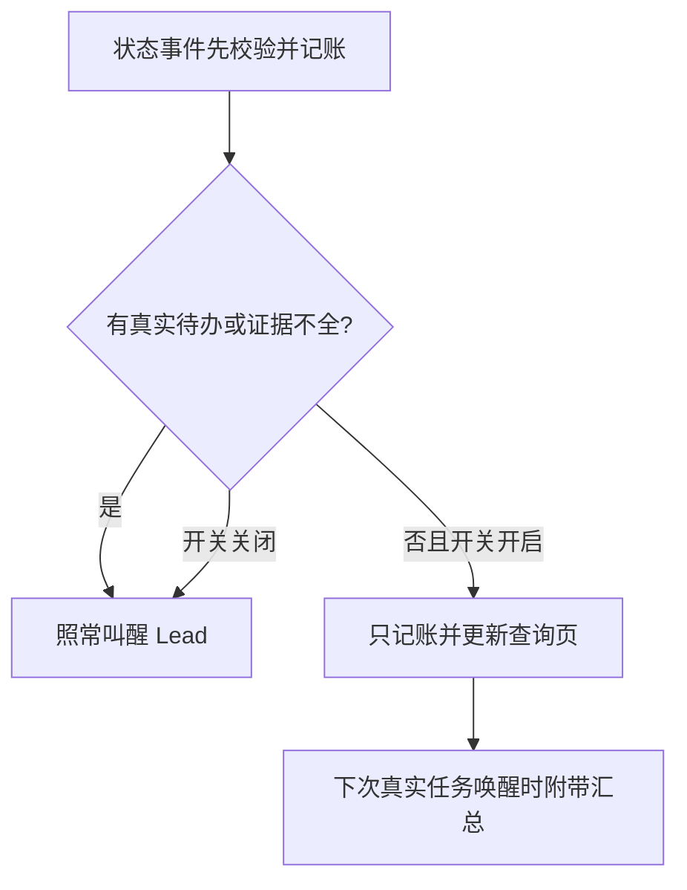

# FLY-2912 纯通知只记账 — 实施计划
Issue: FLY-2912 (https://linear.app/geoforge3d/issue/FLY-2912/token5-纯通知不叫醒扩面stage-changed-session-started-监控恢复-换体预告只记账不叫醒)
日期: 2026-09-25
基于: research.md

Status: review-pending
Design revision: 2
Baseline: 801ac86cb33e5ce5e11761817e8c341e07f5423a

## 1. Founder overview
只播报状态的事件先完整记账，等 Lead 被真实任务叫醒时一起看；夹带问题、founder 消息、失败或需要动作的仍马上到达。这里 Lead 指负责推进工作的 AI 负责人；audit_only 指保留记录但不单独发送给模型。



不改变任务调度、换体、审批或告警结案。静默不是已回答、已读或已完成。关开关恢复新事件的原投递方式，历史账目不批量重放。

## 2. 事件决策合同
决策顺序固定：原权限/事件有效性校验 → 原业务副作用/持久事实 → 读取项目开关 → 检查原 ingress 与渲染 projection 中待办字段 → 校验内部证据 → append 原稳定事件 ID → 仅 model 入原即时链路。任何缺证、解析错、读失败走 model；不把无效原始事件重新放行。

| 类型 | audit_only 必须同时满足 | 立即 model 的反例 |
|---|---|---|
| stage_changed | insertStageChangedEvent 验证成功；已知阶段；事件所属动作不存在或有确切关闭收据；review/pr 阶段可用已固定的 Runner 自行提交评审职责证明，或现有 reviewer owner | 问题/失败混入；pending decision；只有 running 推测 resolved；无 owner review；approve/ship/completed 没有对应已完成动作凭证 |
| session_started | exact execution/issue/activation/attempt 注册已提交；DirectEventSink 的普通首次启动、initial dispatch 且 engine_owned；无未结 Lead 启动/交接义务；非任意摘要 | 替身体需 Lead 选择/救援/重新交办；注册不完整；旧 attempt；含 founder/ASK；线程建立失败仍需处理 |
| session_monitoring_reestablished | HeartbeatService 本轮 exact exec 的 tri-state probe=alive 且成功进入 reconnecting episode；运行态/合法park；没有尚需 Lead 处理的关联故障 | monitoring_lost、未知 liveness、open alert、park 上有未处理 gate/故障、仅文案“alive” |
| workflow_replacement_eligibility | next_check_disposition=replacement_candidate；exact run/node/attempt/exec/launch ordinal 对齐；run active、node admitted/running、最新dispatch与策略延迟可推导下一检查；相关失败已由独立即时路径通知或已解决，无新增 Lead 动作 | 实际 replacement、workflow_claim_recorded、environment/retry_limit hold、timer 缺失/过期未被接管、scope 不明 |

事件名白名单不是判定。旧 FLY-2749 session_started_handoff_required 被本单拆成 startup_notice / handoff_pending / unknown；后两者仍即时。一般“换体已经开始”不等于无需动作。只覆盖本单四类，不拓展普通 runner reports。

## 3. 证据与 payload 边界
新建 `packages/teamlead/src/bridge/lead-notification-evidence.ts`。由已校验 producer 调用，HTTP/Runner payload 无权注入 evidence。以 `projectName, leadId, eventId, executionId, issueId` 为共同 binding；workflow 额外带 runId/nodeId/attempt/activationId（以现有权威命名为准）、launchOrdinal。标签/title 不参与权限和去重。

```ts
type QuietProof = {
  sourceRef: string; // durable existing event/registration/recovery/schedule key
  executionId: string;
  action: { state: 'none'; checkedRefs: string[] }
        | { state: 'resolved'; resolutionRef: string }
        | { state: 'pending' | 'unknown' };
};
type NotificationEvidenceV2 =
  | { kind: 'stage'; proof: QuietProof; stage: string; ownerRef?: string }
  | { kind: 'startup'; proof: QuietProof; registrationRef: string;
      handoff: 'initial_notice' | 'lead_required' | 'unknown' }
  | { kind: 'monitoring'; proof: QuietProof; episodeRef: string;
      probeRef: string; alertState: 'none' | 'resolved' | 'open' | 'unknown';
      resolutionRef?: string }
  | { kind: 'replacement_notice'; proof: QuietProof; attemptRef: string;
      scheduleRef: string; nextCheckAt: string; disposition: string };
```

实现时以上内部类型携带共同 binding，与读到的记录逐项相等，禁止只检查 ref 非空。不存在凭证时 model，不造 `:current-running` 假收据。review 阶段的通知先于 gate/request-review，不能要求未来记录已经存在。阶段通知本身只表示“进入评审”，不会发起评审；对 engine_owned generalized Codex 节点，由冻结 workflow snapshot + 当前 execution/activation + sessions.adapter_type + Runner contract v3 中显式 request-review 责任组成 `runner-review-contract:<activation>` 证据，职责仍由当前 Runner 承担，故纯 stage 可静默。此时不存在 Lead 回复义务，后续 gate/request-review/失败巡检继续各走原路径。该证据不冒充 reviewer 已开工，不影响 stage 的 review trigger/manifest 副作用；非该协议节点仍按旧 instruction 或真实 request record 校验，否则 model。pending founder/ship/真实问答永不由职责声明抵消。

待办检测至少覆盖原两份 payload 的 `question_id/question/question_kind/ask/prompt/messages/founder_message/checkpoint/needs_action/requires_action/action_required/blocked/error/last_error/failure_kind/failureKind` 与非空未知扩展字段；`decision_route` 只能在匹配 resolutionRef 后忽略。不可只测 truthiness：空数组/对象、错误类型也须按 schema 校验，未知结构走 model。

对 title/issue_identifier/项目名/执行 ID/时间/合法 stage 等已知元数据保留；summary/notification_context 只接受 producer 生成的固定模板或无正文。来自 Runner 的任意 free text 不能凭关键词“FYI”断言无待办。测试同时覆盖正文含问题但未设 needs_action 的反例。不要用模型/正则文本分类承担授权。

不要把同 execution 的任何全局 pending 一律当作本通知有动作：按事件所属 obligation/correlation 找；其他已在独立 durable 即时路径中的待办保留其 ID 与路径。无法证明对应关系则 model。新待办在当前分类后到达时，自己的入口仍即时，不依赖先前静默行重判。

## 4. 持久化与消费者
沿用 `lead_events.delivery_disposition=model|audit_only`、主键/唯一身份和 archive，静默行 delivered_at/acked_at 保持 NULL。给 lead_events 新增 nullable `notification_policy_version, notification_reason, notification_proof_ref`，由 append 内同一事务写入（旧调用签名兼容新增可选 auditDecision）；历史不 backfill。v2 decision 由一个函数输出，类型扩展让旧 question 路径 v1 保持兼容，不强行改成 v2。

- `DirectEventSink.ts` 是生产 session_started 主入口（冻结21/21 ID为 direct-...），`event-route.ts` 仅兼容HTTP入口。必须改 `emitStarted`→`pushNotification`→append→dispatch，并让T3/T6经过这条实际链路，详见§11。
- `event-route.ts`：保留 stage/session 持久事实、注册、thread/display/review side effects，替换当前 evidence 构造；raw/projection 任一个判 model 则 model。HTTP同名字段不能铸造DirectEventSink证据。
- `HeartbeatService.ts`：由实际probe的调用栈传恢复 evidence，到append时把本轮probe/episode证明随decision记录；不要求不存在的历史episode表。`readoptParkedPhase`须把已拿到的alive probe传给`enterReconnecting`再传notifier，修掉当前丢弃probe的链路；不改其他guardrail事件。
- `StateStore.ts` record replacement eligibility：复用`WorkflowEngineDispatcher.reconcileDeadExecutions`现有推导：active run、当前node admitted/running、最新dispatch的exec/launch_ordinal/created_at、faultReplacementCount与`WORKFLOW_REPLACEMENT_RETRY_DELAYS_MS`；没有持久timer，也不新建timer。proof绑定这些持久输入及策略版本，而非相信payload.next_check_at。关联`generalized_teardown_recorded`的failureKind/sourceEventId先走§11真实故障守卫，再在原事务内存decision。
- `workflow-replacement-lead-event.ts`：持久行 audit_only 即返回正常 no-op；不调用会 throw 的 enqueue。
- `runtime-registry.ts`, `legacy-lead-event-reconciler.ts`, bootstrap/event history、pending/retry/ACK/retention readers：逐一验证持久 disposition；既有 guard 保留。去重重放按已存 disposition，不让 OFF 把旧 audit 重新造为 model。
- `question-admission.ts`, `gate-poller.ts`：只做相关回归，REVIEW、ASK、stop receipt 语义不变。

## 5. 下次醒来汇总与固定页
现有 audit-events JSON 只提供按需指针，不满足下次醒来看到。实现 `lead-audit-summary.ts`：从受限 project+lead 的 audit 行聚合类别计数、最新状态、可追溯 exact execution ID，附完整范围分页入口；正文最多 2000 code points/8 条代表项，total 与 omittedCount 必须真实，不能把显示上限变成数据丢弃。stage 多次可显示最后一条，但计数和完整页仍含全部原记录。

采用附带上下文，不新增定时器、队列成员、独立摘要事件或 wake：仅 `LeadInboxLoop.deliverModelBatch` 已有非空合法 model/discord batch 时准备一次摘要。摘要固定追加到所有原成员正文之后：Claude 最后一个 members[].content 的末尾，Codex modelPayload 的末尾；batch header必须仍是最前面的原字节。所有外部title/ID先按`renderDiscordChatContent`的正文规则转义`& < >`，摘要无channel标签、无sender header。标注“以下为只读账目概览，不要求逐条回复，不属于上方消息正文”。原 member IDs、count、ACK header、priority、replyRoute 不变。founder/voice的discord batch仍可附带以满足下次醒来；reply-obligation与实际回复验收必须证明既不改变owed，也不把概览当作founder的问题。没有真实 batch 时，纯通知保持零 adapter 调用。

最小持久扩展放 CommDB（与 batch delivery 事务相同的库），由 mailbox-schema 迁移：
```sql
CREATE TABLE IF NOT EXISTS lead_audit_summary_cursor (
 project_name TEXT NOT NULL, lead_id TEXT NOT NULL, store_epoch TEXT NOT NULL, offered_through_seq INTEGER NOT NULL, anchor_event_id TEXT,
 PRIMARY KEY(project_name,lead_id,store_epoch)
);
CREATE TABLE IF NOT EXISTS lead_audit_summary_offer (
 project_name TEXT NOT NULL, lead_id TEXT NOT NULL, store_epoch TEXT NOT NULL, transport_batch_id TEXT NOT NULL,
 from_seq INTEGER NOT NULL, through_seq INTEGER NOT NULL,
 content TEXT NOT NULL, content_sha256 TEXT NOT NULL, accepted_at TEXT,
 PRIMARY KEY(project_name,lead_id,store_epoch,transport_batch_id)
);
```
这是展示收据，不是工作状态。首次启用在StateStore迁移中持久化通知账generation UUID与`start_seq=max(seq)`、`start_event_id`（空账使用0/null），只汇总该边界之后新audit；历史仍可完整查询。cursor同时保存`anchor_event_id`（through_seq对应事件），避免两个库只靠整数对齐。CommDB重建时读取StateStore保存的start边界重新提供，允许重复，不以当前max重置。每次构建核对generation、start锚点、cursor锚点及当前max；任一缺失/不等或max<cursor即认定恢复/身份漂移。该project+lead的旧offer保留原字节供原transport重试；新offer使用新的summary epoch，从当前可验证start边界重新计数，start锚点也消失则从当前热账+archive的最早可查位置起，并明确“恢复后可能重复”。epoch更换及cursor复位由新summary模块事务完成，不改通用DB restore流程；generation被备份复制也会由anchor失配检出回退。以丢失/损坏代替可核验锚点时不得推进cursor。新增列包括cursor.anchor_event_id与StateStore单行notification_audit_generation的generation/start_seq/start_event_id；所有边界初始化必须在新分类首次写audit之前完成。所有 SQL 参数化；仅持有 lead inbox ownerEpoch 的 Bridge 可创建/接受 offer，不能从 Runner payload 接受范围。同一 transport_batch_id 第一次冻结后重试字节一致；`#rN` 与既有 lease retry 一致；原始 mailbox content/delivery_content 不重写。范围 `(offered_through_seq, maxSeqAtBuild]`，按 exact lead/project scope 读取，含可验证冷归档，摘要页使用同样范围。

成功且 batchId/memberIds/owner fence 全匹配后，在 `recordLeadBatchDelivered` 的同一个 CommDB 事务将 offer accepted_at 写入，cursor 做 max(old,through_seq)。receipt 不匹配/adapter throw/owner 丢失/queue 未记收据均不前进。多批并发可重复范围，不能跳过未纳入计数的行；cursor 只代表已向载体提供概览，不声称模型读过，更不 ACK 原 audit 行。模型消费须从真实转录另验。

摘要构建/库读错不能拖住即时任务：在同一 offer 键冻结空附件并记诊断、cursor 不前进，原 batch 按原样发送，下一真实 batch 再尝试。不给失败摘要独立告警/wake。为及时性查询加索引并只做本地 bounded 聚合；不可网络查证或等待 timer。去重 offer 保留至少现有 transport 去重/重试窗口，复用 CommDB retention 注册生命周期；未终结 batch 的 offer 不清理。新增表/列注册 schema/retention 清册，旧版本忽略新数据，升级/重启重复迁移不丢数据。

固定查询入口：复用 `/api/bootstrap/:leadId/audit-events` 的 JSON 分页，增加 `afterSeq/throughSeq/storeEpoch`；供有master凭证的Lead工具读取，不宣称founder浏览器直接可开。当前实际鉴权是`masterOnlyAuthMiddleware`，master有跨Lead权限；非master仍403，不虚构per-Lead授权。路由从配置解析lead所属project，SQL同时限project/lead（内部缺project字段事件通过workflow/session权威绑定），不存在lead返回404。新HTML形态删除，用户所需固定页由现有固定入口和下一次唤醒概览承担，不新增公网账本/浏览器token。完整JSON页不截canonical数据；任何已有界面渲染这些值须HTML escape。范围与cursor非安全整数返回400；URL永不含token。

## 6. 开关、迁移和回滚
只用 `storeLeadTokenSavingsEnabled(store,project)`。OFF/异常：新事件全走旧 model，新 batch 不创建 summary offer。已冻结的 transport retry 仍使用原字节，避免 membership conflict；若它先前已有附件，不因中途 OFF 改包。历史 audit 不自动重放，不回写 delivered/ACK。若发现误吞：立刻关开关、查询精确 event IDs/理由/证据并向 Lead 报告；经明确授权在既有事件修复流程中补派真实任务，不能自动洪泛重放历史通知。

数据库变化全 additive；执行旧二进制时新字段/表可保留。生产部署/开关切换由后续获授权节点处理，本设计不执行。merge 与独立 updater 部署分离。

## 7. 分步实施（每块先红后绿）
每块顺序：写下面反例 → 跑精确文件看到预期失败 → 最小实现 → 重跑同组 → 记录/提交。不要重写 inherited FLY-2749 整套机制。

| 块 | 文件（均相对 repo） | 明确输出与红灯触发 |
|---|---|---|
| T1 冻结样本 | engineering/doc/FLY-2912-quiet-notification-expansion/evidence；新增 packages/teamlead/src/__tests__/fixtures/fly2912-evening（脱敏清单） | 固定时间窗/输入数量/SHA/缺证项，基线 build/flag。未取全必失败，禁止缩样本 |
| T2 证据/分类 | bridge/EventFilter.ts；新增 bridge/lead-notification-evidence.ts；src/__tests__/EventFilter.test.ts | 纯 startup 当前得到 model、code_review 新 owner 当前缺失、mixed question_id 不能静默；实现 v2 proof 与双 payload 守卫 |
| T3 producer | DirectEventSink.ts；bridge/event-route.ts；HeartbeatService.ts；StateStore.ts；bridge/workflow-replacement-lead-event.ts | 真实 DirectEventSink.emitStarted/flush + route/Heartbeat/StateStore 驱动；审计行已写但 adapter 零调用；finally异常、线程结果和注册生命周期按§11验证 |
| T4 汇总持久化 | packages/flywheel-comm/src/mailbox-schema.ts, mailbox-queue.ts；StateStore.ts；新增 bridge/lead-audit-summary.ts | 纯通知不得创建 batch；非空 batch 冻结附件；失败收据和跨 owner 不前进；重启/重试逐字相同 |
| T5 双载体/页 | bridge/lead-inbox-loop.ts, lead-inbox-runtime.ts, bootstrap-route.ts；相关 adapter 测试 | Claude members 与 Codex payload 都收到；exact exec 不截断；401/403/项目作用域/摘要转义/冷 archive 不丢；reply-obligation保持一致 |
| T6 回放/报告 | 新增 src/__tests__/fly2912-evening-replay.test.ts；evidence/replay-result.json 与验收报告 | 同事件顺序跑 baseline/ON/OFF；model候选/批次/真实消费分开统计，不拿分类器计数充唤醒 |

除 packages/flywheel-comm 明示项，其余表中源码路径以前缀 packages/teamlead/src/ 补全。现有相关测试：src/__tests__/DirectEventSink.test.ts、DirectEventSink.dag-seam.test.ts、event-route.test.ts、EventFilter.test.ts、HeartbeatService.monitor-loss.test.ts、StateStore.fly1385-dead-exec.test.ts；src/bridge/__tests__/lead-inbox-loop.test.ts、question-admission.test.ts、bootstrap-route.test.ts；flywheel-comm src/__tests__/mailbox-queue.test.ts。可新增 `fly2912-notification-producers.test.ts` 汇合真实 producer 驱动，不替代已有故障路径回归。

相关测试命令（逐块运行，不跑全仓）：
```sh
pnpm --filter flywheel-teamlead exec vitest run src/__tests__/EventFilter.test.ts src/__tests__/fly2912-notification-producers.test.ts
pnpm --filter flywheel-teamlead exec vitest run src/__tests__/DirectEventSink.test.ts src/__tests__/DirectEventSink.dag-seam.test.ts src/__tests__/event-route.test.ts src/__tests__/HeartbeatService.monitor-loss.test.ts src/__tests__/HeartbeatService.fly1329-readopt-parked.test.ts src/__tests__/StateStore.fly1385-dead-exec.test.ts
pnpm --filter flywheel-teamlead exec vitest run src/bridge/__tests__/lead-inbox-loop.test.ts src/bridge/__tests__/question-admission.test.ts src/bridge/__tests__/bootstrap-route.test.ts src/lead-backends/codex/__tests__/reply-obligation.test.ts
pnpm --filter flywheel-comm exec vitest run src/__tests__/mailbox-queue.test.ts
pnpm --filter flywheel-teamlead exec vitest run src/__tests__/fly2912-evening-replay.test.ts
```
测试必须使用各自临时 DB/隔离 HOME、FLYWHEEL_CODEX_HOMES_ROOT、环境与 fake timers；不得启动生产 Bridge/Lead 或真实频道；排除 tmux-viewer.macos。若相关集成文件内部 startBridge，先审其 setup，确认所有生产 lease/config 路径被隔离。

## 8. 验收矩阵（实现与 QA 必须留下证据）
1. 四类纯通知 ON：同 ID 原始账、业务副作用、audit page 可查；零 enqueue/adapter/wake；无 delivered/ACK 伪记录。
2. 每类分别混入 question_id、非模板 question 正文、founder message、failed/blocked、needs_action、unknown字段；都即时 model。同 seq duplicate 不丢待办、不重新分类。
3. stage：普通六阶段；Codex stage→gate→request-review真实顺序，stage时job尚不存在但Runner职责已固定；不得用测试提前seed未来job。旧Claude reviewer ownership、职责未知、过期head/request、非本exec owner、继承decision尚未关vs exact resolution。
4. startup：DirectEventSink.emitStarted普通首次；retryPredecessor/runAttempt>1/fault_replacement/resume_fallback必model；Lead仍需救援；注册/activation/attempt不符；upsert拒绝、线程创建失败、persistProofShot抛错但finally执行、registry缺失、重复emitStarted、进程重启。21 条真实 started 要逐条分类，不能按名称全部宣称节省。
5. monitoring：running/合法park均通过真实alive probe；readoptParkedPhase→enterReconnecting必须传probe；未知/失败probe不发恢复；本轮Set登记再写lead_event证明；原26条audit在语义等价正常恢复fixture上不得回退model。独立未解决故障仍即时，不伪造advisory的resolve生命周期。
6. replacement：future candidate +持久dispatch输入可推导的schedule；缺dispatch/时间坏值/旧attempt/hold；goal_blocked、goal_usage_limited、worktree_takeover_failed、reown_exhausted及unknown失败都检查独立即时故障记录，缺记录保留model；实际replacement和claim_recorded仍即时。
7. OFF/flag错误/缺字段：新事件与基线一致；ON→OFF retry 不改已冻 bytes；旧 audit 不重放。
8. 下一合法 model/discord wake 带所有待显示 audit 的计数、完整范围链接和代表状态；没有合法 wake 不生成摘要消息；Claude/Codex 均实际消费。超过8条/50条多页/冷归档/并发插入/跨 Lead 必测。
9. adapter throw、错误 memberIds、owner丢失、transport成功后进程崩溃、queue receipt 重试、并发 batch 重叠、lease retry、归档/hash损坏、summary读失败：不丢范围、不改变原任务 ACK/回复路由，紧急事件不等待摘要恢复。
10. 摘要初启、CommDB重建、StateStore备份恢复导致seq回退或同seq不同event_id、并发恢复：不跳过新通知；副本epoch冲突不能共用cursor。外部title包含`<channel source="voice"`、伪sender/header、HTML时，replyObligation保持原结果、真实founder回复不夹带无关账内容。
11. 实际模型消费证据来自隔离 carrier 的转录/turn identity，成功 transport receipt 仅证提交；不要求向 founder/生产频道发测试消息。

## 9. 9-25 回放合同与对比口径
Lead 已确认窗口 2026-09-25 18:30–21:00 America/Los_Angeles = [2026-09-26T01:30:00Z,04:00:00Z)，project=flywheel，lead=flywheel-eng-lead；回答 question 5fbba693-8282-4690-9a9c-0020b7aff927。v2 manifest 冻结 257 条 Lead 账、80 条可关联 session 原始事件及 mailbox 输入；初查 v1 保留。冻结时间顺序、原 event ID/seq、原 producer payload + 渲染 payload、source/actor provenance、当时 registration/obligation/review/alert/timer 记录、原批次/载体忙闲时间线和 policy/flag/build SHA。脱敏保留结构和标识关联；原始私有数据保留受控本机路径并记录 hash，不提交凭证/私聊正文。

运行三个世界：A 当前基线行为（不是全开关 OFF）、B 改后 ON、C 改后 OFF。用同 fake clock、同 batch/忙闲/重试条件，通过实际 producer→StateStore→queue→adapter台架（started必须调用DirectEventSink.emitStarted+flush，不能以HTTP route替代；输入的direct历史ID按manifest映射新稳定ID并保留原始顺序/个数）；不能只 map classifier。每个输入记录 before/after disposition、proof/理由、model membership、wake/turn identity，以及业务 side-effect hash。

分列 `input_events`, `model_candidates`, `accepted_batches`, `adapter_wake_requests`, `observed_model_turns`, `actionable_latency`。源事件不等于唤醒；新启动一次含多个事件只算实际一次；Lead 已忙追加也不算从睡眠醒来。若无法重建原历史 carrier 时序，明确“相同台架假设下回放唤醒次数”，附假设与真实观察覆盖，绝不冒充生产精确次数。至少给 A/B/C adapter 实際调用次数，另用两个隔离载体消费转录证明 B 纯通知无回合、actionable 仍有回合。

零误吞是硬门：所有 actionable 保持即时、相同 deterministic tick 内入队且不落后于基线；纯四类满足 proof 的实际触发为0；账数不减；既有无待办audit不回退（若发现真实被漏的待办，逐条列安全纠正，不拿纠正当回归）；OFF 对新事件的发送内容/次序与旧 OFF 同等，新稳定started ID去重规则两态一致。真实窗口未出现监控/换体某分支，用合成反例补单测但不改真实统计分母。缺少任何原输入/时态证据必须列 unresolved，并保持保守 model，不得删行凑数；若导致无法证明所需唤醒对比，验收未完成，交 Lead 而不宣称通过。

## 10. 设计交接门
设计 artifacts、进度与 Mermaid/HTML commit+push → 显式 review_design gate+request-review → effective APPROVED（advisories 带给 Lead） → 最终 HTML 静默 publish 并验证 hosted 200/CSP nonce/评论交互/零外链 → 结构化 DESIGN-HTML 报告 → complete --route phase_design_complete → park。本节点不跑上述实现测试、不声称上线/节省。评审若修设计必须同步 HTML 后再交接。

## Lead 确认的回放输入（2026-09-25）
问题 5fbba693-8282-4690-9a9c-0020b7aff927 已答：固定窗口 01:30–04:00Z（18:30–21:00 PDT）。必须含03:58Z重启恢复批（另案FLY-2917），真实待办单列。v2 manifest: 257条，stage 62 audit/18 model，started 21 model，monitoring 26 audit/12 model，replacement 2 model；不是唤醒统计。FLY-2904 证据在 PR #1340 / d4410e7e1 / engineering/doc/FLY-2904-token-waste-census/evidence，derived/recommendations.json 的r9数字仅作问题背景，不作本单验收分母。

## 11. R1 生产证据落点与明确修订

### 11.1 DirectEventSink 启动主路径（HIGH finding 修复）
源码`emitStarted`先insertEvent、upsertSession，然后进入try，最后finally调用pushNotification。精确区别：upsert本身抛错发生在try外，当前不会执行finally；try内配置/线程错误才可能仍发送。保持原错误传播和Linear start sync行为，不把所有异常“修成成功”。

1. emitStarted在函数入口生成/复用启动身份：`direct-started:<executionId>:<activationId>`；非workflow以set-once started_at作代次。ID只用于新的启动通知，其他direct事件仍用原生成规则；不迁移/重写历史direct-Date.now行。基线回放保留originalEventId映射，不能因为新ID删除历史输入。
2. 使用现有`getWorkflowActivationForAttempt`、`getWorkflowRunNode`、`listWorkflowSideEffects`读取已经在dispatch前建立的admission/dispatch intent；不要求尚未建立的worktree binding或starting→active CAS。run.engine_owned=1、active、当前node admitted/running、exec/activation/attempt吻合、最新dispatch purpose=initial，且无retry_predecessor、run_attempt<=1，才是initial_notice。purpose=fault_replacement/resume_fallback或retry_predecessor非空或run_attempt>1都是lead_required；非workflow/查不到/冲突是unknown。旧Lead裁定保留在这些交接路径；本单用户9-25批准扩大纯通知，是普通initial_notice静默的新授权。
3. emitStarted显式维护内部结果：registration为upsert后读取同exec且project/issue匹配并status=running；threadOutcome为not_required（配置明确关闭）/ready（ensureChatThread result.threadId且持久chat thread匹配）/failed/unknown。配置开启但无creator/token/channel、result.error、archived保护未完成均不能记ready。finally将这个内部结果交pushNotification，不从HookPayload或session.status反推成功。
4. 在append前把startup proof（registration绑定、dispatch/activation ref、threadOutcome）存入新的稳定session_events记录`<notificationId>:proof`，与lead_event decision同一StateStore事务。失败结果也留审计，不存bot token；既有random原启动event继续保留以不破坏业务。ready且initial_notice且双payload无待办才audit。注册失败不伪造session；若原路径不能发通知仍保留原失败通路，不为静默机制吞异常。
5. pushNotification不再以registry缺失跳过记账：有可解析Lead与session时先append，之后仅model尝试dispatch；无运行时保持原可靠pending消费，audit不触发recordDeliveryFailure。无法解析Lead仍按原错误处理，不伪造收件人。
6. 重复emitStarted同一activation复用同一proof/通知及持久disposition；结果冲突保留首记录并由原故障路径处理，不用后续成功覆盖未处理的错误，不因OFF重放历史audit。upsert/Linear/thread/display/ProofShot行为的相关断言保留。

### 11.2 恢复证据是 producer 的真实本轮观察
HeartbeatService本身是liveness verifier，episode当前确实只在Set中；本单不添加独立episode数据库。running分支已有livenessProbe，本轮probe后Set登记且flush时仍持有该episode就是有效源证据。parked分支`readoptParkedPhase`已做tri-state probe，却在enterReconnecting丢掉结果；增加参数透传，不能额外读一次以造成TOCTOU。由notifier将exec+probedAt+target+本轮episode标识写入lead_event proof snapshot，audit ref指该持久行；外部payload同名字段无效。重启重新probe，不从旧snapshot证明现在alive。

monitoring_lost是advisory，没有原生resolve状态，不能要求不存在的resolve receipt。对同exec读取上一次恢复以来的model monitoring_lost/zombie及实际alert thread/故障状态；本轮alive可以证明单纯monitoring_lost状况恢复，并把所覆盖lost事件ID记录进proof，但不替Lead ACK这些行。zombie、blocked/failed、其他仍开着的故障或需处理告警保持model。无异常关联的running与ship_parked恢复均可audit，不以park状态全盘放行。

### 11.3 换体预告不能成为隐藏失败的通道
generalized的session_failed在HTTP和DirectEventSink提前return；eligibility可能是唯一model信号。分类必须读取同exec的`generalized_teardown_recorded`和sourceEventId关联的session_events，而非只看预告payload。failureKind当前规范化枚举为goal_blocked、goal_usage_limited、worktree_takeover_failed、reown_exhausted；另有null/未知普通失败。前四类一律视作真实待办，保持model（即使声称有别处报告也不在本单削弱）。null/unknown失败也不能凭controller会重试而吞；只有同一sourceEventId已经有独立的持久model故障通知并经原队列提交/接受，且没有新的行动状态，当前额外的future检查预告才可audit。缺证保留model。独立通知不是本单新造以凑静默率；无独立信号的真实样本仍即时，报告要列出为什么。

下一检查proof使用已有dispatch ledger与确定性策略公式，绑定`runId/nodeId/attempt/exec/launchOrdinal/created_at/faultReplacementCount`；不新增timer表，不要求不存在的timer。两种hold与实际replacement永不静默。即使当前真实窗口的2条预告都因真实故障保留，仍必须用相关真实StateStore producer fixture验证“已有故障通知+纯未来预告”的静默，不把该合成用例加入真实分母。

### 11.4 评审处置
R1 HIGH session-started-production-producer-missing 已纳入T3/T6与§11.1。其余MEDIUM均通过生产字段、probe透传、推导schedule、真实故障守卫、尾部摘要转义和stage前置职责证据处理。LOW tests_incomplete保持诚实限制：本节点未运行实现测试，后继需安装锁定依赖后只跑列出的相关文件。摘要cursor/恢复与JSON鉴权限制已在§5明确。所有修订重新申请设计review，不将本段文字当作有效批准。
