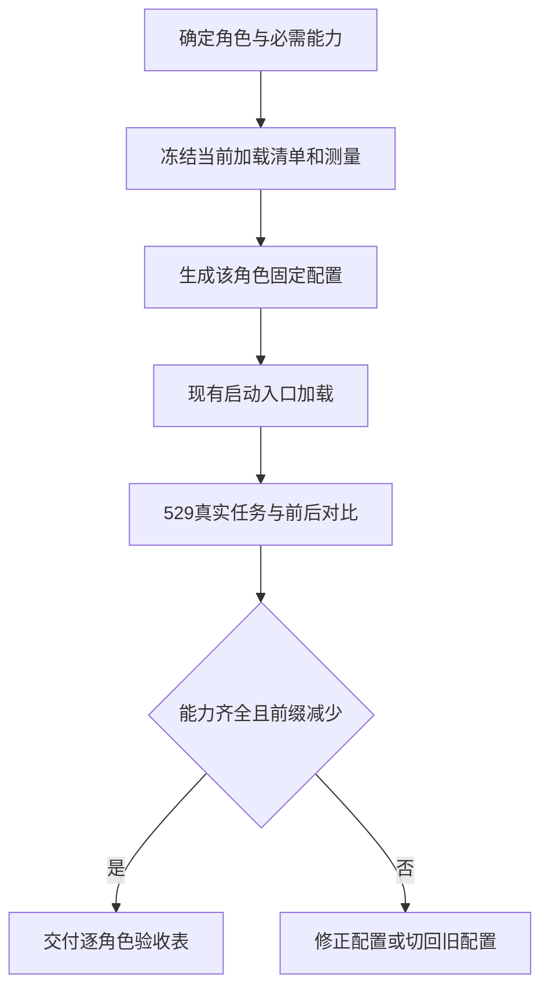

# FLY-2913 逐角色精简固定前缀 — 实施计划
Issue: FLY-2913 (https://linear.app/geoforge3d/issue/FLY-2913/token8-给-claude-runner-评审-qa-各配精简固定前缀逐角色只加载真正用到的工具插件mcp-与规则)
日期: 2026-09-26
基于: research.md

> 当前有效范围（2026-09-26 founder 返工）：只把前缀选择从全局 FlagStore 移到 DAG 模板版本。下文原设计与旧裁定保留作历史；以 plan.md §九及 design-correction.md 为当前实施合同。role-v1 内容与已验能力不重做；旧 APPROVED 不覆盖本次修订。

## 一、交付给 founder 的变化

每种 Claude 工人启动时只带自己的工具与说明，必需能力不缩水。先测真实加载内容，再按角色精简，再让每个角色在 529 隔离房完成真实工作；一个开关恢复此前配置。Lead 完全不动。

固定前缀是每次请求重复携带的系统说明、工具说明、技能和规则。历史 8.7–9.1 万上下文是含任务的代理，不是可直接删去的 token 数。本设计不承诺某个节省百分比，也不以降低模型或跳过规则换取结果。



### 完成定义

1. PR 附 design / implement / QA / Claude design-review / Claude code-review 的工具、插件、MCP、技能描述、规则逐项 keep/remove 清单及原因，包含低频必需能力。
2. 每角色相同 CLI/model/effort、项目、任务与测量方法的 before/after 固定前缀表，组件数、token、占比、总数、差额和证据路径。未知、未测不得当零。
3. 每角色 529 真实模型代表任务成功，无缺工具/缺技能导致失败；独立通过回退和负控。Codex 反向评审能力也须保留并验证，不修改 Codex 配置。
4. 可用一个 runner/reviewer 专用开关恢复旧配置。任何未过验收的角色不可宣称交付。

### 取舍

保留浏览器与 Context7：历史记录已证明使用，且角色合同要求。拒绝修改共享 home/Lead 配置、禁止所有技能、bare 模式、把 allowedTools 当 token 控制。稳定配置按会话固定，避免每轮换工具和缓存抖动；新增必要能力先报告 Lead，由既有受监督新会话流程更正声明后恢复，不由模型偷偷扩权。未映射触发器原样走 legacy，不能仅凭 design/implement 角色开启精简。

## 二、技术合同

### 1. 身份与单一事实源

新增 `packages/config/src/runner-prefix-profile.ts` 及数据文件 `packages/config/runner-prefix-profiles.v1.json`。稳定键仅 `design | implement | qa | review-design | review-code`，展示名不参与解析。普通 runner 从服务端 pinned workflow phase + node role 得出；`eng_design` 等 node key 仅作已登记映射，未知角色走 legacy 并记 reason，绝不猜成 implement。reviewer 从持久 `job.review_type` 得出；land-content-review 显式 review-code。Lead、Codex、非 claude-tmux SDK/adapter 返回 not-applicable。

沿现有 `runnerMcpProfile` 增量传递编译结果，不新增独立配置派发服务。**现状没有任务 required-skills 声明**；`workflowCapabilities` 只描述阶段权限，绝不能冒充能力清单。本单补入下述具名任务集合声明，再与 pinned role 的 `skills` frontmatter、skill-framework arm、已有 labels 做能力并集。权限及 security deny 是最终约束，不被并集绕过；任务声明只选加载能力，不增加文件/工具授权。

#### 1.1 新增声明协议与生产者（R1 HIGH 修复）

`POST /api/runs/start` 新增可选字段 `prefixTaskSet: {version: 1, id: string}`；没有该字段的请求为 **unmapped-trigger → legacy**，包括已有设计/实现角色、generic/code category、任意 issue 标题或 cron 文本。不得把无声明的 code 任务默认当通用工程任务。外部输入不能带 skills 列表、任意插件路径、MCP 配置或 credentials。

可信源为本仓评审过的 `packages/config/runner-prefix-task-sets.v1.json`，由实现者提交，按正常 PR/code-review 更新。每条记录结构固定为 `{id, version, requiredSkillIds, requiredToolIds, requiredPluginIds, requiredMcpIds, requiredRuleIds}`，数组是 T1 已确认的规范 ID。registry 校验全部 ID 存在且依赖闭包完整；未知 ID 不加载任意资源。自由文本、issue labels 和客户端声明均不能写 registry。

请求写入者是已获 `/runs/start` 启动权限的 Lead/API 客户端或可信 scheduler；Bridge 在 `runs-route.ts` 用既有认证/项目权限判断先授权，再验证这个有限枚举选择。不要新增 credential，也不要放宽 scoped Runner 的启动权限。未知 version/id 或未映射来源按 legacy 记录 `prefix_unmapped_trigger`，原始任务正常运行；若调用方显式要求 role-v1 验收，则该回退记未通过，不能当优化成功。

| 触发任务 | 明确写入者/入口 | registry 集合及依赖要求 | 不认识/未声明时 |
|---|---|---|---|
| 普通工程任务 | 已授权的 runs/start 调用方显式给 `engineering`；阶段/review node 不自行推测 | role 基线 + pinned role skills + 当前 arm；不从七天无调用推断可删 | legacy，发可见原因；上线交付需给调用方明确 API 用例并验证工程任务确实带此字段 |
| meeting-notes | `scripts/meeting-notes-scheduler.ts:525` POST payload 加常量 `meeting-notes`；无需改 Lead 配置 | `meeting-notes` 技能与其读会议存档/出摘要/报告所需工具和规则；来自真实技能内容的闭包 | 原旧调用 legacy |
| xiaohongshu-learning | `scripts/xiaohongshu-scheduler.ts:236` POST payload 加常量 `xiaohongshu-learning` | 同名技能、实际 xiaohongshu MCP、浏览器/资料和报告依赖；不能套工程 MCP 删除表 | 原旧调用 legacy |
| xiaohongshu-deep-learning | 已授权发起者在 runs/start 给 `xiaohongshu-deep-learning`；本仓没有可假定的同名 scheduler 写入者 | 同名技能及其真实脚本/视频/图片/MCP 依赖闭包；缺项不可 role-v1 | 外部既有触发器未升级声明前始终 legacy |
| Sub nightly / 806 视频 / 自定义研究任务 | 未定位并确认的外部生产者**不映射**，不以项目名或标题猜任务 | 只有按相同 registry PR 流程登记实际技能/依赖并让生产者提交 ID，才进入 role-v1 | 明确 legacy 保留原技能、Chrome/MCP；不得受 default role-v1 波及 |

这是兼容护栏，不是把这些任务算作已优化：PR 必须分别列 role-v1 任务覆盖和 legacy 未映射来源，不以未优化会话凑 before/after 样本。用户真正请求的五类工程角色都必须有携带显式 `engineering` 声明的真实验收；若启动调用方仍没带声明，本单不能完成默认启用交付。

落盘与消费：`runs-route.ts` 将 registry 展开的内容和 digest 规范化，写入同一启动 reservation 的持久 start_request_json；new workflow materialization 在 `WorkflowRunSnapshotV1/V2/V3` 增可选 `prefixRequirements`，值为 `{version:1, taskSetId, registryDigest, requirements}`，参与 snapshot_digest。**两个 materialization 分支、所有 parse/validate 分支及 hydrate/重试路径一起更新**。客户端只给集合 ID，不能提供展开内容或 digest；旧 snapshot 无此字段沿 legacy，不能读当前 registry 补造。existing run start/retry/rework 只消费 pinned 值；请求更换集合必须返回明确冲突并要求新 run，不在同一 activation 换义务。Blueprint 和 AdapterExecutionContext 增 optional 已解析字段，`workflowCapabilities` 不复用。

运行中若发现未声明技能：保留原会话与进度，用已有 `ask --report` 报所需规范技能 ID、失败操作、session/profileDigest；不自动安装或换工具。Lead 通过现有有权限的停止/新 run 恢复流程选择更完整集合或 legacy，新的 authenticated start 带原进度恢复引用；新 session 有独立 stamp，旧会话不得继续标为 role-v1 成功。不新增自动重启/授权通道。


```typescript
type PrefixRole = 'design' | 'implement' | 'qa' | 'review-design' | 'review-code';
type PrefixMode = 'legacy' | 'role-v1';
type SourceRef = { id: string; kind: 'tool'|'plugin'|'mcp'|'skill'|'agent'|'rule';
  sourceSha256: string; decision: 'keep'|'remove'; reason: string };
type PrefixStamp = { version: 1; mode: PrefixMode; role: PrefixRole;
  executionId: string; activationId?: string; reviewRequestId?: string;
  sessionId: string; cliVersion: string; profileDigest: string;
  inventoryDigest: string; taskSetId: string; registryDigest: string;
  skillArm: string; sources: SourceRef[] };
```

实际 stamp 只包含来源身份/摘要/决定；绝不存 credential 值、完整 MCP env、用户 prompt 或 tool payload。profileDigest 覆盖排序后的角色、taskSetId/registryDigest、配置版本、工具列表、skill arm、已选择文件内容 SHA 及 compiler version；不以安装目录名代替内容。stamp 原子写进现有 execution 的 runner-state，reviewer 按已有 request/session 产物目录保存。文件 0600、目录 0700；不新建数据库表。接入现有执行产物清理，不删除进行中的 profile。

### 2. 精简配置的选择规则

第一步测量后把以下候选展开为**精确可用名称**，提交到 v1 JSON；不可只提交类别名。每个发现项均需保留原因或删除理由；unknown 没有裁决时不能进入默认 role-v1。候选表不是尚未测到的事实。

| 角色 | 必留内置能力 | 必留技能/插件能力 | MCP/规则底线 |
|---|---|---|---|
| design | Bash、Read、Grep、Glob、Edit、Write、Skill、ToolSearch、WebSearch/WebFetch、当前合同需要的 Agent/异步任务工具 | brainstorm/research/write-plan/diagram-design；当前 arm；Codex design review；HTML 交付 | 浏览器、Context7；TURN/阶段/评审/报告、git、安全、HTML规范 |
| implement | 上列读写/搜索/技能/资料及 Agent/测试等待工具 | implement、TDD、debug、验收、Codex code review；当前 arm | Chrome/Playwright 真实需求、Context7；权限、git、code-review、恢复合同 |
| QA | 读写证据/运行测试/技能/等待工具，按合同保留编辑测试能力 | QA 验证、browser repair、HTML交付及任务所需 QA skill | Chrome/Playwright、资料查询；隔离房/QA verdict/negative controls/报告 |
| review-design | Bash/Read/Grep/Glob、资料查询、ToolSearch、合同要求的 Agent/等待；输出 verdict | 审查依据的技能和安全指导；如合同要求 planner 则保留 | Context7；工作树审查、安全与受监督 ruling；不获得作者写权限 |
| review-code | review-design 能力；只允许原合同范围内临时测试/证据写入 | 代码审查、测试与安全指导；当前评审协作能力 | Context7；确切 head/verdict/失败关闭合同 |

`Bash` 含大量 flywheel-comm、git、gh、测试调用，不能因 MCP 替代而删除。历史 reviewer 的 Write/Edit 记录不自动授权修改作者文件，判定是否必需时查其具体合同和脱敏调用类型。必须记录被省略的低频能力如何由任务声明保留。

当前静态快照（`evidence/static-config-inventory.json`）只有配置候选：7 个启用插件、21 个安装记录、73 个技能描述、46 个 agent 描述、11 个规则文件。不是已加载数量。全局 MCP 候选 linear-api、xiaohongshu-mcp；工程默认可排除小红书仅在 role/任务无此必需依赖时；Linear 要核对 issue hydration 与角色自己的查询是否需要，不能凭“已有 comm”假定可删。

### 3. 实际加载机制

不修改 `~/.claude/settings*`、CLAUDE.md、shared skills/plugins/rules；不改 HOME、CLAUDE_CONFIG_DIR、认证、权限模式或模型。

- 内置工具：以当前 CLI 实测名称给 `--tools`；原 `--allowed-tools` 原样保留，仅控制权限。工具集包括合同中运行时隐含的 Agent/wait/Skill 所依赖工具；无法确认时先归 legacy，不能启动半残角色。
- 非插件技能：单次 `--settings` 的 `skillOverrides` 按**完整规范名字**设置 on/off。不能使用全局 `--disable-slash-commands`；不能把只隐藏描述的 name-only 当已移除。
- 插件：复用 `enabledPlugins`。只有插件全部组件无必要用途时整个关闭；保留 superpowers/matt 等当前技能 arm 所需组件。`skillOverrides` 对插件技能无效。
- 混合技能包（例如 everything-claude-code）：为达到只带所需说明的目标，若包内部分必需、部分无关，生成执行私有的**选定组件插件副本**。保留原 manifest name/命名空间、必要 skills/agents/commands、运行所依赖 scripts/assets、hooks/license 与来源哈希；禁原 marketplace key，使用 `--plugin-dir` 装入副本。资产闭包完整复制到私有目录，不用指向可变 cache 的软链。不得删除必要 hooks 或改写技能正文来降低语义。若当前 CLI 的同名插件解析不能保持可调用身份，则此编译器能力未成立，停止该角色默认启用并修复；不能将整包长期保留后仍宣称只加载所需技能。测量控制必须核对 namespace、hook 次数=1 和实际 Skill 调用。
- MCP：输出完整明确的所需 server 配置，并用 `--strict-mcp-config --mcp-config <private file>`；保留必要插件提供的 server 及现有 auth/env 引用。先在当前 CLI 证明 strict 与 plugin MCP 的实际交互，保证每个所需 server 恰好一个实例，没有重复 schemas。配置文件不提交、不打印；日志只记 server id/digest/status。managed server 无法排除时单独列不可控成本，不绕过组织策略。
- 规则：`claudeMdExcludes` 只列经过审核判定无关的 user/project 文件绝对路径（realpath 一并核对），不排除整个 repo 或所有 rules。项目合同、权限、TURN、评审、QA、git、任务相关语言规则保留；需要拆分的非 managed 大文件生成版本化 runner-only 必需片段，source mapping 逐条证明保留义务，再排原文件；不编辑共享原文。自动 memory/managed 规则保留。
- 描述顺序和序列化稳定，同角色/相同输入得到相同摘要；任务能力追加后产生新 stamp。不得用 trim 截断文本或任意 token 上限静默丢项。

### 4. 配置合并与路径覆盖

最终只发一个 `--settings`：原设置 → role 可见性/规则 → 既有 MCP 正向例外 + skill arm → 原 memory/usage/identity hooks → `buildNonLeadClaudeSettings` 的强制 deny。受审 required capabilities 与强制 deny 冲突时报配置错误并报告，不能 positive opt-in 覆盖 deny。保留 no-chrome 的显式退出语义；若任务又声明需 Chrome，视冲突而不是静默缺工具。

- 新建和重试：`run-dispatcher.ts` 两路径传稳定角色及所需能力，Blueprint 完成 arm 合并后编译；不要先算完再让 arm 使结果失效。
- fresh/resume：TmuxAdapter 只消费已校验产物并组合 argv，不重新从机器可变状态独立推测。
- review：coordinator 传 review type/request/session；`ClaudeReviewInvocation` 增 profile；runner 最终 merge 同一 compiler 输出，保留 env wash、JSON verdict、timeout/process group。land-content-review 走 review-code；故障依旧 no_verdict/fail-close。
- Codex reviewer 配置字节不变，Claude 作者仍能调用原评审技能。对子代理分别记录实际继承配置：父 profile 正确不能证明子代理缩减。

### 5. 回退、续跑与兼容

唯一开关 `FLYWHEEL_RUNNER_PREFIX_PROFILE=legacy|role-v1`，仅由 runner/reviewer resolver 读取；Legacy 返回完整旧 launch 配置（仍保留既有 Serena/Discord 安全策略和 labels），不改 Lead resolver。非法值显式报错。开发和 529 验收阶段显式 role-v1，发布默认切 role-v1 必须在全部验收成立后；正常默认值采用项目 default-enable 规范，而不是留永久人工启用尾巴。

每个会话固定 stamp；同 session 重试/恢复使用原 stamp，不重读 mutable 全局并悄悄变工具。老会话无 stamp 按 legacy 恢复，记录原因；新优化仅在新会话生效。配置 cache/source 漂移或 stamp 身份不匹配停止优化启动并给出可操作诊断，不删除原会话或自动伪造旧 stamp。

开关 legacy 对后续**新会话启动**恢复原配置；正在运行的进程不会热变，system-prompt-snapshot 也不会因 argv 改了就更新。当前 slim 会话需回退时，由现有受监督恢复流程在保留进度/角色/activation 关系下换新会话，读取 legacy；不能偷偷清历史、强制 compact 或杀生产进程。执行存续不等于同一个 Claude sessionId；运行期切换必须有新会话回执。QA 必测此边界，不把仅修改 env 当回退成功。

不支持的 CLI 版本/未完成能力探测：以明确 legacy reason 继续原能力并报告“未优化”，不是“role-v1 通过”。此兼容分支不计入交付验收，发布时所覆盖版本必须通过当前二进制全部控制测试。

## 三、按序实施与证据

### T1 — 固定基线与调用盘点（先于任何削减）

新增 `scripts/qa-2913-prefix-inventory.mjs` 及精确 fixture 测试；既有历史聚合脚本作为研究证据保留。输入只接收明确的 529 session/role/source manifest，拒绝 glob 扫所有 home。实际加载采集：CLI `/context all`、`/skills`、`/mcp`、初始化工具列表与首次 system/append snapshot 的脱敏元数据。记录 CLI binary SHA/version、model/effort、head、profile、settings 来源摘要、cwd、session/execution/review type、时间和原始诊断证据路径。

组件分类：system/role prompt、内置 tools、MCP schemas（含 deferred 名单成本与已展开 schemas 分列）、skills/agents 描述、规则/CLAUDE/memory、剩余未归属。插件是来源维度而非再加一次成本的独立桶。固定前缀总数不含任务、历史、输出、reserved output/auto-compact 空间；`/context` 的 tokenizer 估值明确标 diagnostic-estimate，不能标 provider billed exact。若当前诊断无法分离某桶，写 unknown 并补受控首轮采样或相同条件单项消融，未经补齐不接受逐项占比验收。组件和加残差必须对齐总数。

每角色至少三次新会话的配对 legacy/role-v1 测量，保持相同载体/model/任务/权限/项目/skill arm；分别给 p50、范围、样本数，报告后续代表任务请求的 input/cache-read/cache-create 辅助数据。历史 proxy 单列，不能混入 after。

七天调用：当前 frozen CSV 有 tool-result 行证据；实现 collector 需从指定 transcript 元数据按 `(sessionId, assistantMessageId, tool_use_id)` 去重，区分主会话/子代理和 reviewer vendor/type；Skill 只取技能名，绝不写参数正文。刷新窗口取验收 cutoff 前连续 7×24 小时，列输入数、缺失/不可读/重复/未归属记录。没有调用只是 remove 候选；required 合同优先。

输出 `inventory-before-after.json`、`role-capabilities.csv`、`weekly-tool-use.json`；PR 逐角色表必须包含 sourceName/version/hash、loaded/advertised/deferred、token/percent/measurementMethod、observedCalls、requiredBy、decision/reason。尚未实现的 after/529 成功格现在保持未测。

### T2 — 配置编译器与加载语义控制

新增 config resolver/JSON 和 runner 私有产物编译器 `packages/claude-runner/src/runner-prefix-artifacts.ts`；export 由 config index 暴露。先写失败测试覆盖每种角色、unknown、Lead、Codex、labels、保留项冲突、非法路径及 plugin 组件闭包。生成器只读取 manifest 指定可信源根，拒绝路径穿越/越界 symlink，内容由 bytes hash 冻结。名称精确匹配、不执行源文本。

在 529 先用小型 fixture 验证当前 CLI 对 tools、skillOverrides、rules excludes、plugin-dir 和 strict MCP 的行为：保留技能真调用一次；排除技能不在模型清单且调用失败；排除规则的唯一标识不在实际 prompt；MCP 必需 server 成功、无关 server 不在 inventory；混合包 names/hook/asset 相对路径正确。invalid settings 对照必须被 collector 识别为未生效，而不是只看进程 exit 0。

### T3 — 普通 runner 路径

先更新 `packages/config/runner-prefix-task-sets.v1.json`、`packages/teamlead/src/bridge/runs-route.ts`、`packages/teamlead/src/bridge/retry-dispatcher.ts`（StartRequest）、`packages/teamlead/src/workflow-run-snapshot.ts` 的声明校验/持久化/两个 materialization 与解析分支，以及 `scripts/meeting-notes-scheduler.ts`、`scripts/xiaohongshu-scheduler.ts` 的固定 ID。新增 snapshot roundtrip、旧 snapshot、篡改展开内容、retry digest 与源生产者 payload 测试。随后修改 `packages/core/src/adapter-types.ts`（AdapterExecutionContext）、`packages/edge-worker/src/Blueprint.ts`、`packages/teamlead/src/bridge/run-dispatcher.ts`、`packages/claude-runner/src/TmuxAdapter.ts` 的既有配置传递。只加 optional profile 字段，不改公共生命周期协议。新 `Blueprint.fly2913-prefix.test.ts` 与现有 `TmuxAdapter.test.ts`、dispatcher resume/backend 测试覆盖 fresh/retry/resume、mode arm、hooks、memory、auth env、model/effort、Discord deny 均保持。

TDD 顺序：命中缺失字段/错误合并的红测试 → 最小实现 → 单文件绿 → 只重构本单合并逻辑。不要全包测试。

### T4 — 跨家族评审路径

修改 `claude-review-runner.ts`、`review-request-coordinator.ts`、`land-content-review.ts`；review-design/code 类型显式传递，初轮/同 session reround/fallback 新 session 均带正确 stamp。恢复不能把优化失败当 APPROVED。新增/扩展对应三份测试；核 Codex 反向路径技能仍可到达；作者不能通过 prompt 把自己声明成 reviewer/Lead。

### T5 — 529 真任务与负控

遵守 `doc/qa/framework/529-room-playbook.md` 和 slot lease；从被测 head 建新隔离房，验证 room-info buildSha/artifactBuildSha、slot paths 和零生产写。不要把默认 generalized stub 成功当本单验收；新增 suite `packages/qa-framework/suites/fly-2913-role-prefix.md` 和驱动 `scripts/qa-2913-role-prefix.mjs`，明确使用真实 Claude，所有被测角色走真正 consumer。

| 角色 | 代表任务 | 必需可观察成功证据 |
|---|---|---|
| design | 审计小变更→查文档→Mermaid/HTML→显式评审请求→完成阶段 | 必需技能、文档工具、浏览器看页面、报告与阶段 receipt |
| implement | 小型缺陷红测试→修复→绿测试→跨家族 code review | Read/Edit/Write/Bash、TDD/调试技能、Context7、浏览器工具各至少一次必要使用、原 review 路由 |
| QA | 检查预置真实 UI/后端故障，再检修复版 | Chrome/Playwright 操作与截图、至少一个负控 FAIL 和修复 PASS、独立 QA receipt |
| Claude design-review | Codex 作者计划含一个有证据的缺陷，修正后复审 | 首轮 CHANGES_REQUESTED、同 session reround 正确、最终结构化 verdict 和 plan blob 绑定 |
| Claude code-review | Codex 作者 diff 含一个真实错误与回归用例，修正后复审 | 看 diff/跑针对测试/查文档、识别错误后通过正确版本，head 绑定不变弱 |

不能只问“回复 OK”。保存去敏完整行为链、必要工具请求/结果状态、缺失工具/技能错误扫描、artifact 与结构化结果。若出现缺工具，修补后重跑该角色全部对比，不删测试需求以求绿。模型最终 summary、命令被拒或空 transcript 均不算。

技能驱动任务必须另加：在 529 通过真正 `meeting-notes-scheduler` payload → runs/start → pinned snapshot → design/implement 启动链，给一份沙箱会议存档，要求实际调用 meeting-notes 技能并产出含出处的摘要和结构化报告回执；用一个被工程默认候选排除的技能作为保留正控，删该 requiredSkillId 必须在启动前报错。未携带声明/未知 taskSetId 的同一输入必须产生 legacy receipt，并仍可调用原技能。xiaohongshu-learning scheduler payload、deep-learning 显式集合、Sub nightly/806/自定义研究的未映射回退分别做接口/继承清单负控；不调用外部账户写入来伪造范围覆盖。普通工程五类角色验收同时核显式集合确实被消费，不能只核 request body。

另外：Lead settings/argv 负控字节相同；Codex 配置相同；unknown/backend legacy；full-mcp 和 QA Playwright；任务需要浏览器但 no-chrome 冲突；required Skill 被删启动拒绝；同名 plugin namespace/相对 assets；CLI 忽略 settings 对照；legacy 开关新会话恢复原 inventory；活会话未热变被如实标识；managed policy 不被排除；subagent 独立 inventory；异常启动/评审超时不造 PASS。

### T6 — 默认启用、PR 和交接

全部角色实测通过后按项目默认启用政策启用 role-v1，保留 legacy 单开关。PR body 逐角色附最终清单与必要技能核对、before/after 表、每角色 529 receipt、回退实际证据、局限与不可控成本。只跑以下对应改动测试；执行前核实际包名/文件存在，命中零测试视失败：

```sh
pnpm --filter flywheel-config exec vitest run src/__tests__/runner-mcp-profile.test.ts src/__tests__/runner-prefix-profile.test.ts src/__tests__/non-lead-forbidden-plugins.test.ts
pnpm --filter flywheel-claude-runner exec vitest run test/TmuxAdapter.test.ts test/runner-prefix-artifacts.test.ts
pnpm --filter flywheel-teamlead exec vitest run src/bridge/__tests__/claude-review-runner.test.ts src/bridge/__tests__/review-request-coordinator.test.ts
```

Blueprint/dispatcher/land 三组按具体文件分别执行，避免 `vitest related` 触发枢纽整包。package 名以当前 package.json 实核修正。完成代码评审和本单完整验收后再按既有 ship workflow 交接；本 design 节点不执行这些实现/ship 动作。

## 四、设计阶段交付与当前状态

已完成代码/资料研究与七天历史工具结果聚合、配置候选静态快照。实际 loaded 每项 token、改后数值、529 真任务和回退均未执行，属于以上实现/QA 完成条件，绝不以设计批准替代。

设计节点提交 exploration/research/plan、证据脚本和 founder HTML；获得有效 APPROVED 后静默发布 HTML，验证 hosted HTTP/CSP/评论交互，报告 Lead，再 `complete --route phase_design_complete` 并 park。评审反馈只修阻断项；非阻断 advisory 逐条登记 Follow-ups。


## 五、评审处置（R1）

阻断 `task-declared-capability-undefined`：通过 §1.1 的真实新增声明协议、registry、生产者映射、持久链和 T5 技能任务修复；不再假设 required-skills 已存在。

其余 MEDIUM/LOW 依服务器 policy 为非阻断项，列 `review-followups.md`，向 Lead 报告；未采纳建议不伪装成已修复。当前设计修订只用于验证这一阻断修复，其他 scope 不重开。

## 六、实施前 Lead 指示 — R2 engineering 生产者回应（2026-09-26 UTC）

`flywheel-comm check 93ae0be6-8090-4d8c-b20c-376d94b56f79` 返回的当前指示：

> 不加新的 payload 字段。engineering 声明由服务端从已有信息派生：Lead 派单时按 FLY-1436 合同必传 taskCategory，它落成 run 的 template（tpl_code / tpl_simple_code）。这两类 run 下的设计、实现、QA、评审节点一律视为 engineering；其他 template 和没有 template 的触发（会议纪要、小红书等）保持旧配置，不推断。Lead 配置和提示都不改。

这是对上文 §1.1、T3、T5 中任务声明来源的明确修订，实施遵循本节：不新增 `prefixTaskSet` 请求字段，不要求客户端、scheduler 或 Lead 更新 payload；不创建通用任务集合注册入口。服务端以该 run 已持久化的 `tpl_code` / `tpl_simple_code` 身份选择 engineering 义务，与 pinned role skills 和当前 skill arm 合并。后续节点、retry/replay、关联评审沿相同 run 身份消费；缺失或其他 template 均保持 legacy，不能从标题、角色名称或自由文本推断。任务集合变更协议和会议/小红书声明正控不再实施；改为验证这些既有来源保持 legacy 且保留原能力。

其余目标保留：五角色逐项 loaded 清单、低频必需能力、同条件三组配对测量、真实 529 任务、回退开关、身份/安全边界、Codex/Lead 不变及有效 code review。原 APPROVED 记录绑定的是修改前 plan；本节是后续 Lead 指示的透明记录，不冒称旧评审已经验证了新实现。

`check 0b670309-af84-4999-a3bc-dbdad936e489` 另明确：七天历史统计是背景，硬证据为 529 同模型同任务三组改前/改后；不用等待 snapshot owner 恢复。FLY-2904 的 freeze/summary/census 已在 origin/main，原 CSV 未提交。读取 census 前发现其还包含 live DB roster 路径，因此不得直接照跑违反“只读转写、不碰活 DB”的要求；刷新使用其 transcript 读取/去敏口径，角色按转写内固定 phase 协议/系统提示判定，未知保持未知。

## 七、Lead 裁定修订：开关改走 FlagStore（2026-09-26 UTC）

Lead 重派说明（08:0xZ）裁定，替换 §二.5 与 T6 中的直接 env 语义：

- 开关为 bridge_global SQLite FlagStore 登记的枚举 `runner_prefix_profile`（`legacy|role-v1`），照 `runner_memory_mode` 的做法：registry 条目 + store codec + 具名 wrapper `storeRunnerPrefixProfile`，read site 为 `run-infra.ts` 的 `createRunInfraDispatcher`（后续评审接线增加其 read site），每次**新启动**读 store。
- `legacy` 为默认值，也是唯一回退值：未设置、非法或缺 store 一律 legacy；不再“非法值显式报错”（与 enum codec 合同一致，非法值无法经受管写入）。
- Lead/Codex 消费者不读它，不改 Lead 配置。`FLYWHEEL_RUNNER_PREFIX_PROFILE` 只作 registry metadata（首次建行的引导种子，与其他 store flag 一致），业务代码不读 env，不作生产写入口。
- 不新增 exemption；**不默认启用**，T6 不再把默认切到 role-v1，只通过受管 `flywheel-comm feature-flags set --name runner_prefix_profile --to role-v1 --reason <原因>` 改；回退即设回 legacy，新会话生效。


## 八、实施偏离（529 实测，Lead 已接受：check b22247e4，2026-09-26 UTC）

原 §二.3 的技能手段 `skillOverrides: off` 与子代理手段 `permissions.deny Agent(name)` 被 529 实测否定，改为 **非插件技能 `name-only` + `claudeMdExcludes`**。测量条件：slot 4（head 5c061c862）、CLI 2.1.283、claude-opus-5-5、同 cwd/flags，只换 `--settings`；按 implement 清单，读首轮真实 API usage（input + cache_creation + cache_read）：

| 手段 | 首轮 prompt tokens | 相对基线 72,532 / 72,976 |
|---|---:|---:|
| `off`（47 个非插件技能） | 73,844 | +0.9～1.3K（变大） |
| `user-invocable-only`（同上） | 73,844 / 74,288 | +0.9～1.8K（变大） |
| `name-only`（同上） | 68,428 | −4.1～4.5K |
| `name-only`（14 个插件技能） | 不变 | 0（插件技能不受控） |
| `Agent(name)` deny（31 个） | 诊断不变 | 0（不删描述） |
| `claudeMdExcludes`（6 条规则） | 70,450 | −2.1～2.5K |
| name-only + claudeMdExcludes | **65,902** | **−6.6～7.1K** |

- `name-only` 只隐藏描述，名字仍在列表中、仍可调用，不删除任何能力，因此在能力上比原计划更保守。stamp 相应改记 `hiddenSkillDescriptions` / `excludedRules`，不再声称“移除”。
- **验收口径**：固定前缀以首轮真实 API usage 为准。`get_context_usage` 只作辅助，并且对 skillOverrides **不可靠**：它把被隐藏技能的 token 挪进 “System tools”，还把 name-only 报成总量不变。
- **Follow-up（本单不做，也不另开新单）**：子代理描述（诊断约 8.8K）与插件技能/子代理（everything-claude-code 约 2.4K）在当前 CLI 上没有按启动生效的逐项控制。已写好的离线选定组件插件副本编译器留作后续手段，v1 不接入生产。
- 房内开关不需要设置：探针配对不依赖房内开关。带开关的真实任务验收由 QA 在自己的房里用 `qa-generalized seed-project-flags` 播种。


## 九、Founder 裁定修订：DAG 模板版本负责切换（当前唯一实施合同）

2026-09-26 07:56–07:57 PDT founder 已授权「改」。本节及 [design-correction.md](design-correction.md) 完整替代 §二的开关/热重编译语义、§七 FlagStore 与 T6 默认启用；§六工程来源与§八 name-only 实测结论保留。上一轮实现基线为 PR #1361 @2022d92d07e618beb142b20416ebde7ad862abd8。只实现 correction 的 C1–C6；不重写已验 profile 内容，不重做七天统计或配对测量。

一句话：模板发布决定以后新任务用哪套说明；已经开工的任务继续用自己起跑时保存的版本，回退将模板指针切回指定历史版本。

详细节点字段、两类评审绑定、老 run 兼容、受管 rollback 事务、完整命令、查询与失败路径、测试矩阵均见 correction。修订必须获得新有效 APPROVED；旧审批不能代替本节审查。设计节点不实现、不发布生产模板、不装/拆房、不改变 PR 代码或请求 ship。
