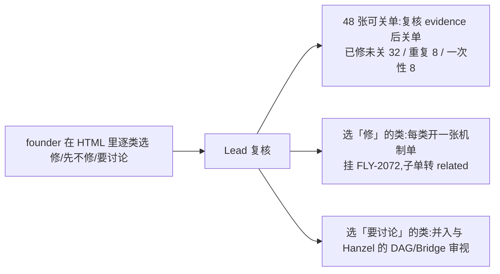

# FLY-2915 病根 Epic 待办盘点 — 实施计划(一类一修清单)
Issue: FLY-2915 (https://linear.app/geoforge3d/issue/FLY-2915/2072-盘点-病根-epic-下约-165-张待办逐张核实已修未关-重复-一次性记录-仍有效按病根类别归并并按出现次数排序产出给)
日期: 2026-09-25
基于: research.md

本单是只读盘点,**不含实现**。这里的「计划」就是交给 founder 拍板的「一类一修」清单,以及拍板之后由 Lead 执行的动作。
founder 版 HTML:`engineering/doc/FLY-2072-triage/founder-report.html`(托管 URL 见 PR 描述)。

## 1. 一类一修清单(按合计出现次数排序)

> 合计次数 = 类内「仍有效」各单次数之和,是巡检记账次数,不等于真实事故数(见 research.md「读数上容易被读强的地方」)。

| # | 类 | 张数 | 合计次数 | 最近 | 近7天仍出 | 病根 | 包含单 |
|---|---|---|---|---|---|---|---|
| 1 | K01 巡检「卡住/看不见」判据误报 | 9 | ×324 | 2026-09-26 | 6 | 看不见真相 | FLY-2114×289, FLY-2772×12, FLY-2666×10, FLY-2230×4, FLY-2117×3, FLY-2514×3, FLY-2297×1, FLY-2416×1, FLY-2820×1 |
| 2 | K02 体的生死有两份账:死体不终结、活体按窗口判死 | 9 | ×68 | 2026-09-23 | 3 | 恢复只认剧本 | FLY-2083×25, FLY-2537×16, FLY-2193×7, FLY-2474×7, FLY-2690×5, FLY-2512×4, FLY-2618×2, FLY-2528×1, FLY-2529×1 (并入:FLY-2710) |
| 3 | K10 读数、名册、页面与真相不符 | 8 | ×62 | 2026-09-25 | 4 | 看不见真相 | FLY-2418×49, FLY-2771×5, FLY-2705×2, FLY-2733×2, FLY-2292×1, FLY-2636×1, FLY-2686×1, FLY-2865×1 (并入:FLY-2629) |
| 4 | K03 重启和负载把系统自己打垮 | 6 | ×59 | 2026-09-26 | 3 | 恢复只认剧本 | FLY-2133×22, FLY-2617×19, FLY-2328×13, FLY-2620×3, FLY-2084×1, FLY-2323×1 |
| 5 | K04 Codex 体交卷/唤醒互锁 | 7 | ×54 | 2026-09-26 | 2 | 恢复只认剧本 | FLY-2373×34, FLY-2127×12, FLY-2502×3, FLY-2464×2, FLY-2480×1, FLY-2569×1, FLY-2905×1 |
| 6 | K05 返工投递状态机卡死 | 6 | ×46 | 2026-09-25 | 3 | 恢复只认剧本 | FLY-2330×24, FLY-2821×11, FLY-2185×5, FLY-2473×3, FLY-2202×2, FLY-2092×1 (并入:FLY-2472) |
| 7 | K06 Codex 体被错判死或被复活(引擎和 goal 各执一词) | 6 | ×43 | 2026-09-25 | 3 | 恢复只认剧本 | FLY-2586×24, FLY-2344×8, FLY-2814×5, FLY-2630×4, FLY-2689×1, FLY-2893×1 (并入:FLY-2462, FLY-2558, FLY-2572, FLY-2743) |
| 8 | K07 held / 回滚之后没有出口 | 9 | ×37 | 2026-09-23 | 2 | 恢复只认剧本 | FLY-2329×21, FLY-2295×6, FLY-2116×3, FLY-2524×2, FLY-2095×1, FLY-2181×1, FLY-2191×1, FLY-2525×1, FLY-2545×1 |
| 9 | K08 ship / land 收尾卡死 | 13 | ×36 | 2026-09-25 | 3 | 恢复只认剧本 | FLY-2110×7, FLY-2613×6, FLY-2091×5, FLY-2486×4, FLY-2098×3, FLY-2822×3, FLY-2470×2, FLY-2093×1, FLY-2246×1, FLY-2407×1, FLY-2732×1, FLY-2741×1, FLY-2890×1 |
| 10 | K09 信箱投递与签收 | 5 | ×25 | 2026-09-23 | 1 | 失败不喊 | FLY-2198×10, FLY-2123×5, FLY-2138×4, FLY-2513×3, FLY-2621×3 |
| 11 | K11 founder 决定卡的生命周期 | 8 | ×24 | 2026-09-24 | 1 | 失败不喊 | FLY-2087×8, FLY-2590×6, FLY-2378×3, FLY-2124×2, FLY-2267×2, FLY-2290×1, FLY-2568×1, FLY-2596×1 |
| 12 | K12 额度打满与切号 | 3 | ×22 | 2026-09-18 | 0 | 等待无界 | FLY-2371×14, FLY-2336×6, FLY-2109×2 (并入:FLY-2637) |
| 13 | K16 运维卫生与工具杂项 | 13 | ×21 | 2026-09-23 | 3 | 环境/杂项 | FLY-2714×4, FLY-2740×3, FLY-2374×2, FLY-2641×2, FLY-2739×2, FLY-2135×1, FLY-2322×1, FLY-2566×1, FLY-2599×1, FLY-2628×1, FLY-2635×1, FLY-2730×1, FLY-2823×1 |
| 14 | K13 替身接不了手(工作树) | 5 | ×18 | 2026-09-26 | 2 | 恢复只认剧本 | FLY-2510×8, FLY-2400×5, FLY-2192×3, FLY-2122×1, FLY-2463×1 |
| 15 | K14 评审与只读单流程 | 7 | ×17 | 2026-09-25 | 1 | 等待无界 | FLY-2186×8, FLY-2891×4, FLY-2196×1, FLY-2232×1, FLY-2511×1, FLY-2706×1, FLY-2707×1 |
| 16 | K15 测试房与生产隔离 | 4 | ×8 | 2026-09-26 | 2 | 环境/杂项 | FLY-2906×3, FLY-2469×2, FLY-2876×2, FLY-2716×1 |

### 1. K01 巡检「卡住/看不见」判据误报

- **修法方向(删什么)**:删掉从终端画面/派生时间戳推断「卡住、失联、看不见」的判据(STALLED_60M、continuity 未知、限额字样、心跳/last_activity 代理);停滞只由引擎账本(未答的门、TURN、节点状态)判定,推不出就不报。
- **改动面**:巡检快照脚本 STEP 2 约 6 条判据 + 节点行终态戳 1 处;只删不加

### 2. K02 体的生死有两份账:死体不终结、活体按窗口判死

- **修法方向(删什么)**:生死只认一个真源(进程/daemon 探活);删掉 parked / ship_parked / awaiting_review 这些「非终态停留」对死体的豁免,删掉 pane / tmux 窗口参与判生死的路径。死体一律当场终结,换体前置条件随之消失。
- **改动面**:StateStore 换体前置 + HeartbeatService zombie 判定 + CommDB 停驻声明,约 5–6 处;删状态为主

### 3. K10 读数、名册、页面与真相不符

- **修法方向(删什么)**:所有读数只从引擎单表派生:删掉只查 CommDB sessions 的归属判定、按「开出多久」的告警升级、死体遗留提问的常驻列表;Linear「重复」状态按终态处理。
- **改动面**:判决层归属 CTE + 投递告警阶梯 + Epic 固定页/ready.v1 + 容量传感器,约 6 处

### 4. K03 重启和负载把系统自己打垮

- **修法方向(删什么)**:删掉主循环卡顿自杀(137)与 250ms 起体排空判败;重启后不再重新认领审查作业、不再逐轮重审孤儿身份——认领或退休只做一次;内存手刹删锁存,读数恢复即松开。
- **改动面**:EventLoopGuard、起体子进程超时、审查作业接管、孤儿账本、pressure_hold,5 处

### 5. K04 Codex 体交卷/唤醒互锁

- **修法方向(删什么)**:删掉「中途延后门铃 / park_wake / drain challenge / 停驻续命」多道门:交卷只校验一次提交凭据,返工直接作为一次新 turn 注入目标体,注不进就判不可用走换体。
- **改动面**:completion drain + resident wake fence + phase keep-alive,约 4 处;删 3 类中间态

### 6. K05 返工投递状态机卡死

- **修法方向(删什么)**:返工投递收成两态(送达 / 失败交还 Lead);删 awaiting_receipt / needs_lead / replacement_pending 中间态;投给死体直接改投替身,不再把整条 run 打 held;交卷必须有新提交。
- **改动面**:rework delivery 状态机 + coordinator 重试/耗尽分支 + implement_done 验收,约 5 处

### 7. K06 Codex 体被错判死或被复活(引擎和 goal 各执一词)

- **修法方向(删什么)**:Codex 体生死只认引擎一侧:goal 以 blocked / 上游错误结束不等于死;引擎终结后 goal runtime 不得自续。删掉重启 reown 的「恢复提交 + 新开 turn」路径,重启只按原会话续接(即 FLY-2808 的续接开关转默认开、删旧路径)。
- **改动面**:codex-session-reown 恢复路径 + daemon adapter 终态分类点 + goal 自续,3–4 处

### 8. K07 held / 回滚之后没有出口

- **修法方向(删什么)**:删掉多种 hold 类型及各自的 resume 分支,只留一个统一恢复口(重派当前节点);放行必须真的铸出派发;complete 不先把会话翻终态;关死体不连带终结 run。
- **改动面**:StateStore hold 前置/resume 处理器 + complete 顺序 + carrier-close 级联,约 6–8 处;删状态最多的一类

### 9. K08 ship / land 收尾卡死

- **修法方向(删什么)**:收尾以「PR 已合入」为唯一完成真源,删掉「逐行封账 / 证明窗口已消失 / 工作树身份一致」等前置;旧 land 作业随新 head 自动作废;冲突解决后按内容沿用批准;policy_blocked 这类终态改为可重评。
- **改动面**:lifecycle-closeout 判据 + land 授权/作废 + 冲突基线,约 6 处

### 10. K09 信箱投递与签收

- **修法方向(删什么)**:收件资格只看进程是否已亡,删掉按会话状态秒退与「租约到期判死」;投递只剩「送出 / 签收」两态;check 如实回报已答 / 已作废 / 不存在;评审结论随节点走,不随体走。
- **改动面**:flywheel-comm recipient-resolve + mailbox 租约 + check 值域,约 4 处

### 11. K11 founder 决定卡的生命周期

- **修法方向(删什么)**:卡只绑 run 不绑提问的体:删掉「提问体一死卡就作废」「按体路由已答唤醒」两条路径;卡作废必须改写 Discord 原消息;两套「还没回复」提醒合成一套。
- **改动面**:gate holder 生命周期 + 已答唤醒路由 + 铸卡预检 + 提醒去重,约 5 处

### 12. K12 额度打满与切号

- **修法方向(删什么)**:额度打满 = 该号暂停派发、到点自动重臂;删掉「盲换替身」和「重试时间钉死在失败号重置时刻」两条路径;切号后在飞体统一按原会话重启到新号。
- **改动面**:引擎换体前额度判断 + 评审重试排程 + 切号广播,3 处

### 13. K16 运维卫生与工具杂项

- **修法方向(删什么)**:逐项小修,互不相关:CI flake、截图守护进程、flag 扫描时钟、CLI 先打印后写库、报告降级谎报送达、progress 重写吞手写段、注册回滚非原子、Lead 载体缺库、产物无清理、记忆接口假 404、语音诊断日志无上限、班车拉代码重试 3 秒、cmux 漏扫。
- **改动面**:13 处独立小改

### 14. K13 替身接不了手(工作树)

- **修法方向(删什么)**:替身不再原地复用死体的工作树:接管 = 从 PR 当前 head 新建工作树,死体未提交改动存成补丁;删掉 clean=false 拒绝分支与跨仓基线捕获。
- **改动面**:worktree takeover + rework base 捕获,2–3 处

### 15. K14 评审与只读单流程

- **修法方向(删什么)**:评审作业失败只保留一条自动重试路径;删掉给只读/无实现单注入 design_review 闸与 no_code 封存要求;交棒后的体失去写权限;外部仓单默认审产品仓 diff。
- **改动面**:review job 重试 + manifest 注入 + no_code 前置 + 写权限,约 5 处

### 16. K15 测试房与生产隔离

- **修法方向(删什么)**:测试房启动时环境变量改白名单(删掉继承),凭据不再软链到生产;语音房锁随会话结束释放。
- **改动面**:slot 启动 env + codex home 凭据 + 语音锁,3–4 处

## 2. 拍板后的执行(Lead)

1. **关单**:48 张的逐张证据在 `tickets.json`,Lead 复核后执行;本单不改任何 Linear 状态。
   特别处理:FLY-2892 等班车上线后再核;FLY-2518 仍是 In Progress,修复已并入 FLY-2517。
2. **每类一张机制单**:验收按 founder 8-26 口径 —— 数删掉了多少状态和路径,不看加了多少保护。
3. **K02 / K06 与 FLY-2808 的关系**:#1299 的续接开关默认关;若 founder 选修 K06,第一步应是评估把该开关转默认开并删除旧 reown 路径,而不是另起一套。
4. **K01 优先级提示**:它次数最高但伤害主要是噪声(巡检误报 + 每轮记账);修它能立刻让巡检记账和 Lead 注意力降噪,改动面也最小(只删判据)。

## 3. 本单不做

- 不关单、不改状态、不建单(结论由 Lead 复核后执行)。
- 不给出每类的详细实现方案 —— founder 选「修」之后在各自机制单里出。
