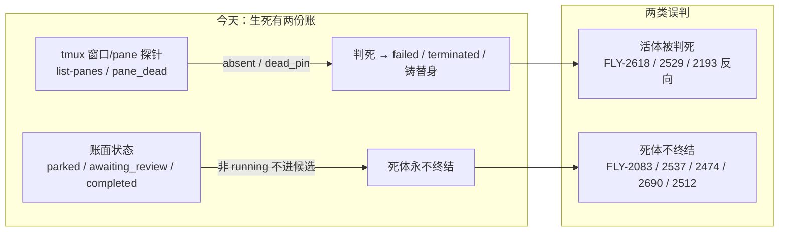

# FLY-2919 进程生死单一真源 — 探索
Issue: FLY-2919 (https://linear.app/geoforge3d/issue/FLY-2919/病根修复-2-体的生死只认一个真源死体当场终结活体不再按窗口判死9-张-68)
日期: 2026-09-28
基于: 无

状态: 方向已由 founder 于 2026-09-25 定为「修」（FLY-2915 盘点第 2 类），本节点不重开 brainstorm；本文只核对方向在**本 checkout** 上的落点。

## 0. 本轮基线与上游差异（必读）

| 项 | 本 checkout | 上游分支 `origin/flywheel-FLY-2919` |
|---|---|---|
| 树 | 沙箱 `origin/main` = `1855f7a1a`（≈ 上游 2026-08-31）+ 1 个 progress 提交 | 头 `d54df3bb8`，含 APPROVED 设计（gate `f4e94872`）与已实现代码（PR #1379） |
| StateStore.ts 行数 | 12,783 | 约 61,000 |
| 本树**不存在**的模块 | `workflow-engine-dispatcher`、`execution-mutation-lease`、`generalized-launch-recovery`、`run-quiescence`、`codex-execution-ownership`、`pane-loss-reconcile`、`execution-closeout-evidence`、`patrol-process-liveness`、`state-store-ghost-reconcile`、`delivery-operations`、CodexSessionReowner（FLY-2211）、standby/retirement（FLY-2808）、restartGate/codex-terminal-sweep（FLY-2903）、resident probe（FLY-2478） | 均存在 |
| 本树**存在**且本单要改的 | `HeartbeatService.ts`、`StateStore.ts`、`bridge/tmux-lookup.ts`、`crash-reaper.ts`、`zombie-scan.ts`、`commdb-session-prune.ts`、`commdb-fsm-reconcile.ts`、`complete-marker-reconciler.ts`、`started-evidence.ts`、`phase-orchestrator.ts`、`codex-phase-shutdown.ts`、`done-thread-reconcile.ts`、`lifecycle-closeout.ts`、`server-loss.ts`、`stale-blocker-guard.ts`、`claude-runner/src/TmuxAdapter.ts`、`codex-daemon-runtime.ts`、`config/src/feature-flags/registry.ts` | 同名文件均存在但已演进 |

结论：上游已批准的架构（**一个进程证据契约 + 消费者收敛**）原样采用；上游 plan 中依赖不存在模块的条款，在本树按「等价落点」改写并在 plan §0 逐条标注。已用非阻塞 ask（`337003ef`）知会 Lead，未回复前按此推进。

## 1. 给 founder 的一句话

**体（一个正在替某张 issue 干活的 Claude/Codex 进程）是否还活着，只问它自己的进程；tmux 窗口只是看它的入口，parked / awaiting_review 这类「停驻」只是工作安排，二者都不能替进程作生死决定。**

- 进程已证死 → 当次巡检就终结该体、结清通信账（CommDB 里的 running 投影与 parked 声明），不再等停驻超时、不再豁免。
- 进程活着但窗口不在 → 保留体与写入资格，只报告「窗口缺失」这个展示缺陷。
- 读不到进程证据（超时、权限、身份不符）→ 报「无法确认」，既不判死也不铸替身。

「当场」= 第一次拿到当前身份的可靠死亡证据的那一轮处理；不承诺进程退出与巡检之间零延迟（采样节奏见 plan §4.3 的延迟上界）。

## 2. 今天的病根：两份账

审计事实（file:line 以本 checkout 为准，详见 research.md）：

1. **没有任何死亡路径直接看进程。** `tmux-lookup.ts` 的 `probeRunnerProcessLiveness`（:371）名为「进程」，实际只读 `#{pane_dead}`；`isTmuxWindowAlive`/`probeTmuxWindowLiveness` 只看窗口是否存在。整个 teamlead 里只有 Codex daemon 锁回收（`codex-daemon-runtime.ts:798`）与 fleet/review lease 用过 `kill(pid,0)`。
2. **窗口缺失 = 死。** `HeartbeatService.isSessionTmuxAlive`（:921-948）把 `absent`/`gone` 当死，`reapOrphans`（:1753）随后 `applyTransition → failed`，且不做任何清理，留下活进程。这正是 2026-09-26 05:3xZ FLY-2910/2911/2901 的现场：Bridge 崩溃时 tmux 窗口没建出来，僵尸探测按「pane 探针不在」把活体强制 failed。
3. **非 running 状态结构性豁免。** `getOrphanSessions`/`getStuckSessions`（StateStore :4005、:3624）只查 `status='running'`。`awaiting_review`/`approved_to_ship`/`design_done` 里的死体永远不进候选；`checkAwaitingReviewTimeout`（:491-554）48 小时后只发 `gate_timed_out` 并明言「NOT killed」；FLY-1204 parked 巡检对非终态 parked 候选只告警（:1466）。
4. **换体前置卡在账面。** `getActiveSessions`（StateStore :3221）把 `running/awaiting_review/approved_to_ship` 都算活，retry 前置要求无 active（actions.ts :696）；死体停在 awaiting_review 就永远铸不出替身。`started-evidence.ts`（:53-90）又用窗口存在与否决定「已启动」，活体无窗被 re-dispatch，dead-pin 窗被当已启动。
5. **窗口存在 = 活。** `isTmuxWindowAlive` 对 `remain-on-exit` 留下的死 pane 仍返回 true；`commdb-fsm-reconcile`/`commdb-session-prune`/`lifecycle-sweep` 都等「窗口死」才动。
6. **完成 marker 与死亡的先后不严格。** `crash-reaper` 跳过 `hasPendingCompleteMarker`（:190），但 `reapOrphans` 只跳 `markerRetryPending`，`complete-marker-reconciler` 启动扫（:706-731）在 `isTmuxWindowAlive=false` 时直接 quarantine → failed。真实完成的工作有被判死的窗口。

## 3. 选项比较

| 选项 | 结果 | 决定 |
|---|---|---|
| A. 窗口缺失多探一次再判死 | 仍把展示资源当生命权威；FLY-2618 场景（窗口从未建出、daemon 活着）无论探几次都错 | 拒绝 |
| B. 账面终态 / 停驻直接视为死 | 在活进程旁造替身，写入冲突；破坏等审与正常停驻 | 拒绝 |
| C. 全删 parked / awaiting_review 枚举 | 破坏 review gate、route、TURN、founder wake | 拒绝 |
| D. 每个消费者各自补一段 PID 判断 | 判据仍多份、竞态与漂移不消失（今天就是这样病的） | 拒绝 |
| **E. 一个进程证据契约（BodyObservation）+ 所有致死消费者收敛到它；窗口探针降级为「展示观察」** | 两种反向场景都能解释；业务状态语义保留；删的是「豁免」与「窗口参与生死」的分支 | **采用** |

## 4. 采用方向的边界

**做：**
- 新增 `packages/claude-runner/src/execution-process-liveness.ts`（两载体底层探针）与 `packages/teamlead/src/bridge/execution-body-liveness.ts`（组装 StateStore 身份，产出 `BodyObservation{alive|dead|unknown}`）。
- 启动时登记真实进程绑定（pid + 进程开始时间 + host boot id + executionId + generation），Bridge 独立核验后存 StateStore；不靠 `ps` argv / 进程标题识别 Claude。
- 删除：Heartbeat 的 parked 死亡豁免；`absent`/`gone`/`dead_pin` → 死的映射；`status='running'` 才进死亡候选的前置；换体「必须账面终态」的前置；commdb reconcile 的 window-first + parked veto；complete-marker 启动扫的「无窗即 failed」；started-evidence 的「无窗即未启动」。
- 不变式 **marker-before-death**：任何执行有待处理 complete marker 时，先对账完成，不得当场记 failed 换体。
- 运行时开关（feature registry 登记）：关闭时死亡授权消费者只观察、报 unknown，不写 failed。

**不做：**
- 不改 Bridge 崩溃本身、不重构调度、不重写全部告警、不清生产库、不自动关闭九张 Linear 单、不合并部署。
- 不删 parked / awaiting_review / approved_to_ship 业务枚举、review gate、TURN、founder wake。
- 铸替身的协调归 FLY-2921；本单只提供「可靠死亡真值 + 换体前置消失」。
- 上游存在而本树没有的 FLY-2211 reown / FLY-2808 standby / FLY-2903 restartGate / FLY-2478 resident：本树无对应代码，相关 Lead 义务在 plan §0 标为「本树不适用，留接口约束」。

## 5. 假设（显式列出，供 Lead 否决）

1. 本房实现节点在**本 checkout** 上实现，不先把上游 2,760 个提交合进来。
2. 生产必须有可见 TUI 窗口的产品要求不变；窗口缺失是要修的展示缺陷，只是不再参与生死。
3. 采样节奏独立于 5 分钟 heartbeat：本树 `HeartbeatService.check()` 每 `TEAMLEAD_STUCK_INTERVAL`（默认 300 s）一轮；死亡采样加挂在同一轮但有独立预算（plan §4.3），延迟上界 = 一个 tick + 5 s 探测窗口。
4. 529 真机（Discord N-to-N）由 QA 节点按 `.flywheel/agents/nodes/qa.md` 自起房验证；设计节点不做故障注入。
