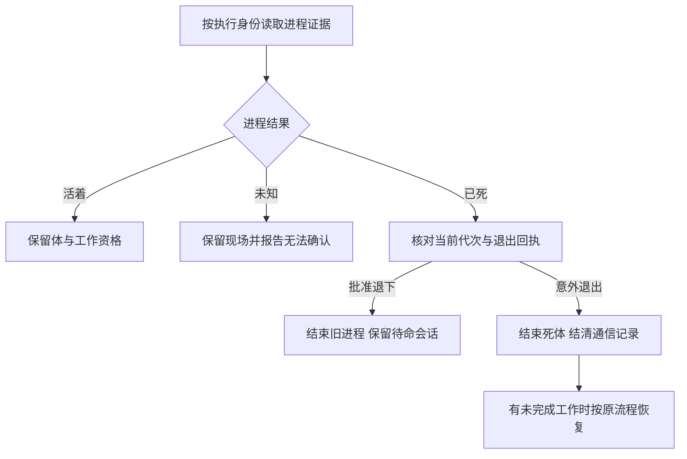

# FLY-2919 进程生死单一真源 — 探索
Issue: FLY-2919 (https://linear.app/geoforge3d/issue/FLY-2919/病根修复-2-体的生死只认一个真源死体当场终结活体不再按窗口判死9-张-68)
日期: 2026-09-26
基于: 无

状态: 已选方向；依据本轮任务明确的 founder 决策续稿，不重新请求 brainstorm。

## 1. 给 founder 的说明

**一句话：体是否还活着只问它自己的进程；窗口只是观察入口，停驻只是工作安排，二者都不能替进程作生死决定。**

本单覆盖盘点 K02 的全部九张单、68 次记录。进程已证死时，当次处理就结束该物理体、结清通信投影；仍需工作时才按原工作流恢复。进程活着但窗口丢失时保留工作与写入资格，并显式报告窗口缺失；保留 founder 可见窗口的产品要求。读取进程证据失败时显示“无法确认”，不能判死或造第二个写入者。

“当场”指第一次取得当前身份的可靠死亡证据的处理轮次，不再等停驻超时、两次缺窗或人工改账；不承诺进程退出与巡检之间零毫秒。后台清理窗口失败不能反过来让死体继续显示正在运行。

进程代次是同一执行身份第几次实际启动，用来避免旧进程的迟到消息关掉新进程。完成回执是控制器已经接受交卷的记录，进程退出本身不是交卷。

## 2. 范围、选择与相邻设计

选用“一个进程证据接口 + 六组消费者收敛”。不选“给 pane 缺失多加一次确认”：仍会双向误判；不选“账面终态就当物理死亡”：会在活进程旁造替身；不选“全删业务等待状态”：会破坏等审与正常待命恢复。

删除的是 parked / ship_parked / awaiting_review **对意外证死体的生死豁免**，以及窗口参与生死的分支；不全局删除这些业务枚举、review gate、route、TURN 或历史事件。TURN 是工作树写入权，不能因窗口消失转交。

基线已经含 FLY-2808（`a084f3a99`）的 controller-approved retiring → standby → resume。standby 指已批准退下、可按原会话恢复；它证明旧物理代次结束，不伪称进程还活着。本单不打开默认关闭的 standby flag，也不改变已有 snapshot 的入组规则。仅有 parked 自报不是批准退下回执。

FLY-2903 PR #1343 已于 2026-09-26T15:15:00Z 合并，merge SHA `cfc8d52d81ed0f4f2a0d79bc3825ae22107a4bba`（本轮 gh 与 git show 核验）。当前设计分支尚不含该提交；实现开工先同步并复用 stop-owner-before-reap、runtime drained 与 closeRunner/controller 回收原语，补本单进程判据、正常重启与跨库负控，不另造回收器。合并不证明已部署，不可将 FLY-2512/2690 验收划掉。

已通过非阻塞问题向 Lead 报告两项差异：九单实际横跨超过 5–6 个文件；K02 快照里“终态直接视死”和“全删 completion_receipt_missing”不能直接照做。原任务的九单验收与单一物理真源优先。问题 ID：`2c84cc0d-af3c-43c0-91ad-6363e170589d`、`2909bd8f-dcfb-4351-9bdf-5ecb31872e5e`。

不涉及：Bridge 崩溃原因、全局调度重构、全部告警重写、生产清库、自动关闭九张 Linear 单、合并部署。涉及单由 Lead 在合入后逐张复核关闭。

## 续跑与范围核对

原执行 416169c3-8d61-4fc1-b20a-3e2263115f31 已留下设计，7520e274b 保存了最后修订。本轮执行 1b78af3a-1a6f-4ee1-8061-a92d4e8338df 在同一分支续接；full DOC-FLOW 要求单独探索、调研、计划，故从保留内容提取并补齐，不重开已定方向。

首要反例是 2026-09-26 05:3xZ 报告的 FLY-2910/2911/2901：窗口未建不等于 daemon 已死。逆向反例是窗口残留、worker 已死；两者必须使用同一进程身份判据。正常控制器重启 daemon 的空窗属于第三种情况，不能通过取消正常重启解决误判。

选项比较：

| 选项 | 结果 | 决定 |
|---|---|---|
| 窗口缺失多探一次 | 仍把展示资源当生命权威 | 拒绝 |
| 全删等待状态 | 破坏审查、交卷与已批准待命 | 拒绝 |
| 进程绑定与统一观测，收敛现有消费者 | 可解释两种反向场景，保留工作流语义 | 采用 |
| 每个消费者各补 PID 判断 | 继续存在多份判据与竞态 | 拒绝 |

不把原 brief 的“约 5–6 处”当成可漏掉消费者的上限；实现按六组现有职责收敛，九单验收保持完整。关于范围与历史盘点表的差异已问 Lead，问题仍未回复时依任务的完整验收与精确死亡证据约束推进。
