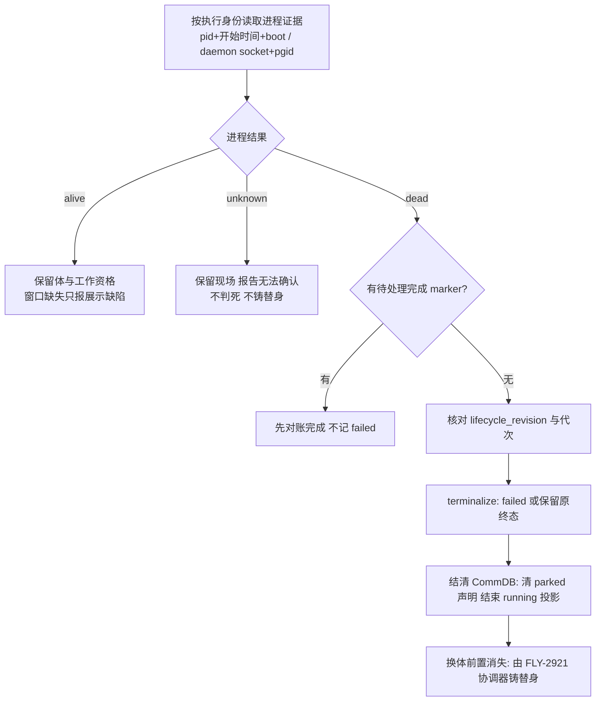

# FLY-2919 进程生死单一真源 — 实施计划
Issue: FLY-2919 (https://linear.app/geoforge3d/issue/FLY-2919/病根修复-2-体的生死只认一个真源死体当场终结活体不再按窗口判死9-张-68)
日期: 2026-09-28
基于: research.md

状态: draft v2（吸收两轮独立预审后，待本轮 design_review 有效 verdict；见 §11）
审计基线: 本 checkout `1855f7a1a`（沙箱 main）。上游 `origin/flywheel-FLY-2919` 的 APPROVED 设计（gate `f4e94872`）作为架构来源；本计划是它在本树的等价落点，不是照抄。

## 0. 本树落点与 Lead 义务对照

本树没有上游的 dispatcher / mutation lease / reowner / standby / restartGate / resident 模块（research.md §0、§8）。上游 plan 中依赖这些模块的条款按下表处理，实现交卷报告须逐条引用本表：

| Lead 义务 | 本树处置 | 证据位置（本 plan） |
|---|---|---|
| HIGH death-before-pending-complete-marker | **不变式 I-1**：唯一收敛入口第一步查 marker，未 settled 不写 failed；其它写入者全部删除（I-5） | §5 步 1、§6 B 红测 b1、b-guard |
| codex-reown-revive-precedence | 本树无 reowner；契约保留 `reason: "recovery_active"`，Codex 探针在 goal-runtime 重启窗口（持久化 `restartStartedAt`，TTL 120 s）内返回 unknown | §4.2、§6 A 红测 a4 |
| obligation-replay-evidence-expiry | 义务重放**幂等查找先于过期检查**；重放不重新采样 | §5 步 6、§6 C 红测 c2 |
| lease-contention-refuses-normal-restart | 本树无 lease；采样在事务外，事务只做 `lifecycle_revision` 同步 CAS，CAS 失败重采样不 stop | §5 步 2、§6 C 红测 c3 |
| no-runtime-kill-switch | `body_death_authority` 登记 feature registry | §4.4 |
| consumer-inventory-direct-importers | research.md 附录 A 全表；started-evidence / worktree-reconciler / lifecycle-sweep 纳入 B/F | §6 |
| fly2903-sweep-and-restart-gate-unmapped | 本树无 restartGate/sweep；Codex 探针 ledger-first + 持久化重启标记 | §4.2 |
| claude-process-title-identity | pid + `ps -o lstart=` 原文 + boottime sec；exe 路径只作记录，不作判据 | §4.1 |
| standby-retirement-window-proof | 本树无 FLY-2808；收敛入口预留 `approvedRetirement` 输入，不记 failed | §5 步 2 |
| probe-cadence-heartbeat-5min | running 每 tick 全采；非 running 池 ≤ 8/轮；延迟上界写入验收 | §4.3 |
| LOW（founder-wake-successor-handoff / tests_not_run） | §9 Follow-ups | §9 |

## 1. 给 founder 的说明

**一句话：体是否还活着只问它自己的进程；窗口只是观察入口，停驻只是工作安排，二者都不能替进程作生死决定。**



进程代次（generation）= 同一执行身份第几次实际启动，用来防止旧进程的迟到消息关掉新进程。完成 marker = Runner 交卷时写下的回执文件，进程退出本身不是交卷。

## 2. 范围：删什么、留什么

**删除（实现提交中逐项附最终符号与行号）：**
1. Heartbeat `isSessionTmuxAlive` 把 `absent/gone/dead_pin` 当死；tmux 存在算心跳（`updateHeartbeat`）。
2. 死亡候选只查 `status='running'` 的前置（`getOrphanSessions` / `crash-reaper` 候选）。
3. `checkStaleParkedPhases` 对非终态 parked 候选的「只告警」豁免——**限已证死**的候选。
4. `getActiveSessions` 把死在 `awaiting_review/approved_to_ship` 的体算活 → 堵 retry（死体落 failed 后自然消失，不改该查询本身）。
5. `started-evidence` 「窗口存在 = 已启动 / 窗口不存在 = 未启动」。
6. `complete-marker-reconciler` 启动扫「无窗即 quarantine → failed」。
7. `server-loss` `targetGone` 由窗口缺失直接 failed。
8. `codex-phase-shutdown` 的 `absent/dead_pin → direct` 绕过协作关停。
9. `done-thread-reconcile` / `lifecycle-closeout` 用窗口缺失当 `confirmedGone`。
10. `commdb-fsm-reconcile` / `commdb-session-prune` 用窗口死作删行授权。
11. `phase-orchestrator` park-or-close / wake-vs-spawn / ghostGuard 用 pane 探针。
12. `TmuxAdapter.waitForCompletion` 「pane 消失 = 正常完成 success:true」。
13. **所有旁路死亡写入者**：`reapOrphans`（trigger `orphan_reap`）、server-loss `migrate`（`server_loss`）、crash-reaper 自己的 `applyTransition(terminated)`（`crash_reap`）、complete-marker 启动扫的「无窗 quarantine」——全部改为调用唯一收敛入口（I-5）。
14. feature registry `liveness_pane_dead` 条目与其唯一读点 `HeartbeatService.ts` `FLYWHEEL_LIVENESS_PANE_DEAD` **一起删除**（drift 测试双向一致）。

**保留：** `parked/long_task` 声明枚举与 CLI；`awaiting_review/approved_to_ship/design_done` 状态；review gate、`gate_timed_out`、TURN（死体的 TURN 行**不删**，见 §5 步 5）、founder wake；FLY-1204 parked 巡检对**活**体的告警语义；crash-reaper 的宽限期与 scrollback 取证（作为收敛入口的前置步骤保留）；窗口查找与清理（`killTmuxWindow`、tab reaper、scan-stale）；生产必须有可见 TUI 的产品要求；`admitWorkflowExecution` 不动；complete-marker 路由本身写 failed 的 **marker 授权**（那不是窗口证据）。

**不做：** 铸替身协调（FLY-2921）；Bridge 崩溃根因；全局告警重写；生产清库；自动关九张单；部署。不得把 `ZOMBIE_IRREVERSIBLE_TERMINAL_STATUSES` 加上 awaiting_review 草草了事。

## 3. 数据模型

### 3.1 StateStore 新表 `execution_process_binding`（幂等 `CREATE TABLE IF NOT EXISTS`，沿用 StateStore 构造器现有迁移模式）

| 列 | 类型 | 说明 |
|---|---|---|
| `execution_id` | TEXT PK | 执行身份 |
| `generation` | INTEGER NOT NULL CHECK(>=1) | 逻辑代次；每次真实启动 +1 |
| `adapter` | TEXT NOT NULL CHECK IN ('claude-tmux','codex-tmux','kimi-tmux','antigravity-tmux') | 载体（与各 adapter `type` 字面一致） |
| `pid` | INTEGER NULL CHECK(pid>1) | Claude/Kimi/Antigravity: worker pid；Codex: NULL |
| `proc_start` | TEXT NULL | `ps -o lstart=` **原文**（ctime 格式，1 s 分辨率；不转 ISO，避免时区往返错误） |
| `host_boot_sec` | INTEGER NOT NULL | `sysctl -n kern.boottime` 的 `sec` 整数 |
| `exe_path` | TEXT NULL | `lsof -p pid -a -d txt -Fn` 首个非系统库路径；**仅记录/诊断，不作登记或探测判据**（Kimi 是 node 脚本、npm 装的 claude 也是，基名永远对不上） |
| `daemon_pgid` | INTEGER NULL | Codex: session.json `daemonPid` 的 pgid（`ps -o pgid=`） |
| `spawn_epoch` | INTEGER NOT NULL DEFAULT 0 | Codex: 本代次内 daemon 第几次启动（初启=1，每次同线程重启 +1） |
| `binding_digest` | TEXT NOT NULL | 以上身份字段的 sha256，事务 CAS 用 |
| `accepted_at` | TEXT NOT NULL | Bridge 核验通过时间 |
| `lifecycle_revision_at_accept` | INTEGER NOT NULL | 接纳时 sessions.lifecycle_revision |

只记身份，**不存 alive/dead**。参数化写入；所有来自 tmux/ps/lsof/session.json 的字符串在边界校验（长度 ≤ 256、pid/pgid 正整数、路径为绝对路径且非软链）。

**写入者：** Claude/Kimi/Antigravity 由 `TmuxAdapter.launch` 经注入回调 `onProcessBinding(binding)` 写入（§4.1）；Codex 由 `CodexTmuxAdapter` 在 `codex-daemon-goal-runtime` 每次 `startSession` 成功后经注入回调 `onDaemonSpawned({pid,pgid,spawnEpoch})` 写入（初启与每次重启都写，`spawn_epoch` 递增；§4.2）。Bridge 侧统一落 `StateStore.acceptProcessBinding`。

### 3.2 StateStore 新事件 `body_death_obligation`（写入现有 `session_events` 表，`event_id` UNIQUE + `INSERT OR IGNORE`，无新表）

幂等键 `event_id = body_death:<execution_id>:<generation>`。载荷：`observation`（§4 契约）、`prior_status`、`target_status`（`failed`）、`tmux_target`（CommDB `tmux_window` 快照，供窗口清理重试与 retry 的 `closeRunner` 使用——CommDB 行删除后这里是唯一来源）、`daemon_pgid`、`physical_cleanup_done_at NULL`、`commdb_projected_at NULL`。两个 NULL 字段由后续步骤回写；启动与每 tick 重放未完成的义务。

### 3.3 CommDB 不新增 CHECK 枚举
本树 CommDB `sessions.status CHECK IN ('running','completed','timeout')`——**没有 failed**，所以死亡投影不是改状态而是**结束投影**：复用 `finalizeSession(executionId)`（`db.ts:1588`，删 sessions 行 + 清 phase wakes/shutdown controls + 消息结账）与 `clearDeclaredState`（:1316）。新增 `finalizeProvenDeadSession({executionId, obligationId, generation, expectedTmuxWindow|null})`：同事务内校验行存在且（若有）`tmux_window` 与义务快照一致，清声明 + finalize，写幂等回执 `body_death_receipts(obligation_id PK, execution_id, finalized_at)`（唯一 CommDB 新表，`CREATE TABLE IF NOT EXISTS`）。`commdb-fsm-reconcile.ts` 头部「failed 行永不删除（retry 要读 tmux target）」的契约随之更新：**证死的行可删，tmux target 由义务载荷提供**。

## 4. 单一证据契约

新增 `packages/claude-runner/src/execution-process-liveness.ts`（两载体底层）与 `packages/teamlead/src/bridge/execution-body-liveness.ts`（组装 StateStore 身份）。**仅 Bridge/adapter 内部调用，不新增 Runner 可提交 `dead=true` 的 HTTP/CLI 入口。**

```ts
export type BodyIdentity = {
  executionId: string;
  generation: number;
  lifecycleRevision: number;
  adapter: "codex-tmux" | "claude-tmux" | "kimi-tmux" | "antigravity-tmux";
};
export type BodyVerdict = "alive" | "dead" | "unknown";
export type BodyReason =
  | "process_alive" | "daemon_alive"
  | "process_gone" | "daemon_gone"
  | "no_binding" | "binding_mismatch" | "probe_timeout" | "probe_error" | "writers_remaining"
  | "recovery_active" | "authority_disabled" | "pending_complete_marker";
export type BodyObservation = {
  identity: BodyIdentity;
  verdict: BodyVerdict;
  reason: BodyReason;
  observedAt: string;   // ISO
  expiresAt: string;    // observedAt + 10 s
  bindingDigest: string;
  windowState: "present" | "absent" | "dead_pane" | "indeterminate"; // 展示字段，不参与 verdict
};
```

**性质（必测）：** 对同一 `(identity, 进程状态)`，`windowState` 取任意值时 `verdict` 不变。让旧 pane 实现跑同一 fixture，必须出现反例。

### 4.1 Claude / Kimi / Antigravity 绑定与探测
- **登记时机（bind-before-commit）：** `TmuxAdapter.launch` 在 `tmux new-window -P -F '#{window_id}'` 成功后**立即**（在写 gated commit 文件之前、在 `onTmuxWindowCreated` 之前）`tmux display -p -t <window_id> '#{pane_pid}'` 取 pid，`ps -o lstart= -p pid`、`sysctl -n kern.boottime`，经 `onProcessBinding` 持久化。已在本机 tmux 3.7c 实测：直接路径 pane_pid = worker；gated 路径 `sh` 经 `exec` 接管同一 pid，`lstart` 跨 exec 不变；显式命令下 `default-command` 不会插壳。因此绑定对两条路径都成立，且先于 commit 落盘意味着「commit 写了、绑定没写」的崩溃窗口不存在（gated shell 自灭时探针读到 dead，replay 按 §5 处理）。
- **exe 核对只是记录**：commit 释放后重采一次 `lsof -p pid -a -d txt -Fn` 存入 `exe_path`；**不**以基名比对作为登记/启动失败条件。唯一硬失败：gated 路径 commit 写后 3 × 200 ms 仍是 `sh`（说明 exec 没发生）→ 杀窗、启动失败。
- **探测：** `kill(pid, 0)` 存在 → `ps -o lstart= -p pid` 原文与绑定逐字一致 → alive；`ESRCH` 或 lstart 不一致（pid 复用；`remain-on-exit` 死 pane 的 `pane_pid` 仍是旧值，这一比对是承重的）→ dead；`EPERM`/超时/解析失败 → unknown。**不读 argv、不读进程标题。**
- **writer 集合：** worker 退出但同进程组仍有子进程（MCP server、dev server）时返回 `unknown(writers_remaining)`，走现有 `runner-teardown.ts` 的 pane_pid 子树回收后重探；viewer/tail 进程不算 writer。
- **旧运行迁移：** 没有绑定的存活 Claude 由 `tmux_window → pane_pid → lstart` 补采，且 pane 命令基名 = `binaryName` 或其 shebang 解释器才接纳（唯一匹配）；补采失败 → `unknown(no_binding)`，进「待收体清单」告警，不判死。

### 4.2 Codex 绑定与探测（ledger-first）
- 复用 `codex-daemon-runtime.ts` 现有 `defaultIsSocketLive`、`defaultSocketHolderPids`（`lsof -t`）、`defaultProcessGroupOf`（`ps -o pgid=`）（:685-716）抽成导出 `probeCodexDaemonEvidence(executionId)`。**ledger（`~/.flywheel/state/codex-sessions/<execId>/session.json`）是身份来源**，不依赖 Bridge 内存里有没有 goal-runtime handle（daemon `detached: true`，Bridge 重启后 handle 必然缺失——这正是事故语境，不能因此永远 unknown）。
- 判定：`socketLive && holderPgid === ledgerPgid` → alive；`!socketLive && kill(-pgid,0)=ESRCH && 无有效重启标记` → dead；其余 unknown。
- **重启窗口（Lead 义务 fly2903 / reown 本树落点）：** `CodexDaemonGoalRuntime.killSession()` 前把 `restartStartedAt=<ISO>` 与 `restarts` 写进 session.json；`startSession()` 成功并写新 `daemonPid` 后清除 `restartStartedAt` 并经 `onDaemonSpawned` 写新绑定（`spawn_epoch+1`）。探针读到 `restartStartedAt` 且距今 < 120 s → `unknown(recovery_active)`；超过 120 s 的陈旧标记不再抑制 dead（防止崩在重启中途的 daemon 永远 unknown）；`restarts >= maxRestarts` 且 socket 死 → 直接 dead。
- 死亡事务前重核 ledger 的 `spawn_epoch` 与绑定一致；不一致 → 放弃本次、重采样。

### 4.3 采样节奏与预算（Lead 义务 probe-cadence；防 running 饿死）
- 采样挂在 `HeartbeatService.check()` 每 tick 之首，两个池：
  - **running 池：每 tick 全部采样，不设条数上限**（Claude 探针是 `kill -0` + 一次 `ps`，毫秒级；Codex 是 socket connect + `lsof`，百毫秒级），并发 4、总窗口 5 s；超窗未完成的顺延下一 tick 并在下一 tick 优先。
  - **非 running 池**（`awaiting_review ∪ approved_to_ship ∪ design_done ∪ getParkedPhaseCandidates()`）：每轮 ≤ 8、并发 2，稳定游标（`execution_id` 升序、上轮末尾续）跨轮公平；显式 terminate / rework / marker 待办优先插队。
- 单次探测超时 5 s；超时任务可取消并等待子进程回收，不用 `Promise.race` 遗留后台探针。
- 同 `(execution, generation)` 的在途 Promise 共享；证据有效期 10 s；进事务前重核 `lifecycle_revision` 与 `bindingDigest`。
- **延迟上界（验收写入）：** running 体：进程退出 → 判死 ≤ `TEAMLEAD_STUCK_INTERVAL`（默认 300 s）+ 5 s。非 running 体：≤ tick × ⌈池大小 / 8⌉ + 5 s，池大小在 scan-stale DTO 里可见。529 用 `TEAMLEAD_STUCK_INTERVAL=30000` 验证 running 体 ≤ 35 s。
- 心跳/信箱活跃时间只作诊断与排程，不覆盖当前代次的可靠死亡证据。

### 4.4 运行时开关
`packages/config/src/feature-flags/registry.ts` 新增：
```ts
{ name: "body_death_authority", category: "feature", source: "env", scope: "bridge_global",
  envVar: "FLYWHEEL_BODY_DEATH_AUTHORITY", polarity: "default_on", valueKind: "bool", default: true,
  description: "进程证据作为 Runner 生死唯一授权；=0 时致死消费者只观察/报 unknown",
  readSites: [envSite("packages/teamlead/src/bridge/execution-body-liveness.ts", "observeBody", "call_time")],
  toggleable: "direct", directToggleProof: "resolve.direct-toggle.test:body_death_authority live-observe" }
```
`=0` 时 `observeBody` 返回 `unknown(authority_disabled)`；所有致死消费者对 unknown 一律不写 failed/terminated、不删 CommDB 行、不铸替身、只告警。`liveness_pane_dead` 条目与 `HeartbeatService.ts:923` 的读点**一起删除**（registry 的 `dormant` 只给 ConfigLoader 项目配置用，且要求 readonly，不能套在 env 旗标上）。三条 registry 测试必须过。

## 5. 死亡收敛顺序（唯一入口 `convergeProvenDeadExecution`，落 `packages/teamlead/src/bridge/execution-body-convergence.ts`；StateStore 新公共方法 `terminalizeProvenDeadSessionTx`）

**不变式：**
- **I-1 marker-before-death**：有待处理 complete marker 的执行，先 `tryReconcileComplete`，未 settled → `deferred(pending_complete_marker)`，不写 failed，不铸替身。
- **I-2 单一授权**：只有 `BodyObservation.verdict === "dead"` 且未过期、`bindingDigest` 与 `lifecycle_revision` 与采样时一致，才允许写 failed。
- **I-3 窗口不授权**：`windowState` 不出现在任何写路径的条件里。
- **I-4 unknown 零副作用**：unknown 只产生告警与「待收体清单」。
- **I-5 单一写入者**：body-death 终态只由 `terminalizeProvenDeadSessionTx` 写，trigger 固定 `body_death`；`reapOrphans`、server-loss `migrate`、crash-reaper、complete-marker 启动扫都改为调用收敛入口。守卫测试（b-guard）用源码扫描断言 `packages/teamlead/src` 不再存在 trigger 为 `orphan_reap|server_loss|crash_reap` 的 `applyTransition(..., "failed"|"terminated")`。

**FSM 边（`packages/core/src/workflow-fsm.ts`）：** 现表 `awaiting_review` 无 `failed` 边（只有 approved_to_ship/completed/rejected/deferred/shelved/terminated），`approved_to_ship` 与 `design_done` 已有 `failed`。**新增 `awaiting_review → failed`**，并在两处 FSM 实例（`plugin.ts:2957`、`:3415`）注册 guard `"awaiting_review → failed": ctx => ctx.trigger === "body_death"`，其它调用者不获得该边。`pending` 不进死亡范围（pending 体没有绑定，永远不可能 dead）。`packages/core/src/__tests__` 加边测试。

**步骤：**
1. 采样（事务外，§4.3）→ 若 `hasPendingCompleteMarker(execId)` → I-1 处理并返回。
2. 打开 StateStore 事务：读 `sessions` 行；`lifecycle_revision` ≠ 采样时 → 放弃、重采样（不是 stop）。分支：
   - 入参含 `approvedRetirement`（本树暂无生产者，接口预留）→ 不记 failed，只关闭代次。
   - 已是不可逆终态（`completed/failed/terminated/blocked/rejected`）→ 保留原终态，只补物理终结记录（FLY-2512 的终态活体在此之前已走协作关停，见下）。
   - `design_done`：**仅当 `keepAliveEnabled()` 为 true**（parked-forever 模型，体理应活着）才致死；keep-alive OFF 时 `design_done` + 死体是 `phase-orchestrator.reconcileOnStartup`（:589-625）要用的合法交接残留，**不转 failed**，只记观测。
   - 其余（`running/awaiting_review/approved_to_ship`）→ `applyTransition(failed, trigger="body_death", last_error="Body dead: <reason> (generation N)")`；**parked 声明不否决**。`approved_to_ship` 的死体带 `prior_status` 写入义务，PR 是否已落地的核验交 FLY-2921 协调器（FLY-208 5a 证据缺口路径），本单不在此判 completed。
3. 同事务写 `body_death_obligation`（`INSERT OR IGNORE`，幂等键 `body_death:<exec>:<gen>`；载荷含 `tmux_target`/`daemon_pgid`/`prior_status`）。
4. 事务提交后：物理清理（`killTmuxWindow(tmux_target)`、Codex 现有 daemon reap 原语）**独立重试**，成功回写 `physical_cleanup_done_at`；失败不回滚死亡，只记 `window_cleanup_pending` 告警。
5. CommDB 投影：`finalizeProvenDeadSession(obligation)`：同事务清 `runner_declared_states`、`finalizeSession`（含 gate retirement）、写 `body_death_receipts`；回写 StateStore `commdb_projected_at`。**TURN 行不动**：`three_stage_turn` 的 `epoch` 在每次 re-grant 单调递增，删行会让下一次 grant 从 1 重来，破坏 stale-wake 识别；指向死 holder 的 TURN 是惰性的（消费者按活 phase 判断），FLY-2921 铸替身时正常 grant 即 bump epoch。
6. **崩溃重放**（Lead 义务 obligation-replay）：启动与每 tick 扫 `physical_cleanup_done_at IS NULL OR commdb_projected_at IS NULL` 的义务 → 先按幂等键查 `body_death_receipts`（**幂等查找先于过期检查**）→ 已有回执直接回写；无回执则**重放步 4 与步 5**（重放不重新采样，义务本身已是可靠死亡记录；步 4 用义务载荷里的 `tmux_target`/`daemon_pgid`，不再查 CommDB）。证据过期只约束**首次**提交。
7. 换体：本单不铸替身；步 2 落 failed 后，`getActiveSessions` 的 retry 前置自然通过，`ACTION_SOURCE_STATUS.retry` 仍要求 failed/blocked/rejected（保留）。FLY-2921 协调器消费 `body_death_obligation` 事件。

**crash-reaper 的归位：** 保留 `crashGraceMinutes` 宽限期与 scrollback 取证作为**前置步骤**；宽限期满后调用收敛入口（`targetStatus: "failed"`），不再自己写 `terminated`、不再在 `terminated` 后归档 thread（failed 可 retry，归档是 closeout 的事）。这是行为变化：`crash-reaper.test.ts` 里断言 `terminated` 的用例改为断言 `failed` + 义务事件，PR 写明原因（同一事实「体死」不再有两种终态与两种 retry 资格）。被否决的替代：给收敛入口加 `targetStatus: terminated` 选项——会保留两份终态语义，与 I-5 矛盾。

**FLY-2512 终态活体：** `checkStaleCompleted` 候选改为 `observeBody === alive` 的终态会话（不再 `isTmuxWindowAlive`）；先发既有 cooperative shutdown（`codex-phase-shutdown` 协作路径），再重探；仍 alive 走现有 `closeRunner` 重试与告警，达 retry 预算进入可见 hold；不替换。

**FLY-2528 无判决退出：** `TmuxAdapter.waitForCompletion` 两条分支返回显式 `exitKind: "callback" | "sentinel" | "pane_lost" | "abnormal_exit"`；`pane_lost` 继续进程探测（alive → 继续等；dead 且无 marker → `abnormal_exit`）；`abnormal_exit` 经 Blueprint → `DirectEventSink`/`event-route` 映射 `session_failed`。已接受的 complete marker 不被覆盖。

## 6. 六组实施任务（每组：fixture → 精确文件红测 → 最小实现 → 同断言绿 → 相关回归 → 提交）

| 组 | 修改文件 | 必须先失败的测试与断言 |
|---|---|---|
| **A 统一物理证据** | 新 `claude-runner/src/execution-process-liveness.ts`；`codex-daemon-runtime.ts` 抽 `probeCodexDaemonEvidence`；`codex-daemon-goal-runtime.ts` 持久化 `restartStartedAt`/`restarts` + `onDaemonSpawned`；`TmuxAdapter.ts` bind-before-commit + `onProcessBinding`（Kimi/Antigravity 子类继承，实测只覆盖 type/binaryName/preflight/args）；`CodexTmuxAdapter.ts` 接 `onDaemonSpawned`；`StateStore.ts` 表 3.1 + `acceptProcessBinding`；`tmux-lookup.ts` `probeRunnerProcessLiveness` 重命名 `probePaneState` + 注释；包导出 | 新 `claude-runner/test/execution-process-liveness.test.ts`：a1 四载体 × {alive,dead,unknown} × {present,absent,dead_pane} 恒等 verdict；a2 pid 复用（lstart 不同）→ dead；a3 超时/解析失败 → unknown；**a4** Codex：(i) `restartStartedAt` < 120 s → unknown(recovery_active)，(ii) 预算耗尽 + socket 死 → dead，(iii) **无 goal-runtime handle（模拟 Bridge 重启）+ ledger pgid ESRCH + 无标记 → dead**；a5 gated shell 3 × 200 ms 仍 `sh` → 启动失败；a6 Kimi（node 脚本 exe）登记成功、exe_path 只记录；a7 旧运行补采唯一匹配才接纳；a8 绑定在 commit 文件写入之前已持久化（顺序断言） |
| **B 检测与恢复** | `HeartbeatService.ts`（两池采样、`isSessionTmuxAlive`→`observeBody`、`reapOrphans` 改调收敛入口、parked 巡检对 dead 不豁免、删 `FLYWHEEL_LIVENESS_PANE_DEAD` 读点）；`crash-reaper.ts`（宽限+取证后调收敛入口）；`zombie-scan.ts`；`server-loss.ts`+`plugin.ts` 接线；`complete-marker-reconciler.ts` 启动扫；`started-evidence.ts`；`phase-orchestrator.ts` 三处；`core/src/workflow-fsm.ts` 新边 + `plugin.ts` 两处 guard；registry 删 `liveness_pane_dead` | `HeartbeatService.test.ts` 新 describe：**b1** pending marker + 进程 dead → 零 failed、marker 先对账（HIGH）；b2 窗 absent + 进程 alive → 零 failed、进 reconnecting、告警 `window_missing`；b3 窗 present(dead_pane) + 进程 dead → 本 tick failed；b4 `awaiting_review` + dead → failed（配 `core/src/__tests__/workflow-fsm.body-death-edge.test.ts`：边存在、非 body_death trigger 被 guard 拒）；b5 parked 声明 + dead → failed；b6 unknown → 零写；b7 `FLYWHEEL_BODY_DEATH_AUTHORITY=0` → 全 unknown；b8 fake timers：300 个非 running + 20 个 running：running 全部本 tick 采完、非 running 每轮 ≤ 8、并发上限、游标无饥饿、tick 不被拖住；**b9** keep-alive OFF + `design_done` + dead → 不 failed，`reconcileOnStartup` 仍能重放交接；**b-guard** 源码扫描零旁路写入者。`crash-reaper.test.ts`：宽限期内不动；期满 → 收敛入口 → failed + 义务事件（原 terminated 断言改写并注明原因）。`started-evidence.test.ts`：无窗 + alive → started；dead_pane + dead → retry_safe。`server-loss.test.ts`：server down + daemon alive → 零 failed。`complete-marker-reconciler.test.ts`：无窗 + alive → 不 quarantine |
| **C 双库收敛** | 新 `bridge/execution-body-convergence.ts`；`StateStore.ts` `terminalizeProvenDeadSessionTx` + 义务事件 + 重放扫描；`flywheel-comm/src/db.ts` `finalizeProvenDeadSession` + `body_death_receipts`；`commdb-fsm-reconcile.ts`（头部契约更新）、`commdb-session-prune.ts`、`done-thread-reconcile.ts`、`lifecycle-closeout.ts` 改消费 BodyObservation | 新 `bridge/__tests__/execution-body-convergence.test.ts`：c1 parked 不否决死亡；**c2** 三个崩溃切点（采样后 / StateStore 后 / 物理清理后 CommDB 前）重放恰一次，幂等键先于过期，**物理清理也被重放**；**c3** `lifecycle_revision` 变化 → CAS 拒绝重采样、不 stop；c4 旧 generation 义务不影响新代次；**c5** 死体持 TURN → 行不动、epoch 不变，后继 grant 后 epoch 单调 +1；c6 窗口清理失败不回滚死亡且义务保留 `tmux_target`。`commdb-fsm-reconcile.test.ts` / `commdb-session-prune.test.ts`：窗死 + body alive → 保留行；窗活 + body dead → 结账 |
| **D 退出与投影** | `TmuxAdapter.ts` 两 wait 分支 `exitKind`；`edge-worker/src/Blueprint.ts`；`DirectEventSink.ts`；`event-route.ts` | `claude-runner/test/TmuxAdapter.test.ts`：d1 pane_lost + alive → 继续等；d2 pane_lost + dead + 无 marker → abnormal_exit；d3 marker 已写 → completed 不被覆盖。`DirectEventSink.test.ts`：abnormal_exit → failed |
| **E 终止与残留** | `codex-phase-shutdown.ts`（absent 不再 direct；ACK 后核进程退出）；`stale-blocker-guard.ts`（kill 后 observeBody dead 才 completed）；`actions.ts` terminate physicalGone 由 body 证明；`close-runner.ts` alreadyGone 由 body 证明 | `codex-phase-shutdown.test.ts`：e1 absent + daemon alive → 协作关停、不 direct；e2 ACK + daemon 仍活 → 不视为完成。`stale-blocker-guard.test.ts`：e3 kill 缺窗 + 进程活 → 不 completed |
| **F 巡检与验收** | `zombie-scan.ts` 分类新增 `window_missing_body_alive`；`plugin.ts` scan-stale DTO 分 `bodyVerdict`/`windowState`/非 running 池大小；`worktree-reconciler.ts`/`lifecycle-sweep.ts` 加 body alive 保护；九单 before/after 记录 | `zombie-scan.test.ts`：f1 缺窗活体 → `window_missing_body_alive` 非 stale_target；`worktree-reconciler.test.ts`：f2 终态但 body alive → 不删 |

顺序 A → B → C → D → E → F；B 依赖 A 的探针，C 依赖 B 的候选集。每组完成后 `progress --set-chunk <A..F>=done`。

**性质测试（A 附带）：** `execution-process-liveness.property.test.ts`：随机 windowState 不改 verdict；用旧 `probeRunnerProcessLiveness` 包装成同接口跑同 fixture，断言出现 ≥ 1 反例（证明旧实现确实违反性质）。

## 7. 九单验收矩阵（次数为 FLY-2915 盘点历史数，不是本轮实测数）

| 单 / 次 | 构造原现象（fixture） | 修后必须观察到 | 负控 |
|---|---|---|---|
| FLY-2083 /25 | `awaiting_review` 目标进程已死 | 本 tick failed（新 FSM 边 + guard）；替身前置不再被堵 | 活等审体零变化；非 body_death trigger 走不了该边 |
| FLY-2537 /16 | 真死体 CommDB running + parked 声明 + 窗残留；含 Bridge 重启后无 handle 的 Codex | StateStore failed、声明清掉、CommDB 结账；重复扫零副作用 | 无窗但 daemon socket 活 → alive |
| FLY-2474 /7 | 终态但进程活 | 协作关停 → 重探 → 两库收敛 | unknown 不收体 |
| FLY-2193 /7 | worker 死但 viewer 活；反向窗死 worker 活 | 前者 dead、后者 alive，同一探针 | 心跳不翻转进程结果 |
| FLY-2690 /5 | terminate 后 completed 体仍有 daemon | physicalGone 由 body 证明 | 不属该执行的进程组不动 |
| FLY-2512 /4 | failed + Reconnect failed TUI | UI 壳不阻挡；真活 daemon 先关停再验证 | stop 未证成功零替身 |
| FLY-2618 /2 | 无窗 + 活进程，Bridge 崩溃重连期扫两轮 | 零 force-fail、零替身、写入资格保留 | dead + 无窗也可靠终结 |
| FLY-2528 /1 | tmux server 消失、worker 真退出、无 marker | adapter → sink 为 failed | marker 已写不覆盖 |
| FLY-2529 /1 | 重建 tmux server、原 worker 活 | 显示 alive + window_missing | worker 死时同路径得 dead |

共 68 次；FLY-2710 并入 2474。每行独立 fixture 名与 before/after SHA。

## 8. 相关测试与 529 真机

本机**只跑精确文件**（⛔ 不 `pnpm test`、不全包）。实现节点先 `pnpm install --frozen-lockfile`（本树无 node_modules）。包名：`flywheel-claude-runner`、`flywheel-teamlead`、`flywheel-config`、`flywheel-comm`、`flywheel-edge-worker`、core 包按其 package.json。

```sh
export FLYWHEEL_CODEX_HOMES_ROOT="$(mktemp -d /tmp/fly2919-homes.XXXXXX)"
pnpm --filter flywheel-claude-runner exec vitest run test/execution-process-liveness.test.ts test/execution-process-liveness.property.test.ts test/TmuxAdapter.test.ts test/codex-daemon-runtime.test.ts test/codex-daemon-goal-runtime.test.ts
pnpm --filter flywheel-teamlead exec vitest run src/__tests__/HeartbeatService.test.ts src/__tests__/HeartbeatService.monitor-loss.test.ts src/__tests__/HeartbeatService.stale-terminal-close.test.ts src/__tests__/HeartbeatService.fly1204-parked-reclaim.test.ts src/__tests__/heartbeat-review-timeout.test.ts src/__tests__/crash-reaper.test.ts src/__tests__/commdb-fsm-reconcile.test.ts src/__tests__/tmux-lookup.runner-liveness.test.ts src/__tests__/DirectEventSink.test.ts src/__tests__/event-route.test.ts src/__tests__/StateStore.test.ts
pnpm --filter flywheel-teamlead exec vitest run src/bridge/__tests__/execution-body-convergence.test.ts src/bridge/__tests__/zombie-scan.test.ts src/bridge/__tests__/server-loss.test.ts src/bridge/__tests__/started-evidence.test.ts src/bridge/__tests__/retry-dispatch-wal.test.ts src/bridge/__tests__/phase-orchestrator.fly1224-probe-before-wake.test.ts
pnpm --filter flywheel-config exec vitest run src/__tests__/feature-flags-registry.test.ts src/__tests__/feature-flags-drift.test.ts src/__tests__/feature-flags-direct-toggle.test.ts
# core FSM 边测试：在 packages/core 内 pnpm exec vitest run src/__tests__/workflow-fsm.body-death-edge.test.ts
```
（不存在的测试文件由实现节点新建，不把「文件不存在」算通过。排除 `tmux-viewer.macos.test.ts`。）

**529 真机（QA 节点自起房，Discord N-to-N）：**
1. 从 Discord 派单起真 runner（Claude 与 Codex 各一），thread 可见。
2. 场景 A（活体失窗）：**不能** `tmux kill-window`（tmux 会 SIGHUP pane 进程，Claude 会退出）。用 `tmux rename-session` / `move-window` 使 CommDB 登记的 `session:window` 目标失效而进程仍活（FLY-2529 形态）；Codex 只杀 TUI 窗。跨两个 tick（`TEAMLEAD_STUCK_INTERVAL=30000`）观察：零 failed、零替身、`window_missing` 告警、同一 thread 继续干。
3. 场景 B（死体留窗）：只 `kill -9` worker（保留 viewer 窗）；≤ 35 s 内 StateStore failed、CommDB finalize、声明清空；由 FLY-2921 协调器（若房内已合）铸恰一替身，同 thread 接着干；无 2921 时 retry 前置可通过。
4. 场景 C：Bridge 重启后的 Codex 死体（无 handle）在下一 tick 被判 dead 并收敛。
5. `FLYWHEEL_BODY_DEATH_AUTHORITY=0` 重复场景 B：零写、只告警。
6. 在 StateStore 提交后、CommDB 提交前重启房内 Bridge：义务重放恰一次、物理清理也被重放、回执幂等。
7. 记录：命令、时间、pid/lstart/boot、两次观察、前后两库查询快照（snapshot-control，禁 `cp` 活库）。

## 9. 迁移、回滚、Follow-ups

- 不强制重启存活 Runner；无绑定的旧运行按 §4.1 补采，补采失败进「待收体清单」显式留下，不判死。
- 回滚代码只影响以后探测；已提交死亡与 CommDB 回执不撤销。`FLYWHEEL_BODY_DEATH_AUTHORITY=0` 是不改代码的紧急止血。
- 新表/事件旧版本可忽略；删除 `liveness_pane_dead` 后旧 env 无效果（记入 PR 说明）。
- **PR Follow-ups（LOW）：** founder wake 的后继交接（本树无通用重绑 API，死体的 pending wake 记 `wake_failed` 告警保留来源）；`approved_to_ship` 死体的 PR 落地核验（交 FLY-2921，义务载荷带 `prior_status`）；tests_not_run 清单；`gateway-main.ts` close 幂等后置的活进程泄漏；上游 reowner/standby/restartGate 合入本树时的契约对接（`recovery_active`/`approvedRetirement` 已预留）。

## 10. 设计节点交付
exploration.md、research.md、本 plan、Mermaid 源（flow/model/consumers.mmd）+ 本地 mmdc SVG、founder HTML（各节评论、路径隔离存储、汇总复制）、有效 design-review APPROVED、提交推送、publish-report、报告 URL、`complete --route phase_design_complete`。设计节点不运行实现回归、不做故障注入。

## 11. 评审处置记录

**有效评审（Bridge request `8137ebab`，reviewer gpt-6-astra/xhigh）：** R1 两次起跑（business、personal profile）均撞 Codex usage limit；逐个实测 6 个 profile 全部拒绝（最早 2026-10-03 恢复）。零有效轮次，未伪造 verdict；已用 ask（`3d0bb332`、回执 `fb2d8c46`）报 Lead 裁定。

**预审（非有效 verdict，用于改进 draft v2）：**
- Antigravity（gemini，`agy -p`）R1：CHANGES REQUESTED，2H/2M/1L。全部采纳：H1 Codex 绑定写入者缺失 → §3.1 写入者 + §4.2 `onDaemonSpawned`；H2 非 running 候选饿死 running → §4.3 两池；M3 崩溃重放漏物理清理 → §5 步 6 重放步 4；M4 crash-reaper 宽限/terminated → §5「crash-reaper 归位」（采纳宽限前置，否决 `targetStatus: terminated` 选项）；L5 TURN epoch → 改为不删 TURN。
- Claude 子代理（Bar-Raiser）R1：CHANGES REQUESTED，3H/5M/3L。全部采纳：H1 FSM 缺 `awaiting_review → failed` 边 → §5 新边 + guard，去掉 pending；H2 exe 基名门会让 Kimi 全部启动失败 → §3.1/§4.1 exe 只记录；H3 Codex 无 handle 永远 unknown → §4.2 ledger-first + 持久化 `restartStartedAt` TTL 120 s；M4 keep-alive OFF 的 `design_done` 残留 → §5 步 2 条件致死 + b9；M5 单一写入者 / CommDB failed 行契约 → I-5 + b-guard + §3.3 契约更新；M6 bind-before-commit → §4.1 + a8；M7 `dormant` 不适用 env 旗标 → §4.4 删条目与读点；M8 TURN 删除重置 epoch → 不删；L9 lstart/boottime 原文存储 → §3.1；L10 529 场景 A 构造 → §8；L11 approved_to_ship 已合未写 marker → §9 交 FLY-2921。
