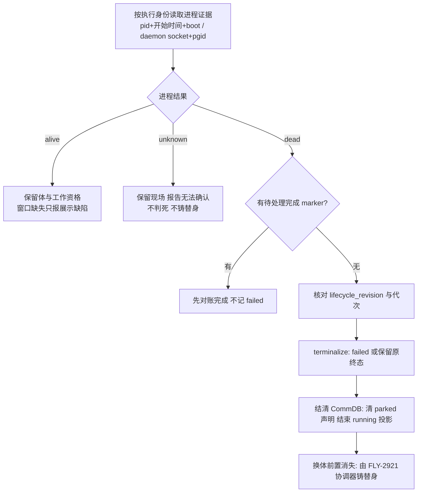

# FLY-2919 进程生死单一真源 — 实施计划
Issue: FLY-2919 (https://linear.app/geoforge3d/issue/FLY-2919/病根修复-2-体的生死只认一个真源死体当场终结活体不再按窗口判死9-张-68)
日期: 2026-09-28
基于: research.md

状态: draft（待本轮 design_review）
审计基线: 本 checkout `1855f7a1a`（沙箱 main）。上游 `origin/flywheel-FLY-2919` 的 APPROVED 设计（gate `f4e94872`）作为架构来源；本计划是它在本树的等价落点，不是照抄。

## 0. 本树落点与 Lead 义务对照

本树没有上游的 dispatcher / mutation lease / reowner / standby / restartGate / resident 模块（research.md §0、§8）。上游 plan 中依赖这些模块的条款按下表处理，实现交卷报告须逐条引用本表：

| Lead 义务 | 本树处置 | 证据位置（本 plan） |
|---|---|---|
| HIGH death-before-pending-complete-marker | **不变式 I-1**：收敛入口第一步查 marker，未 settled 不写 failed | §5 步 1、§6 B 红测 b1 |
| codex-reown-revive-precedence | 本树无 reowner；契约保留 `reason: "recovery_active"` 位，Codex 探针在 goal-runtime 重启窗口内返回 unknown | §4.2、§6 A 红测 a4 |
| obligation-replay-evidence-expiry | 义务重放**幂等查找先于过期检查** | §5 步 6、§6 C 红测 c2 |
| lease-contention-refuses-normal-restart | 本树无 lease；采样在事务外，事务只做 `lifecycle_revision` 同步 CAS，CAS 失败重采样不 stop | §5 步 1、§6 C 红测 c3 |
| no-runtime-kill-switch | `body_death_authority` 登记 feature registry | §4.4 |
| consumer-inventory-direct-importers | research.md 附录 A 全表；started-evidence / worktree-reconciler / lifecycle-sweep 纳入 B/F | §6 |
| fly2903-sweep-and-restart-gate-unmapped | 本树无 restartGate/sweep；Codex 探针消费 goal-runtime 的 `restartInProgress` 标志 | §4.2 |
| claude-process-title-identity | pid + lstart + host boot + lsof txt，不用 argv | §4.1 |
| standby-retirement-window-proof | 本树无 FLY-2808；收敛入口预留 `approvedRetirement` 输入，不记 failed | §5 步 2 |
| probe-cadence-heartbeat-5min | 独立采样预算，延迟上界 = 1 tick + 5 s | §4.3 |
| LOW（founder-wake-successor-handoff / tests_not_run） | PR Follow-ups 段 | §9 |

## 1. 给 founder 的说明

**一句话：体是否还活着只问它自己的进程；窗口只是观察入口，停驻只是工作安排，二者都不能替进程作生死决定。**



进程代次（generation）= 同一执行身份第几次实际启动，用来防止旧进程的迟到消息关掉新进程。完成 marker = Runner 交卷时写下的回执文件，进程退出本身不是交卷。

## 2. 范围：删什么、留什么

**删除（实现提交中逐项附最终符号与行号）：**
1. Heartbeat `isSessionTmuxAlive` 把 `absent/gone/dead_pin` 当死；tmux 存在算心跳（`updateHeartbeat`）。
2. 死亡候选只查 `status='running'` 的前置（`getOrphanSessions` / `crash-reaper` 候选）。
3. `checkStaleParkedPhases` 对非终态 parked 候选的「只告警」豁免——**限已证死**的候选。
4. `getActiveSessions` 把死在 `awaiting_review/approved_to_ship` 的体算活 → 堵 retry。
5. `started-evidence` 「窗口存在 = 已启动 / 窗口不存在 = 未启动」。
6. `complete-marker-reconciler` 启动扫「无窗即 quarantine → failed」。
7. `server-loss` `targetGone` 由窗口缺失直接 failed。
8. `codex-phase-shutdown` 的 `absent/dead_pin → direct` 绕过协作关停。
9. `done-thread-reconcile` / `lifecycle-closeout` 用窗口缺失当 `confirmedGone`。
10. `commdb-fsm-reconcile` / `commdb-session-prune` 用窗口死作删行授权。
11. `phase-orchestrator` park-or-close / wake-vs-spawn / ghostGuard 用 pane 探针。
12. `TmuxAdapter.waitForCompletion` 「pane 消失 = 正常完成 success:true」。

**保留：** `parked/long_task` 声明枚举与 CLI；`awaiting_review/approved_to_ship/design_done` 状态；review gate、`gate_timed_out`、TURN、founder wake；FLY-1204 parked 巡检对**活**体的告警语义；窗口查找与清理（`killTmuxWindow`、tab reaper、scan-stale）；生产必须有可见 TUI 的产品要求；`admitWorkflowExecution` 不动。

**不做：** 铸替身协调（FLY-2921）；Bridge 崩溃根因；全局告警重写；生产清库；自动关九张单；部署。不得把 `ZOMBIE_IRREVERSIBLE_TERMINAL_STATUSES` 加上 awaiting_review 草草了事。

## 3. 数据模型

### 3.1 StateStore 新表 `execution_process_binding`（幂等 `CREATE TABLE IF NOT EXISTS`，沿用 StateStore 构造器现有迁移模式）

| 列 | 类型 | 说明 |
|---|---|---|
| `execution_id` | TEXT PK | 执行身份 |
| `generation` | INTEGER NOT NULL CHECK(>=1) | 逻辑代次；每次真实启动 +1 |
| `adapter` | TEXT NOT NULL CHECK IN ('claude-tmux','codex-tmux','kimi-tmux','antigravity-tmux') | 载体 |
| `pid` | INTEGER NULL CHECK(pid>1) | Claude/Kimi/Antigravity: worker pid；Codex: NULL（用 daemon 字段） |
| `proc_start` | TEXT NULL | `ps -o lstart=` 原文（规范化 ISO） |
| `host_boot_id` | TEXT NOT NULL | `sysctl -n kern.boottime` 规范化 |
| `exe_path` | TEXT NULL | `lsof -p pid -a -d txt -Fn` 首个非系统库路径，与 `binaryName` 解析路径比对 |
| `daemon_exec_id_hash` | TEXT NULL | Codex: socket 路径 hash（`sha1(execId)[:16]`） |
| `daemon_pgid` | INTEGER NULL | Codex: session.json `daemonPid` 的 pgid（`ps -o pgid=`） |
| `binding_digest` | TEXT NOT NULL | 以上字段的 sha256，事务 CAS 用 |
| `accepted_at` | TEXT NOT NULL | Bridge 核验通过时间 |
| `lifecycle_revision_at_accept` | INTEGER NOT NULL | 接纳时 sessions.lifecycle_revision |

只记身份，**不存 alive/dead**。参数化写入；所有来自 tmux/ps/lsof/session.json 的字符串在边界校验（长度 ≤ 256、pid/pgid 正整数、路径为绝对路径且非软链）。

### 3.2 StateStore 新事件 `body_death_obligation`（写入现有 workflow/session events 表，无新表）

幂等键 `body_death:<execution_id>:<generation>`。载荷：`observation`（§4 契约）、`prior_status`、`resulting_status`、`commdb_projected_at NULL`。CommDB 投影完成后回写 `commdb_projected_at`；启动与每 tick 重放未投影义务。

### 3.3 CommDB 不新增表、不新增 CHECK 枚举
复用 `finalizeSession(executionId)`（`db.ts:1588`）与 `clearDeclaredState`（:1316）。新增 `finalizeProvenDeadSession({executionId, obligationId, generation, expectedTmuxWindow|null})`：同事务内校验 `sessions.execution_id` 存在且（若有）`tmux_window` 与义务记录一致，清声明 + finalize，写幂等回执 `body_death_receipts(obligation_id PK, finalized_at)`（这一张小表是唯一 CommDB 新增，`CREATE TABLE IF NOT EXISTS`）。

## 4. 单一证据契约

新增 `packages/claude-runner/src/execution-process-liveness.ts`（两载体底层）与 `packages/teamlead/src/bridge/execution-body-liveness.ts`（组装 StateStore 身份）。**仅 Bridge/adapter 内部调用，不新增 Runner 可提交 `dead=true` 的 HTTP/CLI 入口。**

```ts
export type BodyIdentity = {
  executionId: string;
  generation: number;
  lifecycleRevision: number;
  adapter: "codex-tmux" | "claude-tmux" | "kimi-tmux" | "antigravity-tmux";
};
export type BodyVerdict = "alive" | "dead" | "unknown";
export type BodyReason =
  | "process_alive" | "daemon_alive"
  | "process_gone" | "daemon_gone"
  | "no_binding" | "binding_mismatch" | "probe_timeout" | "probe_error"
  | "recovery_active" | "authority_disabled" | "pending_complete_marker";
export type BodyObservation = {
  identity: BodyIdentity;
  verdict: BodyVerdict;
  reason: BodyReason;
  observedAt: string;   // ISO
  expiresAt: string;    // observedAt + 10 s
  bindingDigest: string;
  windowState: "present" | "absent" | "dead_pane" | "indeterminate"; // 展示字段，不参与 verdict
};
```

**性质（必测）：** 对同一 `(identity, 进程状态)`，`windowState` 取任意值时 `verdict` 不变。让旧 pane 实现跑同一 fixture，必须出现反例。

### 4.1 Claude / Kimi / Antigravity 绑定与探测
- **登记时机：** `TmuxAdapter` 在 `tmux new-window -P -F '#{window_id}'` 成功后、`onTmuxWindowCreated` 之前，`tmux display -p -t <window_id> '#{pane_pid}'` 取 pid，再 `ps -o lstart= -p pid`、`sysctl -n kern.boottime`、`lsof -p pid -a -d txt -Fn`；gated shell（gateway 路径）用 `exec` 接管同一 pid，所以 `pane_pid` 在两条路径都是 worker pid。核对 `exe_path` 基名 = `binaryName`（gated 路径允许在 commit 释放前短暂为 `sh`，adapter 在写 commit 后重采一次，最多 3 次 × 200 ms；仍为 `sh` → 登记失败 → 启动失败，**不得**宣告成功）。
- **登记失败 = 启动失败。** 窗口创建成功但绑定缺失不能算成功启动；adapter 杀窗返回错误。
- **探测：** `kill(pid, 0)` 存在 → `ps -o lstart= -p pid` 与绑定一致 → alive；`ESRCH` 或 lstart 不一致（pid 复用）→ dead；`EPERM`/超时/解析失败 → unknown。**不读 argv、不读进程标题。**
- **writer 集合：** worker 退出但同进程组仍有子进程（MCP server、dev server）时返回 `unknown(process_gone→writers_remaining)`，走现有 `runner-teardown.ts` 的 pane_pid 子树回收后重探；viewer/tail 进程不算 writer。
- **旧运行迁移：** 没有绑定的存活 Claude 由 `tmux_window → pane_pid → lstart` 补采，且 pane 命令基名 = `claude` 才接纳（唯一匹配）；补采失败 → `unknown(no_binding)`，进「待收体清单」告警，不判死。

### 4.2 Codex 绑定与探测
- 复用 `codex-daemon-runtime.ts` 现有 `defaultIsSocketLive`、`lsof -t` holder、`ps -o pgid=`（:685-716）抽成导出 `probeCodexDaemonEvidence(executionId)`：`socketLive && holderPgid === bindingPgid` → alive；`!socketLive && kill(-pgid,0)=ESRCH` → daemon_gone；其余 unknown。
- **重启窗口（Lead 义务 fly2903 / reown 本树落点）：** `CodexDaemonGoalRuntime` 在 `killSession()` 前置 `restartInProgress=true`、`startSession()` 成功并写新 `daemonPid` 后清除；同时把 `restarts` 计数写进 session.json。探针读到 `restartInProgress || restarts < maxRestarts && socket 刚失活 < 60 s` → `unknown(recovery_active)`；预算耗尽（goal-runtime 已返回终态）后才允许 dead。Runtime 进程本身（Bridge 内）活着而 execution handle 缺失且无 drained 记录 → unknown，不判死。
- daemon_gone 且 goal-runtime 已返回（handle 结束）→ dead。

### 4.3 采样节奏与预算（Lead 义务 probe-cadence）
- 采样挂在 `HeartbeatService.check()` 每 tick 之首，但**独立预算**：每轮候选 ≤ 8、并发 2、总窗口 5 s；未轮到的按稳定游标（`execution_id` 升序、上轮末尾续）跨轮公平；显式 terminate / rework / marker 待办优先。候选来源：`running ∪ awaiting_review ∪ approved_to_ship ∪ design_done ∪ getParkedPhaseCandidates()`（**不再只 running**）。
- 单次探测超时 5 s；超时任务可取消并等待子进程回收，不用 `Promise.race` 遗留后台探针。
- 同 `(execution, generation)` 的在途 Promise 共享；证据有效期 10 s；进事务前重核 `lifecycle_revision` 与 `bindingDigest`。
- **延迟上界（验收写入）：** 进程退出 → 判死 ≤ `TEAMLEAD_STUCK_INTERVAL`（默认 300 s）+ 5 s + 候选排队轮次 × tick（候选 > 8 时）。529 用 `TEAMLEAD_STUCK_INTERVAL=30000` 验证 ≤ 35 s。
- 心跳/信箱活跃时间只作诊断与排程，不覆盖当前代次的可靠死亡证据。

### 4.4 运行时开关
`packages/config/src/feature-flags/registry.ts` 新增：
```ts
{ name: "body_death_authority", category: "feature", source: "env", scope: "bridge_global",
  envVar: "FLYWHEEL_BODY_DEATH_AUTHORITY", polarity: "default_on", valueKind: "bool", default: true,
  description: "进程证据作为 Runner 生死唯一授权；=0 时致死消费者只观察/报 unknown",
  readSites: [envSite("packages/teamlead/src/bridge/execution-body-liveness.ts", "observeBody", "call_time")],
  toggleable: "direct", directToggleProof: "resolve.direct-toggle.test:body_death_authority live-observe" }
```
`=0` 时 `observeBody` 返回 `unknown(authority_disabled)`；所有致死消费者对 unknown 一律不写 failed/terminated、不删 CommDB 行、不铸替身、只告警。`liveness_pane_dead` 迁移完成后改登记为 `dormant`（read site 仍存在于非致死窗口观察）。三条 registry 测试必须过（drift：新 env 只在 `execution-body-liveness.ts` 读）。

## 5. 死亡收敛顺序（唯一入口 `convergeProvenDeadExecution`，落 `packages/teamlead/src/bridge/execution-body-convergence.ts`；StateStore 新公共方法 `terminalizeProvenDeadSessionTx`）

**不变式：**
- **I-1 marker-before-death**：有待处理 complete marker 的执行，先 `tryReconcileComplete`，未 settled → `deferred(pending_complete_marker)`，不写 failed，不铸替身。
- **I-2 单一授权**：只有 `BodyObservation.verdict === "dead"` 且未过期、`bindingDigest` 与 `lifecycle_revision` 与采样时一致，才允许写 failed/terminated。
- **I-3 窗口不授权**：`windowState` 不出现在任何写路径的条件里。
- **I-4 unknown 零副作用**：unknown 只产生告警与「待收体清单」。

**步骤：**
1. 采样（事务外，§4.3）→ 若 `hasPendingCompleteMarker(execId)` → I-1 处理并返回。
2. 打开 StateStore 事务：读 `sessions` 行；`lifecycle_revision` ≠ 采样时 → 放弃、重采样（不是 stop）。若入参含 `approvedRetirement`（本树暂无生产者，接口预留）→ 不记 failed，只关闭代次。若已是不可逆终态（`completed/failed/terminated/blocked/rejected`）→ 保留原终态，只补物理终结记录。其余（`running/awaiting_review/approved_to_ship/design_done/pending`）→ `applyTransition(failed, trigger="body_death", last_error="Body dead: <reason> (generation N)")`；**parked 声明不否决**。
3. 同事务写 `body_death_obligation`（幂等键 `body_death:<exec>:<gen>`；已存在 → 幂等返回）。
4. 事务提交后：物理清理（`killTmuxWindow`、Codex `reapCodexDaemon` 现有原语）**独立重试**，失败不回滚死亡，只记 `window_cleanup_pending` 告警。
5. CommDB 投影：`finalizeProvenDeadSession(obligation)`：同事务清 `runner_declared_states`、`finalizeSession`（含 gate retirement）、写 `body_death_receipts`；回写 StateStore `commdb_projected_at`。TURN 若被死体持有：本树 TURN 记录在 CommDB `turn` 表，用 `DELETE … WHERE issue_id=? AND holder=? AND epoch=?` 比较删除（不无条件删）。
6. **崩溃重放**（Lead 义务 obligation-replay）：启动与每 tick 扫 `commdb_projected_at IS NULL` 的义务 → 先按幂等键查 `body_death_receipts`（**幂等查找先于过期检查**）→ 已有回执直接回写；无回执则重放步 5（重放不重新采样，义务本身已是可靠死亡记录）。证据过期只约束**首次**提交。
7. 换体：本单不铸替身；步 2 落 failed 后，`getActiveSessions` 的 retry 前置自然通过，`ACTION_SOURCE_STATUS.retry` 仍要求 failed/blocked/rejected（保留）。FLY-2921 协调器消费 `body_death_obligation` 事件。

**FLY-2512 终态活体：** `checkStaleCompleted` 候选改为 `observeBody === alive` 的终态会话（不再 `isTmuxWindowAlive`）；先发既有 cooperative shutdown（`codex-phase-shutdown` 协作路径），再重探；仍 alive 走现有 `closeRunner` 重试与告警，达 retry 预算进入可见 hold；不替换。

**FLY-2528 无判决退出：** `TmuxAdapter.waitForCompletion` 两条分支返回显式 `exitKind: "callback" | "sentinel" | "pane_lost" | "abnormal_exit"`；`pane_lost` 继续进程探测（alive → 继续等；dead 且无 marker → `abnormal_exit`）；`abnormal_exit` 经 Blueprint → `DirectEventSink`/`event-route` 映射 `session_failed`。已接受的 complete marker 不被覆盖。

## 6. 六组实施任务（每组：fixture → 精确文件红测 → 最小实现 → 同断言绿 → 相关回归 → 提交）

| 组 | 修改文件 | 必须先失败的测试与断言 |
|---|---|---|
| **A 统一物理证据** | 新 `claude-runner/src/execution-process-liveness.ts`；`codex-daemon-runtime.ts` 抽 `probeCodexDaemonEvidence`；`codex-daemon-goal-runtime.ts` 加 `restartInProgress` + session.json `restarts`；`TmuxAdapter.ts` 启动登记（Kimi/Antigravity 子类继承）；`StateStore.ts` 表 3.1 + `acceptProcessBinding`；`tmux-lookup.ts` `probeRunnerProcessLiveness` 重命名 `probePaneState` + 注释；包导出 | 新 `claude-runner/test/execution-process-liveness.test.ts`：a1 四载体 × {alive,dead,unknown} × {present,absent,dead_pane} 恒等 verdict；a2 pid 复用（lstart 不同）→ dead；a3 EPERM/超时 → unknown；**a4** Codex `restartInProgress` → unknown(recovery_active)，预算耗尽 → dead；a5 gated shell exe=sh 三次 → 登记失败 → 启动失败；a6 旧运行补采唯一匹配才接纳 |
| **B 检测与恢复** | `HeartbeatService.ts`（候选集、`isSessionTmuxAlive`→`observeBody`、`reapOrphans` 只对 dead、parked 巡检对 dead 不豁免、采样预算）；`crash-reaper.ts`；`zombie-scan.ts`；`server-loss.ts`+`plugin.ts` 接线；`complete-marker-reconciler.ts` 启动扫；`started-evidence.ts`；`phase-orchestrator.ts` 三处；`actions.ts` retry 前置 | `HeartbeatService.test.ts` 新 describe：**b1** pending marker + 进程 dead → 零 failed、marker 先对账（HIGH）；b2 窗 absent + 进程 alive → 零 failed、进 reconnecting、告警 `window_missing`；b3 窗 present(dead_pane) + 进程 dead → 本 tick failed；b4 `awaiting_review` + dead → failed（不再豁免）；b5 parked 声明 + dead → failed；b6 unknown → 零写；b7 `FLYWHEEL_BODY_DEATH_AUTHORITY=0` → 全 unknown；b8 100 候选 fake timers：并发 ≤ 2、每轮 ≤ 8、游标无饥饿、tick 不被拖住。`crash-reaper.test.ts`：dead 才 claim。`started-evidence.test.ts`：无窗 + alive → started；dead_pane + dead → retry_safe。`server-loss.test.ts`：server down + daemon alive → 零 failed。`complete-marker-reconciler.test.ts`：无窗 + alive → 不 quarantine |
| **C 双库收敛** | 新 `bridge/execution-body-convergence.ts`；`StateStore.ts` `terminalizeProvenDeadSessionTx` + 义务事件 + 重放扫描；`flywheel-comm/src/db.ts` `finalizeProvenDeadSession` + `body_death_receipts`；`commdb-fsm-reconcile.ts`、`commdb-session-prune.ts`、`done-thread-reconcile.ts`、`lifecycle-closeout.ts` 改消费 BodyObservation | 新 `bridge/__tests__/execution-body-convergence.test.ts`：c1 parked 不否决死亡；**c2** 三个崩溃切点（采样后/StateStore 后/CommDB 后）重放恰一次，幂等键先于过期；**c3** `lifecycle_revision` 变化 → CAS 拒绝重采样、不 stop；c4 旧 generation 义务不影响新代次；c5 死体持 TURN → 比较删除、新 holder 不被删；c6 窗口清理失败不回滚死亡。`commdb-fsm-reconcile.test.ts` / `commdb-session-prune.test.ts`：窗死 + body alive → 保留行；窗活 + body dead → 结账 |
| **D 退出与投影** | `TmuxAdapter.ts` 两 wait 分支 `exitKind`；`edge-worker/src/Blueprint.ts`；`DirectEventSink.ts`；`event-route.ts` | `claude-runner/test/TmuxAdapter.test.ts`：d1 pane_lost + alive → 继续等；d2 pane_lost + dead + 无 marker → abnormal_exit；d3 marker 已写 → completed 不被覆盖。`DirectEventSink.test.ts`：abnormal_exit → failed |
| **E 终止与残留** | `codex-phase-shutdown.ts`（absent 不再 direct；ACK 后核进程退出）；`stale-blocker-guard.ts`（kill 后 observeBody dead 才 completed）；`actions.ts` terminate physicalGone 由 body 证明；`close-runner.ts` alreadyGone 由 body 证明 | `codex-phase-shutdown.test.ts`：e1 absent + daemon alive → 协作关停、不 direct；e2 ACK + daemon 仍活 → 不视为完成。`stale-blocker-guard.test.ts`：e3 kill 缺窗 + 进程活 → 不 completed |
| **F 巡检与验收** | `zombie-scan.ts` 分类新增 `window_missing_body_alive`；`plugin.ts` scan-stale DTO 分 `bodyVerdict`/`windowState`；`worktree-reconciler.ts`/`lifecycle-sweep.ts` 加 body alive 保护；九单 before/after 记录 | `zombie-scan.test.ts`：f1 缺窗活体 → `window_missing_body_alive` 非 stale_target；`worktree-reconciler.test.ts`：f2 终态但 body alive → 不删 |

顺序 A → B → C → D → E → F；B 依赖 A 的探针，C 依赖 B 的候选集。每组完成后 `progress --set-chunk <A..F>=done`。

**性质测试（A 附带）：** `execution-process-liveness.property.test.ts`：随机 windowState 不改 verdict；用旧 `probeRunnerProcessLiveness` 包装成同接口跑同 fixture，断言出现 ≥ 1 反例（证明旧实现确实违反性质）。

## 7. 九单验收矩阵（次数为 FLY-2915 盘点历史数，不是本轮实测数）

| 单 / 次 | 构造原现象（fixture） | 修后必须观察到 | 负控 |
|---|---|---|---|
| FLY-2083 /25 | `awaiting_review` 目标进程已死 | 本 tick failed；`getActiveSessions` 不再堵 retry；CommDB running 投影结束 | 活等审体零变化 |
| FLY-2537 /16 | 真死体 CommDB running + parked 声明 + 窗残留 | StateStore failed、声明清掉、CommDB finalize；重复扫零副作用 | 无窗但 daemon socket 活 → alive |
| FLY-2474 /7 | Claude/Codex 终态但进程活（旧实现只清一侧） | `checkStaleCompleted` 走协作关停→重探→两库收敛；窗口清理失败另报 | unknown 不收体 |
| FLY-2193 /7 | worker 死但 tail/viewer pane 活；反向窗死 worker 活 | 前者本 tick dead，后者 alive，同一探针 | 心跳新旧不翻转进程结果 |
| FLY-2690 /5 | terminate 后 completed 体仍有 daemon | terminate physicalGone 由 body 证明；daemon reap 后才 gone | 不属该 execution 的 pgid 不动 |
| FLY-2512 /4 | failed + Reconnect failed TUI、daemon absent；另测真活 daemon | UI 壳不阻挡；真活 daemon 先协作停→验证→再允许 retry | stop 未证成功零替身 + 可见 hold |
| FLY-2618 /2 | `:pending`/无窗 + 活进程，Bridge 崩溃重连期间扫两轮 | 零 force-fail、零替身、写入资格保留、`window_missing` 告警 | dead + 无窗也可靠终结 |
| FLY-2528 /1 | tmux server 消失、worker 真退出、无 marker | adapter → Blueprint → sink 为 failed | 活 worker 不退出；marker 已写不覆盖 |
| FLY-2529 /1 | 重建 tmux server、旧 window id、原 worker 活 | roster 显示 alive + window_missing，无「持有者已死」推断 | worker 死时同路径得 dead |

共 68 次；FLY-2710 并入 2474。每行独立 fixture 名与 before/after SHA。

## 8. 相关测试与 529 真机

本机**只跑精确文件**（⛔ 不 `pnpm test`、不全包）。实现节点先 `pnpm install --frozen-lockfile`（本树无 node_modules）。

```sh
export FLYWHEEL_CODEX_HOMES_ROOT="$(mktemp -d /tmp/fly2919-homes.XXXXXX)"
pnpm --filter flywheel-claude-runner exec vitest run test/execution-process-liveness.test.ts test/execution-process-liveness.property.test.ts test/TmuxAdapter.test.ts test/codex-daemon-runtime.test.ts test/codex-daemon-goal-runtime.test.ts
pnpm --filter flywheel-teamlead exec vitest run src/__tests__/HeartbeatService.test.ts src/__tests__/HeartbeatService.monitor-loss.test.ts src/__tests__/HeartbeatService.stale-terminal-close.test.ts src/__tests__/HeartbeatService.fly1204-parked-reclaim.test.ts src/__tests__/heartbeat-review-timeout.test.ts src/__tests__/crash-reaper.test.ts src/__tests__/commdb-fsm-reconcile.test.ts src/__tests__/tmux-lookup.runner-liveness.test.ts src/__tests__/DirectEventSink.test.ts src/__tests__/event-route.test.ts src/__tests__/StateStore.test.ts
pnpm --filter flywheel-teamlead exec vitest run src/bridge/__tests__/execution-body-convergence.test.ts src/bridge/__tests__/zombie-scan.test.ts src/bridge/__tests__/server-loss.test.ts src/bridge/__tests__/started-evidence.test.ts src/bridge/__tests__/retry-dispatch-wal.test.ts src/bridge/__tests__/phase-orchestrator.fly1224-probe-before-wake.test.ts
pnpm --filter flywheel-config exec vitest run src/__tests__/feature-flags-registry.test.ts src/__tests__/feature-flags-drift.test.ts src/__tests__/feature-flags-direct-toggle.test.ts
```
（`packages/*/package.json` 的 `name` 以实际为准；不存在的测试文件由实现节点新建，不把「文件不存在」算通过。排除 `tmux-viewer.macos.test.ts`。）

**529 真机（QA 节点自起房，Discord N-to-N）：**
1. 从 Discord 派单起真 runner（Claude 与 Codex 各一），thread 可见。
2. 场景 A：`tmux kill-window` 删掉 runner 窗口但保留进程（Claude：先 `tmux break-pane`/`respawn` 让 pid 脱离窗口；Codex：只杀 TUI 窗）；跨两个 tick（`TEAMLEAD_STUCK_INTERVAL=30000`）观察：零 failed、零替身、`window_missing` 告警、同一 thread 继续干。
3. 场景 B：只 `kill -9` worker（保留 viewer 窗）；≤ 35 s 内 StateStore failed、CommDB finalize、声明清空；由 FLY-2921 协调器（若房内已合）铸恰一替身，同 thread 接着干；无 2921 时 retry 前置可通过。
4. `FLYWHEEL_BODY_DEATH_AUTHORITY=0` 重复场景 B：零写、只告警。
5. 在 StateStore 提交后、CommDB 提交前重启房内 Bridge：义务重放恰一次、回执幂等。
6. 记录：命令、时间、pid/lstart/boot、两次观察、前后两库查询快照（snapshot-control，禁 `cp` 活库）。

## 9. 迁移、回滚、Follow-ups

- 不强制重启存活 Runner；无绑定的旧运行按 §4.1 补采，补采失败进「待收体清单」显式留下，不判死。
- 回滚代码只影响以后探测；已提交死亡与 CommDB 回执不撤销。`FLYWHEEL_BODY_DEATH_AUTHORITY=0` 是不改代码的紧急止血。
- 新表/事件旧版本可忽略；`liveness_pane_dead` 保留登记（dormant）。
- **PR Follow-ups（LOW）：** founder wake 的后继交接（本树无通用重绑 API，死体的 pending wake 记 `wake_failed` 告警保留来源）；tests_not_run 清单；`gateway-main.ts` close 幂等后置的活进程泄漏；上游 reowner/standby/restartGate 合入本树时的契约对接（`recovery_active`/`approvedRetirement` 已预留）。

## 10. 设计节点交付
exploration.md、research.md、本 plan、Mermaid 源（flow.mmd、model.mmd）、founder HTML（各节评论、路径隔离存储、汇总复制）、有效 design-review APPROVED、提交推送、publish-report、报告 URL、`complete --route phase_design_complete`。设计节点不运行实现回归、不做故障注入。

## 11. 评审处置记录
（design_review 轮次结果追加于此）
