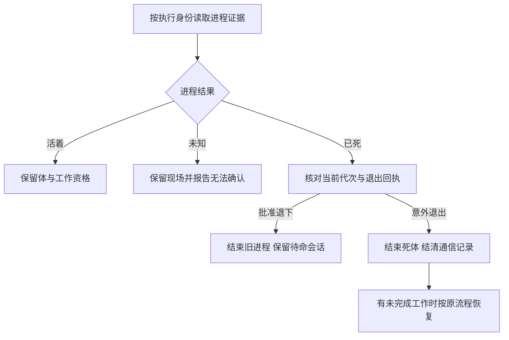

# FLY-2919 进程生死单一真源 — 实施计划
Issue: FLY-2919 (https://linear.app/geoforge3d/issue/FLY-2919/病根修复-2-体的生死只认一个真源死体当场终结活体不再按窗口判死9-张-68)
日期: 2026-09-26
基于: 无

状态: DRAFT — 等待有效 design review；本文件含探索、源码调研与实施计划（plan_only）。
审计基线: `af853328d`，分支 `flywheel-FLY-2919`。设计执行 `416169c3-8d61-4fc1-b20a-3e2263115f31`。

## 1. 给 founder 的说明

**一句话：体是否还活着只问它自己的进程；窗口只是观察入口，停驻只是工作安排，二者都不能替进程作生死决定。**

本单覆盖盘点 K02 的全部九张单、68 次记录。进程已证死时，当次处理就结束该物理体、结清通信投影；仍需工作时才按原工作流恢复。进程活着但窗口丢失时保留工作与写入资格，并显式报告窗口缺失；保留 founder 可见窗口的产品要求。读取进程证据失败时显示“无法确认”，不能判死或造第二个写入者。

“当场”指第一次取得当前身份的可靠死亡证据的处理轮次，不再等停驻超时、两次缺窗或人工改账；不承诺进程退出与巡检之间零毫秒。后台清理窗口失败不能反过来让死体继续显示正在运行。



进程代次是同一执行身份第几次实际启动，用来避免旧进程的迟到消息关掉新进程。完成回执是控制器已经接受交卷的记录，进程退出本身不是交卷。

## 2. 范围、选择与相邻设计

选用“一个进程证据接口 + 六组消费者收敛”。不选“给 pane 缺失多加一次确认”：仍会双向误判；不选“账面终态就当物理死亡”：会在活进程旁造替身；不选“全删业务等待状态”：会破坏等审与正常待命恢复。

删除的是 parked / ship_parked / awaiting_review **对意外证死体的生死豁免**，以及窗口参与生死的分支；不全局删除这些业务枚举、review gate、route、TURN 或历史事件。TURN 是工作树写入权，不能因窗口消失转交。

基线已经含 FLY-2808（`a084f3a99`）的 controller-approved retiring → standby → resume。standby 指已批准退下、可按原会话恢复；它证明旧物理代次结束，不伪称进程还活着。本单不打开默认关闭的 standby flag，也不改变已有 snapshot 的入组规则。仅有 parked 自报不是批准退下回执。

FLY-2903 PR #1343 在本轮 `gh pr view` 查询时仍 OPEN、无 mergeCommit；不能把其 stop-owner-before-reap 当基线已交付。实现前再核最新 main/PR：若已合，复用其 closeRunner/controller 停止与 daemon 回收并跑本单负控；未合则在本单实现必要的精确收体部分或由 Lead 明确排序，不可将 FLY-2512/2690 验收划掉。无需另造回收器。

已通过非阻塞问题向 Lead 报告两项差异：九单实际横跨超过 5–6 个文件；K02 快照里“终态直接视死”和“全删 completion_receipt_missing”不能直接照做。原任务的九单验收与单一物理真源优先。问题 ID：`2c84cc0d-af3c-43c0-91ad-6363e170589d`、`2909bd8f-dcfb-4351-9bdf-5ecb31872e5e`。

不涉及：Bridge 崩溃原因、全局调度重构、全部告警重写、生产清库、自动关闭九张 Linear 单、合并部署。涉及单由 Lead 在合入后逐张复核关闭。

## 3. 源码调研与必须改变的入口

下列行号以审计基线为准；实现时用符号查找，禁止凭行号直接修改。

| 入口 | 当前事实 | 处置 |
|---|---|---|
| `packages/teamlead/src/HeartbeatService.ts:847,963,1204,1987` | parked 另走报告路径；pending/absent pane 判 dead；最终复核仍是同一窗口探针 | 全部改读执行身份的进程证据，证死不受 parked 分流影响 |
| `packages/teamlead/src/bridge/tmux-lookup.ts:790` | 名为 probeRunnerProcessLiveness，实际只读 pane_dead | 保留为窗口观察工具并明确命名/注释；本单所有死亡授权调用方迁走，不能只改名字 |
| `packages/teamlead/src/bridge/generalized-launch-recovery.ts:145`、`run-quiescence.ts:41,80` | 通用恢复还信窗口；Codex daemon absent 后又受窗口/host-shell 否决 | 统一适配层；精确 worker absence 不被 viewer/poll shell 覆盖 |
| `packages/claude-runner/src/codex-daemon-runtime.ts:260–395` | 活=socket 持有者属于持久化 group；死=socket 不活且 group 不在；no_group/missing 未知 | 复用，保留身份、权限错误和 pre-spawn 边界 |
| `packages/teamlead/src/bridge/workflow-engine-dispatcher.ts:927,1984,2076` | held recovery 限 persisted_target_missing；dead sweep 先要求账面终态；alive+终态静默等待 | 删账面终态前置，按进程证据收敛；活的残留先请求收体再证死 |
| `packages/teamlead/src/StateStore.ts:44324,61335` | heldPaneLossRecovery 与 rollbackDeadWorkflowNodeExecution 再要求终态 | 以当前进程证据代替；保留精确 request/route/node/attempt 和 CAS |
| `StateStore.ts:16411` | terminalizeProvenDeadSessionTx 已维护时间戳、版本与资格撤销 | 扩展现有事务路径，不用裸 UPDATE 绕过不变量 |
| `packages/teamlead/src/bridge/commdb-fsm-reconcile.ts:207–350`、`packages/flywheel-comm/src/db.ts:9435` | 先等窗口死，再由 parked 声明否决；活窗口也阻挡结账 | 进程证明进入受信结账；自报 parked 不再有否决权 |
| `packages/flywheel-comm/src/db.ts:9267` | finalizeProvenGoneSession 已有 identity epoch、过期校验、幂等回执、TURN/创始人唤醒保护，但上下文是 land reservation | 提取内部受信 finalization 核心供生命周期协调器用，不伪造 land reservation |
| `packages/teamlead/src/bridge/delivery-operations.ts:167`、`StateStore.ts:49521` | CommDB running 可阻止到期探测；释放只结算特定 ship_parked | 到期走同一收体/结账路径，两载体均覆盖 |
| `packages/claude-runner/src/TmuxAdapter.ts:1301,1408,2120,2188` | 两条 wait 路径都把 pane 丢失当正常完成，返回 success:true | 窗口失联继续进程探测；无完成回执的真实异常退出记 failed |
| `packages/teamlead/src/DirectEventSink.ts:695,966`、`packages/edge-worker/src/Blueprint.ts` | adapter success 可落 session_completed | 增加异常退出分类，直接/HTTP 两入口同义，已接受交卷不被覆盖 |
| `StateStore.ts:50886,51872`、`packages/teamlead/src/bridge/plugin.ts:1911` | terminate 候选只收非终态；缺 session 直接当已收走 | collection 专用全归属候选，逐具核验物理体与通信残留 |
| `packages/teamlead/src/bridge/codex-phase-shutdown.ts:104,166` | 缺窗可绕协作关停，ACK 仅查窗消失 | 活控制器先协作停止；ACK 后仍核进程退出；窗口是另项清理 |
| `packages/claude-runner/src/CodexTmuxAdapter.ts:1727,2278` | runEnded/finally 已取消 TUI 恢复 | 让真关闭到达该路径；恢复前重核当前 run/owner 关闭事实 |
| `packages/teamlead/src/bridge/plugin.ts:15839`、`server-loss.ts` | tmux 服务损失可按窗口 gone 强制 failed | 服务损失只触发共同进程探测，不直接判死 |
| `packages/teamlead/src/bridge/crash-reaper.ts`、`zombie-scan.ts:93` | dead_pin / 24h 心跳 + pane 决定尸体 | 分离进程死亡与窗口清理；生命判断共用接口 |
| `packages/teamlead/src/bridge/patrol-process-liveness.ts:58`、`scripts/lead-patrol-snapshot.sh:432` | 巡检按窗判死/活，MISSING_PANE 被当“未工作”线索 | 进程结论与窗口缺失分别输出；窗口缺失仍须修复，但不导出体死或 TURN 无人 |

## 4. 单一证据契约

新增 `packages/claude-runner/src/execution-process-liveness.ts`，作为两载体可用的底层接口；由 `packages/teamlead/src/bridge/execution-body-liveness.ts` 组装 StateStore 当前身份。包导出随接口一起更新。所有新接口仅 Bridge/adapter 内部调用，不新增 Runner 可提交 dead=true 的 HTTP/CLI 入口。

```ts
type BodyIdentity = {
  executionId: string;
  activationId: string | null;
  generation: number;
  lifecycleRevision: number;
  adapter: "codex-tmux" | "claude-tmux";
};
type BodyObservation = {
  identity: BodyIdentity;
  verdict: "alive" | "dead" | "unknown";
  observedAt: string;
  expiresAt: string;
  bindingDigest: string;
  reason: string;
};
```

`bindingDigest` 绑定实际 OS 进程身份（pid、开始时间、host boot、执行/代次、原生会话或 daemon group）；不是把窗口名哈希。探测总上限 5 秒、证据有效期 10 秒，进入持久化事务前重核身份与版本。超时、解析失败、权限不足、身份冲突一律 unknown；现有有去重的三次 unknown 升级路径复用，不借故重新 spawn。读证据不发信号。

**Codex：**复用 probeCodexDaemonEvidence/ProcessBinding。socket+group 与身份一致才 alive；原 group 确认不存在且 socket 不活才 dead。活窗口、tail、Reconnect failed TUI、带 execId 的 shell 不参与结果。PGID 复用/开始时间不符不授权 signal；socket 暂不可达而 group 仍在是 unknown。控制器可重建 daemon 时，恢复/启动 lease 是写前竞争守卫，须先关闭旧 generation 的启动所有权，再提交死亡/替换。缺 group 文件不是死；保留 PRE_ADAPTER_FAILURE_KINDS + closed launch claim + 两次零证据的既有例外，不能由 home 路径推定从未启动。

**Claude：**现有 `TmuxAdapter.persistClaudeSessionState` 的 session.json 只有会话/工作树，无 PID/start，必须补足真实启动绑定。启动脚本在最终 `exec claude` 的同一进程上登记 pid/start/boot、executionId、generation、sessionId；adapter 从 OS 独立核对命令路径、精确 native session 参数、cwd 与启动身份后，原子保存 versioned process binding。登记必须在宣告启动成功前，且窗口创建失败不能成为运行绑定缺失的成功启动。不能把 pane_pid、wrapper PID 或 `pgrep -f execId` 命中直接当 worker。worker 退出但仍有能写工作树的自有子进程时返回 unknown 并走原收体，直到该代次 writer tree 退出；viewer 属展示残留不算 writer。

绑定写入使用现有执行隔离目录、0600、临时文件 rename；读取限制大小、不跟随软链/非普通文件，所有外部数字/身份字符串在边界校验。同一执行 resume 必须先持有已有 generation claim，登记新代次后旧证据自动失效。进程缺失只有在该代次启动已绑定且未进入新启动竞争时才是可靠死亡。Kimi/Antigravity 等其它载体不可套用 Claude 绑定；未知 adapter 返回 unknown，本单不声称覆盖它们的特有启动协议。

**旧运行迁移：**不因绑定缺失判死。对存活 Claude 由原生 sessionId + canonical cwd + executable + OS start/boot 唯一匹配补采绑定，经当前 activation/generation CAS 接纳；无匹配/多匹配/读取失败均 unknown，报告待收体清单。确已消失但从未留下绑定的历史记录，只能走已有独立受信退出回执/受控恢复门，不凭空造死证。新版本所有新启动必须绑定。529 验证一个旧存活体的补采与一个未知旧体的拒绝。此迁移限制必须在 QA 报告量化，不能将未知旧体计为已修复。

心跳和信箱活跃时间只作诊断与采样排程；不覆盖当前代次可靠死亡证据。显示 DTO（传给页面的数据）分别有 bodyVerdict 与 windowState；不把一个字段复制成另一份生命账。

## 5. 死亡与正常退下的持久化顺序

单一真源指所有生命结论来自同一证据契约；不声称跨两个 SQLite 文件能做一笔原子事务。复用现有 mutation lease、workflow events、park projection 与 wake retirement，不创建平行调度器。

1. Bridge 获取 exact execution 的 mutation lease；收集证据，核对 run/node/attempt/activation/generation/lifecycleRevision 与 launch/resume owner。提交前再核新代次与证据时效，变化则放弃并重新采样。
2. 对 `dead`：若存在当前代次已经批准的 retirement request，关闭旧物理代次并沿 FLY-2808 确认 standby；若已经有有效完成回执，保留 node 完成结果，关闭其物理体，不重跑已交卷阶段；其余意外退出使用 terminalizeProvenDeadSessionTx 记 failed（已不可逆终态保持原结局）。同一事务写 `body_death:<exec>:<generation>` 幂等事件和待投影结账义务，保存证据身份/原因、旧版本、需要保留/重路由的工作。
3. 若死体持 TURN，控制器依现有 exact old holder/epoch 与节点路由事务撤销或交给合法后继；不是清掉所有 TURN。重工唤醒使用既有 `recordReworkWakeRetirementsTx` / CommDB retirement proof，持久保留来源。未消费 founder wake 必须按现有来源身份留存并重新绑定合法目标，不能视为垃圾删掉。未完成重路由阻止“通信已结清”回执，但不让死体复活为 running。
4. CommDB 在同一事务验证其 identity epoch 和 StateStore 内部提供的死亡义务身份，清除 parked 声明并将 running 投影结束。将 finalizeProvenGoneSession 的内部核心与通用生命周期义务接通：输入须含受信 obligationId/exec/generation/expectedIdentityRevision/evidenceId/有效期；不可把任意字符串当 land reservation。普通状态驱动 finalizer 仍无杀活体权限。身份保留为 tombstone（已结束记录）直到 TURN/唤醒全部处理；不为赶清库删除恢复信息。
5. 只有旧 writer 已证死、TURN/旧启动所有权已 fenced、原有 dispatch/rework 约束通过，才创建一个后继。物理窗口清理单独重试，不作为生命结论或换体前置；新后继不得与旧可写进程重叠。
6. 进程证死到 StateStore 提交前崩溃：无副作用，重探。StateStore 已提交到 CommDB 前崩溃：重放同一义务，幂等键不变；旧 running 行不能作为新生命权威。投影后回执前崩溃：读 CommDB 幂等结果补投影完成。身份在任一步改变：CAS 拒绝，不能将旧证据重绑给新代次。

上述协调器建议落在 `packages/teamlead/src/bridge/execution-body-convergence.ts`，仅封装当前死亡/结账调用链；StateStore 新公共入口命名 `convergeProvenDeadExecution`，禁止公开 HTTP 原样透传 BodyObservation。现有恢复预算、hold 决策、归属、审批、完成回执校验全部保留。

**FLY-2512 的终态活体：**终态标签不能充当死亡证据。先查确有不可逆 terminal intent 且当前无更新 activation/TURN；发送既有 cooperative shutdown，停止 controller 和窗口恢复，再精确 reap daemon/writer tree，重新探测。若无法停止，使用现有持久 closeout 重试与告警，禁止静默无限等待；达到已有 retry budget 进入可见 recovery hold，不替换、不重新开启旧任务。只有 viewer 活着则无需等待它“自然死”。

**FLY-2474 的到期退场：**到期只提出收体需求，不能先把 holder 的 run 权限删掉；当前有 TURN/新工作/新 activation 时拒绝过期请求。允许退场时用正常退出的同一顺序；两载体 StateStore 与 CommDB 都记录结果，不另留一条 grace timeout 的独立 completed 写法。

**FLY-2528 的无判决退出：**两个 TmuxAdapter wait 分支均返回明确 exitKind；`abnormal_process_exit` 经 Blueprint → DirectEventSink/HTTP event-route 映射 failed。已接受 complete receipt 或匹配批准 retirement 则保留原结果。只删“pane 丢失→正常完成”与“无判决自然退出→完成”的生产分支。保留真实交卷投影丢失的 completion_receipt_missing / reconstruct_completion，且该恢复仍要原始真实 receipt，不能补造成功。历史错误 completed+held 仅在独立异常退出证据、无 accepted completion、当前 attempt 与 hold 匹配时由受控迁移切至失败恢复；不能按 completed 一刀切重跑。

## 6. 六组实施任务（均先红测，再最小实现，最后相关回归）

| 组 | 修改文件/职责 | 必须先失败的测试与具体断言 |
|---|---|---|
| A 统一物理证据 | 新 `execution-process-liveness.ts`、`execution-body-liveness.ts`；`codex-daemon-runtime.ts`、`TmuxAdapter.ts` 启动绑定与包导出 | 新 `packages/claude-runner/test/execution-process-liveness.test.ts`：两载体 alive/dead/unknown × absent/present/pending window 恒等结果；PID/start/boot/generation 变更拒绝；viewer-only 不算 worker；旧绑定补采唯一匹配才成功 |
| B 检测与恢复 | HeartbeatService、generalized-launch-recovery、run-quiescence、dispatcher、StateStore exact death事务；server-loss/plugin、crash-reaper、zombie-scan | `HeartbeatService.zombie-reconcile`、`StateStore.fly1385-dead-exec`、`workflow-engine-dispatcher`：非终态证死本轮 failed；终态活 worker 先 close；单一后继；死亡前后 generation 竞争不写；服务重启+活 daemon 不迁 failed |
| C 双库收敛 | 新 convergence 协调器、StateStore events/投影义务、commdb-fsm-reconcile、commdb-session-prune、CommDB trusted finalizer 与既有 wake retirement | 新 `packages/teamlead/src/bridge/__tests__/execution-body-convergence.test.ts`：parked 不否决死亡；三个崩溃切点重放一次；旧 epoch 拒绝；死 TURN 先有合法交接；founder wake 不丢；projection pending 不当 alive |
| D 退出与到期 | TmuxAdapter 两 wait 分支、Blueprint、DirectEventSink、event-route、delivery-operations、StateStore resident expiry；不删除 receipt-repair registry | `TmuxAdapter.test`、`DirectEventSink.test`、`fly2268-resident-expiry`、`fly2478-resident-release`：窗丢但进程活继续；真实无判决退出 failed；已交卷保持；Claude/Codex running 投影不能挡住死亡 |
| E 终止与残留 | StateStore collection 专用候选、plugin collection、codex-phase-shutdown、CodexTmuxAdapter/codex-runner-tui-window 既有取消路径、close-runner | `StateStore.workflow-run-collection` 改 completed exclusion；`codex-runner-tui-window.test`：completed 标签但进程活仍入清单，shutdown→进程 gone→结账，重放不恢复窗；无 session 但有进程不能 already-gone |
| F 巡检与验收 | patrol-process-liveness、lead-patrol-snapshot 及对应规则/测试，逐消费者 sweep 与九单证据 | 巡检返回 body alive + window missing；不得建议以缺窗终结/换体；有关窗口缺失的报告仍在；九单逐条 before/after 记录 |

每组执行顺序固定：添加表中 fixture → 精确文件 vitest 记录旧版本失败断言 → 最小实现 → 同一断言通过 → 跑下列受影响回归 → 提交。不允许先改全部代码再补镜像测试。新共用接口附加“任何 windowState 变化不改变 bodyVerdict”的性质测试；让旧 pane 实现跑该 fixture，必须出现反例。

### 6.1 删除/保留清单（实现提交中逐项列出最终符号与行号）

删除：Heartbeat parked 死亡豁免；pane-absence streak 与 server-up 死亡前置；窗口 absent/dead_pin → body dead 映射；StateStore/dispatcher “必须账面已终态才能处理证死”前置；commdb reconcile window-first + parked veto 组合；resident expiry registry-running 跳过探测；无 verdict 的 exit→completed；collection 按 completed 排除物理候选；ACK/closeout 用无窗代替无进程；巡检 MISSING_PANE→不活/不工作推断。

保留：业务等审/交卷枚举；FLY-2808 精确批准退下与同会话 resume；完成回执恢复；TURN/epoch/generation/生命周期版本；消息来源与 founder wake；失败预算、环境失败、dispatch quota；窗口查找与清理（仅展示定位）；生产必须有可见 TUI 的要求。

不得将 `ZOMBIE_IRREVERSIBLE_TERMINAL_STATES` 加上 ship_parked/awaiting_review 草草了事；这会将活等审体变成不可逆终态。不得为删分支全局改掉 liveRunAttributedExecutionsTx，因为 sessionless-gate 也消费它。

## 7. 九单验收矩阵

盘点来源 `engineering/doc/FLY-2072-triage/fixclasses.json` K02、`tickets.json`，仓库提交 `eabcd72a5`。每行须独立 fixture/测试名与日志；次数是历史盘点数，不是本轮实测数。

| 单 / 次数 | 构造原现象 | 修后必须观察到 | 负控 |
|---|---|---|---|
| FLY-2083 /25 | ship_parked、awaiting_review 目标已死，rework held/persisted_target_missing | 无人工改终态即终结、原请求生成一个替身、旧 wake 有 retirement receipt | 活停驻/旧 route/replayed death 不替换 |
| FLY-2537 /16 | 真死体 CommDB running + parked 声明，窗口也可残留 | StateStore 终结、CommDB 不再 running、声明清掉；重复扫无重复副作用 | FLY-2555 的历史反例：无窗但 daemon/socket 活，必须保留 |
| FLY-2474 /7 | Claude/Codex resident grace 到期，旧实现只结束一侧 | 通过统一退场完成两库收敛，window-cleanup 失败另报 | 新工作/TURN、未知进程、已更新 activation 拒绝过期收体 |
| FLY-2193 /7 | worker 死但 tail/viewer pane 活；反向窗死 worker 活 | 前者本轮终结，后者仍 alive，两者用同一探针 | 心跳旧新都不能翻转精确进程结果 |
| FLY-2690 /5 | terminate collectExecutions，completed 设计体仍有 daemon/controller/TUI | 进入 frozen target list，controller 停、daemon gone、TUI retry 取消、CommDB 结清 | 不属于该 run 的进程不动；重复收集不重新恢复 |
| FLY-2512 /4 | failed + Reconnect failed TUI/poll shell、daemon absent；另测真活 daemon | UI 壳不阻挡恢复；真活 daemon 先精确关停验证再造一个替身 | stop/reap 未证成功时零替身且有可见 hold/告警 |
| FLY-2618 /2 | :pending + 活 daemon，模拟 Bridge 崩溃与重连期间扫两轮 | 零 force-fail/替身，写入资格保留，窗口异常可见 | dead daemon + pending 也能可靠终结 |
| FLY-2528 /1 | tmux server 消失、worker 真退出且无 complete receipt | adapter→Blueprint→sink 为 failed，恢复入口可达，非假 completed | 活 worker 不退出；真 complete receipt 与批准 retirement 不覆写 |
| FLY-2529 /1 | 重建 tmux server、旧 @window，原 worker 活 | roster/tick 显示 alive+缺窗，无“棒持有者已死”推断 | 同样窗口观测、worker 死时得出 dead |

共 68 次；重复 FLY-2710 并入 2474，不另计一张。全部 fixture 绑定执行/代次、before 与 after SHA。单测不是生产修复证明。

## 8. 相关测试与 529 真机验收

本机仅精确文件集合，禁止 `pnpm test` / 全包 / `vitest related` 枢纽扩张。不在设计阶段执行故障注入或改活库。实现/QA 根据实际改动补充具体文件清单，遗漏的消费者不能靠全绿掩盖。

在仓库根用隔离临时根，避免 startBridge 测试触碰生产 Codex homes：

```sh
export FLYWHEEL_CODEX_HOMES_ROOT="$(mktemp -d /tmp/fly2919-homes.XXXXXX)"
pnpm --filter flywheel-claude-runner exec vitest run test/execution-process-liveness.test.ts test/codex-daemon-runtime.test.ts test/TmuxAdapter.test.ts test/CodexTmuxAdapter.test.ts test/codex-runner-tui-window.test.ts
pnpm --filter flywheel-teamlead exec vitest run src/__tests__/HeartbeatService.zombie-reconcile.test.ts src/__tests__/HeartbeatService.monitor-loss.test.ts src/__tests__/HeartbeatService.fly1329-readopt-parked.test.ts src/__tests__/StateStore.fly1385-dead-exec.test.ts src/__tests__/workflow-engine-dispatcher.test.ts
pnpm --filter flywheel-teamlead exec vitest run src/bridge/__tests__/execution-body-convergence.test.ts src/__tests__/commdb-fsm-reconcile.test.ts src/bridge/__tests__/commdb-fsm-reconcile.fly1329-parked-veto.test.ts src/bridge/__tests__/workflow-engine.fly2302-dead-body-commdb.test.ts
pnpm --filter flywheel-teamlead exec vitest run src/__tests__/fly2268-resident-expiry.test.ts src/__tests__/fly2478-resident-release.test.ts src/__tests__/workflow-process-retirement.test.ts src/__tests__/DirectEventSink.test.ts src/__tests__/StateStore.workflow-run-collection.test.ts src/__tests__/hold-shape-registry.test.ts
pnpm --filter flywheel-teamlead exec vitest run src/bridge/__tests__/generalized-launch-recovery.test.ts src/bridge/__tests__/run-quiescence.test.ts src/bridge/__tests__/patrol-process-liveness.test.ts src/bridge/__tests__/zombie-scan.test.ts src/bridge/__tests__/server-loss.test.ts src/bridge/__tests__/codex-phase-shutdown.test.ts
pnpm --filter flywheel-comm exec vitest run src/__tests__/db.fly1238.test.ts src/__tests__/db.fly2517-wake-retirement.test.ts
```

补充精确命令：`pnpm --filter flywheel-teamlead exec vitest run src/__tests__/event-route.test.ts src/__tests__/crash-reaper.test.ts`；Blueprint 在 `packages/edge-worker` 内执行 `pnpm exec vitest run src/__tests__/Blueprint.test.ts`。不把“文件不存在所以零测试”算通过。排除任何 `tmux-viewer.macos.test.ts`。改变公共 finalizer 后补跑该方法实际调用者的精确测试，并报告未执行范围。

529 房使用新的隔离 slot，绑定本分支实际 build SHA、Bridge 路径/版本与载体身份。至少实测 Claude、Codex 各一组：

1. 保留真实 worker，删除/重建其房内窗口或使注册 target 失效；跨 Heartbeat、server-loss、patrol 观察，worker 继续工作且不被 failed/替换；窗口缺失仍可见。
2. 仅结束房内 worker，保留 viewer/TUI 窗；第一次可靠证死后查两库/死亡义务/TURN/后继，旧 worker 无继续写入，恰一后继恢复。
3. 正常 resident 到期和 run terminate 各一次；验证 controller 不重建窗口、两载体两库终态收敛；过一个原恢复重试周期再次观察，不能只截瞬时截图。
4. 进程异常退出无 verdict → failed；批准退下 → standby → 原会话恢复，二者都验证身份。新 generation 起后注入旧退出回调，当前体不受影响。
5. 在 StateStore 提交后/CommDB 提交前模拟房内 Bridge 重启，验证相同义务幂等重放、founder wake 来源保留、无第二写入者。真实 daemon socket 在房外时不得绕过隔离；记录该验收未完成并修正房内布置。

保留实际命令、时间、进程 start/boot 绑定、两次观察、前后库查询、controller 与 worker 退出证据、窗口缺陷与恢复日志。live DB 只用 snapshot-control runner 取得快照，禁止 cp。QA 不能把静态探针 mock 当以上真机证据。

## 9. 迁移、回滚与交付

实现不强制重启存活 Runner。新绑定是兼容性增量，现有表与历史事件保留；不批量把 parked/awaiting_review 改终态。历史 CommDB running 残留按当前代次证据逐条收敛，未知清单显式留下。完成事件与已交卷节点不回滚。

回滚代码只影响以后探测；已提交死亡和通信回执不可撤销/复活。若新版探针有误，停止其新增死亡写入并交 Lead 处理；不得回放旧 pane 判死补账。通过现有可控部署/回滚流程交独立 updater，设计节点不操作服务。新 schema 的增量字段旧版本可忽略，死亡义务要保留以供恢复；部署前兼容性测试验证旧版本读取不崩溃。

设计节点交付：本 plan、Mermaid 源、最终 founder HTML（各节评论、路径隔离存储、汇总复制）、有效 design-review APPROVED、全部提交推送、静默发布并验证托管内容/CSP、向 Lead 报告 URL，然后 exact phase_design_complete 与 park。没有实现/生产验收完成的声明。

实现节点交付：六组改动、精确删除清单、九行 before/after 证据与相关回归；QA 节点补 529 真机验收。所有未知/未跑项显式列出，不能用“单测全绿”代替九单及专项验收。
