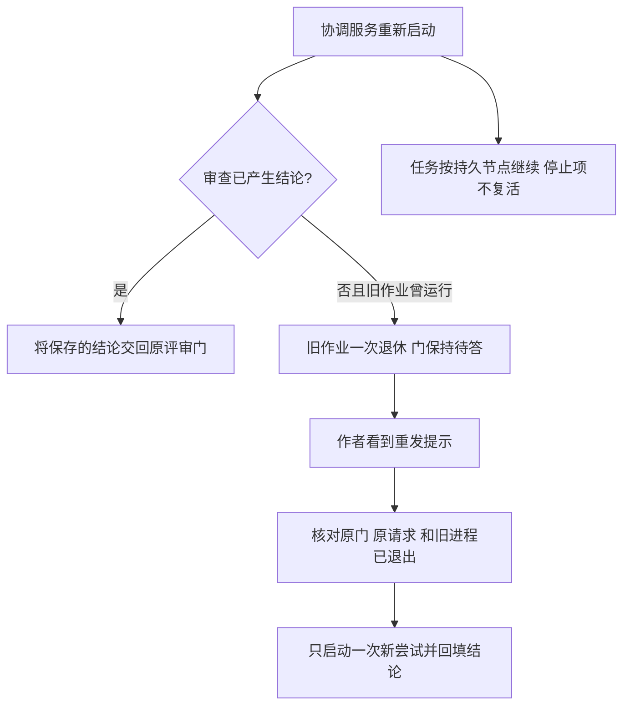

# FLY-2920 重启与负载恢复 — 实施计划
Issue: FLY-2920 (https://linear.app/geoforge3d/issue/FLY-2920/病根修复-4-重启和负载不再把系统自己打垮删卡顿自杀与-250ms-起体判败审查作业与孤儿身份只认领退休一次内存手刹不锁存6-张-59)
日期: 2026-09-26
基于: research.md

状态：待有效 design-review。设计基线 d52df7841。本文为实现合同；没有生产验证或 ship 授权。

## 第一部分：交付给 founder 的结果

一句话：负载高时允许慢，重启后只处理一次旧身份，已经产生的审查结论和工作进度保留，内存恢复便恢复派活并告知。

| 改动 | 用户能观察到的变化 | 验收 |
|---|---|---|
| 卡顿监测 | 协调服务记录卡顿而不自杀，恢复后继续 | 真子进程中制造 stall，服务不退出 137 |
| 起体 | 管道晚于 250ms 关闭仍正常启动 | 两类 Runner 延迟输出仍成功，无空壳挡重试 |
| 审查 | 重启不再自动多起审查；门仍等结果 | 退休→原门 open→作者重发→原门取得结论 |
| 孤儿 | 相同失效身份一次退休，不每轮报告 | 两轮真实文件扫描只退休一次，保留线程等信息 |
| 内存 | 当前读数恢复就放行；暂停/恢复都有解释 | 重启前旧手刹不阻挡健康读数，状态页和准入一致 |
| 旧复活 | 停止令、未推提交、阶段游标不倒退 | 旧自动 successor 零次，DAG 节点按原绑定恢复 |



权衡：删除自杀后，永久卡死不会靠此监测器自动重启；保留独立值守与已有真实退出后的服务恢复。未知身份不自动杀，未知内存不称健康。没有结果的旧审查需要重发，已有结果直接交付。拒绝把 250ms 改成另一拍脑袋时间、给重跑加退避、保留传感器锁存再补释放分支。

## 第二部分：实现合同

### A. 共通身份和不变量

1. 审查逻辑身份保持 `(request_id, execution_id, question_id, review_type, target_repo_identity, frozen_head_sha/plan proof)`；显示文案不是身份。一次认领指一次**执行尝试**；作者授权的同 requestId 重试是新 attempt，不能恢复旧 attempt 的写权限。
2. 门与结论独立持久化；退休不调用答门、不写批准、不撤销已存 verdict、不删除 outbox。只有有效结构化结论及其现有绑定校验能答门。
3. 所有状态转换使用条件更新（CAS：仅当记录仍是预期旧值时才修改）与参数化 SQL；事务只包本库状态，不假装 StateStore 和 CommDB 是同一事务。
4. 无 TURN 不写共享工作树；本节点只设计。实现和 QA 各自使用 controller 所授 TURN；合并与部署分离，仅独立 updater 部署。

### B. 卡顿只观察，不成为自杀开关

修改 `packages/teamlead/src/bridge/BridgeEventLoopGuard.ts`、`plugin.ts`；调整 `src/__tests__/bridge-event-loop-guard.test.ts`、其 `fixtures/loop-guard/run-kill-harness.ts`。

- 删除 worker `process.kill(process.pid,"SIGKILL")` 及 killing/restart 文案；不转移到别的线程/超时器。
- 每个连续无 heartbeat 前进的事件只取证一次。保存 `reportedBeat`，继续廉价 heartbeat 采样；同 beat 不再 ps/写审计。beat 前进后清除此标记，恢复事件最多一次；下一独立 stall 可再次记录。
- 保留现有证据脱敏、log rotate、child/marker attribution；不在繁忙期反复生成重型进程树。停止时取消所有定时器。
- 删除测试对生产 SIGKILL 的正向期待，改真隔离子进程断言：停顿超过阈值、活过观察窗口、恢复、再次停顿有第二条事件。不要只在 testMode 下断言未 kill。
- 同步 `packages/claude-runner/test/fixtures/kill-path-inventory.json` 精确移除该 kill 源；不借机重写其他 kill 路径。`fly1560-teardown-guard.test.ts` 保留监测器存在合同；更新 guard fixture 与相关文案。

### C. 删除 250ms 排空判败，保留完整成功证据

修改 `packages/claude-runner/src/TmuxAdapter.ts:defaultAsyncExecFile`，消费者为 ensureRunnerSession 与 CodexTmuxAdapter 的 async helper。

- 移除 `drainTimeoutMs`、drainTimer 及 `ERR_CHILD_STDIO_DRAIN_TIMEOUT`。成功仍须 exit=0 且 close 已到；不会在 spawn/exit 当刻丢弃尾部输出或伪造成功。
- 使用整次命令 deadline（涵盖 spawn、执行、输出关闭）；调用者 timeout 优先。对未传 timeout 的 helper 调用，默认 90,000ms（沿用现有 ensure attempt 预算）；不可无限等继承管道。所有消费者列清 timeout 和协议解析。
- 保留 maxBuffer/ENOENT/非零 exit/signal 错误和 stdout/stderr；exit 已发生后不再使用负 PID 群杀。deadline 销毁本次管道并 settle 一次。
- 原测试替换：parent exit=0，grandchild 600ms 后输出 tail 并关闭，期望完整 tail 与成功；相同脚本在旧版本应因 250ms 失败。永久持管道则整体 deadline 到时 ETIMEDOUT，输出/计时和无 recycled group kill 均可断言。
- 起体失败收口沿用 `runs-route.ts:releaseFailedWorkflowLaunch`、`run-dispatcher.ts:abortPreLaunch/onSpawnFailed`。注入非零退出与慢 stdio 穿透两种 vendor 起体，断言 run/node/launch claim/CommDB 一致。
- 真实 absent 且 precommit_failed 才释放当前 owner+generation；已 committed/delivered 不回滚，unknown 保持 LAUNCH_PENDING，交现有 generalized-launch-recovery 查同一 handle。不能从观察超时推导死亡。throw 分支写死 absent 的地方若不能证明 pre-spawn，则改用实际 launch outcome，避免误放新体。
- 不清扫生产既存空壳；这需要逐个 run 的身份收据，另交值守。验收须证明新失败不留下不可恢复 admitted blocker，且下一次合法 start/恢复可继续同节点。

### D. 审查：退休旧尝试，保留原门与结果

修改 `review-request-coordinator.ts`、`StateStore.ts`、`claude-review-runner.ts`；协议配套修改 `packages/flywheel-comm/src/commands/check.ts`、`types.ts`、CLI check 输出所在 `index.ts` 以及 `packages/claude-runner/agents/codex-runner-contract.md` 和已存在的 Claude review 指引消费者（当前 agents 搜索仅命中 codex-runner-contract；保留非 request-driven legacy review 行为）。无 CLI 删除/改名。

D1. 启动恢复顺序：

1. 恢复已提交且 request-bound 的 code approval 为 done，使用现有确定性 verdict 恢复逻辑；已 done/skipped 的结果继续原 outbox 投递。没有 reviewer spawn。
2. 对其余上一 Bridge 的 running 做一次条件转换到 `failed`，reason=`bridge_restart_retired`；保存原绑定、清空此尝试 retry_at，记录 `retired_at` 与 attempt。不得调用通用失败 helper 的自动重排副作用。
3. source 为该 reason 的 reuse follower 保留其原门/绑定，记录相同待重发原因，不执行 `releaseReuseBindingToOwnLane`。以后每次 boot、source 失败回调也必须遵守此规则。
4. 从未启动的 pending 仍可首次执行；与重启无关的既有 quota 定时重试继续。曾运行的退休尝试不在任何 automatic enqueue 查询中。

D2. 状态扩展（StateStore additive migration，旧字段不删）：`codex_review_job.attempt_generation INTEGER NOT NULL DEFAULT 0`、`retired_at TEXT NULL`；retry notice 由 failed reason+generation 派生，无需第二套队列。认领事务只允许 pending/failed，generation 加一。完成/失败/延迟 callback 的更新必须带 generation，旧 callback 不能写新尝试结果。复用 binding 添加 `retry_required_reason` 及 source generation，或使用现有明确非终态字段实现同等语义；不得用 responded_at 伪装已答。

D3. 可见重发路径：在 `plugin.ts` 增加 `POST /review-requests/status`，复用 `/review-requests` 的 ingest-token middleware；body 为 `{executionId,questionId}`，coordinator 核对原 question owner/checkpoint 和 job/reuse 绑定，只返回该门的状态，不接收任意文件路径。为未决退休请求提供 `{status:"pending", reviewRetry:{requestId,questionId,reviewType,planPath?,attemptGeneration,reason}}`，保持 question open、无 final response。`check` 在未答时经上述 Bridge endpoint 查询此提示（沿用 request-review 的身份认证；数据库不可用/网络失败仍 pending，不能返回通过）。CLI 打印精确命令 `request-review --request-id <R> --question-id <Q> --type <T> [--plan <P>]`；不得通过 shell 拼接执行。源合同指示作者在看到该结构化提示后显式重发，保留相同 requestId，失败时继续观察，不自动造新 gate。兼容旧客户端只会继续等，Lead 的一次 failure 通知附同一恢复指引。

D4. 防止作者重发又叠一只旧审查体：新尝试 spawn 前持久记录 `(requestId,generation,reviewerSessionUuid,ownerBootId)`，并让子进程携带精确 request+generation 标记；记录 PID/启动身份为补充证据，不凭 PID 单值杀。Bridge 重启只退休作业，不盲杀残存 reviewer。显式 retry 前读取一次精确旧身份进程证据：仍活/unknown 返回 retry-held（门仍 open，不 enqueue），已证实不存在才 CAS 新 generation 并执行。两个并发 retry 只有一个认领赢家。新进程 pre-spawn intent 后崩溃也可通过精确标记判 absent；旧版本无身份记录则明确 `legacy_owner_unverified` 交 Lead 核验，不能猜已死。本单不新建持续 OS 清理器。

D5. 同 request retry 重新校验 open gate、exec、review type、repo、plan/head。head 已动走现有 head-move 合同，不能将旧结果授予新头。follower 作者显式重发才原子转其 own lane； source 完成可先回填 follower，不重复开体。response 赢过 retry 时返回已有结果；closed/superseded/wrong owner 一律无 spawn。

D6. 不丢结果的决定性测试：真实临时 StateStore + CommDB，登记并认领 R/Q→销毁 coordinator（模拟 Bridge 崩溃）→新 coordinator boot 两次→R retired、Q open、spawn=0→旧 process 确认 absent→作者 CLI check 看到 retryRequired→带 R/Q 重发两次→只执行一次→保存 verdict→答原 Q→check 读到结论。另在保存 verdict 与答门之间中断，重启只重投、不重算。已提交 code authority/job 未完成的窗口也必须回填。测试 fake reviewer 输出可以，但真实持久化和 CLI/HTTP 状态读取不能全 stub 掉。

### E. 孤儿身份一次退休，不删除整个 session

修改 `packages/teamlead/src/bridge/codex-runner-orphan-reaper.ts`，增加窄的身份退休 helper；writer `packages/claude-runner/src/CodexTmuxAdapter.ts` 同步 fencing；测试 `packages/teamlead/src/__tests__/codex-runner-orphan-reaper.test.ts`。

- 现有 reader 只有 executionId + daemonPgid。在 `persistSpawnIdentity` 增加每次 spawn 新建的 `daemonOwnershipGeneration` UUID，reader 一并读取；新候选键为 executionId + daemonPgid + generation。旧 ledger 缺 generation 时使用固定 legacy 前缀加 executionId/daemonPgid/已存 codexAgentHome 的规范哈希（不含 display/cursor），并将完整文件 hash 用作提交前竞态校验。新 writer 永远写新 generation，旧退休凭据不会屏蔽新进程。只有该执行最新 inactive、实际已解析 home 路径 lstat 为 ENOENT、marker/路径解析无 unknown 才可退休。
- 用独立的单次退休凭据保存该完整身份指纹（写临时文件+rename；同身份唯一创建），不原位重写共享 session.json，避免与 adapter merge writer 丢更新。ledger loader 对**指纹完全相同**的已退休 ownership 不再产出候选；session 其余字段完全不动。若 adapter 产生新的 daemon generation，新指纹自然可被扫描。名称仅作显示。
- 提交退休前重新读 active execution、home 缺失和 ledger 指纹；变化便拒绝。writer 在写新 generation 时与退休 helper 共用 execution-scoped 文件锁（仅这个 ownership 读写段），防止 check-then-write 竞态；锁失败是 unknown，不删除、不 kill。退休凭据在锁内持久后审计一次，后续扫跳过；审计以同指纹幂等去重，crash 重放不刷屏。
- home inventory 缺席不等于实际 ENOENT；permission、symlink、invalid marker、incomplete probe 都不退休。home 存在而 argv/PGID 不合属于另一路，只保留安全 skip，不扩大删除条件。反向发现真正孤儿和 keyed-home lease 后解析继续有效。
- 不增全局 identity vocab，不删除凭据、线程、gate hold、工作目录。退休记录随同 execution 现有生命周期清理，不新设全仓定时清扫。

### F. 内存准入彻底退出传感器锁存

修改 `machine-watermark.ts`、`fleet-sensors.ts`、`runner-admission.ts`、`capacity-snapshot.ts`、`plugin.ts`、StateStore migration/兼容读 API。

F1. 单一当前快照 `PressureSnapshot={sampledAtMs,source:"vm_stat",freePct,swapoutDeltaPages,baselineAtMs,state:"healthy"|"pressure"|"unknown",reason}`。只存最新读数；相邻完整采样间隔≤2×sensor pollIntervalMs 才可计算 delta，计数倒退/失败/过期要重置 baseline。内存通知 episode 可继续有状态，但不能作为准入阻断位。

F2. 判据明确：新鲜 complete sample 且 freePct<LOW 或 delta>MIN → pressure；delta 已知且 freePct≥HIGH 且 delta≤MIN → healthy；首次 baseline、band、失败、超过2×pollIntervalMs → unknown（reason 区分）。同一次检查消费同一个快照。pressure 拒绝、healthy 放行此项、unknown 返回暂缓及 retryAfter=一个采样周期，下一次健康读数自动放行，不保留旧危险位。传感器明确关闭时此项 disabled，不因缺快照误停全队；保留已有 load/最低 free bytes 等独立护栏。

F3. 删除 `ensureSensorHold/liftSensorHold` 作为传感器权威的路径。admission 不再读取 sensor DB 行；capacity 的压力原因与放行结果读同一 snapshot，标明时间、来源、% free 与 pages/tick 单位。历史 `set_by='swap-sensor'` 行一次迁移删除；无法删除也不能继续阻挡。非 sensor 行保留为 operator pause 兼容输入，明确显示“人工暂停”，不被健康读数自动撤销。传感器 pressure/unknown 沿用 typed reason `pressure_hold` 并提供 snapshot.reason，人工暂停映射 `admission_paused`；同步 `lead-backends/codex/runner-action-http.ts` 和 capacity 映射，旧客户端仍理解暂停。不 drop 表以免破坏脚本读表/人工兼容。

F4. 暂缓/恢复通知基于当前压力决策的变化，借现有 owner-routed alert/Lead 事件通道，使用独立 kind/reason 防止吞掉别的通知。一 episode 的 pause/resume 事件各一份持久去重键；只有 durable accepted 才标已发送，失败重试不改变准入结果。短于旧告警 debounce 的 episode 也能告知恢复。持久 episode/通知历史仅供消息，不参与 admission。boot 用历史通知补恢复告知，但不能恢复旧手刹。

F5. `swapPressureRepair` 与 recovery probe 只读取当前 snapshot；旧排队 alert 不再能 setFleetPressureHold。已有告警工单可继续 resolve。通知到达不证明快照当前有效，页面/准入都即时检查新鲜度。

### G. 旧复活路径与进度保护

修改 `rescue-runtime.ts`、`plugin.ts` 的 legacy auto successor wiring；`progress-resume.ts`、`run-infra.ts` 对 engine-owned 恢复入口的阶段来源。保留人工授权 start/retry 的现有入口。

- 删除自动 sweep/boot rescue 的 terminate→close→unbound startSuccessor 行为；相关自动入口给 `legacy_recovery_retired` 可见处置，不能换名转发到 start。DAG 交已有 workflow node recovery；非 DAG 遗留项由 Lead 明确处理，一次通知、不每 tick 复活。
- engine-owned recovery 必須提供 runId/nodeId/attempt/execution 绑定，phase 从持久 workflow_run_node 解析。session_stage 不参与相位决策；progress.md 仍是工作内容游标但不能推翻停止终态。无节点/冲突/读取未知给拒绝收据，不能退到 legacy produce。
- 维持 local branch 优先与同 ref 的 tip/文件/ledger pin；禁止强重置 main、摘未推提交或覆盖描述。停止/取消以现有 issue/node terminal receipt 判定，boot 不能重开。
- 旧设计与治理指令不被本单“全面迁移”；仅删除六单对应自动入口。实现前对 `makeCloseAndDispatchSuccessor/startSuccessor/session_stage` 消费点做精确 sweep，列出 retained display/manual 与 removed auto，避免留下隐藏自动调用。

## 第三部分：实施顺序与可执行验收

每组按“先写失败用例→在旧代码确认失败原因→最小改动→同用例通过→相关回归→提交”。顺序 B→C→D→E→F→G→联合回归；D 的存储/HTTP/CLI/提示必须同一提交组，不发布半协议。不得边实现边扩总恢复框架。

| 组 | 测试文件（包内路径） | 必须保留的反例 |
|---|---|---|
| B | teamlead `src/__tests__/bridge-event-loop-guard.test.ts` | 非 testMode 真 worker，不自杀、取证一次、恢复后二次事件 |
| C | claude-runner `test/async-exec-file.test.ts`, `test/TmuxAdapter.test.ts`, `test/CodexTmuxAdapter.test.ts` | 非零退出/ENOENT/超时/overflow 仍失败；两个 vendor 延迟600ms成功 |
| C lifecycle | teamlead `src/bridge/__tests__/run-dispatcher-pre-registration-cleanup.test.ts`, `src/__tests__/runs-route-generalized-pending.test.ts`, `src/bridge/__tests__/generalized-launch-recovery.test.ts` | absent失败收口；alive/unknown不重开；原 claim 可恢复 |
| D | teamlead `src/bridge/__tests__/review-request-coordinator.test.ts`, `src/__tests__/StateStore.codex-review.test.ts`; flywheel-comm `src/__tests__/request-review.test.ts`；新 `src/__tests__/review-retry-status.test.ts` | 原门不丢；boot两次零spawn；作者重发一次spawn；旧generation回调被拒；follower不自动重跑 |
| E | teamlead `src/__tests__/codex-runner-orphan-reaper.test.ts` | home未知/活execution/换代/新home/复用PGID不退休；session其余字节保留 |
| F | teamlead `src/bridge/__tests__/machine-watermark.test.ts`, `fleet-sensors.test.ts`, `pressure-hold.test.ts`, `capacity-snapshot.test.ts`; `src/__tests__/capacity-route.test.ts` | 旧sensor行无权；人工pause保留；读数过期/失败、真实swap增长都不假健康；通知失败不锁派发 |
| G | teamlead `src/__tests__/rescue-runtime.test.ts`, `src/bridge/__tests__/progress-resume.test.ts`, `run-infra-continuity.test.ts` | terminal不复活；未推tip/description/cursor不改；未知node不退main |

命令模板（从仓根执行；每次列出该组具体文件，禁止把下式文件名单变为整包）：

```sh
pnpm --filter flywheel-teamlead exec vitest run src/__tests__/bridge-event-loop-guard.test.ts --maxWorkers=1 --minWorkers=1
pnpm --filter flywheel-claude-runner exec vitest run test/async-exec-file.test.ts --maxWorkers=1 --minWorkers=1
pnpm --filter flywheel-teamlead exec vitest run src/bridge/__tests__/review-request-coordinator.test.ts src/__tests__/StateStore.codex-review.test.ts --maxWorkers=1 --minWorkers=1
pnpm --filter flywheel-comm exec vitest run src/__tests__/request-review.test.ts src/__tests__/review-retry-status.test.ts --maxWorkers=1 --minWorkers=1
```

运行前核包名、测试脚本及临时根；以 `mkdtemp` 为测试状态、CommDB、StateStore、Codex homes 和临时 review 目录，给启动 Bridge 的夹具注入 `FLYWHEEL_CODEX_HOMES_ROOT` 隔离根；不得改宿主 HOME。只跑白名单相关测试，不开真实 GUI、不真实打高负载>100、不使用生产凭据。重负载用可控调度/管道延迟复现；报告清楚“受控延迟复现”不是线上高负载实测。

新建联合证据文件 `engineering/doc/FLY-2920-restart-load-safety/acceptance.md`（实现/QA 填）：每个 FLY ID 记录旧版失败、修后结果、commit、命令、夹具身份、负例、是否真实进程/真实数据库。六项任一缺证均不得称完成。回归必须覆盖表中全部实际受影响现有测试；SKIP/空测试不计绿。

## 迁移、回滚、边界

- additive 数据字段可被旧版本忽略，但**旧版本会重启重排与读旧 sensor 行**，所以不能把直接回滚代码叫安全恢复。回滚前暂停新 review/admission 工作并由 Lead 选择向前修复或受控版本切换；本设计不授权生产操作。
- 旧 verdict/gate/repo/head、人工 pause、session.json 元数据和工作分支不重写；新退休记录保持可审计。
- 旧版本无 reviewer ownership 的遗留项可能需要一次人工核验才能重发；新协议下自动路径必须有完整身份证据。
- 长期完全无内存读数会明确显示 unknown 暂缓，需要修复采样；这是当前证据不足，不是旧 pressure 位永久锁存。
- 非目标：通用进程杀器、全库清洗、扩大自动重试、账号/并发/班车重构、生产故障复演、部署。原六单结果不因这些排除被缩减。

## 设计节点交付门

探索/调研/计划提交并推送→注入 gate review_design + request-review→仅认有效 reviewVerdict=APPROVED→最终 founder HTML（真实本地 Mermaid 或明确 render pending）提交推送→publish-only→核托管HTTP/CSP/源字节与交互→向 Lead 报 URL→progress→complete --route phase_design_complete→park。任何迟到修改先查 TURN。
