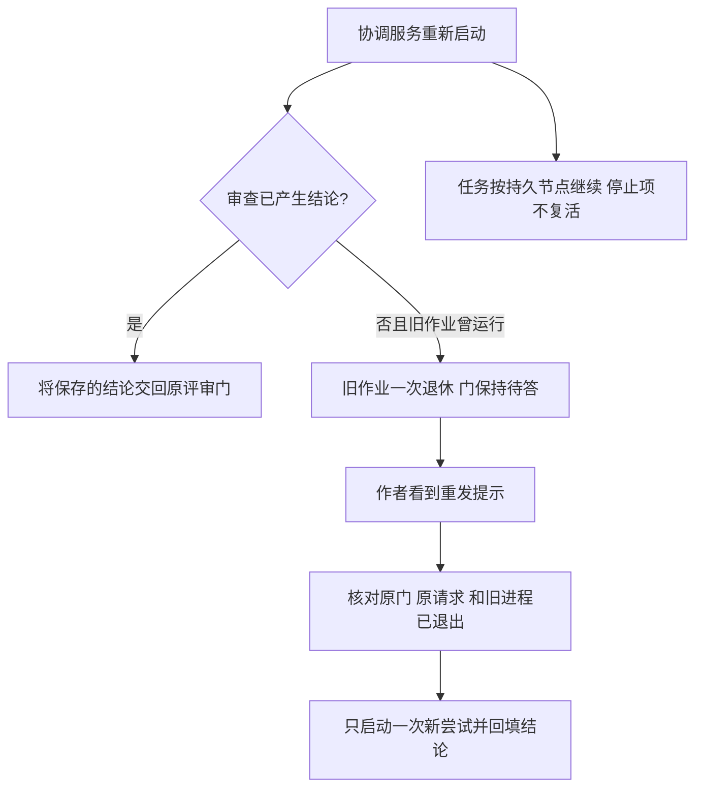

# FLY-2920 重启与负载恢复 — 实施计划
Issue: FLY-2920 (https://linear.app/geoforge3d/issue/FLY-2920/病根修复-4-重启和负载不再把系统自己打垮删卡顿自杀与-250ms-起体判败审查作业与孤儿身份只认领退休一次内存手刹不锁存6-张-59)
日期: 2026-09-26
基于: research.md

状态：R3 CHANGES_REQUESTED 已修订，待 R4 有效 design-review。设计基线 d52df7841。本文为实现合同；没有生产验证或 ship 授权。

## 第一部分：交付给 founder 的结果

一句话：负载高时允许慢，重启后只处理一次旧身份，已经产生的审查结论和工作进度保留，内存恢复便恢复派活并告知。

| 改动 | 用户能观察到的变化 | 验收 |
|---|---|---|
| 卡顿监测 | 协调服务记录卡顿而不自杀，恢复后继续 | 真子进程中制造 stall，服务不退出 137 |
| 起体 | 管道晚于 250ms 关闭仍正常启动 | 两类 Runner 延迟输出仍成功，无空壳挡重试 |
| 审查 | 重启不再自动多起审查；门仍等结果 | 退休→原门 open→作者重发→原门取得结论 |
| 孤儿 | 相同失效身份一次退休，不每轮报告 | 两轮真实文件扫描只退休一次，保留线程等信息 |
| 内存 | 当前读数恢复就放行；首次升级/主机重启通常约30–35秒采样等待，最多60秒；暂停/恢复都有解释 | 重启前旧手刹不阻挡健康读数，状态页和准入一致；真实生产接线下采样不受十分钟巡检阻塞 |
| 旧复活 | 停止令、未推提交、阶段游标不倒退 | 重启零次 unbound successor，DAG 节点按原绑定恢复 |



权衡：删除自杀后，永久卡死不会靠此监测器自动重启；保留 `scripts/bridge-liveness-probe.sh`（外部健康探针，连续 5 分钟不可用只告警、不自动重启）与已有真实退出后的服务恢复。未知身份不自动杀，未知内存不称健康。没有结果的旧审查需要重发，已有结果直接交付。拒绝把 250ms 改成另一拍脑袋时间、给重跑加退避、保留传感器锁存再补释放分支。

## 第二部分：实现合同

### A. 共通身份和不变量

1. 审查逻辑身份保持 `(request_id, execution_id, question_id, review_type, target_repo_identity, frozen_head_sha/plan proof)`；显示文案不是身份。一次认领指一次**执行尝试**；作者授权的同 requestId 重试是新 attempt，不能恢复旧 attempt 的写权限。
2. 门与结论独立持久化；退休不调用答门、不写批准、不撤销已存 verdict、不删除 outbox。只有有效结构化结论及其现有绑定校验能答门。
3. 所有状态转换使用条件更新（CAS：仅当记录仍是预期旧值时才修改）与参数化 SQL；事务只包本库状态，不假装 StateStore 和 CommDB 是同一事务。
4. 无 TURN 不写共享工作树；本节点只设计。实现和 QA 各自使用 controller 所授 TURN；合并与部署分离，仅独立 updater 部署。

### B. 卡顿只观察，不成为自杀开关

修改 `packages/teamlead/src/bridge/BridgeEventLoopGuard.ts`、`bridge-exit-marker.ts`、`plugin.ts`；调整 `src/__tests__/bridge-event-loop-guard.test.ts`、其 `fixtures/loop-guard/run-kill-harness.ts`。

- 删除 worker `process.kill(process.pid,"SIGKILL")` 及 killing/restart 文案；不转移到别的线程/超时器。
- 每个连续无 heartbeat 前进的事件只取证一次。保存 `reportedBeat`，继续廉价 heartbeat 采样；同 beat 不再 ps/写审计。beat 前进后清除此标记，恢复事件最多一次；下一独立 stall 可再次记录。
- 保留现有证据脱敏、log rotate、child/marker attribution；不在繁忙期反复生成重型进程树。停止时取消所有定时器。
- 删除测试对生产 SIGKILL 的正向期待，改真隔离子进程断言：停顿超过阈值、活过观察窗口、恢复、再次停顿有第二条事件。不要只在 testMode 下断言未 kill。
- 永久 wedge 的验收：隔离 Bridge `/health` 超时→外部 `bridge-liveness-probe.sh` 达阈值只 page 一次→恢复一次 all-clear；用测试 sink，不向生产发信。值守核对实际 service label/进程与诊断后，按既有 `scripts/restart-services.sh` runbook 由有权限操作者恢复 `com.flywheel.bridge`；本单不运行 kickstart，也不把手工路径改为自动 kill。
- `bridge-exit-marker.ts` 的 stall 记录仅作为诊断线索，不再作为退出原因；`buildAbnormalExitAlertContent` 统一使用“Bridge 非正常退出”，若附带同代 stall 明示“曾观察到卡顿，退出原因未证实”。保留 pid/bootTs 绑定与告警幂等键，不凭最近一条 stall 推断自杀。补 `bridge-exit-marker.test.ts`：stall→恢复→其他原因退出，以及未恢复 stall→退出，两者均不声称自杀。
- 同步 `packages/claude-runner/test/fixtures/kill-path-inventory.json` 精确移除该 kill 源；不借机重写其他 kill 路径。`fly1560-teardown-guard.test.ts` 保留监测器存在合同；更新 guard fixture 与相关文案。

### C. 删除 250ms 排空判败，保留完整成功证据

修改 `packages/claude-runner/src/TmuxAdapter.ts:defaultAsyncExecFile`，消费者包含 ensureRunnerSession 与 CodexTmuxAdapter 的 async helper，以及跨包 git/命令探针。实施时在 acceptance.md 逐项记下当前 timeout：edge-worker 的 Blueprint.ts、WorktreeManager.ts；teamlead 的 ActionExecutor.ts、fleet-console.ts、phase-branch-tip.ts、run-infra.ts、workflow-docs-git.ts；TmuxAdapter.ts 的其余调用。目前这些跨包调用都传 timeoutMs，删除 drain 后要等各自整体 deadline；补至少一项 WorktreeManager 或 run-infra 非 claude-runner 包回归。

- 移除 `drainTimeoutMs`、drainTimer 及 `ERR_CHILD_STDIO_DRAIN_TIMEOUT`。成功仍须 exit=0 且 close 已到；不会在 spawn/exit 当刻丢弃尾部输出或伪造成功。
- 使用整次命令 deadline（涵盖 spawn、执行、输出关闭）；调用者 timeout 优先。对未传 timeout 的 helper 调用，默认 90,000ms（沿用现有 ensure attempt 预算）；不可无限等继承管道。所有消费者列清 timeout 和协议解析。
- 保留 maxBuffer/ENOENT/非零 exit/signal 错误和 stdout/stderr；exit 已发生后不再使用负 PID 群杀。deadline 销毁本次管道并 settle 一次。
- 原测试替换：parent exit=0，grandchild 600ms 后输出 tail 并关闭，期望完整 tail 与成功；相同脚本在旧版本应因 250ms 失败。永久持管道则整体 deadline 到时 ETIMEDOUT，输出/计时和无 recycled group kill 均可断言。
- 起体失败收口沿用 `runs-route.ts:releaseFailedWorkflowLaunch`、`run-dispatcher.ts:abortPreLaunch/onSpawnFailed`。注入非零退出与慢 stdio 穿透两种 vendor 起体，断言 run/node/launch claim/CommDB 一致。
- 真实 absent 且 precommit_failed 才释放当前 owner+generation；已 committed/delivered 不回滚，unknown 保持 LAUNCH_PENDING，交现有 generalized-launch-recovery 查同一 handle。不能从观察超时推导死亡。throw 分支写死 absent 的地方若不能证明 pre-spawn，则改用实际 launch outcome，避免误放新体。
- 不清扫生产既存空壳；这需要逐个 run 的身份收据，另交值守。验收须证明新失败不留下不可恢复 admitted blocker，且下一次合法 start/恢复可继续同节点。

### D. 审查：退休旧尝试，保留原门与结果

修改 `review-request-coordinator.ts`、`StateStore.ts`、`claude-review-runner.ts`；协议配套修改 `packages/flywheel-comm/src/commands/check.ts`、`types.ts`、CLI check 输出所在 `index.ts` 以及 `packages/claude-runner/agents/codex-runner-contract.md` 、`packages/edge-worker/src/Blueprint.ts` 的 design/code 注入段及 `src/__tests__/Blueprint.fly1188-codex-prompt.test.ts`/对应 snapshot（不能只扫 agents 目录）。无 CLI 删除/改名。

D1. 启动恢复顺序：

1. 恢复已提交且 request-bound 的 code approval 为 done，使用现有确定性 verdict 恢复逻辑；已 done/skipped 的结果继续原 outbox 投递。没有 reviewer spawn。
2. 对其余上一 Bridge 的 running 做一次条件转换到 `failed`，reason=`bridge_restart_retired`；保存原绑定、清空此尝试 retry_at，记录 `retired_at` 与 attempt。不得调用通用失败 helper 的自动重排副作用。
3. source 为该 reason 的 reuse follower 保留其原门/绑定，记录相同待重发原因，不执行 `releaseReuseBindingToOwnLane`。以后每次 boot、source 失败回调也必须遵守此规则。
4. 从未启动的 pending 仍可首次执行；与重启无关的既有 quota 定时重试继续。曾运行的退休尝试不在任何 automatic enqueue 查询中。
5. 优雅关停同样使用退休事务：`stop()` 先置 stopped、阻止新认领及回调分类，对本 Bridge 所有仍 running 的 generation 条件退休并写 notice，再由原 `killAllClaudeReviewChildren` 终止子进程。runJob 的每个异步返回点在存储 outcome 前重验 stopped、generation 和 running 状态；stop 之后不得写普通 nonzero_exit、自动重排或覆盖已存 verdict。若崩溃发生在退休事务前，下次 boot 处理仍 running；事务后则幂等重投 notice。done/verdict 已先提交者仍只投递其结果。不要假定 stop() 当前已具备此语义。

D2. 状态扩展（StateStore additive migration，旧字段不删）：`codex_review_job.attempt_generation INTEGER NOT NULL DEFAULT 0`、`retired_at TEXT NULL`；retry notice 由 failed reason+generation 派生，无需第二套队列。认领事务只允许 pending/failed，generation 加一。完成/失败/延迟 callback 的更新必须带 generation，旧 callback 不能写新尝试结果。复用 binding 添加 `retry_required_reason` 及 source generation，或使用现有明确非终态字段实现同等语义；不得用 responded_at 伪装已答。

D3. 可见重发路径：在 `plugin.ts` 增加 `POST /review-requests/status`，复用 `/review-requests` 的 ingest-token middleware；body 为 `{executionId,questionId}`，coordinator 核对原 question owner/checkpoint 和 job/reuse 绑定，只返回该门的状态，不接收任意文件路径。为未决退休请求提供 `{status:"pending", reviewRetry:{requestId,questionId,reviewType,planPath?,attemptGeneration,reason}}`，保持 question open、无 final response。`check` 在未答且本地 question checkpoint 是 review_design/review_code 时才经上述 Bridge endpoint 查询此提示；其他 gate 零新增 HTTP 请求。返回仅限重发所需绑定与状态，共享 ingest token 不被当作执行体独占凭据。查询沿用 request-review 的认证通道；数据库不可用/网络失败仍 pending，不能返回通过。CLI 打印精确命令 `request-review --request-id <R> --question-id <Q> --type <T> [--plan <P>]`；不得通过 shell 拼接执行。源合同指示作者在看到该结构化提示后显式重发，保留相同 requestId，失败时继续观察，不自动造新 gate。兼容旧客户端只会继续等，Lead 的一次 failure 通知附同一恢复指引。

D3a. **作者停等也必须收到通知，不能依赖它主动 check。** 在 StateStore 增加窄表 `review_recovery_notice`，键 `(request_id,attempt_generation,stage)`，stage 为 `retired|ready|operator_required`；保存精确 question/execution、不可变 notice 文本与 pending/delivered/acted 状态。退休事务同时写 retired notice；与 CommDB 的投递用持久 outbox 重放。coordinator 的启动及下述新增 recovery pass 只排送这些通知，绝不因此执行 reviewer。

- sink 使用 `CommDB.insertInstructionAndClearDeclaredState`，稳定消息 id=`review-recovery:<request>:<generation>:<stage>`，sender 为真实 `bridge` provenance，不冒充 Lead/审批。正文含恢复原因、原 R/Q/type/plan、精确重发命令及“先核 TURN，仅可恢复原评审，不是最终裁决”。既有 `RunnerMailboxLane` + `wakeRunnerMailbox` 负责真实 transport、重试与消费；只在 durable enqueue 后 stamp outbox，断点重复投递是同 id，不多生消息。
- **传输 ACK 不等于模型已恢复。** 扩展 `CodexTmuxAdapter` / `codex-daemon-client.ts` / `codex-daemon-goal-runtime.ts` 的 gate-hold 输入：新增 `readActionableReviewRecovery`（从当前执行的持久未 acted 通知投影读取），在正常 CommDB `hasPendingBlockingGateFrom` 和 marker fallback 两条分支中，都允许待处理 review recovery 启动一个工作 turn；不调用 markGateAnswered，不填 answeredAt，不删 gate，不释放其他审批的权限。marker 增加 `recoveryNoticeId` 非终态提示只作 fallback；真实 notice 仍需校验 R/Q/exec/generation。原 final verdict marker 语义保持不变。
- 同一 turn 明确重发被服务端接受后，将 notice acted，并回到原 gate-hold；`retry-held` 则原子写 recovery_state=held/next_probe_at，retired notice acted。由新增 recovery pass 每 30s 对这个**有限旧 attempt**做身份检查；发现 absent 时一次写 ready notice，再走相同 outbox/doorbell/hold 唤醒。期间不重审、不起 reviewer、不每 tick 发消息。重启从 held 行恢复观察同一身份，不重建 attempts。
- deadline 到达而不能安全证明退出时写 operator_required，停止自动身份巡查并向 owning Lead 提交明确所需证据（不能静默 hold）。作者收到这份有限状态结果，不自动无限 reissue。notice 不给 TURN；当前 execution 已 terminal 或不再绑定该节点时不激活旧体，通知转交当前 holder/Lead，原 gate 按现有绑定规则处置。
- 明确新增 coordinator `runRecoveryPass()`，复用现有注入式 setTimer/clearTimer，采用一次性 timer 在上一回合结束后安排下一次（30s），以单飞 guard 防止 boot/manual/timer 重入，绝不叠加慢回合。启动立即一次，停止清 timer、禁止重新安排，并在每次 await 后重验 stopped。回合按原预算到期优先，随后 bounded batch（每回合最多 100 条，按 next_probe_at/request_id 排序并推进游标）重投 pending notice、探测精确退休身份及 held→ready；每回合另有5s调度预算，到点不开始下一项并保存游标；每项失败更新 next_probe_at=now+30s，不能导致全回合永停或反复占住队首。每次探测/投递设 5s 上限；观察超时只算 unknown，绝不视为死亡。stop 时取消尚未开始的工作，已进行的投递仅可幂等落收据；不得起 reviewer。该窄回合是新增代码，不宣称现有 quota armRetryTimer 或 account-switch 回合已实现它。
- 补消费者测试：真实 persisted gate-open + gateHold=true + 队列通知 + daemon hold 读路径，覆盖 CommDB 和 marker fallback；仅手工调用 CLI 不算。进程/传输探针允许隔离替身，但必须断言实际作者 turn 被调用并消费同一 notice，后续 request-review 是该 turn 的动作。

D4. 防止作者重发又叠一只旧审查体：新尝试 spawn 前持久记录 `(requestId,generation,reviewerSessionUuid,ownerBootId)`，并让子进程携带精确 request+generation 标记；记录 PID/启动身份为补充证据，不凭 PID 单值杀。Bridge 重启只退休作业，不盲杀残存 reviewer。显式 retry 前读取一次精确旧身份进程证据：仍活/unknown 返回 retry-held（门仍 open，不 enqueue），已证实不存在才 CAS 新 generation 并执行。两个并发 retry 只有一个认领赢家。新进程 pre-spawn intent 后崩溃也可通过精确标记判 absent；旧版本优先用已存 reviewerSessionUuid 对照 argv 中精确 `--session-id/--resume`，再核对执行目录、process start identity、PGID 与原作业 started_at；无法精确对应才 `legacy_owner_unverified`。持久 `reviewer_started_at + configured_timeout_ms` 是原预算（默认30分钟），重启不延长。截止前保持 held；截止时仅对重新验证匹配的原进程组通过现有 exact-identity kill guard 发一次终止并验证退出，禁止裸 PID 群杀。成功退出才 ready wake；身份未知/杀后仍活则 operator_required，一次告知 Lead，附 R/Q/session UUID/预算/探测原因，不把它视为可重试。原预算管理覆盖全部退休 attempt，不依赖作者是否重发或是否仍活。boot 退休时即登记固定 deadline；新代精确身份在原预算到期后走同一 exact-identity guard 并验证退出，旧身份可精确证实时同样处理。无法精确证明的 legacy 项一次 operator_required、不杀。作者不重发/旧客户端/terminal 时也不能遗留无限期 reviewer；只对本表已知有限退休身份处理，不扫描全机。作者仍待答时才投 ready wake；其他情况只保存收口记录。重启不延长 deadline，operator_required/已退休完结者不再巡查。

D5. 同 request retry 重新校验 open gate、exec、review type、repo、plan/head。head 已动走现有 head-move 合同，不能将旧结果授予新头。follower 作者显式重发才原子转其 own lane； source 完成可先回填 follower，不重复开体。response 赢过 retry 时返回已有结果；closed/superseded/wrong owner 一律无 spawn。

D6. 不丢结果的决定性测试：真实临时 StateStore + CommDB，登记认领 R/Q，作者进入持久 gateHold/park 且**禁止测试直接替作者 check**→销毁 coordinator（模拟 Bridge 崩溃）→新 coordinator boot 两次→R retired、Q open、spawn=0→队列投递 retired notice、真实 hold 消费路径启动作者 turn→作者重发得到 held→旧 process 退出→recovery pass 写 ready notice、再次唤醒作者→作者带 R/Q 重发两次→只执行一次→保存 verdict→答原 Q→作者 check 取得结论。增加 transport 首次失败且不重启（下个 recovery pass 即重投）、enqueue 后 crash-before-stamp、模型消费前 daemon 重启、通知晚于最终 verdict、其他 gate 同时未答、优雅 stop→kill 与 verdict 回调竞态、作者始终不重发而旧 reviewer 到期七类断点；断言 recovery pass 不重入、停止后无新 timer/认领、过载分批不饿死到期项；无重复 spawn、无伪造 answeredAt、不得推进其他 gate。另在保存 verdict 与答门之间中断，重启只重投、不重算。已提交 code authority/job 未完成的窗口也必须回填。测试 fake reviewer 输出可以，但真实持久化和 CLI/HTTP 状态读取不能全 stub 掉。

### E. 孤儿身份一次退休，不删除整个 session

修改 `packages/teamlead/src/bridge/codex-runner-orphan-reaper.ts`，增加窄的身份退休 helper；writer `packages/claude-runner/src/CodexTmuxAdapter.ts` 同步 fencing；测试 `packages/teamlead/src/bridge/__tests__/codex-runner-orphan-reaper.test.ts`。

- 现有 reader 只有 executionId + daemonPgid。在 `persistSpawnIdentity` 增加每次 spawn 新建的 `daemonOwnershipGeneration` UUID，reader 一并读取；新候选键为 executionId + daemonPgid + generation。旧 ledger 缺 generation 时使用固定 legacy 前缀加 executionId/daemonPgid/已存 codexAgentHome 的规范哈希（不含 display/cursor），并将完整文件 hash 用作提交前竞态校验。新 writer 永远写新 generation，旧退休凭据不会屏蔽新进程。只有最新执行 inactive 且完整探测证明旧 daemon ownership 已失效才可退休：A 实际解析 home 的 lstat=ENOENT 且路径无 unknown；B home 存在，但完整进程快照显示旧 PGID 为空、对应 socket 无持有者，且无相同 generation 的存活进程。B 仅退休旧 daemon ownership，绝不删除 home。
- 用独立的单次退休凭据保存该完整身份指纹（写临时文件+rename；同身份唯一创建），不原位重写共享 session.json，避免与 adapter merge writer 丢更新。ledger loader 对**指纹完全相同**的已退休 ownership 不再产出候选；session 其余字段完全不动。若 adapter 产生新的 daemon generation，新指纹自然可被扫描。名称仅作显示。
- 提交退休前重新读 active execution、缺失证据和 ledger 指纹；变化便拒绝。**不在 spawn writer 上加锁或等待**：旧 generation 的退休凭据不能匹配并发新 UUID，天然不屏蔽新体。旧版 ledger 的 legacy 指纹不会匹配升级后任何新 spawn。读取后变化只会让旧凭据无效，不覆写 session，所以不需要共享文件锁。
- 同一 fingerprint 的退休采用 exclusive-create/atomic publish；审计以同指纹幂等，crash 重放不刷屏。home inventory 缺席不等于 ENOENT；permission、symlink、invalid marker、incomplete probe 都不退休。home 在但 PGID 非空且 argv 不匹配时不 kill、不退休，以 `(fingerprint,reason,evidenceDigest)` 去重审计；证据变化才新增一条。测 A/B 两分支，不把只测 A 叫 FLY-2323 全量覆盖；反向发现真正孤儿及 keyed-home lease 后解析继续有效。
- 不增全局 identity vocab，不删除凭据、线程、gate hold、工作目录。退休记录随同 execution 现有生命周期清理，不新设全仓定时清扫。

### F. 内存准入彻底退出传感器锁存

修改 `machine-watermark.ts`、`fleet-sensors.ts`、`runner-admission.ts`、`capacity-snapshot.ts`、`plugin.ts`、StateStore migration/兼容读 API；新增 `packages/teamlead/src/bridge/pressure-sampler.ts`，同步 `lead-reconcile-pass.ts` 的传感器职责与接线测试。

F0. **生产采样节拍必须真实独立，P 不取 GatePoller 的配置或陈旧注释。** 当前唯一生产驱动为 `runLeadReconcilePass.tickFleetSensors`，GatePoller 3秒×200 tick约10分钟，重型回合单飞跳过会更慢。明确从该回合移出 swap 采样，不改 bot/zombie/Lead identity 等其他巡检节拍。

- 在 `pressure-sampler.ts` 导出唯一常量 `PRESSURE_SAMPLE_INTERVAL_MS=30_000` 与 `PRESSURE_READ_TIMEOUT_MS=5_000`。采样器负责 vm_stat、baseline、F1/F2决策和窄缓存写入；不等待任何Lead巡检、通知HTTP、修复作业或zombie扫描。其snapshot是F1唯一来源，FleetSensors不再有另一份MemoryPressureMonitor。
- 组合根 `plugin.ts` 在StateStore可用后、开放Runner admission之前创建并 `start()` 采样器，冻结必要的warmupUntil，并立即发起第一个样本；30秒后第二次启动读取，通常≤35秒有可算delta。`FleetSensors` 即使在较晚的alertHub接线处创建，也只消费这个已有采样器；不能让首次采样继续等late holder或Lead reconcile。所有内部/HTTP admission入口共用该早期snapshot provider。
- 采用实际单调时间的固定30秒起始节拍与一个inFlight守卫；一个vm_stat最多5秒，超时终止/关闭本次探针并记unknown。若到期时仍inFlight则记录missed sample而不并行；回合结束后安排下一个未来节拍，禁止补跑突发。`stop()`取消timer和在途探针，迟到回调不提交、无后续timer；plugin正常关停在store.close之前await stop。传感器关闭时不开timer。
- sampledAt以真实完成读数时间记录；一次失败造成相邻成功读数最大约65秒（30秒节拍加5秒读取抖动），故证据/baseline新鲜度明确为3P=90秒，warm-up仍最多2P=60秒。不会以名义30秒假装读到了新样本。主循环完全卡死仍可能迟采，不能承诺物理上永远≤30秒；实际间隔超过90秒就按F2退化并告知，admission每次调用按now重新算过期。
- F4通知状态在采样后独立记录；异步发送失败/缓慢不能占住采样inFlight。已有通知通道的投递单飞、先持久记录后后台发送；alertHub尚未接线时保留pending，接线后重投，不重复采样。`FleetSensors.tick()`留下bot/zombie职责，原swapTick转为消费快照/通知的路径，禁止它再调用vm_stat。修改lead-reconcile-pass接线与测试，明确重型回合零swap采样。
- 必须新增 `src/bridge/__tests__/pressure-sampler-wiring.test.ts` 组合根验收：通过生产的创建/start/stop接线启动隔离runtime，使用真实30秒timer和受控vm_stat替身（仅I/O替身，不手工tick、不替换scheduler、不fake clock），故意令Lead reconcile promise挂起超过65秒，断言仍观察到约0/30/60秒的三次读取开始、每次启动间隔30秒加小量调度容差（健康测试机≤35秒），swap累计增加被识别而非永远unknown。若环境超过容差，不把该项标绿，记录实际调度延迟。第二样本正常时首次部署准入≤35秒恢复；采样全失败时warming在60秒截止且显示degraded；shutdown后无下一读取。另以确定性时钟测试单飞、读取5秒超时、缓存跨重启、2P/3P边界和禁止补跑。只有纯函数单测不算生产接线证据。

F1. 单一决策快照 `PressureSnapshot={sampledAtMs,source:"vm_stat",freePct,swapoutDeltaPages,baselineAtMs,state:"healthy"|"pressure"|"warming"|"unknown",reason,evidenceValidUntilMs}`；准入和 capacity 都调用同一 `evaluatePressure(now)`，即时校验新鲜度，而非只读上次评估值。保存最多两个完整采样及最近一次已确认 pressure 的证据时间。相邻完整采样间隔≤3×PRESSURE_SAMPLE_INTERVAL_MS 才计算 delta；单次读失败不立即丢 baseline，超过此间隔或累计计数倒退才重置。失败与通知不能刷新 sampledAt 或 evidenceValidUntil。

F2. 有限的新鲜度保护，不使用永久暂停位。令 P=PRESSURE_SAMPLE_INTERVAL_MS=30,000ms；证据有效期最多3P=90秒，读时还取存储期限与当前配置计算期限的较早者。

| 当前证据 | 本项准入 | 期限与转换 |
|---|---|---|
| 有效 delta≤MIN 且 freePct≥LOW，含8–15% band | 立即放行 | 清除旧 pressure 依据；不等两次恢复，不要求达到 HIGH |
| 正常运行时连续两次有效 danger（freePct<LOW 或 delta>MIN） | 暂停 | 最新确认样本产生有效期≤3P的 pressure 证据 |
| 已有仍新鲜 pressure + 一次失败/未知 | 暂停至原证据到期 | 失败不续期；下个≤3P完整样本跨空档算 delta，有效 non-danger 立即放行；有效 danger 可刷新压力证据 |
| 全新采样链、boot 无可验证的新鲜样本 | warming，有界暂缓 | 首次启动该采样链即冻结 warmupUntil=startedAt+2P；第一次可算 delta 的 non-danger 立即放行，danger 则保守进入 pressure（启动专用一次确认），后续 non-danger 即解除。不能在每次读失败或 Bridge 重启时重设期限 |
| 证据与 warm-up 都已到期，仍无法计算 | unknown/degraded，本项放行并一次告警 | 不伪称健康；不无限保留历史 pressure，也不重新进入启动等待。后续新鲜样本按正常确认规则恢复 |
| 传感器明确关闭 | disabled，本项不阻断 | 不因缺快照误停派 |

启动专用一次 danger 确认只保护 warm-up 到首个完整 delta 的交接；消息仍采用两次确认，避免一次尖峰制造告警风暴。正常运行时单次 spike 不阻断。HIGH 15 只用于对外说明“充足恢复”，不控制本项放行。

复用 StateStore 增加一条版本化采样缓存（不是 fleet_pressure_hold）：保存真实完整样本、hostBootId、sampledAt、pressureEvidenceAt/validUntil，以及该采样链首次 warmupUntil。只接受同一主机启动代、时间非未来且年龄≤3P、阈值/来源兼容的数据，counter 倒退不得计算 delta。Bridge 重启继承仍新鲜 pressure 与其原期限，不能把写库/重启时间当采样时间；缓存缺失时在接受 admission 前持久冻结一次 warm-up 期限。反复 Bridge 重启或传感器失败不延长同一主机代的该期限。缓存无效时保留可验证的原 warmupUntil，不能因解析失败重新计时；缓存不可读且无法持久冻结期限时明确 unknown/degraded 并一次告警，不能假装有新鲜压力，也不引入每次重启重新计时的替代暂停位。该存储故障降级不提供重启压力保护，必须单独验收并报告；迁移中的旧无时间戳 sensor hold 不可当作证据。持久失败不能造成无限锁存。主机实际重启/计数器新代允许创建新的有界采样链。

更正 R1 的源码判断：现有 hold probe 异常 fail-open 不等于传感器未知会放行；旧 monitor 的 unknown 保持 pressure。独立 load/core 默认8，最低 free bytes 默认0（关闭），它们不能替代换页压力保护，本单不改这些配置。超过90秒仍未知后放行是明确的可用性取舍：一次告知 Lead 采样退化、页面显示未知，恢复有效读数一次 all-clear；不得把这段称为“内存已恢复”。

F3. 删除 `ensureSensorHold/liftSensorHold` 作为传感器权威的路径。admission 不再读取 sensor DB 行；capacity 的压力原因与放行结果读同一 snapshot，标明时间、来源、% free 与 pages/tick 单位。历史 `set_by='swap-sensor'` 行一次迁移删除；无法删除也不能继续阻挡。非 sensor 行保留为 operator pause 兼容输入，明确显示“人工暂停”，不被健康读数自动撤销。只有仍有效 pressure 或 warming 阻断时才返回 typed reason `pressure_hold` 并提供 snapshot.reason；unknown 到期放行时不返回阻断 reason，人工暂停保留 `pressure_hold` + manual sub-reason（不冒充有期限的 `admission_paused`）；同步 `lead-backends/codex/runner-action-http.ts` 和 capacity 映射，旧客户端仍理解暂停。不 drop 表以免破坏脚本读表/人工兼容。

F4. 通知与准入分离：暂停通知只在连续两次 danger 时发；准入首次有效 non-danger 即放行，恢复通知在两次有效 non-danger 后发（band 表述为“恢复派发”，不谎称free≥HIGH）。episode 内零散波动不重复发 pause；每个 incident 最多一 pause/一 resume，30s spike 不造告警风暴。暂停/恢复通知基于上述确认变化，借现有 owner-routed alert/Lead 事件通道，使用独立 kind/reason 防止吞掉别的通知。一 episode 的 pause/resume 事件各一份持久去重键；只有 durable accepted 才标已发送，失败重试不改变准入结果。短于旧告警 debounce 的 episode 也能告知恢复。持久 episode/通知历史仅供消息，不参与 admission。boot 用历史通知补恢复告知，但历史通知不能恢复旧手刹；只有 F2 新鲜采样证据能有限阻断。warm-up 或 pressure 因过期转 unknown 时只能通知“采样未知，保护降级”，不能发虚假“恢复”消息。

F5. `swapPressureRepair` 与 recovery probe 只读取当前 snapshot；旧排队 alert 不再能 setFleetPressureHold。已有告警工单可继续 resolve。通知到达不证明快照当前有效，页面/准入都即时检查新鲜度。

### G. 旧复活路径与进度保护

修改 `progress-resume.ts`、`run-infra.ts` 对 engine-owned 恢复入口的阶段来源；校验 workflow boot/recovery 现有节点消费者。保留人工授权 start/retry。R1 查明 `rescue-runtime.ts:makeCloseAndDispatchSuccessor` 是 FLY-871 login_expired 路径，有 live-pane 重验并非已证实的 FLY-2084 重启批量复活来源，因此本单不删除该功能。

- 当前版本 literal produce 已不存在；不得虚构待删除入口。实现/QA 用原 FLY-2084 的 stopped session、仅本地 commit、落后 session_stage、领先 progress ledger、既有节点绑定夹具，驱动真实 boot/recovery，证明不会产生 unbound legacy successor。若发现具体仍可达的历史自动 fallback，只删这条已证实入口，记录调用栈；不能把不相关的 login rescue 当替代。验收仍保留六单要求，历史不可达路径以调用图+负控制证明，不以“未找到”代替。
- engine-owned recovery 必須提供 runId/nodeId/attempt/execution 绑定，phase 从持久 workflow_run_node 解析。session_stage 不参与相位决策；progress.md 仍是工作内容游标但不能推翻停止终态。无节点/冲突/读取未知给拒绝收据，不能退到 legacy produce。
- 维持 local branch 优先与同 ref 的 tip/文件/ledger pin；禁止强重置 main、摘未推提交或覆盖描述。停止/取消以现有 issue/node terminal receipt 判定，boot 不能重开。
- 旧设计与治理指令不被本单“全面迁移”；仅删除已证实会违反六单合同的自动 fallback。实现前对 `makeCloseAndDispatchSuccessor/startSuccessor/session_stage` 消费点做精确 sweep，列出 retained display/manual 与 removed auto，避免留下隐藏自动调用。

## 第三部分：实施顺序与可执行验收

每组按“先写失败用例→在旧代码确认失败原因→最小改动→同用例通过→相关回归→提交”。顺序 B→C→D→E→F→G→联合回归；D 的存储/HTTP/CLI/提示必须同一提交组，不发布半协议。不得边实现边扩总恢复框架。

| 组 | 测试文件（包内路径） | 必须保留的反例 |
|---|---|---|
| B | teamlead `src/__tests__/bridge-event-loop-guard.test.ts`, `src/bridge/__tests__/bridge-exit-marker.test.ts` | 非 testMode 真 worker，不自杀、取证一次、恢复后二次事件 |
| C | claude-runner `test/async-exec-file.test.ts`, `test/TmuxAdapter.test.ts`, `test/CodexTmuxAdapter.test.ts` | 非零退出/ENOENT/超时/overflow 仍失败；两个 vendor 延迟600ms成功 |
| C lifecycle | teamlead `src/bridge/__tests__/run-dispatcher-pre-registration-cleanup.test.ts`, `src/__tests__/runs-route-generalized-pending.test.ts`, `src/bridge/__tests__/generalized-launch-recovery.test.ts` | absent失败收口；alive/unknown不重开；原 claim 可恢复 |
| D | teamlead `src/bridge/__tests__/review-request-coordinator.test.ts`, `src/__tests__/StateStore.codex-review.test.ts`; flywheel-comm `src/__tests__/request-review.test.ts`；新 `src/__tests__/review-retry-status.test.ts` | 原门不丢；boot两次零spawn；作者重发一次spawn；旧generation回调被拒；follower不自动重跑 |
| E | teamlead `src/bridge/__tests__/codex-runner-orphan-reaper.test.ts` | home未知/活execution/换代/新home/复用PGID不退休；session其余字节保留 |
| F | teamlead `src/bridge/__tests__/machine-watermark.test.ts`, `fleet-sensors.test.ts`, 新 `pressure-sampler-wiring.test.ts`, `lead-reconcile-pass.test.ts`, `pressure-hold.test.ts`, `capacity-snapshot.test.ts`; `src/__tests__/capacity-route.test.ts` | 旧sensor行无权；人工pause保留；单spike/band不全队暂停、unknown告警有界、真实持续swap增长阻断；通知失败不锁派发；swap持续增长时重启与一次读失败均不瞬间放行；90秒证据过期后未知必降级告知且不锁存；首次升级warm-up≤60秒，正常第二样本≤35秒放行；反复重启不延长证据期限 |
| G | teamlead `src/__tests__/rescue-runtime.test.ts`, `src/bridge/__tests__/progress-resume.test.ts`, `run-infra-continuity.test.ts` | terminal不复活；未推tip/description/cursor不改；未知node不退main |

命令模板（从仓根执行；每次列出该组具体文件，禁止把下式文件名单变为整包）：

```sh
pnpm --filter flywheel-teamlead exec vitest run src/__tests__/bridge-event-loop-guard.test.ts --maxWorkers=1 --minWorkers=1
pnpm --filter flywheel-claude-runner exec vitest run test/async-exec-file.test.ts --maxWorkers=1 --minWorkers=1
pnpm --filter flywheel-teamlead exec vitest run src/bridge/__tests__/review-request-coordinator.test.ts src/__tests__/StateStore.codex-review.test.ts --maxWorkers=1 --minWorkers=1
pnpm --filter flywheel-comm exec vitest run src/__tests__/request-review.test.ts src/__tests__/review-retry-status.test.ts --maxWorkers=1 --minWorkers=1
```

运行前核包名、测试脚本及临时根；以 `mkdtemp` 为测试状态、CommDB、StateStore、Codex homes 和临时 review 目录，给启动 Bridge 的夹具注入 `FLYWHEEL_CODEX_HOMES_ROOT` 隔离根；不得改宿主 HOME。只跑白名单相关测试，不开真实 GUI、不真实打高负载>100、不使用生产凭据。重负载用可控调度/管道延迟复现；报告清楚“受控延迟复现”不是线上高负载实测。

新建联合证据文件 `engineering/doc/FLY-2920-restart-load-safety/acceptance.md`（实现/QA 填）：每个 FLY ID 记录旧版失败、修后结果、commit、命令、夹具身份、负例、是否真实进程/真实数据库。六项任一缺证均不得称完成。回归必须覆盖表中全部实际受影响现有测试；SKIP/空测试不计绿。

## 迁移、回滚、边界

- additive 数据字段可被旧版本忽略，但**旧版本会重启重排与读旧 sensor 行**，所以不能把直接回滚代码叫安全恢复。回滚前暂停新 review/admission 工作并由 Lead 选择向前修复或受控版本切换；本设计不授权生产操作。
- 旧 verdict/gate/repo/head、人工 pause、session.json 元数据和工作分支不重写；新退休记录保持可审计。
- 旧版本无 reviewer ownership 的遗留项可能需要一次人工核验才能重发；新协议下自动路径必须有完整身份证据。
- 首次升级/实际主机重启没有缓存时先采样，正常约30–35秒恢复派发，启动等待最多60秒；读数证据最多90秒有效。内存采样未知只在上述固定窗口内暂停；超窗明确 degraded/unknown 并一次告知后放行本项。load/core 默认8、free-bytes默认关闭，不能宣称它们提供等价内存保护；需修复采样。
- 非目标：通用进程杀器、全库清洗、扩大自动重试、账号/并发/班车重构、生产故障复演、部署。原六单结果不因这些排除被缩减。

## 设计节点交付门

探索/调研/计划提交并推送→注入 gate review_design + request-review→仅认有效 reviewVerdict=APPROVED→最终 founder HTML（真实本地 Mermaid 或明确 render pending）提交推送→publish-only→核托管HTTP/CSP/源字节与交互→向 Lead 报 URL→progress→complete --route phase_design_complete→park。任何迟到修改先查 TURN。

## R1 findings 处置（2026-09-26）

- HIGH `review-retire-no-author-wake`：D3a 新增持久 author notice、DB/marker 两条 hold 唤醒、held→ready 二次唤醒，D6 改为 parked author 起点，禁止手工 check 绕路。
- MEDIUM `review-guidance-consumers-incomplete`：纳入 Blueprint 动态 prompt 与 snapshot 同提交。
- MEDIUM `review-retry-held-orphan-unbounded`：D4 固定原 budget，到点 exact 身份终止或 operator_required，一次收口。
- MEDIUM `pressure-truth-table-flap`：F2/F4 两点窗口确认、band 放行、未知保留独立护栏与有界告警，通知独立确认。
- MEDIUM `orphan-home-present-branch-still-floods`：E 加 home-present/PGID-empty 退休及不安全 mismatch 审计去重，保留全范围验收。
- MEDIUM `orphan-writer-lock-new-spawn-failure`：删除 spawn writer 锁，使用 generation 不相等自然隔离。
- MEDIUM `legacy-rescue-causality-unproven`：保留有 live-pane 重验的 login rescue；G 改查实际 boot/node fallback 与六项连续性负控。
- LOW `manual-hold-reason-remap`、`loop-guard-watchdog-unnamed`、`orphan-test-path-wrong`：分别修正 reason、补现有探针/runbook/隔离验收、修正路径。
- LOW `tests_incomplete`：本阶段无实现且 worktree 未装依赖，未声称测试绿；实现节点安装本仓 pinned 依赖后按白名单执行。

追加相关验收：`flywheel-claude-runner` 的 `test/codex-daemon-client.test.ts`、`test/CodexTmuxAdapter.test.ts`（按实际文件核路径），`flywheel-comm` 的 `src/__tests__/gate-marker.test.ts` 与 mailbox instruction 去重测试，`flywheel-teamlead` 的 RunnerMailboxLane 测试，`flywheel-edge-worker` 的 `src/__tests__/Blueprint.fly1188-codex-prompt.test.ts`，`bash scripts/__tests__/bridge-liveness-probe.test.sh`。全部隔离输入和具体文件，不运行整包。

## R2 findings 处置（2026-09-26）

- HIGH `pressure-unknown-fail-open-at-restart`：F1/F2 当轮改为2P新鲜证据（R3后明确90秒，见F0）、跨单次空档保留 baseline、启动有界等待及首个可算 danger 的保守交接；有效 non-danger 立即放行。更正默认 free-bytes 关闭及旧 sensor unknown 不放行事实，补重启压力、单次失败、到期和重启不续期反例。
- MEDIUM `review-recovery-patrol-nonexistent`：D3a 明确新增窄 recovery pass、30s单飞、分批、逐项deadline与stop语义；不再声称有现成 patrol。
- MEDIUM `retired-orphan-reviewer-unbounded-without-retry`：D4 所有精确退休身份均守原预算，不依赖作者重发；legacy未知一次 operator_required。
- MEDIUM `loop-guard-exit-marker-misattribution`：B 纳入退出归因消费者和测试；stall仅作线索，不称自杀原因。
- MEDIUM `graceful-shutdown-review-path-undefined`：D1 stop先退休再kill，延迟callback不能改分类；D6纳入竞态。
- LOW `async-exec-consumer-list-incomplete`、`check-status-query-all-gates`：补跨包清单/回归及仅review门查询。
- LOW `tests_incomplete`：设计期未运行产品套件，不声称回归绿；实现/QA按白名单产证据。

## R3 findings 处置（2026-09-26）

- HIGH `pressure-freshness-window-vs-real-sensor-cadence`：F0实核并解除swap与十分钟Lead巡检的耦合。新增早期组合根启动的轻量采样器，固定30秒/5秒读取上限，唯一常量定义P；F1/F2新鲜度改为90秒，覆盖单次失败与读取抖动，启动等待仍最多60秒。加入真实30秒timer、Lead巡检被阻塞65秒的生产组合根测试，不能用手工tick代替。
- MEDIUM `pressure-warmup-deploy-pause-unstated`：founder表、F0/F2、迁移边界和验收均明示首次部署/主机重启通常30–35秒、最多60秒的采样等待；超期降级不伪称健康。
- LOW `tests_incomplete`：本阶段仍仅设计；产品回归和新增65秒组合根测试由实现/QA执行，本机只跑相关文件。
