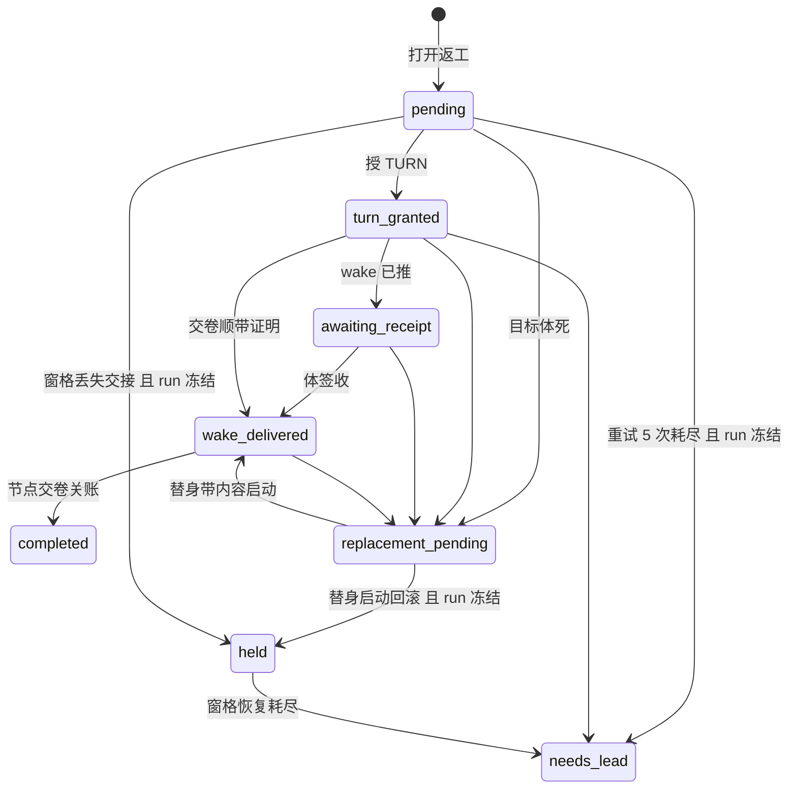

# FLY-2921 返工投递收成两态 — 探索
Issue: FLY-2921 (https://linear.app/geoforge3d/issue/FLY-2921/病根修复-6-返工投递收成两态送达-失败交还-lead投给死体改投替身不再把整条-run-打-held6-张-46)
日期: 2026-09-26
基于: 无（上游数据：PR #1347 `engineering/doc/FLY-2072-triage/` 的 fixclasses.json K05 与 tickets.json）

审计基线：`d52df7841`（origin/main，2026-09-26）。行号以该基线为准，实现时按符号查找。

## 1. 问题一句话

「返工」（QA 判不过、把活打回给实现体重做）的投递流程有 8 个状态，其中 4 个（`awaiting_receipt` / `replacement_pending` / `needs_lead` / `held`）是**出不去的中间态**：投给死体、同单第二次返工、投递耗尽都会让整条 run 被冻成 held，Lead 拿到的两扇门都拒，最后只能改账或终结重开。盘点 6 张单合计 ×46，近 7 天仍有 3 张在出。

## 2. 名词（第一次出现时的白话解释）

- **run**：一张单在工作流引擎里的一次完整执行链（设计→实现→QA→落地）。
- **执行体 / actor**：真正干活的 Claude/Codex 会话（一个进程），用 `execution_id` 标识。
- **返工请求 / rework request**：QA FAIL、founder 打回或 Lead 发起的「回去重做」，表 `workflow_rework_request`；`base_revision` 是被判 FAIL 那一刻的 git head。
- **路由版本 / route revision**：这次返工要投给哪个节点、哪个执行体（`preferred_actor_execution_id`），每换一次对象追加一版。
- **返工投递 / rework delivery**：把返工内容真正交到执行体手里的过程，表 `workflow_rework_delivery`，一行一个请求，`state` 列就是本单要收拢的状态机。
- **协调器 / coordinator**：`WorkflowReworkCoordinator`，Bridge 每秒扫一遍投递行、认领一行、把返工推进一步的那段代码。
- **TURN**：共享工作树的写入权令牌；返工投递时先把 TURN 授给目标体，再「唤醒」它。
- **wake / 唤醒**：往目标体信箱推一条持久消息（`turn_wake_outbox`），叫它开工。
- **签收 / receipt**：目标体跑 `flywheel-comm turn` 拿到 `yours`，证明它确实拿到了这次返工。
- **替身 / replacement**：原执行体已死时，同一节点另起一个新执行体来接这次返工。
- **hold / held**：把 run 冻住等人处理；held 的 run 所有节点都停。
- **驻留 / resident hold**：实现体交卷后不退出、停驻等下一轮返工的状态（表 `workflow_resident_hold`：resident / woken / expired / closed）。

## 3. 现状状态机（8 态）

来源：`advanceWorkflowReworkDelivery` 允许表（StateStore.ts:46192–46207）、`settleWorkflowReworkFailure`（45829）、`settleHeldReworkRecoveryFailure`（45614）、`rollbackUnlaunchedWorkflowAdmission`（41275）、`materializeWorkflowReworkReplacement`（44580）、`projectWorkflowReworkWakeReceiptTx`（43960）、`markWorkflowReplacementStartedTx`（45277）、`commitWorkflowTransitionTx` 三处关账（68142/69009/69100）。

说明：`receipt_started` 不是返工投递的状态，只属于 ship 载体表 `workflow_carrier_delivery`；本单不动载体表。

## 4. 六张单的病根逐条对上源码

| 单 | 盘点次数 | 当前源码里的病根 | 走到的死胡同 |
|---|---|---|---|
| FLY-2330 | ×24 | `finalizeUndeliverableHoldTx`（57254）`runHeld = family !== "mailbox"`：返工家族、以及返工 wake 所在的 `turn_wake` 家族的「投不到」一律把 run 打 held；`openReworkContentUndeliverableTx`（64978）在替身交卷缺内容回执时也走这条；`delivery-contract/watch.ts:219-225` 把 `awaiting_receipt`/`replacement_pending` + 收件体不活直接判「投不到」。取消正门：`delivery-operations.ts:572-592` 对 turn_wake 取消的非 ok 结果一律 `continue`，操作永远停在 `staged` | run held；cancel 正门落不了地 |
| FLY-2821 | ×11 | `resident-wake-fence.ts:19-27`：驻留 hold 不是 `resident` 就拒；而 `enterResidentHoldForCompletionTx`（64643–64712）遇到「activation 不同」直接 return false，第一次返工把 hold 置 `woken` 之后永远回不到 `resident` ⇒ **同 run 第二次返工必拒**（盘点实测 5/5），协调器当可重试错误（coordinator.ts:1160-1179）重试 5 次 ⇒ `needs_lead` + run held。体其实醒着在干 | run held；需终结重开 |
| FLY-2185 | ×5 | 替身有三条铸造车道：协调器→`replacement_pending`→调度器 `materializeWorkflowReworkReplacement`；调度器通用死体回收 `rollbackDeadWorkflowNodeExecution`（dispatcher.ts:2514，**完全不看返工**）；`convergeWorkflowReworkWriterReplacement`（44320）事后收敛。通用车道铸出的体没有返工上下文（起不来 / 干完交不了）；`replacement_pending` 不在调度器扫描列表（dispatcher.ts:1251-1257）也不被认领，物化失败一次就搁浅。另：物化的回执 UID 是 `rework_replacement_materialized:<requestId>`，**一个请求一辈子只能换一次体**，第二次死亡幂等回放返回那具已死的替身 | 半铸体；卡 replacement_pending |
| FLY-2473 | ×3 | 耗尽后 `needs_lead`，而 hold 恢复前置 `workflowHoldAuthoritativePrecondition`（57885–57928）对三种返工 hold 写死 `expectedState = "held"` ⇒ `hold_changed`；告警指的另一扇门 `/rework` 走 `validateNeedsLeadReworkQuiescenceTx`（50865）要求**本 run 全部执行体 30 秒内证死**，体活着（正是 2821 的情形）就 `target_not_quiescent` | 两扇门都拒 |
| FLY-2092 | ×1 | 耗尽清理 `rollback_pre_admission` / `abandon_ungranted_activation`（45998–46013）把目标节点改成 `superseded`，协调器随后 `rework_target_not_reserved`（coordinator.ts:562-581）拒绝复位 | 续路被拆 |
| FLY-2202（并 FLY-2472） | ×2（+1） | `commitWorkflowTransitionTx`（67620）只核投递与身份（67838–67858），**不比交付 head 与被判 FAIL 的 head**；替身重放死体 transcript 的 `complete` 零提交交卷也照收，QA 对同一字节再跑一轮 | 白跑 QA |

## 5. 生产库现存行（只读查询 `~/.flywheel/teamlead.db`，2026-09-26）

按投递状态 × run 状态计数（节选与本单相关的）：

| 投递状态 | run=held | run=active | run 已终态（completed/terminated/canceled） |
|---|---|---|---|
| awaiting_receipt | 1 | 0 | 18 |
| replacement_pending | 1 | 0 | 3 |
| needs_lead | 2 | 0 | 49 |
| held | 4 | 0 | 41 |
| pending | 1 | 0 | 4 |
| wake_delivered | 0 | 4 | 52 |

**活着的 run 上停在将被删状态的行只有 8 行，全部在 held run 上**，最新一行 2026-09-24（FLY-2803 awaiting_receipt），其余 8-30 至 9-13：FLY-2152 ×3、FLY-2031 ×2、FLY-2461、FLY-2390、FLY-2803。另有 FLY-2399 一行 `pending` 挂在 held run 上（`operator_resume:rework_pane_loss_handoff` 之后没恢复 run）。已终态 run 上的旧行只需改字面值、不影响行为。

## 6. 和兄弟单的重叠

- **FLY-2922（K07，统一恢复口）**：它把三种返工 hold 纳入统一入口、并在恢复事务里写回 `replacement_pending`。已与 Lead 确认边界（问题 `e2641287`）：本单改**生产端**（返工投递从源头不再冻 run、删中间态），2922 只把这三种 hold 当历史存量兼容输入，它写 `replacement_pending` 的那一步改成本单的新形态；不合并实施，谁后合谁 rebase。Lead 要求把合同写进 plan 独立一节。
- **FLY-2919（K02，生死单一真源，已批）**：它改「怎么判死」（含 `heldPaneLossRecovery`、返工的 `probeRegistered/probePersisted`）。本单改「判死以后返工投递怎么办」。本单删掉 held 窗格恢复这条路径，会与 2919 的同处修改冲突 —— 合同同样写进 plan。
- **K04（Codex 交卷/唤醒互锁，疑为 FLY-2920）**：同样涉及 `resident-wake-fence.ts`。已向 Lead 发非阻塞确认（问题 `74884725`）。

## 7. 候选方向

| 方向 | 做法 | 取舍 |
|---|---|---|
| A. 只补洞 | 给 needs_lead 加出口、fence 放过 woken、hold 前置接受 needs_lead | 改动小，但中间态还在，下一个触发方还会掉进去（盘点 K05 的教训正是「出口缺失是同一处」） |
| **B. 收拢状态机（选）** | 删 4 个中间态；失败只有一个终态「交还 Lead」且不冻 run；投给死体由协调器在同一事务里改投替身；交卷必须有新提交 | 改动面约 5 处核心 + 消费者适配；和 2919/2922 要写合同 |
| C. 整个换成事件溯源 / 新表 | 重写投递为只追加事件 | 远超本单，且 2922 正在改同一片 |

选 B。它正是 issue 要求的「删什么」，也让每条失败路径都落到同一个 Lead 能处理的终点。
