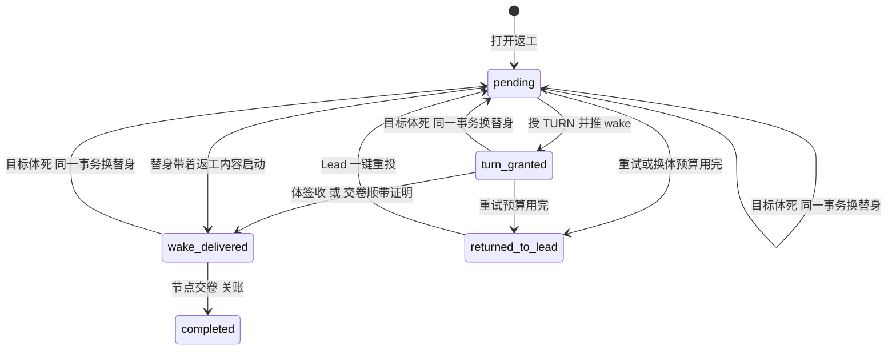

# FLY-2921 返工投递收成两态 — 实施计划
Issue: FLY-2921 (https://linear.app/geoforge3d/issue/FLY-2921/病根修复-6-返工投递收成两态送达-失败交还-lead投给死体改投替身不再把整条-run-打-held6-张-46)
日期: 2026-09-27
基于: research.md

状态：draft，待本节点设计评审。审计基线 `d52df7841`（主仓），实现分支 `flywheel-FLY-2921`。设计节点只产出文档，不含实现、生产验证、合并或部署（部署由独立 updater 按窗口执行）。行号以基线为准，实现时一律按符号查找。本沙箱工作树不含相关源码，见 exploration §0 / §8。

## 1. 给 founder 的结论

**一句话：返工交出去只有两种结局——送到了，或者交还 Lead；投给死体就当场换替身重投，任何投递失败都不再冻结整条任务链。**



- 状态从 8 个减到 5 个。删掉 `awaiting_receipt`、`replacement_pending`、`needs_lead`、`held` 四个中间态。
- **成功链**：`wake_delivered`（显示为「送达」）→ `completed`（显示为「已交卷关账」）。
- **失败终点只有一个**：`returned_to_lead`（显示为「交还 Lead」）。run 保持 active，Lead 收到一条告警，里面只有一扇确定能用的门。
- 「投给死体」不再是失败：协调器在认领这一行的同一次处理里把替身铸好，投递回到 `pending` 并指向新体。
- 实现节点返工交卷时，交付的 git head 必须和被判 FAIL 的那个 head 不同，而且除了进度账本以外确实改了东西，否则拒收，不派 QA。

## 2. 状态词汇（唯一来源）

数据库字面值是稳定身份，不改名；显示文案只在告警、巡检和 HTML 里用。

| 字面值 | 显示文案 | 含义 | 谁写入 | 终态 |
|---|---|---|---|---|
| `pending` | 待投 | 引擎要把返工交给当前指定体；包括退避等待和「替身已铸、启动中」 | 打开返工、换替身事务、Lead 重投 | 否 |
| `turn_granted` | 已发待签收 | 已授 TURN；`wake_sent_at` 非空表示 wake 已推，等体签收 | 协调器 | 否 |
| `wake_delivered` | 送达 | 体已签收，或替身带着返工内容启动 | 签收投影、替身启动事务、交卷顺带证明 | 否（等交卷） |
| `completed` | 已交卷关账 | 返工被节点交卷消费，或被操作员取消 | 工作流转移、取消 | 是 |
| `returned_to_lead` | 交还 Lead | 自动投递放弃，交给 Lead 决定 | 协调器失败结算 | 对引擎是终态；Lead 重投后回 `pending` |

保留 `wake_delivered` 这个字面值（不改成 `delivered`），因为事件名 `rework_delivery_wake_delivered` 被 529 验收脚本和 FLY-2456 脚本依赖，改名没有任何行为收益。

新增两列，都是事实而不是状态：
- `wake_sent_at TEXT NULL`：wake 已推送的时间，替代 `awaiting_receipt` 这个状态；
- `liveness_unknown_since TEXT NULL`：目标体活性从何时起判不出，用于升级告警（C2 第 5 步）。

## 3. 改动

### C1 状态机本体与迁移（StateStore）

1. 基础建表（35141）与 `WorkflowReworkDeliveryRow`（88928）改为 5 态 CHECK，并加 `wake_sent_at`、`liveness_unknown_since` 两列。
2. 新迁移 `migrateWorkflowReworkDeliveryTwoState()`：跳过条件为表 SQL 含 `returned_to_lead`、不含 `awaiting_receipt`，且两列都存在；否则关外键、建 `_next`、拷贝并映射行（§5）、删旧、改名。沿用 `migrateWorkflowReworkDeliveryBudget` 的写法。
3. **必须同时改**旧迁移 `migrateWorkflowReworkDeliveryBudget` 的跳过条件：按列判断（`hold_count`、`next_retry_at`、`grant_started_at` 都存在就跳过），不再看状态字面值。否则启动时它会把新表重建回 8 态 CHECK。新迁移排在旧迁移之后执行。
4. `assertMaintenanceSchema` 7041–7046 的检查从 `'needs_lead'` 改为 `'returned_to_lead'`。
5. `advanceWorkflowReworkDelivery` 的允许表只保留：`pending → turn_granted`；`turn_granted → wake_delivered`（由签收投影专用函数写，通用 CAS 不开放）；`wake_delivered → completed`。删除 `→held`、`replacement_pending → completed`、所有 `→awaiting_receipt`、`→replacement_pending` 分支，以及 `alertIdentity` / `nextRetryAt` 参数。推进事件 UID 带路由版本（`rework_delivery_<to>:<req>:<rev>`），否则换体 / 重投后同一请求再次 `pending→turn_granted` 会撞 `workflow_event_uid_conflict`。
6. 推送成功后不再改状态，改为写 `wake_sent_at`：`markWorkflowReworkWakeSent({requestId, ownerId, generation, now})`，CAS 条件是 owner、generation、`state='turn_granted'`，同时设 `next_retry_at = now + 3min` 并释放 owner。
7. `projectWorkflowReworkWakeReceiptTx` 的源状态从 `awaiting_receipt` 改为 `turn_granted`（`wake_sent_at` 是否为空都接受）。这也修掉一个竞态：wake 刚推出去体就签收了，旧代码因还没推进到 `awaiting_receipt` 而丢签收。
8. `settleWorkflowReworkOnCompletionTx` 的「交卷顺带证明」源集合改为 `turn_granted`。另外接受一种自愈情形：`returned_to_lead` 且 `grant_started_at` 非空、TURN 的 epoch 与路由版本都匹配时，体确实拿到了写入权并交了卷，就按顺带签收处理，同一事务给该行的 `rework_returned_to_lead` hold 写 `hold_resumed` 回执，这扇门随之关闭。
9. `claimWorkflowReworkDelivery` 对「`turn_granted` 且 `wake_sent_at` 非空」和 `wake_delivered` 保留 `updated_at`，否则每次复探都会把巡检看到的「停留时长」清零。
10. `wake_sent_at` 与现有投递时钟 `sent_at`（`projectWorkflowDeliveryClockTx`，46243）在同一事务内写入；前者留在投递行上是为了参与 CAS，实现时注释说明这份冗余。

### C2 协调器：投给死体就地改投替身（`workflow-rework-coordinator.ts` + StateStore）

**新事务 `replaceWorkflowReworkActor`**（重构自 `materializeWorkflowReworkReplacement`，与 resume fallback 共用核心 `materializeReworkReplacementCoreTx`，单事务）：

- 入参：`requestId, ownerId, generation, deadExecutionId, newExecutionId, proof, reason, observedAt`。
- 前置条件：调用方持有该行认领（owner + generation CAS）；状态 ∈ `pending | turn_granted | wake_delivered`；路由版本一致；`preferred_actor_execution_id = deadExecutionId`；目标节点 `execution_id = deadExecutionId` 且节点状态 ∈ `pending | admitted | running`，或为 `failed` 但该执行体有未启动回滚事实；run 为 active 且 `engine_owned`。不再要求 `replacement_pending`，删掉 `recoverHeldPaneLoss` 分支。
- **`proof` 只接受可在事务内复核的死亡证明**：`unlaunched_rollback`（`unlaunched_admission_rolled_back` / `rework_replacement_launch_rolled_back` 事实）、`launch_abandoned`（dispatch ledger `abandoned`）；2919 合入后再加「受信进程证据（执行体 + 代次）」一种。会话终态、窗格消失、驻留到期、内容缺失都**不是**证明。
- 动作：保留原物化的全部动作（终结死会话、结清停驻、撤凭据、分配启动序号 reason=`rework_replacement:<req>`、节点换新执行体、追加路由版本 `engine:proven_dead_replacement`、重铸投递 attempt、死体观察），然后把投递置为 `pending`，并清空 owner、lease、`wake_sent_at`、`liveness_unknown_since`、`grant_started_at`。**每次追加路由版本**（换体、Lead 重投、兼容收敛、resume fallback）都清空这两列事实。
- 回执 UID 按路由版本：`rework_replacement_materialized:<requestId>:<deadRouteRevision>`；恢复证据事件与恢复附件 UID 同样改为 `rework_replacement:<requestId>:<newRouteRevision>`。修掉「一个请求只能换一次体」与「第二具替身静默缺少恢复附件」。物化证明读取端同时认新旧两种 UID。
- 计数：换体时 `hold_count` 清零。**换体预算**：从最近一次 Lead 重投（或请求打开）算起累计 3 次；第 4 次不铸，转 C3 结算 `returned_to_lead`，原因 `replacement_budget_exhausted`。计数来源是路由版本表：`interpreted_by IN ('engine:proven_dead_replacement','engine:resume_fallback')` 且版本号大于最近一次 `engine:hold_resume` 的行数，不新增列。
- 事务提交时复核：执行体、会话 `lifecycle_revision`、节点、路由版本必须与分类时观测一致，否则放弃本次换体并重新认领。fail-closed：判不出一律不换体。

**协调器 `reconcile` 新流程**（按顺序，每步只有一个出口）：

1. 上下文不齐（请求、路由、投递、run 缺失，或 run 不是 active）：run 不是 active 只释放、不计数（旧 held run 上的遗留行，留给 2922 或 Lead）；其余计一次失败（C3）。
2. 旧车道收敛（`convergeWorkflowReworkWriterReplacement`）保留，仅兼容已存在的半铸体；结果改为「投递回 `pending` + 新路由版本」。
3. **替身启动中**（新谓词 `isReworkReplacementLaunching`）。识别分两段，不依赖最新路由是谁铸的：准入前认精确 dispatch 意图（reason `rework_replacement:<req>`，且 run、node、attempt、execution 都等于当前目标与 preferred actor；此时还没有 execution binding，额度暂停或准入拒绝在 binding 之前就返回）；准入后再加 `workflow_execution_binding.mode = 'replacement'`。动作表互斥、自上而下第一条命中即执行：

   | # | 条件 | 动作 |
   |---|---|---|
   | a | 有内容缺失事实（C4.5） | 走第 4 步「需要核验」 |
   | b | 当前路由版本由 Lead 重投创建，且替身尚未 started | 视为「这具替身不可用」：ledger `intent_recorded` 走现有启动取消围栏等 `abandoned`；`launch_committed` 走第 4 步核验并请求收体；之后重新换体，用新内容新铸 launch envelope（launch 内容摘要绑定路由版本，不能沿用旧信封） |
   | c | ledger `abandoned`，或有未启动回滚事实（节点 `failed`） | 已排除外部启动，第 4 步换体 |
   | d | ledger `intent_recorded`，未超过调度器未启动阈值（含被额度或容量挡在准入前） | `deferWorkflowReworkDelivery`：30 秒后再看，不写事件、不计失败 |
   | e | ledger `intent_recorded`，超过阈值 | 计一次失败，原因 `replacement_launch_stalled:intent_recorded`，告警带 ledger 状态 |
   | f | ledger `launch_committed`，内容尚未送达 | 当作「已发」：活着就等；判不出按第 5 步计时告警；证死走第 4 步 |

   `deferWorkflowReworkDelivery({requestId, ownerId, generation, nextRetryAt, reason})` 是新增 CAS，作用于 `pending` 与**未推送的 `turn_granted`**（Lead 重投后 wake 复位返回 `busy` 时，崩溃恢复路径上投递可能已是未推送的 `turn_granted`）：释放 owner、设 `next_retry_at`，不写事件。不能复用 `releaseWorkflowReworkDelivery`（不设 `next_retry_at`，且每次追加事件，会变成每秒一次空转）。

4. **目标体已证死**：换体只认 `replaceWorkflowReworkActor` 接受的证明。会话终态、驻留 hold `expired/closed`、内容缺失、会话缺失只是「需要核验」的理由：协调器在现有授权范围内请求收体（`closeActorForReworkSupersession`，其授权 44242–44281 不放宽：投递 `pending` 或未推送的 `turn_granted`，节点 `pending/admitted`），然后按第 5 步等待并告警。节点已 `running` 或投递已 `wake_delivered` 的目标：**2919 合入前不发收体请求**（现有授权会拒绝，本单不扩展授权），只复探加告警；2919 合入后改走其受控收尾入口（`close_requested` CAS）。结果：`replacement_minted`，或预算耗尽 `returned_to_lead`。负控测试走真实探针接线，不 stub 分类器：窗格消失或 dead_pin 但 worker/controller 活着、终态但活着、到期但活着、controller 正在重启、采样后代次变化，全部断言零后继。
5. **活性未知**（重入分类为 `hold`，含 `persisted_target_missing`）：`turn_granted` 且 `wake_sent_at` 非空 → `receipt_pending`，3 分钟后复探，不计数，未知持续 2 小时交还 Lead（`liveness_unknown_timeout:*`）；`wake_delivered` → 只复探加告警；`pending` → 计一次失败。删掉 `handoff_held_pane_loss`。**活性未知必须有人知道**：`liveness_unknown_since` 第一次判未知时写入、判到已知时清空，按（请求, 路由版本）计；持续 30 分钟发告警 `rework_liveness_unknown:warn:<req>:<rev>`，持续 2 小时发严重告警 `rework_liveness_unknown:severe:<req>:<rev>`，每个路由版本各一次。这接替被删掉的窗格交接告警与 C6.1 跳过通用死体扫描后失去的 `probe_unknown` 告警。
6. **活体且已发**：复探等待，不计数。
7. **其余**（`pending`，或 `turn_granted` 但 `wake_sent_at` 为空，即崩溃在授权与推送之间）：走原来的准入、授 TURN、唤醒整段流程（按 wakeId 幂等，research §3.3）。顺序不变：授 TURN 之后、推送之前先把 `pending` 推进到 `turn_granted`；推送成功以后写 `wake_sent_at`。wake 返回 `resident_hold_expired` 走第 4 步；其他错误计一次失败。

**Lead 重投时复位原来那个 wake，不新造 wake 身份**：CommDB `turn_wake_outbox.push_count` 上限是 2（db.ts:310），wakeId 由 `{requestId, activationId, epoch}` 派生，同一请求重投还是同一个 wake，两次推送失败以后只会读到旧的失败结果。

- 用现成原语 `resumeTurnWakeHold({sourceId, receiptId})`（db.ts:4197）清零推送计数；对 `acked/cancelled` 是 noop。本单修两处：① 重放条件从 `state === pending && cancel_reason === receiptId` 扩到 `state IN ('pending','sent')`，一次 Lead 重投只复位一次；② 存在未过期推送认领（`claim_expires_at > now`）时不复位，返回 `busy`。
- **所有调用方按结果分支处理**：`busy` 是「可重试、未执行」；只有「复位成功」「同 receipt 幂等重放」「acked/cancelled 终态 noop」三种可以继续成功结算。`delivery-operations.ts:611` 收到 `busy` 时保留 `staged`，本 pass 不调用 `markWorkflowHoldResumeApplied`（619）/ `projectWorkflowHoldResume`（625）；协调器 `rearmReworkWake` 收到 `busy` 时 `deferWorkflowReworkDelivery` 延后，不计失败、不当作已重臂。验收走真实 delivery-operations pass：有效认领 → `busy` → 操作仍 `staged`、零 applied/projected → 认领释放或过期 → 下一 pass 实际复位一次并 applied/projected。
- 协调器新增效果 `rearmReworkWake(wakeId, receiptId)`，只在当前路由版本由 `engine:hold_resume` 创建且该版本还没推送过时调用，`receiptId = rework-rearm:<req>:<routeRevision>`；调完再走正常唤醒。
- wakeId、TURN source、epoch、activationId 全部不变；退役表 `UNIQUE(execution_id, activation_id, epoch)`、退役证明、签收投影、物化证明读取端都不受影响。

**巡检与重投的互锁（代码评审 R2–R4 补进设计）**：重投复位与推进之间若崩溃，巡检可能取消这个 wake。仍归该执行体的 `pending/returned_to_lead` 返工，TURN wake 巡检对其返回 `wait` 而非取消；`wait` 不计巡检每轮额度；巡检扫描用单轮内单调前进的游标（`claimDueTurnWake` 新增 `after`），无上限、无排除列表，避免长期 `wait` 的行饿死队列。

**Outcome 联合类型**：`wake_sent`、`receipt_pending`、`replacement_minted`、`replacement_launching`、`disabled`、`retryable`、`busy`、`settled`（state ∈ `wake_delivered | completed | returned_to_lead`）、`invalid`。删掉 `awaiting_receipt` 和 `replacement_pending`。

### C3 失败只有一个终点：交还 Lead，不冻 run

1. `settleWorkflowReworkFailure`：退避不变 1、2、4、8 分钟；第 5 次（或换体预算耗尽、活性未知超时）结算为 `returned_to_lead`。删除 run 置 held、撤目标节点预留（修 FLY-2092）、验证路径置 `needs_lead`、`onExhausted` 参数和窗格交接分支。凭据规则保留：TURN 未授出时撤销未消费的激活凭据，已授出则保留。同事务写 delivery 作用域 hold 事件 `rework_returned_to_lead`，UID `rework_returned_to_lead:<requestId>:<routeRevision>`，payload 含 requestId、routeRevision、reason、holdCount、replacementCount、cleanupDisposition。发严重告警，处置 `rework_returned_to_lead`，身份按事件 UID，不与 FLY-2910 六小时去重键共用。
2. `workflowHoldAuthoritativePrecondition` 为 `rework_returned_to_lead` 加专门分支：投递状态为 `returned_to_lead` 且 `route_revision === payload.routeRevision`。否则过期的门（已重投或已换体）会 stage 成功再在 `resumeWorkflowHold` 里抛 `workflow_hold_rework_changed`，由 runs-route.ts:538 返回 500。
3. 注册新 hold 形状 `rework_returned_to_lead`（registry + manifest + inventory）：`scope: "delivery"`、`resumeAction: "resume_rework"`，不设 `requiredDecision`。delivery 作用域在 `listWorkflowHolds` 没有 `run_held` 前置，`resumeWorkflowHold` 只在 `runLevel` 时改 run 状态，所以 run 保持 active。
4. **Lead 的唯一一扇门：重投**。用现有 `flywheel-comm hold resume`（stage → confirm → apply，master + loopback + 一次性令牌）。`applyStateWorkflowHoldResumeActionTx` 的 `resume_rework`：源状态改为 `returned_to_lead`；新增前置「目标节点仍由本请求预留」（节点 pending/admitted/running 且 `execution_id` 等于路由的 `preferred_actor`，或该体已证死）；不满足拒绝 `rework_target_superseded`，提示改走 founder `/rework`（只会出现在迁移过来的旧行）。通过后追加 `engine:hold_resume` 路由版本，投递回 `pending`，`hold_count` 清零，换体预算重新计数。
5. 告警正文写人话，给一条可直接复制的命令：`flywheel-comm hold resume --run <runId> --shape rework_returned_to_lead --hold-event <事件UID> --reason "<说明>"`；另附「改返工内容走 founder `/rework`；放弃用 terminate」。**正文必须包含事件 UID（带路由版本）**：FLY-2910 六小时去重按正文指纹算，同一请求相邻两个版本的交还才不会被吞。补测：连续两个版本的交还都能叫醒 Lead。
6. `openOperatorRework`（`/rework`，founder 授权门）：查找 `returned_to_lead` 行；不再要求 run held；静默校验改用 active run 同款，删除 `validateNeedsLeadReworkQuiescenceTx`（修 FLY-2473）；安全性由同事务凭据撤销保证（`returned_activation_already_consumed` 拒绝、撤凭据、旧目标置 `superseded`、验证路径作废）；替换已交还的返工时顺带关闭那扇 Lead 门，避免 active run 上留下只会报 `rework_target_superseded` 的幽灵门。`findOpenWorkflowReworkForRun` 排除 `returned_to_lead`。
7. `resolveOpenWorkflowReworkTarget` 仍把 `returned_to_lead` 视为「占用目标」，围住调度器，防止任何车道在 Lead 决定之前给该节点铸出无返工上下文的体。

### C4 其余会把 run 冻住的投递路径（FLY-2330）

1. `rollbackUnlaunchedWorkflowAdmission`：`UPDATE workflow_run SET status='held'`（41258）改为仅在 `binding.mode !== "replacement"` 时执行；replacement 分支删除「投递置 held」，投递留 `pending`、`next_retry_at = now`；不再写 run 级 hold 形状 `unlaunched_admission_rolled_back`（在 active run 上会留下永远不可恢复的幽灵暂停），改写不注册为 hold 形状的独立事件 `rework_replacement_launch_rolled_back`，告警降为普通级；`hasUnlaunchedWorkflowRollbackFact` 同时接受两种事件名。非 replacement 绑定的行为不动，归 FLY-2922。
2. `escalateUnlaunchedWorkflowStall`（41400 起，dispatcher 1884 调用）：节点是未关账返工目标且绑定为 replacement 时，不写 run held、不生成 run 级 hold；改为计一次投递失败，原因 `replacement_launch_unresolved:<具体原因>`，满了交还 Lead。保留「证据不明时不回滚、不猜死」。回归走真实 dispatcher tick。
3. `delivery-contract/watch.ts:219-225`：删返工那一半；载体那一半不动。
4. `holdUndeliverableTx`（57133）：attempt 属于返工（rework 家族，或 turn_wake 家族且 wake 的 `purpose='workflow_rework'` / wakeId 能解析为返工 wake）时不铸 hold、不冻 run，结算该 attempt 为 `recipient_terminal_rework_owned`，投递 `next_retry_at = now`，由协调器按 C2 第 4 步处理。`finalizeUndeliverableHoldTx` 的 `runHeld` 加 `family !== "rework"` 兜底断言。
5. `openReworkContentUndeliverableTx`（64978，替身交卷缺内容回执，FLY-2472）改为 `markReworkReplacementContentMissingTx`：不铸 hold、不冻 run；交卷照旧拒绝 `rework_content_not_delivered`；同一事务撤销该替身未消费的凭据，写事实事件 `rework_replacement_content_missing:<req>:<rev>`，投递 `next_retry_at = now`（无主 CAS：`owner_id IS NULL` 或租约过期才改）。协调器看到该事实后请替身协作退出（`closeActorForReworkSupersession`，授权不放宽；内容缺失只发生在 `markStarted` 之前，节点 `admitted`、投递 `pending`，正好在授权范围内），拿到受信死亡证据之后才换体。**不能**让协调器用 wake 模式给活替身重送内容（binding `mode='replacement'` 会被 `activation_conflict` 确定性拒绝）。
6. 暂存取消永不落地（`delivery-operations.ts:572-592`）：任何非 ok 分支一律 `markWorkflowHoldResumeFailed` 带精确原因；`cancelTurnWakeDelivery` 遇「源已被 terminal_guard 取消」按幂等成功处理；326–328 的 `!family || !rootId` 同样标记失败。

### C5 驻留 hold：第二次返工不再「投不到」（FLY-2821）

1. `resident-wake-fence.ts` `deliverResidentWake`：hold 为 `woken` 时直接调用 `deliver()` 并返回结果，不做 hold CAS。只有 `expired`/`closed` 返回 `resident_hold_expired`，由协调器核验。
2. `enterResidentHoldForCompletionTx`：已有 hold 为同一 `execution_id`、同一 `node_id`、状态 `woken`，且交卷绑定的 activation 是该执行体当前激活时，重新停驻：`activation_id` 更新为当前激活、状态 `resident`、revision+1。非当前激活（迟到的旧交卷）仍拒绝。
3. ship 载体共用这道 fence（plugin.ts:15206–15270），两处改动对它同样生效，补一条回归。

### C6 替身只有一条铸造路（FLY-2185）

1. 调度器通用死体回收（dispatcher.ts 约 2440–2530）：节点若是未关账返工目标（`resolveOpenWorkflowReworkTarget` 非空且无冲突），跳过，并把该投递交给协调器（`handOffDeadReworkTargetToCoordinator`）。「提醒协调器」每个（请求, 路由版本, 执行体）只发一次（事件 `rework_dead_target_handoff:*`）：每个 tick 都把 `next_retry_at` 置 now 会抹掉退避，让未推送投递几秒内连计 5 次失败。
2. `rollbackDeadWorkflowNodeExecution` 本体加同一守卫作纵深防御，拒绝原因 `rework_target_owned_by_coordinator`。
3. `allocateWorkflowResumeFallback` 的返工分支改为调用共用核心 `materializeReworkReplacementCoreTx`：产生 dispatch reason `rework_replacement:<req>`（现在 fallback 的 ledger INSERT 不写 reason，会被自己的启动围栏永久挡住）、验证路径换版本、重铸投递 attempt、恢复 lineage 与附件、退役义务、统一换体预算；保留 `interpreted_by='engine:resume_fallback'` 与 `source_demand_id` 语义；入参补 `ownerId`/`generation` 做 CAS。
4. 调度器：删 1405–1421 物化分支；启动围栏改为 `preferredActor === intent.execution_id` 且 `intent.reason === rework_replacement:<req>` 且 `deliveryState === 'pending'`；替身上下文状态条件同样改 `pending`；`markWorkflowReplacementStartedTx` 源状态改 `pending`；`engine_rework_replacement_context_invalid` 仍 fail-closed。

### C7 交卷必须有新提交（FLY-2202，并 FLY-2472）

1. **event-route.ts**（1603–1810 交卷路由）产出服务端证据 `reworkEvidence`（新文件 `rework-completion-evidence.ts`）：触发条件是交卷绑定对应未关账返工目标、节点能力 `completion_route === "needs_review"`、成功路由。形状 `{ requestId, baseRevision, head, headSource: "server" | "unresolved", delta: "product_change" | "ledger_only" | "unverified" }`。`head` 取 1742 已捕获的 `completionHead`（同时作为 `subjectDigest` 传下去）；本单不声称能挡住「捕获之后体又提交」。diff 算法：`git diff --name-only -z <base> <head> -- . ':(exclude)engineering/doc/*/progress.md'`，读到第一个合格路径就停；超时（`FLYWHEEL_REWORK_DELTA_TIMEOUT_MS`，登记为调参旋钮）或截断无法判定时 `unverified`。
2. **`commitWorkflowTransitionTx`**：在 67979 之后插入校验，只在「当前节点是返工目标（index 0）且 `needs_review`、成功边」生效，按顺序：① `reworkEvidence` 缺失退回只比 `input.subjectDigest`，也缺则拒 `rework_head_unavailable`；② requestId / baseRevision 与 `activeRequest` 不一致拒 `rework_evidence_stale`；③ `baseRevision` 非 40 位十六进制（历史 `"unavailable"`）放行并审计 `rework_head_check_skipped`；④ `headSource === "unresolved"` 拒 `rework_head_unavailable`；⑤ head 等于 base（大小写不敏感）拒 `rework_head_unchanged`；⑥ `delta === "ledger_only"` 拒 `rework_no_product_change`；⑦ `delta === "unverified"` 放行并审计 `rework_delta_unverified`（fail-closed 会造出新卡死态）；⑧ `product_change` 放行。拒绝均 `retryable:true`、不改状态，已做的顺带签收由 69238–69246 回滚。拒绝审计不能写在会回滚的 savepoint 里：回滚完成后经 `recordReworkDeliveryRefusal` 同层按 `request + head + reason` 幂等写一条 `rework_completion_refused`。
3. `flywheel-comm complete` 对这些原因打印人话：「返工交卷必须带新提交；若确实不需要改代码，用 `flywheel-comm ask` 向 Lead 说明」。不提示 `--route blocked`（enrolled 节点 blocked 会被 `commitEnrolledCompletion` 拒，FLY-2922 §4 才补 `commitEnrolledFailure`）。
4. 这些可重试拒绝**不留下**会被慢速标记对账器反复重放的完成标记；体必须用新的 head 重新 `complete`。
5. 不看提交是谁做的，不改 QA 判法，只挡「同一份字节再送一次 QA」。

### C8 消费者适配

| 文件 | 改动 |
|---|---|
| `workflow-engine-dispatcher.ts:1251` | 扫描状态 pending / turn_granted / wake_delivered；删 held 窗格恢复块与 `settleHeldReworkRecoveryFailure` 调用 |
| `patrol-loop-ledger.ts` | pending 恒为进度；turn_granted、wake_delivered 按活性；returned_to_lead 不算进度，显示 `rework:returned_to_lead`（「交还 Lead」） |
| `hook-payload.ts` | 白名单加 `returned_to_lead`，删 `replacement_pending`；`needs_lead`、`wake_delivered`、`receipt_started` 留给载体 |
| `turn-wake-receipt-classifier.ts` | 停驻集合 `{returned_to_lead}`。换替身后旧体的迟到签收靠**写入前**防线（`projectWorkflowReworkWakeReceiptTx` 43900 比较 preferred actor、绑定和 TURN 执行体）与 FLY-2517 精确 wake 退役；classifier 在投影之后运行，不承担 |
| `LeadAlertNotifier.ts` | 加处置 `rework_returned_to_lead`；旧两个值保留历史解码 |
| `flywheel-comm complete.ts` | C7 提示文案 |
| `scripts/qa-529-generalized-e2e.mjs` | 危险行改「`returned_to_lead`，或 run 被返工 hold 冻结」；新增的 `hold_resumed` 不存在判断须在 FLY-2006 retention consumer gate 配置登记为 `protect` |
| `lead-rules-base/runbooks/patrol-v1.md` 及镜像 | 附录 A/B 改短说明：「FLY-2921 后不再出现；遗留行已由迁移处理；遇到 `rework_returned_to_lead` 用 hold resume 重投」；同步 `fly369-patrol-rule.test.ts` |
| `doc/engineer/implementation/turn-manual-handoff-runbook.md:11` | needs_lead → `returned_to_lead` 与新门 |
| lead-token-savings 兼容摘要 | `flywheel-comm/src/db.ts` 字节变化后逐块审计（只动 TURN wake 原语）、重钉哈希并补 rationale |

## 4. 删除清单

**状态**：`awaiting_receipt`、`replacement_pending`、`needs_lead`、`held`（仅指返工投递表）。

| 删除对象 | 位置 | 原因 |
|---|---|---|
| `settleHeldReworkRecoveryFailure` | StateStore 45614 | 无 held 可恢复 |
| 调度器 held 窗格恢复块与 `heldReworkRecoveryProbeAt` | dispatcher 1276–1368、1475–1497 | 同上 |
| `materializeWorkflowReworkReplacement`（含 `recoverHeldPaneLoss` 分支） | StateStore 44580– | 并入共用核心 |
| 调度器 `replacement_pending` → 物化分支 | dispatcher 1405–1421 | 由协调器就地铸 |
| `settleWorkflowReworkFailure` 的 run held、窗格交接、撤节点预留、验证路径 needs_lead 分支及 `onExhausted`/`terminal` 参数 | 45940–46090 | C3 |
| `rollbackUnlaunchedWorkflowAdmission` 对 replacement 绑定的冻 run 与投递置 held，及其 run 级 hold 事件 | 41258–41280 | C4.1 |
| `escalateUnlaunchedWorkflowStall` 对返工替身写 run held / run 级 hold 的分支 | 41400 起 | C4.2 |
| `watch.ts` 返工 undeliverable 半边 | 219–223 | C4.3 |
| `openReworkContentUndeliverableTx` | 64978– | C4.5（改为 `markReworkReplacementContentMissingTx`） |
| `validateNeedsLeadReworkQuiescenceTx` | 50865 | C3.6 |
| `deliverResidentWake` 的 `resident_hold_already_woken` | fence 25 | C5 |
| 协调器 `markReplacementPending`、`handoff_held_pane_loss`、`awaiting_receipt` 推进 | coordinator 584–606、782、1181–1199 | C2 |
| `scripts/fly-1648-hot-loop-closeout.mjs` 及其测试 | scripts | 一次性脚本（8 月已执行），Lead 已确认删除（问题 `67a24662`），git 历史留档 |

`rework_activation_stalled_held`、`rework_retry_exhausted`、`rework_pane_loss_handoff` 三种 hold 形状**不删**：注册表继续解码历史事件，前置条件读 `returned_to_lead`；本单之后不再铸造。事件 kind `rework_needs_lead_cleaned` 保留原名，保证事件历史连续。

## 5. 迁移与兼容

**行映射**：

| 旧状态 | 新状态 | 附加 |
|---|---|---|
| `awaiting_receipt` | `turn_granted` | `wake_sent_at = updated_at` |
| `replacement_pending` | `pending` | `last_error = 'migrated:replacement_pending:' + 原值`；协调器第 3 步判「启动中」，否则按第 4 步核验 |
| `needs_lead` | `returned_to_lead` | 保留 last_error |
| `held` | `returned_to_lead` | `last_error = 'migrated:held:' + 原值` |
| 其他 | 不变 | — |

- **只改字面值，不自动解冻任何 run**。活着的 run 上受影响的 8 行全部挂在 held run 上（FLY-2152 ×3、FLY-2031 ×2、FLY-2461、FLY-2390、FLY-2803），它们的 run 仍 held，由原来的 hold 事件和门处理：三种旧返工 hold 的前置期望改为 `returned_to_lead`（修 FLY-2473），恢复动作走 C3.4 的 `resume_rework`，恢复后 run 由现有 `runLevel` 逻辑回 active；或走 FLY-2922 统一入口；或 terminate。
- 迁移只为「**active run** 上变成 `returned_to_lead` 的行」补写 `rework_returned_to_lead` delivery 作用域事件（UID 带 `migrated` 前缀、不发告警）。**held run 上的行不补写**：两扇门并存会造新死胡同（先走新门投递回 `pending` 而 run 仍 held，协调器不认领；旧门再 stage 报 `hold_changed`）。生产上 active run 的此类行为 0。
- 已终态 run 上约 170 行只映射字面值，不写事件。
- 旧驻留 hold 卡在 `woken`：不迁移数据。C5.1 让 `woken` 可直接投，下一次交卷由 C5.2 重新停驻。
- **回滚（代码回退）**：新表 CHECK 容不下旧代码写的 `awaiting_receipt`，旧迁移按字面值判断会拿 `returned_to_lead` 行撞旧 CHECK。回退必须先在停服的 Bridge 上执行随 PR 提供的 `scripts/fly-2921-rollback.sql`：`returned_to_lead → needs_lead`；`turn_granted` 且 `wake_sent_at` 非空 → `awaiting_receipt`；`migrated:replacement_pending:` 前缀恢复 `replacement_pending`；`migrated:held:` 前缀恢复 `held`（让 held run 上旧的窗格交接门在旧代码里仍能工作）；最后按旧 CHECK 重建表。实现阶段做一次「新迁移 → 回滚脚本 → 旧代码启动」往返测试。
- **回滚的限度**：协调器每次认领都清空 `last_error`，`migrated:*` 标记只保留到新版本第一次处理该行之前；之后回滚，active run 上的 `returned_to_lead` 行映射成 `needs_lead`，旧代码对 active run 上的 needs_lead 没有门，需操作员逐条 terminate 或 founder `/rework`，回滚脚本输出这份清单。

## 6. 与兄弟单的合同（Lead 已认可边界：问题 `e2641287`；2919 分工与 K04 不变式确认见问题 `74884725`）

合并规则：**不合并实施，谁后合入谁 rebase 适配**。issue 明示 FLY-2922 必须在本单之后合入。

### 6.1 与 FLY-2922（统一恢复口）

| 项目 | 本单（2921）负责 | 2922 负责 |
|---|---|---|
| 文件与函数 | `workflow-rework-coordinator.ts` 全部；StateStore 的 `settleWorkflowReworkFailure`、`replaceWorkflowReworkActor`、`advanceWorkflowReworkDelivery`、`projectWorkflowReworkWakeReceiptTx`、`markWorkflowReplacementStartedTx`、`allocateWorkflowResumeFallback` 投递部分、`rollbackUnlaunchedWorkflowAdmission` replacement 分支、`holdUndeliverableTx`/内容缺失的返工部分、`resume_rework`、`openOperatorRework` 的 needs_lead 分支；调度器 1251、1276–1497、2805–2853 | `runs-route.ts` hold 统一入口；统一恢复事务；`openOperatorRework` 其余 held 分支；`rollbackUnlaunchedWorkflowAdmission` 非 replacement 分支；land 恢复 |
| 不变式 1 | 返工投递状态集合是 `{pending, turn_granted, wake_delivered, completed, returned_to_lead}` | 不得写入其他值 |
| 不变式 2 | 返工投递的任何失败都不写 `workflow_run.status='held'` | 统一入口不能把返工投递失败再变成 run 级 hold |
| 不变式 3 | 新失败只产生 delivery 作用域 hold `rework_returned_to_lead` | 按「delivery-only 投递修复操作」对待，不进 redispatch 算法 |
| 不变式 4 | 给返工目标换体**只能**经 `replaceWorkflowReworkActor`，结果是投递 `pending` + 新路由版本 + dispatch reason `rework_replacement:<requestId>` | redispatch_current 遇返工目标调用它或拒绝并指向它；**不写 `replacement_pending`** |
| 不变式 5 | 旧三种返工 hold 形状保留解码，前置读 `returned_to_lead`；本单合入后不再产生 | 作为历史存量输入；2922 §7「alive 仅重臂 wake」只适用于迁移旧行 |
| 不变式 6 | reason 以 `rework_replacement:` 开头的派发意图准入前失败由协调器按 C2 第 3 步计入投递失败，最终交还 Lead | 2922 §3.6「准入前失败 3 次后 `run_recovery_required` + run held」**必须排除**这类意图 |
| 不变式 7 | — | 2922 plan 提到 `replacement_pending` 的四处（§2 表 FLY-2116 行、§3.4、§5 表、§7 表）改成不变式 4 形态 |

### 6.2 与 FLY-2919（生死单一真源，已批）

- 2919 负责「怎么判死」（进程证据适配层、Heartbeat 采样、调度器死体扫描前置、`terminalizeProvenDeadSessionTx`、返工 `probeRegistered/probePersisted` 迁到进程证据）；2921 负责「判死以后返工投递怎么办」，协调器不另造探针。
- 冲突点：2919 修改 `StateStore:44324` 的 `heldPaneLossRecovery` 和调度器 held 窗格恢复；本单删除这两处。2919 先合：2921 rebase 时删掉 2919 改过的版本并接进程证据；2921 先合：2919 丢弃这些 hunk。2919 改死体扫描时必须保留本单 C6.1/C6.2 守卫。
- **实施顺序（Lead 已确认，问题 `232cab63`）**：本单开工时 2919 未合入，按 C2 第 4 步兜底执行——按活性换体路径关闭，只认 `unlaunched_rollback` / `launch_abandoned` 两种精确证明；running / `wake_delivered` 目标不发收体请求。2919 后合入时：在 `replaceWorkflowReworkActor` 的 `proof` 联合类型加「受信进程证据（执行体 + 代次）」；协调器 `unverifiedDeath` 请求收体后先取 2919 证据，证死走 `replaceActor`；running / `wake_delivered` 目标收体改走 2919 的 `close_requested` 入口。

### 6.3 与 K04（Codex 交卷/唤醒互锁）

`resident-wake-fence.ts` 不变式：**`woken` 不等于投不到**，只有 `expired`/`closed` 才算需要核验；`enterResidentHoldForCompletionTx` 对当前激活的交卷会重新停驻。K04 重写 fence 或驻留生命周期时必须保留这两条与本单 C5 回归测试。

## 7. 负面守卫（本单明确不做 / 不许发生）

- 不改 ship 载体表 `workflow_carrier_delivery` 的任何状态。
- 不改 `workflow_rework_verification_path` 的词汇。
- 不改 mailbox 家族（#1084 已修）；phase_wake 家族「投不到」冻 run 不在本单范围，列为已知边界。
- 不给「已发、体活着、迟迟不签收」加截止时间；等待期间由活性兜底。Codex 体不消费 wake 的问题归 K04。
- 不自动解冻任何现存 held run，不自动关闭 6 张 Linear 单；Lead 在合入并部署后逐张复核。
- 不新增 API、不新增 run 状态、不新增表。只新增两列事实。
- 交卷校验不信调用方自报的 head，只用 event-route 服务端解析的 head。
- 告警正文里的 issue、分支、路径等派生文本一律按现有告警转义规则输出。
- 2919 合入前：会话终态但进程已死的返工目标不会自动换体，约 15 分钟（未推送）或 2 小时（已推送未签收）后交还 Lead；`wake_delivered` 后目标死亡只告警。这是为防「账面终态当死亡、在活体旁造替身」选的 fail-closed。

## 8. 测试计划

### 8.1 每张单构造一次原现象（先红后绿）

| 单 | 构造 | 修前（应红） | 修后（断言） |
|---|---|---|---|
| FLY-2330 | 返工 wake 投给已死体，触发投递合同「投不到」 | run held + `delivery_undeliverable_no_recipient` | 无 hold、run active、attempt 结算为 `recipient_terminal_rework_owned`、下一次协调进入核验/换体；另测替身交卷缺内容：拒交卷、无 hold；协调器请替身退出，证死后换体 |
| FLY-2330 取消门 | 遗留 turn_wake「投不到」hold，源已被 terminal_guard 取消，再 stage 一个 cancel | 操作永远 staged | 一个 pass 内 applied（幂等）或 failed 带原因；绝不停在 staged |
| FLY-2821 | 同一 run：首次交卷 → R1 送达 → R1 交卷 → QA 再 FAIL → R2 | R2 wake 返回 `resident_hold_already_woken`，5 次后 needs_lead + held | R1 交卷后 hold 回 resident；R2 正常送达；hold 卡在 `woken`（旧数据）也能直接投 |
| FLY-2185 | ①目标体死；②替身死；③替身启动回滚（节点 `failed`）；④通用死体扫描碰到返工目标；⑤替身已准入尚未启动时协调器认领 | ①② 第二次返回同一具死替身；③ run held；④ 铸出无上下文的体 | 每次一个新体；启动中不计失败；③ 投递 pending 并再换体；④ 跳过并交给协调器（只提醒一次）；⑤ 判「启动中」不唤醒、不计数；第 4 次换体结算 returned_to_lead |
| FLY-2473 | 耗尽 | needs_lead + 两扇门都拒 | returned_to_lead + run active；hold resume 重投成功（preferred 体活着也行）；用**真实 CommDB**回归：同一 wake 两次推送失败后 Lead 重投，经 `resumeTurnWakeHold` 复位同一个 wake 并推送成功；复位按 receiptId 幂等（复位→推送失败→同 receipt 重放；推送成功后崩溃再重放；patrol 持有认领时返回 busy 且不撤认领）；`/rework` 在 active run 上也接受 |
| FLY-2092 | 耗尽清理 | 目标节点被置 superseded，复位被拒 | 目标节点不变；重投后协调器走到 `wake_sent`（覆盖「交还时已撤凭据 → 重投时凭据轮换」） |
| FLY-2202 / 2472 | 返工目标零提交交卷；只多一次 progress.md 提交；真改代码 | 前两种都接受并派 QA | 分别被拒 `rework_head_unchanged`、`rework_no_product_change`，不派 QA；第三种接受。另测：非 40 位 base 放行并审计；差异算不出来时 head 不同即放行并写 `rework_delta_unverified` |

### 8.2 其他必测

- **迁移**：8 态旧库（每种状态各一行）→ 新库映射正确、行数不变、外键完好；第二次启动两条迁移都跳过（防旧迁移按字面值误重建）；缺第二列的半新表 fixture 会被重建；回滚脚本往返。
- **负控**：终态但活着、到期但活着、controller 正在重启、采样后代次变化：零后继；任何返工代码路径都不写 `workflow_run.status='held'`（全文件 grep 守卫 + 运行时断言）；替身预算不会无限铸；换体后旧体迟到签收在投影写入前被拒；旧激活迟到交卷不会重新停驻。
- **并发**：同一行两个认领 CAS 只有一方胜出；换体事务与交卷事务竞争一方胜出、迟到方被拒且不推进后继；「替身启动中」与 `markWorkflowReplacementStartedTx` 竞争，协调器 defer 或换体 CAS 必须被拒。
- **告警**：活性未知 30 分钟每个路由版本只告警一次；连续两个版本的交还都能叫醒 Lead。
- **身份**：同一个体被 Lead 连续重投后再换体，退役证明仍成立（wakeId 不变）；第二次换体的恢复附件存在（UID 按版本）；物化证明读取端同时认新旧 UID。
- **启动中动作表**：替身 `launch_committed` 之后、内容回执之前死亡；`launch_committed` 之后长期判不出；内容缺失优先于等待；兼容收敛铸出的体能正常启动；已准入替身交还 Lead 后重投实际完成内容投递。
- **resume fallback**：经真实 dispatcher 消费（不被自己的启动围栏挡住）；与协调器认领竞争 CAS 只一方成功；第三次换体后拒绝继续铸体。
- **未启动升级**：admitted replacement + `intent_recorded` + 证据不全，越过硬阈值后 run 始终 active。
- **C7 从真实 event-route 进入**：新 head + base 对象缺失；新 head + diff 超时（以 `rework_delta_unverified` 审计事件证明超时路径，不用真实耗时上限断言）；历史 `unavailable` base；head 解析失败；200 个进度文件 + 1 个产品文件；含转义字符的路径。
- **巡检互锁**：重投复位与推进之间崩溃，巡检对仍归该执行体的返工 wake 返回 `wait` 而不取消；`wait` 不占每轮额度；游标扫描下等待的 wake 不饿死后面的队列。
- **顺带签收自愈**：`returned_to_lead` 且已授权时体交卷，被按顺带签收接受并关闭对应的门。
- **base 语义**：qa、founder 打回、land 冲突三种来源各断言一次 `base_revision` 等于被判的实现交付 head。

### 8.3 本机只跑相关测试（面向主仓分支执行）

先设隔离根，避免 `startBridge` 测试清掉生产 Codex 租约；排除会打开真实 Terminal 的用例；**禁止 `vitest related` 全图**。

```bash
export FLYWHEEL_CODEX_HOMES_ROOT="$(mktemp -d)"
pnpm --filter flywheel-teamlead exec vitest run \
  src/__tests__/StateStore.workflow-rework.test.ts \
  src/bridge/__tests__/workflow-rework-coordinator.test.ts \
  src/bridge/__tests__/workflow-rework.e2e.test.ts \
  src/__tests__/fly2504-rework-replacement-receipt.test.ts \
  src/__tests__/workflow-engine-dispatcher.test.ts \
  src/__tests__/fly2096-rework-stall-hold.test.ts \
  src/__tests__/fly2517-rework-wake-retirement.test.ts \
  src/__tests__/fly2278-hold-cancel.test.ts src/__tests__/fly2278-state-reroute.test.ts \
  src/__tests__/fly2324-delivery-legacy.test.ts \
  src/__tests__/StateStore.workflow-engine-transition.test.ts \
  src/__tests__/StateStore.founder-kickback-newcard-loop.test.ts \
  src/__tests__/StateStore.land-lifecycle.test.ts src/__tests__/StateStore.land-carryover.test.ts \
  src/__tests__/StateStore.engine-invariant.test.ts src/__tests__/StateStore.generalized-execution.test.ts \
  src/__tests__/StateStore.workflow-holds.test.ts src/__tests__/hold-shape-registry.test.ts \
  src/__tests__/patrol-loop-ledger.test.ts src/__tests__/patrol-tick-render.test.ts \
  src/__tests__/patrol-tick-loop.integration.test.ts src/__tests__/event-route.test.ts \
  src/__tests__/fly369-patrol-rule.test.ts src/__tests__/fly2337*.test.ts src/__tests__/StateStore.patrol-tick*.test.ts \
  src/bridge/__tests__/turn-wake-receipt-classifier.test.ts src/bridge/__tests__/turn-wake-patrol.test.ts \
  src/bridge/__tests__/workflow-ship-carrier-coordinator.test.ts \
  src/bridge/__tests__/fly2921-*.test.ts src/__tests__/fly2921-*.test.ts \
  --exclude '**/tmux-viewer.macos.test.ts'
pnpm --filter flywheel-comm exec vitest run src/__tests__/complete.test.ts
node --test scripts/__tests__/qa-generalized-e2e-lib.test.mjs scripts/__tests__/qa-fly-2456-rework-adopt.test.mjs
bash scripts/__tests__/fly1674-residue.test.sh
pnpm --filter flywheel-teamlead exec tsc --noEmit && pnpm exec biome check <改动文件>
```

判 lint 看退出码和 `Found N errors`，不要用 grep 过滤诊断输出。**另按字面值 / 路径全仓 `git grep`**（新 CHECK 字面值、被钉哈希的 `flywheel-comm/src/db.ts`、新环境变量、hold 形状名、CI 门配置），把命中的测试与门都纳入本地验证——QA 返工 1 的 7 处失败全部来自这一步缺失。

**完整 CI 由 PR 触发，不在本机跑全量。**

## 9. 风险

| 风险 | 缓解 |
|---|---|
| run 不再冻结后，返工目标节点「挂着」没人动 | `returned_to_lead` 进巡检圈显示、发严重告警；调度器围栏继续挡住无上下文的铸体 |
| 换体过于积极，误杀活体 | 死亡只认精确证明（未启动回滚 / abandoned），2919 合入后加受信进程证据；终态标签和窗格消失都不算；未知只复探加告警，不换体 |
| 2919 合入前的 fail-closed 让真死体等 15 分钟～2 小时才交还 Lead | 可接受：交还是确定能用的门，不是死胡同；告警两档保证有人知道 |
| 删 `validateNeedsLeadReworkQuiescenceTx` 后，`/rework` 期间旧体仍活着 | 同事务撤凭据；已消费的激活拒绝；TURN 转给新请求后旧体写不进来 |
| 交卷 diff 在大仓上慢或算不出来 | 限时；算不出退回只比 head（不同即放行并留审计），不制造新卡死态 |
| 与 2919/2922/K04 并行改同一片 | §6 合同 + 后合者 rebase；各自回归测试互相保留 |
| 合 main 时的钉哈希 / fixture 冲突 | 逐块审计、只动本单原语、7 组成员哈希对合并树复核（QA 返工 2 的解法） |

## 10. 评审记录

本节点（沙箱 eng_design）的设计评审在下方追加；主仓上同一设计的历史评审（Codex gpt-6-astra xhigh，design R1–R4 至 APPROVED、code R1–R9 至 APPROVED）见主仓 `engineering/doc/FLY-2921-rework-delivery-two-state/design-review-record.md` 与 `implementation.md` §6。本 plan 已吸收那些轮次的全部有效发现（受信死亡证据、准入前身份、`busy` 结果的调用方合同、巡检 `wait` 与游标、提醒一次、UID 带版本等）。
