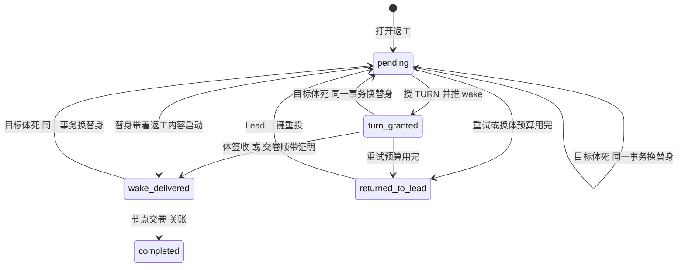

# FLY-2921 返工投递收成两态 — 实施计划
Issue: FLY-2921 (https://linear.app/geoforge3d/issue/FLY-2921/病根修复-6-返工投递收成两态送达-失败交还-lead投给死体改投替身不再把整条-run-打-held6-张-46)
日期: 2026-09-26
基于: research.md

状态：draft，待设计评审。审计基线 `d52df7841`，分支 `flywheel-FLY-2921`。设计节点只产出文档，不含实现、生产验证、合并或部署（部署由独立 updater 按窗口执行）。行号以基线为准，实现时一律按符号查找。

## 1. 给 founder 的结论

**一句话：返工交出去只有两种结局——送到了，或者交还 Lead；投给死体就当场换替身重投，任何投递失败都不再冻结整条任务链。**



- 状态从 8 个减到 5 个。删掉 `awaiting_receipt`、`replacement_pending`、`needs_lead`、`held` 四个中间态。
- **成功链**：`wake_delivered`（显示为「送达」）→ `completed`（显示为「已交卷关账」）。
- **失败终点只有一个**：`returned_to_lead`（显示为「交还 Lead」）。run 保持 active，Lead 收到一条告警，里面只有一扇确定能用的门。
- 「投给死体」不再是失败：协调器在认领这一行的同一次处理里把替身铸好，投递回到 `pending` 并指向新体。
- 实现节点返工交卷时，交付的 git head 必须和被判 FAIL 的那个 head 不同，而且除了进度账本以外确实改了东西，否则拒收，不派 QA。

## 2. 状态词汇（唯一来源）

数据库字面值是稳定身份，不改名；显示文案只在告警、巡检和 HTML 里用。

| 字面值 | 显示文案 | 含义 | 谁写入 | 终态 |
|---|---|---|---|---|
| `pending` | 待投 | 引擎要把返工交给当前指定体；包括退避等待和「替身已铸、启动中」 | 打开返工、换替身事务、Lead 重投 | 否 |
| `turn_granted` | 已发待签收 | 已授 TURN；`wake_sent_at` 非空表示 wake 已推，等体签收 | 协调器 | 否 |
| `wake_delivered` | 送达 | 体已签收，或替身带着返工内容启动 | 签收投影、替身启动事务、交卷顺带证明 | 否（等交卷） |
| `completed` | 已交卷关账 | 返工被节点交卷消费，或被操作员取消 | 工作流转移、取消 | 是 |
| `returned_to_lead` | 交还 Lead | 自动投递放弃，交给 Lead 决定 | 协调器失败结算 | 对引擎是终态；Lead 重投后回 `pending` |

保留 `wake_delivered` 这个字面值（而不是改成 `delivered`），因为事件名 `rework_delivery_wake_delivered` 被 529 验收脚本和 FLY-2456 脚本依赖，改名没有任何行为收益。

新增列：`wake_sent_at TEXT NULL`。这是一个事实（wake 已推送的时间），用来替代 `awaiting_receipt` 这个状态。

## 3. 改动

### C1 状态机本体与迁移（StateStore）

1. 基础建表（35141）与 `WorkflowReworkDeliveryRow`（88928）改为 5 态 CHECK，并加 `wake_sent_at`。
2. 新迁移 `migrateWorkflowReworkDeliveryTwoState()`：
   - 跳过条件：表 SQL 含 `returned_to_lead`、不含 `awaiting_receipt`，且有 `wake_sent_at` 列。
   - 否则关外键、建 `_next`、拷贝并映射行、删旧、改名。沿用 `migrateWorkflowReworkDeliveryBudget` 的写法。
   - 行映射见 §5。
3. **必须同时改**旧迁移 `migrateWorkflowReworkDeliveryBudget` 的跳过条件：改成按列判断（`hold_count`、`next_retry_at`、`grant_started_at` 都存在就跳过），不再看状态字面值。否则启动时它会把新表重建回 8 态 CHECK。新迁移排在旧迁移之后执行。
4. `assertMaintenanceSchema` 7041–7046 的检查从 `'needs_lead'` 改为 `'returned_to_lead'`。
5. `advanceWorkflowReworkDelivery` 的允许表只保留：
   - `pending → turn_granted`
   - `turn_granted → wake_delivered`（由签收投影专用函数写，通用 CAS 不开放）
   - `wake_delivered → completed`
   - 死 `→held`、死 `→completed`（从 `replacement_pending`）、所有 `→awaiting_receipt`、`→replacement_pending` 分支一并删除。
6. 推送成功后不再改状态，改为写 `wake_sent_at`，调用 `markWorkflowReworkWakeSent({requestId, ownerId, generation, now})`：CAS 条件是 owner、generation、`state='turn_granted'`，同时设 `next_retry_at = now + 3min` 并释放 owner。
7. `projectWorkflowReworkWakeReceiptTx` 的源状态从 `awaiting_receipt` 改为 `turn_granted`（`wake_sent_at` 是否为空都接受）。这也修掉一个竞态：wake 刚推出去体就签收了，旧代码因为还没推进到 `awaiting_receipt` 而丢签收。
8. `settleWorkflowReworkOnCompletionTx` 的「交卷顺带证明」源集合改为 `turn_granted`。

### C2 协调器：投给死体就地改投替身（`workflow-rework-coordinator.ts` + StateStore）

**新事务 `replaceWorkflowReworkActor`**（重构自 `materializeWorkflowReworkReplacement`，单事务）：

- **入参**：`requestId, ownerId, generation, deadExecutionId, newExecutionId, reason, observedAt`。
- **前置条件**：
  - 调用方持有该行的认领（owner + generation 的 CAS）；
  - 状态属于 `pending | turn_granted | wake_delivered`；
  - 路由版本一致；
  - `preferred_actor_execution_id = deadExecutionId`；
  - 目标节点 `execution_id = deadExecutionId`，且节点状态为 `pending | admitted | running`，或者为 `failed` 但该执行体有未启动回滚事实（替身启动回滚会把节点写成 `failed`，旧物化只接受前三种，这里要补上）；
  - run 为 active 且 `engine_owned`。
  - 不再要求 `replacement_pending`，删掉 `recoverHeldPaneLoss` 分支。
- **动作**：保留原物化的全部动作（终结死会话、结清停驻、撤凭据、分配启动序号 reason=`rework_replacement:<req>`、节点换新执行体、追加路由版本 `engine:proven_dead_replacement`、重铸投递 attempt、死体观察），然后把投递置为 `pending`，并清空 owner、lease、`wake_sent_at` 和 `grant_started_at`。
- **回执 UID 改为按路由版本**：`rework_replacement_materialized:<requestId>:<deadRouteRevision>`。修掉「一个请求只能换一次体、第二次死亡回放出同一具死替身」。
- **换体预算**：从最近一次 Lead 重投（或请求打开）算起，累计换体 3 次。第 4 次需要换体时不铸，转 C3 结算为 `returned_to_lead`，原因 `replacement_budget_exhausted`。计数的来源是路由版本表：统计 `interpreted_by IN ('engine:proven_dead_replacement','engine:resume_fallback')` 且版本号大于最近一次 `engine:hold_resume` 的行数，不新增列。

**协调器 `reconcile` 新流程**（按顺序，每步只有一个出口）：

1. 上下文不齐（请求、路由、投递、run 缺失，或 run 不是 active）：
   - run 不是 active：只释放，不计数。这是旧 held run 上的遗留行，留给 2922 或 Lead。
   - 其余情况：计一次失败（C3）。
2. 旧车道收敛（`convergeWorkflowReworkWriterReplacement`）：保留，仅用于兼容已存在的半铸体。结果改为「投递回 `pending` + 新路由版本」，不再写 `replacement_pending`。
3. **替身启动中**（新谓词 `isReworkReplacementLaunching`）：
   - 判定条件：投递 `pending`，最新路由的 `interpreted_by` 是两种替身来源之一（`engine:proven_dead_replacement`、`engine:resume_fallback`），目标节点状态为 `pending` 或 `admitted`（替身准入后、`markStarted` 之前节点是 `admitted`），`execution_id = preferred_actor`，并且没有未启动回滚事实。
   - 结果：`replacement_launching`，释放 owner，设 `next_retry_at = now + 30s`，**不计失败**。
   - 如果有未启动回滚事实（此时节点为 `failed`）：视为替身已死，走第 4 步。
4. **目标体已死**（任一即成立）：
   - 会话处于不可逆终态；
   - 重入分类为 `replace`；
   - 驻留 hold 为 `expired`/`closed`（wake 返回 `resident_hold_expired`）；
   - 有未启动回滚事实；
   - 结果：在本次认领内调用 `replaceWorkflowReworkActor`，得到 `replacement_minted`；预算耗尽则得到 `returned_to_lead`。
5. **活性未知**：
   - 重入分类为 `hold`，包括 `persisted_target_missing`；
   - 状态为 `turn_granted` 且 `wake_sent_at` 非空，或状态为 `wake_delivered`：`receipt_pending`，3 分钟后复探，不计数。
   - 状态为 `pending`：计一次失败。
   - 删掉 `handoff_held_pane_loss`。死亡真值由 FLY-2919 的进程证据提供；证死走第 4 步，证不了死就走重试预算。
6. **活体且已发**（`turn_granted` 且 `wake_sent_at` 非空，或 `wake_delivered`）：复探等待，不计数。
7. **其余**（`pending`，或 `turn_granted` 但 `wake_sent_at` 为空，即崩溃在授权与推送之间）：
   - 走原来的准入、授 TURN、唤醒整段流程。该流程按 wakeId 幂等，见 research §3.3。
   - wake 成功：若原为 `pending` 先推进到 `turn_granted`，然后写 `wake_sent_at`。
   - wake 返回 `resident_hold_expired`：走第 4 步。
   - wake 返回其他错误：计一次失败。

**TURN 与 wake 的身份按路由版本区分**（修「重投读到旧失败」）：现在 `sourceEventId = rework-turn:<req>:<activationId>`、wakeId 由 `{requestId, activationId, epoch}` 派生，同一个请求重投时 TURN source 相同 ⇒ `grantTurn` 回放出同一 epoch ⇒ 同一个 wakeId；CommDB `turn_wake_outbox.push_count` 上限是 2（flywheel-comm db.ts:310），两次推送失败以后，即使 Lead 修好了传输、重投，也只会读到旧的失败结果。改为 `sourceEventId = rework-turn:<req>:<activationId>:r<routeRevision>`。每次 Lead 重投、每次换体都会追加路由版本，于是得到新的 grant、新的 epoch、新的 wakeId。activationId 保持 `activation:<req>` 不变，准入仍按现有幂等回放和凭据轮换（FLY-2332）处理。兼容：迁移过来的 `turn_granted` 且 `wake_sent_at` 非空的行走观察分支，不会重新授予；只有「已授权、未推送」的崩溃窗口行会按新格式再授予一次，生产上这样的活行为 0。

**Outcome 联合类型**改为：`wake_sent`、`receipt_pending`、`replacement_minted`、`replacement_launching`、`disabled`、`retryable`、`busy`、`settled`（state ∈ `wake_delivered | completed | returned_to_lead`）、`invalid`。删掉 `awaiting_receipt` 和 `replacement_pending` 两个 kind。

### C3 失败只有一个终点：交还 Lead，不冻 run

1. `settleWorkflowReworkFailure`：
   - 退避不变：1、2、4、8 分钟；第 5 次（或换体预算耗尽）结算为 `returned_to_lead`。
   - 删除 run 置 held（46083、45949）。
   - 删除「撤目标节点预留」，即把节点改成 `superseded`（修 FLY-2092）。
   - 删除验证路径置 `needs_lead`。
   - 删除 `onExhausted` 参数和窗格交接分支。
   - 凭据处理保留原规则：TURN 未授出时撤销未消费的激活凭据；已授出（ambiguous grant）则保留。
   - 同事务写 delivery 作用域的 hold 事件 `rework_returned_to_lead`：UID `rework_returned_to_lead:<requestId>:<routeRevision>`；payload 含 requestId、routeRevision、reason、holdCount、replacementCount、cleanupDisposition。
   - 发一条严重告警，处置 `rework_returned_to_lead`，身份按事件 UID。它和 FLY-2910 的六小时去重键不共用。
2. **注册新 hold 形状**：`hold-shape-registry.ts` 与 manifest、inventory 加 `rework_returned_to_lead`，`scope: "delivery"`、`resumeAction: "resume_rework"`，不设 `requiredDecision`（与现有 `rework_retry_exhausted` 一致，恢复即重投）。delivery 作用域在 `listWorkflowHolds` 里没有 `run_held` 前置，`resumeWorkflowHold` 也只在 `runLevel` 时改 run 状态，所以 run 保持 active。
3. **Lead 的唯一一扇门：重投**。用现有的 `flywheel-comm hold resume`（stage → confirm → apply，master + loopback + 一次性令牌）。`applyStateWorkflowHoldResumeActionTx` 的 `resume_rework` 分支改动：
   - 源状态从 `held`、`needs_lead` 改为 `returned_to_lead`；
   - 新增前置：目标节点仍由本请求预留，即节点状态为 pending/admitted/running，且 `execution_id` 等于路由的 `preferred_actor`，或者该体已证死（此时协调器会换体）；
   - 不满足前置时拒绝，原因 `rework_target_superseded`，提示改走 founder 的 `/rework`。这种情况只会出现在迁移过来的旧行上。
   - 通过后追加 `engine:hold_resume` 路由版本，投递回 `pending`，`hold_count` 清零，换体预算随之重新计数。
4. **告警正文**写成人话，并给出一条可以直接复制的命令：`flywheel-comm hold resume --run <runId> --shape rework_returned_to_lead --hold-event <事件UID> --reason "<Lead 的处理说明>"`（参数取自 `flywheel-comm/src/commands/hold.ts:27` 的现行用法；告警里直接填好 runId 与事件 UID）。另附一句：如需改返工内容，请走 founder 的 `/rework`；要放弃就用现有的 terminate。
5. **`openOperatorRework`（`/rework`，founder 授权门）兼容改动**：
   - 查找 `needs_lead` 行改为查找 `returned_to_lead` 行；
   - 不再要求 run 为 held（active 也接受）；
   - 静默校验改用 active run 的同款校验，删除 `validateNeedsLeadReworkQuiescenceTx` 的「全 run 执行体 30 秒内证死」，修 FLY-2473；
   - 安全性改由同事务的凭据撤销保证：保留 `needs_lead_activation_already_consumed` 拒绝（改名为 `returned_activation_already_consumed`，旧名作兼容别名）、撤凭据、把旧目标置 `superseded`、验证路径作废；
   - `findOpenWorkflowReworkForRun` 与之前排除 needs_lead 的做法一致，排除 `returned_to_lead`。
6. **`resolveOpenWorkflowReworkTarget`** 仍把 `returned_to_lead` 视为「占用目标」。它的作用是围住调度器，防止任何车道在 Lead 决定之前给该节点铸出没有返工上下文的体。

### C4 其余会把 run 冻住的投递路径（FLY-2330）

1. **`rollbackUnlaunchedWorkflowAdmission`** 的 replacement 绑定分支（41262–41280）：删除「run 置 held」和「投递置 held」。改为保留事件与告警（降为普通级）、投递留在 `pending`、`next_retry_at = now`，由协调器第 3 步识别未启动回滚，再按第 4 步换体（受预算约束）。非 replacement 绑定的分支不动，归 FLY-2922。
2. **`delivery-contract/watch.ts:219-225`**：删掉返工那一半（不再因 `awaiting_receipt`/`replacement_pending` 加收件体不活而判「投不到」）。载体那一半不动。
3. **`holdUndeliverableTx`**（57133）：若 attempt 属于返工（rework 家族，或 turn_wake 家族且 wake 的 `purpose='workflow_rework'` / wakeId 能解析为返工 wake），就不铸 hold、不冻 run。改为结算该 attempt（`recipient_terminal_rework_owned`），把对应投递的 `next_retry_at` 设为 now，由协调器按 C2 第 4 步换体。实现时把 57159 已有的「返工 wake 已退役」短路扩成这条通用规则。`finalizeUndeliverableHoldTx` 的 `runHeld` 条件同步加上 `family !== "rework"` 作为兜底断言。
4. **`openReworkContentUndeliverableTx`**（64978），即替身交卷时发现缺内容回执：不再铸 hold、不冻 run。交卷照旧拒绝（`rework_content_not_delivered`，可重试），同一事务把投递按同一执行体追加路由版本、回到 `pending` 并计一次失败。这一步没有协调器的认领，所以用无主 CAS：只有 `owner_id IS NULL` 或租约已过期时才改；有人持有时只记拒绝事件，下一轮协调器会自己看到。改完以后，让协调器用 TURN 上下文把返工内容重新送到这个活替身手里；5 次后交还 Lead。
5. **暂存取消永不落地**（`delivery-operations.ts:572-592`）：
   - 任何非 ok 分支（没有该家族的取消实现、comm 拒绝、apply 拒绝）一律调用 `markWorkflowHoldResumeFailed`，带上精确原因，不再静默 `continue`；
   - `cancelTurnWakeDelivery` 遇到「源已被 terminal_guard 取消」时，按幂等成功处理，与 mailbox 的 DEAD 同构；
   - 326–328 的 `!family || !rootId` 同样改为标记失败。
   - 这条修的是遗留和其他家族的取消门，不新增家族。

### C5 驻留 hold：第二次返工不再「投不到」（FLY-2821）

1. `resident-wake-fence.ts` `deliverResidentWake`：hold 为 `woken` 时直接调用 `deliver()` 并返回它的结果，不做 hold CAS。体醒着，wake 进持久信箱就等于发出。只有 `expired`/`closed` 返回 `resident_hold_expired`，由协调器换体。
2. `enterResidentHoldForCompletionTx`（64643）：已有的 hold 为同一 `execution_id`、同一 `node_id`、状态 `woken`，且交卷绑定的 activation 是该执行体当前的激活时，把 hold 重新停驻：`activation_id` 更新为当前激活、状态 `resident`、revision+1。activation 不同时不再 return false。这样第二次返工走正常的 resident 路径，驻留宽限到期回收也恢复工作。非当前激活（迟到的旧交卷）仍然拒绝。
3. ship 载体共用这道 fence（plugin.ts:15206–15270），两处改动对它同样生效，并补一条回归。

### C6 替身只有一条铸造路（FLY-2185）

1. 调度器通用死体回收（dispatcher.ts 约 2440–2530，调用 `rollbackDeadWorkflowNodeExecution`）：
   - 节点若是未关账返工的目标（`resolveOpenWorkflowReworkTarget` 非空且无冲突），跳过；
   - 同时把该投递的 `next_retry_at` 设为 now，交给协调器按 C2 换体。
2. `rollbackDeadWorkflowNodeExecution` 本体加同一条守卫作纵深防御，拒绝原因 `rework_target_owned_by_coordinator`。
3. `allocateWorkflowResumeFallback`（48709）：投递改为 `pending` + 新路由版本（不再写 `replacement_pending`），与替身同形，由 C2 第 3 步识别为「启动中」。
4. 调度器：
   - 删除 1405–1421 的物化分支；
   - 启动围栏 2805–2821 改为：`preferredActor === intent.execution_id`，且 `intent.reason === rework_replacement:<req>`，且 `deliveryState === 'pending'`；
   - 替身上下文 2848 的状态条件同样改为 `pending`；
   - `markWorkflowReplacementStartedTx` 的源状态改为 `pending`。
   - 其余不变：`engine_rework_replacement_context_invalid` 仍然 fail-closed。

### C7 交卷必须有新提交（FLY-2202，并 FLY-2472）

1. **event-route.ts**（1603–1810 交卷路由）：
   - 触发条件：交卷的绑定对应一个未关账返工的目标节点，节点能力 `completion_route === "needs_review"`，并且是成功路由。
   - 用服务端工作树权威计算 `git diff --name-only <base_revision>..<completionHead>`，带超时，只取前 200 条。
   - 排除进度账本路径 `engineering/doc/*/progress.md`（`flywheel-comm progress` 自动提交的那一个文件）。
   - 把结果作为 `reworkDelta = { baseRevision, changedPaths: number }` 传进 `commitEnrolledCompletion`。
   - git 失败时不猜，传 `reworkDelta: { unavailable: true }`。
2. **`commitWorkflowTransitionTx`**：在 `activePathCurrentIndex` 算出之后（67979 之后）、`completesConflictResolution` 之前插入校验，只在「当前节点是返工目标（index 0）且 `needs_review`、且为成功边」时生效：
   - `input.subjectDigest` 缺失（例如走了 65626 的会话回落）：拒绝，原因 `rework_head_unavailable`。
   - 与 `activeRequest.base_revision` 相同（大小写不敏感）：拒绝，原因 `rework_head_unchanged`。
   - `reworkDelta.baseRevision` 与 `activeRequest.base_revision` 不一致（防止检查时和使用时之间被偷换）：拒绝，原因 `rework_delta_stale`（可重试，下次交卷会重新计算）。
   - `reworkDelta` 缺失或 `unavailable`（例如 FAIL 那个 head 的对象已不在本地库）：只要 head 已经不同于 base 就放行，并写审计事件 `rework_delta_unverified`。理由：这里如果 fail-closed，体会永远交不了卷，等于造出一个新的卡死态。
   - `changedPaths === 0`：拒绝，原因 `rework_no_product_change`。
   - `base_revision` 不是 40 位十六进制（历史上的 `"unavailable"` 兜底值）：放行，并写审计事件 `rework_head_check_skipped`，因为没有可比对的 head。
   - 拒绝均为 `retryable:true`，不改任何状态。已做的「交卷顺带签收」由 69238–69246 回滚。`WorkflowTransitionResult` 的 reason 联合类型加上这些值。
   - 每个请求 + head 只写一条去重事件 `rework_completion_refused:<req>:<head>:<reason>`，供巡检查看。
3. `flywheel-comm complete` 对这些原因打印人话提示：「返工交卷必须带新提交；若确实不需要改代码，请用 `complete --route blocked` 说明原因」。`blocked` 路由不受本校验约束。
4. 这条校验不看提交是谁做的，也不改 QA 的判法，只挡住「同一份字节再送一次 QA」。

### C8 消费者适配

| 文件 | 改动 |
|---|---|
| `workflow-engine-dispatcher.ts:1251` | 扫描状态改为 pending / turn_granted / wake_delivered；删除 held 窗格恢复块（1276–1368）和 `settleHeldReworkRecoveryFailure` 调用（1475–1497） |
| `patrol-loop-ledger.ts` | pending 恒为进度；turn_granted、wake_delivered 按活性判；returned_to_lead 不算进度，显示 `rework:returned_to_lead`（文案「交还 Lead」） |
| `hook-payload.ts` | 白名单加 `returned_to_lead`，删 `replacement_pending`；`needs_lead`、`wake_delivered`、`receipt_started` 留给载体 |
| `turn-wake-receipt-classifier.ts` | 停驻集合改为 `{returned_to_lead}`；签收的路由版本小于投递当前版本时判 `not_applicable`（换替身后旧 wake 的签收），接替原来「replacement_pending → not_applicable」的作用 |
| `LeadAlertNotifier.ts` | 加处置 `rework_returned_to_lead`；旧的两个值保留作历史解码 |
| `flywheel-comm complete.ts` | C7 的提示文案 |
| `scripts/qa-529-generalized-e2e.mjs` | 危险行改为「`returned_to_lead`，或 run 被返工 hold 冻结」；第 6 步的事件名和状态不变 |
| `lead-rules-base/runbooks/patrol-v1.md` 及镜像 `legacy-token-savings/runner-patrol-rules.md` | 附录 A（receipt 死结手工 SQL）与附录 B（替身漏账手工 SQL）改成短说明：「FLY-2921 后不再出现；遗留行已由迁移处理；遇到 `rework_returned_to_lead` 用 hold resume 重投」；同步改 `fly369-patrol-rule.test.ts:596-617` |
| `doc/engineer/implementation/turn-manual-handoff-runbook.md:11` | needs_lead → `returned_to_lead` 与新门 |

## 4. 删除清单

**状态**：`awaiting_receipt`、`replacement_pending`、`needs_lead`、`held`（仅指返工投递表）。

**分支 / 函数**（实现时逐个确认零调用后删除；若评审或 Lead 要求保留则改为兼容壳）：

| 删除对象 | 位置 | 原因 |
|---|---|---|
| `settleHeldReworkRecoveryFailure` | StateStore 45614 | 无 held 可恢复 |
| 调度器 held 窗格恢复块与 `heldReworkRecoveryProbeAt` | dispatcher 1276–1368、1475–1497 | 同上 |
| `materializeWorkflowReworkReplacement` 的 `recoverHeldPaneLoss` 分支 | StateStore 44684–44703 | 同上 |
| 调度器 `replacement_pending` → 物化分支 | dispatcher 1405–1421 | 由协调器就地铸 |
| `settleWorkflowReworkFailure` 的 run held、窗格交接、撤节点预留分支 | 45940–46090 | C3 |
| `rollbackUnlaunchedWorkflowAdmission` 的 replacement 冻结分支 | 41262–41280 | C4.1 |
| `watch.ts` 返工 undeliverable 半边 | 219–223 | C4.2 |
| `openReworkContentUndeliverableTx` 的冻 run 部分 | 64978– | C4.4 |
| `validateNeedsLeadReworkQuiescenceTx` | 50865 | C3.5 |
| `deliverResidentWake` 的 `resident_hold_already_woken` 返回 | fence 25 | C5 |
| 协调器 `markReplacementPending`、`handoff_held_pane_loss`、`awaiting_receipt` 推进 | coordinator 584–606、782、1181–1199 | C2 |
| `scripts/fly-1648-hot-loop-closeout.mjs` 及其测试 | scripts、`fly-1648-hot-loop-closeout.test.ts` | 一次性脚本（8 月已执行），依赖被删函数。**请评审 / Lead 确认删除**；若要留档就改成只读说明 |

`rework_activation_stalled_held`、`rework_retry_exhausted`、`rework_pane_loss_handoff` 三种 hold 形状**不删**：注册表继续解码历史事件，由 FLY-2922 的统一入口按历史存量处理。本单不再铸造它们。

## 5. 迁移与兼容

**行映射**（只读查询的生产现状见 exploration §5）：

| 旧状态 | 新状态 | 附加 |
|---|---|---|
| `awaiting_receipt` | `turn_granted` | `wake_sent_at = updated_at` |
| `replacement_pending` | `pending` | `last_error = 'migrated:replacement_pending:' + 原值`；协调器第 3 步判「启动中」，否则按第 4 步换体 |
| `needs_lead` | `returned_to_lead` | 保留 last_error |
| `held` | `returned_to_lead` | `last_error = 'migrated:held:' + 原值` |
| 其他 | 不变 | — |

- **只改字面值，不自动解冻任何 run**。活着的 run 上受影响的 8 行全部挂在 held run 上：FLY-2152 ×3、FLY-2031 ×2、FLY-2461、FLY-2390、FLY-2803。它们的 run 仍然 held，由原来的 hold 事件和门处理：
  - 对 `rework_retry_exhausted`、`rework_pane_loss_handoff`、`rework_activation_stalled_held`，前置条件 `workflowHoldAuthoritativePrecondition` 的期望状态改为 `returned_to_lead`（修 FLY-2473），恢复动作走 C3.3 的 `resume_rework`，恢复后 run 由现有 `runLevel` 逻辑回到 active；
  - 或走 FLY-2922 的统一入口；
  - 或 terminate。
- 迁移为每一条「非终态 run 上变成 `returned_to_lead` 的行」补写一个 `rework_returned_to_lead` delivery 作用域事件，UID 带 `migrated` 前缀、不发告警，保证每一行都有一扇门。
- 已终态 run 上的约 170 行只映射字面值，不写事件。
- **旧驻留 hold 卡在 `woken`**：不迁移数据。C5.1 让 `woken` 可以直接投，下一次交卷由 C5.2 重新停驻。
- **回滚（代码回退）**：新表的 CHECK 容不下旧代码写的 `awaiting_receipt`，而旧迁移按字面值判断，会拿 `returned_to_lead` 行去撞旧 CHECK。所以回退必须先在停服的 Bridge 上执行随 PR 提供的 `scripts/fly-2921-rollback.sql`：
  - `returned_to_lead → needs_lead`；
  - `turn_granted` 且 `wake_sent_at` 非空 → `awaiting_receipt`；
  - 从 `migrated:replacement_pending:` 前缀恢复的 `pending` → `replacement_pending`；
  - 最后按旧 CHECK 重建表。
  - 实现阶段要对该脚本做一次「新迁移 → 回滚脚本 → 旧代码启动」的往返测试。
  - 除此之外，代码回退不需要改其他数据。

## 6. 与兄弟单的合同（Lead 已认可边界：问题 `e2641287`；2919 分工与 K04 不变式确认见问题 `74884725`）

合并规则：**不合并实施，谁后合入谁 rebase 适配**。下表是两边都必须守住的不变式。本节原文交给对方的实现体。

### 6.1 与 FLY-2922（统一恢复口）

| 项目 | 本单（2921）负责 | 2922 负责 |
|---|---|---|
| 文件与函数 | `workflow-rework-coordinator.ts` 全部；StateStore 的 `settleWorkflowReworkFailure`、`replaceWorkflowReworkActor`（新，取代物化）、`advanceWorkflowReworkDelivery`、`projectWorkflowReworkWakeReceiptTx`、`markWorkflowReplacementStartedTx`、`allocateWorkflowResumeFallback` 的投递部分、`rollbackUnlaunchedWorkflowAdmission` 的 replacement 分支、`holdUndeliverableTx`/`openReworkContentUndeliverableTx` 的返工部分、`applyStateWorkflowHoldResumeActionTx` 的 `resume_rework`、`openOperatorRework` 的 needs_lead 分支；调度器 1251、1276–1497、2805–2853 | `runs-route.ts` hold 统一入口；统一恢复事务；`openOperatorRework` 其余 held 分支；`rollbackUnlaunchedWorkflowAdmission` 非 replacement 分支；land 恢复 |
| 不变式 1 | 返工投递状态集合是 `{pending, turn_granted, wake_delivered, completed, returned_to_lead}` | 不得写入其他值 |
| 不变式 2 | 返工投递的任何失败都不写 `workflow_run.status='held'` | 统一入口不能把返工投递失败再变成 run 级 hold |
| 不变式 3 | 新失败只产生 delivery 作用域 hold `rework_returned_to_lead` | 按「delivery-only 投递修复操作」对待，不进 redispatch 算法 |
| 不变式 4 | 给返工目标换体**只能**经 `replaceWorkflowReworkActor`，结果是投递 `pending` + 新路由版本（preferred = 新体）+ dispatch reason `rework_replacement:<requestId>` | redispatch_current 遇到返工目标节点，调用这个函数，或拒绝并指向它；**不写 `replacement_pending`**（2922 plan §3.3「恢复 replacement_pending」一句改为此形态） |
| 不变式 5 | 旧的三种返工 hold 形状保留解码，前置读 `returned_to_lead` | 作为历史存量输入；活的 preferred actor 用 `resume_rework` 重投语义 |

### 6.2 与 FLY-2919（生死单一真源，已批）

- **2919 负责「怎么判死」**：进程证据适配层、Heartbeat 采样、调度器死体扫描前置、`terminalizeProvenDeadSessionTx`，以及返工的 `probeRegistered`/`probePersisted` 迁到进程证据。
- **2921 负责「判死以后返工投递怎么办」**：协调器只消费重入分类与会话终态，自己不另造探针。
- **冲突点**：2919 plan 修改 `StateStore:44324` 的 `heldPaneLossRecovery` 和调度器 held 窗格恢复；本单删除这两处。
  - 2919 先合：2921 rebase 时删掉 2919 改过的版本，并把 2919 的进程证据接到协调器第 4、5 步。
  - 2921 先合：2919 丢弃这些 hunk。
- **本单新增**的「未关账返工目标 → 通用死体回收跳过」守卫（C6.1、C6.2）：2919 改死体扫描时必须保留。

### 6.3 与 K04（Codex 交卷/唤醒互锁；单号以 FLY-2072-triage `fixclasses.json` 的 K04 为准，Lead 已确认只需写明不变式）

- `resident-wake-fence.ts` 的不变式：**`woken` 不等于投不到**。只有 `expired`/`closed` 才算「体已退役、需要换体」。
- `enterResidentHoldForCompletionTx` 对当前激活的交卷会重新停驻。
- K04 如果重写 fence 或驻留生命周期，必须保留这两条，并保留本单 C5 的回归测试。

## 7. 负面守卫（本单明确不做 / 不许发生）

- 不改 ship 载体表 `workflow_carrier_delivery` 的任何状态。
- 不改 `workflow_rework_verification_path` 的词汇。它的 `needs_lead` 是验证路径的作废标记，属于另一张表。
- 不改 mailbox 家族（#1084 已修）。phase_wake 家族「投不到」冻 run 的问题不在本单范围，列为已知边界。
- 不给「已发、体活着、迟迟不签收」加截止时间。等待期间由活性兜底：体死了就换体；体交卷就等于签收。Codex 体不消费 wake 的问题归 K04。
- 不自动解冻任何现存 held run，也不自动关闭 6 张 Linear 单。Lead 在合入并部署后逐张复核。
- 不新增 API、不新增 run 状态、不新增表。唯一新增的列是 `wake_sent_at`。
- 交卷校验不信调用方自报的 head，只用 event-route 服务端解析的 head。
- 告警正文里的 issue、分支、路径等派生文本一律按现有告警转义规则输出。

## 8. 测试计划

### 8.1 每张单构造一次原现象（先红后绿）

| 单 | 构造 | 修前（应红） | 修后（断言） |
|---|---|---|---|
| FLY-2330 | 返工 wake 投给已死体，触发投递合同的「投不到」 | run held + `delivery_undeliverable_no_recipient` | 无 hold、run active、attempt 被结算为 `recipient_terminal_rework_owned`、下一次协调铸出替身；另测替身交卷缺内容：拒交卷、无 hold、投递回 pending |
| FLY-2330 取消门 | 遗留的 turn_wake「投不到」hold，源已被 terminal_guard 取消，再 stage 一个 cancel | 操作永远 staged | 一个 pass 内变成 applied（幂等），或 failed 且带原因；绝不停在 staged |
| FLY-2821 | 同一 run：首次交卷 → 返工 R1 送达 → R1 交卷 → QA 再 FAIL → R2 | R2 的 wake 返回 `resident_hold_already_woken`，5 次后 needs_lead + held | R1 交卷后 hold 回到 resident；R2 正常送达；另测 hold 卡在 `woken`（旧数据）也能直接投 |
| FLY-2185 | ①目标体死；②替身死；③替身启动回滚（节点 `failed`）；④通用死体扫描碰到返工目标；⑤替身已准入（节点 `admitted`）尚未启动时协调器认领 | ①② 第二次返回同一具死替身；③ run held；④ 铸出无上下文的体 | 每次一个新体；启动中不计失败；③ 投递 pending 并再换体；④ 跳过并交给协调器；⑤ 判「启动中」不唤醒、不计数；第 4 次换体结算为 returned_to_lead |
| FLY-2473 | 耗尽 | needs_lead + 两扇门都拒 | returned_to_lead + run active；hold resume 重投成功（preferred 体活着也行）；用**真实 CommDB** 回归：同一 wake 两次推送失败后 Lead 重投，得到新 epoch、新 wakeId 并推送成功；`/rework` 在 active run 上也接受 |
| FLY-2092 | 耗尽清理 | 目标节点被置 superseded，复位被拒 | 目标节点不变；重投后协调器正常认领 |
| FLY-2202 / 2472 | 返工目标零提交交卷；只多了一次 progress.md 提交；真改代码 | 前两种都接受并派 QA | 前两种分别被拒为 `rework_head_unchanged`、`rework_no_product_change`，不派 QA；第三种接受。另测 blocked 路由不受限、非 40 位 base 放行并写审计 |

### 8.2 其他必测

- **迁移**：
  - 8 态旧库（每种状态各一行）→ 新库：映射正确、行数不变、外键完好；
  - 第二次启动两条迁移都跳过（专门防旧迁移按字面值误重建）；
  - 回滚脚本往返。
- **负控**：
  - 任何返工代码路径都不写 `workflow_run.status='held'`：全文件 grep 守卫测试，加运行时断言；
  - 替身预算不会无限铸；
  - 旧 wake 在换体后签收被判 not_applicable；
  - 旧激活的迟到交卷不会重新停驻。
- **并发**：同一行两个认领（CAS 只有一方胜出）；换体事务与交卷事务竞争，一方胜出，迟到的一方被拒且不推进后继。

### 8.3 本机只跑相关测试

先设隔离根，避免 `startBridge` 测试清掉生产 Codex 租约；并排除会打开真实 Terminal 的用例：

```bash
export FLYWHEEL_CODEX_HOMES_ROOT="$(mktemp -d)"
pnpm --filter flywheel-teamlead exec vitest run \
  src/__tests__/StateStore.workflow-rework.test.ts \
  src/bridge/__tests__/workflow-rework-coordinator.test.ts \
  src/bridge/__tests__/workflow-rework.e2e.test.ts \
  src/__tests__/fly2504-rework-replacement-receipt.test.ts \
  src/__tests__/workflow-engine-dispatcher.test.ts \
  src/__tests__/fly2096-rework-stall-hold.test.ts \
  src/__tests__/fly2517-rework-wake-retirement.test.ts \
  src/__tests__/fly2278-hold-cancel.test.ts src/__tests__/fly2278-state-reroute.test.ts \
  src/__tests__/fly2324-delivery-legacy.test.ts \
  src/__tests__/StateStore.workflow-engine-transition.test.ts \
  src/__tests__/StateStore.founder-kickback-newcard-loop.test.ts \
  src/__tests__/StateStore.land-lifecycle.test.ts src/__tests__/StateStore.land-carryover.test.ts \
  src/__tests__/StateStore.engine-invariant.test.ts src/__tests__/StateStore.generalized-execution.test.ts \
  src/__tests__/StateStore.workflow-holds.test.ts src/__tests__/hold-shape-registry.test.ts \
  src/__tests__/patrol-loop-ledger.test.ts src/__tests__/patrol-tick-render.test.ts \
  src/__tests__/patrol-tick-loop.integration.test.ts src/__tests__/event-route.test.ts \
  src/__tests__/fly369-patrol-rule.test.ts \
  src/bridge/__tests__/turn-wake-receipt-classifier.test.ts src/bridge/__tests__/turn-wake-patrol.test.ts \
  src/bridge/__tests__/workflow-ship-carrier-coordinator.test.ts \
  --exclude '**/tmux-viewer.macos.test.ts'
pnpm --filter flywheel-comm exec vitest run src/__tests__/complete.test.ts
node --test scripts/__tests__/qa-generalized-e2e-lib.test.mjs scripts/__tests__/qa-fly-2456-rework-adopt.test.mjs
pnpm --filter flywheel-teamlead exec tsc --noEmit && pnpm exec biome check <改动文件>
```

判 lint 看退出码和 `Found N errors`，不要用 grep 过滤诊断输出。

**完整 CI 由 PR 触发，不在本机跑全量。**

## 9. 风险

| 风险 | 缓解 |
|---|---|
| run 不再冻结后，返工目标节点「挂着」没人动 | `returned_to_lead` 进巡检圈显示、发严重告警；调度器围栏继续挡住无上下文的铸体 |
| 换体过于积极，误杀活体 | 死亡只认 2919 的进程证据和不可逆终态；未知只复探、不换体 |
| 删 `validateNeedsLeadReworkQuiescenceTx` 后，`/rework` 期间旧体仍然活着 | 同事务撤凭据；已消费的激活拒绝；TURN 转给新请求后旧体写不进来 |
| 交卷 diff 在大仓上慢，或算不出来 | 限时加只取前 200 条；算不出来时退回只比 head（不同即放行并留审计），不制造新的卡死态 |
| 与 2919/2922/K04 并行改同一片 | §6 合同 + 后合者 rebase；各自回归测试互相保留 |
