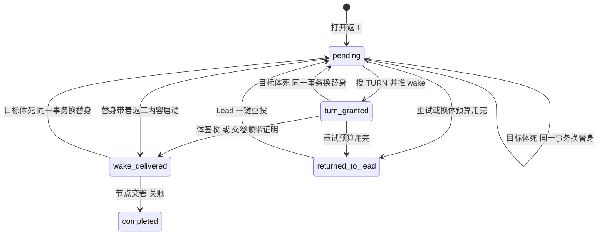

# FLY-2921 返工投递收成两态 — 实施计划
Issue: FLY-2921 (https://linear.app/geoforge3d/issue/FLY-2921/病根修复-6-返工投递收成两态送达-失败交还-lead投给死体改投替身不再把整条-run-打-held6-张-46)
日期: 2026-09-26
基于: research.md

状态：draft，已按两轮评审意见修订（见文末「评审记录」），待有效设计评审。审计基线 `d52df7841`，分支 `flywheel-FLY-2921`。设计节点只产出文档，不含实现、生产验证、合并或部署（部署由独立 updater 按窗口执行）。行号以基线为准，实现时一律按符号查找。

## 1. 给 founder 的结论

**一句话：返工交出去只有两种结局——送到了，或者交还 Lead；投给死体就当场换替身重投，任何投递失败都不再冻结整条任务链。**



- 状态从 8 个减到 5 个。删掉 `awaiting_receipt`、`replacement_pending`、`needs_lead`、`held` 四个中间态。
- **成功链**：`wake_delivered`（显示为「送达」）→ `completed`（显示为「已交卷关账」）。
- **失败终点只有一个**：`returned_to_lead`（显示为「交还 Lead」）。run 保持 active，Lead 收到一条告警，里面只有一扇确定能用的门。
- 「投给死体」不再是失败：协调器在认领这一行的同一次处理里把替身铸好，投递回到 `pending` 并指向新体。
- 实现节点返工交卷时，交付的 git head 必须和被判 FAIL 的那个 head 不同，而且除了进度账本以外确实改了东西，否则拒收，不派 QA。

## 2. 状态词汇（唯一来源）

数据库字面值是稳定身份，不改名；显示文案只在告警、巡检和 HTML 里用。

| 字面值 | 显示文案 | 含义 | 谁写入 | 终态 |
|---|---|---|---|---|
| `pending` | 待投 | 引擎要把返工交给当前指定体；包括退避等待和「替身已铸、启动中」 | 打开返工、换替身事务、Lead 重投 | 否 |
| `turn_granted` | 已发待签收 | 已授 TURN；`wake_sent_at` 非空表示 wake 已推，等体签收 | 协调器 | 否 |
| `wake_delivered` | 送达 | 体已签收，或替身带着返工内容启动 | 签收投影、替身启动事务、交卷顺带证明 | 否（等交卷） |
| `completed` | 已交卷关账 | 返工被节点交卷消费，或被操作员取消 | 工作流转移、取消 | 是 |
| `returned_to_lead` | 交还 Lead | 自动投递放弃，交给 Lead 决定 | 协调器失败结算 | 对引擎是终态；Lead 重投后回 `pending` |

保留 `wake_delivered` 这个字面值（而不是改成 `delivered`），因为事件名 `rework_delivery_wake_delivered` 被 529 验收脚本和 FLY-2456 脚本依赖，改名没有任何行为收益。

新增两列，都是事实而不是状态：
- `wake_sent_at TEXT NULL`：wake 已推送的时间，替代 `awaiting_receipt` 这个状态；
- `liveness_unknown_since TEXT NULL`：目标体活性从何时起判不出，用于升级告警（C2 第 5 步）。

## 3. 改动

### C1 状态机本体与迁移（StateStore）

1. 基础建表（35141）与 `WorkflowReworkDeliveryRow`（88928）改为 5 态 CHECK，并加 `wake_sent_at`、`liveness_unknown_since` 两列。
2. 新迁移 `migrateWorkflowReworkDeliveryTwoState()`：
   - 跳过条件：表 SQL 含 `returned_to_lead`、不含 `awaiting_receipt`，且两列 `wake_sent_at`、`liveness_unknown_since` 都存在。
   - 否则关外键、建 `_next`、拷贝并映射行、删旧、改名。沿用 `migrateWorkflowReworkDeliveryBudget` 的写法。
   - 行映射见 §5。
3. **必须同时改**旧迁移 `migrateWorkflowReworkDeliveryBudget` 的跳过条件：改成按列判断（`hold_count`、`next_retry_at`、`grant_started_at` 都存在就跳过），不再看状态字面值。否则启动时它会把新表重建回 8 态 CHECK。新迁移排在旧迁移之后执行。
4. `assertMaintenanceSchema` 7041–7046 的检查从 `'needs_lead'` 改为 `'returned_to_lead'`。
5. `advanceWorkflowReworkDelivery` 的允许表只保留：
   - `pending → turn_granted`
   - `turn_granted → wake_delivered`（由签收投影专用函数写，通用 CAS 不开放）
   - `wake_delivered → completed`
   - 死 `→held`、死 `→completed`（从 `replacement_pending`）、所有 `→awaiting_receipt`、`→replacement_pending` 分支一并删除。
6. 推送成功后不再改状态，改为写 `wake_sent_at`，调用 `markWorkflowReworkWakeSent({requestId, ownerId, generation, now})`：CAS 条件是 owner、generation、`state='turn_granted'`，同时设 `next_retry_at = now + 3min` 并释放 owner。
7. `projectWorkflowReworkWakeReceiptTx` 的源状态从 `awaiting_receipt` 改为 `turn_granted`（`wake_sent_at` 是否为空都接受）。这也修掉一个竞态：wake 刚推出去体就签收了，旧代码因为还没推进到 `awaiting_receipt` 而丢签收。
8. `settleWorkflowReworkOnCompletionTx` 的「交卷顺带证明」源集合改为 `turn_granted`。另外接受一种自愈情形：`returned_to_lead`，且 `grant_started_at` 非空、TURN 的 epoch 与路由版本都匹配时，体确实拿到了写入权并交了卷，就按顺带签收处理。同一事务给该行的 `rework_returned_to_lead` hold 写 `hold_resumed` 回执，这扇门随之关闭。
9. `claimWorkflowReworkDelivery` 目前只对 `awaiting_receipt|wake_delivered` 保留 `updated_at`。改为对「`turn_granted` 且 `wake_sent_at` 非空」和 `wake_delivered` 保留，否则每次复探都会把巡检看到的「停留时长」清零。
10. `wake_sent_at` 与现有投递时钟 `sent_at`（`projectWorkflowDeliveryClockTx`，46243）在同一事务内写入。前者留在投递行上是为了参与 CAS；两者含义相同，实现时注释说明这份冗余。

### C2 协调器：投给死体就地改投替身（`workflow-rework-coordinator.ts` + StateStore）

**新事务 `replaceWorkflowReworkActor`**（重构自 `materializeWorkflowReworkReplacement`，单事务）：

- **入参**：`requestId, ownerId, generation, deadExecutionId, newExecutionId, reason, observedAt`。
- **前置条件**：
  - 调用方持有该行的认领（owner + generation 的 CAS）；
  - 状态属于 `pending | turn_granted | wake_delivered`；
  - 路由版本一致；
  - `preferred_actor_execution_id = deadExecutionId`；
  - 目标节点 `execution_id = deadExecutionId`，且节点状态为 `pending | admitted | running`，或者为 `failed` 但该执行体有未启动回滚事实（替身启动回滚会把节点写成 `failed`，旧物化只接受前三种，这里要补上）；
  - run 为 active 且 `engine_owned`。
  - 不再要求 `replacement_pending`，删掉 `recoverHeldPaneLoss` 分支。
- **动作**：保留原物化的全部动作（终结死会话、结清停驻、撤凭据、分配启动序号 reason=`rework_replacement:<req>`、节点换新执行体、追加路由版本 `engine:proven_dead_replacement`、重铸投递 attempt、死体观察），然后把投递置为 `pending`，并清空 owner、lease、`wake_sent_at`、`liveness_unknown_since` 和 `grant_started_at`。**每次追加路由版本**（换体、Lead 重投、兼容收敛、resume fallback）都要清空这两列，免得旧版本的未知计时让新体一上来就触发告警。
- **回执 UID 改为按路由版本**：
  - `rework_replacement_materialized:<requestId>:<deadRouteRevision>`：修掉「一个请求只能换一次体、第二次死亡回放出同一具死替身」。
  - 恢复证据的 `rework_replacement` 事件与恢复附件的 UID 同样改为 `rework_replacement:<requestId>:<newRouteRevision>`。原来按请求一个 UID，第二次换体会撞 UID，被 `recordWorkflowResumeEvidenceSafelyTx` 吞掉，结果第二具替身静默缺少恢复附件；FLY-2922 §3.5 的 lineage 也依赖这些回执。
- **计数**：换体时 `hold_count` 清零。新体重新计算传输重试预算，换体本身另有独立的换体预算。
- **换体预算**：从最近一次 Lead 重投（或请求打开）算起，累计换体 3 次。第 4 次需要换体时不铸，转 C3 结算为 `returned_to_lead`，原因 `replacement_budget_exhausted`。计数的来源是路由版本表：统计 `interpreted_by IN ('engine:proven_dead_replacement','engine:resume_fallback')` 且版本号大于最近一次 `engine:hold_resume` 的行数，不新增列。

**协调器 `reconcile` 新流程**（按顺序，每步只有一个出口）：

1. 上下文不齐（请求、路由、投递、run 缺失，或 run 不是 active）：
   - run 不是 active：只释放，不计数。这是旧 held run 上的遗留行，留给 2922 或 Lead。
   - 其余情况：计一次失败（C3）。
2. 旧车道收敛（`convergeWorkflowReworkWriterReplacement`）：保留，仅用于兼容已存在的半铸体。结果改为「投递回 `pending` + 新路由版本」，不再写 `replacement_pending`。
3. **替身启动中**（新谓词 `isReworkReplacementLaunching`）。

   **识别方式分两段**，不依赖最新路由是谁铸的：
   - **准入前**：认精确的 dispatch 意图，即 reason 为 `rework_replacement:<req>`，且 run、node、attempt、execution 都等于当前目标与 preferred actor。此时还没有 execution binding：binding 要到调度器准入时（dispatcher 3190 → StateStore 47314）才插入，额度暂停或准入拒绝会在这之前就返回（3181、3186）。
   - **准入后**：再加校验 `workflow_execution_binding.mode = 'replacement'`。

   **动作表各行互斥，自上而下第一条命中即执行**：

   | # | 条件 | 动作 |
   |---|---|---|
   | a | 有内容缺失事实（C4.5） | 走第 4 步「需要核验」 |
   | b | 当前路由版本由 Lead 重投创建，且替身尚未 started | 视为「这具替身不可用」：ledger `intent_recorded` 走现有启动取消围栏，等到 `abandoned`；`launch_committed` 走第 4 步核验并请求收体。之后按第 4 步重新换体，用新内容新铸 launch envelope。launch 内容摘要绑定路由版本（45240），不能沿用旧信封 |
   | c | ledger `abandoned`，或有未启动回滚事实（节点 `failed`） | 已排除外部启动，第 4 步换体 |
   | d | ledger `intent_recorded`，未超过调度器未启动阈值（含被额度或容量挡在准入前） | `deferWorkflowReworkDelivery`：30 秒后再看，不写事件、不计失败 |
   | e | ledger `intent_recorded`，超过阈值 | 计一次失败，原因 `replacement_launch_stalled:intent_recorded`，告警带 ledger 状态 |
   | f | ledger `launch_committed`，内容尚未送达（不能再退回 abandoned，见 StateStore 86979） | 当作「已发」：活着就等；判不出就按第 5 步计时告警；证死走第 4 步 |

   补测：
   - 替身铸出后被额度或容量挡在准入前：走 d 行，不计失败，不落入普通 wake 路径；
   - Lead 重投 + `launch_committed` + 替身活着 + 旧信封：实际走到 b 行的核验与收体，而不是停在 f 行的「活着就等」。

   `deferWorkflowReworkDelivery({requestId, ownerId, generation, nextRetryAt, reason})` 是新增的 CAS，只作用于 `pending` 行：释放 owner、设 `next_retry_at`，不写事件。不能复用 `releaseWorkflowReworkDelivery`：它不设 `next_retry_at`，而且每次都追加一条事件，会变成每秒一次的空转。

4. **目标体已证死**。换体只认**受信的死亡证据**：
   - **FLY-2919 的受信进程证据**判定为死亡，并且针对当前执行体与代次。**这是对 2919 的硬依赖。**基线上的 `classifyPhaseActorReentry` 给出的 `replace` **不算**：它的 registered/persisted 探针实际读的是 tmux `#{pane_dead}`（tmux-lookup.ts:797、807、835），窗格消失或 dead_pin 就直接返回 replace（phase-actor-reentry.ts:40、63），不经过宿主进程检查。而 detached 的 daemon 或 controller 可能仍然活着。
   - **实施顺序**：本单实现以 2919 已合入 main 为前提，rebase 到其上，直接消费 2919 的进程证据接口。若实现开工时 2919 仍未合入，则把「按活性换体」这条路径编译期关闭：只开放下面两类精确证明，其余一律等待加告警。满 5 次或未知超时后照常交还 Lead，不会卡死。
   - 或 launch ledger 为 `abandoned`，或存在精确的未启动回滚事实：外部启动已被排除，不依赖 2919。
   - **会话处于不可逆终态**、**驻留 hold 为 `expired/closed`**、**内容缺失事实**：这些**只是「需要核验」的理由，不是死亡证据**（2919 plan：终态标签不能充当死亡证据，到期不能直接当死亡）。协调器因此取一次 2919 进程证据。若体仍活着或判不出，就请求收体，然后按第 5 步等待并告警，拿到死亡证据才换体。**收体入口按目标状态二选一**：
     - 投递 `pending/turn_granted`，且节点 `pending/admitted`：用现有 `closeActorForReworkSupersession`，其授权条件（44242–44281）不放宽；
     - 节点已 `running`，或投递已 `wake_delivered`：现有授权会拒绝（`rework_supersession_delivery_changed` / `target_changed`）。这时**不扩展本单的授权**，改为调用 2919 的受控收尾入口（2919 plan §4：CAS `close_requested`，经既有协作退出、`runtime.stop` → drained → 独立探测证死后终结）。请求失败或超时由第 5 步的未知告警兜底，可见、不静默。
     - 补测：running + `wake_delivered` + 终态但进程活着，断言收体请求确实发出、迟到的 owner 被拒、证死前零后继。
   - **结果**：在本次认领内调用 `replaceWorkflowReworkActor`，得到 `replacement_minted`；预算耗尽则得到 `returned_to_lead`。
   - **事务提交时复核**：执行体、会话 `lifecycle_revision`（2919 合入后改为物理代次和 owner）、节点、路由版本，必须都与分类时的观测一致，否则放弃本次换体并重新认领。
   - **fail-closed**：判不出一律不换体。
   - 「会话没有了」（`!actor`）同样只是核验理由，走重入分类。
   - **负控测试**走真实探针接线，不 stub 分类器：窗格消失或 dead_pin 但 worker/controller 活着、终态但活着、到期但活着、controller 正在重启、采样后代次变化。这几种情况都断言零后继。
5. **活性未知**：
   - 重入分类为 `hold`，包括 `persisted_target_missing`；
   - 状态为 `turn_granted` 且 `wake_sent_at` 非空，或状态为 `wake_delivered`：`receipt_pending`，3 分钟后复探，不计数。
   - 状态为 `pending`：计一次失败。
   - 删掉 `handoff_held_pane_loss`。死亡真值由 FLY-2919 的进程证据提供；证死走第 4 步，证不了死就走重试预算。
   - **活性未知必须有人知道**：新增列 `liveness_unknown_since TEXT NULL`，第一次判未知时写入、判到已知（活或死）时清空，按（请求, 路由版本）计。
     - 持续 30 分钟：发一条告警，UID `rework_liveness_unknown:warn:<req>:<rev>`，每个路由版本一次，不改状态。
     - 持续 2 小时：再发一条严重告警，UID `rework_liveness_unknown:severe:<req>:<rev>`，同样每个版本一次。两档去重身份不同。
     - 这接替被删掉的窗格交接告警，以及 C6.1 让通用死体扫描跳过返工目标后失去的 `probe_unknown` 告警。原来卡住时「冻 run + 告警」很响，不能变成「巡检里一行字」的静默卡住。
6. **活体且已发**（`turn_granted` 且 `wake_sent_at` 非空，或 `wake_delivered`）：复探等待，不计数。
7. **其余**（`pending`，或 `turn_granted` 但 `wake_sent_at` 为空，即崩溃在授权与推送之间）：
   - 走原来的准入、授 TURN、唤醒整段流程。该流程按 wakeId 幂等，见 research §3.3。
   - 顺序与现在相同：授 TURN 之后、推送之前先把 `pending` 推进到 `turn_granted`（coordinator 1120–1135）；推送成功以后写 `wake_sent_at`。崩溃窗口测试按这个顺序写。
   - wake 返回 `resident_hold_expired`：走第 4 步。
   - wake 返回其他错误：计一次失败。

**Lead 重投时复位原来那个 wake，不新造 wake 身份**（修「重投读到旧失败」）：CommDB `turn_wake_outbox.push_count` 上限是 2（flywheel-comm db.ts:310）。wakeId 由 `{requestId, activationId, epoch}` 派生，同一个请求重投还是同一个 wake，两次推送失败以后只会读到旧的失败结果。

- 现成原语 `resumeTurnWakeHold({sourceId, receiptId})`（db.ts:4197，delivery-operations.ts:611 已在用）会把 `pending/sent` 状态的同一个 wake 的推送计数清零；对 `acked/cancelled` 是 noop。
- **它目前不是跨推送幂等的**，本单修两处：
  - 4213 只在 `state === pending && cancel_reason === receiptId` 时返回重放。一旦推送完成（`finishTurnWakePush` 把状态写成 `sent`，且不动 `cancel_reason`），同一个 receipt 会再次清零。改为：`state IN ('pending','sent') && cancel_reason === receiptId` 一律按重放返回，不再清零。**一次 Lead 重投只复位一次。**
  - 存在未过期的推送认领（`claim_expires_at > now`）时，不复位，返回 `busy`。协调器下一轮再试，不会撤掉 patrol 刚拿到的有效认领。
  - **所有调用方都必须按结果分支处理**：`busy` 是「可重试、未执行」。只有「复位成功」「同 receipt 幂等重放」「acked/cancelled 的终态 noop」三种结果可以继续做成功结算。
    - `delivery-operations.ts:611`：现在调用后直接 `break`，619 无条件 `markWorkflowHoldResumeApplied`，625 再 `projectWorkflowHoldResume`。改为：收到 `busy` 时保留 `staged`，本 pass 不调用 applied 和 projected，由下一 pass 重试。否则真实复位没发生，门却被标成已处理，恢复动作会被丢失。
    - 协调器的 `rearmReworkWake`：收到 `busy` 时用 `deferWorkflowReworkDelivery` 延后（不计失败、不当作已重臂），也不当作投递失败。
    - 验收走真实 delivery-operations pass：有效认领 → `busy` → 操作仍是 `staged`、零 applied/projected → 认领释放或过期 → 下一 pass 实际复位一次并 applied/projected。
- 协调器新增一个效果 `rearmReworkWake(wakeId, receiptId)`，只在一种情况下调用：当前路由版本由 `engine:hold_resume`（Lead 重投）创建，且该版本还没有推送过。`receiptId = rework-rearm:<req>:<routeRevision>`。调完再走正常唤醒。
- **wakeId、TURN source、epoch、activationId 全部不变。**所以退役表 `UNIQUE(execution_id, activation_id, epoch)`、退役证明（db.ts:6009）、签收投影、物化证明的读取端都不受影响。迟到的 ACK 仍然属于同一个 wake、同一份返工内容，按签收处理是正确的。
- 覆盖面：`acked` 说明已签收，签收投影会把投递推到 `wake_delivered`；`cancelled` 只会发生在收件体终止时，此时走第 4 步的证死换体。这两种都不需要复位。

**Outcome 联合类型**改为：`wake_sent`、`receipt_pending`、`replacement_minted`、`replacement_launching`、`disabled`、`retryable`、`busy`、`settled`（state ∈ `wake_delivered | completed | returned_to_lead`）、`invalid`。删掉 `awaiting_receipt` 和 `replacement_pending` 两个 kind。

### C3 失败只有一个终点：交还 Lead，不冻 run

1. `settleWorkflowReworkFailure`：
   - 退避不变：1、2、4、8 分钟；第 5 次（或换体预算耗尽）结算为 `returned_to_lead`。说明：同一个路由版本内，真正的传输推送最多 2 次（outbox 上限）；第 3 到 5 次重试会读到同一个失败结果，仍然计数。这就是「5 次」的实际含义，可以接受。
   - 删除 run 置 held（46083、45949）。
   - 删除「撤目标节点预留」，即把节点改成 `superseded`（修 FLY-2092）。
   - 删除验证路径置 `needs_lead`。
   - 删除 `onExhausted` 参数和窗格交接分支。
   - 凭据处理保留原规则：TURN 未授出时撤销未消费的激活凭据；已授出（ambiguous grant）则保留。
   - 同事务写 delivery 作用域的 hold 事件 `rework_returned_to_lead`：UID `rework_returned_to_lead:<requestId>:<routeRevision>`；payload 含 requestId、routeRevision、reason、holdCount、replacementCount、cleanupDisposition。
   - 发一条严重告警，处置 `rework_returned_to_lead`，身份按事件 UID。它和 FLY-2910 的六小时去重键不共用。
2. **新形状的权威前置条件**：`workflowHoldAuthoritativePrecondition` 为 `rework_returned_to_lead` 加专门分支，要求投递状态为 `returned_to_lead`，并且 `route_revision === payload.routeRevision`。原因：该函数对没有分支的形状会落到末尾的 `result(true, …)`，一个过期的门（已被重投或已换体）仍能 stage 成功，然后在 `resumeWorkflowHold` 事务里抛 `workflow_hold_rework_changed`，由 runs-route.ts:538 返回 500。
3. **注册新 hold 形状**：`hold-shape-registry.ts` 与 manifest、inventory 加 `rework_returned_to_lead`，`scope: "delivery"`、`resumeAction: "resume_rework"`，不设 `requiredDecision`（与现有 `rework_retry_exhausted` 一致，恢复即重投）。delivery 作用域在 `listWorkflowHolds` 里没有 `run_held` 前置，`resumeWorkflowHold` 也只在 `runLevel` 时改 run 状态，所以 run 保持 active。
4. **Lead 的唯一一扇门：重投**。用现有的 `flywheel-comm hold resume`（stage → confirm → apply，master + loopback + 一次性令牌）。`applyStateWorkflowHoldResumeActionTx` 的 `resume_rework` 分支改动：
   - 源状态从 `held`、`needs_lead` 改为 `returned_to_lead`；
   - 新增前置：目标节点仍由本请求预留，即节点状态为 pending/admitted/running，且 `execution_id` 等于路由的 `preferred_actor`，或者该体已证死（此时协调器会换体）；
   - 不满足前置时拒绝，原因 `rework_target_superseded`，提示改走 founder 的 `/rework`。这种情况只会出现在迁移过来的旧行上。
   - 通过后追加 `engine:hold_resume` 路由版本，投递回 `pending`，`hold_count` 清零，换体预算随之重新计数。
5. **告警正文**写成人话，并给出一条可以直接复制的命令：`flywheel-comm hold resume --run <runId> --shape rework_returned_to_lead --hold-event <事件UID> --reason "<Lead 的处理说明>"`（参数取自 `flywheel-comm/src/commands/hold.ts:27` 的现行用法；告警里直接填好 runId 与事件 UID）。另附一句：如需改返工内容，请走 founder 的 `/rework`；要放弃就用现有的 terminate。**正文必须包含事件 UID**（带路由版本）：FLY-2910 的六小时去重是按正文内容指纹算的（alert-wake-dedup.ts:117–125），UID 在正文里，同一请求相邻两个版本的交还才不会被当成同一条而吞掉。补一条测试：连续两个版本的交还都能叫醒 Lead。
6. **`openOperatorRework`（`/rework`，founder 授权门）兼容改动**：
   - 查找 `needs_lead` 行改为查找 `returned_to_lead` 行；
   - 不再要求 run 为 held（active 也接受）；
   - 静默校验改用 active run 的同款校验，删除 `validateNeedsLeadReworkQuiescenceTx` 的「全 run 执行体 30 秒内证死」，修 FLY-2473；
   - 安全性改由同事务的凭据撤销保证：保留 `needs_lead_activation_already_consumed` 拒绝（改名为 `returned_activation_already_consumed`，旧名作兼容别名）、撤凭据、把旧目标置 `superseded`、验证路径作废；
   - `findOpenWorkflowReworkForRun` 与之前排除 needs_lead 的做法一致，排除 `returned_to_lead`。
7. **`resolveOpenWorkflowReworkTarget`** 仍把 `returned_to_lead` 视为「占用目标」。它的作用是围住调度器，防止任何车道在 Lead 决定之前给该节点铸出没有返工上下文的体。

### C4 其余会把 run 冻住的投递路径（FLY-2330）

1. **`rollbackUnlaunchedWorkflowAdmission`**：
   - 41258–41261 的 `UPDATE workflow_run SET status='held'` 当前对**所有**绑定都执行，要改成仅在 `binding.mode !== "replacement"` 时执行。
   - 41262–41280 的 replacement 分支删除「投递置 held」，投递留在 `pending`、`next_retry_at = now`。
   - replacement 绑定不再写 `unlaunched_admission_rolled_back`：它是 `scope: "run"` 的 hold 形状，写在 active run 上会在 `hold list` 里留下一个永远不可恢复的幽灵暂停，FLY-2922 的分类器也会把它当成开放故障。改写一个不注册为 hold 形状的独立事件 `rework_replacement_launch_rolled_back`，告警降为普通级，正文不再说 run 已冻结。
   - `hasUnlaunchedWorkflowRollbackFact`（50819）同时接受这两种事件名。
   - 之后由协调器第 3 步识别回滚，再按第 4 步换体，受预算约束。
   - 非 replacement 绑定的行为不动，归 FLY-2922。
2. **`escalateUnlaunchedWorkflowStall`**（StateStore 41400 起；由 dispatcher 1884 在无法安全回滚时调用：marker 存在、窗口身份不完整、外部启动证据非 absent、部分取消失败）：
   - 调用方和升级事务都要识别「节点是未关账返工的目标、绑定是 replacement」，这种情况**不写 run held、不生成 run 级 hold**；
   - 改为把诊断写进投递：计一次失败，原因 `replacement_launch_unresolved:<具体原因>`，走返工重试预算，满了交还 Lead；
   - 保留「证据不明时不回滚、不猜死」的保护；
   - 回归测试走真实 dispatcher tick：admitted replacement + `intent_recorded` + 证据不完整或未知，越过硬阈值后 run 始终 active，最终只有 delivery 作用域的失败门。
3. **`delivery-contract/watch.ts:219-225`**：删掉返工那一半（不再因 `awaiting_receipt`/`replacement_pending` 加收件体不活而判「投不到」）。载体那一半不动。
4. **`holdUndeliverableTx`**（57133）：若 attempt 属于返工（rework 家族，或 turn_wake 家族且 wake 的 `purpose='workflow_rework'` / wakeId 能解析为返工 wake），就不铸 hold、不冻 run。改为结算该 attempt（`recipient_terminal_rework_owned`），把对应投递的 `next_retry_at` 设为 now，由协调器按 C2 第 4 步换体。实现时把 57159 已有的「返工 wake 已退役」短路扩成这条通用规则。`finalizeUndeliverableHoldTx` 的 `runHeld` 条件同步加上 `family !== "rework"` 作为兜底断言。
5. **`openReworkContentUndeliverableTx`**（64978），即替身交卷时发现缺内容回执（FLY-2472：替身重放死体的交卷命令）：
   - 不再铸 hold、不冻 run；交卷照旧拒绝（`rework_content_not_delivered`，可重试）。
   - **不能**让协调器用 wake 模式给这具活替身重新送内容：替身的绑定是 `mode='replacement'`，用的是调度器给的 activation，而协调器以 `activation:<req>` + wake 模式去准入，会被 `activation_conflict` 确定性拒绝（47180–47191）。
   - **改为**把它当作「这具替身不可用」：同一事务撤销该替身未消费的凭据，写事实事件 `rework_replacement_content_missing:<req>:<rev>`，并把投递的 `next_retry_at` 设为 now。这一步是无主 CAS：只有 `owner_id IS NULL` 或租约已过期时才改；有人持有时只记事件，下一轮协调器自己会看到。
   - 协调器看到该事实后，调用现有的 `closeActorForReworkSupersession` 效果请替身协作退出。**拿到受信死亡证据之后**，才按第 4 步换体，受预算约束。
   - 该效果现有的授权条件（`checkWorkflowReworkSupersessionAuthority`，44242：投递 `pending/turn_granted`、节点 `pending/admitted`）不放宽。内容缺失只会发生在替身还没有 `markStarted` 时：`markStarted` 要求内容已送达（45208），所以此时节点是 `admitted`、投递是 `pending`，正好落在授权范围内。
   - 不对活进程直接记终态，避免 2919 禁止的「账面终态当物理死亡、在活进程旁造替身」。
   - 期间体仍然活着，会持续尝试交卷，一直被拒，不会推进任何东西。
6. **暂存取消永不落地**（`delivery-operations.ts:572-592`）：
   - 任何非 ok 分支（没有该家族的取消实现、comm 拒绝、apply 拒绝）一律调用 `markWorkflowHoldResumeFailed`，带上精确原因，不再静默 `continue`；
   - `cancelTurnWakeDelivery` 遇到「源已被 terminal_guard 取消」时，按幂等成功处理，与 mailbox 的 DEAD 同构；
   - 326–328 的 `!family || !rootId` 同样改为标记失败。
   - 这条修的是遗留和其他家族的取消门，不新增家族。

### C5 驻留 hold：第二次返工不再「投不到」（FLY-2821）

1. `resident-wake-fence.ts` `deliverResidentWake`：hold 为 `woken` 时直接调用 `deliver()` 并返回它的结果，不做 hold CAS。体醒着，wake 进持久信箱就等于发出。只有 `expired`/`closed` 返回 `resident_hold_expired`，由协调器换体。
2. `enterResidentHoldForCompletionTx`（64643）：已有的 hold 为同一 `execution_id`、同一 `node_id`、状态 `woken`，且交卷绑定的 activation 是该执行体当前的激活时，把 hold 重新停驻：`activation_id` 更新为当前激活、状态 `resident`、revision+1。activation 不同时不再 return false。这样第二次返工走正常的 resident 路径，驻留宽限到期回收也恢复工作。非当前激活（迟到的旧交卷）仍然拒绝。
3. ship 载体共用这道 fence（plugin.ts:15206–15270），两处改动对它同样生效，并补一条回归。

### C6 替身只有一条铸造路（FLY-2185）

1. 调度器通用死体回收（dispatcher.ts 约 2440–2530，调用 `rollbackDeadWorkflowNodeExecution`）：
   - 节点若是未关账返工的目标（`resolveOpenWorkflowReworkTarget` 非空且无冲突），跳过；
   - 同时把该投递的 `next_retry_at` 设为 now，交给协调器按 C2 换体。
2. `rollbackDeadWorkflowNodeExecution` 本体加同一条守卫作纵深防御，拒绝原因 `rework_target_owned_by_coordinator`。
3. `allocateWorkflowResumeFallback`（48709）的返工分支**改为调用与 `replaceWorkflowReworkActor` 共用的事务核心** `materializeReworkReplacementCoreTx`，不再自己改投递状态。这样同一个核心产生：
   - dispatch reason `rework_replacement:<req>`（现在 fallback 的 ledger INSERT 不写 reason，会被自己的启动围栏永久挡住）；
   - 验证路径换版本、重铸投递 attempt、恢复 lineage 与附件、退役义务；
   - 统一的换体预算检查。
   - 保留 resume_fallback 自己的 purpose/`source_demand_id` 语义和路由 `interpreted_by='engine:resume_fallback'`。
   - 该函数本来就由协调器在自己的认领内调用（standby resume 撞 `resume_attempt_limit` 时），入参补上 `ownerId`/`generation` 并做 CAS，不能清掉别人的认领。
4. 调度器：
   - 删除 1405–1421 的物化分支；
   - 启动围栏 2805–2821 改为：`preferredActor === intent.execution_id`，且 `intent.reason === rework_replacement:<req>`，且 `deliveryState === 'pending'`；
   - 替身上下文 2848 的状态条件同样改为 `pending`；
   - `markWorkflowReplacementStartedTx` 的源状态改为 `pending`。
   - 其余不变：`engine_rework_replacement_context_invalid` 仍然 fail-closed。

### C7 交卷必须有新提交（FLY-2202，并 FLY-2472）

1. **event-route.ts**（1603–1810 交卷路由）产出一份服务端证据 `reworkEvidence`：
   - **触发条件**：交卷的绑定对应一个未关账返工的目标节点，节点能力 `completion_route === "needs_review"`，并且是成功路由。
   - **形状**：`{ requestId, baseRevision, head, headSource: "server" | "unresolved", delta: "product_change" | "ledger_only" | "unverified" }`。
   - **`head`**：取 1742 已捕获的那个 `completionHead`，它同时作为 `subjectDigest` 传下去（1962）。交卷绑定的是这个**已捕获的不可变 commit**，下游也只用它。所以本单不声称能挡住「捕获之后体又提交」：那次新提交不属于这次交卷，下次交卷才会被计算。评审指出原 plan 里比较两份相同捕获值的 TOCTOU 承诺并不成立，已删除。
   - **`delta` 与 head 解析是两个独立分支**：
     - head 解析不出：`headSource: "unresolved"`；
     - head 有但 diff 失败或超时：`delta: "unverified"`。
   - **diff 算法**：`git diff --name-only -z <base> <head> -- . ':(exclude)engineering/doc/*/progress.md'`。先在 Git pathspec 层排除进度账本，NUL 分隔，只需证明「至少一个合格路径」，读到第一个就停。输出预算被截断而无法判定为零时，按 `unverified` 处理。不会再出现「前 200 条全是进度文件、产品改动排在后面」的假零。
2. **`commitWorkflowTransitionTx`**：在 `activePathCurrentIndex` 算出之后（67979 之后）、`completesConflictResolution` 之前插入校验，只在「当前节点是返工目标（index 0）且 `needs_review`、且为成功边」时生效。按顺序：
   1. `reworkEvidence` 缺失（不是经 event-route 进来的调用方）：退回只比 head，用 `input.subjectDigest`；它也缺失就拒绝，原因 `rework_head_unavailable`。
   2. `reworkEvidence.requestId` 或 `baseRevision` 与当前 `activeRequest` 不一致：拒绝，原因 `rework_evidence_stale`（可重试，下次交卷重新计算）。
   3. `baseRevision` 不是 40 位十六进制（历史兜底值 `"unavailable"`）：放行，写审计 `rework_head_check_skipped`。
   4. `headSource === "unresolved"`：拒绝，原因 `rework_head_unavailable`（服务端连 head 都解析不出，属于基础设施问题）。
   5. `head` 等于 `baseRevision`（大小写不敏感）：拒绝，原因 `rework_head_unchanged`。
   6. `delta === "ledger_only"`：拒绝，原因 `rework_no_product_change`。
   7. `delta === "unverified"`：放行，写审计 `rework_delta_unverified`。这里 fail-closed 会造出新的卡死态：例如 FAIL 那个 head 的对象已不在本地库时，重新交卷也改变不了结果。
   8. `delta === "product_change"`：放行。
   - 拒绝均为 `retryable:true`，不改任何状态；已做的「交卷顺带签收」由 69238–69246 回滚。`WorkflowTransitionResult` 的 reason 联合类型加上这些值。
   - **拒绝审计**不能写在会回滚的 savepoint 里：`WorkflowTransitionRollback` 会连审计一起抹掉。要在回滚完成后，通过现有的拒绝记录路径（与 `recordReworkDeliveryRefusal` 同一层）按 `request + head + reason` 幂等写一条 `rework_completion_refused`。测试断言：既没有推进投递或节点，又有且只有一条审计事件。
3. `flywheel-comm complete` 对这些原因打印人话提示：「返工交卷必须带新提交；若你判断确实不需要改代码，请用 `flywheel-comm ask` 向 Lead 说明，由 Lead 决定」。
   - 不提示 `complete --route blocked`：enrolled 节点的 `blocked` 目前会因路由不匹配被 `commitEnrolledCompletion` 拒绝，FLY-2922 §4 才补上 `commitEnrolledFailure`。2922 合入后再把提示改成 blocked。
   - 本校验只看成功路由。
4. 实现时核对：这些可重试拒绝**不留下**会被慢速标记对账器（64866 起的 invariant-refusal 重试）反复重放的完成标记。体必须用新的 head 重新 `complete`。
5. 这条校验不看提交是谁做的，也不改 QA 的判法，只挡住「同一份字节再送一次 QA」。

### C8 消费者适配

| 文件 | 改动 |
|---|---|
| `workflow-engine-dispatcher.ts:1251` | 扫描状态改为 pending / turn_granted / wake_delivered；删除 held 窗格恢复块（1276–1368）和 `settleHeldReworkRecoveryFailure` 调用（1475–1497） |
| `patrol-loop-ledger.ts` | pending 恒为进度；turn_granted、wake_delivered 按活性判；returned_to_lead 不算进度，显示 `rework:returned_to_lead`（文案「交还 Lead」） |
| `hook-payload.ts` | 白名单加 `returned_to_lead`，删 `replacement_pending`；`needs_lead`、`wake_delivered`、`receipt_started` 留给载体 |
| `turn-wake-receipt-classifier.ts` | 停驻集合改为 `{returned_to_lead}`。换替身后旧体的迟到签收，靠的是**写入前**的现有防线：`projectWorkflowReworkWakeReceiptTx` 在任何写入之前比较 preferred actor、绑定和 TURN 执行体（43900），旧体对不上就不投影；另有 FLY-2517 的精确 wake 退役。classifier 不承担这件事，因为它在投影之后才运行，已经太晚。同一个体的迟到签收属于同一个 wake、同一份内容（本单不拆 wakeId），按签收处理是正确的 |
| `LeadAlertNotifier.ts` | 加处置 `rework_returned_to_lead`；旧的两个值保留作历史解码 |
| `flywheel-comm complete.ts` | C7 的提示文案 |
| `scripts/qa-529-generalized-e2e.mjs` | 危险行改为「`returned_to_lead`，或 run 被返工 hold 冻结」；第 6 步的事件名和状态不变 |
| `lead-rules-base/runbooks/patrol-v1.md` 及镜像 `legacy-token-savings/runner-patrol-rules.md` | 附录 A（receipt 死结手工 SQL）与附录 B（替身漏账手工 SQL）改成短说明：「FLY-2921 后不再出现；遗留行已由迁移处理；遇到 `rework_returned_to_lead` 用 hold resume 重投」；同步改 `fly369-patrol-rule.test.ts:596-617` |
| `doc/engineer/implementation/turn-manual-handoff-runbook.md:11` | needs_lead → `returned_to_lead` 与新门 |

## 4. 删除清单

**状态**：`awaiting_receipt`、`replacement_pending`、`needs_lead`、`held`（仅指返工投递表）。

**分支 / 函数**（实现时逐个确认零调用后删除；若评审或 Lead 要求保留则改为兼容壳）：

| 删除对象 | 位置 | 原因 |
|---|---|---|
| `settleHeldReworkRecoveryFailure` | StateStore 45614 | 无 held 可恢复 |
| 调度器 held 窗格恢复块与 `heldReworkRecoveryProbeAt` | dispatcher 1276–1368、1475–1497 | 同上 |
| `materializeWorkflowReworkReplacement` 的 `recoverHeldPaneLoss` 分支 | StateStore 44684–44703 | 同上 |
| 调度器 `replacement_pending` → 物化分支 | dispatcher 1405–1421 | 由协调器就地铸 |
| `settleWorkflowReworkFailure` 的 run held、窗格交接、撤节点预留分支 | 45940–46090 | C3 |
| `rollbackUnlaunchedWorkflowAdmission` 对 replacement 绑定的冻 run（41258）与投递置 held（41262–41280），以及它写的 run 级 hold 事件 | 41258–41280 | C4.1 |
| `escalateUnlaunchedWorkflowStall` 对返工替身写 run held / run 级 hold 的分支 | StateStore 41400 起；dispatcher 1884 调用方 | C4.2 |
| `watch.ts` 返工 undeliverable 半边 | 219–223 | C4.3 |
| `openReworkContentUndeliverableTx` 的冻 run 部分 | 64978– | C4.5 |
| `validateNeedsLeadReworkQuiescenceTx` | 50865 | C3.5 |
| `deliverResidentWake` 的 `resident_hold_already_woken` 返回 | fence 25 | C5 |
| 协调器 `markReplacementPending`、`handoff_held_pane_loss`、`awaiting_receipt` 推进 | coordinator 584–606、782、1181–1199 | C2 |
| `scripts/fly-1648-hot-loop-closeout.mjs` 及其测试 | scripts、`fly-1648-hot-loop-closeout.test.ts` | 一次性脚本（8 月已执行），依赖被删函数。**请评审 / Lead 确认删除**；若要留档就改成只读说明 |

`rework_activation_stalled_held`、`rework_retry_exhausted`、`rework_pane_loss_handoff` 三种 hold 形状**不删**：注册表继续解码历史事件，由 FLY-2922 的统一入口按历史存量处理。本单不再铸造它们。

## 5. 迁移与兼容

**行映射**（只读查询的生产现状见 exploration §5）：

| 旧状态 | 新状态 | 附加 |
|---|---|---|
| `awaiting_receipt` | `turn_granted` | `wake_sent_at = updated_at` |
| `replacement_pending` | `pending` | `last_error = 'migrated:replacement_pending:' + 原值`；协调器第 3 步判「启动中」，否则按第 4 步换体 |
| `needs_lead` | `returned_to_lead` | 保留 last_error |
| `held` | `returned_to_lead` | `last_error = 'migrated:held:' + 原值` |
| 其他 | 不变 | — |

- **只改字面值，不自动解冻任何 run**。活着的 run 上受影响的 8 行全部挂在 held run 上：FLY-2152 ×3、FLY-2031 ×2、FLY-2461、FLY-2390、FLY-2803。它们的 run 仍然 held，由原来的 hold 事件和门处理：
  - 对 `rework_retry_exhausted`、`rework_pane_loss_handoff`、`rework_activation_stalled_held`，前置条件 `workflowHoldAuthoritativePrecondition` 的期望状态改为 `returned_to_lead`（修 FLY-2473），恢复动作走 C3.3 的 `resume_rework`，恢复后 run 由现有 `runLevel` 逻辑回到 active；
  - 或走 FLY-2922 的统一入口；
  - 或 terminate。
- 迁移只为「**active run** 上变成 `returned_to_lead` 的行」补写一个 `rework_returned_to_lead` delivery 作用域事件（UID 带 `migrated` 前缀、不发告警），保证每一行都有且只有一扇门。生产上这样的行为 0。
  - **held run 上的行不补写**：它们已经有 run 级的旧门。两扇门同时存在时，若先走新门，投递回到 `pending` 而 run 仍 held，协调器不认领；旧门再 stage 又会因状态不符报 `hold_changed`，反而造出新的死胡同。
- 已终态 run 上的约 170 行只映射字面值，不写事件。
- **旧驻留 hold 卡在 `woken`**：不迁移数据。C5.1 让 `woken` 可以直接投，下一次交卷由 C5.2 重新停驻。
- **回滚（代码回退）**：新表的 CHECK 容不下旧代码写的 `awaiting_receipt`，而旧迁移按字面值判断，会拿 `returned_to_lead` 行去撞旧 CHECK。所以回退必须先在停服的 Bridge 上执行随 PR 提供的 `scripts/fly-2921-rollback.sql`：
  - `returned_to_lead → needs_lead`；
  - `turn_granted` 且 `wake_sent_at` 非空 → `awaiting_receipt`；
  - 从 `migrated:replacement_pending:` 前缀恢复的 `pending` → `replacement_pending`；
  - 最后按旧 CHECK 重建表。
  - 实现阶段要对该脚本做一次「新迁移 → 回滚脚本 → 旧代码启动」的往返测试。
  - 除此之外，代码回退不需要改其他数据。
  - **回滚的限度**：
    - 协调器每次认领都会把 `last_error` 清空，所以 `migrated:replacement_pending:` 标记只保留到新版本第一次处理该行之前。回滚只在「新版本 Bridge 跑第一个 tick 之前」是完全干净的。
    - 之后回滚：active run 上的 `returned_to_lead` 行会映射成 `needs_lead`，而旧代码对 active run 上的 needs_lead 没有门（`openOperatorRework` 53740 要求 run held）。这些行需要操作员逐条用 terminate 或 founder `/rework` 处理。回滚脚本会输出这份清单。

## 6. 与兄弟单的合同（Lead 已认可边界：问题 `e2641287`；2919 分工与 K04 不变式确认见问题 `74884725`）

合并规则：**不合并实施，谁后合入谁 rebase 适配**。下表是两边都必须守住的不变式。本节原文交给对方的实现体。

### 6.1 与 FLY-2922（统一恢复口）

| 项目 | 本单（2921）负责 | 2922 负责 |
|---|---|---|
| 文件与函数 | `workflow-rework-coordinator.ts` 全部；StateStore 的 `settleWorkflowReworkFailure`、`replaceWorkflowReworkActor`（新，取代物化）、`advanceWorkflowReworkDelivery`、`projectWorkflowReworkWakeReceiptTx`、`markWorkflowReplacementStartedTx`、`allocateWorkflowResumeFallback` 的投递部分、`rollbackUnlaunchedWorkflowAdmission` 的 replacement 分支、`holdUndeliverableTx`/`openReworkContentUndeliverableTx` 的返工部分、`applyStateWorkflowHoldResumeActionTx` 的 `resume_rework`、`openOperatorRework` 的 needs_lead 分支；调度器 1251、1276–1497、2805–2853 | `runs-route.ts` hold 统一入口；统一恢复事务；`openOperatorRework` 其余 held 分支；`rollbackUnlaunchedWorkflowAdmission` 非 replacement 分支；land 恢复 |
| 不变式 1 | 返工投递状态集合是 `{pending, turn_granted, wake_delivered, completed, returned_to_lead}` | 不得写入其他值 |
| 不变式 2 | 返工投递的任何失败都不写 `workflow_run.status='held'` | 统一入口不能把返工投递失败再变成 run 级 hold |
| 不变式 3 | 新失败只产生 delivery 作用域 hold `rework_returned_to_lead` | 按「delivery-only 投递修复操作」对待，不进 redispatch 算法 |
| 不变式 4 | 给返工目标换体**只能**经 `replaceWorkflowReworkActor`，结果是投递 `pending` + 新路由版本（preferred = 新体）+ dispatch reason `rework_replacement:<requestId>` | redispatch_current 遇到返工目标节点，调用这个函数，或拒绝并指向它；**不写 `replacement_pending`**（2922 plan §3.3「恢复 replacement_pending」一句改为此形态） |
| 不变式 5 | 旧的三种返工 hold 形状保留解码，前置读 `returned_to_lead`；**本单合入后不再产生它们** | 作为历史存量输入；2922 §7「活体返工唤醒：alive 仅重臂 wake」只适用于迁移过来的旧行 |
| 不变式 6 | reason 以 `rework_replacement:` 开头的派发意图，准入前失败（含 `engine_rework_replacement_context_invalid`、围栏）由协调器按 C2 第 3 步计入投递失败，最终交还 Lead | 2922 §3.6「准入前失败 3 次后 `run_recovery_required` + run held」**必须排除**这类意图，否则会经 2922 的生产端重新造出「返工投递失败冻 run」，违反不变式 2 |
| 不变式 7 | — | 2922 plan 里提到 `replacement_pending` 的四处都要改成不变式 4 的形态：§2 表 FLY-2116 行、§3.4、§5 表「replacement 回滚再额外 delivery held」行、§7 表 2116 行（「同 requestId 新 actor/revision + replacement_pending」改为「+ 投递 pending」） |

### 6.2 与 FLY-2919（生死单一真源，已批）

- **2919 负责「怎么判死」**：进程证据适配层、Heartbeat 采样、调度器死体扫描前置、`terminalizeProvenDeadSessionTx`，以及返工的 `probeRegistered`/`probePersisted` 迁到进程证据。
- **2921 负责「判死以后返工投递怎么办」**：协调器只消费重入分类与会话终态，自己不另造探针。
- **冲突点**：2919 plan 修改 `StateStore:44324` 的 `heldPaneLossRecovery` 和调度器 held 窗格恢复；本单删除这两处。
  - 2919 先合：2921 rebase 时删掉 2919 改过的版本，并把 2919 的进程证据接到协调器第 4、5 步。
  - 2921 先合：2919 丢弃这些 hunk。
- **本单新增**的「未关账返工目标 → 通用死体回收跳过」守卫（C6.1、C6.2）：2919 改死体扫描时必须保留。
- **硬依赖（有效 R2 #1、#2）**：
  - 协调器按活性换体只消费 2919 的受信进程证据（当前执行体 + 代次）；
  - 对已 running / `wake_delivered` 的目标请求收体，只走 2919 的受控收尾入口。
  - 本单实现排在 2919 合入之后。若 2919 延后，本单只开放精确的未启动回滚 / abandoned 换体，其余等待加告警。
  - 2919 需要对外提供两样东西：「按执行体 + 代次查询死亡证据」的读接口，以及「请求受控收尾」的写接口。它的 plan 已有这两项能力（进程证据适配层；`close_requested` CAS），实现时保持可被协调器调用即可。

### 6.3 与 K04（Codex 交卷/唤醒互锁；单号以 FLY-2072-triage `fixclasses.json` 的 K04 为准，Lead 已确认只需写明不变式）

- `resident-wake-fence.ts` 的不变式：**`woken` 不等于投不到**。只有 `expired`/`closed` 才算「体已退役、需要换体」。
- `enterResidentHoldForCompletionTx` 对当前激活的交卷会重新停驻。
- K04 如果重写 fence 或驻留生命周期，必须保留这两条，并保留本单 C5 的回归测试。

## 7. 负面守卫（本单明确不做 / 不许发生）

- 不改 ship 载体表 `workflow_carrier_delivery` 的任何状态。
- 不改 `workflow_rework_verification_path` 的词汇。它的 `needs_lead` 是验证路径的作废标记，属于另一张表。
- 不改 mailbox 家族（#1084 已修）。phase_wake 家族「投不到」冻 run 的问题不在本单范围，列为已知边界。
- 不给「已发、体活着、迟迟不签收」加截止时间。等待期间由活性兜底：体死了就换体；体交卷就等于签收。Codex 体不消费 wake 的问题归 K04。
- 不自动解冻任何现存 held run，也不自动关闭 6 张 Linear 单。Lead 在合入并部署后逐张复核。
- 不新增 API、不新增 run 状态、不新增表。只新增两列事实：`wake_sent_at`、`liveness_unknown_since`。
- 交卷校验不信调用方自报的 head，只用 event-route 服务端解析的 head。
- 告警正文里的 issue、分支、路径等派生文本一律按现有告警转义规则输出。

## 8. 测试计划

### 8.1 每张单构造一次原现象（先红后绿）

| 单 | 构造 | 修前（应红） | 修后（断言） |
|---|---|---|---|
| FLY-2330 | 返工 wake 投给已死体，触发投递合同的「投不到」 | run held + `delivery_undeliverable_no_recipient` | 无 hold、run active、attempt 被结算为 `recipient_terminal_rework_owned`、下一次协调铸出替身；另测替身交卷缺内容：拒交卷、无 hold；协调器请替身退出，证死后换体 |
| FLY-2330 取消门 | 遗留的 turn_wake「投不到」hold，源已被 terminal_guard 取消，再 stage 一个 cancel | 操作永远 staged | 一个 pass 内变成 applied（幂等），或 failed 且带原因；绝不停在 staged |
| FLY-2821 | 同一 run：首次交卷 → 返工 R1 送达 → R1 交卷 → QA 再 FAIL → R2 | R2 的 wake 返回 `resident_hold_already_woken`，5 次后 needs_lead + held | R1 交卷后 hold 回到 resident；R2 正常送达；另测 hold 卡在 `woken`（旧数据）也能直接投 |
| FLY-2185 | ①目标体死；②替身死；③替身启动回滚（节点 `failed`）；④通用死体扫描碰到返工目标；⑤替身已准入（节点 `admitted`）尚未启动时协调器认领 | ①② 第二次返回同一具死替身；③ run held；④ 铸出无上下文的体 | 每次一个新体；启动中不计失败；③ 投递 pending 并再换体；④ 跳过并交给协调器；⑤ 判「启动中」不唤醒、不计数；第 4 次换体结算为 returned_to_lead |
| FLY-2473 | 耗尽 | needs_lead + 两扇门都拒 | returned_to_lead + run active；hold resume 重投成功（preferred 体活着也行）；用**真实 CommDB** 回归：同一 wake 两次推送失败后 Lead 重投，经 `resumeTurnWakeHold` 复位同一个 wake 并推送成功；复位按 receiptId 幂等：「复位 → 推送失败 → 同 receipt 重放」「推送成功后崩溃再重放」「patrol 已持有认领时重放」都不会再次清零，也不会撤掉后来的有效认领；`/rework` 在 active run 上也接受 |
| FLY-2092 | 耗尽清理 | 目标节点被置 superseded，复位被拒 | 目标节点不变；重投后协调器走到 `wake_sent`（覆盖「交还时已撤销凭据 → 重投时凭据轮换」这条以前走不到的路径） |
| FLY-2202 / 2472 | 返工目标零提交交卷；只多了一次 progress.md 提交；真改代码 | 前两种都接受并派 QA | 前两种分别被拒为 `rework_head_unchanged`、`rework_no_product_change`，不派 QA；第三种接受。另测：非 40 位 base 放行并写审计；差异算不出来时 head 不同即放行并写 `rework_delta_unverified` |

### 8.2 其他必测

- **迁移**：
  - 8 态旧库（每种状态各一行）→ 新库：映射正确、行数不变、外键完好；
  - 第二次启动两条迁移都跳过（专门防旧迁移按字面值误重建）；
  - 回滚脚本往返。
- **负控**：
  - 终态但活着、到期但活着、controller 正在重启、采样后代次变化：零后继（C2 第 4 步）；
  - 任何返工代码路径都不写 `workflow_run.status='held'`：全文件 grep 守卫测试，加运行时断言；
  - 替身预算不会无限铸；
  - 换体后旧体的迟到签收在投影事务写入前被拒，投递、节点和验证路径都不推进；
  - 旧激活的迟到交卷不会重新停驻。
- **并发**：
  - 同一行两个认领，CAS 只有一方胜出；
  - 换体事务与交卷事务竞争，一方胜出，迟到的一方被拒且不推进后继；
  - 「替身启动中」与 `markWorkflowReplacementStartedTx` 竞争：协调器读到 `pending`，调度器随即把它推进到 `wake_delivered`，协调器的 defer 或换体 CAS 必须被拒。
- **告警**：
  - 活性未知持续 30 分钟时，每个路由版本只告警一次；
  - 连续两个版本的交还 Lead 都能叫醒 Lead，不被 FLY-2910 去重吞掉。
- **身份**：同一个体被 Lead 连续重投后再换体，退役证明仍然成立（wakeId 不变）；第二次换体的恢复附件存在（UID 按版本）；物化证明读取端同时认新旧两种 `rework_replacement_materialized` UID。
- **启动中动作表**：替身 `launch_committed` 之后、内容回执之前死亡；`launch_committed` 之后长期判不出；内容缺失事实优先于等待；兼容收敛铸出的体能正常启动；已准入替身交还 Lead 后重投，实际完成内容投递（不只断言 resume API 成功）。
- **resume fallback**：经真实 dispatcher 消费（不被自己的启动围栏挡住）；与协调器认领竞争时 CAS 只有一方成功；第三次换体后拒绝继续铸体。
- **未启动升级**：admitted replacement + `intent_recorded` + 证据不全，越过硬阈值后 run 始终 active。
- **C7 从真实 event-route 进入**：新 head + base 对象缺失；新 head + diff 超时；历史 `unavailable` base；head 解析失败；200 个进度文件 + 1 个产品文件；含转义字符的路径。
- **迁移**：缺第二列的半新表 fixture 会被重建；每次新路由都把未知计时清零。
- **启动卡住**：替身 ledger 一直停在 `intent_recorded` 超过阈值，按 `replacement_launch_stalled` 计数，5 次后交还 Lead，告警正文带 ledger 状态。
- **base 语义**：对 qa、founder 打回、land 冲突三种来源各断言一次，`base_revision` 等于被判的那个实现交付 head。
- **顺带签收自愈**：`returned_to_lead` 且已授权时体交卷，被按顺带签收接受，并关闭对应的门。

### 8.3 本机只跑相关测试

先设隔离根，避免 `startBridge` 测试清掉生产 Codex 租约；并排除会打开真实 Terminal 的用例：

```bash
export FLYWHEEL_CODEX_HOMES_ROOT="$(mktemp -d)"
pnpm --filter flywheel-teamlead exec vitest run \
  src/__tests__/StateStore.workflow-rework.test.ts \
  src/bridge/__tests__/workflow-rework-coordinator.test.ts \
  src/bridge/__tests__/workflow-rework.e2e.test.ts \
  src/__tests__/fly2504-rework-replacement-receipt.test.ts \
  src/__tests__/workflow-engine-dispatcher.test.ts \
  src/__tests__/fly2096-rework-stall-hold.test.ts \
  src/__tests__/fly2517-rework-wake-retirement.test.ts \
  src/__tests__/fly2278-hold-cancel.test.ts src/__tests__/fly2278-state-reroute.test.ts \
  src/__tests__/fly2324-delivery-legacy.test.ts \
  src/__tests__/StateStore.workflow-engine-transition.test.ts \
  src/__tests__/StateStore.founder-kickback-newcard-loop.test.ts \
  src/__tests__/StateStore.land-lifecycle.test.ts src/__tests__/StateStore.land-carryover.test.ts \
  src/__tests__/StateStore.engine-invariant.test.ts src/__tests__/StateStore.generalized-execution.test.ts \
  src/__tests__/StateStore.workflow-holds.test.ts src/__tests__/hold-shape-registry.test.ts \
  src/__tests__/patrol-loop-ledger.test.ts src/__tests__/patrol-tick-render.test.ts \
  src/__tests__/patrol-tick-loop.integration.test.ts src/__tests__/event-route.test.ts \
  src/__tests__/fly369-patrol-rule.test.ts \
  src/bridge/__tests__/turn-wake-receipt-classifier.test.ts src/bridge/__tests__/turn-wake-patrol.test.ts \
  src/bridge/__tests__/workflow-ship-carrier-coordinator.test.ts \
  --exclude '**/tmux-viewer.macos.test.ts'
pnpm --filter flywheel-comm exec vitest run src/__tests__/complete.test.ts
node --test scripts/__tests__/qa-generalized-e2e-lib.test.mjs scripts/__tests__/qa-fly-2456-rework-adopt.test.mjs
pnpm --filter flywheel-teamlead exec tsc --noEmit && pnpm exec biome check <改动文件>
```

判 lint 看退出码和 `Found N errors`，不要用 grep 过滤诊断输出。

**完整 CI 由 PR 触发，不在本机跑全量。**

## 9. 风险

| 风险 | 缓解 |
|---|---|
| run 不再冻结后，返工目标节点「挂着」没人动 | `returned_to_lead` 进巡检圈显示、发严重告警；调度器围栏继续挡住无上下文的铸体 |
| 换体过于积极，误杀活体 | 死亡只认 2919 的进程证据，或精确的未启动回滚、abandoned 证明；终态标签和窗格消失都不算；未知只复探加告警，不换体 |
| 删 `validateNeedsLeadReworkQuiescenceTx` 后，`/rework` 期间旧体仍然活着 | 同事务撤凭据；已消费的激活拒绝；TURN 转给新请求后旧体写不进来 |
| 交卷 diff 在大仓上慢，或算不出来 | 限时加只取前 200 条；算不出来时退回只比 head（不同即放行并留审计），不制造新的卡死态 |
| 与 2919/2922/K04 并行改同一片 | §6 合同 + 后合者 rebase；各自回归测试互相保留 |

## 10. 评审记录

| 轮次 | 评审方 | 结论 | 处理 |
|---|---|---|---|
| R1（中途中断） | Codex gpt-6-astra xhigh（manifest 指定） | 本机 Codex 账号撞周额度，反馈文件没有写成 | 从中途输出里捞到 2 条实质发现，都已采纳：①替身启动中的判定漏了 `admitted` 和 `failed` 两种节点态；②重投复用同一个 wakeId，会撞 outbox 的 2 次推送上限 |
| 评审门 | Bridge `gate review_design` + `request-review --type design` | 409：本 run 的设计评审路由钉的是 codex，同家族放行开关不适用 | 已报 Lead，门 `68c2348f` 未登记 |
| 参考评审 R1 | 本会话起的独立 Claude 子代理（fable），同一通过标准 | CHANGES REQUESTED：1 BLOCKER、6 MAJOR、8 MINOR | 全部采纳。只有 MAJOR-5 的修法按 FLY-2919 的边界调整为「先请替身退出、证死后再换体」。Lead 裁定：这一轮只作参考，**不算**有效评审 |

| 有效 R1 | Codex gpt-6-astra xhigh（manifest rev3，blob 7ccc629） | CHANGES REQUESTED：1 BLOCKER、6 MAJOR、3 MINOR | 见下 |

有效 R1 的处理：

- **#1 BLOCKER（终态或到期当成死亡）**：采纳。C2 第 4 步改为只认受信死亡证据；终态、到期、会话缺失、内容缺失都只是「需要核验」的理由；提交时复核；fail-closed；补负控。
- **#2**：采纳。C4.2 覆盖 `escalateUnlaunchedWorkflowStall`。
- **#3**：采纳。「启动中」按绑定加 ledger 的动作表处理，内容缺失优先，Lead 重投未启动的替身时视为不可用、重新换体。
- **#4**：采纳。resume fallback 改走共用物化核心。
- **#5、#6：以做减法解决。**撤回参考 R1 引入的「wakeId 按路由版本拆分」，改为 Lead 重投时用现成的 `resumeTurnWakeHold` 复位同一个 wake。wake 身份不变，退役模型、证明读取端、签收投影都不受影响，#5、#6 描述的风险不再存在。另外补上了物化证明读取端对新旧 UID 的兼容，这一处 #5 指出的问题独立成立。
- **#7**：采纳。C7 改为独立的服务端证据形状，删掉不成立的 TOCTOU 承诺。
- **MINOR #8–#10**：全部采纳。

| 有效 R2 | Codex gpt-6-astra xhigh（同一线程续审） | CHANGES REQUESTED：1 BLOCKER、3 MAJOR（从 1+6 收敛） | 见下 |

有效 R2 的处理：

- **#1 BLOCKER**：采纳。按活性换体硬依赖 2919 的进程证据；基线的窗格型 `replace` 不算死亡证明；2919 未合入时该路径关闭，只留精确证明；删掉「不可逆终态可判死」的旧表述。
- **#2**：采纳。running 或 `wake_delivered` 的目标改走 2919 的受控收尾，不放宽本单的授权。
- **#3**：采纳。准入前按精确 dispatch 意图识别；动作表改为互斥、覆盖性动作排在前面。
- **#4**：采纳。`resumeTurnWakeHold` 的重放条件扩到 `sent`，有活认领时不复位。

| 有效 R3 | Codex gpt-6-astra xhigh（同一线程） | CHANGES REQUESTED：0 BLOCKER、1 MAJOR（R2 四项均已关闭） | MAJOR：新增的 `busy` 结果必须由既有调用方（delivery-operations.ts:611–625）和协调器消费，不能记成成功。已采纳，见 C2「Lead 重投时复位原来那个 wake」一节 |

