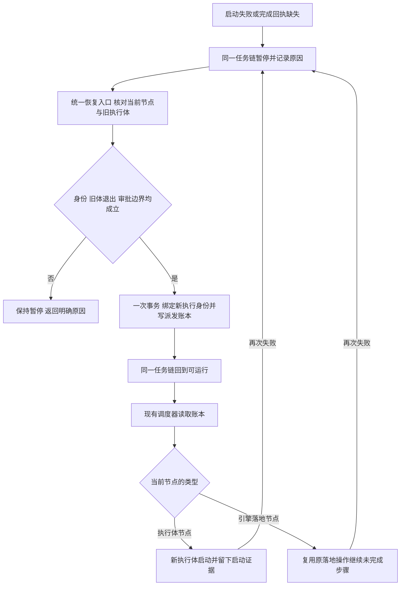

# FLY-2922 held 后统一重派当前节点 — 实施计划
Issue: FLY-2922 (https://linear.app/geoforge3d/issue/FLY-2922/病根修复-8-held-回滚之后有出口只留一个统一恢复口放行必须真铸出派发关死体不连带终结-run9-张-37)
日期: 2026-09-26
基于: 无

状态：待设计审阅。设计节点，不含实现或生产验证。基线 `af853328d`。

## 1. 给 founder 的结论

卡住后只做一个动作：重派当前节点，并留下新的派发凭据；原任务链、分支和仍然有效的审批继续保留。

run 是一条任务链，Runner 是其中干活的执行体。关掉死掉的执行体不代表放弃任务链。held 表示任务链暂停；故障原因可以有很多种，但恢复动作只有一个。放行回执必须带出新派发身份，不能仅显示“已恢复”。

不采用旧盘点 FLY-2329 的“先终结旧 run 再新建”建议：本单最新要求明确重派当前节点，且 FLY-2524 要避免丢失仍有效的审批。恢复不是批准；审批绑定内容/head 改变时仍须重新走原审批链。



### 交付与边界

- 删除工作流故障的按原因 resume 分支，保留诊断原因、审计历史和安全前置条件。
- 同一 run/current node/attempt 的物理替换使用新 executionId 与递增 launch ordinal；业务返工的 attempt 增长仍归现有返工协议。
- 不伪造完成、审批、启动收据；不重做已完成节点、不改变 pinned snapshot、不清除其他节点的驻留执行体。
- 本单不重写 mailbox/CommDB 投递协议、额度切号机制或落地外部副作用。它们的必要安全限制仍生效，且不能形成第二个工作流恢复状态机。
- design 阶段只审计、计划、HTML、评审与交接；实现与 QA 后续各自验证。部署仍由独立 updater 执行。

## 2. 当前证据与盘点逐项处置

证据：`engineering/doc/FLY-2072-triage/tickets.json`、`fixclasses.json`、PR #1347 盘点，以及以下当前源码。×37 是历史盘点次数，不是本次测试结果。

| 原单 | 当前源码/现象 | 本单处置及必须保留的反例 |
|---|---|---|
| FLY-2329 ×21 | StateStore.ts:58340、58459 只 UPDATE pending + execution_id=NULL；dispatcher 读的是 side-effect ledger | 恢复事务实际调用分配派发账本方法；无账本不得成功。重复请求不再增行 |
| FLY-2295 ×6 | writer 守卫在 62118；但 enrolled 当前 `commitEnrolledCompletion` 已在事务内先完成转换、后投影 session（65145–65364），旧盘点不是当前全貌 | 保留原子顺序并锁回归；审计 legacy stage/complete 对 enrolled 的写入；历史缺回执只重派，不再 reconstruct 成功 |
| FLY-2116 ×3 | 40938–40951 rollback 同时 run held、rework delivery held；协调器不认领 held | 回滚只留下统一 run 恢复状态；同一 rework request/route/path 精确重绑新体并恢复 replacement_pending；无双重人工解冻 |
| FLY-2524 ×2 | openOperatorRework:53126 起按 hold 种类分叉；dispatcher:2464–2498 严格检查 replacement request/actor/reason/state | held 当前节点恢复不再要求所有驻留 QA 死亡，不新建返工请求；同步旧 path/route/delivery、保留批准的原 head，禁止同 run 两个活跃返工路径 |
| FLY-2095 ×1 | cascadeRunTerminationOnCarrierClose:50682、50791；仅 active 会级联，held 当前已被 run_not_active 拒绝 | 删除 carrier-close→run terminal 的隐式路径及三个调用点，保留显式 run terminate 和正常引擎终态 |
| FLY-2181 ×1 | event-route.ts:1675 founder review 守卫只看节点能力、不看 blocked route | blocked 新增 enrolled 专用失败登记，无成功产物/founder-review 准入；身份、TURN、重复提交与失败原因仍校验 |
| FLY-2191 ×1 | pruneWorkflowDeadExecutionWatches:60396 的非 active 删除和 TTL OR 都能删除 held 所需证据 | 未终态 run 的未收敛 watch 不因 TTL/held 删除；仍保留死体复活探测与有限批量清理 |
| FLY-2525 ×1 | rollbackDeadWorkflowNodeExecution:61207 先查 isExecutionPaused(deadExecutionId) | 清理已证死体不受旧额度暂停阻断；只在新 launch 准入检查当前额度；只收敛精确死 execution 对应暂停引用 |
| FLY-2545 ×1 | resume_land_operation:58222 仅改 op，但当前 resumeWorkflowHold 外层:59048 已按 remainingRunHolds 改 run active | 不声称外层缺失。增加多 hold/重复失败真实回归；统一事务中重臂同 operation + run 可运行 + 新 land 派发，禁止只重开 op |

新增同形回归：FLY-2901 QA head 读取超时后 unlaunched rollback；FLY-2914 design 起步死且 completion_receipt_missing。都不得要求 terminate 重开。

### 数据与消费者（当前）

- `StateStore.allocateWorkflowLaunchOrdinalTx`（86433）原子 INSERT `workflow_side_effect_ledger(kind='dispatch', state='intent_recorded')` 并 mint launch delivery attempt；这是派发源，不是 `node_dispatched` 展示事件。
- `WorkflowEngineDispatcher`（396、1462、2271）扫描账本、校验 run active、解析 pinned node，再走普通/返工 launch 或 land executor。新节点 pending 不会凭空被扫描。
- `workflow_execution_binding` + activation 身份、launch owner/cancellation fence、精确窗口与 marker 是隔离旧体的现有证据。execution 的 terminal status 不是物理死亡证明。
- `workflow_rework_request / route_revision / delivery / verification_path` 是业务返工的现有事实；`resolveOpenWorkflowReworkTarget` 和 dispatcher replacement guard 必须同步满足。
- `runs-route.ts:448–545` 的 hold list / resume stage / resume apply 受 master + loopback origin + 一次 confirm token 保护。继续用这个入口，不加第二个 recover API。
- `flywheel-comm/src/commands/hold.ts`、hold-shape-registry、run detail 的 hold 消费者，以及 `codex-quota-store.ts:1059,1199` 的 hold 事件枚举必须随归一化更新；旧原因保留为历史别名。
- `lifecycle-routes.ts:301` 的 land full resume 对 engine-owned run 改为调用同一个恢复服务；非 workflow 的 legacy land 和 `closeout_only`/reclose 仍保留其专有权限，不能用本单恢复越过已合并后的收尾权限。

## 3. 单一恢复合同

### 3.1 一个状态，一个入口

新工作流故障写 `run_recovery_required` 事件（原因是 payload，不再决定 resume 算法），run 保持已有 `held` 状态；不新增 run status 或 hold 表。事件绑定 `{runId,nodeId,attempt,executionId,launchOrdinal,reason,sourceEventUid}`。同一当前节点的历史多条未消费故障归并成一个 episode，以不可变源事件 UID 集合的排序摘要作为 `holdSetDigest`。旧事件不删除、不重写。

`hold list` 对工作流恢复展示一行 `shape=workflow_node_recovery`、当前 tuple、全部诊断原因和不满足的前置条件。旧 `--shape` 和 `--hold-event` 输入只作为兼容定位，stage 端归一成当前统一 canonical，不能执行旧 switch。网络调用方无需猜恢复种类。现存 delivery-only/CommDB hold 是投递修复操作，不进入本单重派算法；若它真实阻断当前节点，统一入口显示精确 dependency，完成投递修复后仍经同一恢复入口。禁止把所有邮件失败无差别转成重派。

全部 run 级旧形状的处理：unlaunched、completion_missing、retry/environment、rework stalled/pane loss/exhausted、land、operator hold、gate preflight、loop limit、idle spin 都进入同一恢复前置/派发事务。预算与人工决定是前置证据，不是隐藏的另一套恢复实现。operator hold 的活体须由原关闭权限路径先安全收回当前写者；loop/idle 的继续决定不得伪造成功边或改变当前节点。未来如需业务返工/跳节点，仍是明确的业务动作，不能搭恢复便车。

### 3.2 请求与回执

扩展现有 stage canonical（版本 2）；新字段全由 server 解析并经 canonical digest/token 绑定：

```ts
type RecoveryTarget = {
  runId: string; nodeId: string; attempt: number;
  previousExecutionId: string | null; previousLaunchOrdinal: number;
  snapshotDigest: string; holdSetDigest: string;
  sourceHoldEventUids: string[];
  rework: null | { requestId: string; routeRevision: number };
  land: null | { operationId: string; resumeGeneration: number; approvedHead: string };
};
type RecoveryReceipt = {
  operationId: string; canonicalDigest: string; target: RecoveryTarget;
  executionId: string; launchOrdinal: number; dispatchLedgerId: number;
  state: 'dispatch_recorded'; idempotentReplay: boolean;
};
```

沿用 `workflow_delivery_operation(kind='hold_resume')` 的 requestId 唯一性和 digest。增加 nullable `recovery_receipt_json` 保存以上回执，旧行无需回填。只有新统一操作必须非空；当前操作表的状态仍用 projected，响应的 dispatch_recorded 明确只承诺已持久化派发。GET receipt/list 显示该账本现在的 intent_recorded/launch_committed/started/abandoned 与诊断，不能把 accepted 当 launched。land executionId 是引擎调度身份，不是声称启动了人类可见的 Runner。

- 同 requestId/同 canonical：先读持久回执并返回原身份，允许响应丢失后的重试；不得重新 mint。
- 同 requestId/异 canonical：409 request_conflict。不同 requestId 但旧 tuple/旧 episode：409 recovery_target_changed，附当前可公开身份和原恢复 operationId。
- stage 无写；apply 在单事务内重验全部身份。合法 token 也不能授权 stale tuple。
- HTTP 200 必须同时存在新账本、当前节点绑定、run active、receipt；缺任何一项事务回滚。明确的未满足条件返回 409 与 reason，不能先持久化成功 operation 再拒绝。
- 旧成功 receipt 保持可读；`recovery_receipt_json=NULL` 标为 legacy_result，不补铸新体、不报告新派发成功。

### 3.3 统一事务的固定顺序

1. 事务外由可信服务读取精确旧 execution 的 liveness、launch owner、cancellation generation、marker/window 证据。沿用 dead/unlaunched recovery 探测；不得接受 HTTP 客户端自报 dead。alive/unknown 拒绝物理替换；无旧 execution 的 legacy pending 必须能由旧 rollback UID 唯一定位，不能按最新 issue session 猜。
2. 事务内读取 canonical 相同请求的 receipt；否则重验 run engine-owned 且 held、snapshot/current tuple/holdSetDigest、旧节点无已提交 completion/transition、所有相关 owner generation 未变。已完成或已取消/终结 run 不恢复。存在有效 completion 则由原完成幂等路径回放，本操作返回 completion_already_committed，不派新体。
3. 废止旧体写权限：复用精确 execution 的 cancellation fence、未消费 submission/output credential revoke、binding/activation supersede/close、lease 结算。保留所有历史证据；不把 started/launch_committed 的账本倒写 abandoned。仅有 pre-commit 非启动正证据的 intent 能 abandon。
4. 固定 current nodeId 和 attempt；服务端生成新 executionId。调用 `allocateWorkflowLaunchOrdinalTx`（purpose=fault_replacement，不新增 purpose），得到新 ledger ID 与递增 ordinal。将节点绑定为 pending/new execution；不清空成 NULL。新 activation、输出 credential、submission credential 仍由现有 admission 铸造，绝不复用旧凭据。
5. 关联对象归一（下面 §3.4）：只更新这个节点/请求/操作；保持原 snapshot、runId、worktree、branch、业务 attempt、批准 head 不变。参数化 SQL 每个 CAS 必须恰好一行；不成功就 throw 回滚。
6. 同事务写新 `node_dispatched`、恢复 receipt、逐个 source UID 的 `hold_resumed`（供历史消费者关闭），清除此次 episode；run held→active。其他真实未解决 run blocker存在则在步骤 2 拒绝，不能 mint 后依然 held。多条同故障旧日志不算新 blocker。
7. commit 后由现有 dispatcher 消费。提交后进程崩溃或 HTTP 丢包无需补偿删除，重启扫描同一 ledger。启动失败形成新的统一 episode，恢复按钮持续可用；重复 request 仍返回旧回执，新 episode 才允许再次 mint。

重点并发：将统一恢复与自然完成/自动 dead rollback/显式 terminate/新 rework 的写 CAS 建在同一 current tuple 上。完成先提交则恢复失败；恢复先提交则旧完成为 stale_execution_superseded，不能推进 successor。自动恢复继续使用原重试上限，本单不无限 reset faultReplacementCount；明确 operator 确認的新恢复代不抹历史计数，下一次失败继续呈现统一入口。

### 3.4 关联对象不是新的恢复分支

**返工：** 保留 requestId、原反馈、base_revision、verification_policy 和目标 attempt。恢复事务追加 route revision（preferred_actor_execution_id=新体），delivery 精确同步 revision/state=replacement_pending、清 owner/lease/旧 wake；verification path 同 revision 回 pending，不产生第二个 active path。新 dispatch.reason 必须等于 `rework_replacement:<requestId>`，否则当前 dispatcher 会永久 fence。协调器只认领这个替代意图，不自己再 mint 第二具。旧 wake 的退休采用现有精确 replacement retirement 证明，不能取消未证明的 phase_wake；停驻的其他 QA 活体与本次 target quiescence 无关。需要 CommDB 投影的步骤走原持久投递协议，新体取得 TURN 以前不得写工作区。若关键 target 身份冲突，拒绝整个恢复而不是清空全部 rework 历史。

**Land：** 仍复用同 run/approved_head 对应的 `land_operation`、已完成步骤和外部收据；held→partial、递增 resume_generation、清 owner/lease/重试 epoch，绑定新引擎派发 ordinal，run 同事务 active。现有 dispatcher 的 `node.type==='land'` 分支执行原 operation。新 intent 不代表重新 merge；执行器继续检查 holder/head/PR/repo 和步骤幂等。若已有操作 owner alive/unknown、head 变更、operation 被 supersede，恢复拒绝并保留可见原因。engine-owned 的 full resume 入口只是同一服务的兼容适配；closeout_only 不降权、不转换成 full。

**审批/gate：** 同内容批准保持原绑定。不能仅凭 session.completed 或边只有一条合成 completion；删除 reconstruct_completion 及其唯一 allowCompletedWriter 例外。人类 gate 节点不是 Runner 节点：统一 receipt 的 dispatch 消费必须显式按 pinned node type 走现有 gate-holder materialization/retry 通路，重用 question/holder，不创建新批准、不把 review gate 当普通 Runner 启动。gate holder 的活体权限/传输按其现有协议收敛，若不具备可重派的当前目标，返回 authority_pending；不得硬改 gate 状态放行。为这一 typed dispatch 增加 dispatcher 分支与回归，不能假设现有普通 launch 分支会正确处理 gate。

**额度：** 死体回滚不再读 `codexQuota.isExecutionPaused(deadExecutionId)`。完成绑定切换后用精确 execution + quota generation 的既有结算协议结束旧等待引用，不批量删除 incident/其他账号等待。新 dispatch 在 launch 时仍执行 `isCodexQuotaLaunchPaused` 和当前 launch flag/capacity 判断；被挡时展示已派发、尚未启动，不能写 started。

**Watch 保留：** prune 的优先判断改为不可恢复的 terminal run（completed/terminated/cancelled 等以当前 run enum 为准）或明确孤儿；active/held 的未收敛 watch 整体排除 TTL 条件。已收敛 watch 可按原 TTL 清理。保留批量 limit 200，held 跨 TTL 后旧体复活仍能触发原 fence/converge。

## 4. complete 与 carrier close

`commitEnrolledCompletion` 已有正确骨架：鉴权/当前写者 → completion + transition/下一派发 → session 投影，全部同事务。不要为修历史问题再造异步 completion 状态。保持当前失败 throw 回滚路径，补对 enrolled stage/legacy fallback 的审计防护：enrolled 终态投影只能从此原子提交或明确失败登记发生。未 enrolled legacy 行为不在本单扩大重写。

`blocked` 是报告失败而非申请成功推进：当前 `commitEnrolledCompletion` 的 route mismatch（64866）也拒 blocked，因此不能只跳过 founder guard。新增 `commitEnrolledFailure` StateStore 方法，由 event-route 在成功产物、review/head 与 founder review 校验之前分流：输入精确 executionId/activationId、sourceEventId、reason、可信 TURN/drain evidence；一事务内重验 current writer、登记幂等失败事件、将 node/session 标记失败并写统一 held episode，不插 workflow_node_completion、不推进 edge、不 mint successor 或 founder card。同事件同内容返回原失败回执，异内容 conflict；错误凭据或失去 TURN 不得写。CLI `complete.ts:296–324` 的 pending gate 不得伪装 blocked 规则保留；需等 gate 真正拒绝/明确失败后才可报告失败。恢复后重新执行当前节点。

`DirectEventSink.ts:678–715` enrolled 原始退出已经走 `recordEnrolledTerminalSignal`，保持退出≠成功。HTTP legacy `event-route.ts:3024` 和 `DirectEventSink.ts:1071` 有先 terminal 后补 evidence 的路径；实现须证明 enrolled 身份永远在前面的专用分流返回（含 stage/marker 重放），无法跌落这两处。若发现 enrolled 漏分流，修路由边界；不顺带改非 enrolled 生命周期。相关测试加入 `StateStore.engine-invariant.test.ts`、`event-route.test.ts`、两份 fly1427 terminal-immunity 测试、complete-marker-reconciler 测试。

删除 `cascadeRunTerminationOnCarrierClose` 的 run terminal 写入及 close-runner/actions 的调用与后续 terminal collection 触发。保留 prepare/commit close intent、精确进程关闭、credential revoke、mailbox 收尾；关闭当前体后确保统一 recovery episode 存在。关闭非当前/旧体不改 current run 状态。成功 ship/引擎业务完成、显式 run terminate/cancel 继续有原权威终态路径；不能因删除 cascade 让显式 terminate 遗留活体。

## 5. 删除与兼容清单

| 删除/收敛 | 替代 | 消费者处置 |
|---|---|---|
| run 故障形状中的 resume_unlaunched / retry_limit / reconstruct_completion / land 等 switch | 一个 recoverCurrentWorkflowNodeTx + typed dispatch | registry 保留旧事件解码 aliases，不再把 shape 当操作选择器 |
| openOperatorRework 中 held rollback/needs_lead 的恢复专门分支 | same-target held 请求指向统一入口；业务 rework 仍原语义 | /rework 返回统一恢复定位；不新增 request 来解除故障 |
| replacement 回滚再额外 delivery held | 统一 episode；恢复时一次重绑 request/route/path/delivery | coordinator 的认领条件与 dispatcher reason 一起改 |
| carrier close 级联 run terminal | 仅显式 run 级终止与正常工作流结束 | close-runner.ts + actions.ts 两处；反转旧测试 |
| completed-writer 恢复豁免 | 历史 completion 缺失重派当前节点 | 保留一般 writer_session_terminal 拒绝，删除唯一豁免 |
| dead cleanup 的 quota pause 前置 | quota 只守新 launch | scoped quota settle，不改全局自动切号 |
| watch 非 active/裸 TTL 删除 | terminal/已收敛后才可删 | dead-watch/dispatcher 相关回归 |

不净删 `hold` CLI；旧参数适配到统一 stage canonical。实现时记录带时间戳消费者 sweep：`scripts/`、`packages/`、插件 fork `external_plugins/`、本机 `~/.claude/plugins/cache/*/`；不可读 root 明确标未检查，不得当零引用。列出 hold shape 字符串、resume 返回字段、land full resume、close cascade 调用者的改造/兼容结果；不得编辑其他 checkout/插件缓存。hosted HTML 使用全部 textContent/value 与转义，单 nonced script，无外部依赖。

### 迁移与回滚

- schema 仅给 operation 增 nullable receipt 字段；旧诊断事件只读归一，升级启动不批量恢复、不 mint、不杀体。
- old held event 的 tuple 必须由 node/binding/ledger 交叉唯一确定；缺证据保持 held + 明确 repair_required。不得 `latest issue session` 猜出 authority。
- 所有新消费者先认识统一事件，再切 producer；一个 PR 同步上线。不让旧二进制写新 episode：运行期版本切换由 updater 按现有窗口执行。
- 应用回滚不撤销已提交 recovery/dispatch、不倒写 ledger、不恢复被撤销凭据；暂停新恢复入口，用持久账本对账后由支持新事件的兼容版本处理。禁止靠恢复旧 DB 或终结所有 run 回滚。

## 6. 实施顺序（设计交接，不在本节点执行）

每组按“先失败用例 → 仅运行该文件/用例 → 最小实现 → 同用例通过 → 定点 commit”；不要先跑全套。

1. **原现象夹具与账本断言**：修改 `packages/teamlead/src/__tests__/StateStore.workflow-holds.test.ts`；新增 `packages/teamlead/src/__tests__/workflow-node-recovery.test.ts`，把 §7 九行分别建独立夹具，不把它们折成一个 shape 参数化 UPDATE 测试。用 `StateStore.create(':memory:')`，afterEach close；重启用临时 test DB。
2. **统一事务与旧输入适配**：StateStore.ts 的 canonical/receipt/schema/hold projection/故障 producer/恢复事务；`bridge/hold-shape-registry.ts`；`bridge/runs-route.ts`；`flywheel-comm/src/commands/hold.ts`；相应 hold/runs-route 测试。保留阶段确认 token，不向客户端暴露秘密。
3. **派发、返工与 land 贯通**：`bridge/workflow-engine-dispatcher.ts`、`bridge/workflow-rework-coordinator.ts`、`bridge/lifecycle-routes.ts` 及 StateStore 关联写入；更新 typed gate dispatch 与 land recovery；不新造调度器或轮询队列。
4. **完成先后与失败出口**：`bridge/event-route.ts`、StateStore enrolled completion/legacy-terminal 防护，删除 reconstruct 分支；相关 complete 与 event-route 测试。不改变已有成功完成的原子协议。
5. **关闭与证据保留**：`bridge/close-runner.ts`、`bridge/actions.ts`、StateStore close cascade/watch/quota cleanup；必要的 `bridge/codex-quota-store.ts` 精确结算和事件枚举。保留独立 run terminate。
6. **消费端扫尾与逐行验收**：定点回归、重启/并发/失败注入；保存每个 issue 的 old tuple/new tuple/ledger/launch 证据；静态检查证明旧 resume switch 已删除且所有 hold writers 有统一投影。

实现约 8 个责任面，实际文件数可超过 8（含测试与兼容消费者）；不为了凑数字遗漏边界。

## 7. 验收矩阵与测试命令

共同成功断言：同 runId/snapshot/current node/attempt，new execution != old execution，ordinal 增 1；一条新 dispatch ledger + 一个对应 launch delivery；HTTP 成功回执绑定该行；dispatcher tick 实际消费到 launch_committed/started；普通 Runner 需精确 activation/window/启动证据。land/gate 用其类型的 executor/materialization 收据，不能捏造 Runner。intent_recorded 仅证明派发，不证明已经启动。

| 用例 | 构造原现象 | 必须额外证明 |
|---|---|---|
| 2329 | admitted 没 marker，取消 fence 后 rollback held，调用原 hold resume | 新体进入 dispatcher；runs/start 无需重开；相同请求重复 ledger 数不变 |
| 2295 | 历史 session completed、node running、无 completion；并模拟新 complete 的转换失败 | 历史恢复不补造成功，重派原节点；新路径拒绝后 session 不 terminal，成功才写 terminal/park |
| 2116 | rework replacement admission 失败回滚 | 同 requestId 新 actor/revision + replacement_pending，协调器/dispatcher 无永久 fence |
| 2524 | active verification path + 停驻活 QA + 替身体失败 | 仅目标体死亡证明即可恢复；QA 不关；旧 path 唯一性与 founder 原 head 绑定保存；改 head 的负控拒绝 |
| 2095 | sole current carrier close，run active，无其他派发 | run 不 terminal；统一入口可派；显式 run terminate 仍终止并收集全部体 |
| 2181 | prd/design 需要 founder review，但 complete route=blocked，无 card/head/成功 output | 失败事实被接收、不推进下一节点；之后同入口派当前节点；成功 route 无 review 仍拒绝 |
| 2191 | dead watch + run held + 超 TTL，然后恢复与旧体复活 | watch 保留、旧体写权被 fence、替身收敛；terminal/orphan/已收敛的清理负控 |
| 2525 | 精确 dead execution 留 quota waiting，分别开/关 launch flag | dead rollback 都可完成；新体 launch 仍受其当前 quota/容量限制，其他 execution incident 不变 |
| 2545 | land op held，run held，同 episode 多诊断；恢复后 executor 再失败再恢复 | run/op/dispatch 原子一致，两次恢复均有账本；同 op、merge 已做步骤不重复；活 owner/旧 head 拒绝 |
| 今晚两例 | QA head read timeout；design 起步即死缺 receipt | 同入口，无 terminate/start；失败前置不写虚假成功 |

故障注入：每个事务步骤抛错（所有行保持原值）；commit 后返回前宕机（同 request 原 receipt）；两个并发恢复（只有一个新身份）；恢复与 complete/terminate/rework 竞争（一个 CAS 胜出）；旧 token/改 tuple/跨 project/旧 actor/非法形状/活或 unknown 体（无写）；再次失败保留可恢复入口；旧体迟到 output/complete（拒绝并无 successor）。

执行命令从 repo root，按组运行，不得 `pnpm test`/全仓 build：

```sh
pnpm --filter flywheel-teamlead exec vitest run src/__tests__/workflow-node-recovery.test.ts src/__tests__/StateStore.workflow-holds.test.ts src/__tests__/hold-shape-registry.test.ts
pnpm --filter flywheel-teamlead exec vitest run src/__tests__/workflow-engine-dispatcher.test.ts src/__tests__/StateStore.workflow-rework.test.ts src/bridge/__tests__/workflow-rework-coordinator.test.ts src/bridge/__tests__/land-executor.test.ts
pnpm --filter flywheel-teamlead exec vitest run src/__tests__/StateStore.generalized-execution.test.ts src/__tests__/StateStore.workflow-engine-transition.test.ts src/__tests__/event-route-session-completed-guard.test.ts src/__tests__/event-route-dual-session-completed.integration.test.ts
pnpm --filter flywheel-teamlead exec vitest run src/__tests__/StateStore.workflow-close-cascade.test.ts src/__tests__/close-runner.test.ts src/__tests__/actions.terminate.test.ts src/bridge/__tests__/workflow-engine.fly2302-dead-body-commdb.test.ts src/__tests__/StateStore.codex-quota.test.ts
pnpm --dir packages/flywheel-comm exec vitest run src/commands/__tests__/hold.test.ts src/__tests__/complete.test.ts
```

实现新增与修改的 route/gate/land alias 测试也逐文件补跑。测试记录命令、时间、exit code、用例数、故障证据。当前设计阶段未运行这些行为测试、未声称九类修复已经可用。QA 使用真实公共入口加隔离运行夹具验证，不能只 mock mint 方法/只看返回 ok。生产验收另需授权，本设计不执行。

## 8. 风险与取舍

| 选择 | 为什么 | 拒绝的替代 |
|---|---|---|
| 同 run 重派当前节点 | 不丢 branch/snapshot/有效审批与历史 | terminate + 新 run：扩大语义并丢批准 |
| 账本与状态同事务 | 不存在 active/pending 但永不派发 | 先改状态、以后巡检补单：成功回执失真 |
| 旧形状只解码 | 保留迁移可读性，删除恢复决策分叉 | 给每种 hold 补一个 resume case：继续制造死路 |
| completion 只认真实提交 | 不将一次死亡变成成功交接 | completed session + 单边 推断成功 |
| 精确目标 quiescence | 不连带停驻 QA/其他节点 | 为恢复要求整条 run 所有体先死 |
| 无外部副作用事务 | 外部启动不可与 DB 原子提交，依赖 outbox 重放 | DB 成功就写 started、盲目重复 merge |

最大风险是“恢复只写出账本但 consumer guard 拒收”。因此返工 reason/actor/revision、gate typed consumer、land head/op generation、旧体 TURN 退休都列为合同与实测项，而非实现细节略过。
