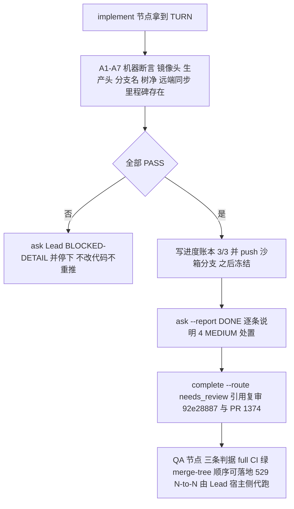

# FLY-2922 已复审实现头的 verify-then-submit 交卷合同 — 实施计划
Issue: FLY-2922 (https://linear.app/geoforge3d/issue/FLY-2922/病根修复-8-held-回滚之后有出口只留一个统一恢复口放行必须真铸出派发关死体不连带终结-run9-张-37)
日期: 2026-09-27
基于: research.md

状态：待设计评审。design 节点，不含实现或生产验证。沙箱基线 `1855f7a1a`；被核验的实现头 `2dd29e0276617cf21e31ce4bfe2a4df792d8cf0a`。

## 1. 给 founder 的结论

FLY-2922 的设计早已批准、实现早已写完并通过同头代码复审；这一轮 implement 节点**不写一行代码**，只做一件事：用机器断言证明「沙箱镜像分支头 = 生产 checkout 头 = `2dd29e027`，两处树干净」，然后引用复审 `92e28887` 交卷进 QA。任何一条断言不成立就停下问 Lead，不猜、不改、不重推。



## 2. 范围与不变量

- **只核验、不改动**：`packages/`、`scripts/`、生产 checkout 的任何文件都不改；沙箱分支只新增本文件夹下文档与 progress.md。
- **头是 40 位完整 SHA**：`EXPECT=2dd29e0276617cf21e31ce4bfe2a4df792d8cf0a`。短 SHA 只用于叙述。
- **两处核对**：沙箱 `origin/flywheel-FLY-2922`（镜像）与生产 checkout `/Users/xiaorongli/Dev/flywheel-FLY-2922`（Lead 交接里说的「拉分支核对头、树干净」）。任一不等即 FAIL。
- **不伪造可合并性**：镜像分支与沙箱 main 是两棵树（research §1 `merge-tree` 冲突），本 run 不在沙箱开「假装能合」的 PR；PR 证据按 Lead 答复走 Lane A / Lane B（§4）。
- **mutation freeze**：progress 账本的最后一次写入必须在最终 push 之前；push 成功后只读（核对 head、report、complete），head 不等也不再 re-push，只能 ask + 停。
- **合 main 冲突一律 abort + ask**：本合同不含任何 merge 动作；若 TURN 交到手时沙箱分支落后 origin/main 且需要同步，`git merge --abort` 后问 Lead，不预设取舍。

## 3. implement 节点合同（可照抄）

所有命令从沙箱仓库根执行（`progress` 在子目录会把相对路径拼两次）。runner shell 是 zsh：`$EXPECT:engineering/…` 会被 zsh 当作 `:e` 修饰符吃掉，必须写 `${EXPECT}:…`。`$FLYWHEEL_COMM_CLI`、`$FLYWHEEL_EXEC_ID` 由 runner env 注入；`flywheel-comm` 不在 PATH，必须 `node "$FLYWHEEL_COMM_CLI"`。

### Task 0 — 身份、TURN、收件箱（不计入 cursor）

```sh
node "$FLYWHEEL_COMM_CLI" turn --exec-id "$FLYWHEEL_EXEC_ID"      # 必须 yours phase=implement，否则每 60–90s 轮询
node "$FLYWHEEL_COMM_CLI" inbox --exec-id "$FLYWHEEL_EXEC_ID"
node "$FLYWHEEL_COMM_CLI" check 0d73b791-401b-40a3-b14a-68207eecfd03   # design 节点问 Lead 的 PR 证据基线；not yet = 走 Lane A
test "$(git rev-list --count origin/main..HEAD)" -le 12               # 沙箱分支只应比 main 多本轮 docs/progress 提交
```

### Task 1 — 机器断言（cursor 1/3）

```sh
EXPECT=2dd29e0276617cf21e31ce4bfe2a4df792d8cf0a
PROD=/Users/xiaorongli/Dev/flywheel-FLY-2922
git fetch origin flywheel-FLY-2922
git -C "$PROD" fetch origin flywheel-FLY-2922
test "$(git rev-parse origin/flywheel-FLY-2922)" = "$EXPECT"                 && echo A1 PASS || echo A1 FAIL
test "$(git -C "$PROD" rev-parse HEAD)" = "$EXPECT"                          && echo A2 PASS || echo A2 FAIL
test "$(git -C "$PROD" branch --show-current)" = flywheel-FLY-2922           && echo A3 PASS || echo A3 FAIL
test -z "$(git -C "$PROD" status --porcelain)"                               && echo A4 PASS || echo A4 FAIL
test "$(git -C "$PROD" rev-parse origin/flywheel-FLY-2922)" = "$EXPECT"      && echo A5 PASS || echo A5 FAIL
git -C "$PROD" cat-file -e "${EXPECT}:engineering/doc/milestones/FLY-2922.md"  && echo A6 PASS || echo A6 FAIL
test -z "$(git status --porcelain)"                                          && echo A7 PASS || echo A7 FAIL
```

| 断言 | 证明什么 | FAIL 的含义 |
|---|---|---|
| A1 | 沙箱镜像头未被覆盖 | 有人推了新头：停，问 Lead 新头与复审是否仍对应 |
| A2 | 生产 checkout 就是 Lead 交接的头 | checkout 漂移：不 checkout、不 reset，问 Lead |
| A3 | 生产 checkout 在正确分支 | 同上 |
| A4 | 生产树干净（Lead 原话「树干净」） | 有未提交改动：不 add、不 stash，问 Lead |
| A5 | 生产远端与本地一致 | 未推送或远端更新：问 Lead，不 push |
| A6 | 里程碑文件是该头的 literal-last 提交内容 | 交卷证据缺失：问 Lead |
| A7 | 沙箱工作树干净 | 本节点误改了东西：`git status` 列出后问 Lead，不自删 |

七条全 PASS 才进入 Task 2；任一 FAIL 执行 §5，cursor 不推进。

### Task 2 — 账本与冻结（cursor 2/3 → 3/3）

```sh
node "$FLYWHEEL_COMM_CLI" progress --exec-id "$FLYWHEEL_EXEC_ID" \
  --file engineering/doc/FLY-2922-unified-node-recovery/progress.md \
  --phase implement --cursor 3/3 \
  --next "A1-A7 PASS on 2dd29e027; no code change; report + complete needs_review (review 92e28887, PR #1374 Lane A)"
git push -u origin project-slot-2-FLY-2922
test "$(git rev-parse HEAD)" = "$(git rev-parse origin/project-slot-2-FLY-2922)" && echo PUSH-SYNC PASS || echo PUSH-SYNC FAIL
```

PUSH-SYNC FAIL → 不 re-push，§5。此后本节点对沙箱分支只读。

### Task 3 — 报告与交卷

```sh
PROD=/Users/xiaorongli/Dev/flywheel-FLY-2922
node "$FLYWHEEL_COMM_CLI" ask --lead flywheel-test-2 --exec-id "$FLYWHEEL_EXEC_ID" --report "DONE: FLY-2922 verify-then-submit | head: 2dd29e0276617cf21e31ce4bfe2a4df792d8cf0a (origin/flywheel-FLY-2922 = prod checkout flywheel-FLY-2922, both trees clean, A1-A7 PASS) | code review: 92e28887 APPROVED (2026-09-27 12:09:19Z) | MEDIUM dispositions: preadmission-producer-rework-carveout=landed (StateStore rework_delivery_owned); merge-order-dependency=stated in milestones/FLY-2922.md (FLY-2921 first, 5357dd5ce merged) and to be restated in PR #1374 body; shared-materializer-preconditions=landed (materializeWorkflowNodeReplacementTx checks held CAS/budget/writer proof); rework-replacement-context-not-preflighted=partial (engine_rework_replacement_context_invalid is a permanent pre-admission code -> single hold, no stage-time 409; PR Follow-up) | LOW follow-ups: section5-row-not-overridden, alive-rearm-route-source-unspecified, sibling-contract-unpinned, exhausted-return-alert-advertises-refused-door | commits: none (no code change) | PR: #1374 (prod, Lane A)"
node "$FLYWHEEL_COMM_CLI" complete --route needs_review --pr 1374 --target-repo "$PROD" \
  --summary "FLY-2922: verified head 2dd29e0276617cf21e31ce4bfe2a4df792d8cf0a (code review 92e28887 APPROVED); no code changes; submit to QA"
```

`complete` 成功输出会明说 run 已进入 engine-owned gate、本节点终结；照做退出，不 poll turn、不 verify-approval。

## 4. PR 证据两条 lane

| Lane | 触发 | 交卷参数 | 说明 |
|---|---|---|---|
| **A（默认）** | Lead 问题 `0d73b791` 无答复或答「用生产 PR」 | `--pr 1374 --target-repo /Users/xiaorongli/Dev/flywheel-FLY-2922` | `landingStatus.targetRepoPath` 明示证据来自生产 checkout；沙箱不开 PR |
| B | Lead 明确要求沙箱开 PR | 先 `gh pr create --base main --head project-slot-2-FLY-2922 --title "docs(FLY-2922): design-node verify-then-submit contract" --body-file /tmp/fly2922-pr-body.md`，再 `complete --route needs_review --pr <N>`（不带 `--target-repo`） | PR 只含本文件夹文档；body 写明该 PR 不承载实现、实现头在生产 PR #1374；`gh pr checks --watch` 在 `statusCheckRollup=[]` 时立刻 exit 1，先有界轮询 `gh pr view --json headRefOid,statusCheckRollup` 到非空再 watch |

两条 lane 都不改代码、不动生产 checkout。

## 5. 失败路径

任一断言 FAIL、PUSH-SYNC FAIL、`complete` 非零：

```sh
node "$FLYWHEEL_COMM_CLI" ask --lead flywheel-test-2 --exec-id "$FLYWHEEL_EXEC_ID" --report "BLOCKED-DETAIL: FLY-2922 verify-then-submit | failed: <A-id or step> | observed: <exact value> | expected: <exact value> | action taken: none (no checkout/reset/stash/push) | waiting for Lead"
```

然后每 60–90s `check <question-id>`；无答复不做任何猜测性修复。禁止：`git checkout`/`reset`/`stash` 生产 checkout、`push --no-verify`、改 hooksPath、为「让断言通过」而 fetch 后 reset 沙箱分支。

## 6. QA 节点判据（Lead 原文，不由本节点执行）

1. 新精确头 `2dd29e027` 的 full CI 全绿（生产仓 PR #1374）。沙箱 QA 节点第一动作 `node "$FLYWHEEL_COMM_CLI" ci-full ensure --pr 1374 --head 2dd29e0276617cf21e31ce4bfe2a4df792d8cf0a --json`；沙箱仓没有 PR #1374 时如实记录 exit 与输出，问 Lead，不拿沙箱空 CI 冒充。
2. 按 FLY-2921 先合的顺序可落地：`git -C /Users/xiaorongli/Dev/flywheel-FLY-2922 merge-tree --write-tree origin/main 2dd29e0276617cf21e31ce4bfe2a4df792d8cf0a` 无冲突（FLY-2921 进 main 后再验一次）。
3. 529 N-to-N 真 runner：等 Claude-Lead 房位，Lead 宿主侧起房代跑；QA 节点只记录 Lead 给的证据链接，不自己在沙箱冒充。

QA 只验、不改产品代码；FAIL 交回作者头。

## 7. 4 MEDIUM / LOW 的处置（交卷报告必须逐条复述）

| Advisory | 分支落点（research §2） | 报告措辞 |
|---|---|---|
| preadmission-producer-rework-carveout | `rework_delivery_owned` 拒绝 + failureKind 事件，1 测试文件 | landed |
| merge-order-dependency-unstated | milestone 已写 FLY-2921 先合、`5357dd5ce` 已合入 | stated；PR body 复述 |
| shared-materializer-preconditions | `materializeWorkflowNodeReplacementTx`（held CAS / budget / writer proof 在方法内） | landed |
| rework-replacement-context-not-preflighted | 无 stage 预检 409；以永久错误码一次登记回统一入口 | partial → PR Follow-up |
| LOW ×4 | — | PR Follow-ups：section5-row-not-overridden / alive-rearm-route-source-unspecified / sibling-contract-unpinned / exhausted-return-alert-advertises-refused-door |

## 8. 风险与取舍

| 选择 | 为什么 | 拒绝的替代 |
|---|---|---|
| 两处核对（镜像 + 生产 checkout） | Lead 原话核对的是生产 checkout；镜像是沙箱后继节点唯一能 fetch 的对象 | 只核一处：另一处漂移会让 QA 验错头 |
| 生产 PR #1374 作证据（Lane A） | 沙箱不存在能合的 PR；伪造沙箱 PR 会让 `ci-full ensure` 与 merge-tree 判据失真 | 沙箱开含 16k 文件冲突的 PR：不可合、CI 无意义 |
| FAIL 一律 ask + 停 | 生产 checkout 是 Lead 的工作区，runner 无权 reset/stash | 「顺手」checkout 到期望头：可能覆盖 Lead 未提交工作 |
| 账本先于 push | progress 命令会真实 commit；push 后再写会让 head 漂离 | push 后补账本：制造 head-authority 死锁 |

最大风险是 Lead 对 PR 证据 lane 的答复迟到；本合同让 implement 节点在无答复时仍能按 Lane A 一次性交卷，且 QA 判据不依赖 lane 选择。

## 9. 本 design 节点的验证边界

未运行任何实现测试；所有断言命令均在本机以当前状态试跑一次（A1/A2/A3/A4/A5/A6/A7 于 2026-09-27 全 PASS，见 research §1 与 delivery-evidence.md）。生产行为验收属于 QA 节点与 Lead 宿主侧 529 房。
